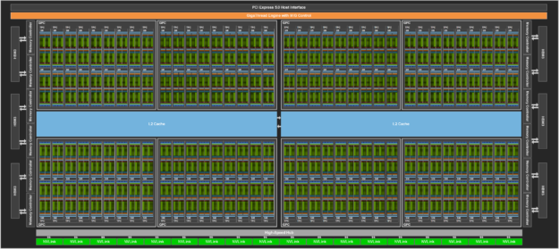

# 芯片架构：算力、显存与带宽

> 一切 AI Infra 优化的起点：&#8203;**算得快不够，还得喂得饱。**

## 一块加速芯片里有什么

以 NVIDIA H100 的芯片（GH100）为例，一块 AI 加速芯片大致由四类部件组成：

- **计算单元**&#8203;。GPU 有上百个流式多处理器（SM），每个 SM 里又有专门做矩阵乘加的**张量核心（Tensor Core）**&#8203;。一条张量核心指令能完成一小块矩阵的乘加，这是 GPU "算力"的主要来源——H100 的 BF16 稠密算力约 1000 TFLOP/s，几乎全部来自张量核心。
- **片上存储**&#8203;。寄存器和共享内存（每 SM 约二百多 KB）是最快的存储，但容量很小，只能装下正在计算的一小块数据。
- **显存（HBM）**&#8203;。高带宽内存（High Bandwidth Memory）通过硅通孔和芯片封装在一起，H100 SXM 有 80 GB，带宽约 3.35 TB/s——它是计算单元真正"吃得饱"的数据来源。
- **片上互联与卡间互联**&#8203;。L2 Cache（约 50 MB）在计算单元和显存之间做缓冲；NVLink 负责和其他卡说话（约 900 GB/s），PCIe 走主机（约 64 GB/s）。

*图源：[NVIDIA 开发者博客《NVIDIA Hopper Architecture In-Depth》](https://developer.nvidia.com/blog/nvidia-hopper-architecture-in-depth/)。*

一个有用的心理图像：&#8203;**把芯片想成一家餐厅，SM 是厨师，HBM 是仓库，仓库到厨房的传送带就是显存带宽**&#8203;。厨师再快，传送带送不上菜也得停工等食材。

## Roofline：算力还是带宽，谁在拖后腿

对一个运算，回答两个问题：

- 需要多少计算量？计算时间 ≈ FLOPs ÷ 峰值算力。
- 需要搬运多少字节？访存时间 ≈ Bytes ÷ 显存带宽。

实际时间约等于两者中较大的那个——这就是 **Roofline 模型**&#8203;：

$$T=\max\!\left(\frac{N_{\text{flop}}}{P},\ \frac{N_{\text{byte}}}{\beta}\right)$$

其中 $P$ 是峰值算力（FLOP/s），$\beta$ 是显存带宽（Byte/s）。两者相除得到**转折点**&#8203;：

$$I^{*}=\frac{P}{\beta}\quad(\text{FLOP/Byte})$$

一个运算的**运算强度**&#8203;（arithmetic intensity）$I=N_{\text{flop}}/N_{\text{byte}}$ 若低于 $I^{*}$，带宽就是瓶颈；高于它，算力才是瓶颈。代入 H100：$I^{*}=1000\ \text{TFLOP/s} \div 3.35\ \text{TB/s} \approx 300$ FLOP/Byte——&#8203;**每宇节显存流量至少要换回 300 次浮点运算，才算“喂饱”了这张卡**&#8203;。

::: mermaid
---
config:
  xyChart:
    width: 640
    height: 360
---
xychart-beta
    title "Roofline：性能上限 = min(峰值算力, 运算强度 × 带宽)"
    x-axis "运算强度 (FLOP/Byte)" [1, 10, 100, 300, 1000]
    y-axis "可达性能 (TFLOP/s)" 0 --> 1100
    line "带宽上限（3.35TB/s × 强度）" [3.35, 33.5, 335, 1000, 1000]
    line "峰值算力上限" [1000, 1000, 1000, 1000, 1000]
:::

*示意图，按 H100 BF16 参数（约 1000 TFLOP/s、3.35 TB/s）绘制。转折点约在 300 FLOP/Byte：运算强度低于它就是带宽受限。*

把大模型里常见的操作放上去，结论非常清晰：

| 操作 | 运算强度 | 瓶颈 |
| ---- | ---- | ---- |
| 大 batch 训练中的矩阵乘法 | 高 | 计算受限，利用率可达 60~80% |
| 解码阶段的单个 token 推理（要把全部权重读一遍，只算一次） | 很低 | 带宽受限 |
| softmax、残差加、激活函数 | ≈ 1 | 带宽受限，利用率只有 1% 量级 |

这解释了大模型系统里的两个基本现象：

1. **推理是典型的带宽受限负载**&#8203;。解码阶段每生成一个 token 都要把权重完整读一遍。设模型有 $\Psi$ 个参数、每参数 $s_\Psi$ 字节（BF16 时 $s_\Psi=2$），则单卡生成一个 token 的延迟下限为：

$$t\ \ge\ \frac{s_\Psi\cdot\Psi}{\beta}$$

  权重 175 GB 的模型（$\Psi=875$ 亿、BF16）：$t \ge 175\ \text{GB} \div 3.35\ \text{TB/s} \approx 52\ \text{ms}$——算力再富裕也用不上，这就是理论下限。后续讲到的 [KV Cache](/knowledge-planet/ai-infra/inference/kv-cache)、[量化](/knowledge-planet/ai-infra/inference/quantization)、[投机采样](/knowledge-planet/ai-infra/inference/speculative-decoding)，本质都在“提高每次读权重的产出”。
2. **训练优化的重点是让矩阵乘法之外的算子不拖后腿**&#8203;，比如算子融合（把若干带宽受限的小算子合并成一个）。

::: details 深入推导：Transformer 的计算量与 decode 的运算强度

**训练/前向计算量。**&#8203;忽略注意力矩阵自身，每个 token 经过每个参数恰好触发一次乘加（2 FLOP）。于是前向一遍全集数据需要 $2ND$ FLOP（$D$ 为 token 数），反向传播约为其两倍，合计：

$$C_{\text{train}} \approx 6ND$$

这是估算训练时间、成本的万能公式，后面[万卡集群](/knowledge-planet/ai-infra/hardware/large-scale-cluster)篇会反复用到。注意力矩阵项（$\sim 2LsD$ 量级）在 $s$ 不超过几千时占比通常不足 10%，估算时可忽略。

**decode 的运算强度。**&#8203;batch 为 $b$ 时，每步生成 FLOPs 为 $2b\Psi$，而要读的权重是 $s_\Psi\Psi$ 字节（与 $b$ 无关！），故：

$$I_{\text{decode}}=\frac{2b\Psi}{s_\Psi\Psi}=\frac{2b}{s_\Psi}$$

计算受限条件 $I_{\text{decode}} \ge I^{*}$ 给出 **batch 阈值**&#8203;：$b \ge I^{*}\cdot s_\Psi/2$。代入 H100 BF16：$b \ge 300\times 2/2 = 300$。即**在 H100 上做 BF16 decode，并发量不到 300 时，每多一个请求几乎都是白送的吞吐**&#8203;——这是 continuous batching 能大幅提升吞吐的理论根源（见后续推理板块）。

（据 Williams et al. 2009《Roofline: An Insightful Visual Performance Model》与 Llama 3 论文第 3.3.2 节的 FLOPs 口径。）

:::

## 算力与带宽，谁涨得更快

过去十年的趋势是：&#8203;**算力涨得比带宽快得多**&#8203;。把各代旗舰卡的转折点排成一张表，趋势一目了然：

| 芯片（年份） | BF16 稠密算力 | 显存带宽 | 转折点 $I^{*}=P/\beta$ |
| ---- | ---- | ---- | ---- |
| P100（2016） | 19.7 TFLOP/s | 732 GB/s | ≈ 27 FLOP/Byte |
| A100（2020） | 312 TFLOP/s | 2.04 TB/s | ≈ 153 FLOP/Byte |
| H100（2022） | 1.0 PFLOP/s | 3.35 TB/s | ≈ 300 FLOP/Byte |
| B200（2024） | 2.25 PFLOP/s | 8 TB/s | ≈ 280 FLOP/Byte |

九年之间，$I^{*}$ 涨了约 10 倍：以前 30 FLOP/Byte 就能喑饱的负载，现在要 300 才行。&#8203;**带宽受限区间的边界在大幅右移，越来越多的重要负载被甩进带宽受限区**&#8203;，意味着：

- 带宽受限的负载会越来越吃亏；
- 一切"减少数据搬运"的技术（融合、量化、缓存、批处理）的相对价值会越来越高。

这也回答了一个常见问题："买卡为什么不能只看 TFLOP 参数？"——因为绝大多数真实负载达不到计算峰值，&#8203;**对推理来说，显存带宽和显存容量常常比算力更决定性**&#8203;。

## 芯片对比：一张表看懂参数

| 参数 | NVIDIA H100 SXM | NVIDIA B200 | 华为昇腾 910B |
| ---- | ---- | ---- | ---- |
| BF16 稠密算力 | 约 1.0 PFLOP/s | 约 2.2 PFLOP/s | 约 0.4 PFLOP/s |
| 显存容量 | 80 GB HBM3 | 180 GB HBM3e | 64 GB HBM2e |
| 显存带宽 | 约 3.35 TB/s | 约 8 TB/s | 约 1.6 TB/s |
| 卡间互联（ NVLink/ HCCS） | 900 GB/s | 1.8 TB/s | 392 GB/s |
| 典型功耗 | 700 W | 1000 W | 约 400 W |

*数据来自各厂商公开资料，不同配置略有出入，看量级即可。*

注意 B200 把显存带宽提升到 8 TB/s——算力只翻倍而带宽接近翻 2.4 倍，$I^{*}$ 从 300 回落到约 280，正是在补“喂不上数据”的短板。

::: details 深入推导：峰值算力从哪里来，为什么实际达不到

**峰值算力核算（以 GH100 为例）。**&#8203;SXM 版 H100 有 132 个 SM，每个 SM 每 clock 做约 2048 次 BF16 MAC（4 组张量核心），boost 频率约 1.83 GHz：

$$P = 132 \times 2048 \times 2 \times 1.83\ \text{GHz} \approx 989\ \text{TFLOP/s}$$

与官方标称的 989.4 TFLOP/s（BF16 稠密）完全对上。乘 2 是因为一次乘加计 2 个浮点运算。

**为什么实际只有 40%~55%。**&#8203;峰值算力成立需要苛刻前提：计算单元每 clock 都有数据可用。真实训练中：

- 权重与激活的读写、softmax 等低强度算子占去的时间（可达 20~30%）；
- 流水线气泡（流水并行的空等）；
- 通信同步等待（allreduce）；
- kernel 启动与同步开销。

Llama 3 论文报告 405B 训练的 MFU 约 40%，MegaScale 在 12288 卡上做到 55.2%——这已是业界一线水平。&#8203;**MFU 每提升 1 个百分点，等于同样硬件上多出 1 个百分点的免费算力**&#8203;，这正是 AI Infra 存在的意义（后续板块逐层展开）。

**能效视角。**&#8203;H100 SXM 功耗 700 W，BF16 能效约 1.4 TFLOP/s/W；B200 功耗 1000 W、2.25 PFLOP/s，能效约 2.3 TFLOP/s/W。训练一个 Llama 3 405B 级模型耗电约数 GWh 量级——能源已是超大规模训练的一等约束（见[万卡集群](/knowledge-planet/ai-infra/hardware/large-scale-cluster)篇）。

:::

## 小结

- 加速芯片 = 海量计算单元 + 小而快的片上存储 + 大而慢的显存 + 卡间互联。
- Roofline 模型：性能 = min（峰值算力，运算强度 × 带宽）；训练偏计算受限，单 token 推理偏带宽受限。
- 算力涨得比带宽快，"少搬数据"是 AI Infra 一切优化共同的母题。
- 选卡先看负载落在 Roofline 的哪一段，再看参数表。

## 思考题

1. 把量化从 BF16（$s_\Psi=2$）换成 W4A16（$s_\Psi=1$），H100 上 decode 的延迟下限和 batch 阈值分别变成多少？
2. 你的模型 13B 参数（BF16），用峰值算力 1 PFLOP/s、HBM 带宽 3.35 TB/s 的卡做 decode：延迟下限是多少？要计算受限需要多大 batch？
3. 为什么 B200 的 $I^{*}$（约 280）比 H100（约 300）还略降了？这对推理服务意味着什么？

::: details 参考答案

1. 延迟下限 $t = 1\cdot\Psi/\beta$，减半；batch 阈值 $b \ge I^{*}\cdot s_\Psi/2 = 300\times 1/2 = 150$，也减半——量化同时降低延迟下限和“喑饱”门槛，这是它对推理的双重价值。
2. $t = 2\times13\times10^9/3.35\times10^{12} \approx 7.8\ \text{ms}$；$I^{*}\approx 300$，batch 阈值 $b\ge 300$。13B 模型单请求远喑不饱大卡，这类模型通常靠大批量换吞吐（见后续推理板块）。
3. B200 补带宽的幅度（×2.4）超过了算力增长幅度（×2.2）。对推理服务意味着：更多负载能进入计算受限区，大 batch 时吞吐上限更高；同时 8 TB/s 带宽缓解了大 KV Cache 的读取压力。

:::

## 参考资料

- Williams, Waterman, Patterson, [Roofline: An Insightful Visual Performance Model for Multicore Architectures](https://crd-legacy.lbl.gov/~swilliams/papers/roofline.pdf)（CACM 2009，开放 PDF）
- NVIDIA，[NVIDIA Hopper Architecture In-Depth](https://developer.nvidia.com/blog/nvidia-hopper-architecture-in-depth/)（官方架构博客）
- NVIDIA，[NVIDIA H100 Tensor Core GPU Datasheet](https://resources.nvidia.com/en-us-tensor-core)
- Huawei，[昇腾 910B 产品规格页](https://e.huawei.com/en/products/computing/ascend/910b)
