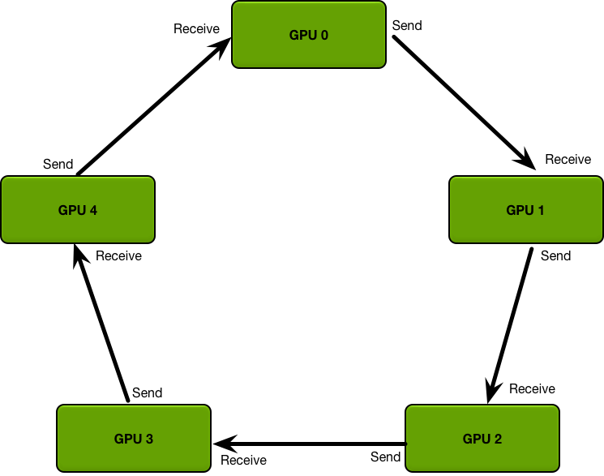

# 集合通信

> 多卡协作的基本语言。&#8203;**并行策略设计的本质，就是选择"在哪里通信、通信多少"。**

## 五个基本原语

集合通信（Collective Communication）是一组进程之间的批量通信模式。下面五个原语覆盖了大模型训练与推理 99% 的通信需求。设 4 张卡各持有 1 份数据块：

| 原语 | 做什么 | 结束时每卡拥有 | 典型用途 |
| ---- | ---- | ---- | ---- |
| Broadcast | 一卡 → 全体 | 每卡完整数据 | 广播模型参数 |
| Reduce / AllReduce | 汇总（求和） | 全卡都有汇总结果 | 数据并行的梯度同步 |
| AllGather | 每卡的碎片拼成全体 | 每卡都有所有碎片 | ZeRO 参数重建、序列并行 |
| ReduceScatter | 汇总后再切片 | 每卡只有结果的一片 | 梯度同步的省带宽版 |
| All-to-All | 每卡把数据分发给各卡 | 重新分组的数据 | MoE 专家并行、序列并行换轴 |

AllReduce 可以拆成 **ReduceScatter + AllGather** 两步实现——这个分解马上就会用到。

## Ring AllReduce：带宽最优的经典算法

AllReduce 最经典的实现是**环形（Ring）算法**&#8203;。把 N 张卡连成一个环，以"求和"为例分两阶段：

*图源：[Andrew Gibiansky 博客《Bringing HPC Techniques to Deep Learning》](https://andrew.gibiansky.com/blog/machine-learning/baidu-allreduce/)（源自 Baidu Ring AllReduce）。*

1. **Scatter-Reduce**&#8203;：每张卡把自己的数据切成 N 块，与右邻居做 N−1 步"发一块、收一块、边收边加"。N−1 步后，每张卡各持有完整求和结果的 1 块。
2. **AllGather**&#8203;：再沿环传 N−1 步，把每块的求和结果分发到所有卡。

关键结论：&#8203;**每张卡的总收发量恒为 $2(N-1)/N\times m$（$m$ 为总数据量），与卡的物理位置无关**&#8203;，且带宽随卡数近线性扩展。这是它成为数据并行事实标准的原因。把它写成时间模型：

$$T_{\text{ring}} = 2\,\frac{N-1}{N}\cdot\frac{m}{\beta} + 2(N-1)\,\alpha$$

其中 $\beta$ 是链路带宽、$\alpha$ 是单跳延迟。带宽项与 $N$ 无关（$N$ 大时趋于 $2m/\beta$），延迟项随 $N$ 线性增长——这个不对称决定了它的适用边界。

::: mermaid
flowchart LR
    G0["GPU 0"] -->|块 i| G1["GPU 1"]
    G1 --> G2["GPU 2"]
    G2 --> G3["GPU 3"]
    G3 --> G0
:::

*环形拓扑：每步沿同一方向传一块数据。*

## 带宽最优 vs 延迟最优

Ring 的短板在**延迟**&#8203;：N 张卡要走 2(N−1) 步，步数随规模线性增长。对小消息（例如数百 KB 的同步信号），几十步的固定开销远比带宽重要。所以：

- **大消息**&#8203;（梯度同步，GB 级）：用 **Ring / 树混合算法**&#8203;，追求带宽最优；
- **小消息**&#8203;（控制同步，KB 级）：用 **树形（Tree）算法**&#8203;，步数 O(log N)，追求延迟最优。

NVIDIA 的 NCCL 会自动根据消息大小、拓扑（NVLink/PCIe/IB）选择算法和路径，通常无需人工干预——但理解这个选择逻辑，才能读懂通信 profile。

## 放到并行策略的坐标系里

通信量、通信频次、能否与计算重叠——每个并行策略的通信特征都不同（详见后续训练板块的[并行策略](/knowledge-planet/ai-infra/training/parallelism/)）：

| 并行策略 | 通信原语 | 每步通信量 | 能否 overlap |
| ---- | ---- | ---- | ---- |
| 数据并行 | AllReduce | 大（正比于模型大小） | 可以（梯度分桶） |
| 张量并行 | AllGather / AllReduce | 很大，且每层都有 | 困难（层内依赖） |
| 流水并行 | 点对点（P2P） | 小（只传层边界激活） | 天然适合 |
| 专家并行（MoE） | All-to-All | 大，两轮/层 | 部分可以 |

这个表解释了超节点存在的意义：&#8203;**张量并行和专家并行的通信"重"到只能放在最高带宽的 Scale-up 域内；数据并行的梯度同步可以容忍较慢的跨机网络，用 overlap 掩盖**&#8203;。回看上一篇的量级估算——同一套算法，换个网络环境就是完全不同的训练效率。

还有一个容易被忽略的账：数据并行梯度同步占整个训练步的比例。用 ring 带宽项近似：

$$\rho = \frac{2(N-1)}{N}\cdot\frac{2\Psi}{B_{\text{eff}}\cdot t_{\text{step}}}$$

代入 7B 模型（梯度 14 GB）、$B_{\text{eff}}=450\ \text{GB/s}$：单步 1 s（大 batch）时 $\rho \approx 3\%$，完全可接受；单步只有 50 ms（小 batch）时 $\rho \approx 62\%$——&#8203;**同样的卡、同样的网络，batch 小一个量级，通信占比就天差地别**&#8203;，这是梯度累积和大 batch 训练的通信学解释。

::: details 深入推导：递归折半与在网归约

**递归折半/倍增（recursive halving/doubling）。**&#8203;allreduce 可以在 $\log_2 N$ 步内完成且总流量与 ring 相同：前 $\log N$ 步做 reduce-scatter（每步与相距 $2^k$ 的卡交换一半数据，收到即与本地相加），后 $\log N$ 步做 allgather（反向过程）。每卡总收发仍是 $2(N-1)/N\times m$ 字节——&#8203;**带宽项与 ring 持平、延迟项降到对数**&#8203;，代价是每步消息更大、对分片切分的要求更高。Patarasuk & Yuan (2009) 证明：把消息切分成 $N$ 个 chunk 沿 ring 流水化，带宽项可以做到只比理想情况差 $2(N-1)/N$ 因子，这是现代 NCCL ring 实现的理论基础。

**在网归约（in-network reduction）。**&#8203;传统 ring/tree 中交换机只转发不计算。SHARP（IB）与 NVLS（NVL72 的 NVLink Switch）把归约算力下推到交换机：各卡把待求和数据发到交换机，交换机内直接完成归约再发回，流量从"每卡收发两份"降为"一进一出"，带宽需求约省 2×。代价是交换机需要支持浮点归约单元，且可用的精度/算子组合受限。

**拓扑感知调度。**&#8203;同一集群内，NVLink（卡间）、PCIe（卡-CPU）、IB（机间）带宽相差 1~2 个数量级。NCCL 的算法选择本质是在这张异构图上做路由：优先走 NVLink 域内、跨机流量按 rail 对齐、机间用分层 ring（先机内归约再机间同步再机内广播）。读懂这一层，才能真正读懂 nccl-tests 里的 bus bandwidth 曲线。

:::

## 思考题

1. 64 卡 ring allreduce 同步 1 GB 数据，$\beta=450\ \text{GB/s}$、$\alpha=10\ \text{µs}$：总时间多少？改成 4096 卡呢（每卡带宽不变）？
2. 为什么 allreduce 能拆成 ReduceScatter + AllGather 且总流量不变？ZeRO-1/2 利用这个分解省掉了什么？
3. NCCL 实测 bus bandwidth 往往只有理论值的 70~80%，举出至少两个可能原因。

::: details 参考答案

1. $T = 2\times\frac{63}{64}\times\frac{1\ \text{GB}}{450\ \text{GB/s}} + 126\times10\ \text{µs} \approx 7.0\ + 1.26 \approx 8.3\ \text{ms}$。4096 卡：带宽项 $2m/\beta \approx 4.7\ \text{ms}$ 基本不变，延迟项 $2\times4095\times10\ \text{µs} = 82\ \text{ms}$ 反客为主——&#8203;**大 $N$ 下 ring 的延迟项逼迫系统换分层算法**&#8203;，这正是 NCCL 在万卡集群做机内+机间分层 ring 的原因。
2. reduce-scatter 让每卡持有梯度的一片归约结果，allgather 把所有片拼齐；两步顺序可交换，总流量均为 $2(N-1)/N\times m$。梯度同步只需要「每卡拿到完整的平均梯度」，ZeRO-1/2 正是利用这个分解：reduce-scatter 的结果本来就是切开的，直接省掉 allgather。
3. 典型原因：链路有效带宽低于标称（编码开销、协议头）；跨 PCIe/IB/NVLink 异构链路时的短板效应；拓扑不完全对称导致负载不均；小消息时延迟项占比高。

:::

## 小结

- 五个原语（Broadcast、AllReduce、AllGather、ReduceScatter、All-to-All）是一切分布式训练/推理的通信词汇表。
- Ring 算法让 AllReduce 的带宽成本与卡数无关地摊薄，是小规模域内的带宽最优解；树形算法补足小消息的延迟。
- NCCL 自动做算法与路径选择，但 profile 通信时要知道它在干什么。
- 每种并行策略有固定的通信指纹：看通信原语和通信量，就能推断它该放在超节点内还是跨机跑。

## 参考资料

- Gibiansky，[Bringing HPC Techniques to Deep Learning](https://andrew.gibiansky.com/blog/machine-learning/baidu-allreduce/)（Baidu Ring AllReduce 解析）
- Patarasuk & Yuan, [Bandwidth Optimal All-Reduce Algorithms for Clusters of Workstations](https://doi.org/10.1016/j.jpdc.2008.06.004)（JPDC 2009）
- NVIDIA，[NCCL User Guide](https://docs.nvidia.com/deeplearning/nccl/user-guide/docs/index.html)（含 NVLS 在网归约说明）
- Rasley et al., [ZeRO: Memory Optimizations Toward Training Trillion Parameter Models](https://arxiv.org/abs/1910.02054)（arXiv 1910.02054，并行通信模式）
