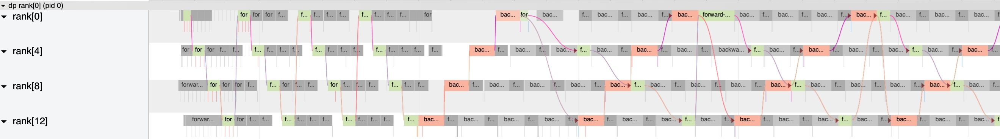

# 容错与 Checkpoint

> 万卡集群里，&#8203;**故障不是事故，是日程表上的一项。**

## 故障是常态：Llama 3 的中断账本

Meta 训练 Llama 3 405B 的 54 天里，发生了 419 次意外中断——平均每天约 8 次。按原因分类：

| 中断原因 | 占比 |
| ---- | ---- |
| GPU 硬件问题（HBM 等） | 58.7% |
| 主机硬件故障（CPU/内存/NIC） | 10.2% |
| 网络与电缆 | 11.4% |
| 软件与配置 | 9.3% |
| 计划内维护等 | 10.4% |

更扎心的是归因难度：硬件问题中约六成最终被定位到 GPU 本身，但一条 NVLink 链路抖动可能表现为任何一卡的 NCCL 超时。&#8203;**在万卡规模下，“定位一个故障”本身就是系统工程**&#8203;——字节 MegaScale 为此专门建了实时诊断系统，把集群所有事件汇到统一时间线上做自动归因：

*图源：[MegaScale 论文](https://arxiv.org/abs/2402.15627)（arXiv 2402.15627）。*

这个频率不是 Llama 3 特有的倒霉，而是统计规律。假设单卡平均无故障时间（MTBF）为 $M_{\text{card}}$，$n$ 张卡的集群在独立失效假设下：

$$\text{MTBF}_{\text{cluster}} = \frac{M_{\text{card}}}{n}$$

代入：单卡 MTBF 约 4 年（35040 h），16384 卡集群 $\to 35040/16384 \approx 2.1\ \text{h}$；Llama 3 实测每 3.1 h 一次中断——&#8203;**同一个量级，模型成立**&#8203;。这张表里最值得记住的直觉是：&#8203;**故障频率与集群规模成正比，规模翻倍、故障翻倍，与你的运维水平无关**&#8203;。

## Checkpoint：把时间倒回最近一次正确

故障恢复的基石是 **Checkpoint（检查点）**&#8203;：周期性地把权重、梯度、优化器状态、数据加载进度等完整训练状态写到存储，故障后从最近一次快照重启。

先算一笔时间账：2 万卡训练一个 405B 模型，完整训练状态约数十 TB。若每 30 分钟做一次 checkpoint：

- **保存成本**&#8203;：几十 TB 写入即使做到 TB/s 级也要几十秒，这段时间 GPU 在"陪跑"；
- **损失成本**&#8203;：故障后最多丢一个 checkpoint 间隔的进度，平均损失 15 分钟 × 2 万卡 = 5000 GPU 时。

两个成本此消彼长，最优间隔有经典解。设 checkpoint 写入耗时 $C$、集群 MTBF 为 $M$（单位与 $C$ 一致），&#8203;**Young 公式**&#8203;给出总时间开销最小的间隔：

$$t^{*} = \sqrt{2CM}$$

代入 $C=5\ \text{min}$（异步化后的有效停顿）、$M=3.1\ \text{h} = 186\ \text{min}$：$t^{*} = \sqrt{2\times5\times186} \approx 43\ \text{min}$。直觉：$C$ 越大越不敢频繁存（成本平方根增长），$M$ 越大越不用频繁存。&#8203;**异步 checkpoint 的本质是把 $C$ 压到接近零，从而既缩小间隔、又不增加停顿**&#8203;，两个成本同时下降。工程上的三板斧：

1. **异步 checkpoint**&#8203;：训练进程把快照交给后台线程/CPU 侧，写入与训练重叠，几乎零停顿（主流框架均已支持）。
2. **分片 checkpoint**&#8203;：每张卡只写自己那份状态（配合 ZeRO 切分），而不是先汇聚成完整副本再写——写入量不变但并行度拉满。
3. **分级写入**&#8203;：先写本地 NVMe 再异步转对象存储，把"快"和"稳"分开。

::: mermaid
flowchart LR
    A["训练进程 （不停顿）"] -- "状态快照 （GPU→CPU）" --> B["CPU 侧暂存"]
    B -- "异步写入" --> C["本地 NVMe"]
    C -- "后台转储" --> D["共享存储 （对象存储/3FS）"]
    E["故障发生"] -- "重启" --> F["读取最近快照 + 回放数据进度"]
    D --> F
:::

*异步分片 checkpoint 流程示意。*

## 比"重启"更进一步的手段

- **在线故障规避（in-band fault tolerance）**&#8203;：坏几张卡不重启，把坏卡所在的数据并行副本剔除、剩余副本继续训练（Llama 3 用此法吃掉大量短时故障）；恢复的卡热加入训练。
- **弹性训练（elastic training）**&#8203;：改变可用卡数后，用可变并行度的 checkpoint 让作业在新的世界规模上继续跑，不必回到"固定卡数"的假设。
- **快速回滚与降级**&#8203;：检测到数值异常（loss spike）时回滚到健康 checkpoint，并跳过可疑数据段——MegaScale 与 Llama 3 都内置了类似机制。

## 一笔总账

把上面的模型拼成一张账单。设故障恢复耗时（含重启、加载、回放）为 $t_{\text{restart}}$，checkpoint 间隔 $t^{*}$、有效停顿 $C$，集群 MTBF 为 $M$，则有效训练时间占比：

$$\eta \approx \left(1 + \frac{C}{t^{*}} + \frac{t_{\text{restart}}}{M}\right)^{-1}$$

代入一线水平（$C/t^{*} \approx 5/43 \approx 0.12$、$t_{\text{restart}}/M \approx 30/186 \approx 0.16$）：$\eta \approx 1/1.28 \approx 78\%$——即约五分之一的时间在陪跑。若把 $t_{\text{restart}}$ 压到 10 min（分片快恢复 + 在线剔除坏卡），$\eta \approx 90\%$。

Llama 3 的实测数字可以交叉验证：39.3M GPU 时账单 vs 约 26.6M 理想需求（复算见[万卡集群](/knowledge-planet/ai-infra/hardware/large-scale-cluster)篇），有效占比约 68%——&#8203;**与故障中断、重启、数值异常回滚的总量自洽**&#8203;。容错系统的目标，就是让"故障"对训练吞吐的侵蚀控制在个位数百分比。

::: details 深入推导：从 Young 公式到 Daly 公式

**Young 公式（1974）。**&#8203;周期 $t$ 内的总时间开销 = 训练 $t$ + 保存 $C$ + 期望故障损失 $t/2$（均匀分布）+ 重启 $t_{\text{restart}}$ + 快照回放 $C$。对 $t$ 求导取零，忽略次要项即得 $t^{*}=\sqrt{2C(M-t_{\text{restart}})}$，常简化为 $\sqrt{2CM}$。

**Daly 二阶修正（2006）。**&#8203;Young 假设故障均匀发生在区间内，但在（$t \ll M$ 的）短区间内故障到达更接近泊松过程，期望损失是 $t/2$ 加高阶项。Daly 给出：

$$t^{*} = \frac{M\left[\sqrt{2q(1-q)} + q\right]}{1 - q},\quad q = \frac{C + t_{\text{restart}}}{M}$$

当 $q \ll 1$ 时退化为 Young 公式。Daly 还证明：若 MTBF 本身估计不准，最优间隔对误差不敏感（$\sqrt{}$ 的平滑性），实践中 Young 公式已够用——&#8203;**这是一个对工程非常友好的理论结论**&#8203;。

**在线剔除 vs 重启的决策。**&#8203;设剔除坏卡后集群规模降为 $n' = n - k$，训练变慢但不停机；重启则损失 $t_{\text{restart}}$ 加回滚到上一个 checkpoint 的进度。经验法则：短时/单卡故障优先在线剔除（Llama 3 的选择）；若坏卡影响通信域完整性（如 NVSwitch 故障），则必须整机柜重启。Google TeraScale（Gemini 训练）进一步用冗余副本"不回滚"地绕过故障，代价是常态化的冗余算力。

:::

## 思考题

1. 你的集群 MTBF 是 2 h，checkpoint 有效停顿 2 min：Young 公式推荐的最优间隔是多少？有效停顿降到 0（完全异步）后呢？
2. 故障恢复时间从 30 min 压到 10 min，其他不变（$C=5$ min、$M=3$ h）：有效训练时间占比提升多少？
3. 为什么分片 checkpoint 能把写入时间从 $C$ 降到接近 $C/N$？它依赖上一篇的什么机制？

::: details 参考答案

1. $t^{*} = \sqrt{2\times2\times120} \approx 22\ \text{min}$；$C\to 0$ 时 $t^{*}\to 0$，保存不再有停顿代价，间隔只受存储带宽限制。这解释了为什么一线系统都在追求「准零停顿、分钟级间隔」。
2. $\eta$ 从 $1/(1+5/42+30/180) \approx 79\%$ 升到 $1/(1+5/42+10/180) \approx 92\%$——恢复时间比保存时间更值得优化，因为前者量级更大。
3. 分片后每卡只写 $M/N$ 的状态（ZeRO 切分的副产品），$N$ 张卡并行写，总时间 $	o C/N$；依赖的正是 ZeRO 状态切分——容错与显存优化共用同一套基础设施。

:::

## 小结

- 万卡规模下故障是高频事件，GPU/HBM 是第一大来源，快速归因需要专门的诊断基础设施。
- Checkpoint 的两难（保存开销 vs 进度损失）靠异步化、分片化、分级存储化解。
- 进阶手段是在线剔除坏卡与弹性训练，把"重启"变成"绕行"。
- 衡量容错水平的指标是有效训练时间占比，90% 是一线团队的及格线。

## 参考资料

- Grattafiori et al., [The Llama 3 Herd of Models](https://arxiv.org/abs/2407.21783)（arXiv 2407.21783，第 3.4 节训练稳定性）
- Wei et al., [MegaScale: Scaling Large Language Model Training to More Than 10,000 GPUs](https://arxiv.org/abs/2402.15627)（arXiv 2402.15627）
- Wang et al., *Gemini 训练容错实践（Google TeraScale）*，[HotChips 2024](https://hc2024.hotchips.org)
- Young, *A First Order Approximation to the Optimal Checkpoint Interval*, 1974；Daly, [A Higher Order Estimate of the Optimum Checkpoint Interval for Restart Dumps](https://doi.org/10.1016/j.future.2004.11.016)（FGCS 2004）
