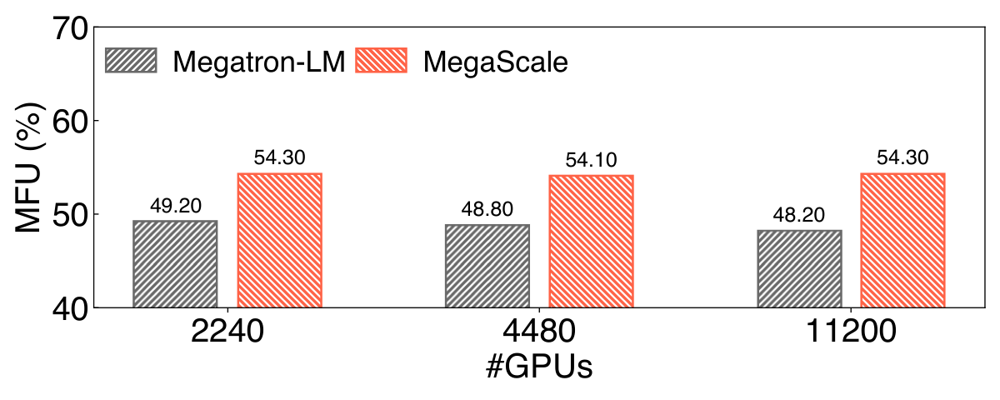

# 万卡集群

> 训练 GPT-4 级模型需要约 2 万张卡跑三个月。&#8203;**万卡集群不是一千台服务器的堆叠，而是一台精心设计的"网络计算机"。**

## 从 8 卡到 2 万卡：问题变了

单机 8 卡时，你只需要关心 NVLink 拓扑。到了万卡规模，新的问题占了主导：

- **跨机互联**&#8203;：上万张卡怎么连成一张低延迟、无阻塞的网络？
- **故障率**&#8203;：卡多了，任何时刻都有坏的和正在坏的（下一篇专门讲）。
- **功耗供电**&#8203;：2 万张 H100 连卡带机约 10+ MW，相当于一个小城镇的用电。
- **利用率**&#8203;：花几个亿建的集群，MFU（Model FLOPs Utilization，模型算力利用率）每差 1 个百分点都是巨款。

## 数据中心网络：胖树与轨道优化

跨节点互联主流是 InfiniBand（IB）或 RoCE 以太网，单条链路 400~800 Gbps。要让任意两台机器之间都能跑满带宽，经典设计是 **Clos/胖树（Fat-tree）拓扑**&#8203;：每台服务器接一层 Leaf 交换机，Leaf 之上再接 Spine，带宽逐层收敛或无收敛。

大模型训练在此之上加了一个关键优化：&#8203;**轨道优化（Rail-optimized）**&#8203;。每台 8 卡服务器的 8 张网卡各连一张独立的交换机平面（"轨道"），让 GPU 0 只和全集群的 GPU 0 说话、GPU 1 只和 GPU 1 说话——这恰好匹配数据并行和流水并行的通信模式：&#8203;**同号卡之间流量最大，让它们走最短的路径**&#8203;。

::: mermaid
---
config:
  look: handDrawn
---
flowchart LR
    subgraph rail0["轨道 0 交换机"]
        s0((" ")) 
    end
    subgraph rail1["轨道 1 交换机"]
        s1((" "))
    end
    n0["服务器 A GPU 0 | GPU 1"]
    n1["服务器 B GPU 0 | GPU 1"]
    n2["服务器 C GPU 0 | GPU 1"]
    n0 -- "网卡 0" --> rail0
    n1 -- "网卡 0" --> rail0
    n2 -- "网卡 0" --> rail0
    n0 -- "网卡 1" --> rail1
    n1 -- "网卡 1" --> rail1
    n2 -- "网卡 1" --> rail1
:::

*轨道优化示意图：同号 GPU 经同一轨道交换机互通，匹配并行切分后的通信模式。据 Llama 3 论文与 MegaScale 论文描述重绘。*

## 利用率：真金白银的 MFU

MFU（Model FLOPs Utilization）定义为实际达到的算力与峰值算力之比。它与训练时间的关系可以写成一个万能公式：

$$T_{\text{train}} = \frac{6ND}{n\cdot A_{\text{peak}}\cdot \text{MFU}}$$

其中 $6ND$ 是总计算量（见[芯片架构](/knowledge-planet/ai-infra/hardware/chip-architecture)篇），$n$ 是卡数，$A_{\text{peak}}$ 是单卡峰值算力。一个 55% 和一个 40% 的 MFU，意味着同样的训练量一个是 100 天、一个是 137 天。万卡训练的 MFU 每提升一个百分点都来自系统层的千锤百炼：并行切分、通信 overlap、算子优化、调度。

*图源：[字节跳动 MegaScale 论文](https://arxiv.org/abs/2402.15627)（arXiv 2402.15627）。*

字节 MegaScale 在 12288 卡上训练 175B 模型，通过分层切分、通信与计算重叠等一整套系统手段把 MFU 做到 55.2%——而竞品基线在同样规模只有约一半水平。&#8203;**集群规模翻倍而 MFU 不掉，是系统设计能力的试金石**&#8203;（弱扩展：规模翻倍、每个样本的计算量同步放大，理想情况吞吐同步翻倍）。

## 案例：Llama 3 的 1.6 万卡集群

Meta 训练 Llama 3 405B 用了 16384 张 H100，公开材料给出几个值得记住的量级：

- 集群由多个机柜域组成，域内 NVLink 互联、域间 RoCE 以太网；
- 54 天预训练期间经历 **400+ 次意外中断**&#8203;，平均每天约 8 次（细节见下一篇）；
- GPU 时长 3930 万小时，按利用率折算，任何一个百分点的浪费都是数十万 GPU 小时。

把 3930 万 GPU 小时拆开看，会发现一个反直觉的事实。复算「理想完成这次预训练」所需的 GPU 时：

$$\text{GPU 时} = \frac{6\times 405\times 10^9 \times 15.6\times 10^{12}}{989\times 10^{12}\times 0.4} \div 3600 \approx 2660\ \text{万}$$

（40% MFU 已是论文报告的一线水平。）而实际账单是 3930 万——&#8203;**约 32% 的 GPU 时花在了故障重试、被中断的运行和其他开销上**&#8203;。这笔「容错税」就是下一篇的主题。

对照华为 CloudMatrix 384：它把"超节点"从 72 卡推到 384 卡，相当于把 Llama 3 集群中一个域的规模放大 5 倍，域内跑专家并行的通信余量更充裕——两条路线在"集群"这一层重新会师。

## 功耗与成本：绕不开的物理账

- **功耗**&#8203;：集群总功耗可用 $P_{\text{total}} = n\,(P_{\text{card}}+P_{\text{host}})\cdot \text{PUE}$ 估算（PUE 是数据中心制冷等开销系数，优秀机房约 1.1~1.3）。代入 2 万张 H100（700 W/卡 + 约 300 W 主机均摊、PUE 1.2）：$P_{\text{total}} \approx 20000\times 1\ \text{kW}\times 1.2 = 24\ \text{MW}$——一座小城镇的用电功率；GB200 NVL72 机柜单柜约 120 kW，风冷已不够，要上液冷。
- **成本结构**&#8203;：万卡集群中 GPU 只占成本约六成，网络、存储、供电、机房同样吞金。
- **单位产出**&#8203;：一切要落到"每 GPU 时产出的有效 token 数"上。由训练时间公式反推：

$$\text{tokens/GPU 时} = \frac{\text{MFU}\cdot A_{\text{peak}}}{6N}$$

  代入 H100、MFU 40%：$0.4\times 989\times10^{12}/(6\times405\times10^9) \approx 163\ \text{token/GPU 时}$。按 $2/GPU 时的市场价，仅算力成本就约每百万 token 12 美元——这是所有"训练一个模型要多少钱"问题的底层公式。

## 小结

- 万卡集群 = 超节点（Scale-up）+ 数据中心网络（Scale-out），轨道优化让网络拓扑匹配并行通信模式。
- MFU 是万卡集群的核心 KPI，每 1% 都来自系统全栈优化。
- 规模上去了，故障与功耗从"异常"变成"日常"，系统设计必须以故障为前提。
- 算力单位的尽头是经济学：有效 token / GPU 时。

::: details 深入推导：胖树的带宽账与 MegaScale 的 MFU 分解

**胖树二分带宽。**&#8203;一个 $k$ 叉树最多连 $k^h/2$ 台机器（$h$ 层、根层分半）。"1:1 无收敛"意味着从任意一半到另一半的链路数 ≥ 机器数 × 单机网卡数。16384 卡 × 8 张 400 Gbps 网卡 = 集群双向注入 64 Tbps，最坏情况下二分带宽也要这个量级——对应最上层需要数百台 128 口 400G 交换机及其间上万条光纤。&#8203;**轨道优化并不减少总链路数，它只是把同样的链路按通信模式重新排列**&#8203;，这就是轨道交换机平面数 = 单机网卡数的原因。

**MegaScale 的 MFU 分解。**&#8203;论文报告 175B 模型在 12288 卡上 MFU 55.2%（基线约 48%），主要手段：流水并行气泡消除（可视化诊断找到长短不齐的 micro-batch）、通信与计算重叠（每层 allreduce 与反向重叠）、算子优化。这些手段都是可迁移的工程模式，而非某个模型的特例。

**弱扩展的定义。**&#8203;规模翻倍、每卡分配的数据量不变（总 batch 翻倍），理想情况吞吐翻倍、MFU 不变；实际上通信开销随规模增长，MFU 会缓慢下滑——下滑曲线的斜率就是集群互联质量的体检报告（见图中 2240→11200 卡）。

:::

## 思考题

1. 用训练时间公式估算：在 512 张 H100（MFU 45%）上训练一个 70B 模型、1T token，需要多少天？
2. 同样的训练搬到 4096 卡上（其他不变），理想加速比是多少？如果 MFU 掉到 38%，实际加速比又是多少？
3. 你的集群 PUE 是 1.25，每卡含主机均摊 1.1 kW：1 万卡一年耗电多少？按 0.6 元/度，电费多少？

::: details 参考答案

1. $T = 6\times70\times10^9\times10^{12}/(512\times989\times10^{12}\times0.45)\ \text{s} \approx 1.84\times10^6\ \text{s} \approx 21\ \text{天}$。
2. 理想 8×；实际 $8\times0.38/0.45 \approx 6.8\times$。规模扩展的收益永远要乘上 MFU 的衰减系数。
3. $10^4\times1.1\ \text{kW}\times1.25\times8760\ \text{h} \approx 1.2\times10^8$ 度；电费约 7200 万元/年——万卡集群的「电费税」一年就是小目标量级。

:::

## 参考资料

- Grattafiori et al., [The Llama 3 Herd of Models](https://arxiv.org/abs/2407.21783)（arXiv 2407.21783）
- Wei et al., [MegaScale: Scaling Large Language Model Training to More Than 10,000 GPUs](https://arxiv.org/abs/2402.15627)（arXiv 2402.15627）
- NVIDIA，[DGX SuperPOD 参考架构](https://www.nvidia.com/en-us/data-center/dgx-superpod/)
