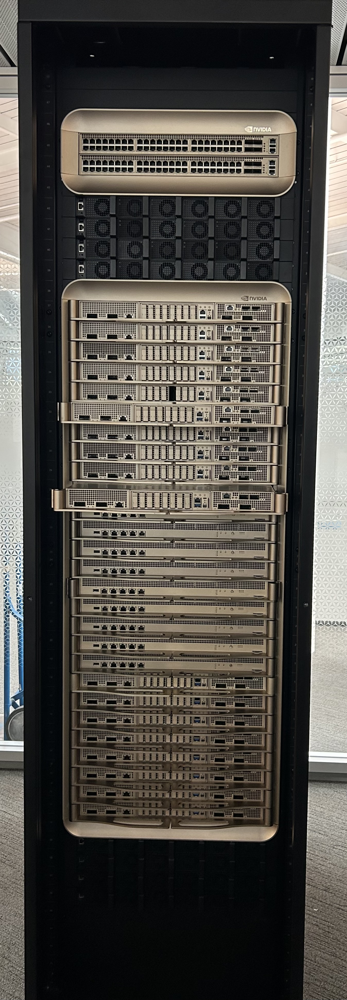
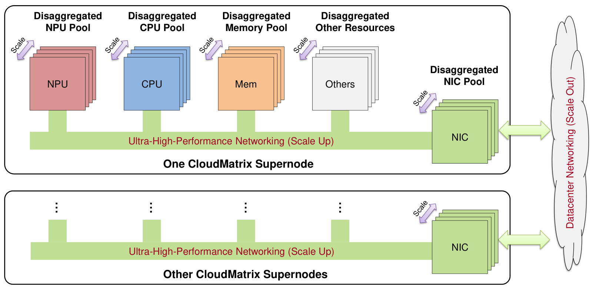

# 超节点

> 当一张卡不够用，第一种选择不是加机器，而是**把一个机柜焊成一台机器**&#8203;。

## 为什么需要超节点

上一篇讲到，卡间互联（NVLink 约 900 GB/s）比跨节点网络（IB 400 Gbps ≈ 50 GB/s）快一个数量级还多。如果把训练切到 64 张卡上，这些卡分在同一台 8 卡服务器里还是分散在 8 台服务器里，通信代价完全不同。

**超节点（Supernode）就是把一大组加速卡用最高速的互联"焊"成一个逻辑上的单机**&#8203;：机柜内所有卡之间都能以接近 NVLink 的带宽互相直达，共享一个统一的内存地址空间。在这个"大机器"内部跑张量并行、专家并行这类通信最密集的并行策略，几乎感受不到跨机开销。

一个直观的对照：NVIDIA DGX H100 服务器是一个 8 卡 NVLink 域，而 **GB200 NVL72 把 72 张 Blackwell GPU（36 个 Grace+Blackwell 超级芯片）放进同一个 NVLink 域**&#8203;，卡间双向总带宽 130 TB/s。华为的 **CloudMatrix 384** 更进一步，把 384 张昇腾 NPU 组成一个超节点，用自研 UB（UnifiedBus）互联。

*图源：[Wikimedia Commons（CC BY-SA）](https://commons.wikimedia.org/wiki/File:Nvidia_DGX_GB200.jpg)，NVIDIA DGX GB200（即 GB200 NVL72）机柜实拍。*

## 两家路线的对照

两家超节点的思路在架构图上看得非常清楚：

*图源：论文 [Serving Large Language Models on Huawei CloudMatrix384](https://arxiv.org/abs/2506.12708)（arXiv 2506.12708）。*

| 维度 | NVIDIA GB200 NVL72 | 华为 CloudMatrix 384 |
| ---- | ---- | ---- |
| 超节点内加速卡 | 72 张 B200 | 384 张昇腾 910C |
| 互联 | NVLink5 + NVLink Switch | 自研 UB（UnifiedBus） |
| 卡间带宽 | 1.8 TB/s/卡 | 约 784 GB/s/卡 |
| 设计哲学 | 单卡很强、互联从紧 | 单卡较弱、堆数量与互联补齐 |

单卡带宽不如对手，华为的答案是把超节点做得更大：&#8203;**更多的卡 + 更高密度的互联，让系统总带宽反超**&#8203;。代价是功耗与机房改造（CloudMatrix 一个超节点功耗约 500 kW 量级），收益则是大规模专家并行等通信饥渴型负载获得了充裕的互联余量。

## 超节点改变了什么

1. **并行策略的选择空间变大**&#8203;。张量并行、专家并行都要求"通信量大到跨节点就跑不动"。超节点把这些并行策略的适用规模直接放大了一个数量级。MoE 模型（如 DeepSeek-V3 的 256 个专家）在超节点内做大 EP，通信几乎"免费"。
2. **失效域变大**&#8203;。以前坏一块卡只影响 8 卡机，现在 NVLink 域内一个 NVSwitch 故障可能波及整个机柜。超节点越大，容错设计越重要——这是下一篇[容错与 Checkpoint](/knowledge-planet/ai-infra/hardware/fault-tolerance)的伏笔。
3. **Scale-up 与 Scale-out 的分界线**&#8203;。超节点内部叫 **Scale-up**&#8203;（纵向扩展，互联为主），超节点之间叫 **Scale-out**&#8203;（横向扩展，网络为主）。工程上的黄金法则：&#8203;**把通信最重的部分留在 Scale-up 域内，把通信稀疏的部分扔给 Scale-out**&#8203;。

## 量级估算：一次 All-Reduce 的代价

用集合通信的时间模型（下一篇展开推导）定量对比。allreduce $m$ 字节数据在 $N$ 卡环上的时间为：

$$T = 2\,\frac{N-1}{N}\cdot\frac{m}{\beta} + 2(N-1)\,\alpha$$

带宽项主导时只需看第一项。以 7B 模型 BF16 训练、每步同步 14 GB 梯度为例：

- **同机 8 卡 NVLink**&#8203;（有效带宽按 450 GB/s）：$T \approx 2\times\frac{7}{8}\times\frac{14\ \text{GB}}{450\ \text{GB/s}} \approx 55\ \text{ms}$；
- **跨 8 台机器 IB**&#8203;（每卡 400 Gbps ≈ 50 GB/s）：$T \approx \frac{7}{4}\times\frac{14\ \text{GB}}{50\ \text{GB/s}} \approx 0.5\ \text{s}$——一次同步就是秒级，训练效率直接腰斩。

这就是为什么"万卡集群"并不是 1250 台 8 卡机的简单堆叠，而要先在机柜内建成超节点、再谈集群——下一[万卡集群](/knowledge-planet/ai-infra/hardware/large-scale-cluster)篇展开。

::: details 深入推导：张量并行为什么不能跨超节点边界

**TP 通信量。**&#8203;Megatron 式张量并行中，每个 Transformer 层的前向有 2 次 allreduce（注意力输出投影后、MLP 输出后），每次搬运 $2bsh$ 字节（BF16 激活，$b$×$s$ 个 token × $h$ 维）；反向再各来一次。每层每 micro-batch 的通信总量约 $8bsh$ 字节。关键在于：&#8203;**它随层数线性累加，且在每个前向/反向的关键路径上，几乎无法与计算重叠**&#8203;。

**代入对比。**&#8203;取 $b=1$（decode）、$s=4096$、$h=8192$：每次 allreduce 128 MB，8 卡在 NVLink 域内（$\beta=900$ GB/s）：$T=2\times\frac{7}{8}\times\frac{128\ \text{MB}}{900\ \text{GB/s}} \approx 0.25\ \text{ms}$；若这 8 卡跨在两台机器上（$\beta=50$ GB/s）：$T \approx 4.5\ \text{ms}$——&#8203;**单层慢 18 倍，80 层累计每 token 多出几百毫秒**&#8203;，decode 吞吐直接塌方。这就是"TP 不出超节点"的定量依据。

**聚合带宽口径。**&#8203;超节点"总带宽"= 每卡带宽 × 卡数：NVL72 为 $72\times1.8\ \text{TB/s} = 130\ \text{TB/s}$（双向），CM384 为 $384\times0.78\ \text{TB/s} \approx 300\ \text{TB/s}$——后者以更多卡数反超，这正是 910C 单卡 UB 带宽（392 GB/s 单向）劣势下靠规模取胜的算账方式。

**CloudMatrix 论文的效率口径。**&#8203;论文报告 CloudMatrix-Infer 在 910C 上达到 prefill 4.45 tokens/s/TFLOPS、decode 1.29 tokens/s/TFLOPS 的计算效率，超过已发表的 SGLang on H100 与 DeepSeek on H800 结果；且通过 INT8（910C 峰值 1054 TFLOPS）弥补 BF16（752 TFLOPS）的算力差距。这说明：&#8203;**单卡参数落后时，靠系统设计（大 EP、融合 dispatch/combine、PD 分离）仍能拿到竞争力的人均卡效率**&#8203;。

:::

## 小结

- 超节点 = 用最高速互联把一个机柜的卡焊成一台"逻辑单机"，Scale-up 域内通信近乎免费。
- NVIDIA 用更强的单卡 + NVLink 域（NVL72），华为用更多卡 + 自研 UB（CM384），殊途同归：都为了让通信饥渴的并行策略跑得动。
- 超节点放大了并行策略的选择空间，也放大了失效域。
- 跨机带宽比卡间带宽慢一个数量级，这个差距决定了一切并行切分的基本原则。

## 思考题

1. 把 7B 模型梯度同步（14 GB）放到一个 72 卡的 NVL72 上（每卡 1.8 TB/s），ring allreduce 的带宽项时间是多少？
2. EP 度数从 8 提到 64，MoE 的 all-to-all 通信频率与单次通信量怎么变？为什么大 EP 需要超节点？
3. CM384 单卡带宽是 NVL72 的一半不到，但聚合带宽反超。这种"堆卡数换带宽"策略在什么负载下会失效？

::: details 参考答案

1. $T = 2\times\frac{71}{72}\times\frac{14\ \text{GB}}{1.8\ \text{TB/s}} \approx 15\ \text{ms}$——比 8 卡 NVLink 域（55 ms）还快，因为 ring 的每卡收发量 $2(N{-}1)/N\times m$ 几乎不随 $N$ 增长，而每卡带宽更高。
2. EP 度数提高后，单个专家服务的 token 数变少（专家粒度更细），all-to-all 仍是每层两轮（dispatch/combine），单次通信量不变但参与的卡更多、总流量不变；好处是负载更均衡、专家容量问题更小。大 EP 需要 Scale-up 域，因为 all-to-all 通信量大且无法高效重叠。
3. 通信量大但单消息小的负载（如高频小同步）：聚合带宽高不等于延迟低，CM384 跨两层 UB 交换的单跳延迟（论文实测约 1.2 µs）与协议开销会主导。另外对功耗/空间受限的场景，堆卡数的能效代价不可忽略。

:::

## 参考资料

- NVIDIA，[NVIDIA GB200 NVL72](https://www.nvidia.com/en-us/data-center/gb200-nvl72/)（产品页）与 [DGX GB200 技术简报](https://resources.nvidia.com/en-us-dgx-gb200)
- Xin et al., [Serving Large Language Models on Huawei CloudMatrix384](https://arxiv.org/abs/2506.12708)（arXiv 2506.12708）
- Shoeybi et al., [Megatron-LM: Training Multi-Billion Parameter Language Models Using Model Parallelism](https://arxiv.org/abs/1909.08053)（arXiv 1909.08053，TP 通信量模型）
