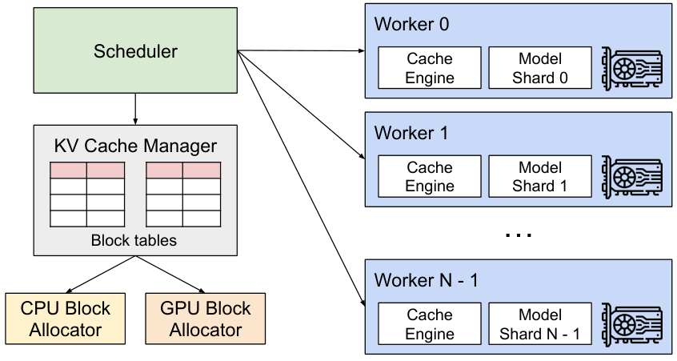

# KV Cache

> 推理系统里最重要的一个数据结构。&#8203;**显存带宽是[芯片](/knowledge-planet/ai-infra/hardware/chip-architecture)给的，KV Cache 是你自己花掉的。**

## 为什么必须缓存

自回归生成每个 token 时，注意力的 $Q$ 是新 token，但 $K$、$V$ 是全部历史 token 的投影。不缓存的话，每生成一个 token 都要把全部历史重算一遍 $K/V$——复杂度 $O(s^2)$ 的重计算。缓存后每步只需算新 token 的 $k_t, v_t$ 并追加大表，复杂度 $O(s)$。

## 显存账

[显存层次](/knowledge-planet/ai-infra/hardware/memory-hierarchy)篇的公式：

$$M_{\text{kv}} = 2\cdot L\cdot n_{\text{kv}}\cdot d_{\text{head}}\cdot s\cdot b\cdot \text{bytes}$$

代入 Llama-2-7B（$L=32$、MHA 32 头、FP16）：约 0.5 MB/token。&#8203;**它随并发 $b$ 与长度 $s$ 线性增长、完全动态、不可预测**&#8203;——这正是推理服务显存管理的核心难题：权重是静态的，KV 是活的。

## 碎片与浪费：为什么需要 PagedAttention

传统实现按"最大长度"预分配连续显存，实测利用率常低于 40%：

- **预留浪费**&#8203;：按 max_length 分配，实际只生成了一半；
- **外部碎片**&#8203;：请求长短不一，释放后留下 hole；
- **内部碎片**&#8203;：固定块内未填满。

vLLM 的 **PagedAttention** 借用操作系统虚拟内存的思想：KV Cache 切成固定大小的**块（block，如 16 token/块）**&#8203;，用块表（block table）维护逻辑→物理映射，按需分配：

*图源：[vLLM 论文](https://arxiv.org/abs/2309.06180)（arXiv 2309.06180）。*

效果：显存浪费从 60~80% 降到 4% 以下，同卡并发数翻倍以上——&#8203;**吞吐提升不是来自算得快，而是来自装得多**&#8203;。

## GQA 与 MLA：从结构上压 KV

- **GQA**&#8203;（分组查询注意力）：$n_{\text{kv}}$ 个 KV 头共享给 $n_q$ 个查询头，KV 直接除以组数（7B 从 0.5 MB/token 降到 128 KB/token）；
- **MLA**&#8203;（DeepSeek 多头潜在注意力）：把 KV 压缩到低秩潜在向量（每 token 576 维），比 MHA 省一个数量级，且配合[前缀缓存](/knowledge-planet/ai-infra/inference/prefix-caching)友好。

**结构级压缩（改模型）永远比系统级腾挪（改服务）收益大**&#8203;——但改结构要重训，两者是工程光谱的两端。

::: details 深入推导：decode 的 roofline 修正——KV 读取项

[芯片架构](/knowledge-planet/ai-infra/hardware/chip-architecture)篇的 decode 下限只算了权重读取：$t\ge s_\Psi\Psi/\beta$。batch $b$ 时每步还要读全部 KV：$M_{\text{kv}}(s)=2Ln_{\text{kv}}d_{\text{head}}s\,b\,\text{bytes}$。修正后的下限：

$$t \ge \frac{s_\Psi\Psi + 2Ln_{\text{kv}}d_{\text{head}}\,s\,b}{\beta}$$

代入 70B（GQA 8 头、$L=80$、$s=4096$、$b=32$）：KV 项 $=2\times80\times8\times128\times4096\times32\times2\text{B}\approx 17\ \text{GB}$，权重 140 GB——KV 已占 11%。当 $s$ 到 32K：KV 137 GB **反超权重**&#8203;。结论：&#8203;**长上下文大并发下，decode 的瓶颈从"读权重"漂移到"读 KV"**&#8203;，这决定了 [P/D 分离](/knowledge-planet/ai-infra/inference/pd-disaggregation)与 KV 卸载（Mooncake）的设计重心。

**Page 大小的权衡**&#8203;。块越小碎片越少，但块表查询与 kernel 访存越细碎（gather 访问丧失连续性）；vLLM 取 16 token/块，实测碎片 <4% 且访存效率损失可忽略。

（据 Kwon et al. 2023、Ainslie et al. 2023 GQA。）

:::

## 思考题

1. 32B 模型（$L=64$、GQA 8、$d_{\text{head}}=128$、FP16）：一条 16K 请求的 KV 多大？80 GB 卡、权重 64 GB，还剩多少并发空间？
2. 为什么"按最大长度预分配"在共享型服务里浪费尤其严重？
3. MLA 压缩 KV 为什么比 GQA 更激进？它的代价是什么？

::: details 参考答案

1. $2\times64\times8\times128\times16384\times1\times2\text{B}=4.3\ \text{GB}$/请求；剩余 16 GB → 约 3.7 条并发（还要留激活），并发空间极小——权重吃掉大头时 KV 空间就是稀缺品。
2. 共享服务请求长度方差极大（有人问一句、有人贴一篇论文）：按 max 预留时，短请求的预留全变浪费；方差越大、利用率越低。
3. GQA 只减少 KV 头数（组数下限约束），MLA 把 K/V 联合投影到低秩子空间（秩 512 级），压缩率更高且不损失注意力表达能力（理论可恢复）。代价：训练结构改变需重训、吸收矩阵计算使 prefill 计算量上升、实现复杂度高。

:::

## 小结

- KV Cache 使生成从 $O(s^2)$ 降到 $O(s)$，但其动态增长的显存是服务的核心约束。
- PagedAttention 用分页思想消灭碎片，把"吞吐"问题转化为"装得多"问题。
- GQA/MLA 从模型结构压缩 KV，收益大于一切系统优化。
- 长上下文大并发下，KV 读取反超权重成为 decode 带宽的主要消耗者。

## 参考资料

- Kwon et al., [Efficient Memory Management for Large Language Model Serving with PagedAttention](https://arxiv.org/abs/2309.06180)（vLLM，arXiv 2309.06180）
- Ainslie et al., [GQA: Training Generalized Multi-Query Transformer](https://arxiv.org/abs/2305.13245)（arXiv 2305.13245）
- Shazeer, [Fast Transformer Decoding (MQA)](https://arxiv.org/abs/1911.02150)（arXiv 1911.02150）
- DeepSeek-AI, [DeepSeek-V2](https://arxiv.org/abs/2405.04434)（MLA，arXiv 2405.04434）
- vLLM 项目，[GitHub](https://github.com/vllm-project/vllm)
