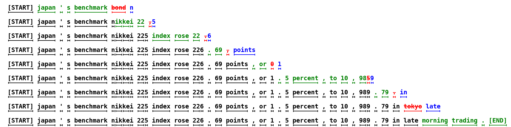

# 投机采样

> 小模型起草、大模型验卷。&#8203;**让带宽受限的大模型 decode 一次输出多个 token，且输出分布严格不变。**

## 解码的结构性浪费

decode 每步读全部权重（[带宽受限](/knowledge-planet/ai-infra/hardware/chip-architecture)），却只产出 1 个 token、只做 1 次"轻"计算——&#8203;**算力侧大量闲置**&#8203;。投机采样的洞察：用一次大模型前向**验证**多个候选 token，接受的候选"免费"产出。

## 机制：起草-验证-接受

1. **起草**&#8203;：小模型（如 1B）自回归快速生成 $\gamma$ 个候选 token（每个只花小模型的毫秒级时间）；
2. **验证**&#8203;：大模型一次前向并行处理这 $\gamma$ 个候选，得到每个位置的分布；
3. **接受**&#8203;：从左到右逐一接受；标准拒绝采样保证输出分布与大模型直接采样**严格一致**&#8203;：
   $$p_{\text{accept}}(x) = \min\left(1,\ \frac{p_{\text{target}}(x)}{p_{\text{draft}}(x)}\right)$$
   拒绝处用残差分布重采样一个修正 token，随后候选作废、回到起草；
4. **产出**&#8203;：每轮接受 $n\in[1,\gamma+1]$ 个 token（含修正 token）。

*图源：[Leviathan et al. 2023](https://arxiv.org/abs/2211.17192)（arXiv 2211.17192）。*

## 收益账

加速比：

$$E[\text{tokens per step}] = \frac{1-\alpha^{\gamma+1}}{1-\alpha},\quad \alpha = E[\text{接受率}]$$

$\alpha=0.7$、$\gamma=4$ 时约 2.4 倍。本质：&#8203;**用大模型一次前向的固定带宽成本摊出多个 token**&#8203;。代价：起草模型自身的开销（小模型每步也要读自己的权重）、验证比单 token 前向多算 $\gamma$ 倍计算（但对带宽受限的 decode，算力是闲置的）。&#8203;**接受率 $\alpha$ 是全部关键**&#8203;：草稿与大模型越"同心"，收益越高。

## 变体谱系

| 变体 | 草稿来源 | 特点 |
| ---- | ---- | ---- |
| 经典双模型 | 独立小模型 | 需维护两个模型、KV 分离 |
| 自投机 / Medusa | 大模型自身的多头 | 无需小模型，多头预测 $\gamma$ 个后继 |
| EAGLE | 大模型特征层的轻量头 | 接受率高（草稿看得见大模型内部状态） |
| Tree 投机 | 候选组织成树 | 一次验证多条路径，接受率再升 |
| N-gram / look-ahead | 重复模式推测 | 零模型成本，适合结构化文本（代码） |

::: details 深入推导：接受-拒绝流程为何严格保分布，及收益边界

**保分布证明**&#8203;。目标分布 $p$、草稿分布 $q$。候选 $x$ 的接受概率 $\min(1, p(x)/q(x))$，拒绝时从残差分布 $\text{norm}(\max(p-q,0))$ 重采样。合成分布：

$$p_{\text{final}}(x) = q(x)\min\left(1,\frac{p(x)}{q(x)}\right) + \text{norm}(\max(p-q,0))(x)\cdot\left(1-\sum_{y}q(y)\min\left(1,\frac{p(y)}{q(y)}\right)\right)$$

展开可验证逐点等于 $p(x)$——&#8203;**这是 Metropolis-Hastings 的特例**&#8203;，数学保证与"采样参数不变"共存，这正是投机采样敢于上生产的原因。

**收益上界与倒挂条件**&#8203;。$\gamma$ 增大：接受期望 $E[n]=\frac{1-\alpha^{\gamma+1}}{1-\alpha}$ 收敛于 $\frac{1}{1-\alpha}$，但验证的计算与 KV 读取线性增。设小模型时间占比 $\rho$、验证额外计算时间 $\tau\gamma$，加速比 $S(\gamma)=\frac{E[n](1)}{1+\rho\gamma E[n_{\text{draft}}]+\tau\gamma}$ 存在内部最优点。&#8203;**倒挂条件**&#8203;：$\alpha$ 低（草稿离谱，如代码变量名、长程推理）时 $E[n]\to1$，投机纯亏——这是"任务相关开关"的由来（同样解释了为什么验证器在请求级自适应调 $\gamma$）。

**与 [Continuous batching](/knowledge-planet/ai-infra/inference/continuous-batching) 的交互**&#8203;。批内多请求时，验证迭代仍是"权重读一遍、batch 维度并行"，投机收益在 batch 大时被稀释（带宽本已摊薄）——投机采样是**低并发场景的延迟优化**&#8203;，满载服务下收益趋零甚至负（这也是 vLLM 默认不开启、按请求动态启用的原因）。

（据 Leviathan & Kalman 2023、Cai et al. 2024 Medusa、Li et al. 2024 EAGLE。）

:::

## 思考题

1. $\alpha=0.8$、$\gamma=3$：每轮期望产出几个 token？理想加速比是多少（忽略草稿开销）？
2. 为什么代码任务适合 N-gram 投机而开放域聊天更适合 EAGLE？
3. 高并发满载服务要不要开投机采样？决策依据是什么？

::: details 参考答案

1. $E[n]=(1-0.8^4)/(1-0.8)=(1-0.41)/0.2\approx2.95$ token/轮；理想加速 2.95 倍——但实际还要扣小模型起草时间与验证的额外算力，约 2~2.5 倍。
2. 代码充满重复模式（变量名、缩进、模板结构），N-gram 零成本命中率高；开放域草稿分布复杂，需要 EAGLE 式"看得到大模型内部状态"的草稿器才能维持高 $\alpha$。
3. 用 batch 饱和分析：decode 已在带宽饱和点（$b\gtrsim I^*s_\Psi/2$）时，验证多算的 $\gamma$ 倍 token 仍要占同一带宽，收益归零；且草稿模型挤占显存。只在低并发、延迟敏感（TPOT 主导体验）时开启。

:::

## 小结

- 投机采样 = 草稿 + 并行验证 + 统计保真的接受-拒绝，输出分布严格等于大模型。
- 收益 $\frac{1-\alpha^{\gamma+1}}{1-\alpha}$，一切系于接受率 $\alpha$；任务相关，需自适应开关。
- Medusa/EAGLE 把草稿器做大模型自己的"斜杠器官"，N-gram 是零成本的代码特化。
- 定位：低并发延迟优化；高并发满载时让位给 continuous batching。

## 参考资料

- Leviathan & Kalman, [Fast Inference from Transformers via Speculative Decoding](https://arxiv.org/abs/2211.17192)（arXiv 2211.17192）
- Chen et al., [Accelerating LLM Decoding with Speculative Sampling](https://arxiv.org/abs/2302.01318)（arXiv 2302.01318）
- Cai et al., [Medusa: Simple LLM Inference Acceleration Framework with Multiple Decoding Heads](https://arxiv.org/abs/2401.10774)（arXiv 2401.10774）
- Li et al., [EAGLE: Speculative Sampling Requires Rethinking Feature Uncertainty](https://arxiv.org/abs/2401.15077)（arXiv 2401.15077）
- Liu et al., [Online Speculative Decoding](https://arxiv.org/abs/2310.07177)（arXiv 2310.07177，按查询分布自适应）
