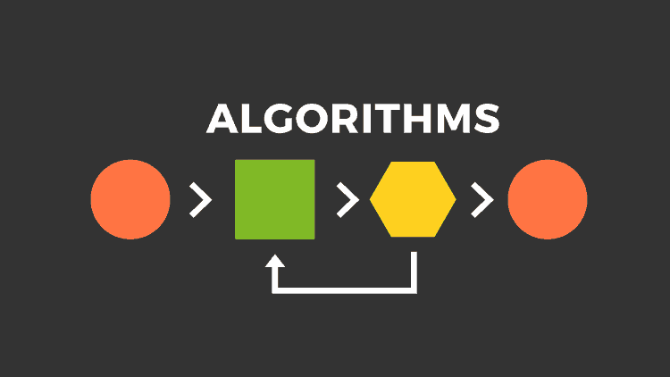

# 算法分析与设计

## Contents

- [基础知识](/knowledge-planet/algorithm/basic/intro)
- [分治算法](/knowledge-planet/algorithm/divide-and-conquer/intro)
- [动态规划](/knowledge-planet/algorithm/dynamic-programming/intro)
- [贪心算法](/knowledge-planet/algorithm/greedy/intro)
- [图论算法](/knowledge-planet/algorithm/graph-theory/intro)
- [进阶知识](/knowledge-planet/algorithm/advanced/intro)

## References

- [LeetCode](https://leetcode-cn.com/)
- [中国大学MOOC - 算法分析与设计](https://www.icourse163.org/course/BUAA-1449777166)
