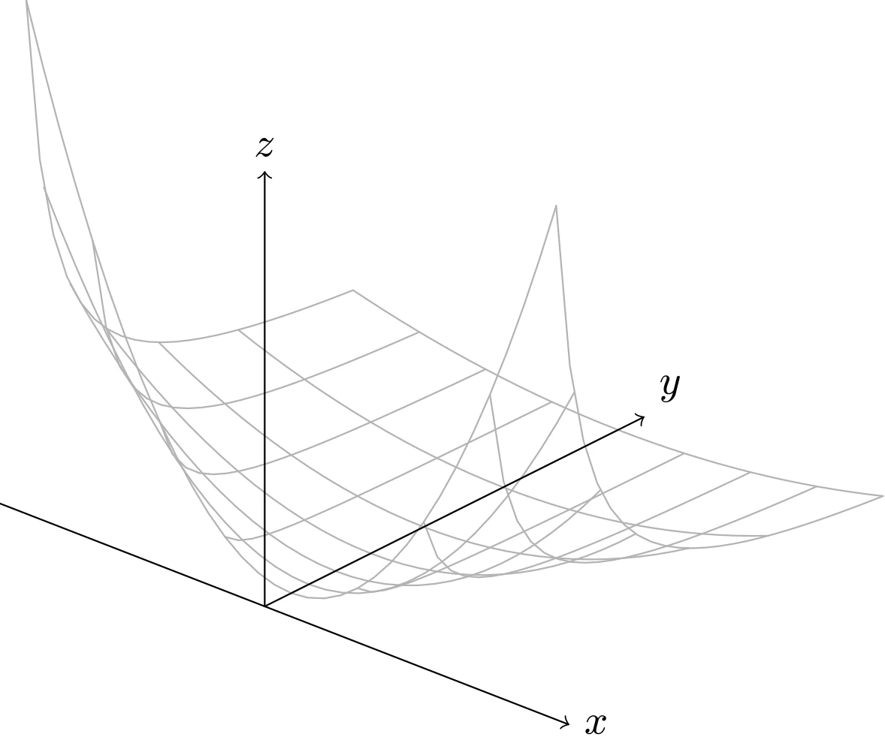
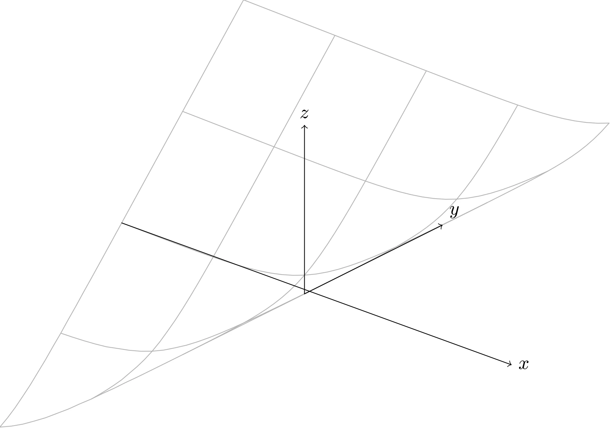

# 重要凸函数

## 基本初等函数

- 指数函数：对任意 $a \in \mathbf{R}$，函数 $f(x) = e^{ax}$ 在 $\mathbf{R}$ 上是凸的。
- 对数函数：函数 $f(x) = \log{x}$ 在 $\mathbf{R} _{++}$ 上是凸函数。
- 幂函数：当 $a \geqslant 1$ 或 $a \leqslant 0$ 时，$f(x) = x^a$ 在 $\mathbf{R} _{++}$ 上是凸函数；当 $0 \leqslant a \leqslant 1$，函数 $x^a$ 在 $\mathbf{R} _{++}$ 上是凹函数。

## 复合函数

### 负熵

函数 $f(x) = x \log{x}$ 在其定义域上是凸函数。其定义域为 $\mathbf{R} _{++}$，但也可以定义在 $\mathbf{R} _+$ 上（$f(0) = 0$），这是因为

$$
\begin{aligned}
    \lim _{x \rightarrow 0^{+}} x \log{x} &= \lim _{x \rightarrow 0^{+}} \dfrac{\log{x}}{1/x}  \\
    &= \lim _{x \rightarrow 0^{+}} \dfrac{1/x}{-1/x^2} \\
    &= 0
\end{aligned}
$$

函数 $f$ 的导数和二阶导数为

$$
f^{\prime}(x) = \log{x} + 1, \quad f^{\prime \prime}(x) = \dfrac{1}{x} > 0
$$

### 范数

$\mathbf{R}^n$ 上的任意范数均为凸函数。由三角不等式与正齐次性，

$$
\|\theta x + (1-\theta) y\| \leqslant \theta\|x\| + (1-\theta)\|y\|
$$

即可验证。事实上，$\|\cdot\|$ 还是凸函数的典型代表：若 $\|\cdot\|$ 凸且 $\|tx\| = |t|\|x\|$ 对所有标量 $t$ 成立，则 $\|\cdot\|$ 一定是范数。

### 二次-线性分式函数

二元函数 $f(x,y) = \dfrac{x^2}{y}$ 是凸函数，其定义域为

$$
\operatorname{dom} f = \mathbf{R} \times \mathbf{R} _{++} = \{ (x, y) \in \mathbf{R} ^2 \mid y > 0 \}
$$



::: details TikZ 代码

```tex
\begin{tikzpicture}[line cap=round,line join=round,scale=0.62,
  xq/.style={gray!60}]
  % wireframe of f(x,y) = x^2 / y (affine 3D projection)
  \foreach \yy in {0.6,1,1.6,2.4,3.6,5.4,8}
    \draw[xq] plot[domain=-4:4,samples=33]
      ({0.9*\x + 0.6*\yy}, {0.25*\x*\x/\yy - 0.35*\x + 0.3*\yy});
  \foreach \xx in {-4,-3,-2,-1,0,1,2,3,4}
    \draw[xq] plot[domain=0.6:8,samples=25]
      ({0.9*\xx + 0.6*\x}, {0.25*\xx*\xx/\x - 0.35*\xx + 0.3*\x});
  % axes
  \draw[->] (-3.6,1.4) -- (4.14,-1.61) node[right] {$x$};
  \draw[->] (0,0) -- (5.16,2.58) node[above right] {$y$};
  \draw[->] (0,0) -- (0,5.92) node[above] {$z$};
\end{tikzpicture}
```

:::

二次-线性分式函数是二次函数 $x^2$ 的透视函数，由透视运算的保凸性可知它是凸的（见保凸运算一节）。

### 指数和的对数

函数 $f(x) = \log{(e^{x_1} + \cdots + e^{x_n})}$ 在 $\mathbf{R}^n$ 上是凸函数。

下面是函数 $f(x) = \log{(e^x + e^y)}$ 的图像。



::: details TikZ 代码

```tex
\begin{tikzpicture}[line cap=round,line join=round,scale=0.62,
  xq/.style={gray!60}]
  % wireframe of f(x,y) = log(e^x + e^y) (affine 3D projection)
  \foreach \yy in {-6,-3,0,3,6}
    \draw[xq] plot[domain=-6:6,samples=33]
      ({0.9*\x + 0.6*\yy}, {0.8*ln(exp(\x) + exp(\yy)) - 0.35*\x + 0.3*\yy});
  \foreach \xx in {-6,-3,0,3,6}
    \draw[xq] plot[domain=-6:6,samples=33]
      ({0.9*\xx + 0.6*\x}, {0.8*ln(exp(\xx) + exp(\x)) - 0.35*\xx + 0.3*\x});
  % axes
  \draw[->] (-5.4,2.1) -- (6.12,-2.1) node[right] {$x$};
  \draw[->] (0,0) -- (4.08,2.04) node[above right] {$y$};
  \draw[->] (0,0) -- (0,5.0) node[above] {$z$};
\end{tikzpicture}
```

:::

凸性可以通过 Hessian 矩阵验证：记 $z = (e^{x_1}, \cdots, e^{x_n})$，$\mathbf{1}^{\top}z = e^{x_1} + \cdots + e^{x_n}$，则

$$
\nabla^{2} f(x) = \frac{1}{\mathbf{1}^{\top} z} \operatorname{diag}(z) - \frac{1}{(\mathbf{1}^{\top} z)^2} z z^{\top}
$$

对任意 $v$，$v^{\top} \nabla^{2} f(x) v = \sum_i \bar{z}_i v_i^2 - \left(\sum_i \bar{z}_i v_i\right)^2 \geqslant 0$，其中 $\bar{z}_i = z_i / \mathbf{1}^{\top} z$ 构成一个概率分布，上式即“平方的期望不小于期望的平方”。

### 几何平均数

几何平均数函数 $f(x)=\left(\prod_{i=1}^{n} x_{i}\right)^{1 / n}$ 在定义域 $\operatorname{dom} f=\mathbf{R}_{++}^{n}$ 上是凹函数。

## 分段函数

### 绝对值幂函数

当 $p \geqslant 1$ 时，函数 $|x|^p$ 在 $\mathbf{R}$ 上是凸函数。

### 最大值

最大值函数 $f(x) = \max\{x_1, \cdots, x_n\}$ 是凸函数，因为它是若干线性函数的逐点最大（见保凸运算一节）。特别地，$f(x) = \max\{0, x\}$ 是凸的。

## 证明

判断上述函数的凸性可以通过多种途径。可以直接验证一阶条件是否成立，亦可以验证其 Hessian 矩阵是否半正定，或者可以将函数转换到与其定义域相交的任意直线上，通过得到的单变量函数判断原函数的凸性。
