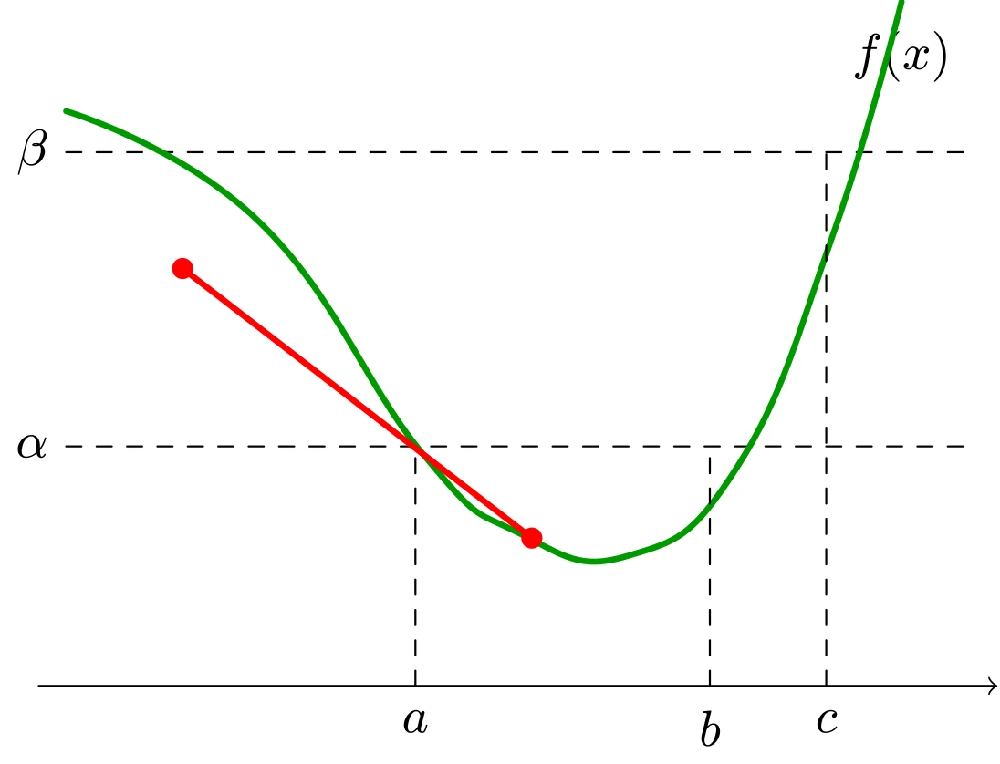

# 拟凸函数

## 定义

如果函数 $f: \mathbf{R}^n \rightarrow \mathbf{R}$ 的定义域及所有下水平集 $\{ x \mid f(x) \leqslant \alpha \}$ 都是凸集，则称函数 $f$ 是**拟凸函数**（或者**单峰函数**）。

同理，如果函数 $-f$ 是拟凸函数，并且所有上水平集 $\{ x \mid f(x) \geqslant \alpha \}$ 都是凸集，那么函数 $f$ 是拟凹函数。

如果函数 $f$ 既是拟凸函数又是拟凹函数，则称函数 $f$ 为拟线性函数，并且其定义域和其所有的水平集 $\{ x \mid f(x) = \alpha \}$ 都是凸集。

::: warning
**注意**

凸函数具有凸的下水平集，所以也是拟凸函数。但是拟凸函数不一定是凸函数。下图是一个反例。



::: details TikZ 代码

```tex
\begin{tikzpicture}[line cap=round,line join=round,scale=0.95]
  % quasiconvex but not convex: chord dips below the curve
  \draw[->] (-0.4,0) -- (6.6,0);
  \node at (5.9,4.6) {$f(x)$};
  \draw[dashed] (-0.2,1.75) -- (6.4,1.75);
  \node[left] at (-0.2,1.75) {$\alpha$};
  \draw[dashed] (-0.2,3.9) -- (6.4,3.9);
  \node[left] at (-0.2,3.9) {$\beta$};
  \draw[very thick,green!60!black] plot[smooth,tension=0.8]
    coordinates {(-0.2,4.2) (1.2,3.4) (2.4,1.7) (3.1,1.12) (3.9,0.95) (4.7,1.6) (5.4,3.3) (5.9,5.0)};
  \draw[dashed] (2.35,0) -- (2.35,1.75);
  \draw[dashed] (4.5,0) -- (4.5,1.75);
  \draw[dashed] (5.35,0) -- (5.35,3.9);
  \node[below] at (2.35,-0.05) {$a$};
  \node[below] at (4.5,-0.05) {$b$};
  \node[below] at (5.35,-0.05) {$c$};
  \draw[red,very thick] (0.65,3.05) -- (3.2,1.08);
  \fill[red] (0.65,3.05) circle (2.2pt);
  \fill[red] (3.2,1.08) circle (2.2pt);
\end{tikzpicture}
```

:::

如图所示，函数 $f$ 的所有下水平集都是区间（凸集），例如 $\alpha$-下水平集为 $[a, b]$，因此 $f$ 是拟凸函数。但图中红色弦位于曲线下方，即

$$
f(\theta x + (1-\theta)y) > \theta f(x) + (1-\theta) f(y)
$$

凸性定义不成立，因此 $f$ 不是凸函数。这说明拟凸性严格弱于凸性。
:::

### 举例

#### 一元函数

定义在 $\mathbf{R}_{++}$ 上的对数函数 $f(x) = \log x$ 是拟凸函数，也是拟凹函数，因此是拟线性函数。

上取整函数 $\mathrm{ceil}(x) = \inf \{ z \in Z \mid z \geqslant x \}$ 是拟凸函数，也是拟凹函数，因此是拟线性函数。

#### 多元函数

线性分式函数

$$
f(x)=\dfrac{a^{\top} x+b}{c^{\top} x+d}
$$

（定义域 $\{x \mid c^{\top}x + d > 0\}$）是拟凸函数，也是拟凹函数，因此是拟线性函数。其 $\alpha$-下水平集为

$$
\begin{aligned}
S_{\alpha} &=\left\{x \mid \frac{a^{\top} x+b}{c^{\top} x+d} \leqslant \alpha\right\} \\
&=\left\{x \mid (a-\alpha c)^{\top} x \leqslant \alpha d - b,\; c^{\top} x+d>0\right\}
\end{aligned}
$$

它是半空间与开半空间的交，是凸集，因此 $f$ 拟凸。同理可以验证其 $\alpha$-上水平集也是凸集，故 $f$ 也是拟凹的。

距离比函数

$$
f(x)=\dfrac{\|x-a\|_{2}}{\|x-b\|_{2}}
$$

在半平面 $\{ x \mid \| x - a \|_2 \leqslant \| x - b \|_2 \}$ 上是拟凸函数。

## 基本性质

### 拟凸函数的 Jensen 不等式

函数 $f$ 是拟凸函数的充要条件是，$\operatorname{dom} f$ 是凸集，且对于任意的 $x, y \in \operatorname{dom} f$ 以及 $0 \leqslant \theta \leqslant 1$，有

$$
f(\theta x + (1 - \theta) y) \leqslant \max \{ f(x), f(y) \}
$$

上式的几何意义在于，如果 $f$ 是拟凸函数，那么 $x$ 和 $y$ 之间的函数值不超过 $f(x)$ 和 $f(y)$ 之间的最大值。这很好的说明了为什么拟凸函数又被称为单峰函数。

### 连续函数的拟凸性

对于连续函数，拟凸性等价于所有下水平集都是凸集（即定义本身）。在一维情形有一个直观的刻画：连续函数 $f: \mathbf{R} \rightarrow \mathbf{R}$ 拟凸，当且仅当 $f$ 是单峰的（unimodal），即存在 $c$ 使得 $f$ 在 $(-\infty, c]$ 上非增、在 $[c, +\infty)$ 上非减（退化的单调函数也包含在内）。

## 可微拟凸函数

### 一阶条件

设函数 $f: \mathbf{R}^n \rightarrow \mathbf{R}$ 可微，则函数 $f$ 是拟凸函数的充要条件是，$\operatorname{dom} f$ 是凸集，且对于 $\forall x, y \in \operatorname{dom} f$ 有

$$
f(y) \leqslant f(x) \Longrightarrow \nabla f(x)^{\top}(y-x) \leqslant 0
$$

一阶条件的几何意义实际上就是定义了水平集 $\{ y \mid f(y) \leqslant f(x) \}$ 的一个支撑超平面（$\nabla f(x)$ 为该超平面的法向量）。

我们注意到用一阶条件判断凸性和判断拟凸性很相似，但实际上二者存在着重要的差别。例如，如果函数 $f$ 是凸函数且 $\nabla f(x) = 0$，那么 $x$ 是函数 $f$ 的全局极小点。

然而，对于拟凸函数，这样的论断并不成立。有可能 $\nabla f(x) = 0$，但是点 $x$ 不是 $f$ 全局最小点。例如 $f(x) = x^3$ 的 $x^{*} = 0$ 处，$\nabla f(x^{*}) = 0$，但不是极小点而是鞍点。因此，$f(x) = x^3$ 是拟凸函数而不是凸函数。

### 二阶条件

假设函数 $f$ 二次可微，如果函数 $f$ 是拟凸函数，则对于任意 $x \in \operatorname{dom} f$ 以及任意 $y \in \mathbf{R}^n$ 有

$$
y^{\top} \nabla f(x)=0 \Longrightarrow y^{\top} \nabla^{2} f(x) y \geqslant 0
$$

对于定义在 $\mathbf{R}$ 上的一元函数，上述条件可以简化为

$$
f^{\prime} (x) = 0 \Longrightarrow f^{\prime \prime} (x) \geqslant 0
$$

这实际上是我们非常熟悉的一阶导数为零且二阶导数非负的判断方法。

## 保拟凸运算

### 非负加权最大

$$
f = \max \{ w_1 f_1, \cdots, w_m f_m \}
$$

其中 $w_i \geqslant 0$，$f_i$ 是拟凸函数。此性质可以扩展到一般的逐点上确界，即

$$
f(x) = \sup _{y \in C} \{ w(y) g(x, y) \}
$$

其中 $w(y) \geqslant 0$，$y$ 视为参数，$g(x, y)$ 是关于 $x$ 的拟凸函数。

### 复合

如果函数 $g: \mathbf{R}^n \rightarrow \mathbf{R}$ 是拟凸函数，且函数 $h: \mathbf{R} \rightarrow \mathbf{R}$ 是非减的，则复合函数 $f = h \circ g$ 是拟凸函数。

拟凸函数和一个仿射函数或者线性分式函数进行复合可以得到拟凸函数。

### 最小化

如果函数 $f(x, y)$ 是 $x$ 和 $y$ 的联合拟凸函数，且 $C$ 是凸集，则函数

$$
g(x) = \inf _{y \in C} f(x, y)
$$

是拟凸函数。

## 通过一族凸函数进行表示

利用下水平集，拟凸函数总可以通过一族凸函数来表示：$f$ 是拟凸函数，当且仅当存在一族凸函数 $\phi_t: \mathbf{R}^n \rightarrow \mathbf{R}$（$t \in \mathbf{R}$），使得

$$
f(x) \leqslant t \Longleftrightarrow \phi_t(x) \leqslant 0
$$

即拟凸函数 $f$ 的 $t$-下水平集恰好是凸函数 $\phi_t$ 的 0-下水平集。这一表示的重要价值在于：约束为拟凸函数的优化问题，可以通过二分法求解一系列凸可行性问题（$\phi_t(x) \leqslant 0$ 是否有解）来完成，详见凸优化问题一章中的拟凸优化。
