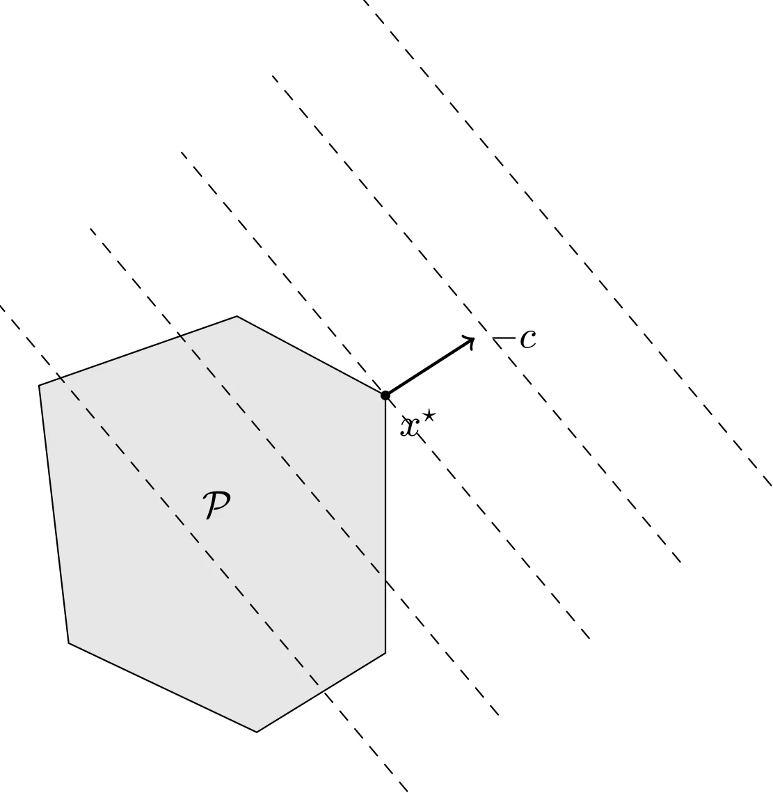
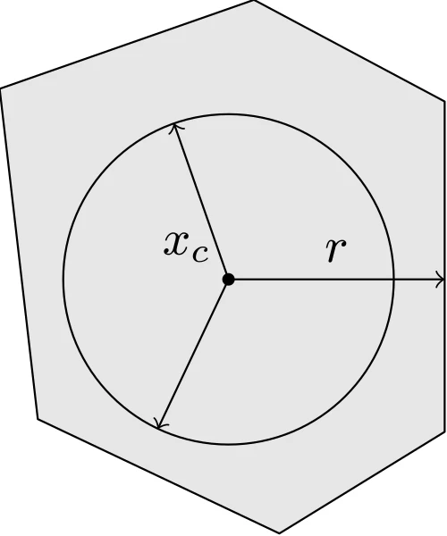

# 线性规划问题

## 定义

当目标函数和约束函数都是仿射函数时，问题称为**线性规划**（Linear Program, LP）。线性规划问题的定义如下：

$$
\begin{aligned}
    \mathrm{minimize} \quad & c^{\top}x+d \\
    \mathrm{subject\ to} \quad & Gx \preceq h \\
    \quad & Ax=b 
\end{aligned}
$$

其中 $G \in \mathbf{R}^{m \times n}$ 并且 $A \in \mathbf{R}^{p \times n}$。显然，线性规划问题是凸优化问题。

### 几何意义



::: details TikZ 代码

```tex
\begin{tikzpicture}[line cap=round,line join=round,scale=0.9]
  % LP: level sets of c^T x over a polyhedron
  \draw[fill=gray!20] (-1.8,1.6) -- (0.2,2.3) -- (1.7,1.5) -- (1.7,-1.1) -- (0.4,-1.9) -- (-1.5,-1.0) -- cycle;
  \node at (0,0.4) {$\mathcal{P}$};
  \foreach \t in {-2.4,-1.2,1.2,2.4}
    \draw[dashed] ({1.7 + \t*0.766 - 3.2*(-0.643)}, {1.5 + \t*0.643 - 3.2*0.766})
      -- ({1.7 + \t*0.766 + 3.2*(-0.643)}, {1.5 + \t*0.643 + 3.2*0.766});
  \draw[dashed] ({1.7 - 3.2*(-0.643)}, {1.5 - 3.2*0.766})
    -- ({1.7 + 3.2*(-0.643)}, {1.5 + 3.2*0.766});
  \fill (1.7,1.5) circle (1.4pt) node[below right] {$x^{\star}$};
  \draw[->,thick] (1.7,1.5) -- (2.6,2.08) node[right] {$-c$};
\end{tikzpicture}
```

:::

### 例子：多面体的切比雪夫中心

切比雪夫中心是多面体 $\mathcal{P} = \{x \mid a_i^{\top}x \leqslant b_i, i=1,\cdots,m\}$ 内可容纳的最大球的球心。将球写成 $\{x \mid \|x - x_c\|_2 \leqslant r\}$，约束等价于 $a_i^{\top}x_c + \|a_i\|_2 r \leqslant b_i$（点到第 $i$ 个半空间边界的距离不小于 $r$），于是求切比雪夫中心可以归结为一个 LP：

$$
\begin{aligned}
    \mathrm{maximize} \quad & r \\
    \mathrm{subject\ to} \quad & a_i^{\top}x_c + \|a_i\|_2 r \leqslant b_i, \quad i=1,\cdots,m
\end{aligned}
$$

其中优化变量为 $x_c$ 和 $r$：目标函数和约束函数关于 $(x_c, r)$ 都是线性的。下图给出了一个多面体及其切比雪夫中心 $x_c$ 与半径 $r$：



::: details TikZ 代码

```tex
\begin{tikzpicture}[line cap=round,line join=round,scale=0.9]
  % Chebyshev center: largest ball inscribed in a polyhedron
  \draw[fill=gray!20] (-1.8,1.6) -- (0.2,2.3) -- (1.7,1.5) -- (1.7,-1.1) -- (0.4,-1.9) -- (-1.5,-1.0) -- cycle;
  \draw (0,0.1) circle (1.3);
  \fill (0,0.1) circle (1.4pt) node[above left] {$x_c$};
  \draw[->] (0,0.1) -- (1.7,0.1) node[midway,above] {$r$};
  \draw[->] (0,0.1) -- (-0.429,1.327);
  \draw[->] (0,0.1) -- (-0.556,-1.077);
\end{tikzpicture}
```

:::

可行域 $\mathcal{P}$ 是一个多面体（图中蓝色六边形），目标函数 $c^{\top}x$ 是线性的，所以其等位曲线是与 $c$ 正交的超平面（如虚线所示）。点 $x^{\star}$ 是最优的，它是 $\mathcal{P}$ 中在方向 $-c$ 上最远的点。

### 线性规划的标准形式和不等式形式

在标准形式线性规划中仅有的不等式都是分量的非负约束 $x \succeq 0$

$$
\begin{aligned}
    \mathrm{minimize} \quad & c^{\top}x \\
    \mathrm{subject\ to} \quad & Ax=b \\
    \quad & x \succeq 0
\end{aligned}
$$

如果线性规划问题没有等式约束，则成为不等式形式线性规划

$$
\begin{aligned}
    \mathrm{minimize} \quad & c^{\top}x \\
    \mathrm{subject\ to} \quad & Ax \leqslant b
\end{aligned}
$$

### 将线性规划转化为标准形式

有时我们需要将一般的线性规划转化为标准形式。第一步是为不等式引入松弛变量 $s_i$，得到

$$
\begin{aligned}
    \mathrm{minimize} \quad & c^{\top}x+d \\
    \mathrm{subject\ to} \quad & Gx+s=h \\
    \quad & Ax=b \\
    \quad & s \succeq 0
\end{aligned}
$$

第二步是将变量 $x$ 表示为两个非负变量 $x^+$ 和 $x^-$ 的差，即 $x=x^+-x^-$，$x^+,x^- \succeq 0$，从而得到问题

$$
\begin{aligned}
    \mathrm{minimize} \quad & c^{\top}x^+-c^{\top}x^-+d \\
    \mathrm{subject\ to} \quad & Gx^+-Gx^-+s=h \\
    \quad & Ax^+-Ax^-=b \\
    \quad & x^+ \succeq 0, x^- \succeq 0, s \succeq 0
\end{aligned}
$$

这是标准形式的线性规划，其优化变量是 $x^+$、$x^-$ 和 $s$。

## 线性分式规划

在多面体上极小化仿射函数纸币的问题称为线性分式规划

$$
\begin{aligned}
    \mathrm{minimize} \quad & \dfrac{c^{\top}x+d}{e^{\top}x+f} \\
    \mathrm{subject\ to} \quad & Gx \preceq h \\
    \quad & Ax = b
\end{aligned}
$$

这个函数是拟凸的（事实上是拟线性的），因此线性分式规划是一个拟凸优化问题。

### 转化为线性规划

如果可行集

$$
\{ x \mid Gx \preceq h, Ax=b, e^{\top}x+f > 0 \}
$$

非空，则线性分式规划可以转换为等价的线性规划

$$
\begin{aligned}
    \mathrm{minimize} \quad & c^{\top}y+dz \\
    \mathrm{subject\ to} \quad & Gy-hz \preceq 0 \\
    \quad & Ay-bz=0 \\
    \quad & e^{\top}y + fz = 1 \\
    \quad & z \geqslant 0
\end{aligned}
$$

其优化变量为 $y$ 和 $z$。
