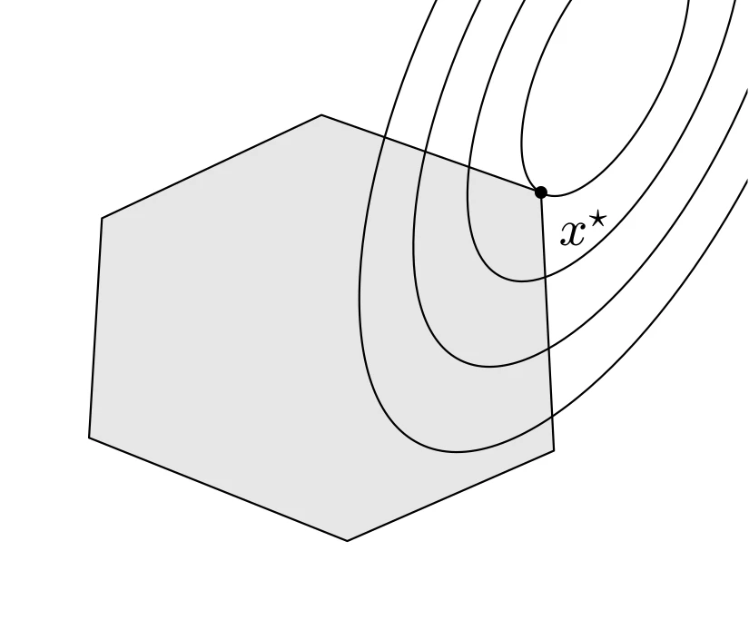

# 二次优化问题

## 定义

当凸优化问题的目标函数是凸二次型并且约束函数为仿射时，该问题被称为二次规划（Quadratic Program, QP）。二次规划问题可以表示为

$$
\begin{aligned}
    \mathrm{minimize} \quad & \dfrac{1}{2} x^{\top}Px + q^{\top}x + r \\
    \mathrm{subject\ to} \quad & Gx \preceq h \\
    \quad & Ax = b
\end{aligned}
$$

其中 $P \in \mathbf{S}^n_+$，$G \in \mathbf{R}^{p \times n}$。可以用下图来表示二次规划问题。



::: details TikZ 代码

```tex
\begin{tikzpicture}[line cap=round,line join=round,scale=0.9]
  % QP: ellipsoidal level sets and a polyhedral feasible set
  \draw[fill=gray!20] (-1.6,0.9) -- (0.1,1.7) -- (1.8,1.1) -- (1.9,-0.9) -- (0.3,-1.6) -- (-1.7,-0.8) -- cycle;
  \begin{scope}
    \clip (-2.4,-2.2) rectangle (3.4,2.6);
    \foreach \r in {0.7,1.15,1.6,2.05}
      \draw[rotate around={64:(2.3,2.1)}] (2.3,2.1) ellipse ({1.6*\r} and {0.68*\r});
  \end{scope}
  \fill (1.8,1.1) circle (1.4pt) node[below right] {$x^{\star}$};
\end{tikzpicture}
```

:::

如图所示，二次规划的目标函数的等高线是一族椭球（同心椭圆），可行集是多面体 $\mathcal{P}$，最优点 $x^{\star}$ 位于可行集边界上椭球与多面体相切的位置。

### 二次约束二次规划

如果不仅是目标函数，而且不等式约束也是凸二次型，即

$$
\begin{aligned}
    \mathrm{minimize} \quad & \dfrac{1}{2} x^{\top}Px + q^{\top}x + r \\
    \mathrm{subject\ to} \quad & \dfrac{1}{2} x^{\top}P_ix + q^{\top}_ix + r_i \leqslant 0 \\
    \quad & Ax = b
\end{aligned}
$$

则称这一问题为二次约束二次规划（Quadratically Constrained Quadratic Program, QCQP）

线性规划是二次规划的特例，即取 $P = 0$。二次规划是二次约束二次规划的特例，令 $P_i = 0$ 即可。

## 举例

### 最小二乘及回归

$$
\| Ax - b \|^2_2 = x^{\top}A^{\top}Ax - 2b^{\top}Ax + b^{\top}b
$$

上面的凸二次函数是一个（无约束的）二次规划。我们在很多领域都会看到类似的式子，有些地方会称其为回归分析或者最小二乘逼近。这个问题很简单，可以求出其解析解 $x = A^{\dagger} b$。

### 投资组合优化

投资组合优化是 QP 的经典应用：设各资产收益为随机变量，$\Sigma \in \mathbf{S}^n_{++}$ 为收益的协方差矩阵。在期望收益给定（预算 $\mu^{\top}x \geqslant r_{\min}$）、资金全部投入（$\mathbf{1}^{\top}x = 1$）且允许做空（即不加 $x \succeq 0$ 约束；若不允许做空，则补上 $x \succeq 0$）的约束下，极小化收益方差（风险）

$$
\begin{aligned}
    \mathrm{minimize} \quad & x^{\top}\Sigma x \\
    \mathrm{subject\ to} \quad & \mu^{\top}x \geqslant r_{\min}, \quad \mathbf{1}^{\top}x = 1
\end{aligned}
$$

这是一个 QP（目标函数凸二次，约束线性）。

## 二阶锥规划

$$
\begin{aligned}
    \mathrm{minimize} \quad & f^{\top}x \\
    \mathrm{subject\ to} \quad & \| A_ix + b_i \|_2 \leqslant c_i^{\top}x + d_i, \quad i = 1,\cdots,m \\
    \quad & Fx = g
\end{aligned}
$$

称上述问题为二阶锥规划（Second-Order Cone Program, SOCP），其中 $x \in \mathbf{R}^n$ 是优化变量，$A_i \in \mathbf{R}^{n_i \times n}$，$F \in \mathbf{R}^{p \times n}$。并且我们称约束

$$
\| Ax + b \|_2 \leqslant c^{\top}x + d
$$

为二阶锥约束。

当 $c_i = 0$ 时，SOCP 等同于 QCQP。当 $A_i = 0$ 时，SOCP 退化为（一般的）线性规划。
