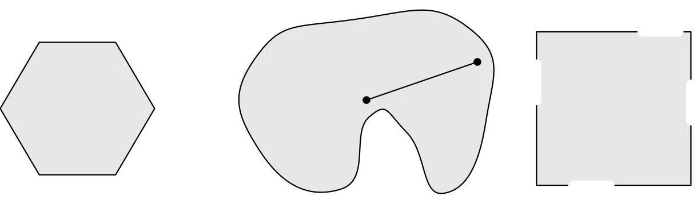
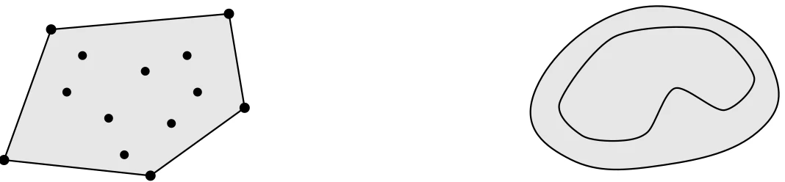
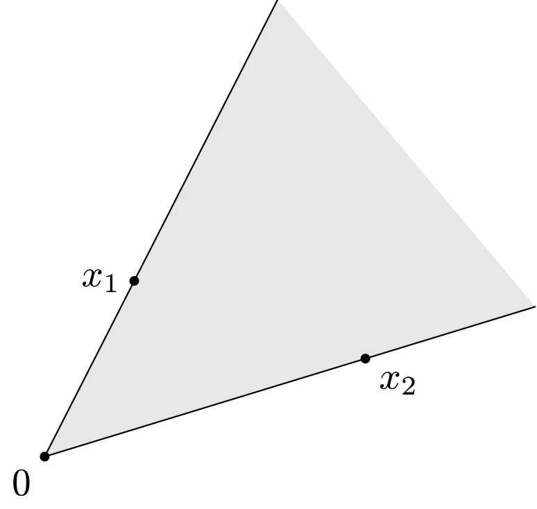
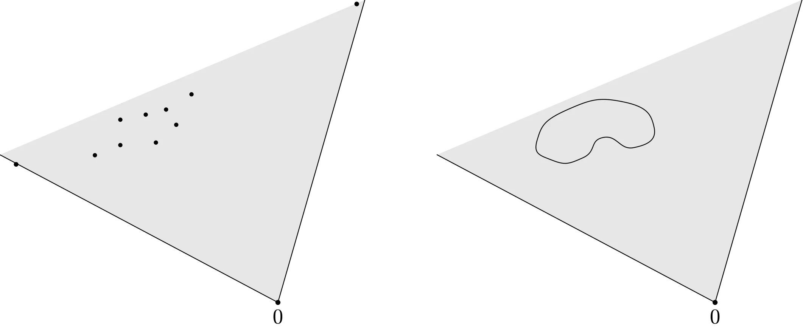

# 仿射集合和凸集

## 直线与线段

设 $x_1 \ne x_2$ 为 $\mathbf{R}^n$ 空间中的两个点，那么

$$
\begin{aligned}
y = \theta x_1 + (1-\theta) x_2, \quad \theta \in \mathbf{R}
\end{aligned}
$$

组成一条穿越 $x_1$ 和 $x_2$ 的**直线**；

$$
\begin{aligned}
y = \theta x_1 + (1-\theta) x_2, \quad \theta \in [0, 1]
\end{aligned}
$$

构成了 $x_1$ 和 $x_2$ 之间的（闭）**线段**。

还有如下一种表示形式，它类似于直线的参数方程：

$$
\begin{aligned}
y = x_2 + \theta(x_1 - x_2)
\end{aligned}
$$

## 仿射集合

如果通过集合 $C \subseteq \mathbf{R}^{n}$ 中任意两个不同点的直线仍然在集合 $C$ 中，那么称集合 $C$ 是**仿射**的，即

$$
\begin{aligned}
\forall x_1,x_2 \in C, \quad \theta x_1 + (1 - \theta) x_2 \in C \quad (\theta \in \mathbf{R})
\end{aligned}
$$

这个概念可以推广至多个点的情况：如果 $\theta_1 + \cdots + \theta_k = 1$，那么称 $\theta_1 x_1 + \cdots + \theta_k x_k$ 为 $x_1, \cdots, x_k$ 的**仿射组合**。如果一个集合中的任意两点的仿射组合仍在该集合中，那么称该集合为**仿射集合**。

设 $V$ 是一个子空间（即关于加法和数乘运算是封闭的），则仿射集合 $C$ 可以表示为

$$
\begin{aligned}
C = V + x_0 = \{v + x_0 \mid v \in V\}
\end{aligned}
$$

与仿射集合 $C$ 相关联的子空间 $V$ 与 $x_0$ 的选取无关，所以 $x_0$ 可以是 $C$ 中的任意一点。

我们称由集合 $C \subseteq \mathbf{R}^{n}$ 中的点的所有仿射组合组成的集合为 $C$ 的**仿射包**，即

$$
\begin{aligned}
\operatorname{aff} C = \{\theta_1 x_1 + \cdots + \theta_k x_k \mid x_1, \cdots, x_k \in C, \theta_1 + \cdots + \theta_k = 1\}
\end{aligned}
$$

仿射包是包含 $C$ 的最小的仿射集合。

## 仿射维数与相对内部

集合 $C$ 的**仿射维数** 为其仿射包的维数。例如，$\mathbf{R}^{2}$ 上的单位圆环 $\{x \in \mathbf{R}^{2} \mid x_1^2+x_2^2=1\}$ 的仿射包是全空间 $\mathbf{R}^{2}$，故其仿射维数为 2。

考虑 $\mathbf{R}^{3}$ 中处于 $(x_1,x_2)$ 平面的一个正方形，定义

$$
\begin{aligned}
C = \{x \in \mathbf{R}^{3} \mid -1 \leqslant x_1 \leqslant 1, -1 \leqslant x_2 \leqslant 1, x_3=0\}
\end{aligned}
$$

其仿射包为 $x_1, x_2$ 平面，即 $\operatorname{aff}C = \{x \in \mathbf{R}^{3} \mid x_3=0\}$。$C$ 的仿射维数小于 3，其相对内部为

$$
\begin{aligned}
\operatorname{relint} C = \{x \in \mathbf{R}^{3} \mid -1 < x_1 < 1, -1 < x_2 < 1, x_3=0\}
\end{aligned}
$$

$C$ 在 $\mathbf{R}^{3}$ 中的边界是其自身，而相对边界是其边框，即

$$
\begin{aligned}
\operatorname{cl} C \backslash \operatorname{relint} C = \{x \in \mathbf{R}^{3} \mid \max \{\left|x_1\right|, \left|x_2\right|\} = 1, x_3=0\}
\end{aligned}
$$

## 凸集

若对 $\forall x_1, x_2 \in C$ 和对 $\forall \theta \in [0, 1]$，都有

$$
\begin{aligned}
\theta x_1 + (1 - \theta) x_2 \in C
\end{aligned}
$$

则称集合 $C$ 为**凸集**。

::: info
**仿射集合是凸集**

由于仿射集包含穿过集合中任意不同两点的整条直线，任意不同两点间的线段自然也在集合中，因而仿射集是凸集。
:::



::: details TikZ 代码

```tex
\begin{tikzpicture}[line cap=round,line join=round,scale=0.9]
  % convex hexagon
  \draw[fill=gray!20]
    (0.95,0) -- (0.47,0.82) -- (-0.47,0.82) -- (-0.95,0) -- (-0.47,-0.82) -- (0.47,-0.82) -- cycle;
  % nonconvex kidney-like set with a chord escaping the set
  \begin{scope}[shift={(3.4,0)},scale=1.05]
    \draw[fill=gray!20] plot[smooth cycle,tension=1]
      coordinates {(0,1.05) (1.35,0.95) (1.55,-0.15) (1.05,-1.0) (0.62,-0.28)
                   (0.18,-0.1) (-0.15,-0.95) (-1.1,-0.5) (-1.15,0.6)};
    \fill (0.15,0.1) circle (1.3pt);
    \fill (1.45,0.55) circle (1.3pt);
    \draw (0.15,0.1) -- (1.45,0.55);
  \end{scope}
  % square with parts of its boundary missing (not convex)
  \begin{scope}[shift={(6.6,0)}]
    \draw[fill=gray!20] (-0.95,-0.95) rectangle (0.95,0.95);
    \draw[line width=3pt,white] (-0.95,0.55) -- (-0.95,0.1);
    \draw[line width=3pt,white] (0.35,0.95) -- (0.8,0.95);
    \draw[line width=3pt,white] (0.95,-0.15) -- (0.95,0.3);
    \draw[line width=3pt,white] (-0.5,-0.95) -- (-0.05,-0.95);
  \end{scope}
\end{tikzpicture}
```

:::

如图所示，左边的正六边形是凸集；中间的图形不是凸集，因为任意两点之间的连线不一定都被集合包含；右边的正方形也不是凸集，因为它仅包含部分边界。

我们称 $\theta_1 x_1 + \cdots + \theta_k x_k$ 为点 $x_1, \cdots, x_k$ 的一个**凸组合**，其中 $\theta_1 + \cdots + \theta_k = 1$ 并且 $\theta_i \geqslant 0, i = 1, \cdots, k$。可以将点的凸组合理解为他们的混合或加权平均，$\theta_i$ 代表混合时 $x_i$ 所占的份数。

我们称集合 $C$ 中所有点的凸组合的集合为其**凸包**，即

$$
\begin{aligned}
\operatorname{conv} C=\{\theta_1 x_1+\cdots+\theta_k x_k \mid x_i \in C, \theta_i \geqslant 0, \\ i=1, \cdots, k, \theta_1+\cdots+\theta_k=1\}
\end{aligned}
$$



::: details TikZ 代码

```tex
\begin{tikzpicture}[line cap=round,line join=round,scale=0.9]
  % left: convex hull of finitely many points
  \begin{scope}
    \draw[fill=gray!20] (0.15,0.1) -- (0.6,1.35) -- (2.3,1.5) -- (2.45,0.6) -- (1.55,-0.05) -- cycle;
    \foreach \p in {(0.15,0.1),(0.6,1.35),(2.3,1.5),(2.45,0.6),(1.55,-0.05)}
      \fill \p circle (1.4pt);
    \foreach \p in {(0.75,0.75),(1.15,0.5),(1.5,0.95),(1.9,1.1),(0.9,1.1),(1.3,0.15),(1.75,0.45),(2.0,0.75)}
      \fill \p circle (1.2pt);
  \end{scope}
  % right: convex hull of a nonconvex set fills in its concavities
  \begin{scope}[shift={(5.2,0)},scale=1.05]
    \draw[fill=gray!20] plot[smooth cycle,tension=0.75]
      coordinates {(0.0,0.65) (0.7,1.4) (1.65,1.4) (2.2,0.9) (2.05,0.35)
                   (1.2,0.05) (0.35,0.1)};
    \draw plot[smooth cycle,tension=0.5]
      coordinates {(0.25,0.62) (0.75,1.22) (1.6,1.28) (2.02,0.85) (1.75,0.55)
                   (1.3,0.75) (1.05,0.35) (0.78,0.27) (0.45,0.32)};
  \end{scope}
\end{tikzpicture}
```

:::

如图所示，左边的一系列散点的凸包是外层散点连线所构成的多边形；右边的图形的凸包是用与图形相切的部分代替凹陷的部分重新构成的封闭图形。凸包是包含 $C$ 的最小凸集：任何包含 $C$ 的凸集合都包含 $C$ 中点的所有凸组合，因而包含 $\operatorname{conv} C$。

凸组合的概念可以扩展到无穷级数、积分以及大多数形式的概率分布。例如：

$$
\begin{aligned}
\sum_{i=1}^{\infty} \theta_{i}=1 &\Rightarrow \sum_{i=1}^{\infty} \theta_{i} x_{i} \in C \\
\int_{C} p(x) d x =1 &\Rightarrow \int_{C} p(x) x d x \in C
\end{aligned}
$$

## 锥

如果对 $\forall x \in C$ 和 $\forall \theta \geqslant 0$ 都有 $\theta x \in C$，那么我们称集合 $C$ 是**锥**或者**非负齐次**。若集合 $C$ 是锥并且是凸的，则称 $C$ 为**凸锥**，即对 $\forall x_1, x_2 \in C$ 和 $\forall \theta_1, \theta_2 \geqslant 0$，都有

$$
\begin{aligned}
\theta_1 x_1 + \theta_2 x_2 \in C
\end{aligned}
$$

半径为 $\infty$ 的扇形和母线长为 $\infty$ 的圆锥面是典型的凸锥，如图所示：



::: details TikZ 代码

```tex
\begin{tikzpicture}[line cap=round,line join=round,scale=0.9]
  \coordinate (O) at (0,0);
  \coordinate (A) at (63:5.2);
  \coordinate (B) at (17:5.2);
  \fill[gray!20] (O) -- (A) -- (B) -- cycle;
  \draw (O) -- (A);
  \draw (O) -- (B);
  \fill (O) circle (1.4pt) node[below left] {$0$};
  \fill (63:2.0) circle (1.4pt) node[left] {$x_1$};
  \fill (17:3.4) circle (1.4pt) node[below right] {$x_2$};
\end{tikzpicture}
```

:::

例如，半空间 $\{x \mid a^{\top} x \leqslant 0\}$ 是一个凸锥；范数球 $\{x \mid \|x\| \leqslant 1\}$ 不是锥（它不关于数乘封闭）。

和凸组合和凸包类似，可以定义锥组合和锥包。集合 $C$ 的锥包是 $C$ 中元素的所有锥组合的集合，即

$$
\begin{aligned}
\operatorname{cone} C=\{\theta_1 x_1+\cdots+\theta_k x_k \mid x_i \in C, \theta_i \geqslant 0, i=1, \cdots, k\}
\end{aligned}
$$

锥包是包含 $C$ 的最小凸锥，如图所示：



::: details TikZ 代码

```tex
\begin{tikzpicture}[line cap=round,line join=round,scale=0.85]
  % left: conic hull of finitely many points
  \begin{scope}
    \coordinate (O) at (4.6,-2.6);
    \coordinate (A) at (-0.87,0.31);
    \coordinate (B) at (6.31,3.36);
    \fill[gray!20] (O) -- (A) -- (B) -- cycle;
    \draw (O) -- (A);
    \draw (O) -- (B);
    \fill (O) circle (1.4pt) node[below] {$0$};
    \fill (-0.55,0.12) circle (1.3pt);
    \fill (6.15,3.28) circle (1.3pt);
    \foreach \p in {(1.5,1.0),(2.0,1.1),(2.6,0.9),(1.5,0.5),(2.2,0.55),(2.9,1.5),(1.0,0.3),(2.4,1.2)}
      \fill \p circle (1.2pt);
  \end{scope}
  % right: conic hull of a nonconvex set
  \begin{scope}[shift={(8.6,0)}]
    \coordinate (O) at (4.6,-2.6);
    \coordinate (A) at (-0.87,0.31);
    \coordinate (B) at (6.31,3.36);
    \fill[gray!20] (O) -- (A) -- (B) -- cycle;
    \draw (O) -- (A);
    \draw (O) -- (B);
    \fill (O) circle (1.4pt) node[below] {$0$};
    \draw plot[smooth cycle,tension=1]
      coordinates {(1.0,0.9) (1.7,1.75) (2.8,1.8) (3.4,1.2) (3.0,0.75)
                   (2.4,0.95) (2.0,0.5) (1.4,0.45)};
  \end{scope}
\end{tikzpicture}
```

:::

## 小结

|                仿射集                 |                 凸集                  |          锥          |                凸锥                 |
| :-----------------------------------: | :-----------------------------------: | :------------------: | :---------------------------------: |
| $\theta x_1 + (1 - \theta) x_2 \in C$ | $\theta x_1 + (1 - \theta) x_2 \in C$ |   $\theta x \in C$   | $\theta_1 x_1 + \theta_2 x_2 \in C$ |
|        $\theta \in \mathbf{R}$        |          $\theta \in [0, 1]$          | $\theta \geqslant 0$ |  $\theta_1, \theta_2 \geqslant 0$   |

|                仿射组合                |                  凸组合                  |                  锥组合                  |
| :------------------------------------: | :--------------------------------------: | :--------------------------------------: |
| $\theta_1 x_1 + \cdots + \theta_k x_k$ |  $\theta_1 x_1 + \cdots + \theta_k x_k$  |  $\theta_1 x_1 + \cdots + \theta_k x_k$  |
|   $\theta_1 + \cdots + \theta_k = 1$   |    $\theta_1 + \cdots + \theta_k = 1$    |                                          |
|                                        | $\theta_i \geqslant 0, i = 1, \cdots, k$ | $\theta_i \geqslant 0, i = 1, \cdots, k$ |

|               仿射包               |                   凸包                   |                   锥包                   |
| :--------------------------------: | :--------------------------------------: | :--------------------------------------: |
| $\theta_1 + \cdots + \theta_k = 1$ |    $\theta_1 + \cdots + \theta_k = 1$    |                                          |
|                                    | $\theta_i \geqslant 0, i = 1, \cdots, k$ | $\theta_i \geqslant 0, i = 1, \cdots, k$ |
