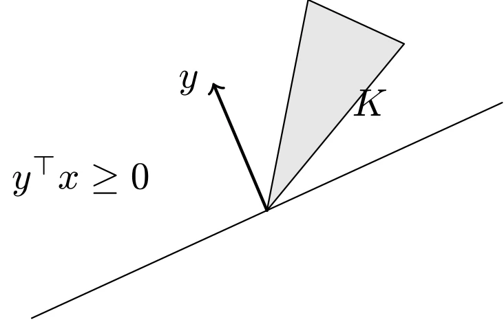
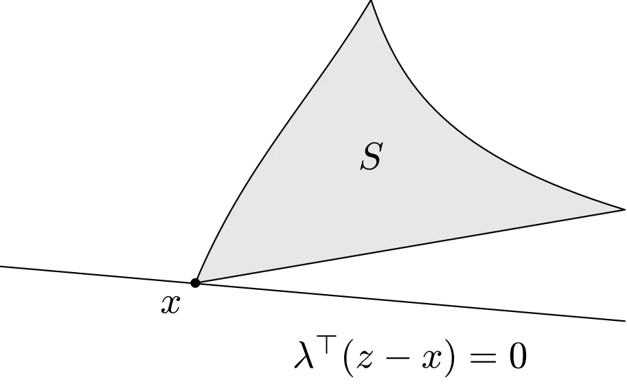
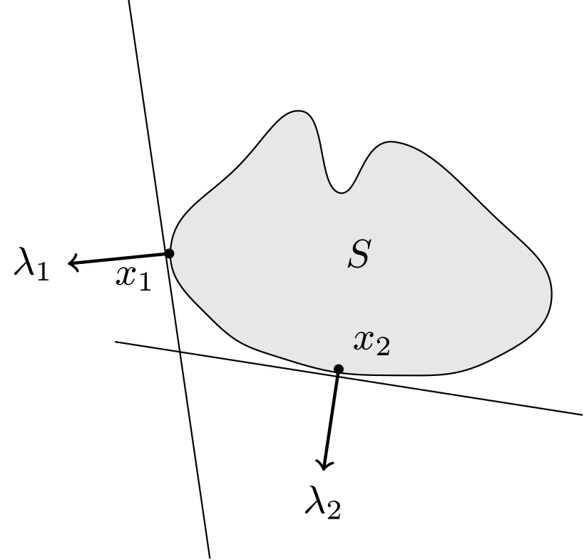

# 对偶锥与广义不等式

## 对偶锥

若 $K$ 为一个锥，则集合

$$
\begin{aligned}
K^{*} = \{y \mid x^{\top} y \geqslant 0, \forall x \in K\}
\end{aligned}
$$

称为 $K$ 的对偶锥。从几何上看，对偶锥 $K^{*}$ 是与锥 $K$ 内的所有向量夹角不超过 90 度的所有向量组成的集合。如图所示，以 $y$ 为法向量的半空间包含锥 $K$，因此 $y \in K^{*}$；而以 $z$ 为法向量的半空间不包含锥 $K$，因此 $z \notin K^{*}$。



::: details TikZ 代码

```tex
\begin{tikzpicture}[line cap=round,line join=round,scale=0.9]
  % dual cone: y in K* iff the halfspace normal to y contains K
  \draw (-2.4,-1.1) -- (2.4,1.1);
  \draw[fill=gray!20] (0,0) -- (1.4,1.7) -- (0.42,2.15) -- cycle;
  \node at (1.05,1.1) {$K$};
  \draw[->,thick] (0,0) -- (-0.55,1.3) node[left] {$y$};
  \node at (-1.9,0.35) {$y^{\top}x \geq 0$};
\end{tikzpicture}
```

:::

### 对偶锥的性质

- $K^{*}$ 是闭凸锥。
- $K_1 \subseteq K_2 \Rightarrow K_2^{*} \subseteq K_1^{*}$。
- 如果 $K$ 有非空内部，那么 $K^{*}$ 是尖的。
- 如果 $K$ 的闭包是尖的，那么 $K^{*}$ 有非空内部。
- $K^{**}$ 是 $K$ 的凸包的闭包。因此如果 $K$ 是凸和闭的，那么 $K^{**}=K$。

## 广义不等式的对偶

若凸锥 $K$ 是正常锥，则其对偶锥 $K^{*}$ 也是正常锥，它可以导出一个广义不等式 $\preceq_{K^{*}}$。

### 广义不等式及其对偶的性质

$$
\begin{aligned}
x \preceq_K y \Leftrightarrow \forall \lambda \succeq _{K^{*}} 0, \lambda^{\top} x \leqslant \lambda^{\top} y \\
x \prec_K y \Leftrightarrow \forall \lambda \succeq _{K^{*}} 0 \wedge \lambda \ne 0, \lambda^{\top} x < \lambda^{\top} y
\end{aligned}
$$

## 对偶不等式定义的最（极）大（小）元

### 最小元的对偶性质

$x$ 是 $S$ 上关于广义不等式 $\preceq_K$ 的最小元的充要条件是，对于 $\forall \lambda \succ_{K^{*}} 0$，$x$ 是在 $z \in S$ 上极小化 $\lambda^{\top} z$ 的唯一最优解。从几何上看，这意味着对于 $\forall \lambda \succ_{K^{*}} 0$，超平面 $\{z \mid \lambda^{\top} (z-x) = 0\}$ 是在 $x$ 处对 $S$ 的一个严格支撑超平面。如图所示。



::: details TikZ 代码

```tex
\begin{tikzpicture}[line cap=round,line join=round,scale=0.9]
  % minimum element: strictly supporting hyperplane at x
  \draw[fill=gray!20] (0,0) .. controls (0.5,1.2) and (1.2,1.9) .. (1.8,2.9)
    .. controls (2.1,2.0) and (2.6,1.3) .. (4.4,0.75) -- cycle;
  \node at (1.8,1.3) {$S$};
  \fill (0,0) circle (1.4pt) node[below left] {$x$};
  \draw (-2.0,0.17) -- (4.4,-0.39);
  \node at (2.2,-0.75) {$\lambda^{\top}(z-x)=0$};
\end{tikzpicture}
```

:::

### 极小元的对偶性质

如果 $\lambda \succ _{K^{*}} 0$ 并且 $x$ 在 $z \in S$ 上极小化 $\lambda^{\top} z$，那么 $x$ 是极小的，如图所示。



::: details TikZ 代码

```tex
\begin{tikzpicture}[line cap=round,line join=round,scale=0.9]
  % minimal elements: hyperplanes minimizing lambda^T z over S touch S at x_i
  \draw[fill=gray!20] plot[smooth cycle,tension=0.8]
    coordinates {(0.15,1.6) (0.8,2.35) (1.45,2.9) (1.8,2.1) (2.35,2.6) (3.3,1.9)
                 (3.9,1.1) (3.3,0.45) (2.3,0.3) (1.3,0.45) (0.55,0.85)};
  \node at (2.0,1.5) {$S$};
  % tangent at x1 (near leftmost point of S)
  \draw (-0.27,4.0) -- (0.53,-1.5);
  \fill (0.13,1.5) circle (1.4pt) node[below left] {$x_1$};
  \draw[->,thick] (0.13,1.5) -- (-0.87,1.4) node[left] {$\lambda_1$};
  % tangent at x2 (bottom of S)
  \draw (-0.4,0.63) -- (4.2,-0.09);
  \fill (1.8,0.36) circle (1.4pt) node[above right] {$x_2$};
  \draw[->,thick] (1.8,0.36) -- (1.65,-0.64) node[below] {$\lambda_2$};
\end{tikzpicture}
```

:::

其逆命题在一般情况下是不成立的。
