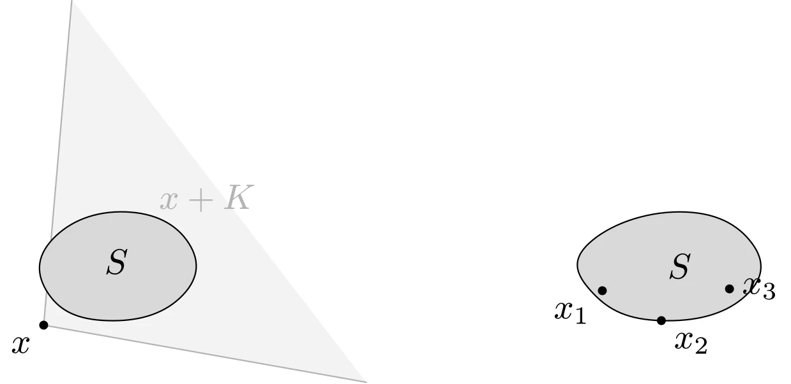

# 广义不等式

## 正常锥与广义不等式

若锥 $K \subseteq \mathbf{R}^{n}$ 是凸的、闭的、实的（具有非空内部）、尖的（$x \in K \wedge -x \in K \Rightarrow x=0$），则称之为正常锥。

正常锥 $K$ 可以用来定义**广义不等式**，即 $\mathbf{R}^{n}$ 上的偏序关系

$$
\begin{array}{c}
x \preceq_{K} y \Longleftrightarrow y-x \in K
\end{array}
$$

严格偏序关系定义为

$$
\begin{array}{c}
x \prec_{K} y \Longleftrightarrow y-x \in \operatorname{int} K
\end{array}
$$

::: info
**偏序关系与广义不等式**

在《离散数学》的课堂中，我们学过二元关系中有一种关系是偏序关系，它满足：

- 自反性：$\forall x$，$xRx$
- 反对称性：$\forall x, y$，$xRy \wedge yRx \Longrightarrow x = y$
- 传递性：$\forall x, y, z$，$xRy \wedge yRz \Longrightarrow xRz$

实际上，实数集 $\mathbf{R}$ 上的小于等于 $\leqslant$ 就是一种偏序关系。广义不等式是此概念的推广，不过需要集合是正常锥，因此在 $n$ 维空间的非负象限 $\mathbf{R}^n_{+}$ 上可以比较向量的大小。（今后使用 $\preceq$ 时，如果不加下标，默认是在 $\mathbf{R}^n_{+}$ 上的广义不等式。）

那么，$\mathbf{R}^n_{+}$ 上的 $n$ 维向量如何比较大小呢？实际上，相应的广义不等式对于向量间的分量不等式，即

$$
x \preceq y \Longleftrightarrow x_i \leqslant y_i, i = 1, \cdots n
$$

相应地，其严格不等式对应于严格的分量不等式，即

$$
x \prec y \Longleftrightarrow x_i < y_i, i = 1, \cdots n
$$
:::

除非负象限外，另一个重要的例子是对称矩阵集 $\mathbf{S}^n$ 上的半正定锥 $\mathbf{S}_+^n$：

$$
X \preceq_{\mathbf{S}_+^n} Y \Longleftrightarrow Y - X \succeq 0
$$

即矩阵不等式（Löwner 序）；相应地，二阶锥 $\{(x, t) \mid \|x\|_2 \leqslant t\}$ 导出的广义不等式为 $(x, t) \preceq_K (y, s) \Longleftrightarrow \|y - x\|_2 \leqslant s - t$。

### 广义不等式的性质

- 具有偏序关系的性质：自反性、反对称性、传递性
- 运算保序性：加法、非负数乘、极限

## 最（极）大（小）元

正常锥的最（极）大（小）元与《离散数学》课程中的二元关系的相关概念没有本质区别。

设 $x \in S$，对 $\forall y \in S$，均有 $x \preceq_{K} y$，则称 $x$ 是 $S$ 的**最小元**。最小元是唯一的。$x$ 是 $S$ 的最小元，当且仅当

$$
\begin{aligned}
S \subseteq x + K
\end{aligned}
$$

这里 $x + K$ 表示可以与 $x$ 相比并且大于或等于（根据 $\preceq_K$） $x$ 的所有元素。

设 $y \in S$，若 $y \preceq_K x \Rightarrow y = x$，则称 $x$ 是 $S$ 上的**极小元**。极小元是不唯一的。$x$ 是 $S$ 上的**极小元**，当且仅当

$$
\begin{aligned}
(x - K) \cap S = \{x\}
\end{aligned}
$$
如图所示，左边的集合 $S$ 存在最小元 $x$（此时 $S \subseteq x + K$）；右边的集合 $S$ 不存在最小元，但边界上的 $x_1, x_2, x_3$ 等点都是极小元：



::: details TikZ 代码

```tex
\begin{tikzpicture}[line cap=round,line join=round,scale=0.9]
  % left: minimum element: S is contained in x + K
  \begin{scope}
    \fill[gray!10] (0.5,0.1) -- (4.05,-0.53) -- (0.81,3.69) -- cycle;
    \draw[gray!60] (0.5,0.1) -- (4.05,-0.53);
    \draw[gray!60] (0.5,0.1) -- (0.81,3.69);
    \draw[fill=gray!30] plot[smooth cycle,tension=0.8]
      coordinates {(0.6,1.05) (1.4,1.35) (2.1,1.0) (2.0,0.4) (1.2,0.15) (0.55,0.45)};
    \fill (0.5,0.1) circle (1.4pt) node[below left] {$x$};
    \node at (1.3,0.8) {$S$};
    \node[gray!60] at (2.3,1.5) {$x+K$};
  \end{scope}
  % right: minimal elements: (x - K) cap S = {x}
  \begin{scope}[shift={(6.2,0)}]
    \draw[fill=gray!30] plot[smooth cycle,tension=0.8]
      coordinates {(0.3,1.0) (1.3,1.35) (2.1,1.0) (2.0,0.4) (1.1,0.15) (0.35,0.45)};
    \node at (1.3,0.75) {$S$};
    \fill (0.45,0.48) circle (1.4pt) node[below left] {$x_1$};
    \fill (1.1,0.15) circle (1.4pt) node[below right] {$x_2$};
    \fill (1.85,0.5) circle (1.4pt) node[right] {$x_3$};
  \end{scope}
\end{tikzpicture}
```

:::
