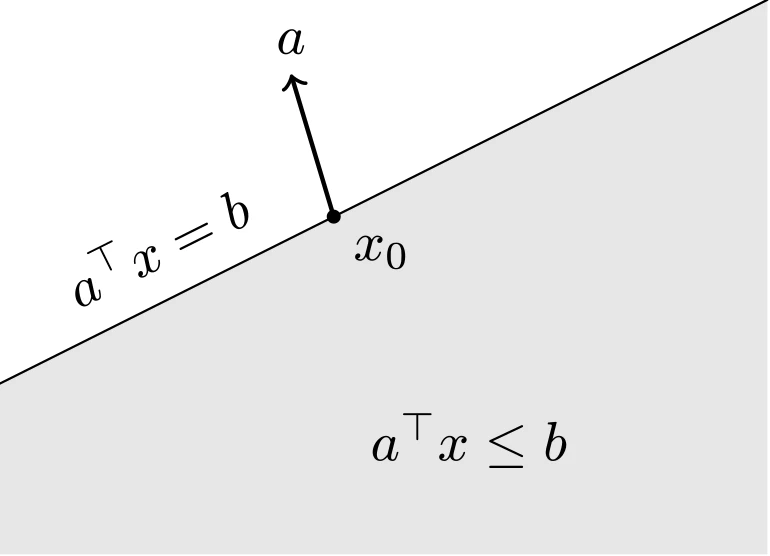
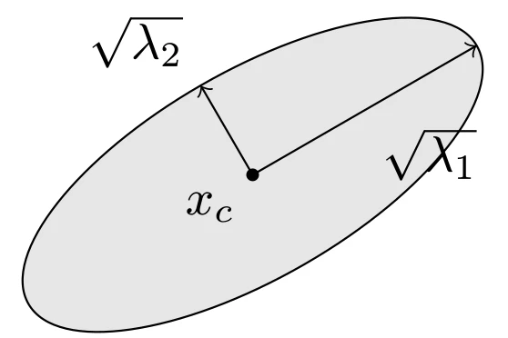
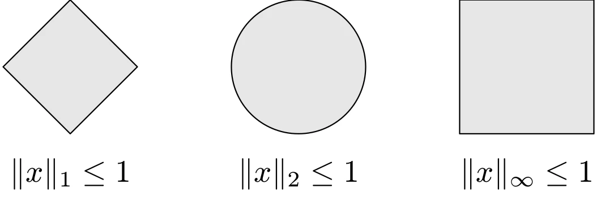
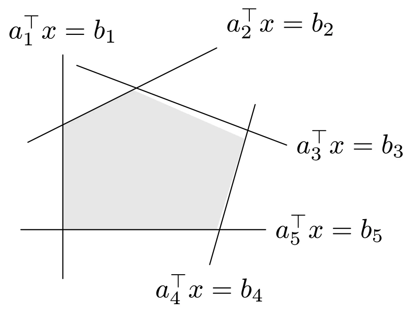

# 重要凸集

## 一些简单的凸集

- 空集 $\emptyset$、任意一点（单点集）$\{x_0\}$、全空间 $\mathbf{R}^{n}$ 都是 $\mathbf{R}^{n}$ 的仿射（自然也是凸的）子集。
- 任意直线是仿射的。如果直线通过零点，则是子空间，因此，也是凸锥。
- 一条线段是凸的，但不是仿射的（除非退化为一个点）。
- 一条射线是凸的，但不是仿射的。如果射线的基点是零点，则它是凸锥。
- 任意子空间是仿射的、凸锥（自然是凸的）。

## 超平面与半空间

超平面是具有如下形式的集合

$$
\begin{aligned}
\{x \mid a^{\top}x=b\}
\end{aligned}
$$

其中 $a \in \mathbf{R}^{n}$，$a \ne 0$ 且 $b \in \mathbf{R}$。超平面是关于 $x$ 的非平凡线性方程的解空间（因此是一个仿射集合）。几何上，$\{x \mid a^{\top}x=b\}$ 可以看作是法线方向为 $a$ 的超平面，而常数 $b$ 决定了这个平面从原点的偏移。下面给出的是超平面的点向式方程：

$$
\begin{aligned}
\{x \mid a^{\top}(x - x_0) = 0\}
\end{aligned}
$$

一个超平面将全空间 $\mathbf{R}^{n}$ 划分为两个半空间。（闭的）半空间是具有如下形式的集合：

$$
\begin{aligned}
\{x \mid a^{\top}x \leqslant b\}
\end{aligned}
$$

半空间是凸的，但不是仿射的。凸性可以直接验证：若 $a^{\top}x_1 \leqslant b$、$a^{\top}x_2 \leqslant b$，则对任意 $\theta \in [0,1]$ 有

$$
\begin{aligned}
a^{\top}(\theta x_1 + (1-\theta)x_2) = \theta a^{\top}x_1 + (1-\theta) a^{\top}x_2 \leqslant b
\end{aligned}
$$

即凸组合仍在半空间中。超平面是半空间的边界。



::: details TikZ 代码

```tex
\begin{tikzpicture}[line cap=round,line join=round,scale=0.9]
  % closed halfspace {x | a^T x <= b}
  \fill[gray!20] (-2,-1.9) -- (3.4,-1.9) -- (3.4,2.0) -- (-2,-0.7) -- cycle;
  \draw (-2,-0.7) -- (3.4,2.0);
  \node at (-0.9,0.28) [rotate=26.6] {$a^{\top}x = b$};
  \fill (0.35,0.475) circle (1.4pt) node[below right] {$x_0$};
  \draw[->,thick] (0.35,0.475) -- (0.05,1.475) node[above] {$a$};
  \node at (1.3,-1.1) {$a^{\top}x \leq b$};
\end{tikzpicture}
```

:::

## Euclid 球和椭球

$\mathbf{R}^{n}$ 中的空间 Euclid 球（或简称为球）具有如下形式：

$$
\begin{aligned}
B(x_c, r) = \{x \mid \|x - x_c\| _2 \leqslant r\}
\end{aligned}
$$

其中向量 $x_c$ 是球心，标量 $r > 0$ 是半径。Euclid 还有另一种常见的表达式为：

$$
\begin{aligned}
B(x_c, r) = \{x_c + ru \mid \|u\| _2 \leqslant 1\}
\end{aligned}
$$

和 Euclid 球类似的还有椭球，它们具有如下形式：

$$
\begin{aligned}
\mathcal{E} = \{x | (x - x_c)^{\top} P^{-1} (x - x_c) \leqslant 1\}
\end{aligned}
$$

其中 $P = P^{\top} \succ 0$，即 $P$ 是对称正定矩阵。向量 $x_c$ 为椭球的中心，矩阵 $P$ 决定了椭球从 $x_c$ 向各个方向扩展的幅度。$\mathcal{E}$ 的半轴长度为 $\sqrt{\lambda_i}$，这里的 $\lambda_i$ 为 $P$ 的特征值。



::: details TikZ 代码

```tex
\begin{tikzpicture}[line cap=round,line join=round,scale=0.9]
  % ellipsoid {(x-xc)^T P^{-1} (x-xc) <= 1}
  \draw[fill=gray!20,rotate around={30:(0,0)}] (0,0) ellipse (2 and 0.8);
  \fill (0,0) circle (1.4pt) node[below left] {$x_c$};
  \draw[->] (0,0) -- (1.73,1.0) node[midway,below right] {$\sqrt{\lambda_1}$};
  \draw[->] (0,0) -- (-0.4,0.69) node[above left] {$\sqrt{\lambda_2}$};
\end{tikzpicture}
```

:::

当 $P = r^2 I$ 时椭球退化为半径为 $r$ 的 Euclid 球，因此 Euclid 球是椭球的特例。椭球是凸集：设 $x_1, x_2 \in \mathcal{E}$，$\theta \in [0,1]$，由 $P^{-1} \succ 0$ 对应二次型的凸性可得 $\theta x_1 + (1-\theta)x_2 \in \mathcal{E}$。

椭球另一个常用的表示形式是

$$
\begin{aligned}
\mathcal{E} = \{x_c + Au \mid \|u\| _2 \leqslant 1\}
\end{aligned}
$$

## 范数球和范数锥

关于范数 $\|\cdot\|$（$\mathbf{R}^{n}$ 上的任意范数）的球定义为

$$
\begin{aligned}
B(x_c, r) = \{x \mid \|x - x_c\| \leqslant r\}
\end{aligned}
$$

其中 $r > 0$ 为半径，$x_c$ 为球心。关于范数 $\|\cdot\|$ 的单位球为 $\{x \mid \|x\| \leqslant 1\}$。下图给出了 $\mathbf{R}^2$ 中 $\ell_1$、$\ell_2$ 和 $\ell_{\infty}$ 范数的单位球：



::: details TikZ 代码

```tex
\begin{tikzpicture}[line cap=round,line join=round,scale=0.75]
  % unit balls of l1, l2 and linf norms
  \draw[fill=gray!20] (1,0) -- (0,1) -- (-1,0) -- (0,-1) -- cycle;
  \node at (0,-1.6) {$\|x\|_1 \leq 1$};
  \begin{scope}[shift={(3.4,0)}]
    \draw[fill=gray!20] (0,0) circle (1);
    \node at (0,-1.6) {$\|x\|_2 \leq 1$};
  \end{scope}
  \begin{scope}[shift={(6.8,0)}]
    \draw[fill=gray!20] (-1,-1) rectangle (1,1);
    \node at (0,-1.6) {$\|x\|_{\infty} \leq 1$};
  \end{scope}
\end{tikzpicture}
```

:::

由范数的三角不等式和正齐次性可知，范数球是凸集：若 $\|x_1 - x_c\| \leqslant r$、$\|x_2 - x_c\| \leqslant r$，则

$$
\begin{aligned}
\|\theta x_1 + (1-\theta)x_2 - x_c\| \leqslant \theta\|x_1 - x_c\| + (1-\theta)\|x_2 - x_c\| \leqslant r
\end{aligned}
$$

范数锥是与范数 $\|\cdot\|$ 对应的锥：

$$
\begin{aligned}
C = \{(x, t) \mid \|x\| \leqslant t\} \subseteq \mathbf{R}^{n+1}
\end{aligned}
$$

显然，它是一个凸锥：若 $(x_1, t_1), (x_2, t_2) \in C$，则由三角不等式，

$$
\begin{aligned}
\|\theta x_1 + (1-\theta)x_2\| \leqslant \theta\|x_1\| + (1-\theta)\|x_2\| \leqslant \theta t_1 + (1-\theta)t_2
\end{aligned}
$$

即 $\theta (x_1, t_1) + (1-\theta)(x_2, t_2) \in C$。

## 多面体

多面体被定义为有限个线性等式和不等式的解集

$$
\begin{aligned}
\mathcal{P} = \{x \mid a_i^{\top}x \leqslant b_i, i=1,\cdots,m, c_j^{\top}x = d_j, j=1,\cdots,p\}
\end{aligned}
$$

因此，多面体是有限个半空间和超平面的交集。仿射集合（例如子空间、超平面、直线）、射线、线段和半空间都是多面体。显而易见，多面体是凸集。



::: details TikZ 代码

```tex
\begin{tikzpicture}[line cap=round,line join=round,scale=0.9]
  % polyhedron as intersection of five halfspaces
  \fill[gray!20] (-1,-0.5) -- (-1,1.0) -- (0,1.5) -- (1.6,0.8) -- (1.2,-0.5) -- cycle;
  \draw (-1,-1.2) -- (-1,2.0) node[above] {$a_1^{\top}x = b_1$};
  \draw (-1.5,0.75) -- (1.2,2.1) node[above right] {$a_2^{\top}x = b_2$};
  \draw (-0.8,1.85) -- (2.2,0.71) node[right] {$a_3^{\top}x = b_3$};
  \draw (1.75,1.29) -- (1.1,-1.0) node[below] {$a_4^{\top}x = b_4$};
  \draw (-1.6,-0.5) -- (1.9,-0.5) node[right] {$a_5^{\top}x = b_5$};
\end{tikzpicture}
```

:::

如图所示，多面体（阴影部分）是有限个半空间 $a_i^{\top}x \leqslant b_i$ 的交。

多面体可以使用紧凑表达式来表示

$$
\begin{aligned}
\mathcal{P} = \{x \mid Ax \preceq b, Cx = d\}
\end{aligned}
$$

### 单纯形

单纯形是一类重要的多面体。设 $k+1$ 个点 $v_0, \cdots, v_k \in \mathbf{R}^{n}$ 仿射独立，即 $v_1-v_0, \cdots, v_k-v_0$ 线性独立，那么这些点决定了一个单纯形状

$$
\begin{aligned}
C = \operatorname{conv}\{v_0, \cdots, v_k\} = \{\theta_0v_0 + \cdots + \theta_kv_k \mid \theta \succeq 0, \mathbf{1}^{\top}\theta=1\}
\end{aligned}
$$

其中 $\mathbf{1}$ 表示所有分量均为 1 的向量。这个单纯形的仿射维数为 $k$，因而也称为 $\mathbf{R}^{n}$ 空间的 $k$ 维单纯形。

一维空间中的单纯形是一条线段，二维空间中的单纯形是一个三角形，三维空间中的单纯形是一个四面体。

例如，概率单纯形（probability simplex）

$$
\begin{aligned}
\{x \in \mathbf{R}^{n} \mid x \succeq 0, \mathbf{1}^{\top}x = 1\}
\end{aligned}
$$

是 $n$ 个单位向量 $e_1, \cdots, e_n \in \mathbf{R}^{n}$ 决定的 $n-1$ 维单纯形，其上的点可以解释为在一个 $n$ 个结果的概率分布中取值。

### 多面体的凸包描述

有限集合 $\{v_1, \cdots, v_k\}$ 的凸包是

$$
\begin{aligned}
\operatorname{conv}\{v_1, \cdots, v_k\} = \{\theta_1v_1 + \cdots + \theta_kv_k \mid \theta \succeq 0, \mathbf{1}^{\top} \theta = 1\}
\end{aligned}
$$

它表示 $k-1$ 维空间中由 $k$ 个顶点组成的有界多面体。

## 半正定锥

设 $\mathbf{S}^n$ 表示 $n$ 阶对称矩阵的集合，即

$$
\begin{aligned}
\mathbf{S}^n = \{X \in \mathbf{R}^{n \times n} \mid X = X^{\top}\}
\end{aligned}
$$

这是一个维数为 $n(n+1)/2$ 的向量空间。我们用 $\mathbf{S}_+^n$ 表示对称半正定矩阵的集合

$$
\begin{aligned}
\mathbf{S}_+^n = \{X \in \mathbf{S}^{n} \mid X \succeq 0\}
\end{aligned}
$$

用 $\mathbf{S}_{++}^n$ 表示对称正定矩阵的集合

$$
\begin{aligned}
\mathbf{S}_{++}^n = \{X \in \mathbf{S}^{n} \mid X \succ 0\}
\end{aligned}
$$

集合 $\mathbf{S}_+^n$ 是一个凸锥，称为半正定锥。凸性可以直接验证：若 $X, Y \succeq 0$，$\theta \in [0,1]$，则对任意 $z$ 有

$$
\begin{aligned}
z^{\top}(\theta X + (1-\theta)Y)z = \theta z^{\top}Xz + (1-\theta)z^{\top}Yz \geqslant 0
\end{aligned}
$$

即 $\theta X + (1-\theta)Y \succeq 0$。

例如 $\mathbf{S}^2$ 上的半正定锥

$$
\begin{aligned}
X=\left[\begin{array}{ll}
x & y \\
y & z
\end{array}\right] \in \mathbf{S}_{+}^{2} \Longleftrightarrow 
\left\{\begin{matrix}
x \geqslant 0 \\
z \geqslant 0 \\
x z \geqslant y^{2}
\end{matrix}\right.
\end{aligned}
$$
