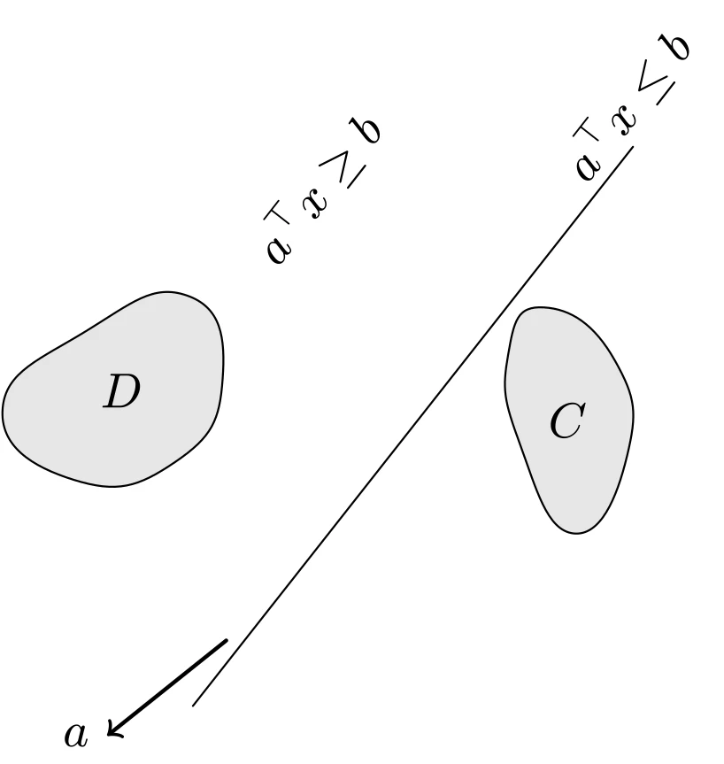
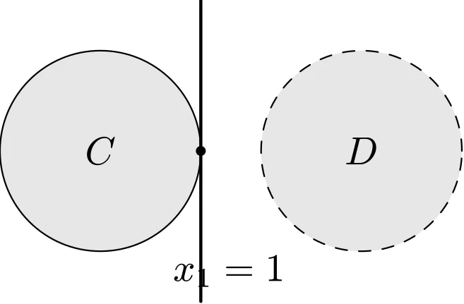
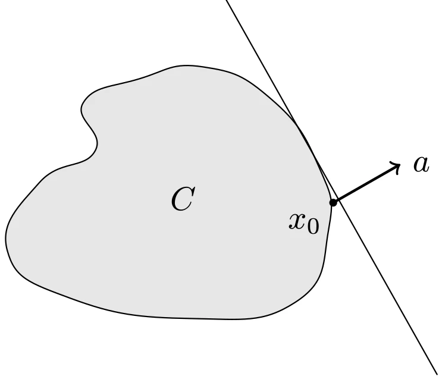

# 分离与支撑超平面

## 超平面分离定理

设两个凸集 $C \cap D = \emptyset$，那么 $\exists a \ne 0, b$ 使得对 $\forall x \in C$ 有 $a^{\top}x \leqslant b$，对 $\forall x \in D$ 有 $a^{\top}x \geqslant b$。称超平面 $\{x \mid a^{\top}x = b\}$ 为凸集 $C$ 和 $D$ 的**分离超平面**，如图所示：



::: details TikZ 代码

```tex
\begin{tikzpicture}[line cap=round,line join=round,scale=0.85]
  % separating hyperplane of two convex sets
  \draw (-0.6,-2.1) -- (3.1,2.6);
  \node at (0.45,2.25) [rotate=52] {$a^{\top}x \geq b$};
  \node at (3.05,2.95) [rotate=52] {$a^{\top}x \leq b$};
  \begin{scope}[shift={(-1.7,0.3)}]
    \draw[fill=gray!20] plot[smooth cycle,tension=0.9]
      coordinates {(0.2,0.75) (1.05,1.05) (1.35,0.35) (0.95,-0.35) (0.1,-0.5) (-0.5,0.1)};
    \node at (0.5,0.25) {$D$};
  \end{scope}
  \begin{scope}[shift={(2.0,-0.1)}]
    \draw[fill=gray!20] plot[smooth cycle,tension=0.9]
      coordinates {(0.35,1.35) (0.95,0.9) (1.05,0.1) (0.6,-0.55) (0.15,0.2) (0.05,0.95)};
    \node at (0.55,0.4) {$C$};
  \end{scope}
  \draw[->,thick] (-0.32,-1.55) -- (-1.32,-2.35) node[left] {$a$};
\end{tikzpicture}
```

:::

*注：*

- 分离不一定是严格的：上述定理只保证 $a^{\top}x \leqslant b$ 与 $a^{\top}x \geqslant b$，两个集合可以同时接触分离超平面。
- **严格分离**需要更强的条件：若 $C$ 是闭集、$D$ 是紧集（有界闭集）且二者不相交，则存在 $a \ne 0$ 和 $\varepsilon > 0$，使得

  $$
  \begin{aligned}
  a^{\top}x \leqslant b - \varepsilon, \quad x \in C, \qquad a^{\top}x \geqslant b + \varepsilon, \quad x \in D
  \end{aligned}
  $$

- 不相交的凸集不一定能被**严格**分离。例如闭单位圆盘 $C = \{x \mid \|x\|_2 \leqslant 1\}$ 与与之相切的开圆盘 $D = \{x \mid \|x - (2, 0)^{\top}\|_2 < 1\}$ 不相交，虽然可以被超平面 $x_1 = 1$ 分离，但由于 $C$ 在点 $(1,0)$ 处接触该超平面，任何分离超平面都无法使 $C$ 严格地位于一侧，如图所示：



::: details TikZ 代码

```tex
\begin{tikzpicture}[line cap=round,line join=round,scale=0.9]
  % disjoint convex sets that cannot be strictly separated
  \draw[fill=gray!20] (0,0) circle (1);
  \node at (0,0) {$C$};
  \draw[dashed,fill=gray!20] (2.6,0) circle (1);
  \node at (2.6,0) {$D$};
  \draw[thick] (1,-1.5) -- (1,1.5);
  \node at (1.28,-1.2) {$x_1 = 1$};
  \fill (1,0) circle (1.4pt);
\end{tikzpicture}
```

:::

- 超平面分离定理的逆命题：不成立。

## 支撑超平面

设 $C \subseteq \mathbf{R}^{n}$ 而非零向量 $a$ 满足对 $\forall x \in C$ 有 $a^{\top} x \leqslant a^{\top} x_0$，其中 $x_0 \in \operatorname{bd} C$，那么称超平面 $\{x \mid a^{\top} x = a^{\top} x_0\}$ 为集合 $C$ 在点 $x_0$ 处的**支撑超平面**。从几何上看，超平面 $\{x \mid a^{\top} x = a^{\top} x_0\}$ 与 $C$ 相切于点 $x_0$，半空间 $\{x \mid a^{\top} x \leqslant a^{\top} x_0\}$ 包含 $C$，如图所示：



::: details TikZ 代码

```tex
\begin{tikzpicture}[line cap=round,line join=round,scale=0.85]
  % supporting hyperplane of C at boundary point x0
  \draw[fill=gray!20] plot[smooth cycle,tension=0.85]
    coordinates {(1.15,2.2) (2.0,1.8) (2.6,0.95) (2.72,0.15) (2.3,-0.75) (1.0,-0.95)
                 (-0.5,-0.7) (-1.3,-0.1) (-0.9,0.75) (-0.2,1.15) (-0.35,1.75) (0.35,2.05)};
  \node at (0.9,0.55) {$C$};
  \draw (1.44,3.04) -- (4.08,-1.65);
  \fill (2.78,0.5) circle (1.4pt) node[below left] {$x_0$};
  \draw[->,thick] (2.78,0.5) -- (3.62,0.98) node[right] {$a$};
\end{tikzpicture}
```

:::

**支撑超平面定理**：若 $C$ 是闭凸集且 $x_0 \in \operatorname{bd} C$，则 $C$ 在点 $x_0$ 处存在支撑超平面。事实上，将点集 $\{x_0\}$ 与 $C$ 分离并对 $b$ 取上确界即可。对于一般集合（非凸或非闭），在边界点处不一定存在支撑超平面。

支撑超平面定理的逆命题也不成立：闭集在每个边界点处都有支撑超平面并不意味着它是凸的。
