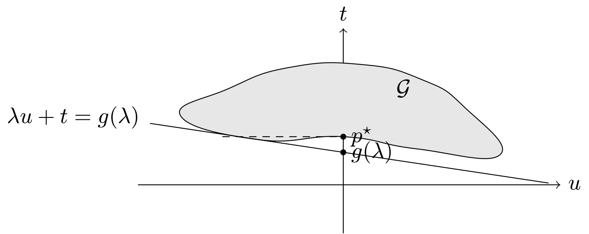
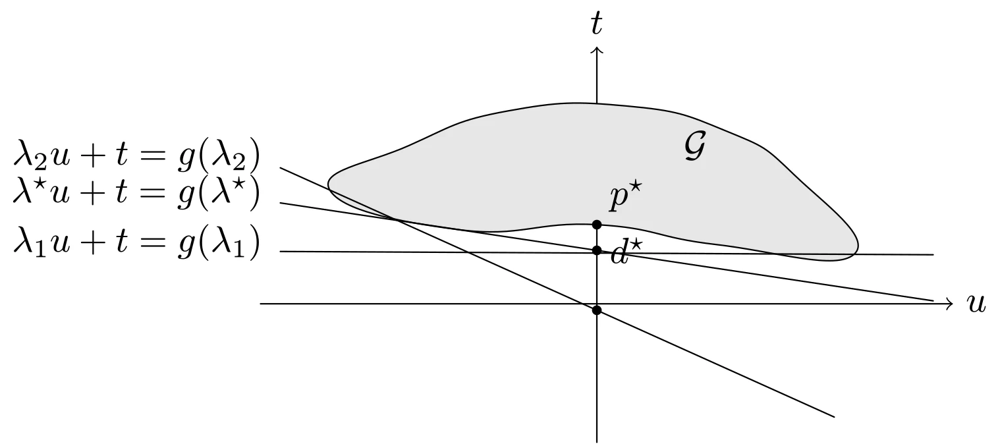
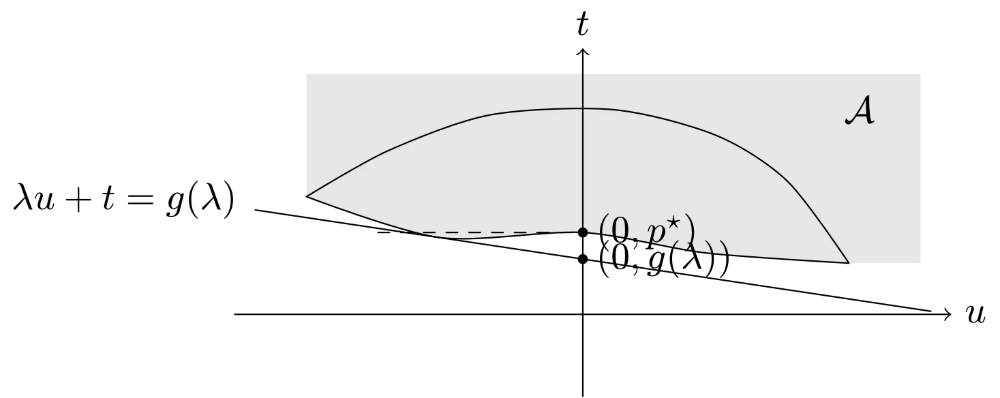

# 几何解释

## 通过函数值集合理解强弱对偶性

可以通过集合

$$
\begin{aligned}
    \mathcal{G}=\{(f_1(x), &\cdots, f_m(x), \\
    h_1(x), &\cdots, h_p(x), f_0(x)) \in \mathbf{R}^m \times \mathbf{R}^p \times \mathbf{R} \mid x \in \mathcal{D}\}
\end{aligned}
$$

给出对偶函数的简单几何解释。事实上，此集合是约束函数和目标函数所取得的函数值。利用集合 $\mathcal{G}$，可以很容易地表达优化问题的最优值 $p^{\star}$。

$$
p^{\star} = \inf \{ t \mid (u, v, t) \in \mathcal{G}, u \preceq 0, v = 0 \}
$$

求解以 $(\lambda, \nu)$ 为自变量的对偶函数，得到

$$
g(\lambda, \nu) = \inf \{ (\lambda, \nu, 1)^{\top}(u, v, t) \mid (u, v, t) \in \mathcal{G} \}
$$

如果下确界有界，则不等式

$$
(\lambda, \nu, 1)^{\top}(u, v, t) \geqslant g(\lambda, \nu)
$$

定义了集合 $\mathcal{G}$ 的一个支撑超平面。



::: details TikZ 代码

```tex
\begin{tikzpicture}[line cap=round,line join=round,scale=0.95]
  % G set and the supporting line lambda u + t = g(lambda)
  \draw[->] (-3.4,0) -- (3.6,0) node[right] {$u$};
  \draw[->] (0,-0.8) -- (0,2.6) node[above] {$t$};
  \draw[fill=gray!20] plot[smooth cycle,tension=0.85]
    coordinates {(-2.7,1.15) (-1.9,1.6) (-0.9,1.95) (0.3,2.0) (1.3,1.75) (2.0,1.3) (2.6,0.5) (1.2,0.6) (0,0.8) (-1.4,0.75)};
  \node at (1.0,1.6) {$\mathcal{G}$};
  \draw[dashed] (-2.0,0.8) -- (0,0.8);
  \fill (0,0.8) circle (1.4pt) node[right] {$p^{\star}$};
  \fill (0,0.54) circle (1.4pt) node[right] {$g(\lambda)$};
  \draw (-3.2,1.02) -- (3.4,0.03);
  \node[anchor=east] at (-3.25,1.12) {$\lambda u + t = g(\lambda)$};
\end{tikzpicture}
```

:::

针对只有一个（不等式）约束的简单问题，对偶函数和下界 $g(\lambda) \leqslant p^{\star}$ 的几何解释如图所示。给定 $\lambda$，在集合 $\mathcal{G} = \{ (f_1(x), f_0(x)) \mid x \in \mathcal{D} \}$ 上极小化 $(\lambda, 1)^{\top}(u, t)$，得到斜率为 $-\lambda$ 的支撑超平面。支撑超平面与坐标轴 $u = 0$ 的交点即为 $g(\lambda)$。



::: details TikZ 代码

```tex
\begin{tikzpicture}[line cap=round,line join=round,scale=0.95]
  % G set and supporting lines for three dual feasible lambdas
  \draw[->] (-3.4,0) -- (3.6,0) node[right] {$u$};
  \draw[->] (0,-1.4) -- (0,2.6) node[above] {$t$};
  \draw[fill=gray!20] plot[smooth cycle,tension=0.85]
    coordinates {(-2.7,1.15) (-1.9,1.6) (-0.9,1.95) (0.3,2.0) (1.3,1.75) (2.0,1.3) (2.6,0.5) (1.2,0.6) (0,0.8) (-1.4,0.75)};
  \node at (1.0,1.6) {$\mathcal{G}$};
  \fill (0,0.8) circle (1.4pt) node[above right] {$p^{\star}$};
  \fill (0,0.54) circle (1.4pt) node[right] {$d^{\star}$};
  \fill (0,-0.065) circle (1.4pt);
  % lambda1: nearly flat, touching the right tail
  \draw (-3.2,0.529) -- (3.4,0.496);
  \node[anchor=east] at (-3.25,0.62) {$\lambda_1 u + t = g(\lambda_1)$};
  % lambda*: touching the dip
  \draw (-3.2,1.02) -- (3.4,0.03);
  \node[anchor=east] at (-3.25,1.12) {$\lambda^{\star} u + t = g(\lambda^{\star})$};
  % lambda2: steep, intercept below zero
  \draw (-3.2,1.375) -- (2.4,-1.145);
  \node[anchor=east] at (-3.25,1.5) {$\lambda_2 u + t = g(\lambda_2)$};
\end{tikzpicture}
```

:::

如图所示，对偶可行的三个 $\lambda$ 值对应的支撑超平面，这三个值中包含最优值 $\lambda^{\star}$。强对偶性此时不成立，最优对偶间隙 $p^{\star} - d^{\star} > 0$。

### 上镜图变化

通过下面的理解，我们就可以解释为什么对（大部分）凸问题，强对偶性总是成立。定义集合 $\mathcal{A} \subseteq \mathbf{R}^m \times \mathbf{R}^p \times \mathbf{R}$ 为

$$
\begin{aligned}
    \mathcal{A} &= G + \{ \mathbf{R}^M_+ \times \{ 0 \} \times \mathbf{R}_+ \} \\
    &= \{ (u, v, t) \mid \exists x \in \mathcal{D}, f_i(x) \leqslant u_i, i=1,\cdots,m, \\
    & \qquad h_i(x) = v_i, i=1,\cdots,p, f_0(x) \leqslant t \}
\end{aligned}
$$

我们可以认为 $\mathcal{A}$ 是 $\mathcal{G}$ 的一种上镜图形式，因为 $\mathcal{A}$ 包含了 $\mathcal{G}$ 中的所有点以及一些“较坏”的点，即目标函数值或者不等式约束函数值较大的点。

可以用 $\mathcal{A}$ 来描述最优值

$$
p^{\star}=\inf \{t \mid (0,0,t) \in \mathcal{A}\}
$$

同样的，我们可以通过极小化仿射函数得到关于 $(\lambda, \nu)$ 的对偶函数

$$
g(\lambda, \nu)=\inf \{(\lambda, \nu, 1)^{\top}(u, v, t) \mid(u, v, t) \in \mathcal{A}\}
$$

如果确定下确界有界，则

$$
(\lambda, \nu, 1)^{\top}(u, v, t) \geqslant g(\lambda, \nu)
$$

定义了 $\mathcal{A}$ 的一个非竖直的支撑超平面。

特别地，由于 $(0, 0, p^{\star}) \in \operatorname{bd} \mathcal{A}$，我们有

$$
p^{\star} = (\lambda, \nu, 1)^{\top} (0, 0, p^{\star}) \geqslant g(\lambda, \nu)
$$

即弱对偶性成立。强对偶性成立，当且仅当存在某些对偶可行变量 $(\lambda, \nu)$，使得上式中的不等号取等号。从几何上看，对于集合 $\mathcal{A}$，存在一个边界点 $(0, 0, p^{\star})$ 处的非竖直的支撑超平面。



::: details TikZ 代码

```tex
\begin{tikzpicture}[line cap=round,line join=round,scale=0.95]
  % epigraph variation A = G + R_+ x R_+
  % shared bottom boundary of G (from right tail back to left tip)
  \fill[gray!20] (-2.7,1.15) -- (-2.7,2.35) -- (3.3,2.35) -- (3.3,0.5) -- (2.6,0.5)
    plot[smooth] coordinates {(2.6,0.5) (1.2,0.6) (0,0.8) (-1.4,0.75) (-2.7,1.15)};
  % outline of G: smooth top + smooth bottom (same points)
  \draw plot[smooth] coordinates {(-2.7,1.15) (-1.9,1.6) (-0.9,1.95) (0.3,2.0) (1.3,1.75) (2.0,1.3) (2.6,0.5)};
  \draw plot[smooth] coordinates {(2.6,0.5) (1.2,0.6) (0,0.8) (-1.4,0.75) (-2.7,1.15)};
  \node at (2.7,2.0) {$\mathcal{A}$};
  \draw[->] (-3.4,0) -- (3.6,0) node[right] {$u$};
  \draw[->] (0,-0.8) -- (0,2.6) node[above] {$t$};
  \draw[dashed] (-2.0,0.8) -- (0,0.8);
  \fill (0,0.8) circle (1.4pt) node[right] {$(0, p^{\star})$};
  \fill (0,0.54) circle (1.4pt) node[right] {$(0, g(\lambda))$};
  \draw (-3.2,1.02) -- (3.4,0.03);
  \node[anchor=east] at (-3.25,1.12) {$\lambda u + t = g(\lambda)$};
\end{tikzpicture}
```

:::

针对具有一个（不等式）约束的问题，对偶函数和下界 $g(\lambda) \leqslant p^{\star}$ 的几何解释。给定 $\lambda$，在 $\mathcal{A}$ 上极小化 $(\lambda, 1)^{\top}(u, t)$。这样可以得到斜率为 $-\lambda$ 的支撑超平面。此支撑超平面与坐标轴 $u = 0$ 的交点即为 $(0, g(\lambda))$。

## 在约束规则下强对偶性成立的证明

> 本文从略

## 多准则解释

多准则凸优化问题的每个 Pareto 最优解都是给定某个非负权向量 $\tilde{\lambda}$ 时函数

$$
\tilde{\lambda}^{\top} F(x)=f_{0}(x)+\sum_{i=1}^{m} \lambda_{i} f_{i}(x)
$$

的最小点，我们考虑集合

$$
\mathcal{A}=\left\{ t \in \mathbf{R}^{m+1} \mid \exists x \in \mathcal{D}, f_{i}(x) \leqslant t_{i}, i=0, \cdots, m \right\}
$$

这和研究 Lagrange 对偶问题时的定义一样，此时所需权向量也是集合在任意一个 Pareto 最优点处的支撑超平面。在多准则优化问题中，权向量的含义是目标函数的相对权重。当我们固定权向量的最后一个分量（和函数 $f_0$ 对应）为 1 时，其他权向量分量的含义是相对 $f_0$ 的成本，即相对于目标函数的成本。
