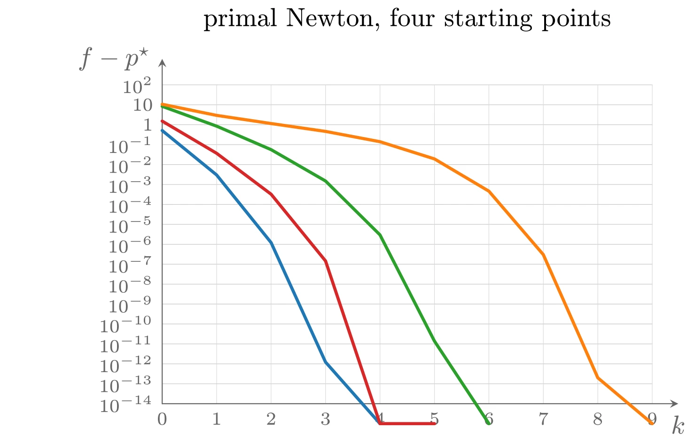
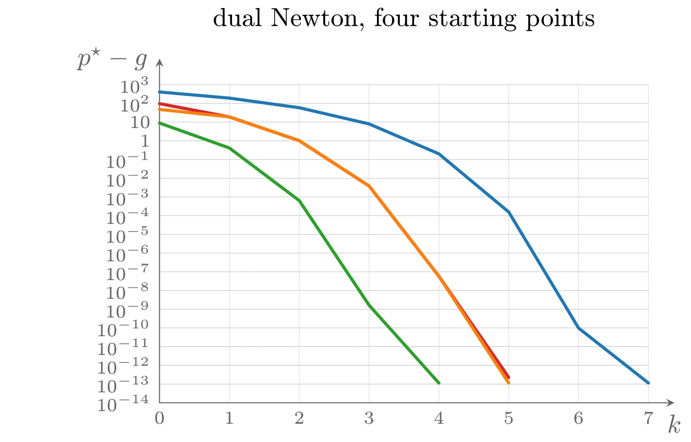
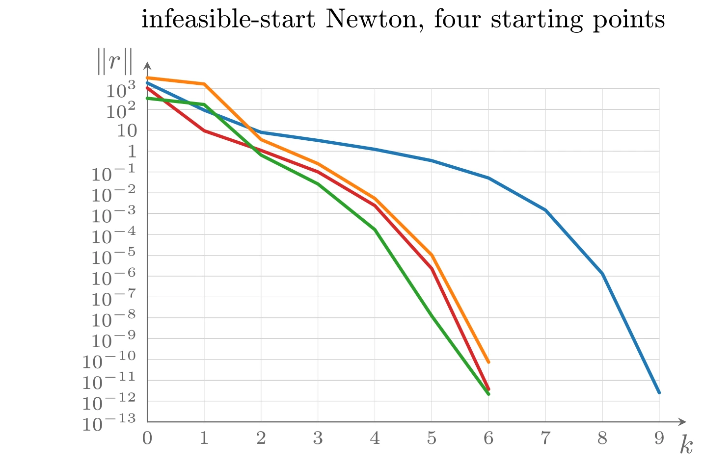

# 实现

## 消去法

要实现消去法，需要计算满足

$$
\{x \mid Ax = b\} = \{Fz + \hat{x} \mid z \in \mathbf{R}^{n-p}\}
$$

的满秩矩阵 $F$ 与向量 $\hat{x}$，具体方法见教材附录 C。

## 求解 KKT 系统

计算 Newton 步或不可行 Newton 步都要求解 KKT 形式的线性方程组

$$
\begin{bmatrix}
    H & A^{\top} \\
    A & 0
\end{bmatrix}
\begin{bmatrix}
    v \\
    w
\end{bmatrix}
= -
\begin{bmatrix}
    g \\
    h
\end{bmatrix}
$$

其中假设 $H \in \mathbf{S}^n_{+}$，$A \in \mathbf{R}^{p \times n}$ 且 $\operatorname{rank} A = p < n$。类似的方法可用于计算凸—凹博弈的 Newton 步（此时系数矩阵右下块为负半定）。

### 直接求解完整的 KKT 系统

最直接的方法是把 KKT 系统当作关于 $n + p$ 个变量的 $n + p$ 阶线性方程组直接求解。KKT 矩阵对称但不正定，一个好的方法是 $LDL^{\top}$ 分解。若不利用任何结构，代价为 $(1/3)(n + p)^3$ flops。当问题规模较小（$n$ 和 $p$ 不太大），或 $A$ 和 $H$ 稀疏时，这可能是合理的选择。

### 通过消去求解 KKT 系统

通常更好的方法是基于消去变量 $v$ 的方法。先考虑最简单的情形 $H \succ 0$。从 KKT 方程的第一式

$$
Hv + A^{\top}w = -g, \quad Av = -h
$$

解出 $v = -H^{-1}(g + A^{\top}w)$，代入第二式得 $AH^{-1}(g + A^{\top}w) = h$，于是

$$
w = (AH^{-1}A^{\top})^{-1}(h - AH^{-1}g)
$$

$w$ 的表达式中出现的矩阵是 Hessian $H$ 在 KKT 矩阵中的 **Schur 补**&#8203;（Schur complement）的相反数：

$$
S = -AH^{-1}A^{\top}
$$

由于 $A$ 满秩，$S$ 是负定的。

**算法 10.3（分块消去求解 KKT 系统）** 给定 $H \succ 0$ 的 KKT 系统。

1. 形成 $H^{-1}A^{\top}$ 和 $H^{-1}g$。
2. 形成 Schur 补 $S = -AH^{-1}A^{\top}$。
3. 解 $Sw = AH^{-1}g - h$ 确定 $w$。
4. 解 $Hv = -A^{\top}w - g$ 确定 $v$。

第 1 步可通过 $H$ 的 Cholesky 分解加 $p + 1$ 次求解完成，代价为 $f + (p + 1)s$（$f$ 为分解代价，$s$ 为一次求解的代价）；第 2 步是 $p \times n$ 乘 $n \times p$ 的矩阵乘法（利用对称性只需计算上三角），无结构时代价为 $p^2n$ flops；第 3 步对 $-S$ 做 Cholesky 分解，代价为 $(1/3)p^3$；第 4 步利用第 1 步已有的分解，代价为 $2np + s$。总代价为

$$
f + ps + p^2n + (1/3)p^3 \text{ flops（保留主导项）}
$$

若能高效分解 $H$，分块消去比直接 $LDL^{\top}$ 分解整个 KKT 系统更划算。例如 $H$ 为对角阵（对应可分目标函数）时 $f = 0$、$s = n$，总代价 $p^2n + (1/3)p^3$ 只随 $n$ 线性增长；$H$ 为带宽 $k \ll n$ 的带状阵时，总代价约为 $nk^2 + 4nkp + p^2n + (1/3)p^3$，同样只随 $n$ 线性增长。其他可利用的结构还有块对角（对应块可分目标函数）、稀疏、对角加低秩等。

**例子：等式约束解析中心**&#8203;。问题 $\mathrm{minimize}\ -\sum_i \log x_i\ \mathrm{s.t.}\ Ax = b$ 的目标函数可分，Hessian 为对角阵 $H = \operatorname{diag}(x_1^{-2}, \cdots, x_n^{-2})$。若用一般方法（如对 KKT 矩阵做 $LDL^{\top}$ 分解），代价为 $(1/3)(n + p)^3$ flops；用分块消去则只需 $np^2 + (1/3)p^3$ flops，小得多。事实上这个代价与计算其对偶问题 Newton 步的代价相同（对偶 Hessian 为 $-\!ADA^{\top}$，$D$ 为对角阵）。

**例子：带等式约束的最短分段线性曲线**&#8203;。在 $\mathbf{R}^2$ 中求通过等式约束 $Ax = b$ 的最短分段线性曲线（节点 $(0,0), (1, x_1), \cdots, (n, x_n)$），目标函数是相邻变量对的函数之和，Hessian 为三对角阵；用分块消去计算 Newton 步约需 $p^2n + (1/3)p^3$ flops。

### $H$ 奇异时的消去法

当 $H$ 奇异时上述分块消去法不再适用，但可以做一个简单的变形，其基础是如下结果：&#8203;**KKT 矩阵非奇异当且仅当存在 $Q \succeq 0$ 使 $H + A^{\top}QA \succ 0$**&#8203;（此时对一切 $Q \succ 0$ 都有 $H + A^{\top}QA \succ 0$）。特别地，若 KKT 矩阵非奇异，则 $H + A^{\top}A \succ 0$。

取使 $H + A^{\top}QA \succ 0$ 的 $Q \succeq 0$，则原 KKT 系统等价于

$$
\begin{bmatrix}
    H + A^{\top}QA & A^{\top} \\
    A & 0
\end{bmatrix}
\begin{bmatrix}
    v \\
    w
\end{bmatrix}
= -
\begin{bmatrix}
    g + A^{\top}Qh \\
    h
\end{bmatrix}
$$

而新系统的左上块正定，可以用消去法求解。

## 例子

本节给出几个较长的例子，展示如何利用结构高效计算 Newton 步。

### 等式约束解析中心

考虑问题 $\mathrm{minimize}\ f(x) = -\sum_{i=1}^n \log x_i\ \mathrm{s.t.}\ Ax = b$（规模 $p = 100$，$n = 500$）。比较三种方法：

**方法一：带等式约束的 Newton 方法。&#8203;** Newton 步由 KKT 系统定义，利用消去法求解：先解

$$
A\operatorname{diag}(x)^2A^{\top}w = b
$$

再由 $\Delta x_{\mathrm{nt}} = -\operatorname{diag}(x)^2A^{\top}w + x$ 得到 Newton 步。

**方法二：对偶 Newton 方法。&#8203;** 对对偶问题 $\mathrm{maximize}\ g(\nu) = -b^{\top}\nu + \sum_i \log(A^{\top}\nu)_i + n$ 应用 Newton 方法，Newton 步由

$$
A\operatorname{diag}(y)^2A^{\top}\Delta\nu_{\mathrm{nt}} = -b + Ay, \quad y_i = 1/(A^{\top}\nu)_i
$$

给出。比较两式可见两种方法的计算复杂度相同。

**方法三：不可行初始点 Newton 方法。&#8203;** 应用于最优性条件 $\nabla f(x^{\star}) + A^{\top}\nu^{\star} = 0$，$Ax^{\star} = b$：先解

$$
A\operatorname{diag}(x)^2A^{\top}w = 2Ax - b
$$

然后 $\Delta\nu_{\mathrm{nt}} = w - \nu$，$\Delta x_{\mathrm{nt}} = x - \operatorname{diag}(x)^2A^{\top}w$。

实验（$\alpha = 0.1$，$\beta = 0.5$）表明：对偶方法显得最快，但只快两三倍——进入二次收敛区域约需 6 次迭代，而原始方法需 12–15 次、不可行初始点方法需 10–20 次。三种方法对初始化的要求不同：原始方法需要原始可行点（$Ax^{(0)} = b$，$x^{(0)} \succ 0$），对偶方法需要对偶可行点（$A^{\top}\nu^{(0)} \succ 0$），不可行初始点方法则不需要任何初始化（只要求 $x^{(0)} \succ 0$）。就具体问题而言，哪种初始信息更容易获得，哪种方法就更合适。



上图由下面的 TikZ 代码编译而来：

```tex

  \definecolor{cblue}{RGB}{31,119,180}
  \definecolor{cred}{RGB}{214,39,40}
  \definecolor{cgreen}{RGB}{44,160,44}
  \definecolor{corange}{RGB}{255,127,14}
  \definecolor{cpurple}{RGB}{148,103,189}
  \definecolor{cbrown}{RGB}{140,86,75}
  \definecolor{cpink}{RGB}{227,119,194}
  \definecolor{cgray}{RGB}{127,127,127}
\begin{tikzpicture}[x=1cm,y=1cm,>=stealth,line cap=round,line join=round]
  \draw[color=black!25,very thin] (0.0000,0.0000) -- (6.6000,0.0000) (0.0000,0.2687) -- (6.6000,0.2687) (0.0000,0.5375) -- (6.6000,0.5375) (0.0000,0.8062) -- (6.6000,0.8062) (0.0000,1.0750) -- (6.6000,1.0750) (0.0000,1.3438) -- (6.6000,1.3438) (0.0000,1.6125) -- (6.6000,1.6125) (0.0000,1.8812) -- (6.6000,1.8812) (0.0000,2.1500) -- (6.6000,2.1500) (0.0000,2.4187) -- (6.6000,2.4187) (0.0000,2.6875) -- (6.6000,2.6875) (0.0000,2.9562) -- (6.6000,2.9562) (0.0000,3.2250) -- (6.6000,3.2250) (0.0000,3.4937) -- (6.6000,3.4937) (0.0000,3.7625) -- (6.6000,3.7625) (0.0000,4.0313) -- (6.6000,4.0313) (0.0000,4.3000) -- (6.6000,4.3000);
  \draw[color=black!15,very thin] (0.0000,0.0000) -- (0.0000,4.3000) (0.7333,0.0000) -- (0.7333,4.3000) (1.4667,0.0000) -- (1.4667,4.3000) (2.2000,0.0000) -- (2.2000,4.3000) (2.9333,0.0000) -- (2.9333,4.3000) (3.6667,0.0000) -- (3.6667,4.3000) (4.4000,0.0000) -- (4.4000,4.3000) (5.1333,0.0000) -- (5.1333,4.3000) (5.8667,0.0000) -- (5.8667,4.3000) (6.6000,0.0000) -- (6.6000,4.3000);
  \draw[->,color=black!60] (0.0000,0.0000) -- (6.9500,0.0000) node[anchor=west,xshift=2pt,yshift=-6pt] {$k$};
  \draw[->,color=black!60] (0.0000,0.0000) -- (0.0000,4.6500) node[left=1pt] {$f-p^{\star}$};
  \node[left,font=\scriptsize,color=black!60] at (0.0000,0.0000) {$10^{-14}$};
  \node[left,font=\scriptsize,color=black!60] at (0.0000,0.2687) {$10^{-13}$};
  \node[left,font=\scriptsize,color=black!60] at (0.0000,0.5375) {$10^{-12}$};
  \node[left,font=\scriptsize,color=black!60] at (0.0000,0.8062) {$10^{-11}$};
  \node[left,font=\scriptsize,color=black!60] at (0.0000,1.0750) {$10^{-10}$};
  \node[left,font=\scriptsize,color=black!60] at (0.0000,1.3438) {$10^{-9}$};
  \node[left,font=\scriptsize,color=black!60] at (0.0000,1.6125) {$10^{-8}$};
  \node[left,font=\scriptsize,color=black!60] at (0.0000,1.8812) {$10^{-7}$};
  \node[left,font=\scriptsize,color=black!60] at (0.0000,2.1500) {$10^{-6}$};
  \node[left,font=\scriptsize,color=black!60] at (0.0000,2.4187) {$10^{-5}$};
  \node[left,font=\scriptsize,color=black!60] at (0.0000,2.6875) {$10^{-4}$};
  \node[left,font=\scriptsize,color=black!60] at (0.0000,2.9562) {$10^{-3}$};
  \node[left,font=\scriptsize,color=black!60] at (0.0000,3.2250) {$10^{-2}$};
  \node[left,font=\scriptsize,color=black!60] at (0.0000,3.4937) {$10^{-1}$};
  \node[left,font=\scriptsize,color=black!60] at (0.0000,3.7625) {1};
  \node[left,font=\scriptsize,color=black!60] at (0.0000,4.0313) {$10$};
  \node[left,font=\scriptsize,color=black!60] at (0.0000,4.3000) {$10^{2}$};
  \node[below,font=\scriptsize,color=black!60] at (0.0000,0.0000) {0};
  \node[below,font=\scriptsize,color=black!60] at (0.7333,0.0000) {1};
  \node[below,font=\scriptsize,color=black!60] at (1.4667,0.0000) {2};
  \node[below,font=\scriptsize,color=black!60] at (2.2000,0.0000) {3};
  \node[below,font=\scriptsize,color=black!60] at (2.9333,0.0000) {4};
  \node[below,font=\scriptsize,color=black!60] at (3.6667,0.0000) {5};
  \node[below,font=\scriptsize,color=black!60] at (4.4000,0.0000) {6};
  \node[below,font=\scriptsize,color=black!60] at (5.1333,0.0000) {7};
  \node[below,font=\scriptsize,color=black!60] at (5.8667,0.0000) {8};
  \node[below,font=\scriptsize,color=black!60] at (6.6000,0.0000) {9};
  \draw[cblue,very thick] plot coordinates {(0.000,3.684) (0.733,3.085) (1.467,2.172) (2.200,0.561) (2.933,-0.269)};
  \draw[cred,very thick] plot coordinates {(0.000,3.811) (0.733,3.377) (1.467,2.825) (2.200,1.925) (2.933,-0.269) (3.667,-0.269)};
  \draw[cgreen,very thick] plot coordinates {(0.000,4.010) (0.733,3.743) (1.467,3.426) (2.200,3.003) (2.933,2.277) (3.667,0.844) (4.400,-0.269)};
  \draw[corange,very thick] plot coordinates {(0.000,4.038) (0.733,3.888) (1.467,3.778) (2.200,3.672) (2.933,3.533) (3.667,3.301) (4.400,2.866) (5.133,2.010) (5.867,0.349) (6.600,-0.269)};
  \node[anchor=south] at (3.3,4.8999999999999995) {primal Newton, four starting points};
\end{tikzpicture}
```


上图由下面的 TikZ 代码编译而来：

```tex

  \definecolor{cblue}{RGB}{31,119,180}
  \definecolor{cred}{RGB}{214,39,40}
  \definecolor{cgreen}{RGB}{44,160,44}
  \definecolor{corange}{RGB}{255,127,14}
  \definecolor{cpurple}{RGB}{148,103,189}
  \definecolor{cbrown}{RGB}{140,86,75}
  \definecolor{cpink}{RGB}{227,119,194}
  \definecolor{cgray}{RGB}{127,127,127}
\begin{tikzpicture}[x=1cm,y=1cm,>=stealth,line cap=round,line join=round]
  \draw[color=black!25,very thin] (0.0000,0.0000) -- (6.6000,0.0000) (0.0000,0.2529) -- (6.6000,0.2529) (0.0000,0.5059) -- (6.6000,0.5059) (0.0000,0.7588) -- (6.6000,0.7588) (0.0000,1.0118) -- (6.6000,1.0118) (0.0000,1.2647) -- (6.6000,1.2647) (0.0000,1.5176) -- (6.6000,1.5176) (0.0000,1.7706) -- (6.6000,1.7706) (0.0000,2.0235) -- (6.6000,2.0235) (0.0000,2.2765) -- (6.6000,2.2765) (0.0000,2.5294) -- (6.6000,2.5294) (0.0000,2.7824) -- (6.6000,2.7824) (0.0000,3.0353) -- (6.6000,3.0353) (0.0000,3.2882) -- (6.6000,3.2882) (0.0000,3.5412) -- (6.6000,3.5412) (0.0000,3.7941) -- (6.6000,3.7941) (0.0000,4.0471) -- (6.6000,4.0471) (0.0000,4.3000) -- (6.6000,4.3000);
  \draw[color=black!15,very thin] (0.0000,0.0000) -- (0.0000,4.3000) (0.9429,0.0000) -- (0.9429,4.3000) (1.8857,0.0000) -- (1.8857,4.3000) (2.8286,0.0000) -- (2.8286,4.3000) (3.7714,0.0000) -- (3.7714,4.3000) (4.7143,0.0000) -- (4.7143,4.3000) (5.6571,0.0000) -- (5.6571,4.3000) (6.6000,0.0000) -- (6.6000,4.3000);
  \draw[->,color=black!60] (0.0000,0.0000) -- (6.9500,0.0000) node[anchor=west,xshift=2pt,yshift=-6pt] {$k$};
  \draw[->,color=black!60] (0.0000,0.0000) -- (0.0000,4.6500) node[left=1pt] {$p^{\star}-g$};
  \node[left,font=\scriptsize,color=black!60] at (0.0000,0.0000) {$10^{-14}$};
  \node[left,font=\scriptsize,color=black!60] at (0.0000,0.2529) {$10^{-13}$};
  \node[left,font=\scriptsize,color=black!60] at (0.0000,0.5059) {$10^{-12}$};
  \node[left,font=\scriptsize,color=black!60] at (0.0000,0.7588) {$10^{-11}$};
  \node[left,font=\scriptsize,color=black!60] at (0.0000,1.0118) {$10^{-10}$};
  \node[left,font=\scriptsize,color=black!60] at (0.0000,1.2647) {$10^{-9}$};
  \node[left,font=\scriptsize,color=black!60] at (0.0000,1.5176) {$10^{-8}$};
  \node[left,font=\scriptsize,color=black!60] at (0.0000,1.7706) {$10^{-7}$};
  \node[left,font=\scriptsize,color=black!60] at (0.0000,2.0235) {$10^{-6}$};
  \node[left,font=\scriptsize,color=black!60] at (0.0000,2.2765) {$10^{-5}$};
  \node[left,font=\scriptsize,color=black!60] at (0.0000,2.5294) {$10^{-4}$};
  \node[left,font=\scriptsize,color=black!60] at (0.0000,2.7824) {$10^{-3}$};
  \node[left,font=\scriptsize,color=black!60] at (0.0000,3.0353) {$10^{-2}$};
  \node[left,font=\scriptsize,color=black!60] at (0.0000,3.2882) {$10^{-1}$};
  \node[left,font=\scriptsize,color=black!60] at (0.0000,3.5412) {1};
  \node[left,font=\scriptsize,color=black!60] at (0.0000,3.7941) {$10$};
  \node[left,font=\scriptsize,color=black!60] at (0.0000,4.0471) {$10^{2}$};
  \node[left,font=\scriptsize,color=black!60] at (0.0000,4.3000) {$10^{3}$};
  \node[below,font=\scriptsize,color=black!60] at (0.0000,0.0000) {0};
  \node[below,font=\scriptsize,color=black!60] at (0.9429,0.0000) {1};
  \node[below,font=\scriptsize,color=black!60] at (1.8857,0.0000) {2};
  \node[below,font=\scriptsize,color=black!60] at (2.8286,0.0000) {3};
  \node[below,font=\scriptsize,color=black!60] at (3.7714,0.0000) {4};
  \node[below,font=\scriptsize,color=black!60] at (4.7143,0.0000) {5};
  \node[below,font=\scriptsize,color=black!60] at (5.6571,0.0000) {6};
  \node[below,font=\scriptsize,color=black!60] at (6.6000,0.0000) {7};
  \draw[cblue,very thick] plot coordinates {(0.000,4.201) (0.943,4.118) (1.886,3.988) (2.829,3.769) (3.771,3.365) (4.714,2.579) (5.657,1.010) (6.600,0.267)};
  \draw[cred,very thick] plot coordinates {(0.000,4.043) (0.943,3.864) (1.886,3.543) (2.829,2.930) (3.771,1.711) (4.714,0.343)};
  \draw[cgreen,very thick] plot coordinates {(0.000,3.781) (0.943,3.444) (1.886,2.733) (2.829,1.319) (3.771,0.267)};
  \draw[corange,very thick] plot coordinates {(0.000,3.965) (0.943,3.864) (1.886,3.543) (2.829,2.930) (3.771,1.711) (4.714,0.267)};
  \node[anchor=south] at (3.3,4.8999999999999995) {dual Newton, four starting points};
\end{tikzpicture}
```



上图由下面的 TikZ 代码编译而来：

```tex

  \definecolor{cblue}{RGB}{31,119,180}
  \definecolor{cred}{RGB}{214,39,40}
  \definecolor{cgreen}{RGB}{44,160,44}
  \definecolor{corange}{RGB}{255,127,14}
  \definecolor{cpurple}{RGB}{148,103,189}
  \definecolor{cbrown}{RGB}{140,86,75}
  \definecolor{cpink}{RGB}{227,119,194}
  \definecolor{cgray}{RGB}{127,127,127}
\begin{tikzpicture}[x=1cm,y=1cm,>=stealth,line cap=round,line join=round]
  \draw[color=black!25,very thin] (0.0000,0.0000) -- (6.6000,0.0000) (0.0000,0.2687) -- (6.6000,0.2687) (0.0000,0.5375) -- (6.6000,0.5375) (0.0000,0.8062) -- (6.6000,0.8062) (0.0000,1.0750) -- (6.6000,1.0750) (0.0000,1.3438) -- (6.6000,1.3438) (0.0000,1.6125) -- (6.6000,1.6125) (0.0000,1.8812) -- (6.6000,1.8812) (0.0000,2.1500) -- (6.6000,2.1500) (0.0000,2.4187) -- (6.6000,2.4187) (0.0000,2.6875) -- (6.6000,2.6875) (0.0000,2.9562) -- (6.6000,2.9562) (0.0000,3.2250) -- (6.6000,3.2250) (0.0000,3.4937) -- (6.6000,3.4937) (0.0000,3.7625) -- (6.6000,3.7625) (0.0000,4.0313) -- (6.6000,4.0313) (0.0000,4.3000) -- (6.6000,4.3000);
  \draw[color=black!15,very thin] (0.0000,0.0000) -- (0.0000,4.3000) (0.7333,0.0000) -- (0.7333,4.3000) (1.4667,0.0000) -- (1.4667,4.3000) (2.2000,0.0000) -- (2.2000,4.3000) (2.9333,0.0000) -- (2.9333,4.3000) (3.6667,0.0000) -- (3.6667,4.3000) (4.4000,0.0000) -- (4.4000,4.3000) (5.1333,0.0000) -- (5.1333,4.3000) (5.8667,0.0000) -- (5.8667,4.3000) (6.6000,0.0000) -- (6.6000,4.3000);
  \draw[->,color=black!60] (0.0000,0.0000) -- (6.9500,0.0000) node[anchor=west,xshift=2pt,yshift=-6pt] {$k$};
  \draw[->,color=black!60] (0.0000,0.0000) -- (0.0000,4.6500) node[left=1pt] {$\|r\|$};
  \node[left,font=\scriptsize,color=black!60] at (0.0000,0.0000) {$10^{-13}$};
  \node[left,font=\scriptsize,color=black!60] at (0.0000,0.2687) {$10^{-12}$};
  \node[left,font=\scriptsize,color=black!60] at (0.0000,0.5375) {$10^{-11}$};
  \node[left,font=\scriptsize,color=black!60] at (0.0000,0.8062) {$10^{-10}$};
  \node[left,font=\scriptsize,color=black!60] at (0.0000,1.0750) {$10^{-9}$};
  \node[left,font=\scriptsize,color=black!60] at (0.0000,1.3438) {$10^{-8}$};
  \node[left,font=\scriptsize,color=black!60] at (0.0000,1.6125) {$10^{-7}$};
  \node[left,font=\scriptsize,color=black!60] at (0.0000,1.8812) {$10^{-6}$};
  \node[left,font=\scriptsize,color=black!60] at (0.0000,2.1500) {$10^{-5}$};
  \node[left,font=\scriptsize,color=black!60] at (0.0000,2.4187) {$10^{-4}$};
  \node[left,font=\scriptsize,color=black!60] at (0.0000,2.6875) {$10^{-3}$};
  \node[left,font=\scriptsize,color=black!60] at (0.0000,2.9562) {$10^{-2}$};
  \node[left,font=\scriptsize,color=black!60] at (0.0000,3.2250) {$10^{-1}$};
  \node[left,font=\scriptsize,color=black!60] at (0.0000,3.4937) {1};
  \node[left,font=\scriptsize,color=black!60] at (0.0000,3.7625) {$10$};
  \node[left,font=\scriptsize,color=black!60] at (0.0000,4.0313) {$10^{2}$};
  \node[left,font=\scriptsize,color=black!60] at (0.0000,4.3000) {$10^{3}$};
  \node[below,font=\scriptsize,color=black!60] at (0.0000,0.0000) {0};
  \node[below,font=\scriptsize,color=black!60] at (0.7333,0.0000) {1};
  \node[below,font=\scriptsize,color=black!60] at (1.4667,0.0000) {2};
  \node[below,font=\scriptsize,color=black!60] at (2.2000,0.0000) {3};
  \node[below,font=\scriptsize,color=black!60] at (2.9333,0.0000) {4};
  \node[below,font=\scriptsize,color=black!60] at (3.6667,0.0000) {5};
  \node[below,font=\scriptsize,color=black!60] at (4.4000,0.0000) {6};
  \node[below,font=\scriptsize,color=black!60] at (5.1333,0.0000) {7};
  \node[below,font=\scriptsize,color=black!60] at (5.8667,0.0000) {8};
  \node[below,font=\scriptsize,color=black!60] at (6.6000,0.0000) {9};
  \draw[cblue,very thick] plot coordinates {(0.000,4.374) (0.733,4.023) (1.467,3.736) (2.200,3.632) (2.933,3.517) (3.667,3.371) (4.400,3.147) (5.133,2.733) (5.867,1.912) (6.600,0.377)};
  \draw[cred,very thick] plot coordinates {(0.000,4.309) (0.733,3.757) (1.467,3.503) (2.200,3.226) (2.933,2.791) (3.667,1.978) (4.400,0.422)};
  \draw[cgreen,very thick] plot coordinates {(0.000,4.176) (0.733,4.095) (1.467,3.443) (2.200,3.070) (2.933,2.481) (3.667,1.367) (4.400,0.358)};
  \draw[corange,very thick] plot coordinates {(0.000,4.440) (0.733,4.360) (1.467,3.643) (2.200,3.332) (2.933,2.883) (3.667,2.153) (4.400,0.771)};
  \node[anchor=south] at (3.3,4.8999999999999995) {infeasible-start Newton, four starting points};
\end{tikzpicture}
```


### 最优网络流

考虑一个有 $n$ 条边、$p + 1$ 个节点的有向连通图（网络）。$x_j$ 表示弧 $j$ 上的流量（$x_j > 0$ 表示沿弧方向的流，$x_j < 0$ 表示反向流）；各节点还有外部源（汇）流 $s_i$。流量必须满足每个节点上总流入（包括外部源与汇）为零的守恒方程。该守恒方程可表示为 $\tilde{A}x = s$，其中 $\tilde{A} \in \mathbf{R}^{(p+1) \times n}$ 是图的**节点关联矩阵**&#8203;（node incidence matrix）：

$$
\tilde{A}_{ij} = \begin{cases}
    1 & \text{弧 } j \text{ 离开节点 } i \\
    -1 & \text{弧 } j \text{ 进入节点 } i \\
    0 & \text{其他}
\end{cases}
$$

守恒方程只有在 $\mathbf{1}^{\top}s = 0$ 时才相容（源流总量等于汇流总量，下面假设如此），而且是冗余的（$\mathbf{1}^{\top}\tilde{A} = 0$）：删去任意一行即得独立的方程组 $Ax = b$（$A$ 为**约简节点关联矩阵**&#8203;，$b$ 为约简源向量）。$A$ 非常稀疏：每列至多有两个非零元素（且只能是 $+1$ 或 $-1$）。

以流量 $x$ 为变量、引入（严格凸且二阶可微的）弧成本函数 $\phi_i$，选择最优流的问题是

$$
\mathrm{minimize} \quad \sum_{i=1}^n \phi_i(x_i) \quad \mathrm{subject\ to} \quad Ax = b
$$

Hessian 是对角阵（目标可分）。计算 Newton 步最直接的方法是用稀疏 $LDL^{\top}$ 分解求解完整 KKT 系统；但更可能更好的方法是分块消去：Schur 补 $S = -AH^{-1}A^{\top}$ 的稀疏模式可以用图来刻画——$S_{ij} \neq 0$ 当且仅当节点 $i$ 与节点 $j$ 之间有弧相连。因此当网络稀疏（每个节点只与少数节点相连）时，$S$ 稀疏，可以在形成 $S$ 及其分解和求解时都利用稀疏性，计算 Newton 步的复杂度近似随弧数（即变量数）线性增长。

### 最优控制

考虑问题

$$
\mathrm{minimize} \quad \sum_{t=1}^N \phi_t(z(t)) + \sum_{t=0}^{N-1} \psi_t(u(t)) \quad \mathrm{subject\ to} \quad z(t + 1) = A_tz(t) + B_tu(t),\ t = 0, \cdots, N - 1
$$

其中 $z(t) \in \mathbf{R}^k$ 是系统状态，$u(t) \in \mathbf{R}^l$ 是输入（控制动作），$\phi_t$、$\psi_t$ 是（严格凸、二阶可微的）状态与输入成本函数，$N$ 称为**时间跨度**&#8203;（time horizon）。变量为 $u(0), \cdots, u(N-1)$ 和 $z(1), \cdots, z(N)$，初始状态 $z(0)$ 给定；线性等式约束称为**状态方程**&#8203;（state equations）或**动态演化方程**&#8203;（dynamic evolution equations）。

把所有等式约束（状态方程）写成 $Ax = b$ 的形式后，$A$ 的行数为 $Nk$。目标函数块可分，故 Hessian 是块对角阵。若用稠密 $LDL^{\top}$ 分解直接求解 KKT 系统，代价为 $(1/3)N^3(2k + l)^3$ flops；用稀疏 $LDL^{\top}$ 分解会有大的改进。更好的是利用 $H$ 与 $A$ 的特殊块结构，用分块消去计算 Newton 步：Schur 补 $S = -AH^{-1}A^{\top}$ 是块三对角的（$k \times k$ 块），带宽为 $2k - 1$，因此可按 $k^3N$ 阶 flops 分解，整个 Newton 步的计算量为 $k^3N$ 阶（假设 $k \ll N$）——随时间跨度 $N$ 线性增长，而一般方法的代价随 $N^3$ 增长。

对这个问题还可以更进一步利用 $S$ 的块三对角结构：对其应用标准的块三对角分解方法，得到的正是求解二次最优控制问题的经典 **Riccati 递推**&#8203;（Riccati recursion）。不过，仅利用 $S$ 的带状性质已经能得到同阶的算法。

### 线性矩阵不等式的解析中心

考虑问题

$$
\mathrm{minimize} \quad f(X) = -\log\det X \quad \mathrm{subject\ to} \quad \operatorname{tr}(A_iX) = b_i,\ i = 1, \cdots, p
$$

变量 $X \in \mathbf{S}^n$，$A_i \in \mathbf{S}^n$，$\operatorname{dom} f = \mathbf{S}^n_{++}$。变量 $X$ 的维数是 $n(n + 1)/2$；若忽略其矩阵结构而把它当作向量变量，用一般方法求解，计算 Newton 步的代价约为 $(1/3)(n(n+1)/2 + p)^3$ flops，即 $n$ 的六阶量。实际上有若干好得多的选择。

**选择一：求解对偶问题。&#8203;** $f$ 的共轭为 $f^{*}(Y) = \log\det(-Y)^{-1} - n$（$\operatorname{dom} f^{*} = -\mathbf{S}^n_{++}$），对偶问题为

$$
\mathrm{maximize} \quad -b^{\top}\nu + \log\det\left(\sum_{i=1}^p \nu_iA_i\right) + n
$$

（定义域 $\{\nu \mid \sum_i \nu_iA_i \succ 0\}$），这是以 $\nu \in \mathbf{R}^p$ 为变量的无约束问题。最优 $X^{\star}$ 可由最优 $\nu^{\star}$ 通过 $X^{\star} = (\sum_i \nu_i^{\star}A_i)^{-1}$ 恢复。计算对偶 Newton 步的代价为：形成 $A = \sum_i \nu_iA_i$（$pn^2$）与各 $A^{-1}A_j$（$2pn^3$）、形成 Hessian（$p^2$ 个矩阵内积，共约 $(1/2)p^2n^2$）、Cholesky 分解求解（$(1/3)p^3$），总计 $2pn^3 + (1/2)p^2n^2 + (1/3)p^3$——关于 $n$ 是三阶量，远好于原始简单方法的六阶量。

**选择二：利用矩阵结构求解原始问题。&#8203;** 对 KKT 条件中的第一式（在 $X$ 处线性化，利用 $(X + \Delta X_{\mathrm{nt}})^{-1} \approx X^{-1} - X^{-1}\Delta X_{\mathrm{nt}}X^{-1}$）得到 KKT 系统

$$
-X^{-1} + X^{-1}\Delta X_{\mathrm{nt}}X^{-1} + \sum_{i=1}^p w_iA_i = 0, \quad \operatorname{tr}(A_i\Delta X_{\mathrm{nt}}) = 0,\ i = 1, \cdots, p
$$

可以用分块消去高效求解：由第一式解出

$$
\Delta X_{\mathrm{nt}} = X - X\left(\sum_{i=1}^p w_iA_i\right)X = X - \sum_{i=1}^p w_iXA_iX
$$

代入第二式得到关于 $w$ 的 $p$ 阶线性方程组

$$
Cw = d, \quad C_{ij} = \operatorname{tr}(A_iXA_jX), \quad d_i = \operatorname{tr}(A_iX)
$$

$C$ 对称正定，可用 Cholesky 分解求 $w$，再由上式计算 $\Delta X_{\mathrm{nt}}$。总代价为 $2pn^3 + p^2n^2 + (1/3)p^3$ flops——与对偶方法的代价相同，远好于 $n$ 的六阶量。
