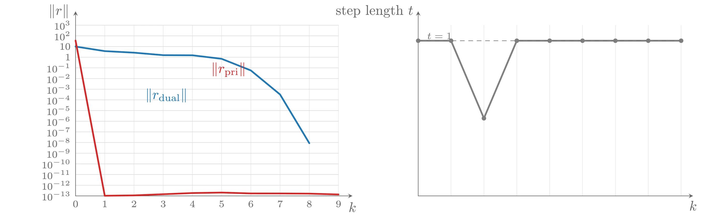
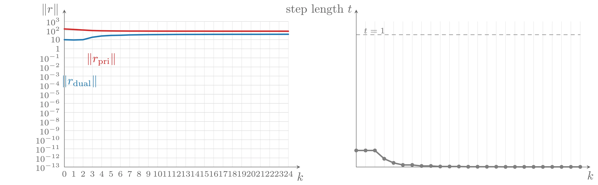
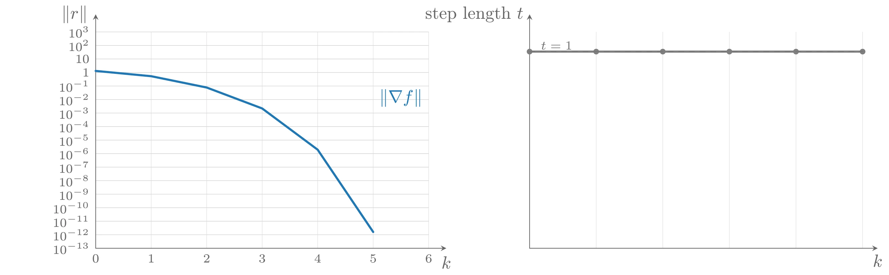

# 不可行初始点的 Newton 方法

前面描述的 Newton 方法是一种可行下降方法。本节描述它的一个推广，可以处理**不可行**的初始点和迭代点。

## 不可行点处的 Newton 步

与 Newton 方法一样，从等式约束极小化问题的最优性条件出发：

$$
Ax^{\star} = b, \quad \nabla f(x^{\star}) + A^{\top}\nu^{\star} = 0
$$

设 $x$ 为当前点——我们**不**假设它可行，但假设 $x \in \operatorname{dom} f$。目标是找到一步 $\Delta x$ 使 $x + \Delta x$（至少近似地）满足最优性条件，即 $x + \Delta x \approx x^{\star}$。将 $x + \Delta x$ 代入 $x^{\star}$、$w$ 代入 $\nu^{\star}$，并对梯度使用一阶近似 $\nabla f(x + \Delta x) \approx \nabla f(x) + \nabla^2 f(x)\Delta x$，得到

$$
A(x + \Delta x) = b, \quad \nabla f(x) + \nabla^2 f(x)\Delta x + A^{\top}w = 0
$$

即线性方程组

$$
\begin{bmatrix}
    \nabla^2 f(x) & A^{\top} \\
    A & 0
\end{bmatrix}
\begin{bmatrix}
    \Delta x \\
    w
\end{bmatrix}
= -
\begin{bmatrix}
    \nabla f(x) \\
    Ax - b
\end{bmatrix}
$$

这组方程与可行点处定义 Newton 步的方程相同，唯一的差别是右端第二个块包含 $Ax - b$——线性等式约束的**残差向量**&#8203;（residual vector）。当 $x$ 可行时，残差为零，方程退化为可行点处的标准 Newton 步方程。因此我们仍然用记号 $\Delta x_{\mathrm{nt}}$ 表示由上式定义的步，并把它称为 $x$ 处的 Newton 步而不会混淆。

### 原始—对偶 Newton 步解释

上述方程可以从**原始—对偶方法**&#8203;（primal-dual method）的角度解释。所谓原始—对偶方法，是指同时更新原始变量 $x$ 和对偶变量 $\nu$，使最优性条件（近似地）得到满足的方法。

把最优性条件表示为 $r(x^{\star}, \nu^{\star}) = 0$，其中 $r: \mathbf{R}^n \times \mathbf{R}^p \rightarrow \mathbf{R}^n \times \mathbf{R}^p$ 定义为

$$
r(x, \nu) = (r_{\mathrm{dual}}(x, \nu),\ r_{\mathrm{pri}}(x, \nu)), \quad r_{\mathrm{dual}}(x, \nu) = \nabla f(x) + A^{\top}\nu, \quad r_{\mathrm{pri}}(x, \nu) = Ax - b
$$

$r_{\mathrm{dual}}$ 与 $r_{\mathrm{pri}}$ 分别称为**对偶残差**&#8203;（dual residual）与**原始残差**&#8203;（primal residual）。对当前估计 $y = (x, \nu)$，定义**原始—对偶 Newton 步**&#8203;（primal-dual Newton step）$\Delta y_{\mathrm{pd}}$ 为使 $r$ 的一阶 Taylor 近似为零的步：

$$
Dr(y)\Delta y_{\mathrm{pd}} = -r(y)
$$

注意这里把 $x$ 和 $\nu$ 都视为变量：$\Delta y_{\mathrm{pd}} = (\Delta x_{\mathrm{pd}}, \Delta\nu_{\mathrm{pd}})$ 同时给出原始步与对偶步。计算 $r$ 的导数可得

$$
\begin{bmatrix}
    \nabla^2 f(x) & A^{\top} \\
    A & 0
\end{bmatrix}
\begin{bmatrix}
    \Delta x_{\mathrm{pd}} \\
    \Delta\nu_{\mathrm{pd}}
\end{bmatrix}
= -
\begin{bmatrix}
    \nabla f(x) + A^{\top}\nu \\
    Ax - b
\end{bmatrix}
$$

把 $\nu + \Delta\nu_{\mathrm{pd}}$ 记为 $\nu^{+}$，上式等价于

$$
\begin{bmatrix}
    \nabla^2 f(x) & A^{\top} \\
    A & 0
\end{bmatrix}
\begin{bmatrix}
    \Delta x_{\mathrm{pd}} \\
    \nu^{+}
\end{bmatrix}
= -
\begin{bmatrix}
    \nabla f(x) \\
    Ax - b
\end{bmatrix}
$$

这与不可行点处 Newton 步的方程完全一样，因此有

$$
\Delta x_{\mathrm{nt}} = \Delta x_{\mathrm{pd}}, \quad w = \nu^{+} = \nu + \Delta\nu_{\mathrm{pd}}
$$

即（不可行的）Newton 步等于原始—对偶步的原始部分，而对偶向量 $w$ 是更新后的原始—对偶变量 $\nu^{+}$。

两种表达形式各有侧重：一种以原始和对偶残差为右端，同时给出 Newton 步与对偶步；另一种给出 Newton 步与更新后的对偶变量，并表明计算原始步（或更新后的对偶变量）时不需要知道当前对偶变量的值。

### 残差范数下降性质

在不可行点处，Newton 方向不一定是 $f$ 的下降方向：

$$
\left.\frac{d}{dt}f(x + t\Delta x)\right|_{t=0} = \nabla f(x)^{\top}\Delta x = -\Delta x^{\top}\nabla^2 f(x)\Delta x + (Ax - b)^{\top}w
$$

（除非 $x$ 可行，即 $Ax = b$，此式一般不为负。）然而原始—对偶解释表明，残差的范数沿 Newton 方向下降：

$$
\left.\frac{d}{dt}\|r(y + t\Delta y_{\mathrm{pd}})\|_2\right|_{t=0} = -\|r(y)\|_2
$$

因此可以用 $\|r\|_2$（而不是 $f$）来度量不可行初始点 Newton 方法的进展，例如在直线搜索中。

### 全步长可行性性质

由构造可知，按定义取出的 Newton 步满足 $A(x + \Delta x_{\mathrm{nt}}) = b$。因此，若沿 Newton 步取步长 1，则下一个迭代点可行。一旦 $x$ 可行，Newton 步就成为可行方向，之后无论步长如何选取，所有迭代点都将可行。

更一般地，可以分析阻尼步（$t \in [0, 1]$）对等式约束残差 $r_{\mathrm{pri}}$ 的影响：步长为 $t$ 的阻尼步使残差按因子 $1 - t$ 缩小：

$$
r_{\mathrm{pri}}^{+} = A(x + t\Delta x_{\mathrm{nt}}) - b = (1 - t)(Ax - b) = (1 - t)r_{\mathrm{pri}}
$$

对一系列阻尼步迭代，残差满足

$$
r^{(k)} = \left(\prod_{i=0}^{k-1}(1 - t^{(i)})\right) r^{(0)}
$$

这说明每一步的原始残差都与初始原始残差同向，并在每一步被缩小；同时，一旦取了全步长，之后的所有迭代点都原始可行。

## 不可行初始点的 Newton 方法

利用上述 Newton 步（以及对偶部分 $\Delta\nu_{\mathrm{nt}} = w - \nu$），可以发展出一种从 $x^{(0)} \in \operatorname{dom} f$（不一定要满足 $Ax^{(0)} = b$）出发的方法。

**算法 10.2（不可行初始点的 Newton 方法）** 给定初始点 $x \in \operatorname{dom} f$，$\nu$，容许误差 $\epsilon > 0$，$\alpha \in (0, 1/2)$，$\beta \in (0, 1)$。

1. 计算原始与对偶 Newton 步 $\Delta x_{\mathrm{nt}}$，$\Delta\nu_{\mathrm{nt}}$。
2. 关于 $\|r\|_2$ 的回溯直线搜索：令 $t := 1$；当 $\|r(x + t\Delta x_{\mathrm{nt}}, \nu + t\Delta\nu_{\mathrm{nt}})\|_2 > (1 - \alpha t)\|r(x, \nu)\|_2$ 时，令 $t := \beta t$。
3. 更新：$x := x + t\Delta x_{\mathrm{nt}}$，$\nu := \nu + t\Delta\nu_{\mathrm{nt}}$。

重复上述步骤直至 $Ax = b$ 且 $\|r(x, \nu)\|_2 \leqslant \epsilon$。

该算法与标准（可行初始点的）Newton 方法非常相似，但有以下差别：搜索方向包含依赖于原始残差的额外修正项；直线搜索以残差范数（而不是函数值 $f$）为基础；终止条件是原始可行且（对偶）残差范数很小。

关于第 2 步的直线搜索需要说明：以残差范数为基础的直线搜索比基于函数值的直线搜索代价稍高，但增加量通常可以忽略；而且由于残差范数沿 Newton 方向的导数为 $-\|r\|_2$，直线搜索必在有限步内终止。

全步长可行性性质表明：一旦某次迭代取了步长 1，下一个迭代点就可行；此后不可行初始点 Newton 方法与（可行的）标准 Newton 方法方向相同。因此该方法有很多变体，例如：一旦达到可行性就切换到标准 Newton 方法（即把直线搜索改为基于 $f$，终止准则改为 $\lambda(x)^2/2 \leqslant \epsilon$）。

### 用不可行初始点 Newton 方法简化初始化

不可行初始点 Newton 方法的主要优点在于初始化。若 $\operatorname{dom} f = \mathbf{R}^n$，初始化可行 Newton 方法只需计算 $Ax = b$ 的一个解，此时使用不可行初始点 Newton 方法除了方便之外并无特别的优势。

当 $\operatorname{dom} f$ 不是全空间时，找到 $\operatorname{dom} f$ 中满足 $Ax = b$ 的点本身可能就是挑战。一般的方法（当 $\operatorname{dom} f$ 复杂或不知道它是否与 $\{z \mid Az = b\}$ 相交时，这可能是最好的方法）是用阶段 I 方法（phase I，见内点法一章）计算这样的点（或验证交集为空）。但当 $\operatorname{dom} f$ 比较简单且已知它与 $\{z \mid Az = b\}$ 相交时，不可行初始点 Newton 方法提供了一个简单的替代方案。一个常见例子是 $\operatorname{dom} f = \mathbf{R}^n_{++}$ 的情形，如等式约束解析中心问题

$$
\mathrm{minimize} \quad -\sum_{i=1}^n \log x_i \quad \mathrm{subject\ to} \quad Ax = b
$$

初始化（可行的）Newton 方法需要找到满足 $Ax = b$ 的 $x^{(0)} \succ 0$，这等价于求解一个标准形式 LP 可行性问题；而不可行初始点 Newton 方法只需从任意正的初始点（例如 $x^{(0)} = \mathbf{1}$）出发即可。

同样的技巧也可用于未知定义域内点的无约束问题。例如考虑上述问题的对偶

$$
\mathrm{maximize} \quad g(\nu) = -b^{\top}\nu + n + \sum_{i=1}^n \log(A^{\top}\nu)_i
$$

初始化需要找到满足 $A^{\top}\nu^{(0)} \succ 0$ 的点（即求解一组线性不等式）。可以用阶段 I 方法，或者把问题改写为等式约束问题

$$
\mathrm{maximize} \quad -b^{\top}\nu + n + \sum_{i=1}^n \log y_i \quad \mathrm{subject\ to} \quad y = A^{\top}\nu
$$

然后用不可行初始点 Newton 方法从任意正的 $y^{(0)}$（和任意 $\nu^{(0)}$）出发。

用不可行初始点 Newton 方法做初始化的缺点是：当不存在严格可行点时，没有明确的方法检测到这一点——残差范数只会缓慢收敛到某个正值。（阶段 I 方法则可以无歧义地判定这一事实。）此外，达到可行之前，不可行初始点 Newton 方法的收敛可能很慢。

## 收敛性分析

本节证明：在一定假设下，不可行初始点 Newton 方法收敛于最优点。证明思路与标准 Newton 方法（带或不带等式约束）非常相似：一旦残差范数足够小，算法就取全步长（这意味着可行性已经达到），随后收敛是二次的；同时可以证明在进入二次收敛区域之前，每次迭代使残差范数至少减少一个固定量。由于残差范数非负，这保证了在有限步内残差足够小。

### 假设

- 下水平集

$$
S = \{(x, \nu) \mid x \in \operatorname{dom} f,\ \|r(x, \nu)\|_2 \leqslant \|r(x^{(0)}, \nu^{(0)})\|_2\}
$$

是闭集（当 $f$ 是闭函数时，$\|r(x, \nu)\|_2$ 也是闭函数，该条件对任意 $x^{(0)} \in \operatorname{dom} f$ 和任意 $\nu^{(0)} \in \mathbf{R}^p$ 都成立）。
- 在 $S$ 上，$\|Dr(x, \nu)^{-1}\|_2 = \left\|\begin{bmatrix}\nabla^2 f(x) & A^{\top} \\ A & 0\end{bmatrix}^{-1}\right\|_2 \leqslant K$。
- 对 $S$ 中的点对，$Dr$ 满足 Lipschitz 条件 $\|Dr(x, \nu) - Dr(\tilde{x}, \tilde{\nu})\|_2 \leqslant L\|(x, \nu) - (\tilde{x}, \tilde{\nu})\|_2$（这等价于 $\nabla^2 f(x)$ 满足 Lipschitz 条件）。

这些假设意味着 $\operatorname{dom} f$ 与 $\{z \mid Az = b\}$ 相交，且存在最优点 $(x^{\star}, \nu^{\star})$。

**与标准 Newton 方法的比较**&#8203;：第二、三条假设（KKT 矩阵有界逆与 Lipschitz 条件）与标准 Newton 方法分析中的假设本质上相同；但这里的下水平集条件更一般。例如等式约束最大熵问题（目标 $\sum_i x_i\log x_i$，$\operatorname{dom} f = \mathbf{R}^n_{++}$）的目标函数**不是**闭函数（当 $x_i \rightarrow 0$ 时 $f$ 不趋于无穷），因此标准 Newton 方法分析的假设可能不成立；但不可行初始点 Newton 方法的下水平集条件对该问题成立（因为负熵函数的梯度范数当 $x_i \rightarrow 0$ 时趋于无穷），从而不可行初始点 Newton 方法被保证能求解该问题。当然，若初始点已经满足等式约束，两种方法的唯一区别只在阻尼阶段的直线搜索。

### 基本不等式

设 $y = (x, \nu) \in S$ 且 $\|r(y)\|_2 \neq 0$，$\Delta y_{\mathrm{nt}} = (\Delta x_{\mathrm{nt}}, \Delta\nu_{\mathrm{nt}})$ 为 $y$ 处的 Newton 步。定义

$$
t_{\max} = \inf\{t > 0 \mid y + t\Delta y_{\mathrm{nt}} \notin S\}
$$

（若 $y + t\Delta y_{\mathrm{nt}}$ 对所有 $t \geqslant 0$ 都属于 $S$，则按惯例取 $t_{\max} = \infty$。）可以证明，对 $0 \leqslant t \leqslant \min\{1, t_{\max}\}$ 有基本不等式

$$
\|r(y + t\Delta y_{\mathrm{nt}})\|_2 \leqslant (1 - t)\|r(y)\|_2 + (K^2L/2)t^2\|r(y)\|_2^2
$$

证明要点：由 $Dr(y)\Delta y_{\mathrm{nt}} = -r(y)$，有

$$
r(y + t\Delta y_{\mathrm{nt}}) = (1 - t)r(y) + e, \quad e = \int_0^1 (Dr(y + \tau t\Delta y_{\mathrm{nt}}) - Dr(y))\, t\Delta y_{\mathrm{nt}}\, d\tau
$$

利用 Lipschitz 条件与 $\|Dr(y)^{-1}\|_2 \leqslant K$ 估计 $\|e\|_2 \leqslant (K^2L/2)t^2\|r(y)\|_2^2$，再用三角不等式即得。

### 阻尼 Newton 阶段

若 $\|r(y)\|_2 > 1/(K^2L)$，可以证明一次迭代使 $\|r\|_2$ 至少减少一个固定的量。基本不等式右端是 $t$ 的二次函数，在 $\bar{t} = 1/(K^2L\|r(y)\|_2) < 1$ 处最小，且必有 $t_{\max} > \bar{t}$。在 $t = \bar{t}$ 处有

$$
\|r(y + \bar{t}\Delta y_{\mathrm{nt}})\|_2 \leqslant \|r(y)\|_2 - 1/(2K^2L) \leqslant (1 - \alpha\bar{t})\|r(y)\|_2
$$

即步长 $\bar{t}$ 满足直线搜索终止条件，因此回溯直线搜索选出的步长 $t \geqslant \beta\bar{t}$，进而

$$
\|r(y + t\Delta y_{\mathrm{nt}})\|_2 \leqslant \|r(y)\|_2 - \frac{\alpha\beta}{K^2L}
$$

也就是说，只要 $\|r(y)\|_2 > 1/(K^2L)$，每次迭代至少使 $\|r\|_2$ 减少 $\alpha\beta/(K^2L)$。因此最多经过

$$
\frac{K^2L\|r(y^{(0)})\|_2}{\alpha\beta}
$$

次迭代就有 $\|r(y^{(k)})\|_2 \leqslant 1/(K^2L)$。

### 二次收敛阶段

当 $\|r(y)\|_2 \leqslant 1/(K^2L)$ 时，基本不等式给出（对 $0 \leqslant t \leqslant \min\{1, t_{\max}\}$）

$$
\|r(y + t\Delta y_{\mathrm{nt}})\|_2 \leqslant (1 - t + (1/2)t^2)\|r(y)\|_2
$$

由此必有 $t_{\max} > 1$，故不等式在 $t = 1$ 处成立：

$$
\|r(y + \Delta y_{\mathrm{nt}})\|_2 \leqslant (1/2)\|r(y)\|_2 \leqslant (1 - \alpha)\|r(y)\|_2
$$

即回溯直线搜索的终止条件在 $t = 1$ 处满足，因此取全步长；而且之后每次迭代都如此。把基本不等式（取 $t = 1$）改写为

$$
K^2L\|r(y^{+})\|_2^2 \leqslant \left(K^2L\|r(y)\|_2^2\right)^2
$$

递归应用可得 $\|r(y^{+k})\|_2^2$ 的平方收敛：$K^2L\|r(y^{+k})\|_2^2 \leqslant (1/2)^{2^k}$。

为证明迭代序列收敛，可证明它是 Cauchy 序列：在二次收敛区域内步长总为 1，利用 $\|Dr^{-1}\|_2 \leqslant K$ 可以估计相邻迭代点的距离，求和得 $\|y^{+k} - y\|_2 \leqslant 2K\|r(y)\|_2$。由于 $\|r(y^{(k)})\|_2$ 收敛到零，$y^{(k)}$ 是 Cauchy 序列，故收敛；由 $r$ 的连续性，极限点 $y^{\star}$ 满足 $r(y^{\star}) = 0$，即最优性条件成立。

## 凸—凹博弈

不可行初始点 Newton 方法收敛性的证明表明，该方法可以用于比等式约束凸优化问题更大的一类问题。设 $r: \mathbf{R}^n \rightarrow \mathbf{R}^n$ 可微，其导数在

$$
S = \{x \in \operatorname{dom} r \mid \|r(x)\|_2 \leqslant \|r(x^{(0)})\|_2\}
$$

（闭集）上满足 Lipschitz 条件，且 $\|Dr(x)^{-1}\|_2$ 在 $S$ 上有界，则从 $x^{(0)}$ 出发的不可行初始点 Newton 方法收敛于 $r(x) = 0$ 在 $S$ 中的解。一个有趣的例子是求解**凸—凹博弈**&#8203;（convex-concave game）。

无约束（零和、双人）博弈由支付函数 $f: \mathbf{R}^{p+q} \rightarrow \mathbf{R}$ 定义：玩家 1 选择 $u \in \mathbf{R}^p$，玩家 2 选择 $v \in \mathbf{R}^q$，玩家 1 向玩家 2 支付 $f(u, v)$；玩家 1 希望最小化支付，玩家 2 希望最大化它。若玩家 1 先出招且玩家 2 知道其选择，则支付为 $\inf_u \sup_v f(u, v)$；若玩家 2 先出招，则支付为 $\sup_v \inf_u f(u, v)$。前者总不小于后者，其差可解释为后出招一方的优势。若存在 $(u^{\star}, v^{\star})$ 使得对所有 $u, v$，

$$
f(u^{\star}, v) \leqslant f(u^{\star}, v^{\star}) \leqslant f(u, v^{\star})
$$

则称 $(u^{\star}, v^{\star})$ 为博弈的**解**或**鞍点**&#8203;（saddle-point）；解存在时后出招没有任何优势。若对每个 $v$，$f(u, v)$ 是 $u$ 的凸函数，而对每个 $u$，$f(u, v)$ 是 $v$ 的凹函数，则称博弈是**凸—凹**的。当 $f$ 可微（且凸—凹）时，鞍点由 $\nabla f(u^{\star}, v^{\star}) = 0$ 刻画。

可以把不可行初始点 Newton 方法用于计算二阶可微的凸—凹博弈的解：定义残差 $r(u, v) = \nabla f(u, v)$ 并应用该方法。在博弈的语境下，不可行初始点 Newton 方法就直接称为（凸—凹博弈的）Newton 方法。当 $Dr = \nabla^2 f$ 有界可逆且在上述下水平集上满足 Lipschitz 条件时，可以保证收敛。类似强凸条件的是**强凸—凹**&#8203;（strongly convex-concave）假设：存在 $m > 0$ 使 $\nabla^2_{uu}f(u, v) \succeq mI$ 且 $\nabla^2_{vv}f(u, v) \preceq -mI$（对所有 $(u, v) \in S$）；它蕴含 $Dr$ 有界逆的条件。

## 例子

**简单例子**&#8203;：对随机生成的等式约束解析中心问题（$n = 100$，$m = 50$），从 $x^{(0)} = \mathbf{1}$、$\nu^{(0)} = 0$ 出发，采用 $\alpha = 0.01$、$\beta = 0.5$：第 8 次迭代取了全步长，原始残差随之（几乎）变为零并保持为零；从第 9 次迭代左右开始，（对偶）残差二次收敛到零。

**不可行例子**&#8203;：对同一规模但 $\operatorname{dom} f$ 与 $\{z \mid Az = b\}$ 不相交（问题不可行）的实例，步长从不为 1，残差也不收敛到零——这展示了当定义域与等式约束不相交时该方法的行为。

**凸—凹博弈例子**&#8203;：对 $\mathbf{R}^{100} \times \mathbf{R}^{100}$ 上支付函数为

$$
f(u, v) = u^{\top}Av + b^{\top}u + c^{\top}v - \log(1 - u^{\top}u) + \log(1 - v^{\top}v)
$$

（$\operatorname{dom} f = \{(u, v) \mid u^{\top}u < 1,\ v^{\top}v < 1\}$，数据随机生成）的凸—凹博弈，从 $u^{(0)} = v^{(0)} = 0$ 出发的（不可行初始点）Newton 方法在约 5 次迭代后呈现明显的二次收敛。



上图由下面的 TikZ 代码编译而来：

```tex

  \definecolor{cblue}{RGB}{31,119,180}
  \definecolor{cred}{RGB}{214,39,40}
  \definecolor{cgreen}{RGB}{44,160,44}
  \definecolor{corange}{RGB}{255,127,14}
  \definecolor{cpurple}{RGB}{148,103,189}
  \definecolor{cbrown}{RGB}{140,86,75}
  \definecolor{cpink}{RGB}{227,119,194}
  \definecolor{cgray}{RGB}{127,127,127}
\begin{tikzpicture}[x=1cm,y=1cm,>=stealth,line cap=round,line join=round]
  \begin{scope}
  \draw[color=black!25,very thin] (0.0000,0.0000) -- (6.6000,0.0000) (0.0000,0.2687) -- (6.6000,0.2687) (0.0000,0.5375) -- (6.6000,0.5375) (0.0000,0.8062) -- (6.6000,0.8062) (0.0000,1.0750) -- (6.6000,1.0750) (0.0000,1.3438) -- (6.6000,1.3438) (0.0000,1.6125) -- (6.6000,1.6125) (0.0000,1.8812) -- (6.6000,1.8812) (0.0000,2.1500) -- (6.6000,2.1500) (0.0000,2.4187) -- (6.6000,2.4187) (0.0000,2.6875) -- (6.6000,2.6875) (0.0000,2.9562) -- (6.6000,2.9562) (0.0000,3.2250) -- (6.6000,3.2250) (0.0000,3.4937) -- (6.6000,3.4937) (0.0000,3.7625) -- (6.6000,3.7625) (0.0000,4.0313) -- (6.6000,4.0313) (0.0000,4.3000) -- (6.6000,4.3000);
  \draw[color=black!15,very thin] (0.0000,0.0000) -- (0.0000,4.3000) (0.7333,0.0000) -- (0.7333,4.3000) (1.4667,0.0000) -- (1.4667,4.3000) (2.2000,0.0000) -- (2.2000,4.3000) (2.9333,0.0000) -- (2.9333,4.3000) (3.6667,0.0000) -- (3.6667,4.3000) (4.4000,0.0000) -- (4.4000,4.3000) (5.1333,0.0000) -- (5.1333,4.3000) (5.8667,0.0000) -- (5.8667,4.3000) (6.6000,0.0000) -- (6.6000,4.3000);
  \draw[->,color=black!60] (0.0000,0.0000) -- (6.9500,0.0000) node[anchor=west,xshift=2pt,yshift=-6pt] {$k$};
  \draw[->,color=black!60] (0.0000,0.0000) -- (0.0000,4.6500) node[left=1pt] {$\|r\|$};
  \node[left,font=\scriptsize,color=black!60] at (0.0000,0.0000) {$10^{-13}$};
  \node[left,font=\scriptsize,color=black!60] at (0.0000,0.2687) {$10^{-12}$};
  \node[left,font=\scriptsize,color=black!60] at (0.0000,0.5375) {$10^{-11}$};
  \node[left,font=\scriptsize,color=black!60] at (0.0000,0.8062) {$10^{-10}$};
  \node[left,font=\scriptsize,color=black!60] at (0.0000,1.0750) {$10^{-9}$};
  \node[left,font=\scriptsize,color=black!60] at (0.0000,1.3438) {$10^{-8}$};
  \node[left,font=\scriptsize,color=black!60] at (0.0000,1.6125) {$10^{-7}$};
  \node[left,font=\scriptsize,color=black!60] at (0.0000,1.8812) {$10^{-6}$};
  \node[left,font=\scriptsize,color=black!60] at (0.0000,2.1500) {$10^{-5}$};
  \node[left,font=\scriptsize,color=black!60] at (0.0000,2.4187) {$10^{-4}$};
  \node[left,font=\scriptsize,color=black!60] at (0.0000,2.6875) {$10^{-3}$};
  \node[left,font=\scriptsize,color=black!60] at (0.0000,2.9562) {$10^{-2}$};
  \node[left,font=\scriptsize,color=black!60] at (0.0000,3.2250) {$10^{-1}$};
  \node[left,font=\scriptsize,color=black!60] at (0.0000,3.4937) {1};
  \node[left,font=\scriptsize,color=black!60] at (0.0000,3.7625) {$10$};
  \node[left,font=\scriptsize,color=black!60] at (0.0000,4.0313) {$10^{2}$};
  \node[left,font=\scriptsize,color=black!60] at (0.0000,4.3000) {$10^{3}$};
  \node[below,font=\scriptsize,color=black!60] at (0.0000,0.0000) {0};
  \node[below,font=\scriptsize,color=black!60] at (0.7333,0.0000) {1};
  \node[below,font=\scriptsize,color=black!60] at (1.4667,0.0000) {2};
  \node[below,font=\scriptsize,color=black!60] at (2.2000,0.0000) {3};
  \node[below,font=\scriptsize,color=black!60] at (2.9333,0.0000) {4};
  \node[below,font=\scriptsize,color=black!60] at (3.6667,0.0000) {5};
  \node[below,font=\scriptsize,color=black!60] at (4.4000,0.0000) {6};
  \node[below,font=\scriptsize,color=black!60] at (5.1333,0.0000) {7};
  \node[below,font=\scriptsize,color=black!60] at (5.8667,0.0000) {8};
  \node[below,font=\scriptsize,color=black!60] at (6.6000,0.0000) {9};
  \draw[cblue,very thick] plot coordinates {(0.000,3.762) (0.733,3.647) (1.467,3.608) (2.200,3.545) (2.933,3.542) (3.667,3.453) (4.400,3.160) (5.133,2.555) (5.867,1.328)};
  \draw[cred,very thick] plot coordinates {(0.000,3.913) (0.733,0.004) (1.467,0.013) (2.933,0.072) (3.667,0.084) (4.400,0.062) (5.133,0.061) (5.867,0.057) (6.600,0.036)};
  \node[anchor=south east,color=cblue] at (2.9333,2.2309) {$\|r_{\mathrm{dual}}\|$};
  \node[anchor=south east,color=cred] at (4.4000,2.8753) {$\|r_{\mathrm{pri}}\|$};
  \end{scope}
  \begin{scope}[xshift=8.6000cm]
    \draw[color=black!15,very thin] (0.0000,0) -- (0.0000,4.3) (0.8250,0) -- (0.8250,4.3) (1.6500,0) -- (1.6500,4.3) (2.4750,0) -- (2.4750,4.3) (3.3000,0) -- (3.3000,4.3) (4.1250,0) -- (4.1250,4.3) (4.9500,0) -- (4.9500,4.3) (5.7750,0) -- (5.7750,4.3) (6.6000,0) -- (6.6000,4.3) ;
    \draw[->,color=black!60] (0,0) -- (6.8999999999999995,0) node[below] {$k$};
    \draw[->,color=black!60] (0,0) -- (0,4.6499999999999995) node[left] {step length $t$};
    \draw[cgray,very thick] plot coordinates {(0.000,3.909) (0.825,3.909) (1.650,1.955) (2.475,3.909) (3.300,3.909) (4.125,3.909) (4.950,3.909) (5.775,3.909) (6.600,3.909)};
  \fill[cgray] (0.000,3.909) circle (1.6pt);
  \fill[cgray] (0.825,3.909) circle (1.6pt);
  \fill[cgray] (1.650,1.955) circle (1.6pt);
  \fill[cgray] (2.475,3.909) circle (1.6pt);
  \fill[cgray] (3.300,3.909) circle (1.6pt);
  \fill[cgray] (4.125,3.909) circle (1.6pt);
  \fill[cgray] (4.950,3.909) circle (1.6pt);
  \fill[cgray] (5.775,3.909) circle (1.6pt);
  \fill[cgray] (6.600,3.909) circle (1.6pt);
    \draw[color=black!55,dashed] (0,3.9091) -- (6.6,3.9091);
    \node[anchor=west,font=\scriptsize,color=black!55] at (0.1,4.0291) {$t=1$};
  \end{scope}
\end{tikzpicture}
```


上图由下面的 TikZ 代码编译而来：

```tex

  \definecolor{cblue}{RGB}{31,119,180}
  \definecolor{cred}{RGB}{214,39,40}
  \definecolor{cgreen}{RGB}{44,160,44}
  \definecolor{corange}{RGB}{255,127,14}
  \definecolor{cpurple}{RGB}{148,103,189}
  \definecolor{cbrown}{RGB}{140,86,75}
  \definecolor{cpink}{RGB}{227,119,194}
  \definecolor{cgray}{RGB}{127,127,127}
\begin{tikzpicture}[x=1cm,y=1cm,>=stealth,line cap=round,line join=round]
  \begin{scope}
  \draw[color=black!25,very thin] (0.0000,0.0000) -- (6.6000,0.0000) (0.0000,0.2687) -- (6.6000,0.2687) (0.0000,0.5375) -- (6.6000,0.5375) (0.0000,0.8062) -- (6.6000,0.8062) (0.0000,1.0750) -- (6.6000,1.0750) (0.0000,1.3438) -- (6.6000,1.3438) (0.0000,1.6125) -- (6.6000,1.6125) (0.0000,1.8812) -- (6.6000,1.8812) (0.0000,2.1500) -- (6.6000,2.1500) (0.0000,2.4187) -- (6.6000,2.4187) (0.0000,2.6875) -- (6.6000,2.6875) (0.0000,2.9562) -- (6.6000,2.9562) (0.0000,3.2250) -- (6.6000,3.2250) (0.0000,3.4937) -- (6.6000,3.4937) (0.0000,3.7625) -- (6.6000,3.7625) (0.0000,4.0313) -- (6.6000,4.0313) (0.0000,4.3000) -- (6.6000,4.3000);
  \draw[color=black!15,very thin] (0.0000,0.0000) -- (0.0000,4.3000) (0.2750,0.0000) -- (0.2750,4.3000) (0.5500,0.0000) -- (0.5500,4.3000) (0.8250,0.0000) -- (0.8250,4.3000) (1.1000,0.0000) -- (1.1000,4.3000) (1.3750,0.0000) -- (1.3750,4.3000) (1.6500,0.0000) -- (1.6500,4.3000) (1.9250,0.0000) -- (1.9250,4.3000) (2.2000,0.0000) -- (2.2000,4.3000) (2.4750,0.0000) -- (2.4750,4.3000) (2.7500,0.0000) -- (2.7500,4.3000) (3.0250,0.0000) -- (3.0250,4.3000) (3.3000,0.0000) -- (3.3000,4.3000) (3.5750,0.0000) -- (3.5750,4.3000) (3.8500,0.0000) -- (3.8500,4.3000) (4.1250,0.0000) -- (4.1250,4.3000) (4.4000,0.0000) -- (4.4000,4.3000) (4.6750,0.0000) -- (4.6750,4.3000) (4.9500,0.0000) -- (4.9500,4.3000) (5.2250,0.0000) -- (5.2250,4.3000) (5.5000,0.0000) -- (5.5000,4.3000) (5.7750,0.0000) -- (5.7750,4.3000) (6.0500,0.0000) -- (6.0500,4.3000) (6.3250,0.0000) -- (6.3250,4.3000) (6.6000,0.0000) -- (6.6000,4.3000);
  \draw[->,color=black!60] (0.0000,0.0000) -- (6.9500,0.0000) node[anchor=west,xshift=2pt,yshift=-6pt] {$k$};
  \draw[->,color=black!60] (0.0000,0.0000) -- (0.0000,4.6500) node[left=1pt] {$\|r\|$};
  \node[left,font=\scriptsize,color=black!60] at (0.0000,0.0000) {$10^{-13}$};
  \node[left,font=\scriptsize,color=black!60] at (0.0000,0.2687) {$10^{-12}$};
  \node[left,font=\scriptsize,color=black!60] at (0.0000,0.5375) {$10^{-11}$};
  \node[left,font=\scriptsize,color=black!60] at (0.0000,0.8062) {$10^{-10}$};
  \node[left,font=\scriptsize,color=black!60] at (0.0000,1.0750) {$10^{-9}$};
  \node[left,font=\scriptsize,color=black!60] at (0.0000,1.3438) {$10^{-8}$};
  \node[left,font=\scriptsize,color=black!60] at (0.0000,1.6125) {$10^{-7}$};
  \node[left,font=\scriptsize,color=black!60] at (0.0000,1.8812) {$10^{-6}$};
  \node[left,font=\scriptsize,color=black!60] at (0.0000,2.1500) {$10^{-5}$};
  \node[left,font=\scriptsize,color=black!60] at (0.0000,2.4187) {$10^{-4}$};
  \node[left,font=\scriptsize,color=black!60] at (0.0000,2.6875) {$10^{-3}$};
  \node[left,font=\scriptsize,color=black!60] at (0.0000,2.9562) {$10^{-2}$};
  \node[left,font=\scriptsize,color=black!60] at (0.0000,3.2250) {$10^{-1}$};
  \node[left,font=\scriptsize,color=black!60] at (0.0000,3.4937) {1};
  \node[left,font=\scriptsize,color=black!60] at (0.0000,3.7625) {$10$};
  \node[left,font=\scriptsize,color=black!60] at (0.0000,4.0313) {$10^{2}$};
  \node[left,font=\scriptsize,color=black!60] at (0.0000,4.3000) {$10^{3}$};
  \node[below,font=\scriptsize,color=black!60] at (0.0000,0.0000) {0};
  \node[below,font=\scriptsize,color=black!60] at (0.8250,0.0000) {3};
  \node[below,font=\scriptsize,color=black!60] at (1.6500,0.0000) {6};
  \node[below,font=\scriptsize,color=black!60] at (2.4750,0.0000) {9};
  \node[below,font=\scriptsize,color=black!60] at (3.3000,0.0000) {12};
  \node[below,font=\scriptsize,color=black!60] at (4.1250,0.0000) {15};
  \node[below,font=\scriptsize,color=black!60] at (4.9500,0.0000) {18};
  \node[below,font=\scriptsize,color=black!60] at (5.7750,0.0000) {21};
  \node[below,font=\scriptsize,color=black!60] at (6.6000,0.0000) {24};
  \draw[cblue,very thick] plot coordinates {(0.000,3.762) (0.275,3.754) (0.550,3.762) (0.825,3.835) (1.100,3.872) (1.375,3.888) (1.650,3.893) (1.925,3.903) (2.200,3.907) (2.475,3.911) (2.750,3.913) (3.025,3.915) (3.300,3.917) (3.575,3.918) (3.850,3.918) (4.125,3.919) (4.400,3.920) (4.675,3.920) (4.950,3.921) (5.225,3.921) (5.500,3.921) (5.775,3.921) (6.050,3.922) (6.325,3.922) (6.600,3.923)};
  \draw[cred,very thick] plot coordinates {(0.000,4.079) (0.275,4.064) (0.550,4.048) (0.825,4.032) (1.100,4.025) (1.375,4.021) (1.650,4.019) (1.925,4.017) (2.200,4.017) (2.475,4.016) (2.750,4.015) (3.025,4.015) (3.300,4.014) (3.575,4.014) (3.850,4.014) (4.125,4.014) (4.400,4.013) (4.675,4.013) (4.950,4.013) (5.225,4.013) (5.500,4.013) (5.775,4.013) (6.050,4.013) (6.325,4.013) (6.600,4.012)};
  \node[anchor=south east,color=cblue] at (1.1000,2.2309) {$\|r_{\mathrm{dual}}\|$};
  \node[anchor=south east,color=cred] at (1.6500,2.8753) {$\|r_{\mathrm{pri}}\|$};
  \end{scope}
  \begin{scope}[xshift=8.6000cm]
    \draw[color=black!15,very thin] (0.0000,0) -- (0.0000,4.3) (0.2750,0) -- (0.2750,4.3) (0.5500,0) -- (0.5500,4.3) (0.8250,0) -- (0.8250,4.3) (1.1000,0) -- (1.1000,4.3) (1.3750,0) -- (1.3750,4.3) (1.6500,0) -- (1.6500,4.3) (1.9250,0) -- (1.9250,4.3) (2.2000,0) -- (2.2000,4.3) (2.4750,0) -- (2.4750,4.3) (2.7500,0) -- (2.7500,4.3) (3.0250,0) -- (3.0250,4.3) (3.3000,0) -- (3.3000,4.3) (3.5750,0) -- (3.5750,4.3) (3.8500,0) -- (3.8500,4.3) (4.1250,0) -- (4.1250,4.3) (4.4000,0) -- (4.4000,4.3) (4.6750,0) -- (4.6750,4.3) (4.9500,0) -- (4.9500,4.3) (5.2250,0) -- (5.2250,4.3) (5.5000,0) -- (5.5000,4.3) (5.7750,0) -- (5.7750,4.3) (6.0500,0) -- (6.0500,4.3) (6.3250,0) -- (6.3250,4.3) (6.6000,0) -- (6.6000,4.3) ;
    \draw[->,color=black!60] (0,0) -- (6.8999999999999995,0) node[below] {$k$};
    \draw[->,color=black!60] (0,0) -- (0,4.6499999999999995) node[left] {step length $t$};
    \draw[cgray,very thick] plot coordinates {(0.000,0.489) (0.275,0.489) (0.550,0.489) (0.825,0.244) (1.100,0.122) (1.375,0.061) (1.650,0.061) (1.925,0.031) (2.200,0.031) (2.475,0.015) (2.750,0.015) (3.025,0.015) (3.300,0.008) (3.575,0.008) (3.850,0.008) (4.125,0.008) (4.400,0.004) (4.675,0.004) (4.950,0.004) (5.225,0.004) (5.500,0.004) (5.775,0.004) (6.050,0.004) (6.325,0.004) (6.600,0.004)};
  \fill[cgray] (0.000,0.489) circle (1.6pt);
  \fill[cgray] (0.275,0.489) circle (1.6pt);
  \fill[cgray] (0.550,0.489) circle (1.6pt);
  \fill[cgray] (0.825,0.244) circle (1.6pt);
  \fill[cgray] (1.100,0.122) circle (1.6pt);
  \fill[cgray] (1.375,0.061) circle (1.6pt);
  \fill[cgray] (1.650,0.061) circle (1.6pt);
  \fill[cgray] (1.925,0.031) circle (1.6pt);
  \fill[cgray] (2.200,0.031) circle (1.6pt);
  \fill[cgray] (2.475,0.015) circle (1.6pt);
  \fill[cgray] (2.750,0.015) circle (1.6pt);
  \fill[cgray] (3.025,0.015) circle (1.6pt);
  \fill[cgray] (3.300,0.008) circle (1.6pt);
  \fill[cgray] (3.575,0.008) circle (1.6pt);
  \fill[cgray] (3.850,0.008) circle (1.6pt);
  \fill[cgray] (4.125,0.008) circle (1.6pt);
  \fill[cgray] (4.400,0.004) circle (1.6pt);
  \fill[cgray] (4.675,0.004) circle (1.6pt);
  \fill[cgray] (4.950,0.004) circle (1.6pt);
  \fill[cgray] (5.225,0.004) circle (1.6pt);
  \fill[cgray] (5.500,0.004) circle (1.6pt);
  \fill[cgray] (5.775,0.004) circle (1.6pt);
  \fill[cgray] (6.050,0.004) circle (1.6pt);
  \fill[cgray] (6.325,0.004) circle (1.6pt);
  \fill[cgray] (6.600,0.004) circle (1.6pt);
    \draw[color=black!55,dashed] (0,3.9091) -- (6.6,3.9091);
    \node[anchor=west,font=\scriptsize,color=black!55] at (0.1,4.0291) {$t=1$};
  \end{scope}
\end{tikzpicture}
```



上图由下面的 TikZ 代码编译而来：

```tex

  \definecolor{cblue}{RGB}{31,119,180}
  \definecolor{cred}{RGB}{214,39,40}
  \definecolor{cgreen}{RGB}{44,160,44}
  \definecolor{corange}{RGB}{255,127,14}
  \definecolor{cpurple}{RGB}{148,103,189}
  \definecolor{cbrown}{RGB}{140,86,75}
  \definecolor{cpink}{RGB}{227,119,194}
  \definecolor{cgray}{RGB}{127,127,127}
\begin{tikzpicture}[x=1cm,y=1cm,>=stealth,line cap=round,line join=round]
  \begin{scope}
  \draw[color=black!25,very thin] (0.0000,0.0000) -- (6.6000,0.0000) (0.0000,0.2687) -- (6.6000,0.2687) (0.0000,0.5375) -- (6.6000,0.5375) (0.0000,0.8062) -- (6.6000,0.8062) (0.0000,1.0750) -- (6.6000,1.0750) (0.0000,1.3438) -- (6.6000,1.3438) (0.0000,1.6125) -- (6.6000,1.6125) (0.0000,1.8812) -- (6.6000,1.8812) (0.0000,2.1500) -- (6.6000,2.1500) (0.0000,2.4187) -- (6.6000,2.4187) (0.0000,2.6875) -- (6.6000,2.6875) (0.0000,2.9562) -- (6.6000,2.9562) (0.0000,3.2250) -- (6.6000,3.2250) (0.0000,3.4937) -- (6.6000,3.4937) (0.0000,3.7625) -- (6.6000,3.7625) (0.0000,4.0313) -- (6.6000,4.0313) (0.0000,4.3000) -- (6.6000,4.3000);
  \draw[color=black!15,very thin] (0.0000,0.0000) -- (0.0000,4.3000) (1.1000,0.0000) -- (1.1000,4.3000) (2.2000,0.0000) -- (2.2000,4.3000) (3.3000,0.0000) -- (3.3000,4.3000) (4.4000,0.0000) -- (4.4000,4.3000) (5.5000,0.0000) -- (5.5000,4.3000) (6.6000,0.0000) -- (6.6000,4.3000);
  \draw[->,color=black!60] (0.0000,0.0000) -- (6.9500,0.0000) node[anchor=west,xshift=2pt,yshift=-6pt] {$k$};
  \draw[->,color=black!60] (0.0000,0.0000) -- (0.0000,4.6500) node[left=1pt] {$\|r\|$};
  \node[left,font=\scriptsize,color=black!60] at (0.0000,0.0000) {$10^{-13}$};
  \node[left,font=\scriptsize,color=black!60] at (0.0000,0.2687) {$10^{-12}$};
  \node[left,font=\scriptsize,color=black!60] at (0.0000,0.5375) {$10^{-11}$};
  \node[left,font=\scriptsize,color=black!60] at (0.0000,0.8062) {$10^{-10}$};
  \node[left,font=\scriptsize,color=black!60] at (0.0000,1.0750) {$10^{-9}$};
  \node[left,font=\scriptsize,color=black!60] at (0.0000,1.3438) {$10^{-8}$};
  \node[left,font=\scriptsize,color=black!60] at (0.0000,1.6125) {$10^{-7}$};
  \node[left,font=\scriptsize,color=black!60] at (0.0000,1.8812) {$10^{-6}$};
  \node[left,font=\scriptsize,color=black!60] at (0.0000,2.1500) {$10^{-5}$};
  \node[left,font=\scriptsize,color=black!60] at (0.0000,2.4187) {$10^{-4}$};
  \node[left,font=\scriptsize,color=black!60] at (0.0000,2.6875) {$10^{-3}$};
  \node[left,font=\scriptsize,color=black!60] at (0.0000,2.9562) {$10^{-2}$};
  \node[left,font=\scriptsize,color=black!60] at (0.0000,3.2250) {$10^{-1}$};
  \node[left,font=\scriptsize,color=black!60] at (0.0000,3.4937) {1};
  \node[left,font=\scriptsize,color=black!60] at (0.0000,3.7625) {$10$};
  \node[left,font=\scriptsize,color=black!60] at (0.0000,4.0313) {$10^{2}$};
  \node[left,font=\scriptsize,color=black!60] at (0.0000,4.3000) {$10^{3}$};
  \node[below,font=\scriptsize,color=black!60] at (0.0000,0.0000) {0};
  \node[below,font=\scriptsize,color=black!60] at (1.1000,0.0000) {1};
  \node[below,font=\scriptsize,color=black!60] at (2.2000,0.0000) {2};
  \node[below,font=\scriptsize,color=black!60] at (3.3000,0.0000) {3};
  \node[below,font=\scriptsize,color=black!60] at (4.4000,0.0000) {4};
  \node[below,font=\scriptsize,color=black!60] at (5.5000,0.0000) {5};
  \node[below,font=\scriptsize,color=black!60] at (6.6000,0.0000) {6};
  \draw[cblue,very thick] plot coordinates {(0.000,3.525) (1.100,3.420) (2.200,3.195) (3.300,2.779) (4.400,1.959) (5.500,0.324)};
  \node[anchor=south east,color=cblue] at (6.6000,2.6875) {$\|\nabla f\|$};
  \end{scope}
  \begin{scope}[xshift=8.6000cm]
    \draw[color=black!15,very thin] (0.0000,0) -- (0.0000,4.3) (1.3200,0) -- (1.3200,4.3) (2.6400,0) -- (2.6400,4.3) (3.9600,0) -- (3.9600,4.3) (5.2800,0) -- (5.2800,4.3) (6.6000,0) -- (6.6000,4.3) ;
    \draw[->,color=black!60] (0,0) -- (6.8999999999999995,0) node[below] {$k$};
    \draw[->,color=black!60] (0,0) -- (0,4.6499999999999995) node[left] {step length $t$};
    \draw[cgray,very thick] plot coordinates {(0.000,3.909) (1.320,3.909) (2.640,3.909) (3.960,3.909) (5.280,3.909) (6.600,3.909)};
  \fill[cgray] (0.000,3.909) circle (1.6pt);
  \fill[cgray] (1.320,3.909) circle (1.6pt);
  \fill[cgray] (2.640,3.909) circle (1.6pt);
  \fill[cgray] (3.960,3.909) circle (1.6pt);
  \fill[cgray] (5.280,3.909) circle (1.6pt);
  \fill[cgray] (6.600,3.909) circle (1.6pt);
    \draw[color=black!55,dashed] (0,3.9091) -- (6.6,3.9091);
    \node[anchor=west,font=\scriptsize,color=black!55] at (0.1,4.0291) {$t=1$};
  \end{scope}
\end{tikzpicture}
```\n