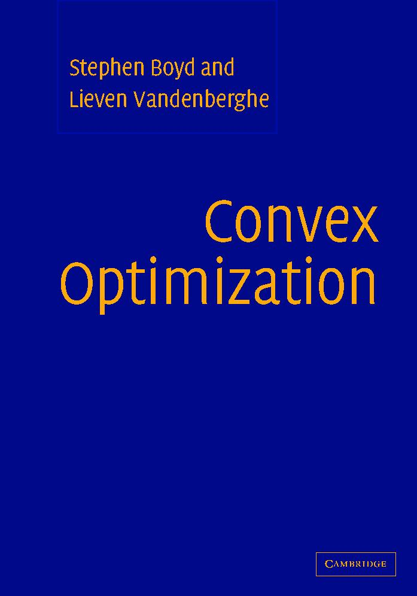

# 凸优化

## Contents

- [数学基础](/knowledge-planet/convex-optimization/mathematical-background/)
- [凸集](/knowledge-planet/convex-optimization/convex-sets/)
- [凸函数](/knowledge-planet/convex-optimization/convex-functions/)
- [凸优化问题](/knowledge-planet/convex-optimization/convex-optimization-problems/)
- [对偶](/knowledge-planet/convex-optimization/duality/)
- [无约束优化](/knowledge-planet/convex-optimization/unconstrained-minimization/)
- [等式约束优化](/knowledge-planet/convex-optimization/equality-constrained-minimization/)
- [内点法](/knowledge-planet/convex-optimization/interior-point-methods/)

## References

- [bilibili - 凸优化](https://www.bilibili.com/video/BV1Jt411p7jE)
- [Convex Optimization – Boyd and Vandenberghe](https://web.stanford.edu/~boyd/cvxbook/)
