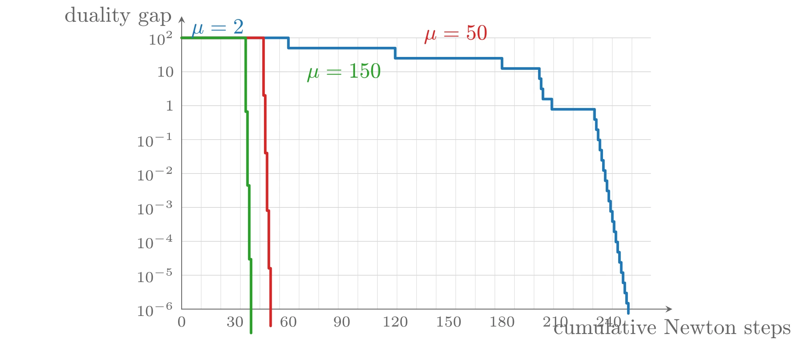
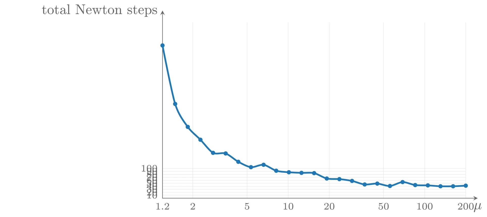
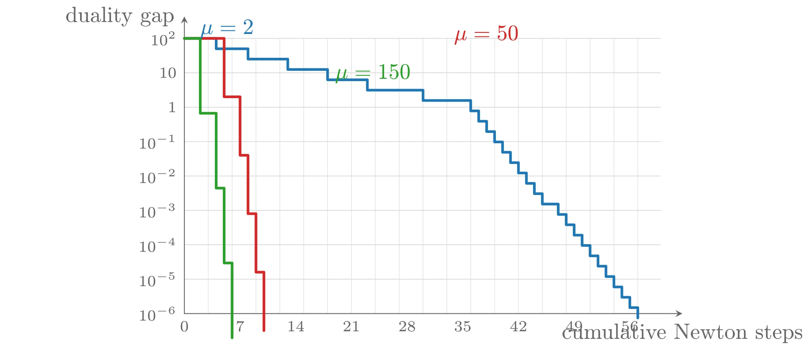
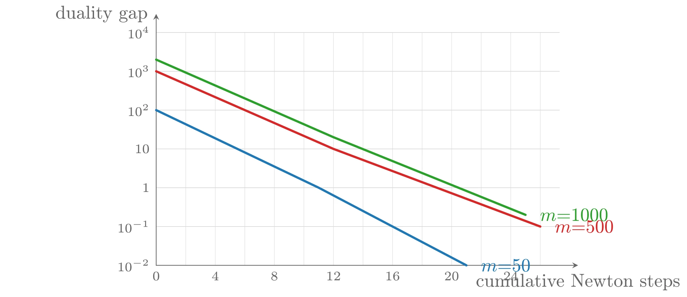
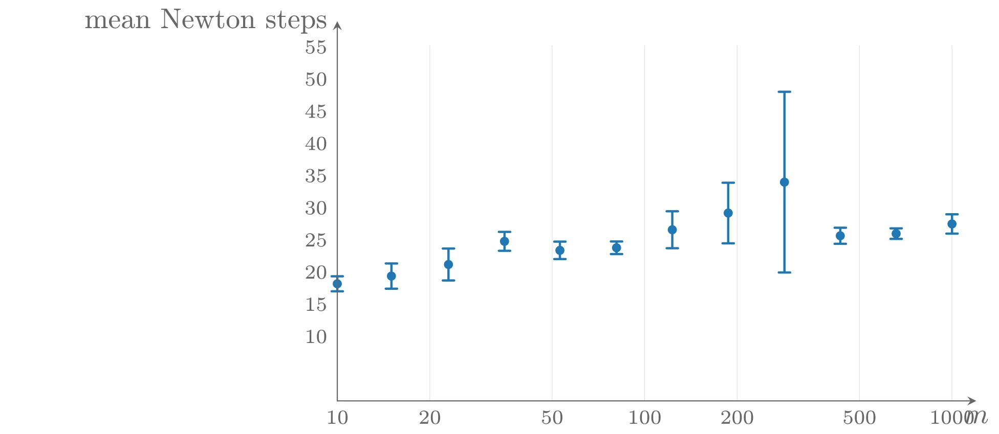

# 障碍方法

我们已经看到，点 $x^{\star}(t)$ 至多 $m/t$-次优，并且对偶可行对 $(\lambda^{\star}(t), \nu^{\star}(t))$ 提供了这一精度的证书。这提示一种非常直接的求解方法，可以达到给定的保证精度 $\epsilon$：直接取 $t = m/\epsilon$，用 Newton 方法求解等式约束问题

$$
\mathrm{minimize} \quad (m/\epsilon)f_0(x) + \phi(x) \quad \mathrm{subject\ to} \quad Ax = b
$$

这个方法可以称为**无约束极小化方法**——它通过求解一个无约束（或线性约束）问题，把带不等式约束的问题解到保证的精度。虽然该方法对小问题、好的初始点和中等精度（即 $\epsilon$ 不太小）可以工作得很好，但在其他情形下效果不佳，因此几乎从不使用。

## 障碍方法

对上述方法的简单扩展确实有效：求解一序列无约束（或线性约束）极小化问题，用前一次找到的点作为下一次极小化的初始点。也就是说，对递增的 $t$ 值计算 $x^{\star}(t)$，直到 $t \geqslant m/\epsilon$，此时即保证得到原问题的一个 $\epsilon$-次优解。该方法由 Fiacco 和 McCormick 在 20 世纪 60 年代提出时称为**序贯无约束极小化技术**&#8203;（SUMT, sequential unconstrained minimization technique）；今天通常称为**障碍方法**&#8203;（barrier method）或**路径跟踪方法**&#8203;（path-following method）。一个简单版本如下。

**算法 11.1（障碍方法）** 给定严格可行点 $x$，$t := t^{(0)} > 0$，$\mu > 1$，容许误差 $\epsilon > 0$。

1. **中心点步**&#8203;（centering step）：从 $x$ 出发，通过在约束 $Ax = b$ 下极小化 $tf_0 + \phi$ 计算 $x^{\star}(t)$。
2. 更新：$x := x^{\star}(t)$。
3. **终止准则**&#8203;：若 $m/t < \epsilon$ 则退出。
4. 增大 $t$：$t := \mu t$。

在每次迭代（第一次除外）中，从上一个中心点出发计算下一个中心点 $x^{\star}(t)$，然后把 $t$ 增大 $\mu > 1$ 倍。算法也可以返回 $\lambda = \lambda^{\star}(t)$ 与 $\nu = \nu^{\star}(t)$，即 $x$ 的对偶 $\epsilon$-次优点（精度证书）。

我们把第 1 步的每次执行称为一个**中心点步**&#8203;（此时在计算一个中心点）或一个**外层迭代**&#8203;（outer iteration）；把第一个中心点步（计算 $x^{\star}(t^{(0)})$）称为**初始中心点步**&#8203;。因此当 $t^{(0)} = m/\epsilon$ 时，算法只包含初始中心点步。虽然第 1 步可以用任何线性约束极小化方法完成，我们假设使用 Newton 方法；把中心点步中执行的 Newton 迭代称为**内层迭代**&#8203;（inner iterations）。每个内层迭代点都是原始可行的；但只有在外层（中心点）步结束时才有对偶可行点。

### 中心点的精度

对中心点问题的求解精度需要一些说明。精确计算 $x^{\star}(t)$ 并非必要，因为中心路径的意义只在于当 $t \rightarrow \infty$ 时导出原问题的解；不精确的中心点步仍产生收敛于最优点的点列。不精确的中心点步会使由公式算出的 $(\lambda^{\star}(t), \nu^{\star}(t))$ 不严格对偶可行，这可以通过在公式中加一个修正项来补救——只要算出的 $x$ 靠近中心路径，修正后的点就是对偶可行的。

另一方面，与计算 $tf_0 + \phi$ 的一个好极小点相比，计算一个**极精确**极小点的代价只多几次 Newton 步。因此假设精确的中心点步并不过分。

### 参数 $\mu$ 的选择

参数 $\mu$ 的选择涉及内层与外层迭代次数之间的折中。若 $\mu$ 小（接近 1），则每次外层迭代 $t$ 只增大很小的因子，上一个迭代点是 Newton 过程非常好的初始点，计算下一个中心点所需的 Newton 步数很少：外层迭代次数多，但每次内层迭代少。此时迭代点（包括内层迭代点）紧密地跟随中心路径——这正是“路径跟踪方法”这一别名的由来。

若 $\mu$ 大，则情况相反：每次外层迭代后 $t$ 增大很多，当前迭代点对下一个中心点的近似较差，因此需要更多内层迭代；但这种“激进”的 $t$ 更新使对偶间隙每次按大因子 $\mu$ 缩减，外层迭代次数更少。$\mu$ 大时迭代点在中心路径上相距很远，内层迭代点则大幅偏离中心路径。

实践中 $\mu$ 较小（接近 1）时外层迭代很多而每次只需几次 Newton 步；在相当大的范围内（从大约 3 到 100 左右），两种效应几乎相互抵消，所需 Newton 步总数近似不变。这意味着 $\mu$ 的选择并不关键，取 10 到 20 左右就很有效。若按使最坏情形 Newton 步总数界最优来选 $\mu$，则应取接近 1 的值。

### 初始值 $t^{(0)}$ 的选择

初始 $t$ 的选择也很重要，其折中很简单：$t^{(0)}$ 太大，第一次外层迭代需要太多迭代；$t^{(0)}$ 太小，算法需要额外的外层迭代，而且第一次中心点步可能需要太多内层迭代。

由于 $m/t^{(0)}$ 是第一次中心点步之后得到的对偶间隙，一个合理的选择是取 $t^{(0)}$ 使 $m/t^{(0)}$ 与 $f_0(x^{(0)}) - p^{\star}$（或其 $\mu$ 倍）大致同阶。例如，若已知对偶可行点 $\lambda, \nu$（对偶间隙 $\eta = f_0(x^{(0)}) - g(\lambda, \nu)$），则可取 $t^{(0)} = m/\eta$：第一次外层迭代计算出的点对的间隙就与初始原始、对偶可行点的间隙相同。

中心路径条件还提示了另一种可能：可以把

$$
\inf_{\nu} \left\|t\nabla f_0(x^{(0)}) + \nabla\phi(x^{(0)}) + A^{\top}\nu\right\|_2
$$

解释为 $x^{(0)}$ 偏离 $x^{\star}(t)$ 的程度，并选取使它最小的 $t$（该 $t$ 与 $\nu$ 可以通过求解一个最小二乘问题得到）。这一做法的一个变体使用仿射不变的偏离度量：选取 $t$ 与 $\nu$ 使

$$
\alpha(t, \nu) = \left(t\nabla f_0(x^{(0)}) + \nabla\phi(x^{(0)}) + A^{\top}\nu\right)^{\top}H_0^{-1}\left(t\nabla f_0(x^{(0)}) + \nabla\phi(x^{(0)}) + A^{\top}\nu\right), \quad H_0 = t\nabla^2 f_0(x^{(0)}) + \nabla^2\phi(x^{(0)})
$$

最小（可以证明 $\inf_{\nu}\alpha(t, \nu)$ 就是 $tf_0 + \phi$ 在 $x^{(0)}$ 处的 Newton 减量的平方）。$\alpha$ 是 $\nu$ 与 $t$ 的 quadratic-over-linear 函数，因此是凸的。

### 不可行初始点的 Newton 方法

障碍方法的一个变体是在中心点步中使用不可行初始点 Newton 方法。此时障碍方法以一个满足 $x^{(0)} \in \operatorname{dom} f_0$、$f_i(x^{(0)}) < 0$（但不一定满足 $Ax^{(0)} = b$）的点初始化。假设问题严格可行，则在第一次中心点步中的某个时刻会取到全步长，此后所有迭代点都原始可行，算法与（标准的）障碍方法一致。

## 例子

### 不等式形式的线性规划

第一个例子是规模 $A \in \mathbf{R}^{100 \times 50}$ 的小型不等式形式 LP（随机生成数据，严格原始与对偶可行，$p^{\star} = 1$）。初始点 $x^{(0)}$ 在中心路径上、对偶间隙为 100；障碍方法终止于对偶间隙小于 $10^{-6}$。中心点问题用回溯 Newton 方法（$\alpha = 0.01$，$\beta = 0.5$）求解，终止准则为 $\lambda(x)^2/2 \leqslant 10^{-5}$（$\lambda(x)$ 是 $tc^{\top}x + \phi(x)$ 的 Newton 减量）。

对 $\mu = 2$、$\mu = 50$、$\mu = 150$ 三种取值，对偶间隙随累计 Newton 步数的曲线呈阶梯状：每级台阶对应一次外层迭代，台阶踏面（水平部分）的宽度是该次外层迭代所需的 Newton 步数，台阶立板（竖直部分）的高度恰为 $\mu$（对偶间隙按因子 $\mu$ 缩减）。三种情形下对偶间隙都近似线性收敛：$\mu = 50$ 与 $\mu = 150$ 时，总 Newton 步数在 35 到 40 之间。$\mu = 2$ 时踏面短（每次外层约 2–3 步）但立板也短；$\mu = 150$ 时踏面典型约 7 步，而立板大得多。

对 $\mu$ 的进一步实验（取 1.2 到 200 之间的 25 个值，终止于间隙 $10^{-3}$）表明：障碍方法在 $\mu$ 大约从 3 到 200 的范围内都表现很好；$\mu$ 太小时因外层迭代增多而总步数上升；$\mu$ 很大时性能变得依赖具体实例。由于更大的 $\mu$ 并不带来改进，$\mu$ 取 10 到 100 是好的选择。



上图由下面的 TikZ 代码编译而来：

```tex

  \definecolor{cblue}{RGB}{31,119,180}
  \definecolor{cred}{RGB}{214,39,40}
  \definecolor{cgreen}{RGB}{44,160,44}
  \definecolor{corange}{RGB}{255,127,14}
  \definecolor{cpurple}{RGB}{148,103,189}
  \definecolor{cbrown}{RGB}{140,86,75}
  \definecolor{cpink}{RGB}{227,119,194}
  \definecolor{cgray}{RGB}{127,127,127}
\begin{tikzpicture}[x=1cm,y=1cm,>=stealth,line cap=round,line join=round]
  \draw[color=black!25,very thin] (0.0000,0.0000) -- (7.6000,0.0000) (0.0000,0.5500) -- (7.6000,0.5500) (0.0000,1.1000) -- (7.6000,1.1000) (0.0000,1.6500) -- (7.6000,1.6500) (0.0000,2.2000) -- (7.6000,2.2000) (0.0000,2.7500) -- (7.6000,2.7500) (0.0000,3.3000) -- (7.6000,3.3000) (0.0000,3.8500) -- (7.6000,3.8500) (0.0000,4.4000) -- (7.6000,4.4000);
  \draw[color=black!15,very thin] (0.0000,0.0000) -- (0.0000,4.4000) (0.3172,0.0000) -- (0.3172,4.4000) (0.6344,0.0000) -- (0.6344,4.4000) (0.9516,0.0000) -- (0.9516,4.4000) (1.2688,0.0000) -- (1.2688,4.4000) (1.5860,0.0000) -- (1.5860,4.4000) (1.9032,0.0000) -- (1.9032,4.4000) (2.2205,0.0000) -- (2.2205,4.4000) (2.5377,0.0000) -- (2.5377,4.4000) (2.8549,0.0000) -- (2.8549,4.4000) (3.1721,0.0000) -- (3.1721,4.4000) (3.4893,0.0000) -- (3.4893,4.4000) (3.8065,0.0000) -- (3.8065,4.4000) (4.1237,0.0000) -- (4.1237,4.4000) (4.4409,0.0000) -- (4.4409,4.4000) (4.7581,0.0000) -- (4.7581,4.4000) (5.0753,0.0000) -- (5.0753,4.4000) (5.3925,0.0000) -- (5.3925,4.4000) (5.7097,0.0000) -- (5.7097,4.4000) (6.0269,0.0000) -- (6.0269,4.4000) (6.3441,0.0000) -- (6.3441,4.4000) (6.6614,0.0000) -- (6.6614,4.4000) (6.9786,0.0000) -- (6.9786,4.4000) (7.2958,0.0000) -- (7.2958,4.4000);
  \draw[->,color=black!60] (0.0000,0.0000) -- (7.9500,0.0000) node[anchor=west,xshift=2pt,yshift=-6pt] {cumulative Newton steps};
  \draw[->,color=black!60] (0.0000,0.0000) -- (0.0000,4.7500) node[left=1pt] {duality gap};
  \node[left,font=\scriptsize,color=black!60] at (0.0000,0.0000) {$10^{-6}$};
  \node[left,font=\scriptsize,color=black!60] at (0.0000,0.5500) {$10^{-5}$};
  \node[left,font=\scriptsize,color=black!60] at (0.0000,1.1000) {$10^{-4}$};
  \node[left,font=\scriptsize,color=black!60] at (0.0000,1.6500) {$10^{-3}$};
  \node[left,font=\scriptsize,color=black!60] at (0.0000,2.2000) {$10^{-2}$};
  \node[left,font=\scriptsize,color=black!60] at (0.0000,2.7500) {$10^{-1}$};
  \node[left,font=\scriptsize,color=black!60] at (0.0000,3.3000) {1};
  \node[left,font=\scriptsize,color=black!60] at (0.0000,3.8500) {$10$};
  \node[left,font=\scriptsize,color=black!60] at (0.0000,4.4000) {$10^{2}$};
  \node[below,font=\scriptsize,color=black!60] at (0.0000,0.0000) {0};
  \node[below,font=\scriptsize,color=black!60] at (0.8651,0.0000) {30};
  \node[below,font=\scriptsize,color=black!60] at (1.7302,0.0000) {60};
  \node[below,font=\scriptsize,color=black!60] at (2.5953,0.0000) {90};
  \node[below,font=\scriptsize,color=black!60] at (3.4604,0.0000) {120};
  \node[below,font=\scriptsize,color=black!60] at (4.3256,0.0000) {150};
  \node[below,font=\scriptsize,color=black!60] at (5.1907,0.0000) {180};
  \node[below,font=\scriptsize,color=black!60] at (6.0558,0.0000) {210};
  \node[below,font=\scriptsize,color=black!60] at (6.9209,0.0000) {240};
  \draw[cblue,very thick] plot coordinates {(0.000,4.400) (1.730,4.400) (1.730,4.234) (3.460,4.234) (3.460,4.069) (5.191,4.069) (5.191,3.903) (5.796,3.903) (5.796,3.738) (5.825,3.738) (5.825,3.572) (5.854,3.572) (5.854,3.407) (5.998,3.407) (5.998,3.241) (6.690,3.241) (6.690,3.075) (6.719,3.075) (6.719,2.910) (6.748,2.910) (6.748,2.744) (6.777,2.744) (6.777,2.579) (6.806,2.579) (6.806,2.413) (6.834,2.413) (6.834,2.248) (6.863,2.248) (6.863,2.082) (6.892,2.082) (6.892,1.917) (6.921,1.917) (6.921,1.751) (6.950,1.751) (6.950,1.585) (6.979,1.585) (6.979,1.420) (7.007,1.420) (7.007,1.254) (7.036,1.254) (7.036,1.089) (7.065,1.089) (7.065,0.923) (7.094,0.923) (7.094,0.758) (7.123,0.758) (7.123,0.592) (7.152,0.592) (7.152,0.426) (7.180,0.426) (7.180,0.261) (7.209,0.261) (7.209,0.095) (7.238,0.095) (7.238,-0.070)};
  \draw[cred,very thick] plot coordinates {(0.000,4.400) (1.327,4.400) (1.327,3.466) (1.355,3.466) (1.355,2.531) (1.384,2.531) (1.384,1.597) (1.413,1.597) (1.413,0.662) (1.442,0.662) (1.442,-0.272)};
  \draw[cgreen,very thick] plot coordinates {(0.000,4.400) (1.038,4.400) (1.038,3.203) (1.067,3.203) (1.067,2.006) (1.096,2.006) (1.096,0.809) (1.125,0.809) (1.125,-0.387)};
  \node[anchor=south west,color=cblue] at (0.0288,4.2780) {$\mu=2$};
  \node[anchor=south west,color=cred] at (3.8000,4.1811) {$\mu=50$};
  \node[anchor=south west,color=cgreen] at (1.9000,3.5624) {$\mu=150$};
\end{tikzpicture}
```


上图由下面的 TikZ 代码编译而来：

```tex

  \definecolor{cblue}{RGB}{31,119,180}
  \definecolor{cred}{RGB}{214,39,40}
  \definecolor{cgreen}{RGB}{44,160,44}
  \definecolor{corange}{RGB}{255,127,14}
  \definecolor{cpurple}{RGB}{148,103,189}
  \definecolor{cbrown}{RGB}{140,86,75}
  \definecolor{cpink}{RGB}{227,119,194}
  \definecolor{cgray}{RGB}{127,127,127}
\begin{tikzpicture}[x=1cm,y=1cm,>=stealth,line cap=round,line join=round]
  \draw[color=black!12,very thin] (0.0000,0) -- (0.0000,4.4) (0.7589,0) -- (0.7589,4.4) (2.1200,0) -- (2.1200,4.4) (3.1497,0) -- (3.1497,4.4) (4.1794,0) -- (4.1794,4.4) (5.5406,0) -- (5.5406,4.4) (6.5703,0) -- (6.5703,4.4) (7.6000,0) -- (7.6000,4.4) (0,0.0747) -- (7.6,0.0747) (0,0.1495) -- (7.6,0.1495) (0,0.2242) -- (7.6,0.2242) (0,0.2989) -- (7.6,0.2989) (0,0.3736) -- (7.6,0.3736) (0,0.4484) -- (7.6,0.4484) (0,0.5231) -- (7.6,0.5231) (0,0.5978) -- (7.6,0.5978) (0,0.6726) -- (7.6,0.6726) (0,0.7473) -- (7.6,0.7473) ;
  \draw[->,color=black!60] (0,0) -- (7.8999999999999995,0) node[below] {$\mu$};
  \draw[->,color=black!60] (0,0) -- (0,4.7) node[left] {total Newton steps};
  \draw[cblue,very thick] plot [smooth] coordinates {(0.000,3.826) (0.317,2.361) (0.633,1.786) (0.950,1.465) (1.267,1.136) (1.583,1.121) (1.900,0.912) (2.217,0.777) (2.533,0.837) (2.850,0.688) (3.167,0.650) (3.483,0.635) (3.800,0.628) (4.117,0.493) (4.433,0.478) (4.750,0.433) (5.067,0.344) (5.383,0.366) (5.700,0.306) (6.017,0.404) (6.333,0.329) (6.650,0.321) (6.967,0.299) (7.283,0.299) (7.600,0.314)};
  \fill[cblue] (0.000,3.826) circle (1.5pt);
  \fill[cblue] (0.317,2.361) circle (1.5pt);
  \fill[cblue] (0.633,1.786) circle (1.5pt);
  \fill[cblue] (0.950,1.465) circle (1.5pt);
  \fill[cblue] (1.267,1.136) circle (1.5pt);
  \fill[cblue] (1.583,1.121) circle (1.5pt);
  \fill[cblue] (1.900,0.912) circle (1.5pt);
  \fill[cblue] (2.217,0.777) circle (1.5pt);
  \fill[cblue] (2.533,0.837) circle (1.5pt);
  \fill[cblue] (2.850,0.688) circle (1.5pt);
  \fill[cblue] (3.167,0.650) circle (1.5pt);
  \fill[cblue] (3.483,0.635) circle (1.5pt);
  \fill[cblue] (3.800,0.628) circle (1.5pt);
  \fill[cblue] (4.117,0.493) circle (1.5pt);
  \fill[cblue] (4.433,0.478) circle (1.5pt);
  \fill[cblue] (4.750,0.433) circle (1.5pt);
  \fill[cblue] (5.067,0.344) circle (1.5pt);
  \fill[cblue] (5.383,0.366) circle (1.5pt);
  \fill[cblue] (5.700,0.306) circle (1.5pt);
  \fill[cblue] (6.017,0.404) circle (1.5pt);
  \fill[cblue] (6.333,0.329) circle (1.5pt);
  \fill[cblue] (6.650,0.321) circle (1.5pt);
  \fill[cblue] (6.967,0.299) circle (1.5pt);
  \fill[cblue] (7.283,0.299) circle (1.5pt);
  \fill[cblue] (7.600,0.314) circle (1.5pt);
  \node[below,font=\scriptsize,color=black!60] at (0.0000,0) {1.2};
  \node[below,font=\scriptsize,color=black!60] at (0.7589,0) {2};
  \node[below,font=\scriptsize,color=black!60] at (2.1200,0) {5};
  \node[below,font=\scriptsize,color=black!60] at (3.1497,0) {10};
  \node[below,font=\scriptsize,color=black!60] at (4.1794,0) {20};
  \node[below,font=\scriptsize,color=black!60] at (5.5406,0) {50};
  \node[below,font=\scriptsize,color=black!60] at (6.5703,0) {100};
  \node[below,font=\scriptsize,color=black!60] at (7.6000,0) {200};
  \node[left,font=\scriptsize,color=black!60] at (0,0.0747) {10};
  \node[left,font=\scriptsize,color=black!60] at (0,0.1495) {20};
  \node[left,font=\scriptsize,color=black!60] at (0,0.2242) {30};
  \node[left,font=\scriptsize,color=black!60] at (0,0.2989) {40};
  \node[left,font=\scriptsize,color=black!60] at (0,0.3736) {50};
  \node[left,font=\scriptsize,color=black!60] at (0,0.4484) {60};
  \node[left,font=\scriptsize,color=black!60] at (0,0.5231) {70};
  \node[left,font=\scriptsize,color=black!60] at (0,0.5978) {80};
  \node[left,font=\scriptsize,color=black!60] at (0,0.6726) {90};
  \node[left,font=\scriptsize,color=black!60] at (0,0.7473) {100};
\end{tikzpicture}
```


### 几何规划

考虑凸形式的几何规划

$$
\mathrm{minimize} \quad \log\left(\sum_{k=1}^{K_0} \exp(a_{0k}^{\top}x + b_{0k})\right) \quad \mathrm{subject\ to} \quad \log\left(\sum_{k=1}^{K_i} \exp(a_{ik}^{\top}x + b_{ik})\right) \leqslant 0,\ i = 1, \cdots, m
$$

变量 $x \in \mathbf{R}^n$，相应的对数障碍为

$$
\phi(x) = -\sum_{i=1}^m \log\left(-\log\sum_{k=1}^{K_i} \exp(a_{ik}^{\top}x + b_{ik})\right)
$$

问题实例取 $n = 50$、$m = 100$（每个目标/约束函数含 $K_i = 5$ 项），严格原始与对偶可行、$p^{\star} = 1$。初始点在中心路径上（间隙 100），$\mu = 2, 50, 150$，终止于间隙 $10^{-6}$；中心点步的 Newton 参数与 LP 例子相同。结果与 LP 的例子非常相似：每次中心点步所需 Newton 步数近似为常数，因此对偶间隙近似线性收敛。把间隙降到 $10^{-3}$ 以下所需的总 Newton 步数约为 30（$\mu$ 在 10 到 200 之间时约为 20 到 40）——这里同样建议 $\mu$ 取 10 到 100。



上图由下面的 TikZ 代码编译而来：

```tex

  \definecolor{cblue}{RGB}{31,119,180}
  \definecolor{cred}{RGB}{214,39,40}
  \definecolor{cgreen}{RGB}{44,160,44}
  \definecolor{corange}{RGB}{255,127,14}
  \definecolor{cpurple}{RGB}{148,103,189}
  \definecolor{cbrown}{RGB}{140,86,75}
  \definecolor{cpink}{RGB}{227,119,194}
  \definecolor{cgray}{RGB}{127,127,127}
\begin{tikzpicture}[x=1cm,y=1cm,>=stealth,line cap=round,line join=round]
  \draw[color=black!25,very thin] (0.0000,0.0000) -- (7.6000,0.0000) (0.0000,0.5500) -- (7.6000,0.5500) (0.0000,1.1000) -- (7.6000,1.1000) (0.0000,1.6500) -- (7.6000,1.6500) (0.0000,2.2000) -- (7.6000,2.2000) (0.0000,2.7500) -- (7.6000,2.7500) (0.0000,3.3000) -- (7.6000,3.3000) (0.0000,3.8500) -- (7.6000,3.8500) (0.0000,4.4000) -- (7.6000,4.4000);
  \draw[color=black!15,very thin] (0.0000,0.0000) -- (0.0000,4.4000) (0.3810,0.0000) -- (0.3810,4.4000) (0.7619,0.0000) -- (0.7619,4.4000) (1.1429,0.0000) -- (1.1429,4.4000) (1.5238,0.0000) -- (1.5238,4.4000) (1.9048,0.0000) -- (1.9048,4.4000) (2.2857,0.0000) -- (2.2857,4.4000) (2.6667,0.0000) -- (2.6667,4.4000) (3.0476,0.0000) -- (3.0476,4.4000) (3.4286,0.0000) -- (3.4286,4.4000) (3.8095,0.0000) -- (3.8095,4.4000) (4.1905,0.0000) -- (4.1905,4.4000) (4.5714,0.0000) -- (4.5714,4.4000) (4.9524,0.0000) -- (4.9524,4.4000) (5.3333,0.0000) -- (5.3333,4.4000) (5.7143,0.0000) -- (5.7143,4.4000) (6.0952,0.0000) -- (6.0952,4.4000) (6.4762,0.0000) -- (6.4762,4.4000) (6.8571,0.0000) -- (6.8571,4.4000) (7.2381,0.0000) -- (7.2381,4.4000);
  \draw[->,color=black!60] (0.0000,0.0000) -- (7.9500,0.0000) node[anchor=west,xshift=2pt,yshift=-6pt] {cumulative Newton steps};
  \draw[->,color=black!60] (0.0000,0.0000) -- (0.0000,4.7500) node[left=1pt] {duality gap};
  \node[left,font=\scriptsize,color=black!60] at (0.0000,0.0000) {$10^{-6}$};
  \node[left,font=\scriptsize,color=black!60] at (0.0000,0.5500) {$10^{-5}$};
  \node[left,font=\scriptsize,color=black!60] at (0.0000,1.1000) {$10^{-4}$};
  \node[left,font=\scriptsize,color=black!60] at (0.0000,1.6500) {$10^{-3}$};
  \node[left,font=\scriptsize,color=black!60] at (0.0000,2.2000) {$10^{-2}$};
  \node[left,font=\scriptsize,color=black!60] at (0.0000,2.7500) {$10^{-1}$};
  \node[left,font=\scriptsize,color=black!60] at (0.0000,3.3000) {1};
  \node[left,font=\scriptsize,color=black!60] at (0.0000,3.8500) {$10$};
  \node[left,font=\scriptsize,color=black!60] at (0.0000,4.4000) {$10^{2}$};
  \node[below,font=\scriptsize,color=black!60] at (0.0000,0.0000) {0};
  \node[below,font=\scriptsize,color=black!60] at (0.8889,0.0000) {7};
  \node[below,font=\scriptsize,color=black!60] at (1.7778,0.0000) {14};
  \node[below,font=\scriptsize,color=black!60] at (2.6667,0.0000) {21};
  \node[below,font=\scriptsize,color=black!60] at (3.5556,0.0000) {28};
  \node[below,font=\scriptsize,color=black!60] at (4.4444,0.0000) {35};
  \node[below,font=\scriptsize,color=black!60] at (5.3333,0.0000) {42};
  \node[below,font=\scriptsize,color=black!60] at (6.2222,0.0000) {49};
  \node[below,font=\scriptsize,color=black!60] at (7.1111,0.0000) {56};
  \draw[cblue,very thick] plot coordinates {(0.000,4.400) (0.508,4.400) (0.508,4.234) (1.016,4.234) (1.016,4.069) (1.651,4.069) (1.651,3.903) (2.286,3.903) (2.286,3.738) (2.921,3.738) (2.921,3.572) (3.810,3.572) (3.810,3.407) (4.571,3.407) (4.571,3.241) (4.698,3.241) (4.698,3.075) (4.825,3.075) (4.825,2.910) (4.952,2.910) (4.952,2.744) (5.079,2.744) (5.079,2.579) (5.206,2.579) (5.206,2.413) (5.333,2.413) (5.333,2.248) (5.460,2.248) (5.460,2.082) (5.587,2.082) (5.587,1.917) (5.714,1.917) (5.714,1.751) (5.968,1.751) (5.968,1.585) (6.095,1.585) (6.095,1.420) (6.222,1.420) (6.222,1.254) (6.349,1.254) (6.349,1.089) (6.476,1.089) (6.476,0.923) (6.603,0.923) (6.603,0.758) (6.730,0.758) (6.730,0.592) (6.857,0.592) (6.857,0.426) (6.984,0.426) (6.984,0.261) (7.111,0.261) (7.111,0.095) (7.238,0.095) (7.238,-0.070)};
  \draw[cred,very thick] plot coordinates {(0.000,4.400) (0.635,4.400) (0.635,3.466) (0.889,3.466) (0.889,2.531) (1.016,2.531) (1.016,1.597) (1.143,1.597) (1.143,0.662) (1.270,0.662) (1.270,-0.272)};
  \draw[cgreen,very thick] plot coordinates {(0.000,4.400) (0.254,4.400) (0.254,3.203) (0.508,3.203) (0.508,2.006) (0.635,2.006) (0.635,0.809) (0.762,0.809) (0.762,-0.387)};
  \node[anchor=south west,color=cblue] at (0.1270,4.2780) {$\mu=2$};
  \node[anchor=south west,color=cred] at (4.1800,4.1811) {$\mu=50$};
  \node[anchor=south west,color=cgreen] at (2.2800,3.5624) {$\mu=150$};
\end{tikzpicture}
```

### 一族标准形式 LP

为考察障碍方法性能随问题维数的变化，考虑标准形式 LP

$$
\mathrm{minimize} \quad c^{\top}x \quad \mathrm{subject\ to} \quad Ax = b, \quad x \succeq 0
$$

随机生成一族问题实例（$n = 2m$，$m$ 从 10 到 1000）。算法参数：$\mu = 100$，中心点步用 $\alpha = 0.01$、$\beta = 0.5$ 与终止准则 $\lambda(x)^2/2 \leqslant 10^{-5}$；初始点在中心路径上（$t^{(0)} = 1$，间隙 $n$）；终止于初始对偶间隙缩小 $10^4$ 倍（即两次外层迭代）。

$m = 50$、$m = 500$、$m = 1000$ 三个实例的对偶间隙曲线与其他例子非常相似，近似线性收敛；问题规模从 50 个约束增大到 1000 个约束时，所需 Newton 步数只有轻微增加。对 20 个 $m$ 值各生成 100 个实例共 2000 个问题的统计表明：标准差约为 2 次迭代且与问题规模无关（平均约 25 步，波动约 ±10%）；问题维数增大 100 倍时，所需 Newton 步数只从约 21 增长到约 27。这是障碍方法的典型行为：所需 Newton 步数随问题维数增长极慢，几乎总是在几十步的量级（当然，单次 Newton 步的计算量随维数增长）。



上图由下面的 TikZ 代码编译而来：

```tex

  \definecolor{cblue}{RGB}{31,119,180}
  \definecolor{cred}{RGB}{214,39,40}
  \definecolor{cgreen}{RGB}{44,160,44}
  \definecolor{corange}{RGB}{255,127,14}
  \definecolor{cpurple}{RGB}{148,103,189}
  \definecolor{cbrown}{RGB}{140,86,75}
  \definecolor{cpink}{RGB}{227,119,194}
  \definecolor{cgray}{RGB}{127,127,127}
\begin{tikzpicture}[x=1cm,y=1cm,>=stealth,line cap=round,line join=round]
  \draw[color=black!25,very thin] (0.0000,0.0000) -- (7.6000,0.0000) (0.0000,0.7333) -- (7.6000,0.7333) (0.0000,1.4667) -- (7.6000,1.4667) (0.0000,2.2000) -- (7.6000,2.2000) (0.0000,2.9333) -- (7.6000,2.9333) (0.0000,3.6667) -- (7.6000,3.6667) (0.0000,4.4000) -- (7.6000,4.4000);
  \draw[color=black!15,very thin] (0.0000,0.0000) -- (0.0000,4.4000) (0.5568,0.0000) -- (0.5568,4.4000) (1.1136,0.0000) -- (1.1136,4.4000) (1.6703,0.0000) -- (1.6703,4.4000) (2.2271,0.0000) -- (2.2271,4.4000) (2.7839,0.0000) -- (2.7839,4.4000) (3.3407,0.0000) -- (3.3407,4.4000) (3.8974,0.0000) -- (3.8974,4.4000) (4.4542,0.0000) -- (4.4542,4.4000) (5.0110,0.0000) -- (5.0110,4.4000) (5.5678,0.0000) -- (5.5678,4.4000) (6.1245,0.0000) -- (6.1245,4.4000) (6.6813,0.0000) -- (6.6813,4.4000) (7.2381,0.0000) -- (7.2381,4.4000);
  \draw[->,color=black!60] (0.0000,0.0000) -- (7.9500,0.0000) node[anchor=west,xshift=2pt,yshift=-6pt] {cumulative Newton steps};
  \draw[->,color=black!60] (0.0000,0.0000) -- (0.0000,4.7500) node[left=1pt] {duality gap};
  \node[left,font=\scriptsize,color=black!60] at (0.0000,0.0000) {$10^{-2}$};
  \node[left,font=\scriptsize,color=black!60] at (0.0000,0.7333) {$10^{-1}$};
  \node[left,font=\scriptsize,color=black!60] at (0.0000,1.4667) {1};
  \node[left,font=\scriptsize,color=black!60] at (0.0000,2.2000) {$10$};
  \node[left,font=\scriptsize,color=black!60] at (0.0000,2.9333) {$10^{2}$};
  \node[left,font=\scriptsize,color=black!60] at (0.0000,3.6667) {$10^{3}$};
  \node[left,font=\scriptsize,color=black!60] at (0.0000,4.4000) {$10^{4}$};
  \node[below,font=\scriptsize,color=black!60] at (0.0000,0.0000) {0};
  \node[below,font=\scriptsize,color=black!60] at (1.1136,0.0000) {4};
  \node[below,font=\scriptsize,color=black!60] at (2.2271,0.0000) {8};
  \node[below,font=\scriptsize,color=black!60] at (3.3407,0.0000) {12};
  \node[below,font=\scriptsize,color=black!60] at (4.4542,0.0000) {16};
  \node[below,font=\scriptsize,color=black!60] at (5.5678,0.0000) {20};
  \node[below,font=\scriptsize,color=black!60] at (6.6813,0.0000) {24};
  \draw[cblue,very thick] plot coordinates {(0.000,2.933) (3.062,1.467) (5.846,0.000)};
  \node[anchor=west,color=cblue] at (5.9962,0.0000) {$m{=}50$};
  \draw[cred,very thick] plot coordinates {(0.000,3.667) (3.341,2.200) (7.238,0.733)};
  \node[anchor=west,color=cred] at (7.3881,0.7333) {$m{=}500$};
  \draw[cgreen,very thick] plot coordinates {(0.000,3.887) (3.341,2.421) (6.960,0.954)};
  \node[anchor=west,color=cgreen] at (7.1097,0.9541) {$m{=}1000$};
\end{tikzpicture}
```


上图由下面的 TikZ 代码编译而来：

```tex

  \definecolor{cblue}{RGB}{31,119,180}
  \definecolor{cred}{RGB}{214,39,40}
  \definecolor{cgreen}{RGB}{44,160,44}
  \definecolor{corange}{RGB}{255,127,14}
  \definecolor{cpurple}{RGB}{148,103,189}
  \definecolor{cbrown}{RGB}{140,86,75}
  \definecolor{cpink}{RGB}{227,119,194}
  \definecolor{cgray}{RGB}{127,127,127}
\begin{tikzpicture}[x=1cm,y=1cm,>=stealth,line cap=round,line join=round]
  \draw[color=black!12,very thin] (0.0000,0) -- (0.0000,4.4) (1.1439,0) -- (1.1439,4.4) (2.6561,0) -- (2.6561,4.4) (3.8000,0) -- (3.8000,4.4) (4.9439,0) -- (4.9439,4.4) (6.4561,0) -- (6.4561,4.4) (7.6000,0) -- (7.6000,4.4) ;
  \draw[cblue,thick] (0.0000,1.3566) -- (0.0000,1.5423);
  \draw[cblue,thick] (-0.0700,1.3566) -- (0.0700,1.3566);
  \draw[cblue,thick] (-0.0700,1.5423) -- (0.0700,1.5423);
  \fill[cblue] (0.0000,1.4494) circle (1.6pt);
  \draw[cblue,thick] (0.6691,1.3889) -- (0.6691,1.7011);
  \draw[cblue,thick] (0.5991,1.3889) -- (0.7391,1.3889);
  \draw[cblue,thick] (0.5991,1.7011) -- (0.7391,1.7011);
  \fill[cblue] (0.6691,1.5450) circle (1.6pt);
  \draw[cblue,thick] (1.3746,1.4907) -- (1.3746,1.8860);
  \draw[cblue,thick] (1.3046,1.4907) -- (1.4446,1.4907);
  \draw[cblue,thick] (1.3046,1.8860) -- (1.4446,1.8860);
  \fill[cblue] (1.3746,1.6883) circle (1.6pt);
  \draw[cblue,thick] (2.0675,1.8580) -- (2.0675,2.0921);
  \draw[cblue,thick] (1.9975,1.8580) -- (2.1375,1.8580);
  \draw[cblue,thick] (1.9975,2.0921) -- (2.1375,2.0921);
  \fill[cblue] (2.0675,1.9751) circle (1.6pt);
  \draw[cblue,thick] (2.7522,1.7555) -- (2.7522,1.9716);
  \draw[cblue,thick] (2.6822,1.7555) -- (2.8222,1.7555);
  \draw[cblue,thick] (2.6822,1.9716) -- (2.8222,1.9716);
  \fill[cblue] (2.7522,1.8636) circle (1.6pt);
  \draw[cblue,thick] (3.4522,1.8174) -- (3.4522,1.9734);
  \draw[cblue,thick] (3.3822,1.8174) -- (3.5222,1.8174);
  \draw[cblue,thick] (3.3822,1.9734) -- (3.5222,1.9734);
  \fill[cblue] (3.4522,1.8954) circle (1.6pt);
  \draw[cblue,thick] (4.1416,1.8898) -- (4.1416,2.3470);
  \draw[cblue,thick] (4.0716,1.8898) -- (4.2116,1.8898);
  \draw[cblue,thick] (4.0716,2.3470) -- (4.2116,2.3470);
  \fill[cblue] (4.1416,2.1184) circle (1.6pt);
  \draw[cblue,thick] (4.8330,1.9506) -- (4.8330,2.7004);
  \draw[cblue,thick] (4.7630,1.9506) -- (4.9030,1.9506);
  \draw[cblue,thick] (4.7630,2.7004) -- (4.9030,2.7004);
  \fill[cblue] (4.8330,2.3255) circle (1.6pt);
  \draw[cblue,thick] (5.5284,1.5894) -- (5.5284,3.8261);
  \draw[cblue,thick] (5.4584,1.5894) -- (5.5984,1.5894);
  \draw[cblue,thick] (5.4584,3.8261) -- (5.5984,3.8261);
  \fill[cblue] (5.5284,2.7077) circle (1.6pt);
  \draw[cblue,thick] (6.2187,1.9447) -- (6.2187,2.1434);
  \draw[cblue,thick] (6.1487,1.9447) -- (6.2887,1.9447);
  \draw[cblue,thick] (6.1487,2.1434) -- (6.2887,2.1434);
  \fill[cblue] (6.2187,2.0441) circle (1.6pt);
  \draw[cblue,thick] (6.9093,2.0056) -- (6.9093,2.1356);
  \draw[cblue,thick] (6.8393,2.0056) -- (6.9793,2.0056);
  \draw[cblue,thick] (6.8393,2.1356) -- (6.9793,2.1356);
  \fill[cblue] (6.9093,2.0706) circle (1.6pt);
  \draw[cblue,thick] (7.6000,2.0706) -- (7.6000,2.3095);
  \draw[cblue,thick] (7.5300,2.0706) -- (7.6700,2.0706);
  \draw[cblue,thick] (7.5300,2.3095) -- (7.6700,2.3095);
  \fill[cblue] (7.6000,2.1901) circle (1.6pt);
  \draw[->,color=black!60] (0,0) -- (7.8999999999999995,0) node[below] {$m$};
  \draw[->,color=black!60] (0,0) -- (0,4.7) node[left] {mean Newton steps};
  \node[below,font=\scriptsize,color=black!60] at (0.0000,0) {10};
  \node[below,font=\scriptsize,color=black!60] at (1.1439,0) {20};
  \node[below,font=\scriptsize,color=black!60] at (2.6561,0) {50};
  \node[below,font=\scriptsize,color=black!60] at (3.8000,0) {100};
  \node[below,font=\scriptsize,color=black!60] at (4.9439,0) {200};
  \node[below,font=\scriptsize,color=black!60] at (6.4561,0) {500};
  \node[below,font=\scriptsize,color=black!60] at (7.6000,0) {1000};
  \node[left,font=\scriptsize,color=black!60] at (0,0.7964) {10};
  \node[left,font=\scriptsize,color=black!60] at (0,1.1946) {15};
  \node[left,font=\scriptsize,color=black!60] at (0,1.5928) {20};
  \node[left,font=\scriptsize,color=black!60] at (0,1.9910) {25};
  \node[left,font=\scriptsize,color=black!60] at (0,2.3892) {30};
  \node[left,font=\scriptsize,color=black!60] at (0,2.7874) {35};
  \node[left,font=\scriptsize,color=black!60] at (0,3.1856) {40};
  \node[left,font=\scriptsize,color=black!60] at (0,3.5838) {45};
  \node[left,font=\scriptsize,color=black!60] at (0,3.9820) {50};
  \node[left,font=\scriptsize,color=black!60] at (0,4.3802) {55};
\end{tikzpicture}
```


## 收敛性分析

障碍方法的收敛性分析很直接。假设 $tf_0 + \phi$ 对 $t = t^{(0)}, \mu t^{(0)}, \mu^2 t^{(0)}, \cdots$ 都可以用 Newton 方法极小化，则初始中心点步加上 $k$ 次中心点步之后的对偶间隙为 $m/(\mu^kt^{(0)})$。因此恰好需要

$$
\left\lceil \frac{\log(m/(\epsilon t^{(0)}))}{\log\mu} \right\rceil
$$

次中心点步（外加初始中心点步）即可达到要求的精度 $\epsilon$。

由此可见，只要对 $t \geqslant t^{(0)}$，中心点问题可以用 Newton 方法求解，障碍方法就有效。对标准 Newton 方法，充分条件是：对 $t \geqslant t^{(0)}$，$tf_0 + \phi$ 满足带等式约束 Newton 方法收敛分析中的条件——初始下水平集是闭集、相应的 KKT 矩阵的逆有界、Hessian 满足 Lipschitz 条件。（基于自和谐的另一组充分条件将在复杂度分析一节详细讨论。）若中心点步采用不可行初始点 Newton 方法，则不可行初始点 Newton 方法收敛分析中列出的条件足以保证收敛。

假设 $f_0, \cdots, f_m$ 都是闭函数，对原问题做一个简单修改即可保证上述条件成立：在问题中增加形如 $\|x\|_2^2 \leqslant R^2$ 的约束，则 $tf_0 + \phi$ 对每个 $t \geqslant 0$ 都强凸，从而中心点步的 Newton 方法收敛得到保证。

这一分析表明障碍方法在合理假设下确实收敛，但没有回答一个基本问题：随着 $t$ 增大，中心点问题是否变得更难（因而需要越来越多的迭代）？数值证据表明，对各种问题答案是否定的——中心点问题所需的 Newton 步数似乎近似为常数，即使 $t$ 不断增大。对满足某些自和谐条件的问题，这个问题可以得到肯定的解决。

## 修正 KKT 方程的 Newton 步

在障碍方法中，Newton 步 $\Delta x_{\mathrm{nt}}$ 及相应的对偶变量由线性方程

$$
\begin{bmatrix}
    t\nabla^2 f_0(x) + \nabla^2\phi(x) & A^{\top} \\
    A & 0
\end{bmatrix}
\begin{bmatrix}
    \Delta x_{\mathrm{nt}} \\
    \nu_{\mathrm{nt}}
\end{bmatrix}
= -
\begin{bmatrix}
    t\nabla f_0(x) + \nabla\phi(x) \\
    0
\end{bmatrix}
$$

给出。本节说明：中心点问题的这些 Newton 步，可以解释为用一种特殊方式直接求解**修正 KKT 方程**

$$
\begin{aligned}
    & \nabla f_0(x) + \sum_{i=1}^m \lambda_i\nabla f_i(x) + A^{\top}\nu = 0 \\
    & -\lambda_if_i(x) = 1/t, \quad i = 1, \cdots, m \\
    & Ax = b
\end{aligned}
$$

的 Newton 步。

这是一组关于 $n + p + m$ 个变量 $x, \nu, \lambda$ 的 $n + p + m$ 个非线性方程。先消去变量 $\lambda_i$：由第二个方程 $\lambda_i = -1/(tf_i(x))$，代入第一式得

$$
\nabla f_0(x) + \sum_{i=1}^m \frac{1}{-tf_i(x)}\nabla f_i(x) + A^{\top}\nu = 0, \quad Ax = b
$$

这是关于 $x, \nu$ 的 $n + p$ 个方程。对第一式中的非线性项作 Taylor 近似（对小的 $v$）：

$$
\nabla f_0(x + v) + \sum_{i=1}^m \frac{1}{-tf_i(x + v)}\nabla f_i(x + v) \approx \nabla f_0(x) + \sum_{i=1}^m \frac{1}{-tf_i(x)}\nabla f_i(x) + \nabla^2 f_0(x)v + \sum_{i=1}^m \frac{1}{-tf_i(x)}\nabla^2 f_i(x)v + \sum_{i=1}^m \frac{1}{tf_i(x)^2}\nabla f_i(x)\nabla f_i(x)^{\top}v
$$

用该 Taylor 近似代替非线性项，得到线性方程 $Hv + A^{\top}\nu = -g$，$Av = 0$，其中

$$
H = \nabla^2 f_0(x) + \sum_{i=1}^m \frac{1}{-tf_i(x)}\nabla^2 f_i(x) + \sum_{i=1}^m \frac{1}{tf_i(x)^2}\nabla f_i(x)\nabla f_i(x)^{\top}, \quad g = \nabla f_0(x) + \sum_{i=1}^m \frac{1}{-tf_i(x)}\nabla f_i(x)
$$

注意到 $H = \nabla^2 f_0(x) + (1/t)\nabla^2\phi(x)$，$g = \nabla f_0(x) + (1/t)\nabla\phi(x)$，与障碍方法中心点步的 Newton 方程比较可知

$$
v = \Delta x_{\mathrm{nt}}, \quad \nu = (1/t)\nu_{\mathrm{nt}}
$$

即中心点问题的 Newton 步（在对偶变量缩放 $1/t$ 之后）就是求解修正 KKT 方程的 Newton 步。

在这个做法中，我们先从修正 KKT 方程中消去 $\lambda$，再应用 Newton 方法。另一种变化是不消去 $\lambda$ 而直接对修正 KKT 方程应用 Newton 方法，由此得到所谓的**原始—对偶搜索方向**&#8203;（primal-dual search directions）。
