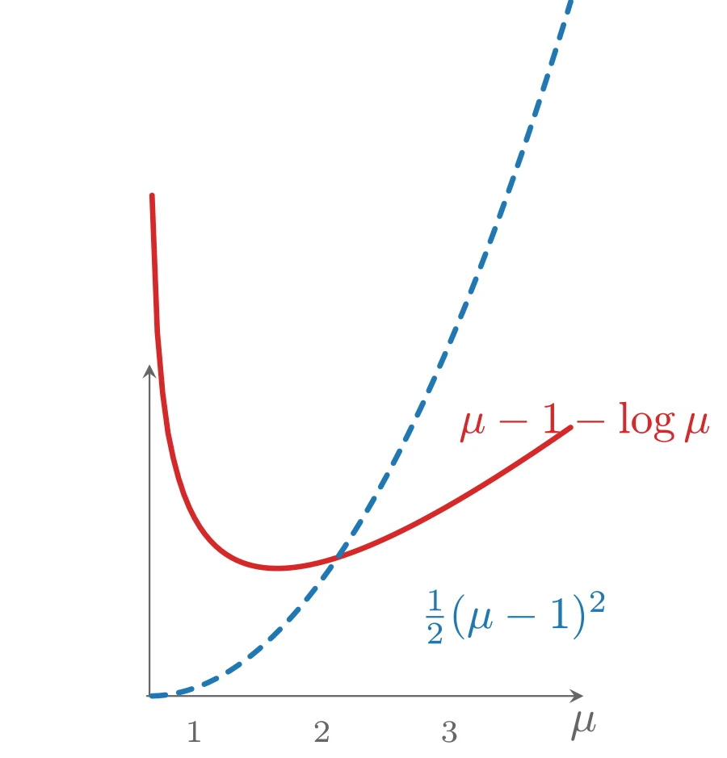
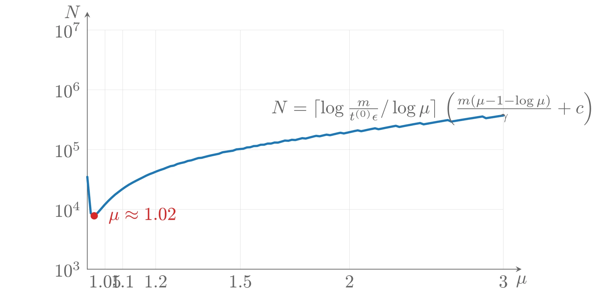

# 基于自和谐的复杂度分析

利用 Newton 方法对自和谐函数的复杂度分析，可以对障碍方法进行复杂度分析。该分析适用于许多常见问题，并导出若干有趣的结论：它给出了用障碍方法求解问题所需 Newton 步总数的严格界，并解释了我们的观察——中心点问题并不随 $t$ 增大而变得更难。

## 自和谐性假设

我们做两个假设：

- 函数 $tf_0 + \phi$ 对所有 $t \geqslant t^{(0)}$ 都是闭的且自和谐的。
- 问题的下水平集有界。

第二个假设意味着中心点问题的下水平集有界，因此中心点问题可解；该假设还蕴含 $tf_0 + \phi$ 的 Hessian 处处正定。虽然自和谐性假设把复杂度分析限制在一类特定的问题上，但需要强调：无论自和谐假设是否成立，障碍方法都工作良好。

自和谐性假设对很多问题成立，包括所有线性与二次问题：若 $f_i$ 都是线性或二次函数，则 $tf_0 - \sum_{i=1}^m \log(-f_i)$ 对所有 $t \geqslant 0$ 自和谐。因此下面的复杂度分析适用于 LP、QP 和 QCQP。

在其他情形，可以通过改写问题使自和谐假设成立。例如线性不等式约束的熵最大化问题（目标 $\sum_i x_i\log x_i$，约束 $Fx \preceq g$、$Ax = b$）的 $tf_0 + \phi$ 不是闭的（除非 $Fx \preceq g$ 蕴含 $x \succeq 0$），也不是自和谐的。但加入冗余不等式约束 $x \succeq 0$ 得到等价问题后，

$$
tf_0(x) + \phi(x) = t\sum_{i=1}^n x_i\log x_i - \sum_{i=1}^n \log x_i - \sum_{i=1}^m \log(g_i - f_i^{\top}x)
$$

对任意 $t \geqslant 0$ 都是闭的且自和谐的（函数 $t\,x\log x - \log x$ 在 $\mathbf{R}_{++}$ 上对所有 $t \geqslant 0$ 自和谐）。

一个更特别的例子是 GP：目标 $\log\sum_k \exp(a_{0k}^{\top}x + b_{0k})$ 与对数和指数约束的 GP 的 $tf_0 + \phi$ 是否自和谐并不清楚，因此尽管障碍方法可用，本节的复杂度分析未必适用。不过可以通过引入上界变量 $y_{ik}$（对每个单项式项 $\exp(a_{ik}^{\top}x + b_{ik})$ 引入 $\exp(a_{ik}^{\top}x + b_{ik}) \leqslant y_{ik}$）把 GP 改写为

$$
\begin{aligned}
    \mathrm{minimize} \quad & \sum_{k=1}^{K_0} y_{0k} \\
    \mathrm{subject\ to} \quad & \sum_{k=1}^{K_i} y_{ik} \leqslant 1, \ i = 1, \cdots, m \\
    & a_{ik}^{\top}x + b_{ik} - \log y_{ik} \leqslant 0, \ i = 0, \cdots, m,\ k = 1, \cdots, K_i \\
    & y_{ik} \geqslant 0, \ i = 0, \cdots, m,\ k = 1, \cdots, K_i
\end{aligned}
$$

其相应的对数障碍

$$
\sum_{i=0}^m \sum_{k=1}^{K_i}\left(-\log y_{ik} - \log(\log y_{ik} - a_{ik}^{\top}x - b_{ik})\right) - \sum_{i=1}^m \log\left(1 - \sum_{k=1}^{K_i} y_{ik}\right)
$$

是闭的且自和谐的；由于目标函数是线性的，$tf_0 + \phi$ 对任意 $t$ 都闭且自和谐。

## 每个中心点步的 Newton 迭代次数

自和谐函数的 Newton 方法复杂度理论表明：极小化一个闭的严格凸自和谐函数 $f$ 所需的 Newton 迭代次数不超过

$$
\frac{f(x) - p^{\star}}{\gamma} + c
$$

其中 $x$ 是初始点，$p^{\star} = \inf_x f(x)$。常数 $\gamma$ 只依赖于回溯参数 $\alpha$ 和 $\beta$：

$$
\frac{1}{\gamma} = \frac{20 - 8\alpha}{\alpha\beta(1 - 2\alpha)^2}
$$

常数 $c$ 只依赖于容许误差 $\epsilon_{\mathrm{nt}}$：$c = \log_2\log_2(1/\epsilon_{\mathrm{nt}})$，合理地可近似为 $c = 6$。这个界对所需 Newton 步数相当保守，但我们的兴趣只在于建立复杂度界，并关注它随问题规模与算法参数的增长方式。

用该结果可以推导障碍方法一次外层迭代（即从 $x^{\star}(t)$ 出发计算 $x^{\star}(\mu t)$）所需 Newton 步数的界。为简化记号，用 $x$ 表示当前迭代点 $x^{\star}(t)$，$x^{+}$ 表示下一个迭代点 $x^{\star}(\mu t)$；用 $\lambda, \nu$ 表示 $\lambda^{\star}(t), \nu^{\star}(t)$。

自和谐性假设意味着

$$
\frac{\mu tf_0(x) + \phi(x) - \mu tf_0(x^{+}) - \phi(x^{+})}{\gamma} + c
$$

是从 $x^{\star}(t)$ 出发计算 $x^{+}$ 所需 Newton 步数的上界。遗憾的是，在真正算出 $x^{+}$ 之前我们并不知道它，因而也不知道这个上界。不过可以对它再作上界估计：

$$
\begin{aligned}
    \mu tf_0(x) + \phi(x) - \mu tf_0(x^{+}) - \phi(x^{+}) & = \mu tf_0(x) - \mu tf_0(x^{+}) + \sum_{i=1}^m \log(-\mu t\lambda_if_i(x^{+})) - m\log\mu \\
    & \leqslant \mu tf_0(x) - \mu t\sum_{i=1}^m \lambda_if_i(x^{+}) - m - m\log\mu \\
    & = \mu tf_0(x) - \mu t\left(f_0(x^{+}) + \sum_{i=1}^m \lambda_if_i(x^{+}) + \nu^{\top}(Ax^{+} - b)\right) - m - m\log\mu \\
    & \leqslant \mu tf_0(x) - \mu t\, g(\lambda, \nu) - m - m\log\mu \\
    & = m(\mu - 1 - \log\mu)
\end{aligned}
$$

对推导的说明：从第一行到第二行利用 $\lambda_i = -1/(tf_i(x))$；第一个不等式利用 $\log a \leqslant a - 1$（$a > 0$）；第三、四行之间利用 $Ax^{+} = b$（额外的 $\nu^{\top}(Ax^{+} - b)$ 项为零）；第二个不等式由对偶函数的定义（$g(\lambda, \nu) \leqslant f_0(x^{+}) + \sum_i \lambda_if_i(x^{+}) + \nu^{\top}(Ax^{+} - b)$）得到；最后一行来自 $g(\lambda, \nu) = f_0(x) - m/t$。

结论是

$$
\frac{m(\mu - 1 - \log\mu)}{\gamma} + c
$$

是障碍方法一次外层迭代所需 Newton 步数的上界。函数 $\mu - 1 - \log\mu$ 在 $\mu$ 很小时近似二次，在 $\mu$ 很大时近似线性增长。这与直觉一致：$\mu$ 接近 1 时重新中心化所需步数少，$\mu$ 大时步数可能增长。

该界表明：每个中心点步所需 Newton 步数由一个主要依赖于 $\mu$（障碍方法外层步中 $t$ 的更新因子）和 $m$（不等式约束个数）的量控制，它对内层迭代直线搜索参数 $\alpha$、$\beta$ 的依赖较弱，对内层迭代终止容许误差的依赖非常弱。有趣的是，该界**不**依赖于变量维数 $n$、等式约束个数 $p$，也不依赖于问题的具体数据（只要自和谐假设成立）。最后注意它也不依赖于 $t$：特别地，当 $t \rightarrow \infty$ 时，每次外层迭代所需 Newton 步数有一个一致的上界。

## Newton 迭代总次数

现在可以给出障碍方法 Newton 步总数的上界（不计初始中心点步，它将在阶段 I 分析中处理）。把每个外层迭代的界乘以所需外层步数，得

$$
N = \left\lceil \frac{\log(m/(t^{(0)}\epsilon))}{\log\mu} \right\rceil \left(\frac{m(\mu - 1 - \log\mu)}{\gamma} + c\right)
$$

该式表明：当自和谐假设成立时，对任意 $\mu > 1$ 都可以给出障碍方法所需 Newton 步数的界。

若固定 $\mu$ 和 $m$，则 $N$ 与 $\log(m/(t^{(0)}\epsilon))$ 成正比——即初始对偶间隙 $m/t^{(0)}$ 与最终对偶间隙 $\epsilon$ 之比（要求的对偶间隙缩减倍数）的对数。因此可以说障碍方法至少线性收敛：达到给定精度所需步数随精度的倒数按对数增长。

若 $\mu$ 和所需的对偶间隙缩减倍数固定，则界 $N$ 随 $m$（不等式个数）线性增长；$N$ 不依赖于其他问题维数 $n$、$p$，也不依赖于具体的问题数据或函数。下面会看到，通过选取依赖于 $m$ 的特定 $\mu$ 值，可以得到只按 $\sqrt{m}$（而不是 $m$）增长的界。

最后分析 $N$ 关于算法参数 $\mu$ 的变化：当 $\mu$ 趋于 1 时，$N$ 的第一项增大，因此 $N$ 增大——这与 $\mu$ 接近 1 时外层迭代极多的直觉和观察一致；$\mu$ 大时，$N$ 近似按 $\mu/\log\mu$ 增长——因为每次外层迭代所需步数的界增大，同样符合观察。因此 $N$ 作为 $\mu$ 的函数有最小值。以 $c = 6$、$\gamma = 1/375$、$m/(t^{(0)}\epsilon) = 10^5$、$m = 100$ 为例，界 $N$ 在 $\mu \approx 1.02$ 处最小，约为 8000 次 Newton 迭代。该复杂度分析是保守的，但选择 $\mu$ 的基本折中确实反映在曲线中。（实践中大得多的 $\mu$（约 2 到 100）都工作很好，所需 Newton 迭代总数只是几十的量级。）



上图由下面的 TikZ 代码编译而来：

```tex

  \definecolor{cblue}{RGB}{31,119,180}
  \definecolor{cred}{RGB}{214,39,40}
  \definecolor{cgreen}{RGB}{44,160,44}
  \definecolor{corange}{RGB}{255,127,14}
  \definecolor{cpurple}{RGB}{148,103,189}
  \definecolor{cbrown}{RGB}{140,86,75}
  \definecolor{cpink}{RGB}{227,119,194}
  \definecolor{cgray}{RGB}{127,127,127}
\begin{tikzpicture}[x=1cm,y=1cm,>=stealth,line cap=round,line join=round]
  \draw[->,color=black!60] (0.98,0) -- (4.4,0) node[below] {$\mu$};
  \draw[->,color=black!60] (1,0) -- (1,2.6) node[left] {};
  \draw[cred,very thick,domain=1.02:4.3,samples=80] plot (\x,{\x-1-ln(\x-1)+0.0});
  \draw[cblue,very thick,dashed,domain=1.02:4.3,samples=60] plot (\x,{0.5*(\x-1)*(\x-1)});
  \node[font=\scriptsize,color=black!60] at (1.35,-0.28) {$1$};
  \node[font=\scriptsize,color=black!60] at (2.35,-0.28) {$2$};
  \node[font=\scriptsize,color=black!60] at (3.35,-0.28) {$3$};
  \node[anchor=west,color=cred] at (3.3,2.15) {$\mu-1-\log\mu$};
  \node[anchor=west,color=cblue] at (3.0,0.62) {$\frac{1}{2}(\mu-1)^2$};
\end{tikzpicture}
```


上图由下面的 TikZ 代码编译而来：

```tex

  \definecolor{cblue}{RGB}{31,119,180}
  \definecolor{cred}{RGB}{214,39,40}
  \definecolor{cgreen}{RGB}{44,160,44}
  \definecolor{corange}{RGB}{255,127,14}
  \definecolor{cpurple}{RGB}{148,103,189}
  \definecolor{cbrown}{RGB}{140,86,75}
  \definecolor{cpink}{RGB}{227,119,194}
  \definecolor{cgray}{RGB}{127,127,127}
\begin{tikzpicture}[x=1cm,y=1cm,>=stealth,line cap=round,line join=round]
  \draw[color=black!12,very thin] (0.3414,0) -- (0.3414,4.6) (0.6807,0) -- (0.6807,4.6) (1.3155,0) -- (1.3155,4.6) (2.9434,0) -- (2.9434,4.6) (5.0421,0) -- (5.0421,4.6) (8.0000,0) -- (8.0000,4.6) (0,0.0000) -- (8,0.0000) (0,1.1500) -- (8,1.1500) (0,2.3000) -- (8,2.3000) (0,3.4500) -- (8,3.4500) (0,4.6000) -- (8,4.6000) ;
  \draw[->,color=black!60] (0,0) -- (8.35,0) node[below] {$\mu$};
  \draw[->,color=black!60] (0,0) -- (0,4.949999999999999) node[left] {$N$};
  \draw[cblue,very thick] plot coordinates {(0.000,1.776) (0.067,1.076) (0.133,1.027) (0.200,1.085) (0.267,1.162) (0.333,1.238) (0.400,1.309) (0.467,1.374) (0.533,1.433) (0.600,1.485) (0.667,1.536) (0.733,1.582) (0.800,1.625) (0.867,1.663) (0.933,1.698) (1.000,1.732) (1.067,1.765) (1.133,1.799) (1.200,1.829) (1.267,1.854) (1.333,1.882) (1.400,1.907) (1.467,1.929) (1.533,1.956) (1.600,1.981) (1.667,1.994) (1.733,2.024) (1.800,2.042) (1.867,2.057) (1.933,2.082) (2.000,2.094) (2.067,2.116) (2.133,2.137) (2.200,2.143) (2.267,2.161) (2.333,2.178) (2.400,2.193) (2.467,2.207) (2.533,2.221) (2.600,2.248) (2.667,2.259) (2.733,2.269) (2.800,2.279) (2.867,2.304) (2.933,2.311) (3.000,2.317) (3.067,2.341) (3.133,2.346) (3.200,2.368) (3.267,2.371) (3.333,2.393) (3.400,2.395) (3.467,2.416) (3.533,2.416) (3.600,2.436) (3.667,2.435) (3.733,2.454) (3.800,2.474) (3.867,2.470) (3.933,2.489) (4.000,2.484) (4.067,2.502) (4.133,2.520) (4.200,2.513) (4.267,2.531) (4.333,2.548) (4.400,2.565) (4.467,2.556) (4.533,2.572) (4.600,2.588) (4.667,2.577) (4.733,2.593) (4.800,2.609) (4.867,2.624) (4.933,2.611) (5.000,2.626) (5.067,2.641) (5.133,2.656) (5.200,2.670) (5.267,2.654) (5.333,2.668) (5.400,2.683) (5.467,2.697) (5.533,2.710) (5.600,2.692) (5.667,2.705) (5.733,2.719) (5.800,2.732) (5.867,2.745) (5.933,2.758) (6.000,2.736) (6.067,2.749) (6.133,2.762) (6.200,2.774) (6.267,2.787) (6.333,2.799) (6.400,2.811) (6.467,2.786) (6.533,2.798) (6.600,2.810) (6.667,2.822) (6.733,2.834) (6.800,2.845) (6.867,2.857) (6.933,2.868) (7.000,2.839) (7.067,2.851) (7.133,2.862) (7.200,2.873) (7.267,2.884) (7.333,2.895) (7.400,2.905) (7.467,2.916) (7.533,2.927) (7.600,2.937) (7.667,2.904) (7.733,2.915) (7.800,2.925) (7.867,2.936) (7.933,2.946) (8.000,2.956)};
  \node[below,color=black!60] at (0.3414,0) {1.05};
  \node[below,color=black!60] at (0.6807,0) {1.1};
  \node[below,color=black!60] at (1.3155,0) {1.2};
  \node[below,color=black!60] at (2.9434,0) {1.5};
  \node[below,color=black!60] at (5.0421,0) {2};
  \node[below,color=black!60] at (8.0000,0) {3};
  \node[left,color=black!60] at (0,0.0000) {$10^{3}$};
  \node[left,color=black!60] at (0,1.1500) {$10^{4}$};
  \node[left,color=black!60] at (0,2.3000) {$10^{5}$};
  \node[left,color=black!60] at (0,3.4500) {$10^{6}$};
  \node[left,color=black!60] at (0,4.6000) {$10^{7}$};
  \fill[cred] (0.1333,1.0269) circle (2pt);
  \node[anchor=west,color=cred] at (0.2833,1.0269) {$\mu\approx1.02$};
  \node[anchor=south west,color=black!60] at (3.4142,2.6462) {$N = \lceil\log\frac{m}{t^{(0)}\epsilon}/\log\mu\rceil\,\left(\frac{m(\mu-1-\log\mu)}{\gamma}+c\right)$};
\end{tikzpicture}
```


### 把 $\mu$ 取为 $m$ 的函数

当 $\mu$（及所需对偶间隙缩减倍数）固定时，界 $N$ 随 $m$ 线性增长；但通过把 $\mu$ 取为 $m$ 的函数，可以得到更好的增长阶。取

$$
\mu = 1 + 1/\sqrt{m}
$$

利用 $-\log(1 + a) \leqslant -a + a^2/2$（$a \geqslant 0$）与对数函数的凹性（$\log(1 + 1/\sqrt{m}) \geqslant (\log 2)/\sqrt{m}$），可得 $\mu - 1 - \log\mu \leqslant 1/(2m)$，于是总步数满足

$$
N \leqslant \left\lceil \sqrt{m}\, \frac{\log_2(m/(t^{(0)}\epsilon))}{m} \right\rceil \left(\frac{1}{2\gamma} + c\right) \leqslant c_1 + c_2\sqrt{m}
$$

其中

$$
c_1 = \frac{1}{2\gamma} + c, \quad c_2 = \log_2(m/(t^{(0)}\epsilon))\left(\frac{1}{2\gamma} + c\right)
$$

这里 $c_1$（只弱依赖于中心点 Newton 步的算法参数）与 $c_2$（还依赖于所需的对偶间隙缩减倍数）中，$\log_2(m/(t^{(0)}\epsilon))$ 正好是所需对偶间隙缩减的位数。

对固定的对偶间隙缩减要求，界随 $\sqrt{m}$ 增长，而固定 $\mu$ 时的界按 $m$ 增长。因此取参数值 $\mu = 1 + 1/\sqrt{m}$ 的障碍方法被称为**阶 $\sqrt{m}$ 方法**&#8203;（order $\sqrt{m}$ method）。

实践中我们不会使用 $\mu = 1 + 1/\sqrt{m}$（它太小了），也不会随 $m$ 减小 $\mu$。我们对这个值的唯一兴趣在于：它（近似地）极小化我们（非常保守的）Newton 步数上界，并给出按 $\sqrt{m}$（而不是 $m$）增长的整体估计。

## 可行性问题

本节分析基本阶段 I 方法的一个（小的）变体用于求解凸不等式组

$$
f_1(x) \leqslant 0,\ \cdots,\ f_m(x) \leqslant 0
$$

的复杂度（$f_i$ 凸、二阶导数连续；等式约束稍后考虑）。假设阶段 I 问题

$$
\mathrm{minimize} \quad s \quad \mathrm{subject\ to} \quad f_i(x) \leqslant s,\ i = 1, \cdots, m
$$

满足前述自和谐性条件。特别地，假设不等式组的可行集（当然可能为空）包含在半径为 $R$ 的欧氏球内：

$$
\{x \mid f_i(x) \leqslant 0,\ i = 1, \cdots, m\} \subseteq \{x \mid \|x\|_2 \leqslant R\}
$$

可以把 $R$ 解释为对可行集内任何点的范数的一个先验上界；该假设保证了阶段 I 问题的下水平集有界。不失一般性，从 $x = 0$ 出发。定义 $F = \max_i f_i(0)$（最大约束违反量，设为正，否则 $x = 0$ 已满足不等式组），$\bar{p}^{\star}$ 为阶段 I 问题的最优值。

$\bar{p}^{\star}$ 的符号决定不等式组是否可行；其大小也有含义。若 $\bar{p}^{\star}$ 为正且较大（接近其可能的最大值 $F$），说明不等式组相当不可行——对每个 $x$，至少有一个不等式被至少 $\bar{p}^{\star}$ 地违反。若 $\bar{p}^{\star}$ 为负且绝对值大，说明不等式组相当可行——不仅存在使所有 $f_i$ 非正的 $x$，而且存在使它们都相当负（至多 $\bar{p}^{\star}$）的 $x$。因此 $|\bar{p}^{\star}|$ 度量了不等式组可行或不可行的“明显程度”，从而与判定可行性的难度相关：$|\bar{p}^{\star}|$ 小意味着问题接近可行与不可行的边界。

为判定可行性，对阶段 I 问题做一个变体：增加一条冗余的线性不等式 $a^{\top}x \leqslant 1$（$a$ 稍后确定，将满足 $\|a\|_2 \leqslant 1/R$，故 $\|x\|_2 \leqslant R$ 蕴含 $a^{\top}x \leqslant 1$，即该约束是冗余的）：

$$
\mathrm{minimize} \quad s \quad \mathrm{subject\ to} \quad f_i(x) \leqslant s,\ i = 1, \cdots, m, \quad a^{\top}x \leqslant 1
$$

选取 $a$ 与 $s^{(0)}$，使 $x = 0$、$s = s^{(0)}$ 位于该问题中心路径上参数 $t^{(0)}$ 对应的点，即它们极小化

$$
t^{(0)}s - \sum_{i=1}^m \log(s - f_i(x)) - \log(1 - a^{\top}x)
$$

令对 $s$ 的导数为零得

$$
t^{(0)} = \sum_{i=1}^m \frac{1}{s^{(0)} - f_i(0)}
$$

令对 $x$ 的梯度为零得

$$
a = -\sum_{i=1}^m \frac{1}{s^{(0)} - f_i(0)}\nabla f_i(0)
$$

因此只需选取参数 $s^{(0)}$：选定后 $a$ 与 $t^{(0)}$ 分别由上两式给出。为保证 $x = 0$、$s = s^{(0)}$ 对阶段 I 问题严格可行，必须 $s^{(0)} > F$；为保证 $\|a\|_2 \leqslant 1/R$，由上式有 $\|a\|_2 \leqslant \sum_i \|∇f_i(0)\|_2/(s^{(0)} - F) \leqslant mG/(s^{(0)} - F)$（$G = \max_i \|\nabla f_i(0)\|_2$），故可取

$$
s^{(0)} = mGR + F
$$

由此 $\|a\|_2 \leqslant 1/R$，冗余线性不等式确实冗余。再由 $t^{(0)}$ 的表达式（注意 $F = \max_i f_i(0)$）可得 $t^{(0)} \geqslant 1/(mGR)$，因此 $x = 0$、$s = s^{(0)}$ 位于阶段 I 问题中心路径上、初始对偶间隙为

$$
\frac{m + 1}{t^{(0)}} \leqslant (m + 1)mGR
$$

求解原不等式组需要确定 $\bar{p}^{\star}$ 的符号。当问题的对偶间隙小于 $|\bar{p}^{\star}|$ 时，原问题目标值为负（说明可行）或对偶目标值为正（说明不可行）两个条件之一必然发生。用障碍方法求解（从一个对偶间隙不超过 $(m+1)mGR$ 的中心点出发，在对偶间隙小于 $|\bar{p}^{\star}|$ 时或之前终止），所需 Newton 步数不超过

$$
\left\lceil \sqrt{m + 1}\, \log_2 \frac{m(m + 1)GR}{|\bar{p}^{\star}|} \right\rceil \left(\frac{1}{2\gamma} + c\right)
$$

（这里取 $\mu = 1 + 1/\sqrt{m + 1}$，它比固定的 $\mu$ 给出更好的复杂度增长阶。）该界只比 $\sqrt{m}$ 略快，且对中心点步算法参数的依赖较弱；它近似正比于 $\log_2((GR)/|\bar{p}^{\star}|)$，后者可以解释为该可行性问题的难度（或其接近可行/不可行边界的程度）的度量。

**带等式约束的可行性问题**&#8203;：可以通过消去等式约束把同样的分析应用于带等式约束的可行性问题。这不影响问题的自和谐性，但意味着 $G$ 与 $R$ 指的是约简（消去后）问题的相应量。

## 阶段 I 与阶段 II 的组合复杂度

本节给出用障碍方法求解问题

$$
\mathrm{minimize} \quad f_0(x) \quad \mathrm{subject\ to} \quad f_i(x) \leqslant 0,\ i = 1, \cdots, m, \quad Ax = b
$$

的端到端复杂度分析（含阶段 I 的变体）。先求解阶段 I 问题

$$
\mathrm{minimize} \quad s \quad \mathrm{subject\ to} \quad f_i(x) \leqslant s,\ i = 1, \cdots, m, \quad f_0(x) \leqslant M, \quad Ax = b, \quad a^{\top}x \leqslant 1
$$

假设它满足自和谐与有界下水平集假设。这里增加了两条冗余不等式：约束 $f_0(x) \leqslant M$ 保证阶段 I 中心路径与阶段 II 中心路径相交（$M$ 是最优值的一个先验上界）；第二条是线性不等式 $a^{\top}x \leqslant 1$（$a$ 按上文方式选取）。用 $\mu = 1 + 1/\sqrt{m + 2}$ 与初始点 $x = 0$、$s = s^{(0)}$ 求解该问题。

要找到严格可行点或判定问题不可行，所需 Newton 步数不超过

$$
N_{\mathrm{I}} = \left\lceil \sqrt{m + 2}\, \log_2 \frac{(m + 1)(m + 2)GR}{|\bar{p}^{\star}|} \right\rceil \left(\frac{1}{2\gamma} + c\right)
$$

其中 $G$、$R$ 按上文定义。若问题不可行，到此结束；若可行，则在阶段 I 中得到一个与 $s = 0$ 相关联、位于阶段 II 问题（含冗余约束 $a^{\top}x \leqslant 1$）中心路径上的点，其初始对偶间隙不超过 $(m + 1)(M - p^{\star})$。假设阶段 II 问题同样满足自和谐与有界下水平集假设。

接下来进入阶段 II，再次使用障碍方法：把对偶间隙从初始值（不超过 $(m + 1)(M - p^{\star})$）降到某个容许误差 $\epsilon > 0$，至多需要

$$
N_{\mathrm{II}} = \left\lceil \sqrt{m + 1}\, \log_2 \frac{(m + 1)(M - p^{\star})}{\epsilon} \right\rceil \left(\frac{1}{2\gamma} + c\right)
$$

次 Newton 步。因此总步数不超过 $N_{\mathrm{I}} + N_{\mathrm{II}}$。该界随不等式个数 $m$ 近似按 $\sqrt{m}$ 增长，并包含两个依赖于具体问题实例的项：

$$
\log_2 \frac{GR}{|\bar{p}^{\star}|}, \quad \log_2 \frac{M - p^{\star}}{\epsilon}
$$

## 总结

本节给出的复杂度分析主要具有理论意义。特别要提醒读者：这里讨论的 $\mu = 1 + 1/\sqrt{m}$ 在实践中是一个非常糟糕的选择；它的唯一优点是使界按 $\sqrt{m}$ 而不是 $m$ 增长。同样，实践中也不建议添加冗余不等式 $a^{\top}x \leqslant 1$。

这里分析得到的界远高于实际观察到的迭代次数；甚至界中的增长阶看起来也是保守的：最好的界按 $\sqrt{m}$ 增长，而实际经验表明所需 Newton 步数几乎不随 $m$（或任何其他参数）增长。

尽管如此，知道以下事实是令人安心的：当自和谐条件成立时，可以对障碍方法的每个中心点步所需 Newton 步数给出一致上界。障碍方法一个潜在的缺陷是：随着 $t$ 增长，相应的中心点问题可能变得更难、需要更多 Newton 步。实践表明情况并非如此，而一致界增强了我们“这不可能发生”的信心。

最后我们指出：把问题改写成使自和谐条件成立的形式是否具有实际好处，目前尚不清楚。我们所能说的是：当自和谐条件成立时，障碍方法在实践中工作良好，并且我们可以给出最坏情形复杂度界。
