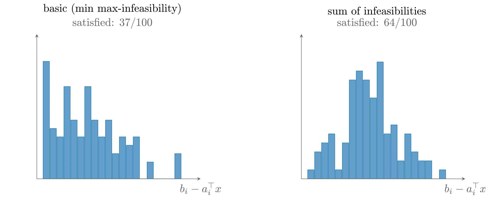
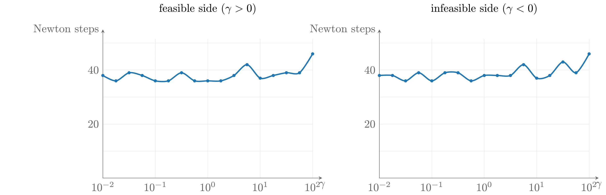
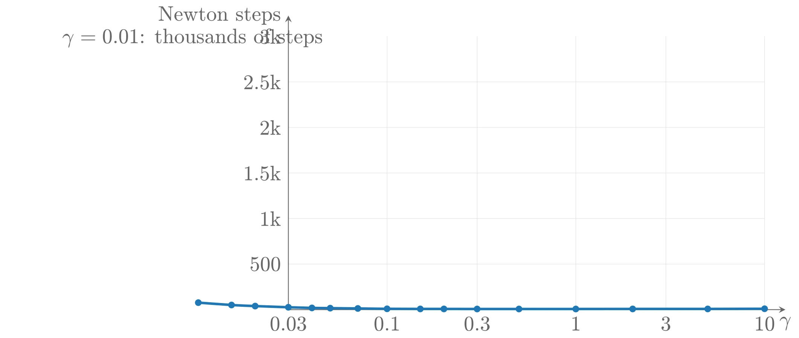

# 可行性与阶段 I 方法

障碍方法需要一个严格可行的初始点 $x^{(0)}$。当这样的点未知时，需要在障碍方法之前先执行一个预备阶段——**阶段 I**&#8203;（phase I）——来计算一个严格可行点（或者判定约束不可行）。阶段 I 得到的严格可行点随后用作障碍方法（称为**阶段 II**&#8203;，phase II）的初始点。本节描述几种阶段 I 方法。

## 基本的阶段 I 方法

考虑变量 $x \in \mathbf{R}^n$ 的不等式与等式组

$$
f_i(x) \leqslant 0, \ i = 1, \cdots, m, \quad Ax = b
$$

其中 $f_i$ 凸且二阶导数连续。假设给定点 $x^{(0)} \in \operatorname{dom} f_1 \cap \cdots \cap \operatorname{dom} f_m$ 且 $Ax^{(0)} = b$。

我们的目标是找到上述不等式与等式的严格可行解，或者判定不存在。为此构造优化问题

$$
\mathrm{minimize} \quad s \quad \mathrm{subject\ to} \quad f_i(x) \leqslant s,\ i = 1, \cdots, m, \quad Ax = b
$$

变量为 $x \in \mathbf{R}^n$ 与 $s \in \mathbf{R}$。变量 $s$ 可以解释为不等式最大不可行性的上界；目标是把最大不可行性压到零以下。

该问题总是严格可行的：$x$ 可以取 $x^{(0)}$，$s$ 可以取任何大于 $\max_i f_i(x^{(0)})$ 的数。因此可以对上述问题（称为不等式与等式组的**阶段 I 优化问题**&#8203;）应用障碍方法。

根据其最优值 $\bar{p}^{\star}$ 的符号可以区分三种情形：

1. 若 $\bar{p}^{\star} < 0$，则原不等式与等式组有严格可行解。而且若 $(x, s)$ 是阶段 I 问题的可行点且 $s < 0$，则 $x$ 满足 $f_i(x) < 0$。这意味着不需要高精度求解阶段 I 问题：一旦 $s < 0$ 即可终止。
2. 若 $\bar{p}^{\star} > 0$，则原不等式组不可行。同样不需要高精度求解：当找到一个对偶目标为正的对偶可行点（它证明 $\bar{p}^{\star} > 0$）时即可终止。此时可以从该对偶可行点构造证明不可行的 alternative（备选解）。
3. 若 $\bar{p}^{\star} = 0$ 且最小值在 $x^{\star}$、$s^{\star} = 0$ 处取得，则不等式组可行但不严格可行。若 $\bar{p}^{\star} = 0$ 且最小值没有取得，则不等式组不可行。

实践中无法精确判定 $\bar{p}^{\star} = 0$：优化算法终止时的结论是 $|\bar{p}^{\star}| < \epsilon$（$\epsilon$ 为小的正数）。这使我们能够断言：不等式 $f_i(x) \leqslant -\epsilon$ 不可行，而不等式 $f_i(x) \leqslant \epsilon$ 可行。

### 不可行性之和

基本阶段 I 方法有很多变体。其中一种极小化**不可行性之和**&#8203;（sum of infeasibilities）而不是最大不可行性：

$$
\mathrm{minimize} \quad \mathbf{1}^{\top}s \quad \mathrm{subject\ to} \quad f_i(x) \leqslant s_i,\ i = 1, \cdots, m, \quad Ax = b, \quad s \succeq 0
$$

对固定的 $x$，$s_i$ 的最优值为 $\max\{f_i(x), 0\}$，因此该问题是在极小化不可行性之和。当且仅当原始等式与不等式组可行时，其最优值为零并可以取得。

当等式与不等式组不可行时，该阶段 I 方法有一个非常有趣的性质：阶段 I 问题的最优点往往只违反少数（设为 $r$ 个）不等式。因此我们计算出了一个满足大多数（$m - r$ 个）不等式的点，即识别出了一个可行的大子集；同时，与被严格满足的不等式相关联的对偶变量为零，所以我们还证明了某个子集的不等式不可行。这比发现 $m$ 个不等式合起来不可行提供了更多信息。（该现象与用于寻找稀疏近似解的 $\ell_1$ 范数正则化或 basis pursuit 密切相关。）

**例子：两种阶段 I 方法的比较**&#8203;。对一个不可行的不等式组 $Ax \preceq b$（$m = 100$，$n = 50$）分别应用两种方法：极小化最大不可行性的基本方法（$\mathrm{minimize}\ s\ \mathrm{s.t.}\ Ax \preceq b + \mathbf{1}s$）与极小化不可行性之和的 LP（$\mathrm{minimize}\ \mathbf{1}^{\top}s\ \mathrm{s.t.}\ Ax \preceq b + s,\ s \succeq 0$）。得到的点 $x_{\max}$ 满足 100 个不等式中的 39 个，而 $x_{\mathrm{sum}}$ 满足 79 个。



上图由下面的 TikZ 代码编译而来：

```tex

  \definecolor{cblue}{RGB}{31,119,180}
  \definecolor{cred}{RGB}{214,39,40}
  \definecolor{cgreen}{RGB}{44,160,44}
  \definecolor{corange}{RGB}{255,127,14}
  \definecolor{cpurple}{RGB}{148,103,189}
  \definecolor{cbrown}{RGB}{140,86,75}
  \definecolor{cpink}{RGB}{227,119,194}
  \definecolor{cgray}{RGB}{127,127,127}
\begin{tikzpicture}[x=1cm,y=1cm,>=stealth,line cap=round,line join=round]
  \begin{scope}[xshift=0cm]
    \draw[fill=cblue!70,draw=cblue] (1.0000,0) rectangle (1.2000,3.7333);
    \draw[fill=cblue!70,draw=cblue] (1.2200,0) rectangle (1.4200,1.6000);
    \draw[fill=cblue!70,draw=cblue] (1.4400,0) rectangle (1.6400,1.3333);
    \draw[fill=cblue!70,draw=cblue] (1.6600,0) rectangle (1.8600,2.9333);
    \draw[fill=cblue!70,draw=cblue] (1.8800,0) rectangle (2.0800,1.8667);
    \draw[fill=cblue!70,draw=cblue] (2.1000,0) rectangle (2.3000,1.3333);
    \draw[fill=cblue!70,draw=cblue] (2.3200,0) rectangle (2.5200,2.9333);
    \draw[fill=cblue!70,draw=cblue] (2.5400,0) rectangle (2.7400,1.8667);
    \draw[fill=cblue!70,draw=cblue] (2.7600,0) rectangle (2.9600,1.3333);
    \draw[fill=cblue!70,draw=cblue] (2.9800,0) rectangle (3.1800,1.8667);
    \draw[fill=cblue!70,draw=cblue] (3.2000,0) rectangle (3.4000,0.8000);
    \draw[fill=cblue!70,draw=cblue] (3.4200,0) rectangle (3.6200,1.3333);
    \draw[fill=cblue!70,draw=cblue] (3.6400,0) rectangle (3.8400,1.0667);
    \draw[fill=cblue!70,draw=cblue] (3.8600,0) rectangle (4.0600,1.3333);
    \draw[fill=cblue!70,draw=cblue] (4.0800,0) rectangle (4.2800,0.0000);
    \draw[fill=cblue!70,draw=cblue] (4.3000,0) rectangle (4.5000,0.5333);
    \draw[fill=cblue!70,draw=cblue] (4.5200,0) rectangle (4.7200,0.0000);
    \draw[fill=cblue!70,draw=cblue] (4.7400,0) rectangle (4.9400,0.0000);
    \draw[fill=cblue!70,draw=cblue] (4.9600,0) rectangle (5.1600,0.0000);
    \draw[fill=cblue!70,draw=cblue] (5.1800,0) rectangle (5.3800,0.8000);
    \draw[->,color=black!60] (0.8,0) -- (6,0) node[below] {$b_i-a_i^{\top}x$};
    \draw[->,color=black!60] (0.8,0) -- (0.8,4.6) node[left] {};
    \node[anchor=south] at (3.2,5.1) {basic (min max-infeasibility)};
    \node[anchor=south,color=black!60] at (3.2,4.6499999999999995) {satisfied: 37/100};
  \end{scope}
  \begin{scope}[xshift=8.4cm]
    \draw[fill=cblue!70,draw=cblue] (1.0000,0) rectangle (1.2000,0.2857);
    \draw[fill=cblue!70,draw=cblue] (1.2200,0) rectangle (1.4200,0.8571);
    \draw[fill=cblue!70,draw=cblue] (1.4400,0) rectangle (1.6400,1.1429);
    \draw[fill=cblue!70,draw=cblue] (1.6600,0) rectangle (1.8600,1.4286);
    \draw[fill=cblue!70,draw=cblue] (1.8800,0) rectangle (2.0800,0.2857);
    \draw[fill=cblue!70,draw=cblue] (2.1000,0) rectangle (2.3000,1.1429);
    \draw[fill=cblue!70,draw=cblue] (2.3200,0) rectangle (2.5200,3.1429);
    \draw[fill=cblue!70,draw=cblue] (2.5400,0) rectangle (2.7400,3.4286);
    \draw[fill=cblue!70,draw=cblue] (2.7600,0) rectangle (2.9600,3.1429);
    \draw[fill=cblue!70,draw=cblue] (2.9800,0) rectangle (3.1800,2.5714);
    \draw[fill=cblue!70,draw=cblue] (3.2000,0) rectangle (3.4000,3.7143);
    \draw[fill=cblue!70,draw=cblue] (3.4200,0) rectangle (3.6200,1.4286);
    \draw[fill=cblue!70,draw=cblue] (3.6400,0) rectangle (3.8400,1.7143);
    \draw[fill=cblue!70,draw=cblue] (3.8600,0) rectangle (4.0600,0.5714);
    \draw[fill=cblue!70,draw=cblue] (4.0800,0) rectangle (4.2800,1.4286);
    \draw[fill=cblue!70,draw=cblue] (4.3000,0) rectangle (4.5000,0.8571);
    \draw[fill=cblue!70,draw=cblue] (4.5200,0) rectangle (4.7200,0.5714);
    \draw[fill=cblue!70,draw=cblue] (4.7400,0) rectangle (4.9400,0.5714);
    \draw[fill=cblue!70,draw=cblue] (4.9600,0) rectangle (5.1600,0.0000);
    \draw[fill=cblue!70,draw=cblue] (5.1800,0) rectangle (5.3800,0.2857);
    \draw[->,color=black!60] (0.8,0) -- (6,0) node[below] {$b_i-a_i^{\top}x$};
    \draw[->,color=black!60] (0.8,0) -- (0.8,4.6) node[left] {};
    \node[anchor=south] at (3.2,5.1) {sum of infeasibilities};
    \node[anchor=south,color=black!60] at (3.2,4.6499999999999995) {satisfied: 64/100};
  \end{scope}
\end{tikzpicture}
```

### 在阶段 II 中心路径附近终止

使用障碍方法的基本阶段 I 方法有一个简单的变体，其性质是：当等式与不等式组严格可行时，阶段 I 问题的中心路径与原优化问题的中心路径相交。

设给定点 $x^{(0)} \in \mathcal{D} = \operatorname{dom} f_0 \cap \operatorname{dom} f_1 \cap \cdots \cap \operatorname{dom} f_m$ 且 $Ax^{(0)} = b$。构造阶段 I 优化问题

$$
\mathrm{minimize} \quad s \quad \mathrm{subject\ to} \quad f_i(x) \leqslant s,\ i = 1, \cdots, m, \quad f_0(x) \leqslant M, \quad Ax = b
$$

其中常数 $M$ 取得比 $\max\{f_0(x^{(0)}), p^{\star}\}$ 大。假设原问题严格可行，则阶段 I 问题的最优值 $\bar{p}^{\star}$ 为负。其中心路径由如下条件刻画：

$$
\sum_{i=1}^m \frac{1}{s - f_i(x)} = \bar{t}, \quad \frac{1}{M - f_0(x)}\nabla f_0(x) + \sum_{i=1}^m \frac{1}{s - f_i(x)}\nabla f_i(x) + A^{\top}\nu = 0
$$

其中 $\bar{t}$ 为参数。若 $(x, s)$ 在中心路径上且 $s = 0$，则 $x$ 与 $\nu$ 满足

$$
t\nabla f_0(x) + \sum_{i=1}^m \frac{1}{-f_i(x)}\nabla f_i(x) + A^{\top}\nu = 0, \quad t = \frac{1}{M - f_0(x)}
$$

这意味着 $x$ 在原优化问题的中心路径上，相应的对偶间隙为

$$
m(M - f_0(x)) \leqslant m(M - p^{\star})
$$

## 通过不可行初始点 Newton 方法实现阶段 I

也可以用不可行初始点 Newton 方法执行阶段 I：对原问题的一个修正版本应用该方法。先把原问题改写为（显然等价的）形式

$$
\mathrm{minimize} \quad f_0(x) \quad \mathrm{subject\ to} \quad f_i(x) \leqslant s,\ i = 1, \cdots, m, \quad Ax = b, \quad s = 0
$$

（新增变量 $s \in \mathbf{R}$。）为启动障碍方法，用不可行初始点 Newton 方法求解

$$
\mathrm{minimize} \quad t^{(0)}f_0(x) - \sum_{i=1}^m \log(s - f_i(x)) \quad \mathrm{subject\ to} \quad Ax = b, \quad s = 0
$$

它可以从任意 $x \in \mathcal{D}$ 和任意 $s > \max_i f_i(x)$ 初始化。只要问题严格可行，不可行初始点 Newton 方法最终会取到无阻尼步，此后有 $s = 0$，即 $x$ 严格可行。

如果连 $\mathcal{D}$ 中的点都未知，可以把同样的技巧用于带额外变量的问题：对

$$
\mathrm{minimize} \quad t^{(0)}f_0(x + z_0) - \sum_{i=1}^m \log(s - f_i(x + z_i)) \quad \mathrm{subject\ to} \quad Ax = b, \quad s = 0, \quad z_0 = 0, \cdots, z_m = 0
$$

（变量 $x, z_0, \cdots, z_m, s$）应用不可行初始点 Newton 方法，初始化 $z_i$ 使 $x + z_i \in \operatorname{dom} f_i$。

这种阶段 I 方法的主要缺点是：当问题不可行时没有好的终止准则——残差只是不收敛到零。

## 例子

考虑一族线性可行性问题

$$
Ax \preceq b(\gamma), \quad b(\gamma) = b + \gamma\Delta b
$$

其中 $A \in \mathbf{R}^{50 \times 20}$；数据使得 $\gamma > 0$ 时不等式严格可行，$\gamma < 0$ 时不可行；$\gamma = 0$ 时可行但不严格可行。

**基本阶段 I 方法**&#8203;：对每个 $\gamma$ 构造 LP $\mathrm{minimize}\ s\ \mathrm{s.t.}\ Ax \preceq b(\gamma) + s\mathbf{1}$，用障碍方法求解（$\mu = 10$），初始点 $x = 0$，$s = -\min_i b_i(\gamma) + 1$；当找到 $s < 0$ 的点 $(x, s)$，或找到对偶问题中目标值为正的可行解 $z$（证明不可行）时终止。实验表明：不等式可行且有一定裕度时，约需 25 步 Newton 迭代即可得到严格可行点；不等式不可行且有一定裕度时，约需 35 步得到不可行性证书。阶段 I 的代价随着不等式组接近可行与不可行的边界（$\gamma$ 接近零）而增长：$\gamma$ 非常接近零时所需步数显著增加，大致按对数规律增长。

这个例子很典型：只要问题不非常接近可行与不可行的边界，用障碍方法求解一组凸不等式与线性等式的代价是适度的、近似为常数的；当问题非常接近边界时，找到严格可行点或给出不可行性证书所需的 Newton 步数会增长；而当问题恰好位于边界上时（例如可行但不严格可行），代价变为无穷。

**不可行初始点 Newton 方法**&#8203;：对同一族可行性问题（只考虑可行的 $\gamma > 0$，找到可行点即终止），把不可行初始点 Newton 方法应用于

$$
\mathrm{minimize} \quad -\sum_{i=1}^m \log s_i \quad \mathrm{subject\ to} \quad Ax + s = b(\gamma)
$$

（回溯参数 $\alpha = 0.01$、$\beta = 0.9$，初始点 $x^{(0)} = 0$，$s^{(0)} = \mathbf{1}$，$\nu^{(0)} = 0$）。结果表明：$\gamma$ 大于 0.3 左右时，不到 20 步即可找到可行点，比阶段 I 方法（约 30 步）更高效；$\gamma$ 较小时所需步数急剧增长（近似按 $1/\gamma$）；$\gamma = 0.01$ 时需要几千次迭代。这也很典型：不可行初始点 Newton 方法在可行集非空且不非常接近边界时表现很好；但当可行集刚刚勉强非空时，阶段 I 方法要好得多。阶段 I 方法的另一个优点是能优雅地处理不可行情形，而不可行初始点 Newton 方法只是不收敛。



上图由下面的 TikZ 代码编译而来：

```tex

  \definecolor{cblue}{RGB}{31,119,180}
  \definecolor{cred}{RGB}{214,39,40}
  \definecolor{cgreen}{RGB}{44,160,44}
  \definecolor{corange}{RGB}{255,127,14}
  \definecolor{cpurple}{RGB}{148,103,189}
  \definecolor{cbrown}{RGB}{140,86,75}
  \definecolor{cpink}{RGB}{227,119,194}
  \definecolor{cgray}{RGB}{127,127,127}
\begin{tikzpicture}[x=1cm,y=1cm,>=stealth,line cap=round,line join=round]
  \begin{scope}[xshift=0cm]
    \draw[color=black!12,very thin] (0.0000,0) -- (0.0000,4.4) (1.6500,0) -- (1.6500,4.4) (3.3000,0) -- (3.3000,4.4) (4.9500,0) -- (4.9500,4.4) (6.6000,0) -- (6.6000,4.4) (0,0.8540) -- (6.6,0.8540) (0,1.7081) -- (6.6,1.7081) (0,2.5621) -- (6.6,2.5621) (0,3.4161) -- (6.6,3.4161) (0,4.2702) -- (6.6,4.2702) ;
    \draw[->,color=black!60] (0,0) -- (6.8999999999999995,0) node[below] {$\gamma$};
    \draw[->,color=black!60] (0,0) -- (0,4.7) node[left] {Newton steps};
    \draw[cblue,very thick] plot [smooth] coordinates {(0.000,3.245) (0.412,3.075) (0.825,3.331) (1.237,3.245) (1.650,3.075) (2.063,3.075) (2.475,3.331) (2.887,3.075) (3.300,3.075) (3.712,3.075) (4.125,3.245) (4.537,3.587) (4.950,3.160) (5.362,3.245) (5.775,3.331) (6.188,3.331) (6.600,3.929)};
  \fill[cblue] (0.000,3.245) circle (1.4pt);
  \fill[cblue] (0.412,3.075) circle (1.4pt);
  \fill[cblue] (0.825,3.331) circle (1.4pt);
  \fill[cblue] (1.237,3.245) circle (1.4pt);
  \fill[cblue] (1.650,3.075) circle (1.4pt);
  \fill[cblue] (2.063,3.075) circle (1.4pt);
  \fill[cblue] (2.475,3.331) circle (1.4pt);
  \fill[cblue] (2.887,3.075) circle (1.4pt);
  \fill[cblue] (3.300,3.075) circle (1.4pt);
  \fill[cblue] (3.712,3.075) circle (1.4pt);
  \fill[cblue] (4.125,3.245) circle (1.4pt);
  \fill[cblue] (4.537,3.587) circle (1.4pt);
  \fill[cblue] (4.950,3.160) circle (1.4pt);
  \fill[cblue] (5.362,3.245) circle (1.4pt);
  \fill[cblue] (5.775,3.331) circle (1.4pt);
  \fill[cblue] (6.188,3.331) circle (1.4pt);
  \fill[cblue] (6.600,3.929) circle (1.4pt);
    \node[below,color=black!60] at (0.0000,0) {$10^{-2}$};
    \node[below,color=black!60] at (1.6500,0) {$10^{-1}$};
    \node[below,color=black!60] at (3.3000,0) {$10^{0}$};
    \node[below,color=black!60] at (4.9500,0) {$10^{1}$};
    \node[below,color=black!60] at (6.6000,0) {$10^{2}$};
    \node[left,color=black!60] at (0,1.7081) {20};
    \node[left,color=black!60] at (0,3.4161) {40};
    \node[anchor=south] at (3.3,5.050000000000001) {feasible side ($\gamma>0$)};
  \end{scope}
  \begin{scope}[xshift=8.7cm]
    \draw[color=black!12,very thin] (0.0000,0) -- (0.0000,4.4) (1.6500,0) -- (1.6500,4.4) (3.3000,0) -- (3.3000,4.4) (4.9500,0) -- (4.9500,4.4) (6.6000,0) -- (6.6000,4.4) (0,0.8540) -- (6.6,0.8540) (0,1.7081) -- (6.6,1.7081) (0,2.5621) -- (6.6,2.5621) (0,3.4161) -- (6.6,3.4161) (0,4.2702) -- (6.6,4.2702) ;
    \draw[->,color=black!60] (0,0) -- (6.8999999999999995,0) node[below] {$\gamma$};
    \draw[->,color=black!60] (0,0) -- (0,4.7) node[left] {Newton steps};
    \draw[cblue,very thick] plot [smooth] coordinates {(0.000,3.245) (0.412,3.245) (0.825,3.075) (1.237,3.331) (1.650,3.075) (2.063,3.331) (2.475,3.331) (2.887,3.075) (3.300,3.245) (3.712,3.245) (4.125,3.245) (4.537,3.587) (4.950,3.160) (5.362,3.245) (5.775,3.672) (6.188,3.331) (6.600,3.929)};
  \fill[cblue] (0.000,3.245) circle (1.4pt);
  \fill[cblue] (0.412,3.245) circle (1.4pt);
  \fill[cblue] (0.825,3.075) circle (1.4pt);
  \fill[cblue] (1.237,3.331) circle (1.4pt);
  \fill[cblue] (1.650,3.075) circle (1.4pt);
  \fill[cblue] (2.063,3.331) circle (1.4pt);
  \fill[cblue] (2.475,3.331) circle (1.4pt);
  \fill[cblue] (2.887,3.075) circle (1.4pt);
  \fill[cblue] (3.300,3.245) circle (1.4pt);
  \fill[cblue] (3.712,3.245) circle (1.4pt);
  \fill[cblue] (4.125,3.245) circle (1.4pt);
  \fill[cblue] (4.537,3.587) circle (1.4pt);
  \fill[cblue] (4.950,3.160) circle (1.4pt);
  \fill[cblue] (5.362,3.245) circle (1.4pt);
  \fill[cblue] (5.775,3.672) circle (1.4pt);
  \fill[cblue] (6.188,3.331) circle (1.4pt);
  \fill[cblue] (6.600,3.929) circle (1.4pt);
    \node[below,color=black!60] at (0.0000,0) {$10^{-2}$};
    \node[below,color=black!60] at (1.6500,0) {$10^{-1}$};
    \node[below,color=black!60] at (3.3000,0) {$10^{0}$};
    \node[below,color=black!60] at (4.9500,0) {$10^{1}$};
    \node[below,color=black!60] at (6.6000,0) {$10^{2}$};
    \node[left,color=black!60] at (0,1.7081) {20};
    \node[left,color=black!60] at (0,3.4161) {40};
    \node[anchor=south] at (3.3,5.050000000000001) {infeasible side ($\gamma<0$)};
  \end{scope}
\end{tikzpicture}
```


上图由下面的 TikZ 代码编译而来：

```tex

  \definecolor{cblue}{RGB}{31,119,180}
  \definecolor{cred}{RGB}{214,39,40}
  \definecolor{cgreen}{RGB}{44,160,44}
  \definecolor{corange}{RGB}{255,127,14}
  \definecolor{cpurple}{RGB}{148,103,189}
  \definecolor{cbrown}{RGB}{140,86,75}
  \definecolor{cpink}{RGB}{227,119,194}
  \definecolor{cgray}{RGB}{127,127,127}
\begin{tikzpicture}[x=1cm,y=1cm,>=stealth,line cap=round,line join=round]
  \draw[color=black!12,very thin] (0.0000,0) -- (0.0000,4.6) (1.6580,0) -- (1.6580,4.6) (3.1710,0) -- (3.1710,4.6) (4.8290,0) -- (4.8290,4.6) (6.3420,0) -- (6.3420,4.6) (8.0000,0) -- (8.0000,4.6) (0,0.7667) -- (8,0.7667) (0,1.5333) -- (8,1.5333) (0,2.3000) -- (8,2.3000) (0,3.0667) -- (8,3.0667) (0,3.8333) -- (8,3.8333) ;
  \draw[->,color=black!60] (0,0) -- (8.35,0) node[below] {$\gamma$};
  \draw[->,color=black!60] (0,0) -- (0,4.949999999999999) node[left] {Newton steps};
  \draw[cblue,very thick] plot [smooth] coordinates {(8.000,0.015) (7.045,0.012) (5.784,0.012) (4.829,0.011) (3.874,0.011) (3.171,0.011) (2.613,0.012) (2.216,0.012) (1.658,0.014) (1.167,0.020) (0.703,0.025) (0.396,0.029) (0.000,0.040) (-0.558,0.060) (-0.955,0.078) (-1.513,0.118)};
  \fill[cblue] (8.000,0.015) circle (1.6pt);
  \fill[cblue] (7.045,0.012) circle (1.6pt);
  \fill[cblue] (5.784,0.012) circle (1.6pt);
  \fill[cblue] (4.829,0.011) circle (1.6pt);
  \fill[cblue] (3.874,0.011) circle (1.6pt);
  \fill[cblue] (3.171,0.011) circle (1.6pt);
  \fill[cblue] (2.613,0.012) circle (1.6pt);
  \fill[cblue] (2.216,0.012) circle (1.6pt);
  \fill[cblue] (1.658,0.014) circle (1.6pt);
  \fill[cblue] (1.167,0.020) circle (1.6pt);
  \fill[cblue] (0.703,0.025) circle (1.6pt);
  \fill[cblue] (0.396,0.029) circle (1.6pt);
  \fill[cblue] (0.000,0.040) circle (1.6pt);
  \fill[cblue] (-0.558,0.060) circle (1.6pt);
  \fill[cblue] (-0.955,0.078) circle (1.6pt);
  \fill[cblue] (-1.513,0.118) circle (1.6pt);
  \node[below,color=black!60] at (0.0000,0) {0.03};
  \node[below,color=black!60] at (1.6580,0) {0.1};
  \node[below,color=black!60] at (3.1710,0) {0.3};
  \node[below,color=black!60] at (4.8290,0) {1};
  \node[below,color=black!60] at (6.3420,0) {3};
  \node[below,color=black!60] at (8.0000,0) {10};
  \node[left,color=black!60] at (0,0.7667) {500};
  \node[left,color=black!60] at (0,1.5333) {1k};
  \node[left,color=black!60] at (0,2.3000) {1.5k};
  \node[left,color=black!60] at (0,3.0667) {2k};
  \node[left,color=black!60] at (0,3.8333) {2.5k};
  \node[left,color=black!60] at (0,4.6000) {3k};
  \node[anchor=south east,color=black!60] at (0.7035,4.2933) {$\gamma=0.01$: thousands of steps};
\end{tikzpicture}
```\n