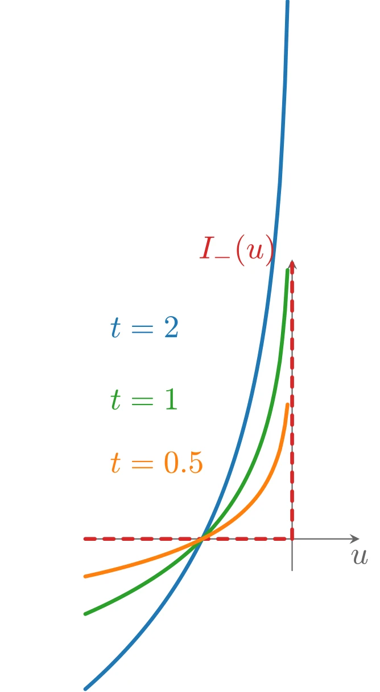
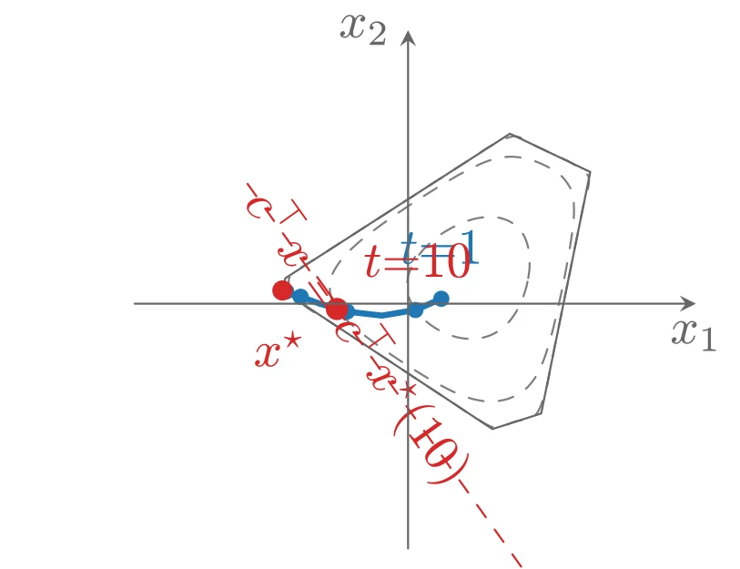
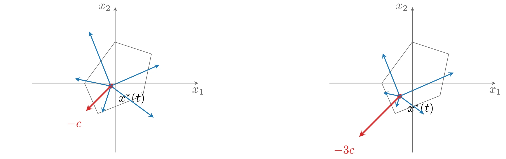

# 对数障碍函数与中心路径

我们的目标是把带不等式约束的问题近似地改写为可以用 Newton 方法求解的等式约束问题。第一步是把不等式约束隐式地并入目标函数，把原问题改写为

$$
\mathrm{minimize} \quad f_0(x) + \sum_{i=1}^m I_{-}(f_i(x)) \quad \mathrm{subject\ to} \quad Ax = b
$$

其中 $I_{-}: \mathbf{R} \rightarrow \mathbf{R}$ 是非正实数的示性函数：

$$
I_{-}(u) = \begin{cases}
    0 & u \leqslant 0 \\
    \infty & u > 0
\end{cases}
$$

该问题没有不等式约束，但其目标函数一般不可微，因此不能应用 Newton 方法。

## 对数障碍

障碍方法的基本思想是用函数

$$
\hat{I}_{-}(u) = -(1/t)\log(-u), \quad \operatorname{dom} \hat{I}_{-} = -\mathbf{R}_{++}
$$

近似示性函数 $I_{-}$，其中 $t > 0$ 是设定近似精度的参数。与 $I_{-}$ 一样，$\hat{I}_{-}$ 是凸的、非减的，且（按我们的约定）在 $u > 0$ 时取值 $\infty$；与 $I_{-}$ 不同的是，$\hat{I}_{-}$ 可微且是闭函数：当 $u \nearrow 0$ 时它趋于 $\infty$。$t$ 越大，近似越好。

把上式代入问题中，得到近似问题

$$
\mathrm{minimize} \quad f_0(x) + \sum_{i=1}^m -(1/t)\log(-f_i(x)) \quad \mathrm{subject\ to} \quad Ax = b
$$

其目标是凸的（因为 $-(1/t)\log(-u)$ 关于 $u$ 凸且递增）且可微；在适当的闭性条件下，可以用 Newton 方法求解它。函数

$$
\phi(x) = -\sum_{i=1}^m \log(-f_i(x)), \quad \operatorname{dom} \phi = \{x \mid f_i(x) < 0,\ i = 1, \cdots, m\}
$$

称为问题的**对数障碍**&#8203;（logarithmic barrier）或 **log 障碍**&#8203;（log barrier），其定义域是严格满足不等式约束的点集。无论正参数 $t$ 取何值，只要任何一个 $f_i(x) \rightarrow 0$，对数障碍就无界增长。

当然，上述问题只是原问题的近似，于是立刻产生一个问题：(近似问题的) 解能在多大程度上近似原问题的解？直觉以及我们很快会证实的结论是：参数 $t$ 越大近似越好。另一方面，当 $t$ 很大时，$f_0 + (1/t)\phi$ 很难用 Newton 方法极小化，因为其 Hessian 在可行集边界附近变化剧烈。解决这个问题的办法是求解**一序列**形如上述的问题，逐步增大参数 $t$（从而提高近似精度），并且每一次 Newton 极小化都从前一个 $t$ 对应的解出发。

为后面引用，注意对数障碍函数 $\phi$ 的梯度与 Hessian 为

$$
\nabla\phi(x) = \sum_{i=1}^m \frac{1}{-f_i(x)}\nabla f_i(x), \quad \nabla^2\phi(x) = \sum_{i=1}^m \frac{1}{f_i(x)^2}\nabla f_i(x)\nabla f_i(x)^{\top} + \sum_{i=1}^m \frac{1}{-f_i(x)}\nabla^2 f_i(x)
$$



上图由下面的 TikZ 代码编译而来：

```tex

  \definecolor{cblue}{RGB}{31,119,180}
  \definecolor{cred}{RGB}{214,39,40}
  \definecolor{cgreen}{RGB}{44,160,44}
  \definecolor{corange}{RGB}{255,127,14}
  \definecolor{cpurple}{RGB}{148,103,189}
  \definecolor{cbrown}{RGB}{140,86,75}
  \definecolor{cpink}{RGB}{227,119,194}
  \definecolor{cgray}{RGB}{127,127,127}
\begin{tikzpicture}[x=1cm,y=1cm,>=stealth,line cap=round,line join=round]
  \draw[->,color=black!60] (-2.3,0) -- (0.75,0) node[below] {$u$};
  \draw[->,color=black!60] (0,-0.35) -- (0,3.1) node[left] {};
  \draw[cred,very thick,dashed] (-2.3,0) -- (0,0);
  \draw[cred,very thick,dashed] (0,0) -- (0,3.1);
  \draw[cblue,very thick,domain=-2.3:-0.05,samples=80] plot (\x,{-2*ln(-\x)});
  \draw[cgreen,very thick,domain=-2.3:-0.05,samples=80] plot (\x,{-ln(-\x)});
  \draw[corange,very thick,domain=-2.3:-0.05,samples=80] plot (\x,{-0.5*ln(-\x)});
  \node[anchor=west,color=corange] at (-2.15,0.85) {$t=0.5$};
  \node[anchor=west,color=cgreen] at (-2.15,1.55) {$t=1$};
  \node[anchor=west,color=cblue] at (-2.15,2.35) {$t=2$};
  \node[anchor=south east,color=cred] at (-0.05,2.9) {$I_{-}(u)$};
\end{tikzpicture}
```

## 中心路径

下面更详细地考虑近似问题。把目标函数乘以 $t$（等价的问题，极小点相同），考虑

$$
\mathrm{minimize} \quad tf_0(x) + \phi(x) \quad \mathrm{subject\ to} \quad Ax = b
$$

假设该问题可以用 Newton 方法求解，特别地，对每个 $t > 0$ 都有唯一解（这个假设稍后讨论）。对 $t > 0$，定义 $x^{\star}(t)$ 为上述问题的解。问题的**中心路径**&#8203;（central path）定义为点集 $\{x^{\star}(t) \mid t > 0\}$，其中的点称为**中心点**&#8203;。中心路径上的点由以下充要条件刻画：$x^{\star}(t)$ 严格可行，即满足

$$
Ax^{\star}(t) = b, \quad f_i(x^{\star}(t)) < 0, \quad i = 1, \cdots, m
$$

且存在 $\hat{\nu} \in \mathbf{R}^p$ 使

$$
0 = t\nabla f_0(x^{\star}(t)) + \nabla\phi(x^{\star}(t)) + A^{\top}\hat{\nu} = t\nabla f_0(x^{\star}(t)) + \sum_{i=1}^m \frac{1}{-f_i(x^{\star}(t))}\nabla f_i(x^{\star}(t)) + A^{\top}\hat{\nu}
$$

### 例子：不等式形式线性规划

不等式形式 LP

$$
\mathrm{minimize} \quad c^{\top}x \quad \mathrm{subject\ to} \quad Ax \preceq b
$$

的对数障碍函数为

$$
\phi(x) = -\sum_{i=1}^m \log(b_i - a_i^{\top}x), \quad \operatorname{dom}\phi = \{x \mid Ax \prec b\}
$$

其中 $a_1^{\top}, \cdots, a_m^{\top}$ 是 $A$ 的行。梯度与 Hessian 可写为紧凑形式

$$
\nabla\phi(x) = A^{\top}d, \quad \nabla^2\phi(x) = A^{\top}\operatorname{diag}(d)^2A
$$

其中 $d \in \mathbf{R}^m$ 的元素为 $d_i = 1/(b_i - a_i^{\top}x)$。由于 $x$ 严格可行，$d \succ 0$，故 $\phi$ 的 Hessian 非奇异当且仅当 $A$ 满秩（$\operatorname{rank} A = n$）。中心性条件为

$$
tc + \sum_{i=1}^m \frac{1}{b_i - a_i^{\top}x}a_i = tc + A^{\top}d = 0
$$

它可以给出一个简单的几何解释：在中心路径上的点 $x^{\star}(t)$ 处，梯度 $\nabla\phi(x^{\star}(t))$（即 $\phi$ 过该点的水平集的法向）必须与 $-c$ 平行；换言之，超平面 $c^{\top}x = c^{\top}x^{\star}(t)$ 与 $\phi$ 过 $x^{\star}(t)$ 的水平集相切。



上图由下面的 TikZ 代码编译而来：

```tex

  \definecolor{cblue}{RGB}{31,119,180}
  \definecolor{cred}{RGB}{214,39,40}
  \definecolor{cgreen}{RGB}{44,160,44}
  \definecolor{corange}{RGB}{255,127,14}
  \definecolor{cpurple}{RGB}{148,103,189}
  \definecolor{cbrown}{RGB}{140,86,75}
  \definecolor{cpink}{RGB}{227,119,194}
  \definecolor{cgray}{RGB}{127,127,127}
\begin{tikzpicture}[x=1cm,y=1cm,>=stealth,line cap=round,line join=round]
  \draw[cgray,dashed] plot [smooth,tension=0.55] coordinates {(0.835,0.178) (0.843,0.234) (0.845,0.293) (0.841,0.356) (0.827,0.419) (0.801,0.480) (0.759,0.533) (0.705,0.572) (0.642,0.595) (0.576,0.603) (0.512,0.599) (0.452,0.587) (0.395,0.569) (0.343,0.547) (0.294,0.522) (0.248,0.495) (0.204,0.464) (0.162,0.429) (0.121,0.391) (0.082,0.347) (0.046,0.297) (0.017,0.240) (-0.002,0.178) (-0.006,0.112) (0.005,0.047) (0.032,-0.014) (0.070,-0.067) (0.115,-0.114) (0.165,-0.153) (0.218,-0.186) (0.274,-0.212) (0.332,-0.231) (0.391,-0.242) (0.452,-0.245) (0.511,-0.238) (0.569,-0.221) (0.622,-0.194) (0.668,-0.159) (0.708,-0.118) (0.741,-0.073) (0.768,-0.026) (0.791,0.023) (0.809,0.073) (0.824,0.124) (0.835,0.178)};
  \draw[cgray,dashed] plot [smooth,tension=0.55] coordinates {(1.086,0.178) (1.104,0.272) (1.122,0.375) (1.140,0.492) (1.153,0.629) (1.140,0.774) (1.066,0.887) (0.954,0.959) (0.830,1.006) (0.699,1.021) (0.569,0.996) (0.452,0.947) (0.349,0.893) (0.257,0.840) (0.173,0.788) (0.092,0.737) (0.012,0.685) (-0.070,0.630) (-0.157,0.569) (-0.252,0.499) (-0.356,0.415) (-0.461,0.309) (-0.536,0.178) (-0.533,0.036) (-0.452,-0.087) (-0.346,-0.186) (-0.241,-0.267) (-0.143,-0.337) (-0.049,-0.400) (0.042,-0.459) (0.135,-0.516) (0.232,-0.570) (0.337,-0.622) (0.452,-0.663) (0.575,-0.680) (0.698,-0.660) (0.808,-0.601) (0.890,-0.504) (0.943,-0.390) (0.979,-0.279) (1.007,-0.179) (1.029,-0.086) (1.049,0.002) (1.068,0.089) (1.086,0.178)};
  \draw[cgray,dashed] plot [smooth,tension=0.55] coordinates {(1.116,0.178) (1.136,0.276) (1.158,0.385) (1.184,0.512) (1.215,0.669) (1.256,0.875) (1.141,0.974) (1.005,1.039) (0.873,1.102) (0.741,1.163) (0.584,1.101) (0.452,1.016) (0.341,0.945) (0.245,0.883) (0.156,0.826) (0.071,0.771) (-0.015,0.716) (-0.103,0.659) (-0.200,0.597) (-0.310,0.526) (-0.443,0.441) (-0.612,0.331) (-0.826,0.178) (-0.741,0.006) (-0.555,-0.118) (-0.408,-0.215) (-0.285,-0.296) (-0.177,-0.367) (-0.078,-0.433) (0.018,-0.496) (0.115,-0.560) (0.215,-0.626) (0.326,-0.699) (0.452,-0.782) (0.601,-0.860) (0.744,-0.819) (0.886,-0.772) (0.956,-0.607) (0.990,-0.443) (1.016,-0.311) (1.039,-0.200) (1.059,-0.100) (1.078,-0.006) (1.097,0.085) (1.116,0.178)};
  \draw[black!60,thin] plot coordinates {(-0.873,0.092) (0.586,-0.871) (0.925,-0.763) (1.266,0.915) (0.708,1.181) (-0.853,0.177) (-0.873,0.092)};
  \draw[cblue,very thick] plot coordinates {(0.231,0.034) (0.051,-0.044) (-0.183,-0.083) (-0.424,-0.055) (-0.620,0.002) (-0.746,0.048) (-0.815,0.074) (-0.847,0.085) (-0.861,0.090)};
  \fill[cblue] (0.231,0.034) circle (1.6pt);
  \fill[cblue] (0.051,-0.044) circle (1.6pt);
  \fill[cblue] (-0.424,-0.055) circle (1.6pt);
  \fill[cblue] (-0.746,0.048) circle (1.6pt);
  \fill[cblue] (-0.847,0.085) circle (1.6pt);
  \fill[cred] (-0.494,-0.037) circle (2.2pt);
  \fill[cred] (-0.8731,0.0917) circle (2pt);
  \node[anchor=north,color=cred] at (-0.8931,-0.0683) {$x^{\star}$};
  \node[anchor=south,color=cblue] at (0.2314,0.1538) {$t{=}1$};
  \node[anchor=south west,color=cred] at (-0.4337,0.0630) {$t{=}10$};
  \draw[cred,dashed] (0.7858,-1.8267) -- (-1.1335,0.8578);
  \node[anchor=west,color=cred,rotate=305.6] at (-1.1335,0.8578) {$c^{\top}x = c^{\top}x^{\star}(10)$};
  \draw[->,color=black!60] (-1.9,0) -- (2.0,0) node[below] {$x_1$};
  \draw[->,color=black!60] (0,-1.7) -- (0,1.9) node[left] {$x_2$};
\end{tikzpicture}
```

## 中心路径上的对偶点

由中心性条件可以导出中心路径的一个重要性质：&#8203;**每个中心点都产生一个对偶可行点**&#8203;，从而给出最优值 $p^{\star}$ 的下界。更具体地，定义

$$
\lambda_i^{\star}(t) = -\frac{1}{t f_i(x^{\star}(t))}, \quad i = 1, \cdots, m, \quad \nu^{\star}(t) = \hat{\nu}/t
$$

可以断言 $(\lambda^{\star}(t), \nu^{\star}(t))$ 是对偶可行的。

首先，由于 $f_i(x^{\star}(t)) < 0$，显然 $\lambda^{\star}(t) \succ 0$。把中心性条件改写为

$$
\nabla f_0(x^{\star}(t)) + \sum_{i=1}^m \lambda_i^{\star}(t)\nabla f_i(x^{\star}(t)) + A^{\top}\nu^{\star}(t) = 0
$$

可见 $x^{\star}(t)$ 极小化 Lagrange 函数

$$
L(x, \lambda, \nu) = f_0(x) + \sum_{i=1}^m \lambda_if_i(x) + \nu^{\top}(Ax - b)
$$

（取 $\lambda = \lambda^{\star}(t)$，$\nu = \nu^{\star}(t)$），因此该对偶可行对的对偶函数值有限，且

$$
g(\lambda^{\star}(t), \nu^{\star}(t)) = f_0(x^{\star}(t)) + \sum_{i=1}^m \lambda_i^{\star}(t)f_i(x^{\star}(t)) + \nu^{\star}(t)^{\top}(Ax^{\star}(t) - b) = f_0(x^{\star}(t)) - m/t
$$

特别地，与 $x^{\star}(t)$ 和对偶可行对 $(\lambda^{\star}(t), \nu^{\star}(t))$ 相关联的对偶间隙就是 $m/t$。由此得到重要推论：

$$
f_0(x^{\star}(t)) - p^{\star} \leqslant m/t
$$

即 $x^{\star}(t)$ 至多 $m/t$-次优。这证实了直觉：当 $t \rightarrow \infty$ 时 $x^{\star}(t)$ 收敛于最优点。

**例子（不等式形式 LP 续）**&#8203;：不等式形式 LP 的对偶为

$$
\mathrm{maximize} \quad -b^{\top}\lambda \quad \mathrm{subject\ to} \quad A^{\top}\lambda + c = 0, \quad \lambda \succeq 0
$$

由中心性条件显然

$$
\lambda_i^{\star}(t) = \frac{1}{t(b_i - a_i^{\top}x^{\star}(t))}, \quad i = 1, \cdots, m
$$

对偶可行，其对偶目标值为 $-b^{\top}\lambda^{\star}(t) = c^{\top}x^{\star}(t) - m/t$。

## 通过 KKT 条件来理解

中心路径条件也可以解释为 KKT 最优性条件的连续变形。点 $x$ 等于 $x^{\star}(t)$ 当且仅当存在 $\lambda, \nu$ 使

$$
\begin{aligned}
    & Ax = b, \quad f_i(x) \leqslant 0, \quad i = 1, \cdots, m \\
    & \lambda \succeq 0 \\
    & \nabla f_0(x) + \sum_{i=1}^m \lambda_i\nabla f_i(x) + A^{\top}\nu = 0 \\
    & -\lambda_if_i(x) = 1/t, \quad i = 1, \cdots, m
\end{aligned}
$$

它与 KKT 条件的唯一差别在于：互补性条件 $-\lambda_if_i(x) = 0$ 被替换为 $-\lambda_if_i(x) = 1/t$。特别地，当 $t$ 很大时，$x^{\star}(t)$ 及相关的对偶点 $(\lambda^{\star}(t), \nu^{\star}(t))$“几乎”满足原问题的 KKT 最优性条件。

## 力场解释

中心路径还有一个简单的力学解释：把严格可行集 $\mathcal{C}$ 中运动的粒子看成受力场作用（为简单起见假设没有等式约束）。

把每个约束关联一个力：当粒子位于 $x$ 时，约束 $i$ 施加的力为

$$
F_i(x) = -\nabla(-\log(-f_i(x))) = \frac{1}{f_i(x)}\nabla f_i(x)
$$

约束产生的总力场的势就是对数障碍 $\phi$。当粒子向可行集边界运动时，它受到约束力的强烈排斥。

再设想粒子受到另一个力

$$
F_0(x) = -t\nabla f_0(x)
$$

该“目标力场”把粒子拉向负梯度方向，即朝 $f_0$ 变小的方向；参数 $t$ 是目标力相对于约束力的缩放。

中心点 $x^{\star}(t)$ 就是约束力恰好与粒子所受目标力平衡的位置。当参数 $t$ 增大时，粒子被更强地拉向最优点，但它始终被障碍势（在接近边界时变为无穷）束缚在 $\mathcal{C}$ 内。

**例子（不等式形式 LP 续）**&#8203;：LP 第 $i$ 个约束对应的力为

$$
F_i(x) = \frac{-a_i}{b_i - a_i^{\top}x}
$$

它指向约束超平面 $H_i = \{x \mid a_i^{\top}x = b_i\}$ 指向内部的法向，大小与到 $H_i$ 的距离成反比：

$$
\|F_i(x)\|_2 = \frac{\|a_i\|_2}{b_i - a_i^{\top}x} = \frac{1}{\operatorname{dist}(x, H_i)}
$$

换言之，每个约束超平面都有一个大小与到该超平面的距离成反比的**排斥力**&#8203;。$tc^{\top}x$ 是常力 $-tc$ 的势：这个“目标力”把粒子推向低成本的方向。因此 $x^{\star}(t)$ 是粒子在反比距离约束力与目标力 $-tc$ 共同作用下的平衡位置。$t$ 很大时，粒子几乎被推到最优点——强大的目标力由（因为靠近可行边界而变得很大的）约束反力平衡。



上图由下面的 TikZ 代码编译而来：

```tex

  \definecolor{cblue}{RGB}{31,119,180}
  \definecolor{cred}{RGB}{214,39,40}
  \definecolor{cgreen}{RGB}{44,160,44}
  \definecolor{corange}{RGB}{255,127,14}
  \definecolor{cpurple}{RGB}{148,103,189}
  \definecolor{cbrown}{RGB}{140,86,75}
  \definecolor{cpink}{RGB}{227,119,194}
  \definecolor{cgray}{RGB}{127,127,127}
\begin{tikzpicture}[x=1cm,y=1cm,>=stealth,line cap=round,line join=round]
  \begin{scope}[xshift=0cm]
  \draw[black!60,thin] plot coordinates {(-0.888,-0.001) (-0.504,-0.877) (0.797,-0.358) (1.047,0.847) (-0.007,1.193) (-0.888,-0.001)};
    \fill[cred] (-0.1258,-0.0817) circle (2pt);
    \node[anchor=north west] at (-0.0258,-0.1417) {$x^{\star}(t)$};
    \draw[->,cblue,thick] (-0.1258,-0.0817) -- (-1.1633,0.1331);
    \draw[->,cblue,thick] (-0.1258,-0.0817) -- (-0.3798,-0.8560);
    \draw[->,cblue,thick] (-0.1258,-0.0817) -- (1.1122,-0.9945);
    \draw[->,cblue,thick] (-0.1258,-0.0817) -- (1.2747,0.5314);
    \draw[->,cblue,thick] (-0.1258,-0.0817) -- (-0.7547,1.4977);
    \draw[->,cred,very thick] (-0.1258,-0.0817) -- (-0.8441,-0.8022) node[anchor=north east] at (-0.8441,-0.9222) {$-c$};
    \draw[->,color=black!60] (-2.4,0) -- (2.4,0) node[below] {$x_1$};
    \draw[->,color=black!60] (0,-2.0) -- (0,2.2) node[left] {$x_2$};
  \end{scope}
  \begin{scope}[xshift=8.6cm]
  \draw[black!60,thin] plot coordinates {(-0.888,-0.001) (-0.504,-0.877) (0.797,-0.358) (1.047,0.847) (-0.007,1.193) (-0.888,-0.001)};
    \fill[cred] (-0.3677,-0.3749) circle (2pt);
    \node[anchor=north west] at (-0.2677,-0.4349) {$x^{\star}(t)$};
    \draw[->,cblue,thick] (-0.3677,-0.3749) -- (-0.8451,-0.2761);
    \draw[->,cblue,thick] (-0.3677,-0.3749) -- (-0.4756,-0.7038);
    \draw[->,cblue,thick] (-0.3677,-0.3749) -- (0.3291,-0.8887);
    \draw[->,cblue,thick] (-0.3677,-0.3749) -- (1.1896,0.3069);
    \draw[->,cblue,thick] (-0.3677,-0.3749) -- (-0.8615,0.8654);
    \draw[->,cred,very thick] (-0.3677,-0.3749) -- (-1.5426,-1.5534) node[anchor=north east] at (-1.5426,-1.6734) {$-3c$};
    \draw[->,color=black!60] (-2.4,0) -- (2.4,0) node[below] {$x_1$};
    \draw[->,color=black!60] (0,-2.0) -- (0,2.2) node[left] {$x_2$};
  \end{scope}
\end{tikzpicture}
```
