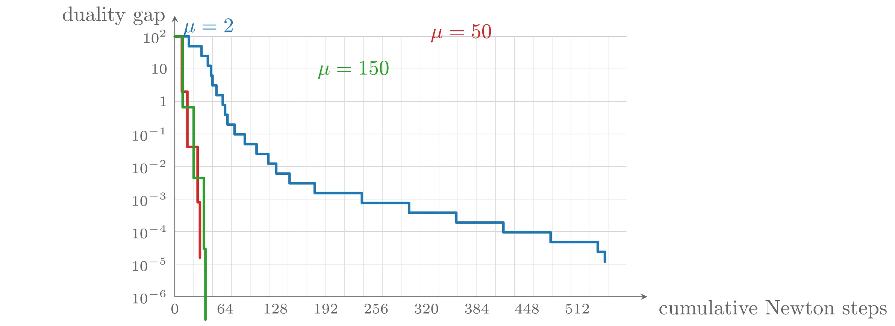
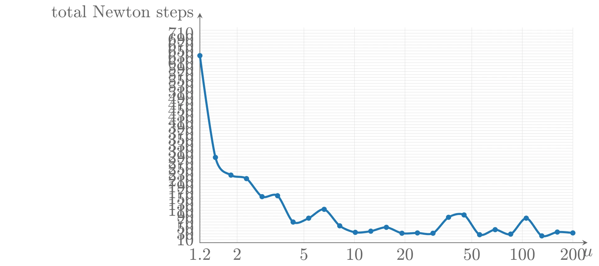
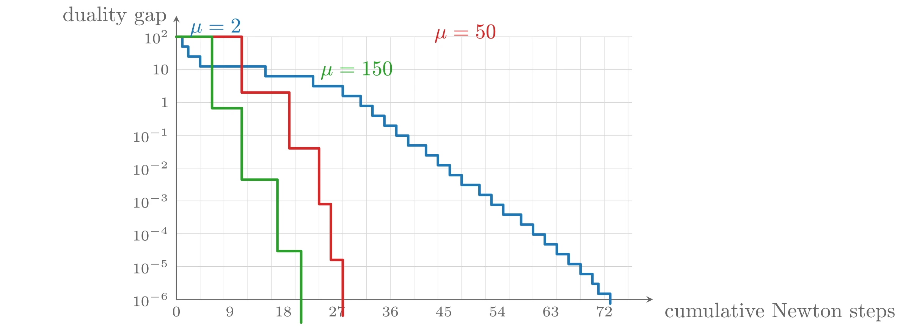
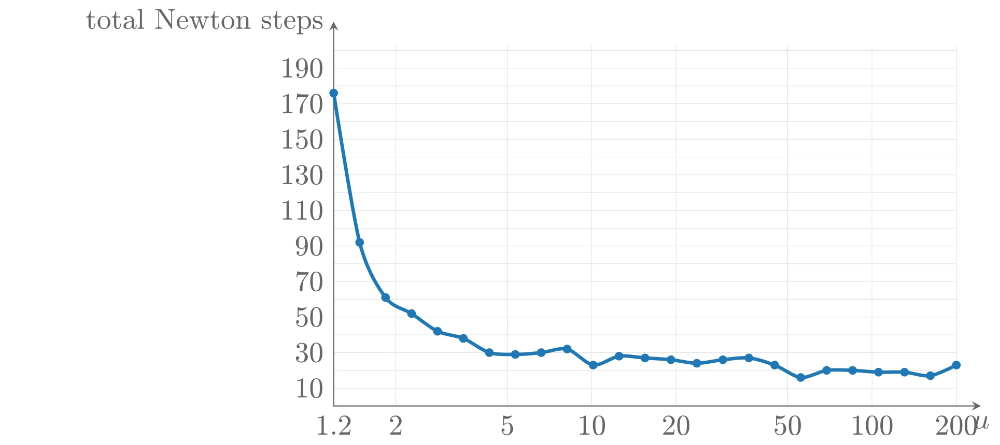
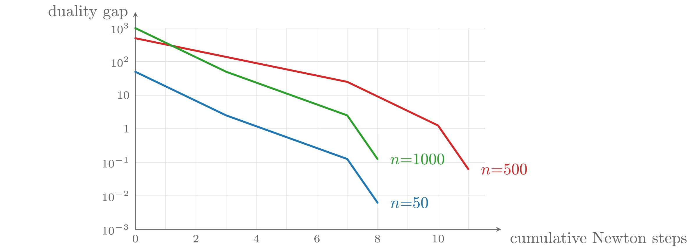
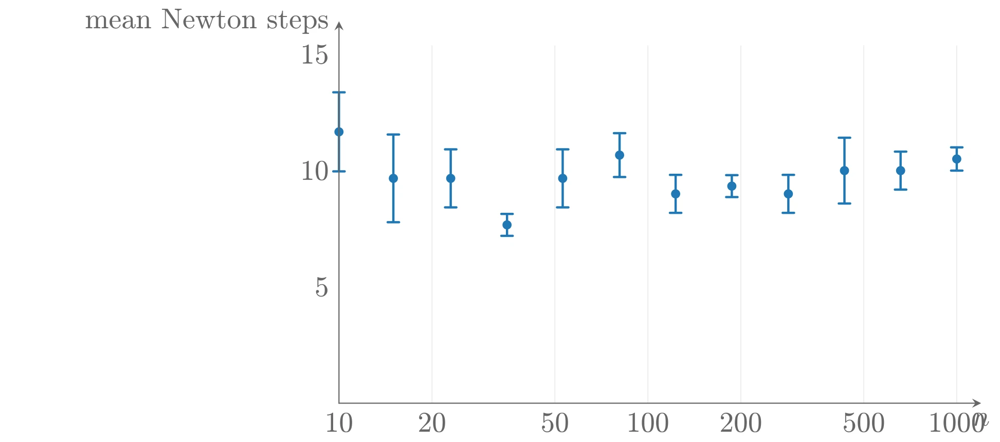

# 广义不等式问题

本节说明障碍方法如何扩展到广义不等式问题。考虑问题

$$
\begin{aligned}
    \mathrm{minimize} \quad & f_0(x) \\
    \mathrm{subject\ to} \quad & f_i(x) \preceq_{K_i} 0, \quad i = 1, \cdots, m \\
    & Ax = b
\end{aligned}
$$

其中 $f_0: \mathbf{R}^n \rightarrow \mathbf{R}$ 凸，$f_i: \mathbf{R}^n \rightarrow \mathbf{R}^{k_i}$ 是 $K_i$-凸的，$K_i \subseteq \mathbf{R}^{k_i}$ 是正常锥。与标量情形一样，假设 $f_i$ 二阶连续可微，$A \in \mathbf{R}^{p \times n}$ 且 $\operatorname{rank} A = p$，问题可解。

该问题的 KKT 条件为

$$
\begin{aligned}
    & Ax^{\star} = b \\
    & f_i(x^{\star}) \preceq_{K_i} 0, \quad i = 1, \cdots, m \\
    & \lambda_i^{\star} \succeq_{K_i^{*}} 0, \quad i = 1, \cdots, m \\
    & \nabla f_0(x^{\star}) + \sum_{i=1}^m Df_i(x^{\star})^{\top}\lambda_i^{\star} + A^{\top}\nu^{\star} = 0 \\
    & \lambda_i^{\star\top} f_i(x^{\star}) = 0, \quad i = 1, \cdots, m
\end{aligned}
$$

其中 $Df_i(x^{\star}) \in \mathbf{R}^{k_i \times n}$ 是 $f_i$ 在 $x^{\star}$ 处的导数。假设问题严格可行，则 KKT 条件是 $x^{\star}$ 最优性的充要条件。

该方法的展开过程与标量约束的情形完全平行：一旦发展出适用于一般正常锥的对数函数的推广，就可以定义问题的对数障碍函数；从那一点开始，后面的展开与标量情形本质相同。特别地，中心路径、障碍方法与复杂度分析都非常相似。

## 对数障碍与中心路径

### 正常锥的广义对数

我们首先定义正常锥 $K \subseteq \mathbf{R}^q$ 的对数 $\log x$ 的类似物。称 $\psi: \mathbf{R}^q \rightarrow \mathbf{R}$ 为 $K$ 的**广义对数**&#8203;（generalized logarithm），如果：

- $\psi$ 是凹的、闭的、二阶连续可微的，$\operatorname{dom} \psi = \operatorname{int} K$，且对 $y \in \operatorname{int} K$ 有 $\nabla^2\psi(y) \prec 0$；
- 存在常数 $\theta > 0$，使得对所有 $y \succ_K 0$ 和所有 $s > 0$，有 $\psi(sy) = \psi(y) + \theta\log s$。

换言之，$\psi$ 沿 $K$ 内的任何射线表现得像对数。我们称常数 $\theta$ 为 $\psi$ 的**次数**&#8203;（degree）（因为 $\exp\psi$ 是 $\theta$ 次齐次函数）。注意广义对数在相差一个加性常数的意义下不唯一：若 $\psi$ 是 $K$ 的广义对数，则 $\psi + a$（$a \in \mathbf{R}$）也是。普通对数当然是 $\mathbf{R}_+$ 的广义对数。

我们将使用任何广义对数都满足的两个性质：若 $y \succ_K 0$，则

$$
\nabla\psi(y) \succ_{K^{*}} 0
$$

（这意味着 $\psi$ 是 $K$-递增的），以及

$$
y^{\top}\nabla\psi(y) = \theta
$$

第二个性质对 $\psi(sy) = \psi(y) + \theta\log s$ 关于 $s$ 求导立即可得；第一个性质的证明见教材习题 11.15。

**例子：非负象限**&#8203;。$\psi(x) = \sum_{i=1}^n \log x_i$ 是 $\mathbf{R}^n_+$ 的广义对数，次数为 $n$。对 $x \succ 0$，$\nabla\psi(x) = (1/x_1, \cdots, 1/x_n)$，故 $\nabla\psi(x) \succ 0$，且 $x^{\top}\nabla\psi(x) = n$。

**例子：二阶锥**&#8203;。函数

$$
\psi(x) = \log\left(x_{n+1}^2 - \sum_{i=1}^n x_i^2\right)
$$

是二阶锥

$$
K = \left\{x \in \mathbf{R}^{n+1} \,\middle|\, \left(\sum_{i=1}^n x_i^2\right)^{1/2} \leqslant x_{n+1}\right\}
$$

的广义对数，次数为 2。$\psi$ 在 $\operatorname{int} K$ 内点 $x$ 处的梯度为

$$
\frac{\partial\psi(x)}{\partial x_j} = \frac{-2x_j}{x_{n+1}^2 - \sum_{i=1}^n x_i^2}\ (j = 1, \cdots, n), \quad \frac{\partial\psi(x)}{\partial x_{n+1}} = \frac{2x_{n+1}}{x_{n+1}^2 - \sum_{i=1}^n x_i^2}
$$

恒等式 $\nabla\psi(x) \in \operatorname{int} K^{*} = \operatorname{int} K$ 与 $x^{\top}\nabla\psi(x) = 2$ 容易验证。

**例子：半正定锥**&#8203;。$\psi(X) = \log\det X$ 是 $\mathbf{S}^p_+$ 的广义对数。次数为 $p$，因为 $\log\det(sX) = \log\det X + p\log s$（$s > 0$）。$\psi$ 在 $X \in \mathbf{S}^p_{++}$ 处的梯度为 $\nabla\psi(X) = X^{-1}$，因此 $\nabla\psi(X) = X^{-1} \succ 0$，且 $X$ 与 $\nabla\psi(X)$ 的内积为 $\operatorname{tr}(XX^{-1}) = p$。

### 广义不等式的对数障碍函数

回到广义不等式问题。设 $\psi_1, \cdots, \psi_m$ 分别是锥 $K_1, \cdots, K_m$ 的广义对数，次数为 $\theta_1, \cdots, \theta_m$。定义问题的**对数障碍函数**为

$$
\phi(x) = -\sum_{i=1}^m \psi_i(-f_i(x)), \quad \operatorname{dom}\phi = \{x \mid f_i(x) \prec_{K_i} 0,\ i = 1, \cdots, m\}
$$

$\phi$ 的凸性来自：$\psi_i$ 是 $K_i$-递增的，而 $f_i$ 是 $K_i$-凸的（见凸函数一章的复合规则）。

### 中心路径

下一步定义问题的中心路径。定义中心点 $x^{\star}(t)$（$t \geqslant 0$）为 $tf_0 + \phi$ 在约束 $Ax = b$ 下的极小点，即问题

$$
\mathrm{minimize} \quad tf_0(x) - \sum_{i=1}^m \psi_i(-f_i(x)) \quad \mathrm{subject\ to} \quad Ax = b
$$

的解（假设极小点存在且唯一）。中心点由最优性条件

$$
t\nabla f_0(x) + \nabla\phi(x) + A^{\top}\nu = t\nabla f_0(x) + \sum_{i=1}^m Df_i(x)^{\top}\nabla\psi_i(-f_i(x)) + A^{\top}\nu = 0
$$

刻画（对某个 $\nu \in \mathbf{R}^p$，$Df_i(x)$ 为 $f_i$ 在 $x$ 处的导数）。

### 中心路径上的对偶点

与标量情形一样，中心路径上的点给出原问题的对偶可行点。对 $i = 1, \cdots, m$，定义

$$
\lambda_i^{\star}(t) = \frac{1}{t}\nabla\psi_i(-f_i(x^{\star}(t)))
$$

并令 $\nu^{\star}(t) = \nu/t$（$\nu$ 为中心性条件中的对偶变量）。可以证明 $\lambda_1^{\star}(t), \cdots, \lambda_m^{\star}(t)$ 连同 $\nu^{\star}(t)$ 对原问题对偶可行。

首先，由广义对数的单调性性质，$\lambda_i^{\star}(t) \succ_{K_i^{*}} 0$。其次，由中心性条件可知 Lagrange 函数

$$
L(x, \lambda^{\star}(t), \nu^{\star}(t)) = f_0(x) + \sum_{i=1}^m \lambda_i^{\star}(t)^{\top}f_i(x) + \nu^{\star}(t)^{\top}(Ax - b)
$$

在 $x = x^{\star}(t)$ 处取极小，因此对偶函数值为

$$
g(\lambda^{\star}(t), \nu^{\star}(t)) = f_0(x^{\star}(t)) + \sum_{i=1}^m \lambda_i^{\star}(t)^{\top}f_i(x^{\star}(t)) + \nu^{\star}(t)^{\top}(Ax^{\star}(t) - b) = f_0(x^{\star}(t)) - \frac{1}{t}\sum_{i=1}^m \theta_i
$$

最后一行利用了 $y^{\top}\nabla\psi_i(y) = \theta_i$（$y \succ_{K_i} 0$），从而

$$
\lambda_i^{\star}(t)^{\top}f_i(x^{\star}(t)) = -\theta_i/t, \quad i = 1, \cdots, m
$$

于是若定义

$$
\theta = \sum_{i=1}^m \theta_i
$$

则原始可行点 $x^{\star}(t)$ 与对偶可行点 $(\lambda^{\star}(t), \nu^{\star}(t))$ 的对偶间隙为 $\theta/t$。这与标量情形一样，只是用 $\theta$（各锥广义对数的次数之和）代替了 $m$（不等式个数）。

**例子：二阶锥规划**&#8203;。考虑变量 $x \in \mathbf{R}^n$ 的 SOCP：

$$
\mathrm{minimize} \quad f^{\top}x \quad \mathrm{subject\ to} \quad \|A_ix + b_i\|_2 \leqslant c_i^{\top}x + d_i, \quad i = 1, \cdots, m
$$

（$A_i \in \mathbf{R}^{n_i \times n}$）。如上所述，$\psi(y) = \log(y_{p+1}^2 - \sum_{i=1}^p y_i^2)$ 是 $\mathbf{R}^{p+1}$ 中二阶锥的广义对数，次数为 2，因此相应的对数障碍函数为

$$
\phi(x) = -\sum_{i=1}^m \log\left((c_i^{\top}x + d_i)^2 - \|A_ix + b_i\|_2^2\right), \quad \operatorname{dom}\phi = \{x \mid \|A_ix + b_i\|_2 < c_i^{\top}x + d_i,\ i = 1, \cdots, m\}
$$

中心路径上的最优性条件为 $tf + \nabla\phi(x^{\star}(t)) = 0$，由此可得

$$
z_i^{\star}(t) = -\frac{2}{t\alpha_i}(A_ix^{\star}(t) + b_i), \quad w_i^{\star}(t) = \frac{2}{t\alpha_i}(c_i^{\top}x^{\star}(t) + d_i), \quad i = 1, \cdots, m
$$

（其中 $\alpha_i = (c_i^{\top}x^{\star}(t) + d_i)^2 - \|A_ix^{\star}(t) + b_i\|_2^2$）在对偶问题

$$
\mathrm{maximize} \quad -\sum_{i=1}^m (b_i^{\top}z_i + d_iw_i) \quad \mathrm{subject\ to} \quad \sum_{i=1}^m (A_i^{\top}z_i + c_iw_i) = f, \quad \|z_i\|_2 \leqslant w_i,\ i = 1, \cdots, m
$$

中严格可行。与 $x^{\star}(t)$ 和 $(z^{\star}(t), w^{\star}(t))$ 相关联的对偶间隙为

$$
\sum_{i=1}^m \left((A_ix^{\star}(t) + b_i)^{\top}z_i^{\star}(t) + (c_i^{\top}x^{\star}(t) + d_i)w_i^{\star}(t)\right) = \frac{2m}{t}
$$

与一般公式 $\theta/t$ 一致（$\theta_i = 2$）。

**例子：不等式形式的半定规划**&#8203;。考虑变量 $x \in \mathbf{R}^n$ 的 SDP：

$$
\mathrm{minimize} \quad c^{\top}x \quad \mathrm{subject\ to} \quad F(x) = x_1F_1 + \cdots + x_nF_n + G \preceq 0
$$

（$G, F_1, \cdots, F_n \in \mathbf{S}^p$）。其对偶问题为

$$
\mathrm{maximize} \quad \operatorname{tr}(GZ) \quad \mathrm{subject\ to} \quad \operatorname{tr}(F_iZ) + c_i = 0,\ i = 1, \cdots, n, \quad Z \succeq 0
$$

用 $\log\det X$ 作为半正定锥的广义对数，原始问题的对数障碍函数为 $\phi(x) = \log\det(-F(x)^{-1})$（$\operatorname{dom}\phi = \{x \mid F(x) \prec 0\}$）。对严格可行的 $x$，$\phi$ 的梯度为

$$
\frac{\partial\phi(x)}{\partial x_i} = \operatorname{tr}(-F(x)^{-1}F_i), \quad i = 1, \cdots, n
$$

由此得到刻画中心点的最优性条件：

$$
tc_i + \operatorname{tr}(-F(x^{\star}(t))^{-1}F_i) = 0, \quad i = 1, \cdots, n
$$

因此矩阵

$$
Z^{\star}(t) = \frac{1}{t}(-F(x^{\star}(t)))^{-1}
$$

严格对偶可行，与 $x^{\star}(t)$ 和 $Z^{\star}(t)$ 相关联的对偶间隙为 $p/t$。

## 障碍方法

我们已经看到中心路径的关键性质如何推广到广义不等式问题：

- 计算中心路径上的一点即在等式约束下极小化一个二阶可微的凸函数（可以用 Newton 方法完成）。
- 与中心点 $x^{\star}(t)$ 相关联的对偶可行点 $(\lambda^{\star}(t), \nu^{\star}(t))$ 的对偶间隙为 $\theta/t$。特别地，$x^{\star}(t)$ 至多 $\theta/t$-次优。

这意味着可以按完全相同的方式（与标量情形的障碍方法一样）求解广义不等式问题。从 $x^{\star}(t^{(0)})$ 出发计算对偶间隙为 $\epsilon$ 的中心点所需的外层迭代（中心点步）次数等于

$$
\left\lceil \frac{\log(\theta/(t^{(0)}\epsilon))}{\log\mu} \right\rceil
$$

外加一次初始中心点步。与标量情形结果的唯一差别是 $\theta$ 代替了 $m$。

**阶段 I 与可行性问题**&#8203;：阶段 I 方法可以直接推广到广义不等式问题。给定 $K_i$-正的向量 $e_i \succ_{K_i} 0$，为判定等式与广义不等式组

$$
f_1(x) \preceq_{K_1} 0,\ \cdots,\ f_L(x) \preceq_{K_m} 0, \quad Ax = b
$$

的可行性，求解问题

$$
\mathrm{minimize} \quad s \quad \mathrm{subject\ to} \quad f_i(x) \preceq_{K_i} se_i,\ i = 1, \cdots, m, \quad Ax = b
$$

变量为 $x$ 与 $s \in \mathbf{R}$。其最优值 $\bar{p}^{\star}$ 判定等式与广义不等式组的可行性，方式与普通不等式完全一样。当 $\bar{p}^{\star}$ 为正时，任何目标为正的对偶可行点都给出证明该等式与广义不等式组不可行的 alternative（备选解）。

## 例子

### 一个小型 SOCP

求解 SOCP

$$
\mathrm{minimize} \quad f^{\top}x \quad \mathrm{subject\ to} \quad \|A_ix + b_i\|_2 \leqslant c_i^{\top}x + d_i, \quad i = 1, \cdots, m
$$

其中 $x \in \mathbf{R}^{50}$，$m = 50$，$A_i \in \mathbf{R}^{5 \times 50}$。问题实例随机生成，严格原始与对偶可行，$p^{\star} = 1$。初始点在中心路径上，对偶间隙 100。

用障碍函数 $\phi(x) = -\sum_{i=1}^m \log\left((c_i^{\top}x + d_i)^2 - \|A_ix + b_i\|_2^2\right)$ 求解；中心点问题用 Newton 方法（参数与前面例子相同：$\alpha = 0.01$，$\beta = 0.5$，终止准则 $\lambda(x)^2/2 \leqslant 10^{-5}$）。对偶间隙随累计 Newton 步数的曲线与 LP、GP 的非常相似：每次中心点步所需 Newton 步数近似为常数，对偶间隙近似线性收敛。$\mu$ 至少为 10 左右时，$\mu$ 的取值对总步数影响不大；与 LP 和 GP 一样，$\mu$ 取 10 到 100 的合理值时总 Newton 步数约 30。



上图由下面的 TikZ 代码编译而来：

```tex

  \definecolor{cblue}{RGB}{31,119,180}
  \definecolor{cred}{RGB}{214,39,40}
  \definecolor{cgreen}{RGB}{44,160,44}
  \definecolor{corange}{RGB}{255,127,14}
  \definecolor{cpurple}{RGB}{148,103,189}
  \definecolor{cbrown}{RGB}{140,86,75}
  \definecolor{cpink}{RGB}{227,119,194}
  \definecolor{cgray}{RGB}{127,127,127}
\begin{tikzpicture}[x=1cm,y=1cm,>=stealth,line cap=round,line join=round]
  \draw[color=black!25,very thin] (0.0000,0.0000) -- (7.6000,0.0000) (0.0000,0.5500) -- (7.6000,0.5500) (0.0000,1.1000) -- (7.6000,1.1000) (0.0000,1.6500) -- (7.6000,1.6500) (0.0000,2.2000) -- (7.6000,2.2000) (0.0000,2.7500) -- (7.6000,2.7500) (0.0000,3.3000) -- (7.6000,3.3000) (0.0000,3.8500) -- (7.6000,3.8500) (0.0000,4.4000) -- (7.6000,4.4000);
  \draw[color=black!15,very thin] (0.0000,0.0000) -- (0.0000,4.4000) (0.3176,0.0000) -- (0.3176,4.4000) (0.6352,0.0000) -- (0.6352,4.4000) (0.9527,0.0000) -- (0.9527,4.4000) (1.2703,0.0000) -- (1.2703,4.4000) (1.5879,0.0000) -- (1.5879,4.4000) (1.9055,0.0000) -- (1.9055,4.4000) (2.2230,0.0000) -- (2.2230,4.4000) (2.5406,0.0000) -- (2.5406,4.4000) (2.8582,0.0000) -- (2.8582,4.4000) (3.1758,0.0000) -- (3.1758,4.4000) (3.4933,0.0000) -- (3.4933,4.4000) (3.8109,0.0000) -- (3.8109,4.4000) (4.1285,0.0000) -- (4.1285,4.4000) (4.4461,0.0000) -- (4.4461,4.4000) (4.7636,0.0000) -- (4.7636,4.4000) (5.0812,0.0000) -- (5.0812,4.4000) (5.3988,0.0000) -- (5.3988,4.4000) (5.7164,0.0000) -- (5.7164,4.4000) (6.0340,0.0000) -- (6.0340,4.4000) (6.3515,0.0000) -- (6.3515,4.4000) (6.6691,0.0000) -- (6.6691,4.4000) (6.9867,0.0000) -- (6.9867,4.4000) (7.3043,0.0000) -- (7.3043,4.4000);
  \draw[->,color=black!60] (0.0000,0.0000) -- (7.9500,0.0000) node[anchor=west,xshift=2pt,yshift=-6pt] {cumulative Newton steps};
  \draw[->,color=black!60] (0.0000,0.0000) -- (0.0000,4.7500) node[left=1pt] {duality gap};
  \node[left,font=\scriptsize,color=black!60] at (0.0000,0.0000) {$10^{-6}$};
  \node[left,font=\scriptsize,color=black!60] at (0.0000,0.5500) {$10^{-5}$};
  \node[left,font=\scriptsize,color=black!60] at (0.0000,1.1000) {$10^{-4}$};
  \node[left,font=\scriptsize,color=black!60] at (0.0000,1.6500) {$10^{-3}$};
  \node[left,font=\scriptsize,color=black!60] at (0.0000,2.2000) {$10^{-2}$};
  \node[left,font=\scriptsize,color=black!60] at (0.0000,2.7500) {$10^{-1}$};
  \node[left,font=\scriptsize,color=black!60] at (0.0000,3.3000) {1};
  \node[left,font=\scriptsize,color=black!60] at (0.0000,3.8500) {$10$};
  \node[left,font=\scriptsize,color=black!60] at (0.0000,4.4000) {$10^{2}$};
  \node[below,font=\scriptsize,color=black!60] at (0.0000,0.0000) {0};
  \node[below,font=\scriptsize,color=black!60] at (0.8469,0.0000) {64};
  \node[below,font=\scriptsize,color=black!60] at (1.6937,0.0000) {128};
  \node[below,font=\scriptsize,color=black!60] at (2.5406,0.0000) {192};
  \node[below,font=\scriptsize,color=black!60] at (3.3875,0.0000) {256};
  \node[below,font=\scriptsize,color=black!60] at (4.2344,0.0000) {320};
  \node[below,font=\scriptsize,color=black!60] at (5.0812,0.0000) {384};
  \node[below,font=\scriptsize,color=black!60] at (5.9281,0.0000) {448};
  \node[below,font=\scriptsize,color=black!60] at (6.7750,0.0000) {512};
  \draw[cblue,very thick] plot coordinates {(0.000,4.400) (0.238,4.400) (0.238,4.234) (0.450,4.234) (0.450,4.069) (0.556,4.069) (0.556,3.903) (0.609,3.903) (0.609,3.738) (0.635,3.738) (0.635,3.572) (0.701,3.572) (0.701,3.407) (0.807,3.407) (0.807,3.241) (0.847,3.241) (0.847,3.075) (0.887,3.075) (0.887,2.910) (1.006,2.910) (1.006,2.744) (1.178,2.744) (1.178,2.579) (1.376,2.579) (1.376,2.413) (1.575,2.413) (1.575,2.248) (1.707,2.248) (1.707,2.082) (1.932,2.082) (1.932,1.917) (2.355,1.917) (2.355,1.751) (3.149,1.751) (3.149,1.585) (3.943,1.585) (3.943,1.420) (4.737,1.420) (4.737,1.254) (5.531,1.254) (5.531,1.089) (6.325,1.089) (6.325,0.923) (7.119,0.923) (7.119,0.758) (7.238,0.758) (7.238,0.592)};
  \draw[cred,very thick] plot coordinates {(0.000,4.400) (0.119,4.400) (0.119,3.466) (0.212,3.466) (0.212,2.531) (0.384,2.531) (0.384,1.597) (0.423,1.597) (0.423,0.662)};
  \draw[cgreen,very thick] plot coordinates {(0.000,4.400) (0.132,4.400) (0.132,3.203) (0.318,3.203) (0.318,2.006) (0.490,2.006) (0.490,0.809) (0.516,0.809) (0.516,-0.387)};
  \node[anchor=south west,color=cblue] at (0.0132,4.2780) {$\mu=2$};
  \node[anchor=south west,color=cred] at (4.1800,4.1811) {$\mu=50$};
  \node[anchor=south west,color=cgreen] at (2.2800,3.5624) {$\mu=150$};
\end{tikzpicture}
```


上图由下面的 TikZ 代码编译而来：

```tex

  \definecolor{cblue}{RGB}{31,119,180}
  \definecolor{cred}{RGB}{214,39,40}
  \definecolor{cgreen}{RGB}{44,160,44}
  \definecolor{corange}{RGB}{255,127,14}
  \definecolor{cpurple}{RGB}{148,103,189}
  \definecolor{cbrown}{RGB}{140,86,75}
  \definecolor{cpink}{RGB}{227,119,194}
  \definecolor{cgray}{RGB}{127,127,127}
\begin{tikzpicture}[x=1cm,y=1cm,>=stealth,line cap=round,line join=round]
  \draw[color=black!12,very thin] (0.0000,0) -- (0.0000,4.4) (0.7589,0) -- (0.7589,4.4) (2.1200,0) -- (2.1200,4.4) (3.1497,0) -- (3.1497,4.4) (4.1794,0) -- (4.1794,4.4) (5.5406,0) -- (5.5406,4.4) (6.5703,0) -- (6.5703,4.4) (7.6000,0) -- (7.6000,4.4) (0,0.0603) -- (7.6,0.0603) (0,0.1207) -- (7.6,0.1207) (0,0.1810) -- (7.6,0.1810) (0,0.2414) -- (7.6,0.2414) (0,0.3017) -- (7.6,0.3017) (0,0.3621) -- (7.6,0.3621) (0,0.4224) -- (7.6,0.4224) (0,0.4828) -- (7.6,0.4828) (0,0.5431) -- (7.6,0.5431) (0,0.6035) -- (7.6,0.6035) (0,0.6638) -- (7.6,0.6638) (0,0.7242) -- (7.6,0.7242) (0,0.7845) -- (7.6,0.7845) (0,0.8449) -- (7.6,0.8449) (0,0.9052) -- (7.6,0.9052) (0,0.9656) -- (7.6,0.9656) (0,1.0259) -- (7.6,1.0259) (0,1.0863) -- (7.6,1.0863) (0,1.1466) -- (7.6,1.1466) (0,1.2070) -- (7.6,1.2070) (0,1.2673) -- (7.6,1.2673) (0,1.3277) -- (7.6,1.3277) (0,1.3880) -- (7.6,1.3880) (0,1.4484) -- (7.6,1.4484) (0,1.5087) -- (7.6,1.5087) (0,1.5691) -- (7.6,1.5691) (0,1.6294) -- (7.6,1.6294) (0,1.6898) -- (7.6,1.6898) (0,1.7501) -- (7.6,1.7501) (0,1.8105) -- (7.6,1.8105) (0,1.8708) -- (7.6,1.8708) (0,1.9311) -- (7.6,1.9311) (0,1.9915) -- (7.6,1.9915) (0,2.0518) -- (7.6,2.0518) (0,2.1122) -- (7.6,2.1122) (0,2.1725) -- (7.6,2.1725) (0,2.2329) -- (7.6,2.2329) (0,2.2932) -- (7.6,2.2932) (0,2.3536) -- (7.6,2.3536) (0,2.4139) -- (7.6,2.4139) (0,2.4743) -- (7.6,2.4743) (0,2.5346) -- (7.6,2.5346) (0,2.5950) -- (7.6,2.5950) (0,2.6553) -- (7.6,2.6553) (0,2.7157) -- (7.6,2.7157) (0,2.7760) -- (7.6,2.7760) (0,2.8364) -- (7.6,2.8364) (0,2.8967) -- (7.6,2.8967) (0,2.9571) -- (7.6,2.9571) (0,3.0174) -- (7.6,3.0174) (0,3.0778) -- (7.6,3.0778) (0,3.1381) -- (7.6,3.1381) (0,3.1985) -- (7.6,3.1985) (0,3.2588) -- (7.6,3.2588) (0,3.3192) -- (7.6,3.3192) (0,3.3795) -- (7.6,3.3795) (0,3.4399) -- (7.6,3.4399) (0,3.5002) -- (7.6,3.5002) (0,3.5606) -- (7.6,3.5606) (0,3.6209) -- (7.6,3.6209) (0,3.6813) -- (7.6,3.6813) (0,3.7416) -- (7.6,3.7416) (0,3.8019) -- (7.6,3.8019) (0,3.8623) -- (7.6,3.8623) (0,3.9226) -- (7.6,3.9226) (0,3.9830) -- (7.6,3.9830) (0,4.0433) -- (7.6,4.0433) (0,4.1037) -- (7.6,4.1037) (0,4.1640) -- (7.6,4.1640) (0,4.2244) -- (7.6,4.2244) (0,4.2847) -- (7.6,4.2847) (0,4.3451) -- (7.6,4.3451) ;
  \draw[->,color=black!60] (0,0) -- (7.8999999999999995,0) node[below] {$\mu$};
  \draw[->,color=black!60] (0,0) -- (0,4.7) node[left] {total Newton steps};
  \draw[cblue,very thick] plot [smooth] coordinates {(0.000,3.826) (0.317,1.744) (0.633,1.382) (0.950,1.310) (1.267,0.941) (1.583,0.960) (1.900,0.422) (2.217,0.501) (2.533,0.682) (2.850,0.344) (3.167,0.211) (3.483,0.235) (3.800,0.314) (4.117,0.193) (4.433,0.199) (4.750,0.193) (5.067,0.519) (5.383,0.567) (5.700,0.163) (6.017,0.266) (6.333,0.175) (6.650,0.501) (6.967,0.139) (7.283,0.217) (7.600,0.199)};
  \fill[cblue] (0.000,3.826) circle (1.5pt);
  \fill[cblue] (0.317,1.744) circle (1.5pt);
  \fill[cblue] (0.633,1.382) circle (1.5pt);
  \fill[cblue] (0.950,1.310) circle (1.5pt);
  \fill[cblue] (1.267,0.941) circle (1.5pt);
  \fill[cblue] (1.583,0.960) circle (1.5pt);
  \fill[cblue] (1.900,0.422) circle (1.5pt);
  \fill[cblue] (2.217,0.501) circle (1.5pt);
  \fill[cblue] (2.533,0.682) circle (1.5pt);
  \fill[cblue] (2.850,0.344) circle (1.5pt);
  \fill[cblue] (3.167,0.211) circle (1.5pt);
  \fill[cblue] (3.483,0.235) circle (1.5pt);
  \fill[cblue] (3.800,0.314) circle (1.5pt);
  \fill[cblue] (4.117,0.193) circle (1.5pt);
  \fill[cblue] (4.433,0.199) circle (1.5pt);
  \fill[cblue] (4.750,0.193) circle (1.5pt);
  \fill[cblue] (5.067,0.519) circle (1.5pt);
  \fill[cblue] (5.383,0.567) circle (1.5pt);
  \fill[cblue] (5.700,0.163) circle (1.5pt);
  \fill[cblue] (6.017,0.266) circle (1.5pt);
  \fill[cblue] (6.333,0.175) circle (1.5pt);
  \fill[cblue] (6.650,0.501) circle (1.5pt);
  \fill[cblue] (6.967,0.139) circle (1.5pt);
  \fill[cblue] (7.283,0.217) circle (1.5pt);
  \fill[cblue] (7.600,0.199) circle (1.5pt);
  \node[below,color=black!60] at (0.0000,0) {1.2};
  \node[below,color=black!60] at (0.7589,0) {2};
  \node[below,color=black!60] at (2.1200,0) {5};
  \node[below,color=black!60] at (3.1497,0) {10};
  \node[below,color=black!60] at (4.1794,0) {20};
  \node[below,color=black!60] at (5.5406,0) {50};
  \node[below,color=black!60] at (6.5703,0) {100};
  \node[below,color=black!60] at (7.6000,0) {200};
  \node[left,color=black!60] at (0,0.0603) {10};
  \node[left,color=black!60] at (0,0.1810) {30};
  \node[left,color=black!60] at (0,0.3017) {50};
  \node[left,color=black!60] at (0,0.4224) {70};
  \node[left,color=black!60] at (0,0.5431) {90};
  \node[left,color=black!60] at (0,0.6638) {110};
  \node[left,color=black!60] at (0,0.7845) {130};
  \node[left,color=black!60] at (0,0.9052) {150};
  \node[left,color=black!60] at (0,1.0259) {170};
  \node[left,color=black!60] at (0,1.1466) {190};
  \node[left,color=black!60] at (0,1.2673) {210};
  \node[left,color=black!60] at (0,1.3880) {230};
  \node[left,color=black!60] at (0,1.5087) {250};
  \node[left,color=black!60] at (0,1.6294) {270};
  \node[left,color=black!60] at (0,1.7501) {290};
  \node[left,color=black!60] at (0,1.8708) {310};
  \node[left,color=black!60] at (0,1.9915) {330};
  \node[left,color=black!60] at (0,2.1122) {350};
  \node[left,color=black!60] at (0,2.2329) {370};
  \node[left,color=black!60] at (0,2.3536) {390};
  \node[left,color=black!60] at (0,2.4743) {410};
  \node[left,color=black!60] at (0,2.5950) {430};
  \node[left,color=black!60] at (0,2.7157) {450};
  \node[left,color=black!60] at (0,2.8364) {470};
  \node[left,color=black!60] at (0,2.9571) {490};
  \node[left,color=black!60] at (0,3.0778) {510};
  \node[left,color=black!60] at (0,3.1985) {530};
  \node[left,color=black!60] at (0,3.3192) {550};
  \node[left,color=black!60] at (0,3.4399) {570};
  \node[left,color=black!60] at (0,3.5606) {590};
  \node[left,color=black!60] at (0,3.6813) {610};
  \node[left,color=black!60] at (0,3.8019) {630};
  \node[left,color=black!60] at (0,3.9226) {650};
  \node[left,color=black!60] at (0,4.0433) {670};
  \node[left,color=black!60] at (0,4.1640) {690};
  \node[left,color=black!60] at (0,4.2847) {710};
\end{tikzpicture}
```


### 一个小型 SDP

下一个例子是 SDP

$$
\mathrm{minimize} \quad c^{\top}x \quad \mathrm{subject\ to} \quad \sum_{i=1}^n x_iF_i + G \preceq 0
$$

变量 $x \in \mathbf{R}^{100}$，$F_i \in \mathbf{S}^{100}$，$G \in \mathbf{S}^{100}$（实例随机生成，严格原始与对偶可行，$p^{\star} = 1$）。初始点在中心路径上，对偶间隙 100。应用带对数障碍函数

$$
\phi(x) = -\log\det\left(-\sum_{i=1}^n x_iF_i - G\right)
$$

的障碍方法。$\mu = 2, 50, 150$ 三种取值下的进展曲线与 LP、GP、SOCP 的非常相似；同样，只要 $\mu$ 不太小，参数 $\mu$ 对效率的影响就很小。



上图由下面的 TikZ 代码编译而来：

```tex

  \definecolor{cblue}{RGB}{31,119,180}
  \definecolor{cred}{RGB}{214,39,40}
  \definecolor{cgreen}{RGB}{44,160,44}
  \definecolor{corange}{RGB}{255,127,14}
  \definecolor{cpurple}{RGB}{148,103,189}
  \definecolor{cbrown}{RGB}{140,86,75}
  \definecolor{cpink}{RGB}{227,119,194}
  \definecolor{cgray}{RGB}{127,127,127}
\begin{tikzpicture}[x=1cm,y=1cm,>=stealth,line cap=round,line join=round]
  \draw[color=black!25,very thin] (0.0000,0.0000) -- (7.6000,0.0000) (0.0000,0.5500) -- (7.6000,0.5500) (0.0000,1.1000) -- (7.6000,1.1000) (0.0000,1.6500) -- (7.6000,1.6500) (0.0000,2.2000) -- (7.6000,2.2000) (0.0000,2.7500) -- (7.6000,2.7500) (0.0000,3.3000) -- (7.6000,3.3000) (0.0000,3.8500) -- (7.6000,3.8500) (0.0000,4.4000) -- (7.6000,4.4000);
  \draw[color=black!15,very thin] (0.0000,0.0000) -- (0.0000,4.4000) (0.3966,0.0000) -- (0.3966,4.4000) (0.7932,0.0000) -- (0.7932,4.4000) (1.1898,0.0000) -- (1.1898,4.4000) (1.5864,0.0000) -- (1.5864,4.4000) (1.9830,0.0000) -- (1.9830,4.4000) (2.3796,0.0000) -- (2.3796,4.4000) (2.7763,0.0000) -- (2.7763,4.4000) (3.1729,0.0000) -- (3.1729,4.4000) (3.5695,0.0000) -- (3.5695,4.4000) (3.9661,0.0000) -- (3.9661,4.4000) (4.3627,0.0000) -- (4.3627,4.4000) (4.7593,0.0000) -- (4.7593,4.4000) (5.1559,0.0000) -- (5.1559,4.4000) (5.5525,0.0000) -- (5.5525,4.4000) (5.9491,0.0000) -- (5.9491,4.4000) (6.3457,0.0000) -- (6.3457,4.4000) (6.7423,0.0000) -- (6.7423,4.4000) (7.1389,0.0000) -- (7.1389,4.4000) (7.5356,0.0000) -- (7.5356,4.4000);
  \draw[->,color=black!60] (0.0000,0.0000) -- (7.9500,0.0000) node[anchor=west,xshift=2pt,yshift=-6pt] {cumulative Newton steps};
  \draw[->,color=black!60] (0.0000,0.0000) -- (0.0000,4.7500) node[left=1pt] {duality gap};
  \node[left,font=\scriptsize,color=black!60] at (0.0000,0.0000) {$10^{-6}$};
  \node[left,font=\scriptsize,color=black!60] at (0.0000,0.5500) {$10^{-5}$};
  \node[left,font=\scriptsize,color=black!60] at (0.0000,1.1000) {$10^{-4}$};
  \node[left,font=\scriptsize,color=black!60] at (0.0000,1.6500) {$10^{-3}$};
  \node[left,font=\scriptsize,color=black!60] at (0.0000,2.2000) {$10^{-2}$};
  \node[left,font=\scriptsize,color=black!60] at (0.0000,2.7500) {$10^{-1}$};
  \node[left,font=\scriptsize,color=black!60] at (0.0000,3.3000) {1};
  \node[left,font=\scriptsize,color=black!60] at (0.0000,3.8500) {$10$};
  \node[left,font=\scriptsize,color=black!60] at (0.0000,4.4000) {$10^{2}$};
  \node[below,font=\scriptsize,color=black!60] at (0.0000,0.0000) {0};
  \node[below,font=\scriptsize,color=black!60] at (0.8924,0.0000) {9};
  \node[below,font=\scriptsize,color=black!60] at (1.7847,0.0000) {18};
  \node[below,font=\scriptsize,color=black!60] at (2.6771,0.0000) {27};
  \node[below,font=\scriptsize,color=black!60] at (3.5695,0.0000) {36};
  \node[below,font=\scriptsize,color=black!60] at (4.4618,0.0000) {45};
  \node[below,font=\scriptsize,color=black!60] at (5.3542,0.0000) {54};
  \node[below,font=\scriptsize,color=black!60] at (6.2466,0.0000) {63};
  \node[below,font=\scriptsize,color=black!60] at (7.1389,0.0000) {72};
  \draw[cblue,very thick] plot coordinates {(0.000,4.400) (0.099,4.400) (0.099,4.234) (0.198,4.234) (0.198,4.069) (0.397,4.069) (0.397,3.903) (1.487,3.903) (1.487,3.738) (2.280,3.738) (2.280,3.572) (2.776,3.572) (2.776,3.407) (3.074,3.407) (3.074,3.241) (3.272,3.241) (3.272,3.075) (3.470,3.075) (3.470,2.910) (3.669,2.910) (3.669,2.744) (3.867,2.744) (3.867,2.579) (4.164,2.579) (4.164,2.413) (4.363,2.413) (4.363,2.248) (4.561,2.248) (4.561,2.082) (4.759,2.082) (4.759,1.917) (5.057,1.917) (5.057,1.751) (5.255,1.751) (5.255,1.585) (5.453,1.585) (5.453,1.420) (5.751,1.420) (5.751,1.254) (5.949,1.254) (5.949,1.089) (6.147,1.089) (6.147,0.923) (6.346,0.923) (6.346,0.758) (6.544,0.758) (6.544,0.592) (6.742,0.592) (6.742,0.426) (6.941,0.426) (6.941,0.261) (7.040,0.261) (7.040,0.095) (7.238,0.095) (7.238,-0.070)};
  \draw[cred,very thick] plot coordinates {(0.000,4.400) (1.091,4.400) (1.091,3.466) (1.884,3.466) (1.884,2.531) (2.380,2.531) (2.380,1.597) (2.578,1.597) (2.578,0.662) (2.776,0.662) (2.776,-0.272)};
  \draw[cgreen,very thick] plot coordinates {(0.000,4.400) (0.595,4.400) (0.595,3.203) (1.091,3.203) (1.091,2.006) (1.686,2.006) (1.686,0.809) (2.082,0.809) (2.082,-0.387)};
  \node[anchor=south west,color=cblue] at (0.0992,4.2780) {$\mu=2$};
  \node[anchor=south west,color=cred] at (4.1800,4.1811) {$\mu=50$};
  \node[anchor=south west,color=cgreen] at (2.2800,3.5624) {$\mu=150$};
\end{tikzpicture}
```


上图由下面的 TikZ 代码编译而来：

```tex

  \definecolor{cblue}{RGB}{31,119,180}
  \definecolor{cred}{RGB}{214,39,40}
  \definecolor{cgreen}{RGB}{44,160,44}
  \definecolor{corange}{RGB}{255,127,14}
  \definecolor{cpurple}{RGB}{148,103,189}
  \definecolor{cbrown}{RGB}{140,86,75}
  \definecolor{cpink}{RGB}{227,119,194}
  \definecolor{cgray}{RGB}{127,127,127}
\begin{tikzpicture}[x=1cm,y=1cm,>=stealth,line cap=round,line join=round]
  \draw[color=black!12,very thin] (0.0000,0) -- (0.0000,4.4) (0.7589,0) -- (0.7589,4.4) (2.1200,0) -- (2.1200,4.4) (3.1497,0) -- (3.1497,4.4) (4.1794,0) -- (4.1794,4.4) (5.5406,0) -- (5.5406,4.4) (6.5703,0) -- (6.5703,4.4) (7.6000,0) -- (7.6000,4.4) (0,0.2174) -- (7.6,0.2174) (0,0.4348) -- (7.6,0.4348) (0,0.6522) -- (7.6,0.6522) (0,0.8696) -- (7.6,0.8696) (0,1.0870) -- (7.6,1.0870) (0,1.3043) -- (7.6,1.3043) (0,1.5217) -- (7.6,1.5217) (0,1.7391) -- (7.6,1.7391) (0,1.9565) -- (7.6,1.9565) (0,2.1739) -- (7.6,2.1739) (0,2.3913) -- (7.6,2.3913) (0,2.6087) -- (7.6,2.6087) (0,2.8261) -- (7.6,2.8261) (0,3.0435) -- (7.6,3.0435) (0,3.2609) -- (7.6,3.2609) (0,3.4783) -- (7.6,3.4783) (0,3.6957) -- (7.6,3.6957) (0,3.9130) -- (7.6,3.9130) (0,4.1304) -- (7.6,4.1304) (0,4.3478) -- (7.6,4.3478) ;
  \draw[->,color=black!60] (0,0) -- (7.8999999999999995,0) node[below] {$\mu$};
  \draw[->,color=black!60] (0,0) -- (0,4.7) node[left] {total Newton steps};
  \draw[cblue,very thick] plot [smooth] coordinates {(0.000,3.826) (0.317,2.000) (0.633,1.326) (0.950,1.130) (1.267,0.913) (1.583,0.826) (1.900,0.652) (2.217,0.630) (2.533,0.652) (2.850,0.696) (3.167,0.500) (3.483,0.609) (3.800,0.587) (4.117,0.565) (4.433,0.522) (4.750,0.565) (5.067,0.587) (5.383,0.500) (5.700,0.348) (6.017,0.435) (6.333,0.435) (6.650,0.413) (6.967,0.413) (7.283,0.370) (7.600,0.500)};
  \fill[cblue] (0.000,3.826) circle (1.5pt);
  \fill[cblue] (0.317,2.000) circle (1.5pt);
  \fill[cblue] (0.633,1.326) circle (1.5pt);
  \fill[cblue] (0.950,1.130) circle (1.5pt);
  \fill[cblue] (1.267,0.913) circle (1.5pt);
  \fill[cblue] (1.583,0.826) circle (1.5pt);
  \fill[cblue] (1.900,0.652) circle (1.5pt);
  \fill[cblue] (2.217,0.630) circle (1.5pt);
  \fill[cblue] (2.533,0.652) circle (1.5pt);
  \fill[cblue] (2.850,0.696) circle (1.5pt);
  \fill[cblue] (3.167,0.500) circle (1.5pt);
  \fill[cblue] (3.483,0.609) circle (1.5pt);
  \fill[cblue] (3.800,0.587) circle (1.5pt);
  \fill[cblue] (4.117,0.565) circle (1.5pt);
  \fill[cblue] (4.433,0.522) circle (1.5pt);
  \fill[cblue] (4.750,0.565) circle (1.5pt);
  \fill[cblue] (5.067,0.587) circle (1.5pt);
  \fill[cblue] (5.383,0.500) circle (1.5pt);
  \fill[cblue] (5.700,0.348) circle (1.5pt);
  \fill[cblue] (6.017,0.435) circle (1.5pt);
  \fill[cblue] (6.333,0.435) circle (1.5pt);
  \fill[cblue] (6.650,0.413) circle (1.5pt);
  \fill[cblue] (6.967,0.413) circle (1.5pt);
  \fill[cblue] (7.283,0.370) circle (1.5pt);
  \fill[cblue] (7.600,0.500) circle (1.5pt);
  \node[below,color=black!60] at (0.0000,0) {1.2};
  \node[below,color=black!60] at (0.7589,0) {2};
  \node[below,color=black!60] at (2.1200,0) {5};
  \node[below,color=black!60] at (3.1497,0) {10};
  \node[below,color=black!60] at (4.1794,0) {20};
  \node[below,color=black!60] at (5.5406,0) {50};
  \node[below,color=black!60] at (6.5703,0) {100};
  \node[below,color=black!60] at (7.6000,0) {200};
  \node[left,color=black!60] at (0,0.2174) {10};
  \node[left,color=black!60] at (0,0.6522) {30};
  \node[left,color=black!60] at (0,1.0870) {50};
  \node[left,color=black!60] at (0,1.5217) {70};
  \node[left,color=black!60] at (0,1.9565) {90};
  \node[left,color=black!60] at (0,2.3913) {110};
  \node[left,color=black!60] at (0,2.8261) {130};
  \node[left,color=black!60] at (0,3.2609) {150};
  \node[left,color=black!60] at (0,3.6957) {170};
  \node[left,color=black!60] at (0,4.1304) {190};
\end{tikzpicture}
```


### 一族 SDP

考察障碍方法性能随问题维数的变化，考虑形如

$$
\mathrm{minimize} \quad \mathbf{1}^{\top}x \quad \mathrm{subject\ to} \quad A + \operatorname{diag}(x) \succeq 0
$$

的一族 SDP（变量 $x \in \mathbf{R}^n$，$A \in \mathbf{S}^n$ 随机生成并归一化为谱范数 1）。算法参数：$\mu = 20$，中心点步用 $\alpha = 0.01$、$\beta = 0.5$ 与终止准则 $\lambda(x)^2/2 \leqslant 10^{-5}$；初始点在中心路径上（$t^{(0)} = 1$，间隙 $n$）；终止于初始对偶间隙缩小 8000 倍（即三次外层迭代）。

$n = 50$、$n = 500$、$n = 1000$ 三个实例的曲线与 LP 的非常相似。对 20 个 $n$ 值（从 10 到 1000）各 100 个实例共 2000 个问题的统计表明：所需 Newton 步数随问题维数增大 100 倍只从约 20 增长到约 26——与 LP 的情形非常相像。



上图由下面的 TikZ 代码编译而来：

```tex

  \definecolor{cblue}{RGB}{31,119,180}
  \definecolor{cred}{RGB}{214,39,40}
  \definecolor{cgreen}{RGB}{44,160,44}
  \definecolor{corange}{RGB}{255,127,14}
  \definecolor{cpurple}{RGB}{148,103,189}
  \definecolor{cbrown}{RGB}{140,86,75}
  \definecolor{cpink}{RGB}{227,119,194}
  \definecolor{cgray}{RGB}{127,127,127}
\begin{tikzpicture}[x=1cm,y=1cm,>=stealth,line cap=round,line join=round]
  \draw[color=black!25,very thin] (0.0000,0.0000) -- (7.6000,0.0000) (0.0000,0.7333) -- (7.6000,0.7333) (0.0000,1.4667) -- (7.6000,1.4667) (0.0000,2.2000) -- (7.6000,2.2000) (0.0000,2.9333) -- (7.6000,2.9333) (0.0000,3.6667) -- (7.6000,3.6667) (0.0000,4.4000) -- (7.6000,4.4000);
  \draw[color=black!15,very thin] (0.0000,0.0000) -- (0.0000,4.4000) (0.6580,0.0000) -- (0.6580,4.4000) (1.3160,0.0000) -- (1.3160,4.4000) (1.9740,0.0000) -- (1.9740,4.4000) (2.6320,0.0000) -- (2.6320,4.4000) (3.2900,0.0000) -- (3.2900,4.4000) (3.9481,0.0000) -- (3.9481,4.4000) (4.6061,0.0000) -- (4.6061,4.4000) (5.2641,0.0000) -- (5.2641,4.4000) (5.9221,0.0000) -- (5.9221,4.4000) (6.5801,0.0000) -- (6.5801,4.4000) (7.2381,0.0000) -- (7.2381,4.4000);
  \draw[->,color=black!60] (0.0000,0.0000) -- (7.9500,0.0000) node[anchor=west,xshift=2pt,yshift=-6pt] {cumulative Newton steps};
  \draw[->,color=black!60] (0.0000,0.0000) -- (0.0000,4.7500) node[left=1pt] {duality gap};
  \node[left,font=\scriptsize,color=black!60] at (0.0000,0.0000) {$10^{-3}$};
  \node[left,font=\scriptsize,color=black!60] at (0.0000,0.7333) {$10^{-2}$};
  \node[left,font=\scriptsize,color=black!60] at (0.0000,1.4667) {$10^{-1}$};
  \node[left,font=\scriptsize,color=black!60] at (0.0000,2.2000) {1};
  \node[left,font=\scriptsize,color=black!60] at (0.0000,2.9333) {$10$};
  \node[left,font=\scriptsize,color=black!60] at (0.0000,3.6667) {$10^{2}$};
  \node[left,font=\scriptsize,color=black!60] at (0.0000,4.4000) {$10^{3}$};
  \node[below,font=\scriptsize,color=black!60] at (0.0000,0.0000) {0};
  \node[below,font=\scriptsize,color=black!60] at (1.3160,0.0000) {2};
  \node[below,font=\scriptsize,color=black!60] at (2.6320,0.0000) {4};
  \node[below,font=\scriptsize,color=black!60] at (3.9481,0.0000) {6};
  \node[below,font=\scriptsize,color=black!60] at (5.2641,0.0000) {8};
  \node[below,font=\scriptsize,color=black!60] at (6.5801,0.0000) {10};
  \draw[cblue,very thick] plot coordinates {(0.000,3.446) (1.974,2.492) (4.606,1.538) (5.264,0.584)};
  \node[anchor=west,color=cblue] at (5.4141,0.5836) {$n{=}50$};
  \draw[cred,very thick] plot coordinates {(0.000,4.179) (4.606,3.225) (6.580,2.271) (7.238,1.317)};
  \node[anchor=west,color=cred] at (7.3881,1.3170) {$n{=}500$};
  \draw[cgreen,very thick] plot coordinates {(0.000,4.400) (1.974,3.446) (4.606,2.492) (5.264,1.538)};
  \node[anchor=west,color=cgreen] at (5.4141,1.5377) {$n{=}1000$};
\end{tikzpicture}
```


上图由下面的 TikZ 代码编译而来：

```tex

  \definecolor{cblue}{RGB}{31,119,180}
  \definecolor{cred}{RGB}{214,39,40}
  \definecolor{cgreen}{RGB}{44,160,44}
  \definecolor{corange}{RGB}{255,127,14}
  \definecolor{cpurple}{RGB}{148,103,189}
  \definecolor{cbrown}{RGB}{140,86,75}
  \definecolor{cpink}{RGB}{227,119,194}
  \definecolor{cgray}{RGB}{127,127,127}
\begin{tikzpicture}[x=1cm,y=1cm,>=stealth,line cap=round,line join=round]
  \draw[color=black!12,very thin] (0.0000,0) -- (0.0000,4.4) (1.1439,0) -- (1.1439,4.4) (2.6561,0) -- (2.6561,4.4) (3.8000,0) -- (3.8000,4.4) (4.9439,0) -- (4.9439,4.4) (6.4561,0) -- (6.4561,4.4) (7.6000,0) -- (7.6000,4.4) ;
  \draw[cblue,thick] (0.0000,2.8530) -- (0.0000,3.8261);
  \draw[cblue,thick] (-0.0700,2.8530) -- (0.0700,2.8530);
  \draw[cblue,thick] (-0.0700,3.8261) -- (0.0700,3.8261);
  \fill[cblue] (0.0000,3.3396) circle (1.6pt);
  \draw[cblue,thick] (0.6691,2.2273) -- (0.6691,3.3068);
  \draw[cblue,thick] (0.5991,2.2273) -- (0.7391,2.2273);
  \draw[cblue,thick] (0.5991,3.3068) -- (0.7391,3.3068);
  \fill[cblue] (0.6691,2.7671) circle (1.6pt);
  \draw[cblue,thick] (1.3746,2.4100) -- (1.3746,3.1241);
  \draw[cblue,thick] (1.3046,2.4100) -- (1.4446,2.4100);
  \draw[cblue,thick] (1.3046,3.1241) -- (1.4446,3.1241);
  \fill[cblue] (1.3746,2.7671) circle (1.6pt);
  \draw[cblue,thick] (2.0675,2.0596) -- (2.0675,2.3295);
  \draw[cblue,thick] (1.9975,2.0596) -- (2.1375,2.0596);
  \draw[cblue,thick] (1.9975,2.3295) -- (2.1375,2.3295);
  \fill[cblue] (2.0675,2.1946) circle (1.6pt);
  \draw[cblue,thick] (2.7522,2.4100) -- (2.7522,3.1241);
  \draw[cblue,thick] (2.6822,2.4100) -- (2.8222,2.4100);
  \draw[cblue,thick] (2.6822,3.1241) -- (2.8222,3.1241);
  \fill[cblue] (2.7522,2.7671) circle (1.6pt);
  \draw[cblue,thick] (3.4522,2.7834) -- (3.4522,3.3232);
  \draw[cblue,thick] (3.3822,2.7834) -- (3.5222,2.7834);
  \draw[cblue,thick] (3.3822,3.3232) -- (3.5222,3.3232);
  \fill[cblue] (3.4522,3.0533) circle (1.6pt);
  \draw[cblue,thick] (4.1416,2.3425) -- (4.1416,2.8100);
  \draw[cblue,thick] (4.0716,2.3425) -- (4.2116,2.3425);
  \draw[cblue,thick] (4.0716,2.8100) -- (4.2116,2.8100);
  \fill[cblue] (4.1416,2.5762) circle (1.6pt);
  \draw[cblue,thick] (4.8330,2.5367) -- (4.8330,2.8066);
  \draw[cblue,thick] (4.7630,2.5367) -- (4.9030,2.5367);
  \draw[cblue,thick] (4.7630,2.8066) -- (4.9030,2.8066);
  \fill[cblue] (4.8330,2.6716) circle (1.6pt);
  \draw[cblue,thick] (5.5284,2.3425) -- (5.5284,2.8100);
  \draw[cblue,thick] (5.4584,2.3425) -- (5.5984,2.3425);
  \draw[cblue,thick] (5.4584,2.8100) -- (5.5984,2.8100);
  \fill[cblue] (5.5284,2.5762) circle (1.6pt);
  \draw[cblue,thick] (6.2187,2.4577) -- (6.2187,3.2673);
  \draw[cblue,thick] (6.1487,2.4577) -- (6.2887,2.4577);
  \draw[cblue,thick] (6.1487,3.2673) -- (6.2887,3.2673);
  \fill[cblue] (6.2187,2.8625) circle (1.6pt);
  \draw[cblue,thick] (6.9093,2.6288) -- (6.9093,3.0962);
  \draw[cblue,thick] (6.8393,2.6288) -- (6.9793,2.6288);
  \draw[cblue,thick] (6.8393,3.0962) -- (6.9793,3.0962);
  \fill[cblue] (6.9093,2.8625) circle (1.6pt);
  \draw[cblue,thick] (7.6000,2.8625) -- (7.6000,3.1487);
  \draw[cblue,thick] (7.5300,2.8625) -- (7.6700,2.8625);
  \draw[cblue,thick] (7.5300,3.1487) -- (7.6700,3.1487);
  \fill[cblue] (7.6000,3.0056) circle (1.6pt);
  \draw[->,color=black!60] (0,0) -- (7.8999999999999995,0) node[below] {$n$};
  \draw[->,color=black!60] (0,0) -- (0,4.7) node[left] {mean Newton steps};
  \node[below,color=black!60] at (0.0000,0) {10};
  \node[below,color=black!60] at (1.1439,0) {20};
  \node[below,color=black!60] at (2.6561,0) {50};
  \node[below,color=black!60] at (3.8000,0) {100};
  \node[below,color=black!60] at (4.9439,0) {200};
  \node[below,color=black!60] at (6.4561,0) {500};
  \node[below,color=black!60] at (7.6000,0) {1000};
  \node[left,color=black!60] at (0,1.4312) {5};
  \node[left,color=black!60] at (0,2.8625) {10};
  \node[left,color=black!60] at (0,4.2937) {15};
\end{tikzpicture}
```


## 基于自和谐的复杂度分析

本节把障碍方法（对普通不等式）的复杂度分析推广到广义不等式问题。外层迭代次数已经知道是

$$
\left\lceil \frac{\log(\theta/t^{(0)}\epsilon)}{\log\mu} \right\rceil
$$

外加一次初始中心点步。剩下的是估计每个中心点步所需的 Newton 步数，这要用到自和谐函数的 Newton 方法复杂度理论。为简单起见，不计初始中心点的代价。

做与标量情形相同的假设：$tf_0 + \phi$ 对所有 $t \geqslant t^{(0)}$ 闭且自和谐，且问题的下水平集有界。

**例子：二阶锥规划**&#8203;。函数

$$
-\psi(x) = -\log\left(x_{p+1}^2 - \sum_{i=1}^p x_i^2\right)
$$

自和谐（见自和谐一章的例子），因此 SOCP 的对数障碍函数满足闭性与自和谐性假设。

**例子：半定规划**&#8203;。用 $\log\det X$ 作为半正定锥的广义对数，自和谐假设对一般的半定规划成立。例如，对标准形式 SDP

$$
\mathrm{minimize} \quad \operatorname{tr}(CX) \quad \mathrm{subject\ to} \quad \operatorname{tr}(A_iX) = b_i,\ i = 1, \cdots, p, \quad X \succeq 0
$$

（变量 $X \in \mathbf{S}^n$），函数 $t^{(0)}\operatorname{tr}(CX) - \log\det X$ 对任意 $t^{(0)} \geqslant 0$ 都自和谐（且闭）。

与标量情形完全一样，可以证明

$$
\mu tf_0(x^{\star}(t)) + \phi(x^{\star}(t)) - \mu tf_0(x^{\star}(\mu t)) - \phi(x^{\star}(\mu t)) \leqslant \theta(\mu - 1 - \log\mu)
$$

因此当自和谐与有界下水平集条件成立时，每个中心点步所需 Newton 步数不超过

$$
\frac{\theta(\mu - 1 - \log\mu)}{\gamma} + c
$$

与普通不等式的障碍方法完全一样。一旦建立了这个基本界，广义不等式问题的复杂度分析与普通不等式情形完全相同，唯一的例外是：$\theta$（各锥的广义对数次数之和）代替了不等式个数。

### 对偶锥的广义对数

我们将用共轭函数证明上述界。设 $\psi$ 是正常锥 $K$ 的广义对数，次数为 $\theta$。（凸）函数 $-\psi$ 的共轭为

$$
(-\psi)^{*}(v) = \sup_u (v^{\top}u + \psi(u))
$$

该函数是凸的，定义域为 $-K^{*} = \{v \mid v \prec_{K^{*}} 0\}$。定义

$$
\bar{\psi}(v) = -(-\psi)^{*}(-v) = \inf_u (v^{\top}u - \psi(u)), \quad \operatorname{dom}\bar{\psi} = \operatorname{int} K^{*}
$$

$\bar{\psi}$ 是凹的，而且实际上是**对偶锥** $K^{*}$ 的广义对数，次数同为 $\theta$（见教材习题 11.17）。我们称 $\bar{\psi}$ 为与广义对数 $\psi$ 相关联的**对偶对数**&#8203;（dual logarithm）。

由上式可以得到不等式

$$
\bar{\psi}(v) + \psi(u) \leqslant u^{\top}v
$$

它对任意 $u \succ_K 0$、$v \succ_{K^{*}} 0$ 成立（这是广义对数版本的 Fenchel 不等式）。由此出发，仿照标量情形的推导（利用各中心点的对偶可行性以及对偶间隙 $\theta/t$ 的表达式），即可建立基本界并完成复杂度分析。
