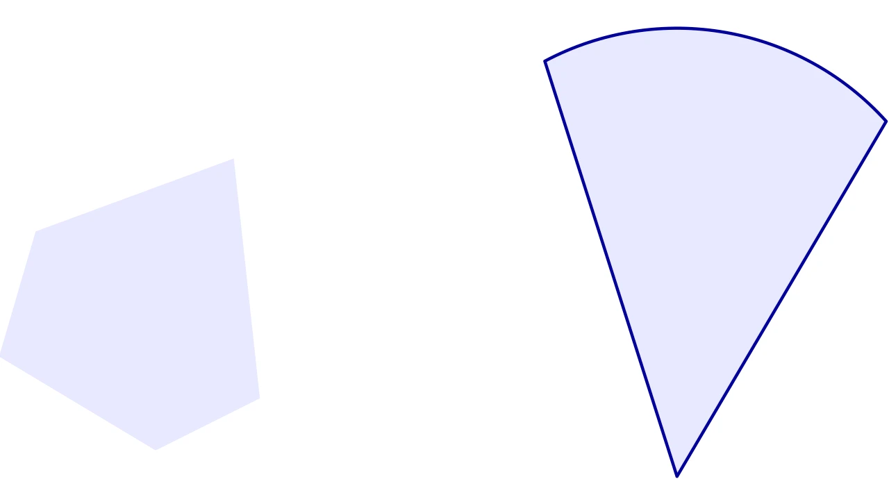

# 分析

## 开集和闭集

对于 $x \in C \subseteq \mathbf{R}^n$，如果存在 $\epsilon > 0$ 使得

$$
\begin{aligned}
\{y \mid\|y-x\|_{2} \leqslant \epsilon\} \subseteq C
\end{aligned}
$$

即存在一个以 $x$ 为中心的完全包含于 $C$ 的球，则称 $x$ 为 $C$ 的**内点**。$C$ 的所有内点组成的集合称为 $C$ 的内部，记作 $\operatorname{int}C$。若 $\operatorname{int}C = C$，则称集合 $C$ 为**开集**。若集合 $C \subseteq \mathbf{R}^n$ 的补集 $\mathbf{R}^{n} \backslash C=\{x \in \mathbf{R}^{n} \mid x \notin C\}$ 是开集，则称集合 $C$ 为**闭集**。



::: details TikZ 代码

```tex
\begin{tikzpicture}[line cap=round,line join=round,scale=0.95]
  % open set (boundary not included) vs closed set (boundary included)
  \fill[blue!9] (-0.6,-1.35) -- (-2.1,-0.45) -- (-1.75,0.75) -- (0.15,1.45) -- (0.4,-0.85) -- cycle;
  \begin{scope}[shift={(4.4,0)}]
    \draw[blue!60!black,thick,fill=blue!9] (0,-1.6) -- (118:2.7) arc[start angle=118,end angle=42,radius=2.7] -- cycle;
  \end{scope}
\end{tikzpicture}
```

:::

如图所示，在二维平面中，不包含边界的多边形是开集（左图所示），包含边界的扇形是闭集（右图所示）。实际上，开集和闭集的概念可以看作是实数集上开区间和闭区间在 $n$ 维空间中的推广。

### 闭包

$$
\begin{aligned}
\textbf{cl } C=\mathbf{R}^{n} \backslash \textbf{ int}(\mathbf{R}^{n} \backslash C)
\end{aligned}
$$

集合 $C$ 的闭包即为补集内部的补集。在上面的图中，左图不含边界的多边形的闭包是“补上边界”后的多边形，而右边包含边界的扇形的闭包正好是它本身。点 $x$ 属于 $C$ 的闭包的条件是：对于 $\forall \epsilon > 0$，$\exists y \in C$ 使得 $\|x-y\| _2 \leqslant \epsilon$。

### 边界

$$
\begin{aligned}
\textbf{bd } C=\textbf{cl } C \backslash \textbf{int } C
\end{aligned}
$$

显然，边界实际上就是集合的闭包去掉它所有的内点。我们可以用边界来刻画开集和闭集：

- 开集：不含有边界点，即 $C \cap \textbf{bd } C = \emptyset$。
- 闭集：包含边界，即 $\textbf{bd } C \subseteq C$。

## 上确界和下确界

假定 $C \subseteq \mathbf{R}$。如果对 $\forall x \in C$，$\exists a \in \mathbf{R}$ 使得 $x \leqslant a$ 恒成立，则称 $a$ 为 $C$ 的**上界**。其中，使得 $x \leqslant a$ 成立的最小的 $a$ 称为**最小上界**或者**上确界**，记作 $\sup C$。

我们规定：

- $\sup \emptyset = - \infty$
- 当 $C$ 无上界时 $\sup C = \infty$

当 $\sup C \in C$ 时，我们说 $C$ 的上确界是**可达**的。

类似地，我们可以很容易给出下确界的定义。本文从略。
