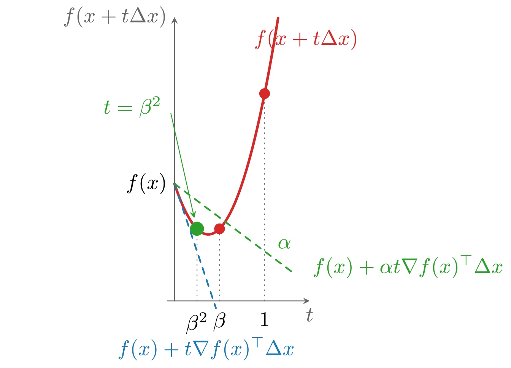

# 下降方法

本章描述的算法产生极小化序列 $x^{(k)}$，$k = 1, 2, \cdots$：

$$
x^{(k+1)} = x^{(k)} + t^{(k)}\Delta x^{(k)}
$$

其中 $t^{(k)} > 0$（除非 $x^{(k)}$ 已经最优）。向量 $\Delta x^{(k)} \in \mathbf{R}^n$ 称为**步进**&#8203;（step）或**搜索方向**&#8203;（search direction）（尽管它不一定具有单位范数），$k = 0, 1, \cdots$ 表示迭代次数。标量 $t^{(k)} \geqslant 0$ 称为第 $k$ 次迭代的**步长**&#8203;（step size）或**步长长度**&#8203;（step length）（尽管它并不等于 $\|x^{(k+1)} - x^{(k)}\|$，除非 $\|\Delta x^{(k)}\| = 1$）。当我们只关注一次迭代时，常采用简化的记号 $x^{+} = x + t\Delta x$ 或 $x := x + t\Delta x$ 来代替 $x^{(k+1)} = x^{(k)} + t^{(k)}\Delta x^{(k)}$。

我们研究的所有方法都是**下降方法**&#8203;，即除 $x^{(k)}$ 已最优外，始终满足

$$
f(x^{(k+1)}) < f(x^{(k)})
$$

这意味着对所有 $k$ 都有 $x^{(k)} \in S$（初始下水平集），特别地 $x^{(k)} \in \operatorname{dom} f$。由凸性可知，若 $\nabla f(x^{(k)})^{\top}(y - x^{(k)}) \geqslant 0$，则 $f(y) \geqslant f(x^{(k)})$，因此下降方法中的搜索方向必须满足

$$
\nabla f(x^{(k)})^{\top}\Delta x^{(k)} < 0
$$

即它与负梯度方向成锐角。我们称这样的方向为 $f$ 在 $x^{(k)}$ 处的**下降方向**&#8203;（descent direction）。

## 一般下降方法

一般下降方法在如下两个步骤之间交替：确定一个下降方向 $\Delta x$，以及选择步长 $t$。

**算法 9.1（一般下降方法）** 给定初始点 $x \in \operatorname{dom} f$。

1. 确定下降方向 $\Delta x$。
2. **直线搜索**&#8203;（line search）：选择步长 $t > 0$。
3. 更新：$x := x + t\Delta x$。

重复上述步骤直至满足终止准则。

第 2 步称为**直线搜索**&#8203;，因为选择步长 $t$ 决定了下一点在直线 $\{x + t\Delta x \mid t \in \mathbf{R}_+\}$ 上的位置。实用的下降方法具有相同的总体结构，但组织方式可能不同：例如终止准则通常在计算下降方向 $\Delta x$ 的过程中或之后立即检查，其形式常为 $\|\nabla f(x)\|_2 \leqslant \eta$（$\eta$ 为很小的正数），这正是次优性条件所提示的。

## 精确直线搜索

实际中有时使用的一种直线搜索方法是**精确直线搜索**&#8203;（exact line search），即选取 $t$ 使 $f$ 沿射线 $\{x + t\Delta x \mid t \geqslant 0\}$ 最小：

$$
t = \operatorname{argmin}_{s \geqslant 0}\, f(x + s\Delta x)
$$

当该一维极小化问题的代价比计算搜索方向本身的代价小时，可以采用精确直线搜索。某些特殊情形下沿射线的极小点可以解析求出，其他情形也可以高效地数值求解。

## 回溯直线搜索

实践中使用的直线搜索大多数是**不精确的**&#8203;：步长的选取只是近似地最小化 $f$ 沿射线的取值，甚至只要求 $f$“足够”下降。一种非常简单且十分有效的不精确直线搜索称为**回溯直线搜索**&#8203;（backtracking line search），它依赖于两个常数 $\alpha$ 和 $\beta$：$0 < \alpha < 0.5$，$0 < \beta < 1$。

**算法 9.2（回溯直线搜索）** 给定 $f$ 在 $x \in \operatorname{dom} f$ 处的下降方向 $\Delta x$，$\alpha \in (0, 0.5)$，$\beta \in (0, 1)$。

令 $t := 1$。当 $f(x + t\Delta x) > f(x) + \alpha t\nabla f(x)^{\top}\Delta x$ 时，令 $t := \beta t$。

之所以称为回溯，是因为它从单位步长开始，然后按因子 $\beta$ 不断缩小 $t$，直到停止条件 $f(x + t\Delta x) \leqslant f(x) + \alpha t\nabla f(x)^{\top}\Delta x$ 成立。由于 $\Delta x$ 是下降方向，$\nabla f(x)^{\top}\Delta x < 0$，因此当 $t$ 足够小时

$$
f(x + t\Delta x) \approx f(x) + t\nabla f(x)^{\top}\Delta x < f(x) + \alpha t\nabla f(x)^{\top}\Delta x
$$

这表明回溯直线搜索最终必然终止。常数 $\alpha$ 可以解释为：我们接受线性外推所预测的 $f$ 下降量的一部分（比例 $\alpha$）。（要求 $\alpha < 0.5$ 的原因将在后面说明。）

回溯终止不等式 $f(x + t\Delta x) \leqslant f(x) + \alpha t\nabla f(x)^{\top}\Delta x$ 对某个区间 $(0, t_0]$ 中的所有 $t$ 都成立，因此回溯直线搜索终止时得到的步长满足

$$
t = 1 \quad \text{或者} \quad t \in (\beta t_0,\ t_0]
$$

第一种情形对应单位步长本身就满足回溯条件（即 $1 \leqslant t_0$）。特别地，回溯直线搜索得到的步长满足 $t \geqslant \min\{1, \beta t_0\}$。

当 $\operatorname{dom} f$ 不等于全空间 $\mathbf{R}^n$ 时，回溯条件需要仔细解释：按照 $f$ 在定义域之外取值为无穷的约定，不等式蕴含 $x + t\Delta x \in \operatorname{dom} f$。在实际实现中，首先将 $t$ 乘以 $\beta$ 直至 $x + t\Delta x \in \operatorname{dom} f$，然后才开始检查不等式。

参数 $\alpha$ 典型取值在 0.01 与 0.3 之间，即接受线性外推预测下降量的 1% 到 30%；参数 $\beta$ 常取 0.1（对应非常粗糙的搜索）到 0.8（对应较为精细的搜索）之间。



上图由下面的 TikZ 代码编译而来：

```tex

  \definecolor{cblue}{RGB}{31,119,180}
  \definecolor{cred}{RGB}{214,39,40}
  \definecolor{cgreen}{RGB}{44,160,44}
  \definecolor{corange}{RGB}{255,127,14}
  \definecolor{cpurple}{RGB}{148,103,189}
  \definecolor{cbrown}{RGB}{140,86,75}
  \definecolor{cpink}{RGB}{227,119,194}
  \definecolor{cgray}{RGB}{127,127,127}
\begin{tikzpicture}[x=1cm,y=1cm,>=stealth,line cap=round,line join=round,scale=1.5]
  \draw[->,color=black!60] (-0.08,1.2) -- (1.5,1.2) node[below] {$t$};
  \draw[->,color=black!60] (0,1.2) -- (0,4.35) node[left] {$f(x+t\Delta x)$};
  \draw[cred,very thick,domain=0:1.15,samples=60] plot (\x,{2.5-3*\x+4*\x*\x});
  \draw[cblue,thick,dashed,domain=0:0.46] plot (\x,{2.5-3*\x});
  \draw[cgreen,thick,dashed,domain=0:1.34] plot (\x,{2.5-0.75*\x});
  \draw[color=black!55,dotted] (1,1.2) -- (1,3.5);
  \draw[color=black!55,dotted] (0.5,1.2) -- (0.5,2.0);
  \draw[color=black!55,dotted] (0.25,1.2) -- (0.25,2.0);
  \fill[cred] (1,3.5) circle (1.7pt);
  \fill[cred] (0.5,2.0) circle (1.7pt);
  \fill[cgreen] (0.25,2.0) circle (2.2pt);
  \node[below=2pt] at (1,1.2) {$1$};
  \node[below=2pt] at (0.5,1.2) {$\beta$};
  \node[below=2pt] at (0.25,1.2) {$\beta^2$};
  \node[anchor=west] at (0.8,4.1) {\textcolor{cred}{$f(x+t\Delta x)$}};
  \node[anchor=north] at (0.35,0.88) {\textcolor{cblue}{$f(x)+t\nabla f(x)^{\top}\Delta x$}};
  \node[anchor=west] at (1.45,1.58) {\textcolor{cgreen}{$f(x)+\alpha t\nabla f(x)^{\top}\Delta x$}};
  \node[anchor=east] at (-0.06,3.35) {\textcolor{cgreen}{$t=\beta^2$}};
  \draw[->,cgreen] (-0.04,3.28) -- (0.22,2.12);
  \node[anchor=east] at (0,2.5) {$f(x)$};
  \node[anchor=south] at (1.22,1.7) {\textcolor{cgreen}{$\alpha$}};
\end{tikzpicture}
```
