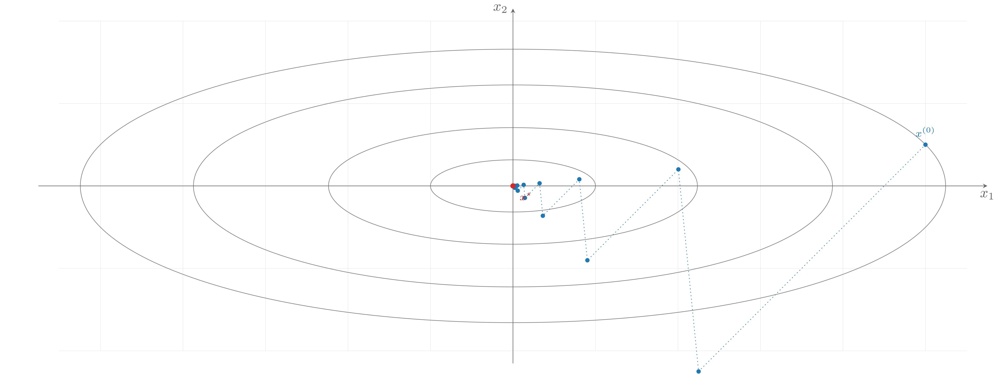
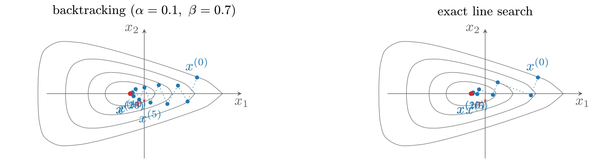
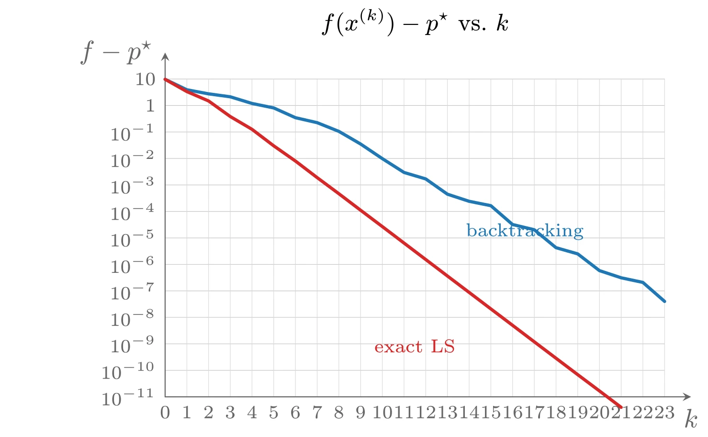
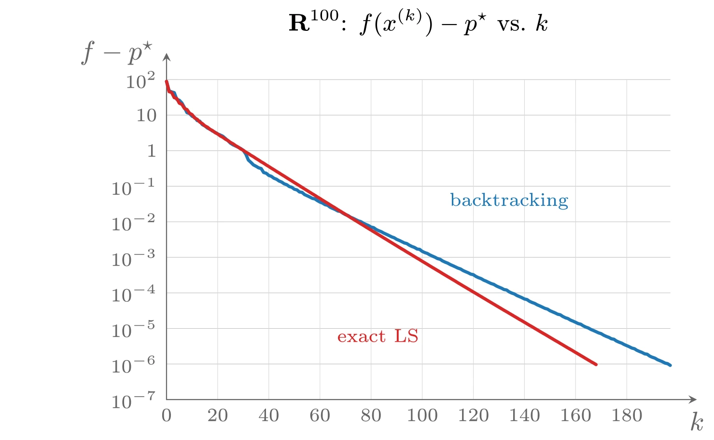
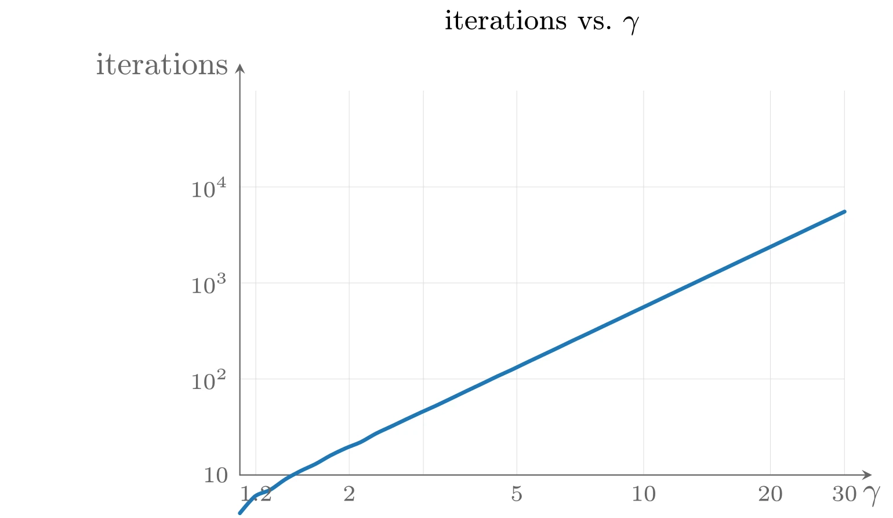
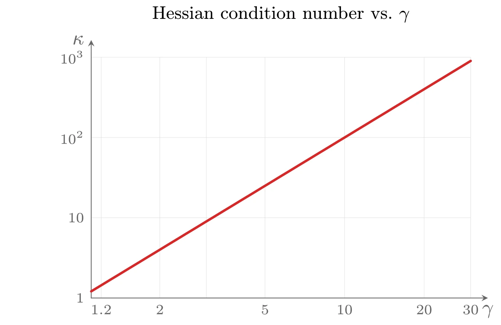

# 梯度下降方法

搜索方向的一个自然选择是负梯度方向 $\Delta x = -\nabla f(x)$，由此得到的算法称为**梯度算法**&#8203;（gradient algorithm）或**梯度下降方法**&#8203;（gradient descent method）。

**算法 9.3（梯度下降方法）** 给定初始点 $x \in \operatorname{dom} f$。

1. 令 $\Delta x := -\nabla f(x)$。
2. **直线搜索**&#8203;：通过精确或回溯直线搜索选取步长 $t$。
3. 更新：$x := x + t\Delta x$。

重复上述步骤直至满足终止准则。

终止准则通常为 $\|\nabla f(x)\|_2 \leqslant \eta$（$\eta$ 为很小的正数）。在大多数实现中，该条件在第 1 步之后（而不是更新之后）检查。

## 收敛性分析

采用简化记号 $x^{+} = x + t\Delta x$（其中 $\Delta x = -\nabla f(x)$）。假设 $f$ 在 $S$ 上强凸，即存在正的常数 $m$ 和 $M$ 使 $mI \preceq \nabla^2 f(x) \preceq MI$ 对所有 $x \in S$ 成立。定义 $\tilde{f}: \mathbf{R} \rightarrow \mathbf{R}$：

$$
\tilde{f}(t) = f(x - t\nabla f(x))
$$

即 $f$ 在负梯度方向上关于步长 $t$ 的函数。由 Hessian 上界不等式（取 $y = x - t\nabla f(x)$）可得 $\tilde{f}$ 的二次上界：

$$
\tilde{f}(t) \leqslant f(x) - t\|\nabla f(x)\|_2^2 + \frac{Mt^2}{2}\|\nabla f(x)\|_2^2
$$

### 精确直线搜索分析

假设使用精确直线搜索，对上述不等式两端关于 $t$ 取极小。右端是简单二次函数，在 $t = 1/M$ 处取最小值 $f(x) - (1/(2M))\|\nabla f(x)\|_2^2$，因此

$$
f(x^{+}) - p^{\star} \leqslant f(x) - p^{\star} - \frac{1}{2M}\|\nabla f(x)\|_2^2
$$

再结合 $\|\nabla f(x)\|_2^2 \geqslant 2m(f(x) - p^{\star})$（由强凸性得到），可得

$$
f(x^{+}) - p^{\star} \leqslant (1 - m/M)(f(x) - p^{\star})
$$

递归应用该不等式，有

$$
f(x^{(k)}) - p^{\star} \leqslant c^k (f(x^{(0)}) - p^{\star})
$$

其中 $c = 1 - m/M < 1$。这说明 $f(x^{(k)})$ 收敛于 $p^{\star}$。特别地，采用精确直线搜索的梯度方法至多经过

$$
\frac{\log((f(x^{(0)}) - p^{\star})/\epsilon)}{\log(1/c)}
$$

次迭代即可使 $f(x^{(k)}) - p^{\star} \leqslant \epsilon$。

这个界虽然粗糙，却能揭示梯度方法的一些性质。分子 $\log((f(x^{(0)}) - p^{\star})/\epsilon)$ 可解释为初始次优量与最终次优量之比的对数，说明所需迭代次数取决于初始点的好坏和最终要求的精度。分母 $\log(1/c)$ 是 $M/m$ 的函数，而 $M/m$ 正是 $\nabla^2 f(x)$（或者说下水平集）条件数的上界。当条件数上界 $M/m$ 很大时，$\log(1/c) = -\log(1 - m/M) \approx m/M$，即所需迭代次数的界随 $M/m$ 近似线性增长。事实上，当 Hessian（在 $x^{\star}$ 附近）的条件数很大时，梯度方法确实需要大量迭代；反之，当下水平集较为各向同性（条件数较小）时收敛很快。

上述界表明误差 $f(x^{(k)}) - p^{\star}$ 至少以几何级数的速度收敛到零。在迭代数值方法中，这称为**线性收敛**&#8203;（linear convergence），因为在对数-线性坐标下误差随迭代次数近似位于一条直线下方。

### 回溯直线搜索分析

对回溯直线搜索，可以证明回溯终止条件

$$
\tilde{f}(t) \leqslant f(x) - \alpha t\|\nabla f(x)\|_2^2
$$

在 $0 \leqslant t \leqslant 1/M$ 时总成立（利用 $-t + Mt^2/2 \leqslant -t/2$ 以及 $\alpha < 1/2$）。因此回溯直线搜索要么终止于 $t = 1$，要么终止于 $t \geqslant \beta/M$。综合两种情形可得

$$
f(x^{+}) \leqslant f(x) - \min\{\alpha, \beta\alpha/M\}\|\nabla f(x)\|_2^2
$$

与精确直线搜索的情形一样处理，可以得到

$$
f(x^{(k)}) - p^{\star} \leqslant c^k (f(x^{(0)}) - p^{\star}), \quad c = 1 - \min\{2m\alpha,\ 2\beta\alpha m/M\} < 1
$$

即 $f(x^{(k)})$ 至少以几何级数速度收敛于 $p^{\star}$，收敛率（至少部分地）依赖于条件数上界 $M/m$。在迭代方法的术语中，收敛至少是线性的。

## 例子

### $\mathbf{R}^2$ 中的二次问题

考虑 $\mathbf{R}^2$ 上的二次目标函数

$$
f(x) = \frac{1}{2}(x_1^2 + \gamma x_2^2), \quad \gamma > 0
$$

显然最优点为 $x^{\star} = 0$，最优值为 0。Hessian 为常矩阵，特征值为 1 和 $\gamma$，因此下水平集的条件数恰为 $\max\{\gamma, 1/\gamma\}$，最紧的强凸常数取 $m = \min\{1, \gamma\}$，$M = \max\{1, \gamma\}$。

从 $x^{(0)} = (\gamma, 1)$ 出发采用精确直线搜索，可以导出迭代点的闭式表达式（见教材习题 9.6）：

$$
x_1^{(k)} = \gamma\left(\frac{\gamma - 1}{\gamma + 1}\right)^k, \quad x_2^{(k)} = \left(-\frac{\gamma - 1}{\gamma + 1}\right)^k
$$

以及

$$
f(x^{(k)}) = \left(\frac{\gamma - 1}{\gamma + 1}\right)^{2k} f(x^{(0)})
$$

对这个简单例子，收敛恰好是线性的：误差每次迭代精确地按因子 $|(γ-1)/(γ+1)|^2$ 缩减。$\gamma = 1$ 时一次迭代即得精确解；$\gamma$ 接近 1（比如说在 1/3 到 3 之间）时收敛很快；而 $\gamma \gg 1$ 或 $\gamma \ll 1$ 时收敛非常慢。将实际收敛率 $((1-m/M)/(1+m/M))^2$ 与收敛分析给出的界 $1 - m/M$ 比较，可以发现该界只保守约四倍，说明收敛率（及其上界）确实主要由下水平集的条件数决定。



上图由下面的 TikZ 代码编译而来：

```tex

  \definecolor{cblue}{RGB}{31,119,180}
  \definecolor{cred}{RGB}{214,39,40}
  \definecolor{cgreen}{RGB}{44,160,44}
  \definecolor{corange}{RGB}{255,127,14}
  \definecolor{cpurple}{RGB}{148,103,189}
  \definecolor{cbrown}{RGB}{140,86,75}
  \definecolor{cpink}{RGB}{227,119,194}
  \definecolor{cgray}{RGB}{127,127,127}
\begin{tikzpicture}[x=1cm,y=1cm,>=stealth,line cap=round,line join=round]
  \draw[color=black!12,very thin] (-11,-4) grid[step=2] (11,4);
  \draw[cgray] (0,0) ellipse (2.0000 and 0.6325);
  \draw[cgray] (0,0) ellipse (4.4721 and 1.4142);
  \draw[cgray] (0,0) ellipse (7.7460 and 2.4495);
  \draw[cgray] (0,0) ellipse (10.4881 and 3.3166);
  \draw[->,color=black!60] (-11.5,0) -- (11.5,0) node[below] {$x_1$};
  \draw[->,color=black!60] (0,-4.3) -- (0,4.3) node[left] {$x_2$};
  \draw[cblue,dotted] plot coordinates {(10.000,1.000) (4.500,-4.500) (4.010,0.401) (1.804,-1.804) (1.608,0.161) (0.724,-0.724) (0.645,0.064) (0.290,-0.290) (0.259,0.026) (0.116,-0.116) (0.104,0.010) (0.047,-0.047) (0.042,0.004) (0.019,-0.019) (0.017,0.002) (0.008,-0.008) (0.007,0.001) (0.003,-0.003) (0.003,0.000) (0.001,-0.001) (0.001,0.000) (0.000,0.000) (0.000,0.000) (0.000,0.000) (0.000,0.000) (0.000,0.000) (0.000,0.000)};
  \fill[cblue] (10.000,1.000) circle (1.5pt);
  \fill[cblue] (4.500,-4.500) circle (1.5pt);
  \fill[cblue] (4.010,0.401) circle (1.5pt);
  \fill[cblue] (1.804,-1.804) circle (1.5pt);
  \fill[cblue] (1.608,0.161) circle (1.5pt);
  \fill[cblue] (0.724,-0.724) circle (1.5pt);
  \fill[cblue] (0.645,0.064) circle (1.5pt);
  \fill[cblue] (0.290,-0.290) circle (1.5pt);
  \fill[cblue] (0.259,0.026) circle (1.5pt);
  \fill[cblue] (0.116,-0.116) circle (1.5pt);
  \fill[cblue] (0.104,0.010) circle (1.5pt);
  \fill[cblue] (0.047,-0.047) circle (1.5pt);
  \fill[cblue] (0.042,0.004) circle (1.5pt);
  \fill[cblue] (0.019,-0.019) circle (1.5pt);
  \fill[cblue] (0.017,0.002) circle (1.5pt);
  \fill[cblue] (0.008,-0.008) circle (1.5pt);
  \fill[cblue] (0.007,0.001) circle (1.5pt);
  \fill[cblue] (0.003,-0.003) circle (1.5pt);
  \fill[cblue] (0.003,0.000) circle (1.5pt);
  \fill[cblue] (0.001,-0.001) circle (1.5pt);
  \fill[cblue] (0.001,0.000) circle (1.5pt);
  \fill[cblue] (0.000,0.000) circle (1.5pt);
  \fill[cblue] (0.000,0.000) circle (1.5pt);
  \fill[cblue] (0.000,0.000) circle (1.5pt);
  \fill[cblue] (0.000,0.000) circle (1.5pt);
  \fill[cblue] (0.000,0.000) circle (1.5pt);
  \fill[cblue] (0.000,0.000) circle (1.5pt);
  \fill[cred] (0,0) circle (1.8pt) node[below right=1pt,font=\scriptsize] {$x^{\star}$};
  \node[above=2pt,font=\scriptsize,color=cblue] at (10,1) {$x^{(0)}$};
\end{tikzpicture}
```

### $\mathbf{R}^2$ 中的非二次问题

考虑 $\mathbf{R}^2$ 中的非二次例子：

$$
f(x_1, x_2) = e^{x_1 + 3x_2 - 0.1} + e^{x_1 - 3x_2 - 0.1} + e^{-x_1 - 0.1}
$$

采用参数 $\alpha = 0.1$、$\beta = 0.7$ 的回溯直线搜索，误差 $f(x^{(k)}) - p^{\star}$ 近似按几何级数收敛，即近似线性收敛：误差从约 10 下降到约 $10^{-7}$ 用了 20 次迭代，每次迭代误差缩减因子约为 $10^{-8/20} \approx 0.4$。这与收敛分析的预测一致，因为该函数的下水平集条件数不太大。

改用精确直线搜索（同一问题、同一初始点）后收敛同样近似线性，但速度大约快一倍：15 次迭代中误差下降约 $10^{-11}$，每次迭代缩减因子约为 0.2。



上图由下面的 TikZ 代码编译而来：

```tex

  \definecolor{cblue}{RGB}{31,119,180}
  \definecolor{cred}{RGB}{214,39,40}
  \definecolor{cgreen}{RGB}{44,160,44}
  \definecolor{corange}{RGB}{255,127,14}
  \definecolor{cpurple}{RGB}{148,103,189}
  \definecolor{cbrown}{RGB}{140,86,75}
  \definecolor{cpink}{RGB}{227,119,194}
  \definecolor{cgray}{RGB}{127,127,127}
\begin{tikzpicture}[x=1cm,y=1cm,>=stealth,line cap=round,line join=round]
  \begin{scope}[xshift=0cm]
  \draw[cgray] plot [smooth,tension=0.55] coordinates {(0.269,0.000) (0.218,0.089) (0.121,0.152) (0.030,0.192) (-0.046,0.218) (-0.110,0.237) (-0.164,0.251) (-0.213,0.262) (-0.258,0.272) (-0.302,0.279) (-0.347,0.286) (-0.393,0.291) (-0.443,0.296) (-0.499,0.298) (-0.563,0.298) (-0.638,0.292) (-0.725,0.275) (-0.815,0.239) (-0.893,0.178) (-0.945,0.095) (-0.962,0.000) (-0.945,-0.095) (-0.893,-0.178) (-0.815,-0.239) (-0.725,-0.275) (-0.638,-0.292) (-0.563,-0.298) (-0.499,-0.298) (-0.443,-0.296) (-0.393,-0.291) (-0.347,-0.286) (-0.302,-0.279) (-0.258,-0.272) (-0.213,-0.262) (-0.164,-0.251) (-0.110,-0.237) (-0.046,-0.218) (0.030,-0.192) (0.121,-0.152) (0.218,-0.089) (0.269,0.000)};
  \draw[cgray] plot [smooth,tension=0.55] coordinates {(0.689,0.000) (0.581,0.147) (0.401,0.243) (0.249,0.304) (0.129,0.345) (0.029,0.376) (-0.056,0.400) (-0.132,0.421) (-0.204,0.439) (-0.274,0.455) (-0.347,0.470) (-0.423,0.485) (-0.509,0.499) (-0.608,0.512) (-0.726,0.522) (-0.870,0.523) (-1.035,0.500) (-1.193,0.431) (-1.306,0.312) (-1.365,0.161) (-1.382,0.000) (-1.365,-0.161) (-1.306,-0.312) (-1.193,-0.431) (-1.035,-0.500) (-0.870,-0.523) (-0.726,-0.522) (-0.608,-0.512) (-0.509,-0.499) (-0.423,-0.485) (-0.347,-0.470) (-0.274,-0.455) (-0.204,-0.439) (-0.132,-0.421) (-0.056,-0.400) (0.029,-0.376) (0.129,-0.345) (0.249,-0.304) (0.401,-0.243) (0.581,-0.147) (0.689,0.000)};
  \draw[cgray] plot [smooth,tension=0.55] coordinates {(1.247,0.000) (1.036,0.219) (0.740,0.353) (0.512,0.438) (0.337,0.497) (0.196,0.542) (0.075,0.580) (-0.035,0.612) (-0.138,0.642) (-0.240,0.670) (-0.347,0.698) (-0.462,0.728) (-0.593,0.759) (-0.750,0.792) (-0.948,0.827) (-1.201,0.854) (-1.499,0.837) (-1.748,0.714) (-1.877,0.497) (-1.927,0.250) (-1.940,0.000) (-1.927,-0.250) (-1.877,-0.497) (-1.748,-0.714) (-1.499,-0.837) (-1.201,-0.854) (-0.948,-0.827) (-0.750,-0.792) (-0.593,-0.759) (-0.462,-0.728) (-0.347,-0.698) (-0.240,-0.670) (-0.138,-0.642) (-0.035,-0.612) (0.075,-0.580) (0.196,-0.542) (0.337,-0.497) (0.512,-0.438) (0.740,-0.353) (1.036,-0.219) (1.247,0.000)};
  \draw[cgray] plot [smooth,tension=0.55] coordinates {(1.927,0.000) (1.558,0.302) (1.121,0.477) (0.806,0.587) (0.571,0.667) (0.382,0.729) (0.220,0.780) (0.075,0.827) (-0.064,0.870) (-0.202,0.912) (-0.347,0.955) (-0.505,1.002) (-0.689,1.054) (-0.915,1.115) (-1.209,1.188) (-1.611,1.264) (-2.108,1.280) (-2.461,1.077) (-2.580,0.726) (-2.613,0.359) (-2.620,0.000) (-2.613,-0.359) (-2.580,-0.726) (-2.461,-1.077) (-2.108,-1.280) (-1.611,-1.264) (-1.209,-1.188) (-0.915,-1.115) (-0.689,-1.054) (-0.505,-1.002) (-0.347,-0.955) (-0.202,-0.912) (-0.064,-0.870) (0.075,-0.827) (0.220,-0.780) (0.382,-0.729) (0.571,-0.667) (0.806,-0.587) (1.121,-0.477) (1.558,-0.302) (1.927,0.000)};
    \draw[->,color=black!60] (-2.4,0) -- (2.4,0) node[below] {$x_1$};
    \draw[->,color=black!60] (0,-1.6) -- (0,1.6) node[left] {$x_2$};
    \draw[cblue,dotted] plot coordinates {(1.300,0.400) (1.067,-0.195) (0.830,0.199) (0.570,-0.255) (0.358,0.211) (0.153,-0.221) (0.004,0.151) (-0.126,-0.149) (-0.212,0.111) (-0.262,-0.064) (-0.291,0.031) (-0.308,-0.014) (-0.325,0.014) (-0.332,-0.005) (-0.338,0.005) (-0.342,-0.005) (-0.343,0.002) (-0.345,-0.002) (-0.345,0.001) (-0.346,-0.001) (-0.346,0.000) (-0.346,0.000) (-0.346,0.000) (-0.346,0.000)};
  \fill[cblue] (1.300,0.400) circle (1.4pt) node[above=1.5pt] {$x^{(0)}$};
  \fill[cblue] (1.067,-0.195) circle (1.4pt);
  \fill[cblue] (0.830,0.199) circle (1.4pt);
  \fill[cblue] (0.570,-0.255) circle (1.4pt);
  \fill[cblue] (0.358,0.211) circle (1.4pt);
  \fill[cblue] (0.153,-0.221) circle (1.4pt) node[below=1.5pt] {$x^{(5)}$};
  \fill[cblue] (0.004,0.151) circle (1.4pt);
  \fill[cblue] (-0.126,-0.149) circle (1.4pt);
  \fill[cblue] (-0.212,0.111) circle (1.4pt);
  \fill[cblue] (-0.262,-0.064) circle (1.4pt);
  \fill[cblue] (-0.291,0.031) circle (1.4pt) node[below=1.5pt] {$x^{(10)}$};
  \fill[cblue] (-0.308,-0.014) circle (1.4pt);
  \fill[cblue] (-0.325,0.014) circle (1.4pt);
  \fill[cblue] (-0.332,-0.005) circle (1.4pt);
  \fill[cblue] (-0.338,0.005) circle (1.4pt);
  \fill[cblue] (-0.342,-0.005) circle (1.4pt) node[below=1.5pt] {$x^{(15)}$};
  \fill[cblue] (-0.343,0.002) circle (1.4pt);
  \fill[cblue] (-0.345,-0.002) circle (1.4pt);
  \fill[cblue] (-0.345,0.001) circle (1.4pt);
  \fill[cblue] (-0.346,-0.001) circle (1.4pt);
  \fill[cblue] (-0.346,0.000) circle (1.4pt) node[below=1.5pt] {$x^{(20)}$};
  \fill[cblue] (-0.346,0.000) circle (1.4pt);
  \fill[cblue] (-0.346,0.000) circle (1.4pt);
  \fill[cblue] (-0.346,0.000) circle (1.4pt);
    \fill[cred] (-0.3466,0.0000) circle (1.6pt) node[below right=0pt,font=\scriptsize] {$x^{\star}$};
    \node[font=\small] at (0,2.05) {backtracking ($\alpha=0.1,\ \beta=0.7$)};
  \end{scope}
  \begin{scope}[xshift=8.4cm]
  \draw[cgray] plot [smooth,tension=0.55] coordinates {(0.269,0.000) (0.218,0.089) (0.121,0.152) (0.030,0.192) (-0.046,0.218) (-0.110,0.237) (-0.164,0.251) (-0.213,0.262) (-0.258,0.272) (-0.302,0.279) (-0.347,0.286) (-0.393,0.291) (-0.443,0.296) (-0.499,0.298) (-0.563,0.298) (-0.638,0.292) (-0.725,0.275) (-0.815,0.239) (-0.893,0.178) (-0.945,0.095) (-0.962,0.000) (-0.945,-0.095) (-0.893,-0.178) (-0.815,-0.239) (-0.725,-0.275) (-0.638,-0.292) (-0.563,-0.298) (-0.499,-0.298) (-0.443,-0.296) (-0.393,-0.291) (-0.347,-0.286) (-0.302,-0.279) (-0.258,-0.272) (-0.213,-0.262) (-0.164,-0.251) (-0.110,-0.237) (-0.046,-0.218) (0.030,-0.192) (0.121,-0.152) (0.218,-0.089) (0.269,0.000)};
  \draw[cgray] plot [smooth,tension=0.55] coordinates {(0.689,0.000) (0.581,0.147) (0.401,0.243) (0.249,0.304) (0.129,0.345) (0.029,0.376) (-0.056,0.400) (-0.132,0.421) (-0.204,0.439) (-0.274,0.455) (-0.347,0.470) (-0.423,0.485) (-0.509,0.499) (-0.608,0.512) (-0.726,0.522) (-0.870,0.523) (-1.035,0.500) (-1.193,0.431) (-1.306,0.312) (-1.365,0.161) (-1.382,0.000) (-1.365,-0.161) (-1.306,-0.312) (-1.193,-0.431) (-1.035,-0.500) (-0.870,-0.523) (-0.726,-0.522) (-0.608,-0.512) (-0.509,-0.499) (-0.423,-0.485) (-0.347,-0.470) (-0.274,-0.455) (-0.204,-0.439) (-0.132,-0.421) (-0.056,-0.400) (0.029,-0.376) (0.129,-0.345) (0.249,-0.304) (0.401,-0.243) (0.581,-0.147) (0.689,0.000)};
  \draw[cgray] plot [smooth,tension=0.55] coordinates {(1.247,0.000) (1.036,0.219) (0.740,0.353) (0.512,0.438) (0.337,0.497) (0.196,0.542) (0.075,0.580) (-0.035,0.612) (-0.138,0.642) (-0.240,0.670) (-0.347,0.698) (-0.462,0.728) (-0.593,0.759) (-0.750,0.792) (-0.948,0.827) (-1.201,0.854) (-1.499,0.837) (-1.748,0.714) (-1.877,0.497) (-1.927,0.250) (-1.940,0.000) (-1.927,-0.250) (-1.877,-0.497) (-1.748,-0.714) (-1.499,-0.837) (-1.201,-0.854) (-0.948,-0.827) (-0.750,-0.792) (-0.593,-0.759) (-0.462,-0.728) (-0.347,-0.698) (-0.240,-0.670) (-0.138,-0.642) (-0.035,-0.612) (0.075,-0.580) (0.196,-0.542) (0.337,-0.497) (0.512,-0.438) (0.740,-0.353) (1.036,-0.219) (1.247,0.000)};
  \draw[cgray] plot [smooth,tension=0.55] coordinates {(1.927,0.000) (1.558,0.302) (1.121,0.477) (0.806,0.587) (0.571,0.667) (0.382,0.729) (0.220,0.780) (0.075,0.827) (-0.064,0.870) (-0.202,0.912) (-0.347,0.955) (-0.505,1.002) (-0.689,1.054) (-0.915,1.115) (-1.209,1.188) (-1.611,1.264) (-2.108,1.280) (-2.461,1.077) (-2.580,0.726) (-2.613,0.359) (-2.620,0.000) (-2.613,-0.359) (-2.580,-0.726) (-2.461,-1.077) (-2.108,-1.280) (-1.611,-1.264) (-1.209,-1.188) (-0.915,-1.115) (-0.689,-1.054) (-0.505,-1.002) (-0.347,-0.955) (-0.202,-0.912) (-0.064,-0.870) (0.075,-0.827) (0.220,-0.780) (0.382,-0.729) (0.571,-0.667) (0.806,-0.587) (1.121,-0.477) (1.558,-0.302) (1.927,0.000)};
    \draw[->,color=black!60] (-2.4,0) -- (2.4,0) node[below] {$x_1$};
    \draw[->,color=black!60] (0,-1.6) -- (0,1.6) node[left] {$x_2$};
    \draw[cblue,dotted] plot coordinates {(1.300,0.400) (1.127,-0.041) (0.309,0.279) (0.189,-0.029) (-0.151,0.104) (-0.196,-0.011) (-0.296,0.028) (-0.309,-0.003) (-0.334,0.007) (-0.337,-0.001) (-0.344,0.002) (-0.344,0.000) (-0.346,0.000) (-0.346,0.000) (-0.346,0.000) (-0.346,0.000) (-0.347,0.000) (-0.347,0.000) (-0.347,0.000) (-0.347,0.000) (-0.347,0.000) (-0.347,0.000)};
  \fill[cblue] (1.300,0.400) circle (1.4pt) node[above=1.5pt] {$x^{(0)}$};
  \fill[cblue] (1.127,-0.041) circle (1.4pt);
  \fill[cblue] (0.309,0.279) circle (1.4pt);
  \fill[cblue] (0.189,-0.029) circle (1.4pt);
  \fill[cblue] (-0.151,0.104) circle (1.4pt);
  \fill[cblue] (-0.196,-0.011) circle (1.4pt) node[below=1.5pt] {$x^{(5)}$};
  \fill[cblue] (-0.296,0.028) circle (1.4pt);
  \fill[cblue] (-0.309,-0.003) circle (1.4pt);
  \fill[cblue] (-0.334,0.007) circle (1.4pt);
  \fill[cblue] (-0.337,-0.001) circle (1.4pt);
  \fill[cblue] (-0.344,0.002) circle (1.4pt) node[below=1.5pt] {$x^{(10)}$};
  \fill[cblue] (-0.344,0.000) circle (1.4pt);
  \fill[cblue] (-0.346,0.000) circle (1.4pt);
  \fill[cblue] (-0.346,0.000) circle (1.4pt);
  \fill[cblue] (-0.346,0.000) circle (1.4pt);
  \fill[cblue] (-0.346,0.000) circle (1.4pt) node[below=1.5pt] {$x^{(15)}$};
  \fill[cblue] (-0.347,0.000) circle (1.4pt);
  \fill[cblue] (-0.347,0.000) circle (1.4pt);
  \fill[cblue] (-0.347,0.000) circle (1.4pt);
  \fill[cblue] (-0.347,0.000) circle (1.4pt);
  \fill[cblue] (-0.347,0.000) circle (1.4pt) node[below=1.5pt] {$x^{(20)}$};
  \fill[cblue] (-0.347,0.000) circle (1.4pt);
    \fill[cred] (-0.3466,0.0000) circle (1.6pt) node[below right=0pt,font=\scriptsize] {$x^{\star}$};
    \node[font=\small] at (0,2.05) {exact line search};
  \end{scope}
\end{tikzpicture}
```


上图由下面的 TikZ 代码编译而来：

```tex

  \definecolor{cblue}{RGB}{31,119,180}
  \definecolor{cred}{RGB}{214,39,40}
  \definecolor{cgreen}{RGB}{44,160,44}
  \definecolor{corange}{RGB}{255,127,14}
  \definecolor{cpurple}{RGB}{148,103,189}
  \definecolor{cbrown}{RGB}{140,86,75}
  \definecolor{cpink}{RGB}{227,119,194}
  \definecolor{cgray}{RGB}{127,127,127}
\begin{tikzpicture}[x=1cm,y=1cm,>=stealth,line cap=round,line join=round]
  \draw[color=black!25,very thin] (0.0000,0.0000) -- (6.6000,0.0000) (0.0000,0.3500) -- (6.6000,0.3500) (0.0000,0.7000) -- (6.6000,0.7000) (0.0000,1.0500) -- (6.6000,1.0500) (0.0000,1.4000) -- (6.6000,1.4000) (0.0000,1.7500) -- (6.6000,1.7500) (0.0000,2.1000) -- (6.6000,2.1000) (0.0000,2.4500) -- (6.6000,2.4500) (0.0000,2.8000) -- (6.6000,2.8000) (0.0000,3.1500) -- (6.6000,3.1500) (0.0000,3.5000) -- (6.6000,3.5000) (0.0000,3.8500) -- (6.6000,3.8500) (0.0000,4.2000) -- (6.6000,4.2000);
  \draw[color=black!15,very thin] (0.0000,0.0000) -- (0.0000,4.2000) (0.2870,0.0000) -- (0.2870,4.2000) (0.5739,0.0000) -- (0.5739,4.2000) (0.8609,0.0000) -- (0.8609,4.2000) (1.1478,0.0000) -- (1.1478,4.2000) (1.4348,0.0000) -- (1.4348,4.2000) (1.7217,0.0000) -- (1.7217,4.2000) (2.0087,0.0000) -- (2.0087,4.2000) (2.2957,0.0000) -- (2.2957,4.2000) (2.5826,0.0000) -- (2.5826,4.2000) (2.8696,0.0000) -- (2.8696,4.2000) (3.1565,0.0000) -- (3.1565,4.2000) (3.4435,0.0000) -- (3.4435,4.2000) (3.7304,0.0000) -- (3.7304,4.2000) (4.0174,0.0000) -- (4.0174,4.2000) (4.3043,0.0000) -- (4.3043,4.2000) (4.5913,0.0000) -- (4.5913,4.2000) (4.8783,0.0000) -- (4.8783,4.2000) (5.1652,0.0000) -- (5.1652,4.2000) (5.4522,0.0000) -- (5.4522,4.2000) (5.7391,0.0000) -- (5.7391,4.2000) (6.0261,0.0000) -- (6.0261,4.2000) (6.3130,0.0000) -- (6.3130,4.2000) (6.6000,0.0000) -- (6.6000,4.2000);
  \draw[->,color=black!60] (0.0000,0.0000) -- (6.9500,0.0000) node[below=1pt] {$k$};
  \draw[->,color=black!60] (0.0000,0.0000) -- (0.0000,4.5500) node[left=1pt] {$f-p^{\star}$};
  \node[left,font=\scriptsize,color=black!60] at (0.0000,0.0000) {$10^{-11}$};
  \node[left,font=\scriptsize,color=black!60] at (0.0000,0.3500) {$10^{-10}$};
  \node[left,font=\scriptsize,color=black!60] at (0.0000,0.7000) {$10^{-9}$};
  \node[left,font=\scriptsize,color=black!60] at (0.0000,1.0500) {$10^{-8}$};
  \node[left,font=\scriptsize,color=black!60] at (0.0000,1.4000) {$10^{-7}$};
  \node[left,font=\scriptsize,color=black!60] at (0.0000,1.7500) {$10^{-6}$};
  \node[left,font=\scriptsize,color=black!60] at (0.0000,2.1000) {$10^{-5}$};
  \node[left,font=\scriptsize,color=black!60] at (0.0000,2.4500) {$10^{-4}$};
  \node[left,font=\scriptsize,color=black!60] at (0.0000,2.8000) {$10^{-3}$};
  \node[left,font=\scriptsize,color=black!60] at (0.0000,3.1500) {$10^{-2}$};
  \node[left,font=\scriptsize,color=black!60] at (0.0000,3.5000) {$10^{-1}$};
  \node[left,font=\scriptsize,color=black!60] at (0.0000,3.8500) {1};
  \node[left,font=\scriptsize,color=black!60] at (0.0000,4.2000) {$10$};
  \node[below,font=\scriptsize,color=black!60] at (0.0000,0.0000) {0};
  \node[below,font=\scriptsize,color=black!60] at (0.2870,0.0000) {1};
  \node[below,font=\scriptsize,color=black!60] at (0.5739,0.0000) {2};
  \node[below,font=\scriptsize,color=black!60] at (0.8609,0.0000) {3};
  \node[below,font=\scriptsize,color=black!60] at (1.1478,0.0000) {4};
  \node[below,font=\scriptsize,color=black!60] at (1.4348,0.0000) {5};
  \node[below,font=\scriptsize,color=black!60] at (1.7217,0.0000) {6};
  \node[below,font=\scriptsize,color=black!60] at (2.0087,0.0000) {7};
  \node[below,font=\scriptsize,color=black!60] at (2.2957,0.0000) {8};
  \node[below,font=\scriptsize,color=black!60] at (2.5826,0.0000) {9};
  \node[below,font=\scriptsize,color=black!60] at (2.8696,0.0000) {10};
  \node[below,font=\scriptsize,color=black!60] at (3.1565,0.0000) {11};
  \node[below,font=\scriptsize,color=black!60] at (3.4435,0.0000) {12};
  \node[below,font=\scriptsize,color=black!60] at (3.7304,0.0000) {13};
  \node[below,font=\scriptsize,color=black!60] at (4.0174,0.0000) {14};
  \node[below,font=\scriptsize,color=black!60] at (4.3043,0.0000) {15};
  \node[below,font=\scriptsize,color=black!60] at (4.5913,0.0000) {16};
  \node[below,font=\scriptsize,color=black!60] at (4.8783,0.0000) {17};
  \node[below,font=\scriptsize,color=black!60] at (5.1652,0.0000) {18};
  \node[below,font=\scriptsize,color=black!60] at (5.4522,0.0000) {19};
  \node[below,font=\scriptsize,color=black!60] at (5.7391,0.0000) {20};
  \node[below,font=\scriptsize,color=black!60] at (6.0261,0.0000) {21};
  \node[below,font=\scriptsize,color=black!60] at (6.3130,0.0000) {22};
  \node[below,font=\scriptsize,color=black!60] at (6.6000,0.0000) {23};
  \node[font=\small] at (3.3,4.95) {$f(x^{(k)})-p^{\star}$ vs.\ $k$};
  \draw[cblue,very thick] plot coordinates {(0.000,4.196) (0.287,4.058) (0.574,4.004) (0.861,3.965) (1.148,3.877) (1.435,3.818) (1.722,3.689) (2.009,3.623) (2.296,3.508) (2.583,3.341) (2.870,3.148) (3.157,2.965) (3.443,2.880) (3.730,2.678) (4.017,2.584) (4.304,2.526) (4.591,2.277) (4.878,2.208) (5.165,1.971) (5.452,1.889) (5.739,1.668) (6.026,1.573) (6.313,1.512) (6.600,1.261)};
  \draw[cred,very thick] plot coordinates {(0.000,4.196) (0.287,4.034) (0.574,3.910) (0.861,3.704) (1.148,3.535) (1.435,3.317) (1.722,3.116) (2.009,2.897) (2.296,2.684) (2.583,2.466) (2.870,2.250) (3.157,2.032) (3.443,1.815) (3.730,1.597) (4.017,1.380) (4.304,1.162) (4.591,0.945) (4.878,0.727) (5.165,0.510) (5.452,0.293) (5.739,0.078) (6.026,-0.139)};
  \node[font=\scriptsize,color=cblue] at (4.752,2.184) {backtracking};
  \node[font=\scriptsize,color=cred] at (3.3,0.672) {exact LS};
\end{tikzpicture}
```


### $\mathbf{R}^{100}$ 中的问题

考虑规模更大的例子：

$$
f(x) = c^{\top}x - \sum_{i=1}^m \log(b_i - a_i^{\top}x)
$$

其中 $m = 500$，$n = 100$。参数 $\alpha = 0.1$、$\beta = 0.5$ 的回溯直线搜索呈现两阶段收敛：前约 20 次迭代近似线性且较快（每次迭代缩减约 0.8），之后线性收敛变慢（每次迭代缩减约 0.94）；总体上误差在约 175 次迭代中下降约 $10^6$ 倍。精确直线搜索的收敛也近似线性，总体只稍快一些（约 140 次迭代下降 $10^6$ 倍）。

关于回溯参数的影响：固定 $\beta = 0.5$ 而在 0.05 到 0.5 之间变化 $\alpha$，所需迭代次数在约 80（$\alpha$ 较大时）到约 170（$\alpha$ 较小时）之间变化；固定 $\alpha = 0.1$ 而在 0.05 到 0.95 之间变化 $\beta$，所需迭代次数在约 80（$\beta \approx 0.5$）到约 200 之间变化。这些实验表明梯度方法在 $\alpha$ 较大（0.2–0.5）、$\beta \approx 0.5$ 时表现较好，但回溯参数对收敛的影响总体不大（不超过约两倍）。



上图由下面的 TikZ 代码编译而来：

```tex

  \definecolor{cblue}{RGB}{31,119,180}
  \definecolor{cred}{RGB}{214,39,40}
  \definecolor{cgreen}{RGB}{44,160,44}
  \definecolor{corange}{RGB}{255,127,14}
  \definecolor{cpurple}{RGB}{148,103,189}
  \definecolor{cbrown}{RGB}{140,86,75}
  \definecolor{cpink}{RGB}{227,119,194}
  \definecolor{cgray}{RGB}{127,127,127}
\begin{tikzpicture}[x=1cm,y=1cm,>=stealth,line cap=round,line join=round]
  \draw[color=black!25,very thin] (0.0000,0.0000) -- (6.6000,0.0000) (0.0000,0.4667) -- (6.6000,0.4667) (0.0000,0.9333) -- (6.6000,0.9333) (0.0000,1.4000) -- (6.6000,1.4000) (0.0000,1.8667) -- (6.6000,1.8667) (0.0000,2.3333) -- (6.6000,2.3333) (0.0000,2.8000) -- (6.6000,2.8000) (0.0000,3.2667) -- (6.6000,3.2667) (0.0000,3.7333) -- (6.6000,3.7333) (0.0000,4.2000) -- (6.6000,4.2000);
  \draw[color=black!15,very thin] (0.0000,0.0000) -- (0.0000,4.2000) (0.6701,0.0000) -- (0.6701,4.2000) (1.3401,0.0000) -- (1.3401,4.2000) (2.0102,0.0000) -- (2.0102,4.2000) (2.6802,0.0000) -- (2.6802,4.2000) (3.3503,0.0000) -- (3.3503,4.2000) (4.0203,0.0000) -- (4.0203,4.2000) (4.6904,0.0000) -- (4.6904,4.2000) (5.3604,0.0000) -- (5.3604,4.2000) (6.0305,0.0000) -- (6.0305,4.2000);
  \draw[->,color=black!60] (0.0000,0.0000) -- (6.9500,0.0000) node[below=1pt] {$k$};
  \draw[->,color=black!60] (0.0000,0.0000) -- (0.0000,4.5500) node[left=1pt] {$f-p^{\star}$};
  \node[left,font=\scriptsize,color=black!60] at (0.0000,0.0000) {$10^{-7}$};
  \node[left,font=\scriptsize,color=black!60] at (0.0000,0.4667) {$10^{-6}$};
  \node[left,font=\scriptsize,color=black!60] at (0.0000,0.9333) {$10^{-5}$};
  \node[left,font=\scriptsize,color=black!60] at (0.0000,1.4000) {$10^{-4}$};
  \node[left,font=\scriptsize,color=black!60] at (0.0000,1.8667) {$10^{-3}$};
  \node[left,font=\scriptsize,color=black!60] at (0.0000,2.3333) {$10^{-2}$};
  \node[left,font=\scriptsize,color=black!60] at (0.0000,2.8000) {$10^{-1}$};
  \node[left,font=\scriptsize,color=black!60] at (0.0000,3.2667) {1};
  \node[left,font=\scriptsize,color=black!60] at (0.0000,3.7333) {$10$};
  \node[left,font=\scriptsize,color=black!60] at (0.0000,4.2000) {$10^{2}$};
  \node[below,font=\scriptsize,color=black!60] at (0.0000,0.0000) {0};
  \node[below,font=\scriptsize,color=black!60] at (0.6701,0.0000) {20};
  \node[below,font=\scriptsize,color=black!60] at (1.3401,0.0000) {40};
  \node[below,font=\scriptsize,color=black!60] at (2.0102,0.0000) {60};
  \node[below,font=\scriptsize,color=black!60] at (2.6802,0.0000) {80};
  \node[below,font=\scriptsize,color=black!60] at (3.3503,0.0000) {100};
  \node[below,font=\scriptsize,color=black!60] at (4.0203,0.0000) {120};
  \node[below,font=\scriptsize,color=black!60] at (4.6904,0.0000) {140};
  \node[below,font=\scriptsize,color=black!60] at (5.3604,0.0000) {160};
  \node[below,font=\scriptsize,color=black!60] at (6.0305,0.0000) {180};
  \node[font=\small] at (3.3,4.95) {$\mathbf{R}^{100}$: $f(x^{(k)})-p^{\star}$ vs.\ $k$};
  \draw[cblue,very thick] plot coordinates {(0.000,4.176) (0.034,4.053) (0.067,4.038) (0.101,4.028) (0.134,3.941) (0.168,3.928) (0.201,3.893) (0.235,3.832) (0.268,3.767) (0.302,3.754) (0.335,3.719) (0.369,3.703) (0.402,3.662) (0.436,3.654) (0.469,3.609) (0.503,3.591) (0.536,3.564) (0.570,3.547) (0.603,3.524) (0.637,3.508) (0.670,3.487) (0.704,3.472) (0.737,3.456) (0.771,3.427) (0.804,3.398) (0.838,3.365) (0.871,3.344) (0.905,3.328) (0.938,3.312) (0.972,3.295) (1.005,3.271) (1.039,3.222) (1.072,3.144) (1.106,3.113) (1.139,3.080) (1.173,3.062) (1.206,3.042) (1.240,3.032) (1.273,2.980) (1.307,2.970) (1.340,2.942) (1.374,2.930) (1.407,2.905) (1.441,2.892) (1.474,2.869) (1.508,2.855) (1.541,2.832) (1.575,2.820) (1.608,2.796) (1.642,2.786) (1.675,2.761) (1.709,2.752) (1.742,2.725) (1.776,2.719) (1.809,2.690) (1.843,2.675) (1.876,2.659) (1.910,2.641) (1.943,2.634) (1.977,2.611) (2.010,2.592) (2.044,2.579) (2.077,2.558) (2.111,2.550) (2.144,2.524) (2.178,2.508) (2.211,2.494) (2.245,2.475) (2.278,2.469) (2.312,2.445) (2.345,2.427) (2.379,2.415) (2.412,2.393) (2.446,2.379) (2.479,2.362) (2.513,2.345) (2.546,2.335) (2.580,2.314) (2.613,2.298) (2.647,2.284) (2.680,2.264) (2.714,2.256) (2.747,2.232) (2.781,2.216) (2.814,2.203) (2.848,2.184) (2.881,2.169) (2.915,2.153) (2.948,2.136) (2.982,2.124) (3.015,2.103) (3.049,2.089) (3.082,2.073) (3.116,2.056) (3.149,2.047) (3.183,2.025) (3.216,2.009) (3.250,1.996) (3.283,1.976) (3.317,1.971) (3.350,1.945) (3.384,1.929) (3.417,1.918) (3.451,1.898) (3.484,1.883) (3.518,1.868) (3.551,1.850) (3.585,1.841) (3.618,1.819) (3.652,1.803) (3.685,1.790) (3.719,1.771) (3.752,1.757) (3.786,1.741) (3.819,1.725) (3.853,1.714) (3.886,1.693) (3.920,1.678) (3.953,1.664) (3.987,1.646) (4.020,1.639) (4.054,1.616) (4.087,1.600) (4.121,1.588) (4.154,1.568) (4.188,1.554) (4.221,1.538) (4.255,1.522) (4.288,1.512) (4.322,1.491) (4.355,1.476) (4.389,1.462) (4.422,1.444) (4.456,1.438) (4.489,1.414) (4.523,1.398) (4.556,1.387) (4.590,1.366) (4.623,1.352) (4.657,1.337) (4.690,1.320) (4.724,1.312) (4.757,1.289) (4.791,1.274) (4.824,1.262) (4.858,1.243) (4.891,1.229) (4.925,1.213) (4.958,1.197) (4.992,1.187) (5.025,1.166) (5.059,1.151) (5.092,1.137) (5.126,1.120) (5.159,1.113) (5.193,1.090) (5.226,1.074) (5.260,1.063) (5.293,1.043) (5.327,1.029) (5.360,1.014) (5.394,0.997) (5.427,0.989) (5.461,0.967) (5.494,0.951) (5.528,0.939) (5.561,0.920) (5.595,0.906) (5.628,0.891) (5.662,0.875) (5.695,0.865) (5.729,0.844) (5.762,0.829) (5.796,0.816) (5.829,0.798) (5.863,0.791) (5.896,0.768) (5.930,0.753) (5.963,0.741) (5.997,0.722) (6.030,0.708) (6.064,0.693) (6.097,0.676) (6.131,0.667) (6.164,0.646) (6.198,0.631) (6.231,0.618) (6.265,0.600) (6.298,0.595) (6.332,0.570) (6.365,0.555) (6.399,0.544) (6.432,0.524) (6.466,0.510) (6.499,0.496) (6.533,0.478) (6.566,0.471) (6.600,0.449)};
  \draw[cred,very thick] plot coordinates {(0.000,4.176) (0.034,4.041) (0.067,4.031) (0.101,3.963) (0.134,3.951) (0.168,3.890) (0.201,3.875) (0.235,3.821) (0.268,3.806) (0.302,3.758) (0.335,3.740) (0.369,3.695) (0.402,3.678) (0.436,3.642) (0.469,3.622) (0.503,3.592) (0.536,3.575) (0.570,3.547) (0.603,3.530) (0.637,3.503) (0.670,3.486) (0.704,3.460) (0.737,3.443) (0.771,3.418) (0.804,3.400) (0.838,3.375) (0.871,3.357) (0.905,3.333) (0.938,3.314) (0.972,3.290) (1.005,3.272) (1.039,3.248) (1.072,3.229) (1.106,3.206) (1.139,3.187) (1.173,3.164) (1.206,3.144) (1.240,3.121) (1.273,3.102) (1.307,3.079) (1.340,3.059) (1.374,3.037) (1.407,3.017) (1.441,2.995) (1.474,2.975) (1.508,2.953) (1.541,2.933) (1.575,2.911) (1.608,2.890) (1.642,2.869) (1.675,2.848) (1.709,2.827) (1.742,2.806) (1.776,2.785) (1.809,2.764) (1.843,2.743) (1.876,2.722) (1.910,2.701) (1.943,2.681) (1.977,2.659) (2.010,2.639) (2.044,2.617) (2.077,2.597) (2.111,2.576) (2.144,2.555) (2.178,2.534) (2.211,2.514) (2.245,2.492) (2.278,2.472) (2.312,2.451) (2.345,2.431) (2.379,2.410) (2.412,2.389) (2.446,2.368) (2.479,2.348) (2.513,2.327) (2.546,2.306) (2.580,2.286) (2.613,2.265) (2.647,2.244) (2.680,2.224) (2.714,2.203) (2.747,2.183) (2.781,2.162) (2.814,2.142) (2.848,2.121) (2.881,2.101) (2.915,2.080) (2.948,2.060) (2.982,2.039) (3.015,2.019) (3.049,1.998) (3.082,1.978) (3.116,1.958) (3.149,1.937) (3.183,1.917) (3.216,1.897) (3.250,1.876) (3.283,1.856) (3.317,1.836) (3.350,1.815) (3.384,1.795) (3.417,1.775) (3.451,1.754) (3.484,1.734) (3.518,1.714) (3.551,1.694) (3.585,1.674) (3.618,1.653) (3.652,1.633) (3.685,1.613) (3.719,1.593) (3.752,1.573) (3.786,1.553) (3.819,1.532) (3.853,1.512) (3.886,1.492) (3.920,1.472) (3.953,1.452) (3.987,1.432) (4.020,1.412) (4.054,1.392) (4.087,1.372) (4.121,1.352) (4.154,1.332) (4.188,1.312) (4.221,1.292) (4.255,1.272) (4.288,1.252) (4.322,1.232) (4.355,1.212) (4.389,1.192) (4.422,1.172) (4.456,1.153) (4.489,1.133) (4.523,1.113) (4.556,1.093) (4.590,1.073) (4.623,1.053) (4.657,1.034) (4.690,1.014) (4.724,0.994) (4.757,0.974) (4.791,0.955) (4.824,0.935) (4.858,0.915) (4.891,0.895) (4.925,0.875) (4.958,0.856) (4.992,0.836) (5.025,0.816) (5.059,0.796) (5.092,0.776) (5.126,0.757) (5.159,0.737) (5.193,0.717) (5.226,0.697) (5.260,0.677) (5.293,0.658) (5.327,0.638) (5.360,0.618) (5.394,0.598) (5.427,0.578) (5.461,0.558) (5.494,0.538) (5.528,0.518) (5.561,0.498) (5.595,0.479) (5.628,0.459)};
  \node[font=\scriptsize,color=cblue] at (4.488,2.604) {backtracking};
  \node[font=\scriptsize,color=cred] at (2.772,0.8400000000000001) {exact LS};
\end{tikzpicture}
```

### 梯度方法与条件数

将上述问题做变量替换 $x = T\bar{x}$，其中

$$
T = \operatorname{diag}(1, \gamma^{1/n}, \gamma^{2/n}, \cdots, \gamma^{(n-1)/n})
$$

得到一族以 $\gamma$ 为参数、条件数不同的优化问题。实验表明：对角缩放仅为 10:1（$\gamma = 10$）时，所需迭代次数就增长到一千次以上；缩放达到 20 倍以上时，梯度方法慢到基本不可用。最优点处 Hessian 的条件数随 $\gamma$ 大致按 $\max\{\gamma^2, 1/\gamma^2\}$ 变化，与所需迭代次数的变化方式非常相似。这说明条件数与收敛速度之间的关系是真实存在的现象，而不仅仅是收敛分析的产物。



上图由下面的 TikZ 代码编译而来：

```tex

  \definecolor{cblue}{RGB}{31,119,180}
  \definecolor{cred}{RGB}{214,39,40}
  \definecolor{cgreen}{RGB}{44,160,44}
  \definecolor{corange}{RGB}{255,127,14}
  \definecolor{cpurple}{RGB}{148,103,189}
  \definecolor{cbrown}{RGB}{140,86,75}
  \definecolor{cpink}{RGB}{227,119,194}
  \definecolor{cgray}{RGB}{127,127,127}
\begin{tikzpicture}[x=1cm,y=1cm,>=stealth,line cap=round,line join=round]
  \draw[color=black!12,very thin] (0.1737,0) -- (0.1737,4.2) (1.1935,0) -- (1.1935,4.2) (2.0030,0) -- (2.0030,4.2) (3.0229,0) -- (3.0229,4.2) (4.4067,0) -- (4.4067,4.2) (5.7905,0) -- (5.7905,4.2) (6.6000,0) -- (6.6000,4.2) (0,0.0000) -- (6.6,0.0000) (0,1.0500) -- (6.6,1.0500) (0,2.1000) -- (6.6,2.1000) (0,3.1500) -- (6.6,3.1500) ;
  \draw[->,color=black!60] (0,0) -- (6.8999999999999995,0) node[below] {$\gamma$};
  \draw[->,color=black!60] (0,0) -- (0,4.5) node[left] {iterations};
  \draw[cblue,very thick] plot [smooth] coordinates {(0.000,-0.418) (0.165,-0.233) (0.330,-0.163) (0.495,-0.048) (0.660,0.043) (0.825,0.120) (0.990,0.214) (1.155,0.293) (1.320,0.360) (1.485,0.453) (1.650,0.530) (1.815,0.609) (1.980,0.686) (2.145,0.760) (2.310,0.839) (2.475,0.919) (2.640,0.997) (2.805,1.077) (2.970,1.152) (3.135,1.232) (3.300,1.310) (3.465,1.388) (3.630,1.468) (3.795,1.545) (3.960,1.624) (4.125,1.702) (4.290,1.781) (4.455,1.859) (4.620,1.938) (4.785,2.017) (4.950,2.095) (5.115,2.174) (5.280,2.252) (5.445,2.331) (5.610,2.409) (5.775,2.487) (5.940,2.566) (6.105,2.644) (6.270,2.723) (6.435,2.801) (6.600,2.880)};
  \node[below,font=\scriptsize,color=black!60] at (0.1737,0) {$1.2$};
  \node[below,font=\scriptsize,color=black!60] at (1.1935,0) {$2$};
  \node[below,font=\scriptsize,color=black!60] at (3.0229,0) {$5$};
  \node[below,font=\scriptsize,color=black!60] at (4.4067,0) {$10$};
  \node[below,font=\scriptsize,color=black!60] at (5.7905,0) {$20$};
  \node[below,font=\scriptsize,color=black!60] at (6.6000,0) {$30$};
  \node[left,font=\scriptsize,color=black!60] at (0,0.0000) {$10$};
  \node[left,font=\scriptsize,color=black!60] at (0,1.0500) {$10^2$};
  \node[left,font=\scriptsize,color=black!60] at (0,2.1000) {$10^3$};
  \node[left,font=\scriptsize,color=black!60] at (0,3.1500) {$10^4$};
  \node[font=\small] at (3.3,4.95) {iterations vs.\ $\gamma$};
\end{tikzpicture}
```


上图由下面的 TikZ 代码编译而来：

```tex

  \definecolor{cblue}{RGB}{31,119,180}
  \definecolor{cred}{RGB}{214,39,40}
  \definecolor{cgreen}{RGB}{44,160,44}
  \definecolor{corange}{RGB}{255,127,14}
  \definecolor{cpurple}{RGB}{148,103,189}
  \definecolor{cbrown}{RGB}{140,86,75}
  \definecolor{cpink}{RGB}{227,119,194}
  \definecolor{cgray}{RGB}{127,127,127}
\begin{tikzpicture}[x=1cm,y=1cm,>=stealth,line cap=round,line join=round]
  \draw[color=black!12,very thin] (0.1737,0) -- (0.1737,4.2) (1.1935,0) -- (1.1935,4.2) (2.0030,0) -- (2.0030,4.2) (3.0229,0) -- (3.0229,4.2) (4.4067,0) -- (4.4067,4.2) (5.7905,0) -- (5.7905,4.2) (6.6000,0) -- (6.6000,4.2) (0,0.0000) -- (6.6,0.0000) (0,1.4000) -- (6.6,1.4000) (0,2.8000) -- (6.6,2.8000) (0,4.2000) -- (6.6,4.2000) ;
  \draw[->,color=black!60] (0,0) -- (6.8999999999999995,0) node[below] {$\gamma$};
  \draw[->,color=black!60] (0,0) -- (0,4.5) node[left] {$\kappa$};
  \draw[cred,very thick] plot [smooth] coordinates {(0.000,0.116) (0.165,0.216) (0.330,0.317) (0.495,0.417) (0.660,0.518) (0.825,0.618) (0.990,0.719) (1.155,0.819) (1.320,0.920) (1.485,1.020) (1.650,1.121) (1.815,1.221) (1.980,1.322) (2.145,1.422) (2.310,1.523) (2.475,1.623) (2.640,1.724) (2.805,1.824) (2.970,1.925) (3.135,2.025) (3.300,2.126) (3.465,2.226) (3.630,2.327) (3.795,2.427) (3.960,2.528) (4.125,2.628) (4.290,2.729) (4.455,2.829) (4.620,2.930) (4.785,3.030) (4.950,3.131) (5.115,3.231) (5.280,3.332) (5.445,3.432) (5.610,3.533) (5.775,3.633) (5.940,3.734) (6.105,3.834) (6.270,3.935) (6.435,4.035) (6.600,4.136)};
  \node[below,font=\scriptsize,color=black!60] at (0.1737,0) {$1.2$};
  \node[below,font=\scriptsize,color=black!60] at (1.1935,0) {$2$};
  \node[below,font=\scriptsize,color=black!60] at (3.0229,0) {$5$};
  \node[below,font=\scriptsize,color=black!60] at (4.4067,0) {$10$};
  \node[below,font=\scriptsize,color=black!60] at (5.7905,0) {$20$};
  \node[below,font=\scriptsize,color=black!60] at (6.6000,0) {$30$};
  \node[left,font=\scriptsize,color=black!60] at (0,0) {$1$};
  \node[left,font=\scriptsize,color=black!60] at (0,1.4000) {$10$};
  \node[left,font=\scriptsize,color=black!60] at (0,2.8000) {$10^2$};
  \node[left,font=\scriptsize,color=black!60] at (0,4.2000) {$10^3$};
  \node[font=\small] at (3.3,4.95) {Hessian condition number vs.\ $\gamma$};
\end{tikzpicture}
```


## 结论

由这些数值实验可以得到如下结论：

- 梯度方法常常呈现近似线性收敛，即误差 $f(x^{(k)}) - p^{\star}$ 近似按几何级数收敛到零。
- 回溯参数 $\alpha$、$\beta$ 的选择对收敛有明显但并不剧烈的影响。精确直线搜索有时能改善梯度方法的收敛，但效果不大（通常不值得为它增加实现代价）。
- 收敛速度强烈依赖于 Hessian（或下水平集）的条件数。即使条件数只是中等偏大（例如在几百的量级），收敛也可能非常慢；条件数更大时（例如 1000 或更多），梯度方法慢到在实际中毫无用处。

梯度方法的主要优点是简单；主要缺点是收敛速度对 Hessian 或下水平集的条件数过于敏感。
