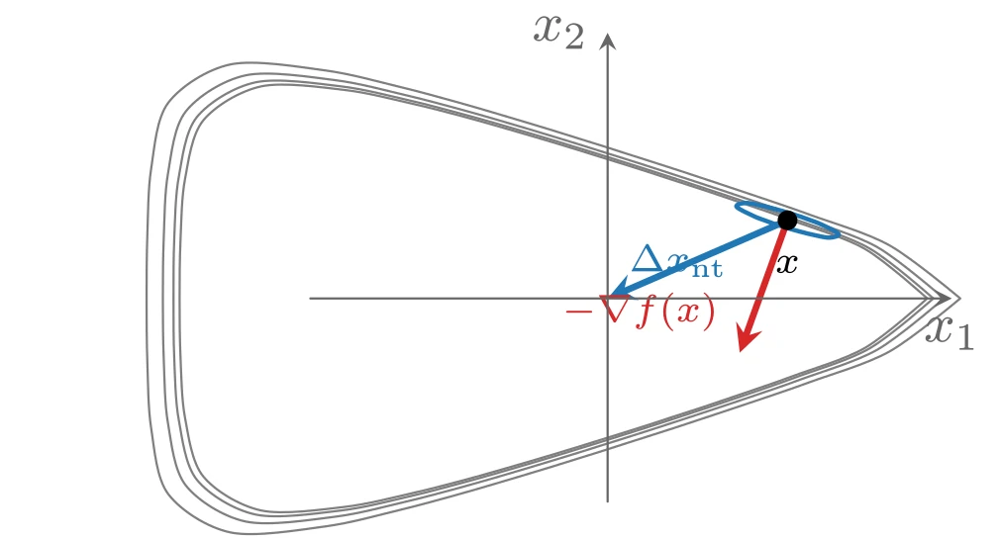
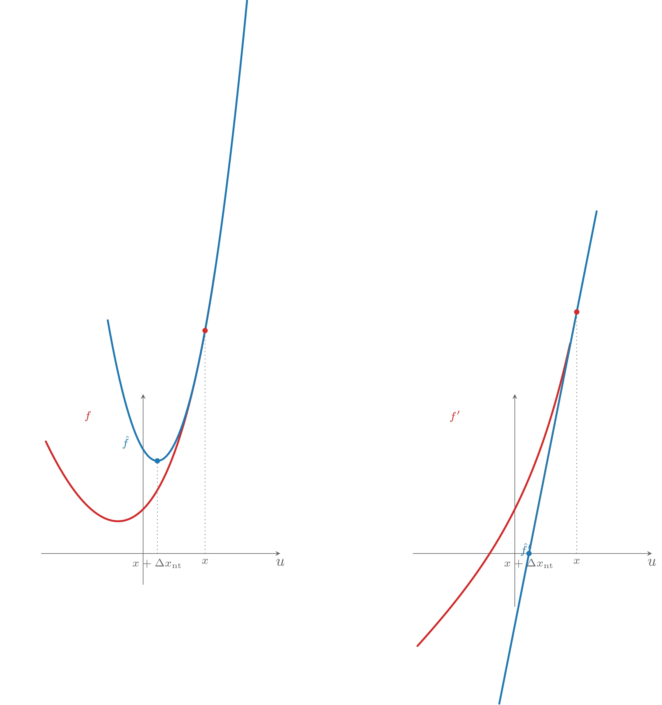
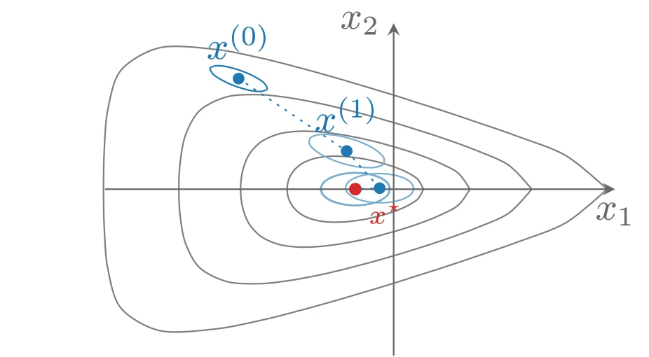

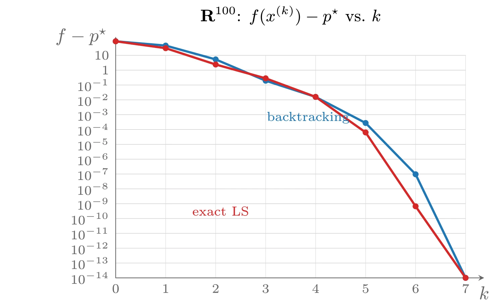
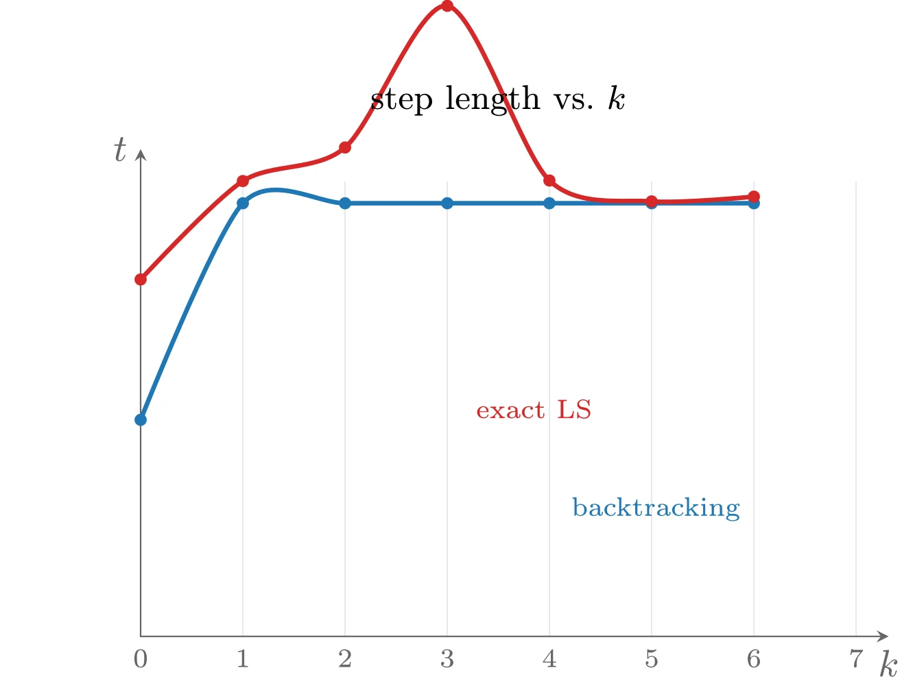
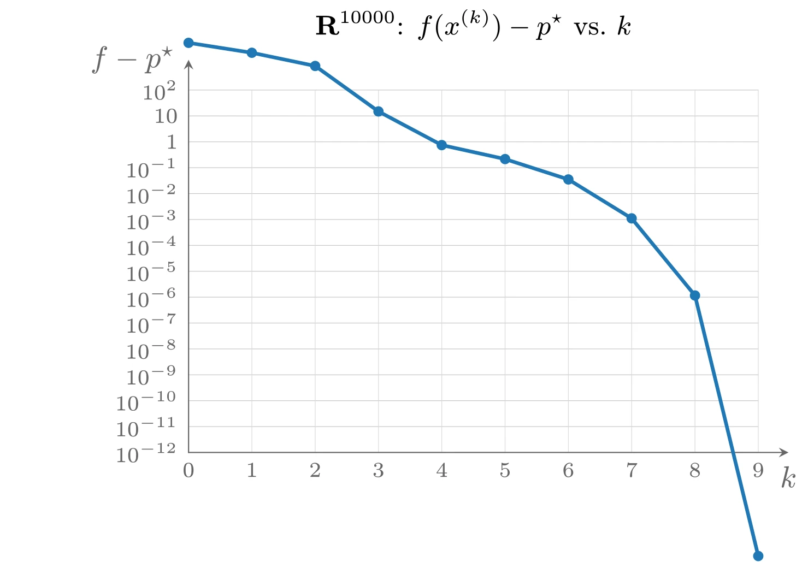

# Newton 方法

## Newton 步

设 $x \in \operatorname{dom} f$，向量

$$
\Delta x_{\mathrm{nt}} = -\nabla^2 f(x)^{-1}\nabla f(x)
$$

称为 $f$ 在 $x$ 处的 **Newton 步**&#8203;（Newton step）。由于 $\nabla^2 f(x)$ 正定，除非 $\nabla f(x) = 0$，总有

$$
\nabla f(x)^{\top}\Delta x_{\mathrm{nt}} = -\nabla f(x)^{\top}\nabla^2 f(x)^{-1}\nabla f(x) < 0
$$

因此 Newton 步是下降方向（除非 $x$ 已最优）。Newton 步可以从多个角度解释和引出。

### 二阶近似的极小点

$f$ 在 $x$ 处的二阶 Taylor 近似（或模型）为

$$
\hat{f}(x + v) = f(x) + \nabla f(x)^{\top}v + \frac{1}{2}v^{\top}\nabla^2 f(x)v
$$

它是 $v$ 的凸二次函数，在 $v = \Delta x_{\mathrm{nt}}$ 处取极小。因此 Newton 步 $\Delta x_{\mathrm{nt}}$ 正是使二阶近似最小的点所需要加上的一步。由此可以获得一些直觉：如果 $f$ 是二次函数，那么 $x + \Delta x_{\mathrm{nt}}$ 就是 $f$ 的精确极小点；如果 $f$ 接近二次函数，那么 $x + \Delta x_{\mathrm{nt}}$ 应当是极小点 $x^{\star}$ 的很好估计。由于 $f$ 二阶可微，当 $x$ 接近 $x^{\star}$ 时二次模型非常准确，因此 $x + \Delta x_{\mathrm{nt}}$ 应该是 $x^{\star}$ 的很好估计——这一直觉是正确的。

### Hessian 范数下的最速下降方向

Newton 步也是 $x$ 处由 Hessian 定义的二次范数

$$
\|u\|_{\nabla^2 f(x)} = (u^{\top}\nabla^2 f(x)u)^{1/2}
$$

下的最速下降方向。这提供了 Newton 步为何是好的搜索方向的另一种解释：回忆最速下降方法在二次范数 $\|\cdot\|_P$ 下、当坐标变换后的 Hessian 条件数很小时收敛很快，而 $x^{\star}$ 附近最好的选择是 $P = \nabla^2 f(x^{\star})$；当 $x$ 接近 $x^{\star}$ 时 $\nabla^2 f(x) \approx \nabla^2 f(x^{\star})$，这解释了为什么 Newton 步是非常好的搜索方向。



上图由下面的 TikZ 代码编译而来：

```tex

  \definecolor{cblue}{RGB}{31,119,180}
  \definecolor{cred}{RGB}{214,39,40}
  \definecolor{cgreen}{RGB}{44,160,44}
  \definecolor{corange}{RGB}{255,127,14}
  \definecolor{cpurple}{RGB}{148,103,189}
  \definecolor{cbrown}{RGB}{140,86,75}
  \definecolor{cpink}{RGB}{227,119,194}
  \definecolor{cgray}{RGB}{127,127,127}
\begin{tikzpicture}[x=1cm,y=1cm,>=stealth,line cap=round,line join=round]
  \draw[cgray] plot [smooth,tension=0.55] coordinates {(2.043,0.000) (1.646,0.316) (1.184,0.497) (0.855,0.612) (0.610,0.695) (0.413,0.759) (0.245,0.814) (0.093,0.862) (-0.052,0.907) (-0.196,0.952) (-0.347,0.998) (-0.512,1.047) (-0.705,1.103) (-0.942,1.169) (-1.253,1.247) (-1.681,1.334) (-2.214,1.357) (-2.584,1.140) (-2.701,0.765) (-2.730,0.378) (-2.736,0.000) (-2.730,-0.378) (-2.701,-0.765) (-2.584,-1.140) (-2.214,-1.357) (-1.681,-1.334) (-1.253,-1.247) (-0.942,-1.169) (-0.705,-1.103) (-0.512,-1.047) (-0.347,-0.998) (-0.196,-0.952) (-0.052,-0.907) (0.093,-0.862) (0.245,-0.814) (0.413,-0.759) (0.610,-0.695) (0.855,-0.612) (1.184,-0.497) (1.646,-0.316) (2.043,0.000)};
  \draw[cgray] plot [smooth,tension=0.55] coordinates {(2.082,0.000) (1.674,0.320) (1.205,0.504) (0.871,0.621) (0.623,0.704) (0.423,0.770) (0.253,0.825) (0.099,0.874) (-0.048,0.920) (-0.194,0.965) (-0.347,1.012) (-0.515,1.062) (-0.710,1.119) (-0.951,1.186) (-1.267,1.267) (-1.704,1.357) (-2.250,1.383) (-2.625,1.161) (-2.741,0.778) (-2.770,0.384) (-2.775,0.000) (-2.770,-0.384) (-2.741,-0.778) (-2.625,-1.161) (-2.250,-1.383) (-1.704,-1.357) (-1.267,-1.267) (-0.951,-1.186) (-0.710,-1.119) (-0.515,-1.062) (-0.347,-1.012) (-0.194,-0.965) (-0.048,-0.920) (0.099,-0.874) (0.253,-0.825) (0.423,-0.770) (0.623,-0.704) (0.871,-0.621) (1.205,-0.504) (1.674,-0.320) (2.082,0.000)};
  \draw[cgray] plot [smooth,tension=0.55] coordinates {(2.149,0.000) (1.724,0.328) (1.241,0.516) (0.899,0.635) (0.645,0.720) (0.441,0.787) (0.266,0.844) (0.109,0.894) (-0.041,0.941) (-0.190,0.988) (-0.347,1.036) (-0.519,1.088) (-0.719,1.147) (-0.967,1.217) (-1.292,1.301) (-1.743,1.397) (-2.312,1.428) (-2.696,1.197) (-2.810,0.800) (-2.837,0.394) (-2.843,0.000) (-2.837,-0.394) (-2.810,-0.800) (-2.696,-1.197) (-2.312,-1.428) (-1.743,-1.397) (-1.292,-1.301) (-0.967,-1.217) (-0.719,-1.147) (-0.519,-1.088) (-0.347,-1.036) (-0.190,-0.988) (-0.041,-0.941) (0.109,-0.894) (0.266,-0.844) (0.441,-0.787) (0.645,-0.720) (0.899,-0.635) (1.241,-0.516) (1.724,-0.328) (2.149,0.000)};
  \draw[cgray] plot [smooth,tension=0.55] coordinates {(2.254,0.000) (1.801,0.340) (1.297,0.534) (0.942,0.657) (0.679,0.745) (0.468,0.815) (0.288,0.873) (0.125,0.925) (-0.030,0.975) (-0.184,1.023) (-0.347,1.074) (-0.525,1.128) (-0.733,1.190) (-0.990,1.264) (-1.330,1.354) (-1.805,1.459) (-2.408,1.498) (-2.807,1.254) (-2.917,0.835) (-2.942,0.411) (-2.947,0.000) (-2.942,-0.411) (-2.917,-0.835) (-2.807,-1.254) (-2.408,-1.498) (-1.805,-1.459) (-1.330,-1.354) (-0.990,-1.264) (-0.733,-1.190) (-0.525,-1.128) (-0.347,-1.074) (-0.184,-1.023) (-0.030,-0.975) (0.125,-0.925) (0.288,-0.873) (0.468,-0.815) (0.679,-0.745) (0.942,-0.657) (1.297,-0.534) (1.801,-0.340) (2.254,0.000)};
  \draw[cblue,thick] plot [smooth,tension=0.6] coordinates {(1.298,0.500) (1.259,0.514) (1.235,0.523) (1.218,0.528) (1.206,0.532) (1.196,0.536) (1.188,0.538) (1.181,0.540) (1.175,0.542) (1.168,0.544) (1.162,0.546) (1.156,0.548) (1.150,0.550) (1.143,0.552) (1.135,0.554) (1.126,0.557) (1.115,0.560) (1.101,0.564) (1.080,0.570) (1.048,0.578) (0.991,0.592) (0.883,0.611) (0.824,0.587) (0.929,0.529) (1.002,0.500) (1.041,0.486) (1.065,0.477) (1.082,0.472) (1.094,0.468) (1.104,0.464) (1.112,0.462) (1.119,0.460) (1.125,0.458) (1.132,0.456) (1.138,0.454) (1.144,0.452) (1.150,0.450) (1.157,0.448) (1.165,0.446) (1.174,0.443) (1.185,0.440) (1.199,0.436) (1.220,0.430) (1.252,0.422) (1.309,0.408) (1.417,0.389) (1.476,0.413) (1.371,0.471) (1.298,0.500)};
  \draw[->,cblue,very thick] (1.1500,0.5000) -- (0,0) node[above right=0pt,font=\scriptsize] {$\Delta x_{\mathrm{nt}}$};
  \draw[->,cred,very thick] (1.1500,0.5000) -- (0.8448,-0.3467) node[above left=0pt,font=\scriptsize] {$-\nabla f(x)$};
  \draw[->,color=black!60] (-1.9,0) -- (2.2,0) node[below] {$x_1$};
  \draw[->,color=black!60] (0,-1.3) -- (0,1.7) node[left] {$x_2$};
  \fill (1.1500,0.5000) circle (1.8pt) node[below=3pt,font=\scriptsize] {$x$};
\end{tikzpicture}
```

### 线性化最优性条件的解

将最优性条件 $\nabla f(x^{\star}) = 0$ 在 $x$ 附近线性化：

$$
\nabla f(x + v) \approx \nabla f(x) + \nabla^2 f(x)v = 0
$$

这是关于 $v$ 的线性方程，其解为 $v = \Delta x_{\mathrm{nt}}$。所以 Newton 步正是使线性化的最优性条件成立所需加上的一步。当 $n = 1$（即 $f: \mathbf{R} \rightarrow \mathbf{R}$）时这个解释特别简单：解 $x^{\star}$ 由 $f'(x^{\star}) = 0$ 刻画，即 $f'$（单调递增）的零点；给定当前近似 $x$，对 $f'$ 作一阶 Taylor 近似，该仿射近似的零点就是 $x + \Delta x_{\mathrm{nt}}$。



上图由下面的 TikZ 代码编译而来：

```tex

  \definecolor{cblue}{RGB}{31,119,180}
  \definecolor{cred}{RGB}{214,39,40}
  \definecolor{cgreen}{RGB}{44,160,44}
  \definecolor{corange}{RGB}{255,127,14}
  \definecolor{cpurple}{RGB}{148,103,189}
  \definecolor{cbrown}{RGB}{140,86,75}
  \definecolor{cpink}{RGB}{227,119,194}
  \definecolor{cgray}{RGB}{127,127,127}
\begin{tikzpicture}[x=1cm,y=1cm,>=stealth,line cap=round,line join=round]
  \begin{scope}
    \draw[->,color=black!60] (-2.3,0) -- (3.1,0) node[below] {$u$};
    \draw[->,color=black!60] (0,-0.7) -- (0,3.6) node[left] {};
    \draw[cred,very thick,domain=-2.2:1.62,samples=60] plot (\x,{exp(\x)+0.5*\x*\x});
    \draw[cblue,very thick,domain=-0.8000:2.3500,samples=60] plot (\x,{5.0352+5.4552*(\x-1.4000)+0.5*5.0552*(\x-1.4000)*(\x-1.4000)});
    \draw[color=black!55,dotted] (1.4000,0) -- (1.4000,5.0352);
    \draw[color=black!55,dotted] (0.3209,0) -- (0.3209,2.0918);
    \fill[cred] (1.4000,5.0352) circle (1.7pt);
    \fill[cblue] (0.3209,2.0918) circle (1.7pt);
    \node[below,font=\scriptsize,color=black!60] at (1.4000,0) {$x$};
    \node[below,font=\scriptsize,color=black!60] at (0.3209,0) {$x+\Delta x_{\mathrm{nt}}$};
    \node[font=\scriptsize,color=cred] at (-1.25,3.1) {$f$};
    \node[font=\scriptsize,color=cblue] at (-0.3991,2.5118) {$\hat{f}$};
  \end{scope}
  \begin{scope}[xshift=8.4cm]
    \draw[->,color=black!60] (-2.3,0) -- (3.1,0) node[below] {$u$};
    \draw[->,color=black!60] (0,-1.2) -- (0,3.6) node[left] {};
    \draw[cred,very thick,domain=-2.2:1.25,samples=60] plot (\x,{exp(\x)+\x});
    \draw[cblue,very thick,domain=-0.3500:1.8500] plot (\x,{5.4552+5.0552*(\x-1.4000)});
    \draw[color=black!55,dotted] (1.4000,0) -- (1.4000,5.4552);
    \draw[color=black!55,dotted] (0.3209,0) -- (1.4000,5.4552);
    \fill[cred] (1.4000,5.4552) circle (1.7pt);
    \fill[cblue] (0.3209,0) circle (1.7pt);
    \node[below,font=\scriptsize,color=black!60] at (1.4000,0) {$x$};
    \node[below,font=\scriptsize,color=black!60] at (0.3209,0) {$x+\Delta x_{\mathrm{nt}}$};
    \node[font=\scriptsize,color=cred] at (-1.35,3.1) {$f'$};
    \node[font=\scriptsize,color=cblue] at (0.2500,0.0917) {$\hat{f}'$};
  \end{scope}
\end{tikzpicture}
```

### Newton 步的仿射不变性

Newton 步的一个重要特征是它不依赖于线性（或仿射）坐标变换。设 $T \in \mathbf{R}^{n \times n}$ 非奇异，定义 $\bar{f}(y) = f(Ty)$，则

$$
\nabla \bar{f}(y) = T^{\top}\nabla f(x), \quad \nabla^2 \bar{f}(y) = T^{\top}\nabla^2 f(x)T
$$

其中 $x = Ty$。$\bar{f}$ 在 $y$ 处的 Newton 步为

$$
\Delta y_{\mathrm{nt}} = -\left(T^{\top}\nabla^2 f(x)T\right)^{-1} T^{\top}\nabla f(x) = T^{-1}\Delta x_{\mathrm{nt}}
$$

即 $\bar{f}$ 与 $f$ 的 Newton 步通过同一个线性变换相联系：$x + \Delta x_{\mathrm{nt}} = T(y + \Delta y_{\mathrm{nt}})$。

## Newton 减量

量

$$
\lambda(x) = \left(\nabla f(x)^{\top}\nabla^2 f(x)^{-1}\nabla f(x)\right)^{1/2}
$$

称为 $x$ 处的 **Newton 减量**&#8203;（Newton decrement）。它在 Newton 方法的分析中起着重要作用，也可用作终止准则。Newton 减量与量 $f(x) - \inf_y \hat{f}(y)$（$\hat{f}$ 为 $f$ 在 $x$ 处的二阶近似）的关系是

$$
f(x) - \inf_y \hat{f}(y) = f(x) - \hat{f}(x + \Delta x_{\mathrm{nt}}) = \frac{\lambda(x)^2}{2}
$$

即 $\lambda^2/2$ 是基于 $x$ 处二次近似的 $f(x) - p^{\star}$ 的估计。

Newton 减量也可以表示为

$$
\lambda(x) = \left(\Delta x_{\mathrm{nt}}^{\top}\nabla^2 f(x)\Delta x_{\mathrm{nt}}\right)^{1/2}
$$

这说明 $\lambda$ 是 Newton 步在 Hessian 定义的二次范数下的范数。Newton 减量还出现在回溯直线搜索中，因为

$$
\nabla f(x)^{\top}\Delta x_{\mathrm{nt}} = -\lambda(x)^2
$$

它可以解释为 $f$ 在 $x$ 处沿 Newton 步方向的方向导数。最后，与 Newton 步一样，Newton 减量也是仿射不变的：$\bar{f}(y) = f(Ty)$（$T$ 非奇异）在 $y$ 处的 Newton 减量与 $f$ 在 $x = Ty$ 处的相等。

## Newton 方法

下面的算法有时称为**阻尼**&#8203;（damped）Newton 方法或**受保护**&#8203;（guarded）Newton 方法，以区别于使用固定步长 $t = 1$ 的**纯**&#8203;（pure）Newton 方法。

**算法 9.5（Newton 方法）** 给定初始点 $x \in \operatorname{dom} f$，容许误差 $\epsilon > 0$。

1. 计算 Newton 步与减量：$\Delta x_{\mathrm{nt}} := -\nabla^2 f(x)^{-1}\nabla f(x)$；$\lambda^2 := \nabla f(x)^{\top}\nabla^2 f(x)^{-1}\nabla f(x)$。
2. **终止准则**&#8203;：若 $\lambda^2/2 \leqslant \epsilon$ 则退出。
3. **直线搜索**&#8203;：用回溯直线搜索选取步长 $t$。
4. 更新：$x := x + t\Delta x_{\mathrm{nt}}$。

这与一般下降方法基本相同，只是用 Newton 步作搜索方向，且终止准则在计算搜索方向之后（而不是更新之后）检查。

## 收敛性分析

假设 $f$ 二阶连续可微且强凸（常数 $m$，即 $\nabla^2 f(x) \succeq mI$，$x \in S$），从而也存在 $M > 0$ 使 $\nabla^2 f(x) \preceq MI$。此外假设 $f$ 的 Hessian 在 $S$ 上 Lipschitz 连续（常数 $L$）：

$$
\|\nabla^2 f(x) - \nabla^2 f(y)\|_2 \leqslant L\|x - y\|_2
$$

$L$ 可以理解为对 $f$ 三阶导数的界（二次函数时 $L = 0$），衡量了 $f$ 能被二次模型近似的好坏，可以预期它在 Newton 方法的性能中起关键作用。

### 收敛证明的思路

可以证明存在满足 $0 < \eta \leqslant m^2/L$ 的 $\eta$ 和 $\gamma > 0$，使得：

- 若 $\|\nabla f(x^{(k)})\|_2 \geqslant \eta$，则 $f(x^{(k+1)}) - f(x^{(k)}) \leqslant -\gamma$；
- 若 $\|\nabla f(x^{(k)})\|_2 < \eta$，则回溯直线搜索选择 $t^{(k)} = 1$，且

$$
\frac{L}{2m^2}\|\nabla f(x^{(k+1)})\|_2^2 \leqslant \left(\frac{L}{2m^2}\|\nabla f(x^{(k)})\|_2^2\right)^2
$$

分析第二个条件：一旦它对第 $k$ 次迭代成立，由 $\eta \leqslant m^2/L$ 可知它对之后的每次迭代都成立，即此后算法总取全步长 $t = 1$，且递归应用可得

$$
f(x^{(l)}) - p^{\star} \leqslant \frac{1}{2m}\|\nabla f(x^{(l)})\|_2^2 \leqslant \frac{2m^3}{L^2}\left(\frac{1}{2}\right)^{2(l-k)+1}
$$

这说明第二条件成立后收敛极其迅速，这一现象称为**二次收敛**&#8203;（quadratic convergence）：大致地说，在足够多次迭代之后，每次迭代会使正确数字的位数翻倍。

Newton 方法的迭代自然分为两个阶段。第二阶段（条件 $\|\nabla f(x)\|_2 \leqslant \eta$ 成立之后）称为**二次收敛阶段**&#8203;；第一阶段称为**阻尼 Newton 阶段**&#8203;（damped Newton phase），因为算法可能选取小于 1 的步长。（二次收敛阶段也称为**纯 Newton 阶段**&#8203;，因为此时总取步长 $t = 1$。）

### 复杂度估计

阻尼 Newton 阶段中 $f$ 每次迭代至少下降 $\gamma$，因此其迭代次数不超过 $(f(x^{(0)}) - p^{\star})/\gamma$。二次收敛阶段由上面的不等式可知，至多

$$
\log_2 \log_2(\epsilon_0/\epsilon)
$$

次迭代（其中 $\epsilon_0 = 2m^3/L^2$）即可使 $f(x) - p^{\star} \leqslant \epsilon$。因此总迭代次数的上界为

$$
\frac{f(x^{(0)}) - p^{\star}}{\gamma} + \log_2 \log_2(\epsilon_0/\epsilon)
$$

其中 $\log_2 \log_2(\epsilon_0/\epsilon)$ 随要求的精度 $\epsilon$ 增长极慢，实际上可以视为常数（比如五或六；六次二次收敛阶段的迭代即可达到约 $5 \cdot 10^{-20}\,\epsilon_0$ 的精度）。于是可以（不太严格地）说，极小化 $f$ 所需的 Newton 迭代次数不超过

$$
\frac{f(x^{(0)}) - p^{\star}}{\gamma} + 6
$$

更精确的表述是：该式是计算极好近似解所需迭代次数的界。

### 阻尼 Newton 阶段

设 $\|\nabla f(x)\|_2 \geqslant \eta$。由 Hessian 上界及 $\lambda(x)^2 \geqslant m\|\Delta x_{\mathrm{nt}}\|_2^2$ 可得

$$
f(x + t\Delta x_{\mathrm{nt}}) \leqslant f(x) - t\lambda(x)^2 + \frac{M}{2m}t^2\lambda(x)^2
$$

步长 $\hat{t} = m/M$ 满足直线搜索的终止条件，因此直线搜索返回的步长 $t \geqslant \beta m/M$，目标函数的下降量满足

$$
f(x^{+}) - f(x) \leqslant -\alpha t\lambda(x)^2 \leqslant -\alpha\beta\frac{m}{M^2}\eta^2
$$

（利用 $\lambda(x)^2 = \nabla f(x)^{\top}\nabla^2 f(x)^{-1}\nabla f(x) \geqslant (1/M)\|\nabla f(x)\|_2^2$。）于是第一条性质成立，且

$$
\gamma = \alpha\beta\eta^2\frac{m}{M^2}
$$

### 二次收敛阶段

设 $\|\nabla f(x)\|_2 < \eta$。利用 Hessian 的 Lipschitz 条件，对 $\tilde{f}(t) = f(x + t\Delta x_{\mathrm{nt}})$ 有

$$
\tilde{f}''(t) \leqslant \lambda(x)^2 + t\frac{L}{m^{3/2}}\lambda(x)^3
$$

积分两次并取 $t = 1$ 得

$$
f(x + \Delta x_{\mathrm{nt}}) \leqslant f(x) - \frac{1}{2}\lambda(x)^2 + \frac{L}{6m^{3/2}}\lambda(x)^3
$$

若 $\eta \leqslant 3(1 - 2\alpha)m^2/L$，则由强凸性 $\lambda(x) \leqslant 3(1 - 2\alpha)m^{3/2}/L$，代入上式可知单位步长 $t = 1$ 满足回溯直线搜索的充分下降条件。此外，由 Lipschitz 条件可证

$$
\|\nabla f(x^{+})\|_2 \leqslant \frac{L}{2m^2}\|\nabla f(x)\|_2^2
$$

即第二条性质。综上，当

$$
\eta = \min\{1, 3(1 - 2\alpha)\}\frac{m^2}{L}
$$

时算法选取单位步并满足二次收敛条件。总迭代次数的上界为

$$
6 + \frac{M^2L^2/m^5}{\alpha\beta(1 - 2\alpha)^2 \min\{1, 9(1 - 2\alpha)^2\}}\left(f(x^{(0)}) - p^{\star}\right)
$$

## 例子

### $\mathbf{R}^2$ 中的例子

对前文的非二次测试函数采用参数 $\alpha = 0.1$、$\beta = 0.7$ 的回溯直线搜索：Newton 方法只需五次迭代就达到很高精度，二次收敛十分明显——最后一步把误差从约 $10^{-5}$ 降到 $10^{-10}$。该方法之所以有效，是因为椭圆体 $\{x \mid \|x - x^{(k)}\|_{\nabla^2 f(x^{(k)})} \leqslant 1\}$ 很好地近似了下水平集的形状。



上图由下面的 TikZ 代码编译而来：

```tex

  \definecolor{cblue}{RGB}{31,119,180}
  \definecolor{cred}{RGB}{214,39,40}
  \definecolor{cgreen}{RGB}{44,160,44}
  \definecolor{corange}{RGB}{255,127,14}
  \definecolor{cpurple}{RGB}{148,103,189}
  \definecolor{cbrown}{RGB}{140,86,75}
  \definecolor{cpink}{RGB}{227,119,194}
  \definecolor{cgray}{RGB}{127,127,127}
\begin{tikzpicture}[x=1cm,y=1cm,>=stealth,line cap=round,line join=round]
  \draw[cgray] plot [smooth,tension=0.55] coordinates {(0.269,0.000) (0.218,0.089) (0.121,0.152) (0.030,0.192) (-0.046,0.218) (-0.110,0.237) (-0.164,0.251) (-0.213,0.262) (-0.258,0.272) (-0.302,0.279) (-0.347,0.286) (-0.393,0.291) (-0.443,0.296) (-0.499,0.298) (-0.563,0.298) (-0.638,0.292) (-0.725,0.275) (-0.815,0.239) (-0.893,0.178) (-0.945,0.095) (-0.962,0.000) (-0.945,-0.095) (-0.893,-0.178) (-0.815,-0.239) (-0.725,-0.275) (-0.638,-0.292) (-0.563,-0.298) (-0.499,-0.298) (-0.443,-0.296) (-0.393,-0.291) (-0.347,-0.286) (-0.302,-0.279) (-0.258,-0.272) (-0.213,-0.262) (-0.164,-0.251) (-0.110,-0.237) (-0.046,-0.218) (0.030,-0.192) (0.121,-0.152) (0.218,-0.089) (0.269,0.000)};
  \draw[cgray] plot [smooth,tension=0.55] coordinates {(0.689,0.000) (0.581,0.147) (0.401,0.243) (0.249,0.304) (0.129,0.345) (0.029,0.376) (-0.056,0.400) (-0.132,0.421) (-0.204,0.439) (-0.274,0.455) (-0.347,0.470) (-0.423,0.485) (-0.509,0.499) (-0.608,0.512) (-0.726,0.522) (-0.870,0.523) (-1.035,0.500) (-1.193,0.431) (-1.306,0.312) (-1.365,0.161) (-1.382,0.000) (-1.365,-0.161) (-1.306,-0.312) (-1.193,-0.431) (-1.035,-0.500) (-0.870,-0.523) (-0.726,-0.522) (-0.608,-0.512) (-0.509,-0.499) (-0.423,-0.485) (-0.347,-0.470) (-0.274,-0.455) (-0.204,-0.439) (-0.132,-0.421) (-0.056,-0.400) (0.029,-0.376) (0.129,-0.345) (0.249,-0.304) (0.401,-0.243) (0.581,-0.147) (0.689,0.000)};
  \draw[cgray] plot [smooth,tension=0.55] coordinates {(1.247,0.000) (1.036,0.219) (0.740,0.353) (0.512,0.438) (0.337,0.497) (0.196,0.542) (0.075,0.580) (-0.035,0.612) (-0.138,0.642) (-0.240,0.670) (-0.347,0.698) (-0.462,0.728) (-0.593,0.759) (-0.750,0.792) (-0.948,0.827) (-1.201,0.854) (-1.499,0.837) (-1.748,0.714) (-1.877,0.497) (-1.927,0.250) (-1.940,0.000) (-1.927,-0.250) (-1.877,-0.497) (-1.748,-0.714) (-1.499,-0.837) (-1.201,-0.854) (-0.948,-0.827) (-0.750,-0.792) (-0.593,-0.759) (-0.462,-0.728) (-0.347,-0.698) (-0.240,-0.670) (-0.138,-0.642) (-0.035,-0.612) (0.075,-0.580) (0.196,-0.542) (0.337,-0.497) (0.512,-0.438) (0.740,-0.353) (1.036,-0.219) (1.247,0.000)};
  \draw[cgray] plot [smooth,tension=0.55] coordinates {(1.927,0.000) (1.558,0.302) (1.121,0.477) (0.806,0.587) (0.571,0.667) (0.382,0.729) (0.220,0.780) (0.075,0.827) (-0.064,0.870) (-0.202,0.912) (-0.347,0.955) (-0.505,1.002) (-0.689,1.054) (-0.915,1.115) (-1.209,1.188) (-1.611,1.264) (-2.108,1.280) (-2.461,1.077) (-2.580,0.726) (-2.613,0.359) (-2.620,0.000) (-2.613,-0.359) (-2.580,-0.726) (-2.461,-1.077) (-2.108,-1.280) (-1.611,-1.264) (-1.209,-1.188) (-0.915,-1.115) (-0.689,-1.054) (-0.505,-1.002) (-0.347,-0.955) (-0.202,-0.912) (-0.064,-0.870) (0.075,-0.827) (0.220,-0.780) (0.382,-0.729) (0.571,-0.667) (0.806,-0.587) (1.121,-0.477) (1.558,-0.302) (1.927,0.000)};
  \draw[cblue] plot [smooth,tension=0.55] coordinates {(-1.225,1.000) (-1.267,1.023) (-1.296,1.038) (-1.318,1.047) (-1.335,1.055) (-1.349,1.060) (-1.362,1.065) (-1.375,1.070) (-1.387,1.074) (-1.400,1.079) (-1.415,1.083) (-1.432,1.089) (-1.455,1.095) (-1.486,1.103) (-1.533,1.112) (-1.602,1.116) (-1.658,1.094) (-1.631,1.041) (-1.575,1.000) (-1.533,0.977) (-1.504,0.962) (-1.482,0.953) (-1.465,0.945) (-1.451,0.940) (-1.438,0.935) (-1.425,0.930) (-1.413,0.926) (-1.400,0.921) (-1.385,0.917) (-1.368,0.911) (-1.345,0.905) (-1.314,0.897) (-1.267,0.888) (-1.198,0.884) (-1.142,0.906) (-1.169,0.959) (-1.225,1.000)};
  \draw[cblue!60] plot [smooth,tension=0.55] coordinates {(-0.147,0.345) (-0.207,0.383) (-0.254,0.406) (-0.290,0.422) (-0.318,0.433) (-0.342,0.442) (-0.364,0.449) (-0.384,0.455) (-0.403,0.461) (-0.424,0.466) (-0.446,0.472) (-0.472,0.478) (-0.504,0.484) (-0.546,0.490) (-0.603,0.495) (-0.679,0.492) (-0.752,0.464) (-0.758,0.403) (-0.701,0.345) (-0.641,0.306) (-0.594,0.283) (-0.558,0.267) (-0.529,0.256) (-0.505,0.247) (-0.484,0.240) (-0.464,0.234) (-0.444,0.228) (-0.424,0.223) (-0.401,0.217) (-0.375,0.212) (-0.344,0.205) (-0.302,0.199) (-0.245,0.195) (-0.169,0.197) (-0.095,0.225) (-0.090,0.286) (-0.147,0.345)};
  \draw[cblue!60] plot [smooth,tension=0.55] coordinates {(0.183,0.009) (0.157,0.059) (0.107,0.094) (0.056,0.114) (0.013,0.126) (-0.023,0.132) (-0.052,0.137) (-0.079,0.139) (-0.103,0.140) (-0.126,0.141) (-0.149,0.141) (-0.174,0.140) (-0.200,0.138) (-0.231,0.134) (-0.267,0.128) (-0.312,0.116) (-0.364,0.096) (-0.414,0.060) (-0.435,0.009) (-0.409,-0.041) (-0.359,-0.076) (-0.308,-0.096) (-0.265,-0.107) (-0.230,-0.114) (-0.200,-0.118) (-0.173,-0.121) (-0.149,-0.122) (-0.126,-0.123) (-0.103,-0.123) (-0.078,-0.122) (-0.052,-0.120) (-0.021,-0.116) (0.015,-0.109) (0.060,-0.098) (0.112,-0.077) (0.162,-0.042) (0.183,0.009)};
  \draw[cblue!60] plot [smooth,tension=0.55] coordinates {(-0.030,0.002) (-0.051,0.054) (-0.096,0.092) (-0.146,0.116) (-0.190,0.130) (-0.228,0.139) (-0.261,0.144) (-0.290,0.147) (-0.317,0.148) (-0.343,0.149) (-0.369,0.149) (-0.396,0.147) (-0.425,0.144) (-0.458,0.139) (-0.496,0.130) (-0.541,0.116) (-0.591,0.092) (-0.636,0.054) (-0.655,0.002) (-0.635,-0.050) (-0.590,-0.088) (-0.540,-0.112) (-0.495,-0.126) (-0.458,-0.135) (-0.425,-0.140) (-0.396,-0.143) (-0.369,-0.145) (-0.343,-0.145) (-0.317,-0.145) (-0.290,-0.143) (-0.261,-0.140) (-0.228,-0.135) (-0.190,-0.127) (-0.145,-0.112) (-0.095,-0.088) (-0.050,-0.050) (-0.030,0.002)};
  \draw[cblue!60] plot [smooth,tension=0.55] coordinates {(-0.034,0.000) (-0.054,0.052) (-0.099,0.090) (-0.149,0.114) (-0.193,0.128) (-0.232,0.137) (-0.264,0.142) (-0.294,0.145) (-0.321,0.147) (-0.347,0.147) (-0.372,0.147) (-0.399,0.145) (-0.429,0.142) (-0.462,0.137) (-0.500,0.128) (-0.544,0.114) (-0.594,0.090) (-0.639,0.052) (-0.659,0.000) (-0.639,-0.052) (-0.594,-0.090) (-0.544,-0.114) (-0.500,-0.128) (-0.462,-0.137) (-0.429,-0.142) (-0.399,-0.145) (-0.372,-0.147) (-0.347,-0.147) (-0.321,-0.147) (-0.294,-0.145) (-0.264,-0.142) (-0.232,-0.137) (-0.193,-0.128) (-0.149,-0.114) (-0.099,-0.090) (-0.054,-0.052) (-0.034,0.000)};
  \draw[cblue!60] plot [smooth,tension=0.55] coordinates {(-0.034,0.000) (-0.054,0.052) (-0.099,0.090) (-0.149,0.114) (-0.193,0.128) (-0.232,0.137) (-0.264,0.142) (-0.294,0.145) (-0.321,0.147) (-0.347,0.147) (-0.372,0.147) (-0.399,0.145) (-0.429,0.142) (-0.462,0.137) (-0.500,0.128) (-0.544,0.114) (-0.594,0.090) (-0.639,0.052) (-0.659,0.000) (-0.639,-0.052) (-0.594,-0.090) (-0.544,-0.114) (-0.500,-0.128) (-0.462,-0.137) (-0.429,-0.142) (-0.399,-0.145) (-0.372,-0.147) (-0.347,-0.147) (-0.321,-0.147) (-0.294,-0.145) (-0.264,-0.142) (-0.232,-0.137) (-0.193,-0.128) (-0.149,-0.114) (-0.099,-0.090) (-0.054,-0.052) (-0.034,0.000)};
  \draw[->,color=black!60] (-2.6,0) -- (2.0,0) node[below] {$x_1$};
  \draw[->,color=black!60] (0,-1.5) -- (0,1.5) node[left] {$x_2$};
  \draw[cblue,dotted] plot coordinates {(-1.400,1.000) (-0.424,0.345) (-0.126,0.009) (-0.343,0.002) (-0.347,0.000) (-0.347,0.000)};
  \fill[cblue] (-1.400,1.000) circle (1.5pt) node[above=1.5pt] {$x^{(0)}$};
  \fill[cblue] (-0.424,0.345) circle (1.5pt) node[above=1.5pt] {$x^{(1)}$};
  \fill[cblue] (-0.126,0.009) circle (1.5pt);
  \fill[cblue] (-0.343,0.002) circle (1.5pt);
  \fill[cblue] (-0.347,0.000) circle (1.5pt);
  \fill[cblue] (-0.347,0.000) circle (1.5pt);
  \fill[cred] (-0.3466,0.0000) circle (1.6pt) node[below right=0pt,font=\scriptsize] {$x^{\star}$};
\end{tikzpicture}
```


上图由下面的 TikZ 代码编译而来：

```tex

  \definecolor{cblue}{RGB}{31,119,180}
  \definecolor{cred}{RGB}{214,39,40}
  \definecolor{cgreen}{RGB}{44,160,44}
  \definecolor{corange}{RGB}{255,127,14}
  \definecolor{cpurple}{RGB}{148,103,189}
  \definecolor{cbrown}{RGB}{140,86,75}
  \definecolor{cpink}{RGB}{227,119,194}
  \definecolor{cgray}{RGB}{127,127,127}
\begin{tikzpicture}[x=1cm,y=1cm,>=stealth,line cap=round,line join=round]
  \draw[color=black!25,very thin] (0.0000,0.0000) -- (6.6000,0.0000) (0.0000,0.3231) -- (6.6000,0.3231) (0.0000,0.6462) -- (6.6000,0.6462) (0.0000,0.9692) -- (6.6000,0.9692) (0.0000,1.2923) -- (6.6000,1.2923) (0.0000,1.6154) -- (6.6000,1.6154) (0.0000,1.9385) -- (6.6000,1.9385) (0.0000,2.2615) -- (6.6000,2.2615) (0.0000,2.5846) -- (6.6000,2.5846) (0.0000,2.9077) -- (6.6000,2.9077) (0.0000,3.2308) -- (6.6000,3.2308) (0.0000,3.5538) -- (6.6000,3.5538) (0.0000,3.8769) -- (6.6000,3.8769) (0.0000,4.2000) -- (6.6000,4.2000);
  \draw[color=black!15,very thin] (0.0000,0.0000) -- (0.0000,4.2000) (1.3200,0.0000) -- (1.3200,4.2000) (2.6400,0.0000) -- (2.6400,4.2000) (3.9600,0.0000) -- (3.9600,4.2000) (5.2800,0.0000) -- (5.2800,4.2000) (6.6000,0.0000) -- (6.6000,4.2000);
  \draw[->,color=black!60] (0.0000,0.0000) -- (6.9500,0.0000) node[anchor=west,xshift=2pt,yshift=-6pt] {$k$};
  \draw[->,color=black!60] (0.0000,0.0000) -- (0.0000,4.5500) node[left=1pt] {$f-p^{\star}$};
  \node[left,font=\scriptsize,color=black!60] at (0.0000,0.0000) {$10^{-12}$};
  \node[left,font=\scriptsize,color=black!60] at (0.0000,0.3231) {$10^{-11}$};
  \node[left,font=\scriptsize,color=black!60] at (0.0000,0.6462) {$10^{-10}$};
  \node[left,font=\scriptsize,color=black!60] at (0.0000,0.9692) {$10^{-9}$};
  \node[left,font=\scriptsize,color=black!60] at (0.0000,1.2923) {$10^{-8}$};
  \node[left,font=\scriptsize,color=black!60] at (0.0000,1.6154) {$10^{-7}$};
  \node[left,font=\scriptsize,color=black!60] at (0.0000,1.9385) {$10^{-6}$};
  \node[left,font=\scriptsize,color=black!60] at (0.0000,2.2615) {$10^{-5}$};
  \node[left,font=\scriptsize,color=black!60] at (0.0000,2.5846) {$10^{-4}$};
  \node[left,font=\scriptsize,color=black!60] at (0.0000,2.9077) {$10^{-3}$};
  \node[left,font=\scriptsize,color=black!60] at (0.0000,3.2308) {$10^{-2}$};
  \node[left,font=\scriptsize,color=black!60] at (0.0000,3.5538) {$10^{-1}$};
  \node[left,font=\scriptsize,color=black!60] at (0.0000,3.8769) {1};
  \node[left,font=\scriptsize,color=black!60] at (0.0000,4.2000) {$10$};
  \node[below,font=\scriptsize,color=black!60] at (0.0000,0.0000) {0};
  \node[below,font=\scriptsize,color=black!60] at (1.3200,0.0000) {1};
  \node[below,font=\scriptsize,color=black!60] at (2.6400,0.0000) {2};
  \node[below,font=\scriptsize,color=black!60] at (3.9600,0.0000) {3};
  \node[below,font=\scriptsize,color=black!60] at (5.2800,0.0000) {4};
  \node[below,font=\scriptsize,color=black!60] at (6.6000,0.0000) {5};
  \node[font=\small] at (3.3,4.95) {$\mathbf{R}^2$: $f(x^{(k)})-p^{\star}$ vs.\ $k$};
  \draw[cblue,very thick] plot coordinates {(0.000,4.119) (1.320,3.827) (2.640,3.489) (3.960,2.456) (5.280,0.843) (6.600,-93.046)};
  \fill[cblue] (0.000,4.119) circle (1.7pt);
  \fill[cblue] (1.320,3.827) circle (1.7pt);
  \fill[cblue] (2.640,3.489) circle (1.7pt);
  \fill[cblue] (3.960,2.456) circle (1.7pt);
  \fill[cblue] (5.280,0.843) circle (1.7pt);
  \fill[cblue] (6.600,-93.046) circle (1.7pt);
\end{tikzpicture}
```


### $\mathbf{R}^{100}$ 中的例子

对 $m = 500$、$n = 100$ 的对数障碍型问题，回溯直线搜索（$\alpha = 0.01$，$\beta = 0.5$）下八次迭代即达到很高精度，从第三次迭代起二次收敛就很明显。精确直线搜索只比回溯直线搜索快一次迭代——这也很典型：精确直线搜索通常只会给 Newton 方法带来很小的改进。步长曲线显示：经过两步阻尼步之后，回溯直线搜索总是取全步 $t = 1$。回溯参数 $\alpha$、$\beta$ 对 Newton 方法性能影响很小（$\beta$ 在 0.2 到 1 之间、$\alpha$ 在 0.005 到 0.5 之间变化时，迭代次数在 8 到 12 之间变化）。因此大多数实用实现采用较小的 $\alpha$（如 0.01）和较大的 $\beta$（如 0.5）。



上图由下面的 TikZ 代码编译而来：

```tex

  \definecolor{cblue}{RGB}{31,119,180}
  \definecolor{cred}{RGB}{214,39,40}
  \definecolor{cgreen}{RGB}{44,160,44}
  \definecolor{corange}{RGB}{255,127,14}
  \definecolor{cpurple}{RGB}{148,103,189}
  \definecolor{cbrown}{RGB}{140,86,75}
  \definecolor{cpink}{RGB}{227,119,194}
  \definecolor{cgray}{RGB}{127,127,127}
\begin{tikzpicture}[x=1cm,y=1cm,>=stealth,line cap=round,line join=round]
  \draw[color=black!25,very thin] (0.0000,0.0000) -- (6.6000,0.0000) (0.0000,0.2800) -- (6.6000,0.2800) (0.0000,0.5600) -- (6.6000,0.5600) (0.0000,0.8400) -- (6.6000,0.8400) (0.0000,1.1200) -- (6.6000,1.1200) (0.0000,1.4000) -- (6.6000,1.4000) (0.0000,1.6800) -- (6.6000,1.6800) (0.0000,1.9600) -- (6.6000,1.9600) (0.0000,2.2400) -- (6.6000,2.2400) (0.0000,2.5200) -- (6.6000,2.5200) (0.0000,2.8000) -- (6.6000,2.8000) (0.0000,3.0800) -- (6.6000,3.0800) (0.0000,3.3600) -- (6.6000,3.3600) (0.0000,3.6400) -- (6.6000,3.6400) (0.0000,3.9200) -- (6.6000,3.9200) (0.0000,4.2000) -- (6.6000,4.2000);
  \draw[color=black!15,very thin] (0.0000,0.0000) -- (0.0000,4.2000) (0.9429,0.0000) -- (0.9429,4.2000) (1.8857,0.0000) -- (1.8857,4.2000) (2.8286,0.0000) -- (2.8286,4.2000) (3.7714,0.0000) -- (3.7714,4.2000) (4.7143,0.0000) -- (4.7143,4.2000) (5.6571,0.0000) -- (5.6571,4.2000) (6.6000,0.0000) -- (6.6000,4.2000);
  \draw[->,color=black!60] (0.0000,0.0000) -- (6.9500,0.0000) node[anchor=west,xshift=2pt,yshift=-6pt] {$k$};
  \draw[->,color=black!60] (0.0000,0.0000) -- (0.0000,4.5500) node[left=1pt] {$f-p^{\star}$};
  \node[left,font=\scriptsize,color=black!60] at (0.0000,0.0000) {$10^{-14}$};
  \node[left,font=\scriptsize,color=black!60] at (0.0000,0.2800) {$10^{-13}$};
  \node[left,font=\scriptsize,color=black!60] at (0.0000,0.5600) {$10^{-12}$};
  \node[left,font=\scriptsize,color=black!60] at (0.0000,0.8400) {$10^{-11}$};
  \node[left,font=\scriptsize,color=black!60] at (0.0000,1.1200) {$10^{-10}$};
  \node[left,font=\scriptsize,color=black!60] at (0.0000,1.4000) {$10^{-9}$};
  \node[left,font=\scriptsize,color=black!60] at (0.0000,1.6800) {$10^{-8}$};
  \node[left,font=\scriptsize,color=black!60] at (0.0000,1.9600) {$10^{-7}$};
  \node[left,font=\scriptsize,color=black!60] at (0.0000,2.2400) {$10^{-6}$};
  \node[left,font=\scriptsize,color=black!60] at (0.0000,2.5200) {$10^{-5}$};
  \node[left,font=\scriptsize,color=black!60] at (0.0000,2.8000) {$10^{-4}$};
  \node[left,font=\scriptsize,color=black!60] at (0.0000,3.0800) {$10^{-3}$};
  \node[left,font=\scriptsize,color=black!60] at (0.0000,3.3600) {$10^{-2}$};
  \node[left,font=\scriptsize,color=black!60] at (0.0000,3.6400) {$10^{-1}$};
  \node[left,font=\scriptsize,color=black!60] at (0.0000,3.9200) {1};
  \node[left,font=\scriptsize,color=black!60] at (0.0000,4.2000) {$10$};
  \node[below,font=\scriptsize,color=black!60] at (0.0000,0.0000) {0};
  \node[below,font=\scriptsize,color=black!60] at (0.9429,0.0000) {1};
  \node[below,font=\scriptsize,color=black!60] at (1.8857,0.0000) {2};
  \node[below,font=\scriptsize,color=black!60] at (2.8286,0.0000) {3};
  \node[below,font=\scriptsize,color=black!60] at (3.7714,0.0000) {4};
  \node[below,font=\scriptsize,color=black!60] at (4.7143,0.0000) {5};
  \node[below,font=\scriptsize,color=black!60] at (5.6571,0.0000) {6};
  \node[below,font=\scriptsize,color=black!60] at (6.6000,0.0000) {7};
  \node[font=\small] at (3.3,4.95) {$\mathbf{R}^{100}$: $f(x^{(k)})-p^{\star}$ vs.\ $k$};
  \draw[cblue,very thick] plot coordinates {(0.000,4.465) (0.943,4.384) (1.886,4.123) (2.829,3.721) (3.771,3.415) (4.714,2.923) (5.657,1.955) (6.600,0.000)};
  \fill[cblue] (0.000,4.465) circle (1.6pt);
  \fill[cblue] (0.943,4.384) circle (1.6pt);
  \fill[cblue] (1.886,4.123) circle (1.6pt);
  \fill[cblue] (2.829,3.721) circle (1.6pt);
  \fill[cblue] (3.771,3.415) circle (1.6pt);
  \fill[cblue] (4.714,2.923) circle (1.6pt);
  \fill[cblue] (5.657,1.955) circle (1.6pt);
  \fill[cblue] (6.600,0.000) circle (1.6pt);
  \draw[cred,very thick] plot coordinates {(0.000,4.465) (0.943,4.335) (1.886,4.027) (2.829,3.766) (3.771,3.416) (4.714,2.745) (5.657,1.351) (6.600,0.000)};
  \fill[cred] (0.000,4.465) circle (1.6pt);
  \fill[cred] (0.943,4.335) circle (1.6pt);
  \fill[cred] (1.886,4.027) circle (1.6pt);
  \fill[cred] (2.829,3.766) circle (1.6pt);
  \fill[cred] (3.771,3.416) circle (1.6pt);
  \fill[cred] (4.714,2.745) circle (1.6pt);
  \fill[cred] (5.657,1.351) circle (1.6pt);
  \fill[cred] (6.600,0.000) circle (1.6pt);
  \node[font=\scriptsize,color=cblue] at (3.63,3.024) {backtracking};
  \node[font=\scriptsize,color=cred] at (1.9799999999999998,1.26) {exact LS};
\end{tikzpicture}
```


上图由下面的 TikZ 代码编译而来：

```tex

  \definecolor{cblue}{RGB}{31,119,180}
  \definecolor{cred}{RGB}{214,39,40}
  \definecolor{cgreen}{RGB}{44,160,44}
  \definecolor{corange}{RGB}{255,127,14}
  \definecolor{cpurple}{RGB}{148,103,189}
  \definecolor{cbrown}{RGB}{140,86,75}
  \definecolor{cpink}{RGB}{227,119,194}
  \definecolor{cgray}{RGB}{127,127,127}
\begin{tikzpicture}[x=1cm,y=1cm,>=stealth,line cap=round,line join=round]
  \draw[color=black!15,very thin] (0.0000,0) -- (0.0000,4.2) (0.9429,0) -- (0.9429,4.2) (1.8857,0) -- (1.8857,4.2) (2.8286,0) -- (2.8286,4.2) (3.7714,0) -- (3.7714,4.2) (4.7143,0) -- (4.7143,4.2) (5.6571,0) -- (5.6571,4.2) (6.6000,0) -- (6.6000,4.2) ;
  \draw[->,color=black!60] (0,0) -- (6.8999999999999995,0) node[below] {$k$};
  \draw[->,color=black!60] (0,0) -- (0,4.5) node[left] {$t$};
  \draw[cblue,very thick] plot [smooth] coordinates {(0.000,2.000) (0.943,4.000) (1.886,4.000) (2.829,4.000) (3.771,4.000) (4.714,4.000) (5.657,4.000)};
  \fill[cblue] (0.000,2.000) circle (1.6pt);
  \fill[cblue] (0.943,4.000) circle (1.6pt);
  \fill[cblue] (1.886,4.000) circle (1.6pt);
  \fill[cblue] (2.829,4.000) circle (1.6pt);
  \fill[cblue] (3.771,4.000) circle (1.6pt);
  \fill[cblue] (4.714,4.000) circle (1.6pt);
  \fill[cblue] (5.657,4.000) circle (1.6pt);
\draw[cred,very thick] plot [smooth] coordinates {(0.000,3.296) (0.943,4.205) (1.886,4.515) (2.829,5.823) (3.771,4.210) (4.714,4.017) (5.657,4.061)};
  \fill[cred] (0.000,3.296) circle (1.6pt);
  \fill[cred] (0.943,4.205) circle (1.6pt);
  \fill[cred] (1.886,4.515) circle (1.6pt);
  \fill[cred] (2.829,5.823) circle (1.6pt);
  \fill[cred] (3.771,4.210) circle (1.6pt);
  \fill[cred] (4.714,4.017) circle (1.6pt);
  \fill[cred] (5.657,4.061) circle (1.6pt);
  \node[below,font=\scriptsize,color=black!60] at (0.0000,0) {0};
  \node[below,font=\scriptsize,color=black!60] at (0.9429,0) {1};
  \node[below,font=\scriptsize,color=black!60] at (1.8857,0) {2};
  \node[below,font=\scriptsize,color=black!60] at (2.8286,0) {3};
  \node[below,font=\scriptsize,color=black!60] at (3.7714,0) {4};
  \node[below,font=\scriptsize,color=black!60] at (4.7143,0) {5};
  \node[below,font=\scriptsize,color=black!60] at (5.6571,0) {6};
  \node[below,font=\scriptsize,color=black!60] at (6.6000,0) {7};
  \node[font=\small] at (3.3,4.95) {step length vs.\ $k$};
  \node[font=\scriptsize,color=cblue] at (4.752,1.1760000000000002) {backtracking};
  \node[font=\scriptsize,color=cred] at (3.63,2.1) {exact LS};
\end{tikzpicture}
```


### $\mathbf{R}^{10000}$ 中的例子

考虑更大规模的问题

$$
\mathrm{minimize} \quad -\sum_{i=1}^n \log(1 - x_i^2) - \sum_{i=1}^m \log(b_i - a_i^{\top}x)
$$

其中 $m = 100000$，$n = 10000$（$a_i$ 为随机生成的稀疏向量）。参数 $\alpha = 0.01$、$\beta = 0.5$ 的回溯直线搜索下，性能与前面的例子非常相似：约 13 次迭代的初始线性收敛阶段之后是二次收敛阶段，再经过四五次迭代即达到很高精度。



上图由下面的 TikZ 代码编译而来：

```tex

  \definecolor{cblue}{RGB}{31,119,180}
  \definecolor{cred}{RGB}{214,39,40}
  \definecolor{cgreen}{RGB}{44,160,44}
  \definecolor{corange}{RGB}{255,127,14}
  \definecolor{cpurple}{RGB}{148,103,189}
  \definecolor{cbrown}{RGB}{140,86,75}
  \definecolor{cpink}{RGB}{227,119,194}
  \definecolor{cgray}{RGB}{127,127,127}
\begin{tikzpicture}[x=1cm,y=1cm,>=stealth,line cap=round,line join=round]
  \draw[color=black!25,very thin] (0.0000,0.0000) -- (6.6000,0.0000) (0.0000,0.3000) -- (6.6000,0.3000) (0.0000,0.6000) -- (6.6000,0.6000) (0.0000,0.9000) -- (6.6000,0.9000) (0.0000,1.2000) -- (6.6000,1.2000) (0.0000,1.5000) -- (6.6000,1.5000) (0.0000,1.8000) -- (6.6000,1.8000) (0.0000,2.1000) -- (6.6000,2.1000) (0.0000,2.4000) -- (6.6000,2.4000) (0.0000,2.7000) -- (6.6000,2.7000) (0.0000,3.0000) -- (6.6000,3.0000) (0.0000,3.3000) -- (6.6000,3.3000) (0.0000,3.6000) -- (6.6000,3.6000) (0.0000,3.9000) -- (6.6000,3.9000) (0.0000,4.2000) -- (6.6000,4.2000);
  \draw[color=black!15,very thin] (0.0000,0.0000) -- (0.0000,4.2000) (0.7333,0.0000) -- (0.7333,4.2000) (1.4667,0.0000) -- (1.4667,4.2000) (2.2000,0.0000) -- (2.2000,4.2000) (2.9333,0.0000) -- (2.9333,4.2000) (3.6667,0.0000) -- (3.6667,4.2000) (4.4000,0.0000) -- (4.4000,4.2000) (5.1333,0.0000) -- (5.1333,4.2000) (5.8667,0.0000) -- (5.8667,4.2000) (6.6000,0.0000) -- (6.6000,4.2000);
  \draw[->,color=black!60] (0.0000,0.0000) -- (6.9500,0.0000) node[anchor=west,xshift=2pt,yshift=-6pt] {$k$};
  \draw[->,color=black!60] (0.0000,0.0000) -- (0.0000,4.5500) node[left=1pt] {$f-p^{\star}$};
  \node[left,font=\scriptsize,color=black!60] at (0.0000,0.0000) {$10^{-12}$};
  \node[left,font=\scriptsize,color=black!60] at (0.0000,0.3000) {$10^{-11}$};
  \node[left,font=\scriptsize,color=black!60] at (0.0000,0.6000) {$10^{-10}$};
  \node[left,font=\scriptsize,color=black!60] at (0.0000,0.9000) {$10^{-9}$};
  \node[left,font=\scriptsize,color=black!60] at (0.0000,1.2000) {$10^{-8}$};
  \node[left,font=\scriptsize,color=black!60] at (0.0000,1.5000) {$10^{-7}$};
  \node[left,font=\scriptsize,color=black!60] at (0.0000,1.8000) {$10^{-6}$};
  \node[left,font=\scriptsize,color=black!60] at (0.0000,2.1000) {$10^{-5}$};
  \node[left,font=\scriptsize,color=black!60] at (0.0000,2.4000) {$10^{-4}$};
  \node[left,font=\scriptsize,color=black!60] at (0.0000,2.7000) {$10^{-3}$};
  \node[left,font=\scriptsize,color=black!60] at (0.0000,3.0000) {$10^{-2}$};
  \node[left,font=\scriptsize,color=black!60] at (0.0000,3.3000) {$10^{-1}$};
  \node[left,font=\scriptsize,color=black!60] at (0.0000,3.6000) {1};
  \node[left,font=\scriptsize,color=black!60] at (0.0000,3.9000) {$10$};
  \node[left,font=\scriptsize,color=black!60] at (0.0000,4.2000) {$10^{2}$};
  \node[below,font=\scriptsize,color=black!60] at (0.0000,0.0000) {0};
  \node[below,font=\scriptsize,color=black!60] at (0.7333,0.0000) {1};
  \node[below,font=\scriptsize,color=black!60] at (1.4667,0.0000) {2};
  \node[below,font=\scriptsize,color=black!60] at (2.2000,0.0000) {3};
  \node[below,font=\scriptsize,color=black!60] at (2.9333,0.0000) {4};
  \node[below,font=\scriptsize,color=black!60] at (3.6667,0.0000) {5};
  \node[below,font=\scriptsize,color=black!60] at (4.4000,0.0000) {6};
  \node[below,font=\scriptsize,color=black!60] at (5.1333,0.0000) {7};
  \node[below,font=\scriptsize,color=black!60] at (5.8667,0.0000) {8};
  \node[below,font=\scriptsize,color=black!60] at (6.6000,0.0000) {9};
  \node[font=\small] at (3.3,4.95) {$\mathbf{R}^{10000}$: $f(x^{(k)})-p^{\star}$ vs.\ $k$};
  \draw[cblue,very thick] plot coordinates {(0.000,4.747) (0.733,4.632) (1.467,4.479) (2.200,3.952) (2.933,3.562) (3.667,3.400) (4.400,3.164) (5.133,2.713) (5.867,1.819) (6.600,-1.200)};
  \fill[cblue] (0.000,4.747) circle (1.7pt);
  \fill[cblue] (0.733,4.632) circle (1.7pt);
  \fill[cblue] (1.467,4.479) circle (1.7pt);
  \fill[cblue] (2.200,3.952) circle (1.7pt);
  \fill[cblue] (2.933,3.562) circle (1.7pt);
  \fill[cblue] (3.667,3.400) circle (1.7pt);
  \fill[cblue] (4.400,3.164) circle (1.7pt);
  \fill[cblue] (5.133,2.713) circle (1.7pt);
  \fill[cblue] (5.867,1.819) circle (1.7pt);
  \fill[cblue] (6.600,-1.200) circle (1.7pt);
\end{tikzpicture}
```

### Newton 方法的仿射不变性

Newton 方法的一个非常重要的特征是它不依赖于线性（或仿射）坐标变换。设 $x^{(k)}$ 是对 $f$ 应用 Newton 方法得到的第 $k$ 个迭代点，$T$ 非奇异且 $\bar{f}(y) = f(Ty)$；若对 $\bar{f}$ 采用 Newton 方法（相同的回溯参数）并从 $y^{(0)} = T^{-1}x^{(0)}$ 出发，则对所有 $k$ 都有 $Ty^{(k)} = x^{(k)}$。换句话说，两个方法的迭代点通过同一坐标变换相联系，连终止准则也相同（Newton 减量是仿射不变的）。这与受坐标变换强烈影响的梯度（或最速下降）方法形成鲜明对比。

例如，对前文条件数随参数 $\gamma$ 变化的问题族，梯度方法在 $\gamma$ 小于 0.05 或大于 20 时慢到不可用；而 Newton 方法（$\alpha = 0.01$，$\beta = 0.5$）对 $10^{-10}$ 到 $10^{10}$ 之间的所有 $\gamma$ 都只需九次迭代（且达到更高的精度）。在实际实现中，由于有限精度算术，Newton 方法并非严格仿射不变，但条件数高达 $10^{10}$ 这样的量级也不会对实际实现造成不利影响。对梯度方法而言，可容忍的条件数范围要小得多。总之，坐标选择（或下水平集条件数）对梯度和最速下降方法是一阶问题，而对 Newton 方法只是二阶问题——它唯一的影响是计算 Newton 步所需的数值线性代数部分。

## 总结

与梯度和最速下降方法相比，Newton 方法有以下非常强的优点：

- 收敛一般很快，且在 $x^{\star}$ 附近是二次的。一旦进入二次收敛阶段，至多六次左右的迭代即可产生很高精度的解。
- Newton 方法是仿射不变的，对坐标选择和目标函数下水平集的条件数不敏感。
- Newton 方法对问题规模具有很好的伸缩性：它在 $\mathbf{R}^{10000}$ 问题上的表现与其在 $\mathbf{R}^{10}$ 问题上的表现相似，所需步数只有适度的增加。
- Newton 方法的良好性能不依赖于算法参数的选择；相比之下，最速下降方法中范数的选择对其性能起关键作用。

Newton 方法的主要缺点是形成和存储 Hessian 的代价，以及计算 Newton 步（需要求解一个线性方程组）的代价。许多情形下可以利用问题的结构显著降低计算 Newton 步的代价（见下文实现部分）。另一类替代算法是**拟 Newton**&#8203;（quasi-Newton）方法，它们形成搜索方向所需计算量更小，但保留了 Newton 方法的一些重要优点（如 $x^{\star}$ 附近的快速收敛）。

## 实现

### 直线搜索的预计算

最简单的直线搜索实现对每个 $t$ 都按通常方式计算 $f(x + t\Delta x)$。但在某些情形下，可以利用 $f$（以及精确直线搜索中的导数）要在射线 $\{x + t\Delta x \mid t \geqslant 0\}$ 上许多点处求值这一事实，通过一定的**预计算**降低总计算量。

设 $\tilde{f}(t) = f(x + t\Delta x)$。一个很一般的可加速情形是目标函数具有复合形式 $f(x) = \phi(Ax + b)$（$A \in \mathbf{R}^{p \times n}$，$\phi$ 容易求值，例如可分的）。此时先计算 $Ax + b$ 和 $A\Delta x$（代价 $4pn$ flops），再对每个 $t$ 用 $A(x + t\Delta x) + b = (Ax + b) + t(A\Delta x)$ 组装，总代价约 $4pn + 2kp$ flops，而简单方法需要 $2kpn$ flops（$k$ 为试探的 $t$ 的个数）。

一个更具体的例子是线性矩阵不等式的解析中心问题，即极小化 $\log\det F(x)^{-1}$（$F$ 仿射）。沿直线有

$$
\tilde{f}(t) = -\log\det(A + tB), \quad A = F(x),\ B = \Delta x_1 F_1 + \cdots + \Delta x_n F_n
$$

先对 $A$ 做 Cholesky 分解 $A = LL^{\top}$，可得

$$
\tilde{f}(t) = -\log\det A - \sum_{i=1}^p \log(1 + t\lambda_i)
$$

其中 $\lambda_i$ 是 $L^{-1}BL^{-\top}$ 的特征值。预计算之后，任意 $t$ 处的 $\tilde{f}(t)$（及其导数 $\tilde{f}'(t) = -\sum_{i=1}^p \lambda_i/(1 + t\lambda_i)$）都只需 $4p$ 次简单运算即可求值。当 $k$ 相对 $p(2n + (11/3)p)$ 较小时，整个直线搜索的代价与一次 $f$ 求值相当，节省可达 $k$ 的量级。

### 计算 Newton 步

计算 Newton 步 $\Delta x_{\mathrm{nt}}$ 首先要在 $x$ 处形成 Hessian $H = \nabla^2 f(x)$ 和梯度 $g = \nabla f(x)$，然后求解线性方程组 $H\Delta x_{\mathrm{nt}} = -g$。该方程组有时称为 **Newton 系统**&#8203;（Newton system），也称为**正规方程**&#8203;（normal equations）。虽然可以用一般的线性方程求解器，但更好的方法是利用 $H$ 的对称性与正定性：最常用的方法是对 $H$ 做 Cholesky 分解 $H = LL^{\top}$（$L$ 为下三角），然后通过前代与回代得到

$$
\Delta x_{\mathrm{nt}} = -L^{-\top}L^{-1}g = -H^{-1}g
$$

Newton 减量可由 $\lambda^2 = -\Delta x_{\mathrm{nt}}^{\top}g$ 或 $\lambda^2 = \|L^{-1}g\|_2^2 = \|w\|_2^2$ 计算（$w$ 为前代所得 $w = -L^{-1}g$）。若采用稠密 Cholesky 分解，代价为 $F + (1/3)n^3$ flops，其中 $F$ 是形成 $H$ 和 $g$ 的代价。经常可以通过利用 $H$ 的特殊结构（带状、稀疏等）更高效地求解 Newton 系统。

**带状结构**&#8203;：若 $H$ 是带宽为 $k$ 的带状矩阵（$H_{ij} = 0$，$|i - j| > k$），则可用带状 Cholesky 分解及带状前代回代，代价为 $F + nk^2$ flops（假设 $k \ll n$）。Hessian 带状意味着目标函数中每个变量 $x_i$ 只与 $2k + 1$ 个相邻变量非线性耦合，即 $f$ 具有**部分可分**&#8203;（partial separability）形式

$$
f(x) = \psi_1(x_1, \cdots, x_{k+1}) + \psi_2(x_2, \cdots, x_{k+2}) + \cdots + \psi_{n-k}(x_{n-k}, \cdots, x_n)
$$

例如 $f(x) = \psi_1(x_1, x_2) + \psi_2(x_2, x_3) + \cdots + \psi_{n-1}(x_{n-1}, x_n)$ 时 Hessian 是三对角的，求解 Newton 系统只需 $n$ 阶 flops（而不利用结构则需 $n^3$ 阶）。

**稀疏结构**&#8203;：更一般地，当目标函数可以表示为一些只依赖少数变量的函数之和、且每个变量只出现在其中少数几个函数中时，Hessian 是稀疏的。此时可用稀疏 Cholesky 分解计算置换矩阵 $P$ 和下三角矩阵 $L$ 使 $H = PLL^{\top}P^{\top}$，然后通过 $Lw = -P^{\top}g$ 与 $L^{\top}v = w$ 解出 $v$，最终 $\Delta x = Pv$。由于稀疏模式不随 $x$ 改变，确定好的置换矩阵 $P$ 的**符号分解**&#8203;（symbolic factorization）步骤只需进行一次。

**对角加低秩**&#8203;：若 Hessian 可以表示为对角矩阵加低秩（秩为 $p$）矩阵，即目标函数形如

$$
f(x) = \sum_{i=1}^n \psi_i(x_i) + \psi_0(Ax + b)
$$

其中 $A \in \mathbf{R}^{p \times n}$，则 Newton 系统 $H\Delta x_{\mathrm{nt}} = -g$ 中 $H = D + A^{\top}H_0A$（$D$ 为对角阵，$H_0 = \nabla^2\psi_0(Ax + b)$）。引入辅助变量 $w = L_0^{\top}A\Delta x_{\mathrm{nt}}$（$H_0 = L_0L_0^{\top}$ 为 $H_0$ 的 Cholesky 分解），通过消元化为 $p$ 阶线性方程组

$$
(I + L_0^{\top}AD^{-1}A^{\top}L_0)w = -L_0^{\top}AD^{-1}g
$$

求解后由 $\Delta x_{\mathrm{nt}} = -D^{-1}(A^{\top}L_0w + g)$ 得到 Newton 步。总代价约为 $2p^2n$ flops，当 $p \ll n$ 时远小于 $(1/3)n^3$。
