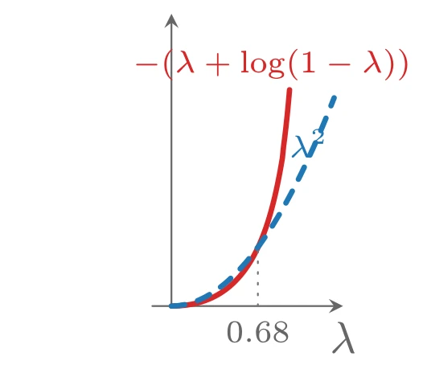
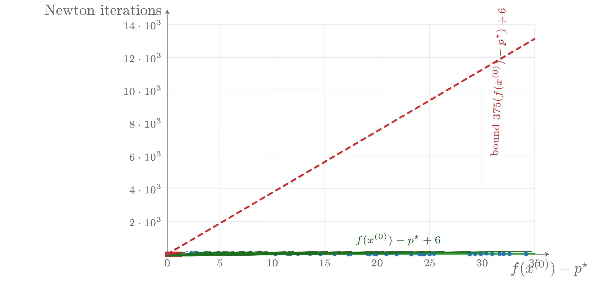

# 自和谐

经典的 Newton 方法收敛分析（基于强凸性与 Hessian 的 Lipschitz 连续性）有两个主要缺点。第一个是实际层面的：所得的复杂度估计涉及三个常数 $m$、$M$ 和 $L$，而这些常数在实践中几乎总是未知的，因此迭代次数的上界几乎无法具体给出。当然，收敛分析本身在概念上仍然有用。第二个缺点是：尽管 Newton 方法本身是仿射不变的，经典分析却强烈依赖于坐标系——改变坐标会使 $m$、$M$ 和 $L$ 全部改变。因此，我们希望找到一种像 Newton 方法本身一样独立于仿射坐标变换的分析。

Nesterov 和 Nemirovski 发现了一个能够实现这一目标的简单而优雅的假设，并称之为**自和谐**&#8203;（self-concordance）。自和谐函数之所以重要，有以下几个原因：

- 其中包括许多在凸优化内点法中起重要作用的对数障碍函数。
- 对自和谐函数的 Newton 方法分析不依赖任何未知常数。
- 自和谐是仿射不变的性质：对自和谐函数做线性变换后得到的仍是自和谐函数，因此对 Newton 方法给出的复杂度估计独立于仿射坐标变换。

## 定义与例子

### $\mathbf{R}$ 上的自和谐函数

先考虑 $\mathbf{R}$ 上的函数。凸函数 $f: \mathbf{R} \rightarrow \mathbf{R}$ 称为**自和谐**的，如果

$$
|f'''(x)| \leqslant 2f''(x)^{3/2}
$$

对所有 $x \in \operatorname{dom} f$ 成立。线性函数与（凸）二次函数的三阶导数为零，显然是自和谐的。更多例子：

- **负对数**&#8203;：$f(x) = -\log x$ 是自和谐的。由 $f''(x) = 1/x^2$，$f'''(x) = -2/x^3$，可得 $|f'''(x)|/(2f''(x)^{3/2}) = 1$，定义不等式以等号成立。
- **负熵加负对数**&#8203;：$f(x) = x\log x - \log x$ 是自和谐的。由 $f''(x) = (x + 1)/x^2$，$f'''(x) = -(x + 2)/x^3$，可得 $|f'''(x)|/(2f''(x)^{3/2}) = (x + 2)/(2(x + 1)^{3/2})$，该函数在 $\mathbf{R}_+$ 上的最大值为 1（在 $x = 0$ 处取得）。单独的负熵函数**不是**自和谐的。

关于定义中的常数 2，需要作一点说明：这个常数只是为方便而选的，目的是简化后面的公式；任何其他正常数都可以。若凸函数满足 $|f'''(x)| \leqslant kf''(x)^{3/2}$（$k$ 为某正常数），则 $\tilde{f}(x) = (k^2/4)f(x)$ 满足标准自和谐不等式。因此重要的是：函数的三阶导数被其二阶导数的 3/2 次幂的某个倍数控制，通过适当地缩放总可以把倍数化为 2。

另一个简单计算揭示了自和谐为何重要——它是仿射不变的：定义 $\tilde{f}(y) = f(ay + b)$（$a \neq 0$），代入 $\tilde{f}''(y) = a^2f''(x)$ 与 $\tilde{f}'''(y) = a^3f'''(x)$（$x = ay + b$），即可验证 $\tilde{f}$ 自和谐当且仅当 $f$ 自和谐。粗略地说，自和谐条件是一种以仿射坐标变换不变的方式限制三阶导数的途径。

### $\mathbf{R}^n$ 上的自和谐函数

对 $n > 1$ 的情形，若函数 $f: \mathbf{R}^n \rightarrow \mathbf{R}$ 沿定义域中的每条直线都是自和谐的，即对所有 $x \in \operatorname{dom} f$ 和所有 $v$，函数 $\tilde{f}(t) = f(x + tv)$ 关于 $t$ 自和谐，则称 $f$ 是自和谐的。

## 自和谐函数的运算

**缩放与求和**&#8203;：若 $f$ 自和谐且 $a \geqslant 1$，则 $af$ 自和谐。若 $f_1, f_2$ 自和谐，则 $f_1 + f_2$ 自和谐（证明只需考虑一维情形，利用 $|f_1''' + f_2'''| \leqslant |f_1'''| + |f_2'''| \leqslant 2(f_1''^{3/2} + f_2''^{3/2}) \leqslant 2(f_1'' + f_2'')^{3/2}$）。

**与仿射函数复合**&#8203;：若 $f: \mathbf{R}^n \rightarrow \mathbf{R}$ 自和谐，$A \in \mathbf{R}^{n \times m}$，$b \in \mathbf{R}^n$，则 $f(Ax + b)$ 自和谐。

- **例：线性不等式的对数障碍**&#8203;。$f(x) = -\sum_{i=1}^m \log(b_i - a_i^{\top}x)$（$\operatorname{dom} f = \{x \mid a_i^{\top}x < b_i\}$）自和谐：每一项都是 $-\log y$ 与仿射函数 $y = b_i - a_i^{\top}x$ 的复合，因此自和谐，其和也自和谐。
- **例：对数行列式**&#8203;。$f(X) = -\log\det X$ 在 $\mathbf{S}^n_{++}$ 上自和谐。沿方向 $V$ 考虑 $\tilde{f}(t) = -\log\det(X + tV) = -\log\det X - \sum_{i=1}^n \log(1 + t\lambda_i)$（$\lambda_i$ 为 $X^{-1/2}VX^{-1/2}$ 的特征值），每一项都是 $t$ 的自和谐函数，故其和自和谐。
- **例：凹二次函数的对数**&#8203;。$f(x) = -\log(x^{\top}Px + q^{\top}x + r)$（$P \in -\mathbf{S}^n_+$）在其定义域上自和谐（一维情形可分解为 $-\log(-p) - \log(x - a) - \log(b - x)$）。

**与对数复合**&#8203;：设 $g: \mathbf{R} \rightarrow \mathbf{R}$ 是凸函数，$\operatorname{dom} g = \mathbf{R}_{++}$，且满足

$$
|g'''(x)| \leqslant \frac{3g''(x)}{x}
$$

则 $f(x) = -\log(-g(x)) - \log x$ 在 $\{x \mid x > 0,\ g(x) < 0\}$ 上自和谐。该条件是齐次的且在加法下保持，所有（凸）二次函数都满足。满足条件的 $g$ 的例子有：$-x^p$（$0 < p \leqslant 1$）、$-\log x$、$x\log x$、$x^p$（$-1 \leqslant p \leqslant 0$）、$(ax + b)^2/x$ 等。由此可以证明如下函数的自和谐性：$-\log(y^2 - x^{\top}x)$（在 $\|x\|_2 < y$ 上）、$-2\log y - \log(y^{2/p} - x^2)$（$p \geqslant 1$）、$-\log y - \log(\log y - x)$（在 $e^x < y$ 上）等。

## 自和谐函数的性质

在经典分析中，我们用梯度范数来估计次优性；对严格凸的自和谐函数，可以用 Newton 减量

$$
\lambda(x) = \left(\nabla f(x)^{\top}\nabla^2 f(x)^{-1}\nabla f(x)\right)^{1/2}
$$

得到类似的估计（可以证明严格凸自和谐函数的 Hessian 处处正定）。与基于梯度范数的界不同，基于 Newton 减量的界不受仿射坐标变换影响。为后面引用，注意到 Newton 减量也可以表示为

$$
\lambda(x) = \sup_{v \neq 0} \frac{-v^{\top}\nabla f(x)}{(v^{\top}\nabla^2 f(x)v)^{1/2}}
$$

即对任意非零 $v$ 有

$$
\frac{-v^{\top}\nabla f(x)}{(v^{\top}\nabla^2 f(x)v)^{1/2}} \leqslant \lambda(x)
$$

等号在 $v = \Delta x_{\mathrm{nt}}$ 时成立。

### 二阶导数的上下界

设 $f: \mathbf{R} \rightarrow \mathbf{R}$ 严格凸且自和谐。自和谐不等式可以写成

$$
\left|\frac{d}{dt}f''(t)^{-1/2}\right| \leqslant 1
$$

从 0 到 $t$ 积分（设 $t \geqslant 0$ 且区间含于定义域），得 $-t \leqslant f''(t)^{-1/2} - f''(0)^{-1/2} \leqslant t$，从而得到 $f''(t)$ 的下界与上界：

$$
\frac{f''(0)}{(1 + tf''(0)^{1/2})^2} \leqslant f''(t) \leqslant \frac{f''(0)}{(1 - tf''(0)^{1/2})^2}
$$

下界对所有非负的 $t \in \operatorname{dom} f$ 都有效；上界在 $t \in \operatorname{dom} f$ 且 $0 \leqslant t < f''(0)^{-1/2}$ 时有效。

### 次优性的界

设 $f: \mathbf{R}^n \rightarrow \mathbf{R}$ 严格凸自和谐，$v$ 为任一下降方向（即 $v^{\top}\nabla f(x) < 0$，不必是 Newton 方向），定义 $\tilde{f}(t) = f(x + tv)$，则 $\tilde{f}$ 自和谐。对上述二阶导数下界积分两次，得到

$$
\tilde{f}(t) \geqslant \tilde{f}(0) + t\tilde{f}'(0) + t\tilde{f}''(0)^{1/2} - \log(1 + t\tilde{f}''(0)^{1/2})
$$

右端在 $\bar{t} = -\tilde{f}'(0)/(\tilde{f}''(0) + \tilde{f}''(0)^{1/2}\tilde{f}'(0))$ 处取最小，计算可得

$$
\inf_{t \geqslant 0} \tilde{f}(t) \geqslant \tilde{f}(0) - \tilde{f}'(0)\tilde{f}''(0)^{-1/2} + \log(1 + \tilde{f}'(0)\tilde{f}''(0)^{-1/2})
$$

结合 Newton 减量的变分表达式（$\lambda(x) \geqslant -\tilde{f}'(0)\tilde{f}''(0)^{-1/2}$，$v = \Delta x_{\mathrm{nt}}$ 时取等号），并利用 $u + \log(1 - u)$ 关于 $u$ 单调递减，得到对任意下降方向 $v$ 都成立的

$$
\inf_{t \geqslant 0}\tilde{f}(t) \geqslant \tilde{f}(0) + \lambda(x) + \log(1 - \lambda(x))
$$

因此当 $\lambda(x) < 1$ 时

$$
p^{\star} \geqslant f(x) + \lambda(x) + \log(1 - \lambda(x))
$$

函数 $-(\lambda + \log(1 - \lambda))$ 在 $\lambda$ 很小时近似为 $\lambda^2/2$，且在 $0 \leqslant \lambda \leqslant 0.68$ 上不超过 $\lambda^2$。于是有次优性界

$$
p^{\star} \geqslant f(x) - \lambda(x)^2 \quad (\lambda(x) \leqslant 0.68)
$$

回忆 $\lambda(x)^2/2$ 是基于二次模型的 $f(x) - p^{\star}$ 估计；上式说明对自和谐函数，把该估计加倍即可得到一个可证明的界。特别地，对自和谐函数可以使用终止准则

$$
\lambda(x)^2 \leqslant \epsilon \quad (\epsilon < 0.68^2)
$$

并保证退出时 $f(x) - p^{\star} \leqslant \epsilon$。



上图由下面的 TikZ 代码编译而来：

```tex

  \definecolor{cblue}{RGB}{31,119,180}
  \definecolor{cred}{RGB}{214,39,40}
  \definecolor{cgreen}{RGB}{44,160,44}
  \definecolor{corange}{RGB}{255,127,14}
  \definecolor{cpurple}{RGB}{148,103,189}
  \definecolor{cbrown}{RGB}{140,86,75}
  \definecolor{cpink}{RGB}{227,119,194}
  \definecolor{cgray}{RGB}{127,127,127}
\begin{tikzpicture}[x=1cm,y=1cm,>=stealth,line cap=round,line join=round]
  \draw[->,color=black!60] (-0.15,0) -- (1.35,0) node[below] {$\lambda$};
  \draw[->,color=black!60] (0,0) -- (0,2.3) node[left] {};
  \draw[cred,very thick,domain=0:0.93,samples=100] plot (\x,{-\x-ln(1-\x)});
  \draw[cblue,very thick,dashed,domain=0:1.28] plot (\x,{\x*\x});
  \draw[color=black!55,dotted] (0.68,0) -- (0.68,0.47);
  \node[below,font=\scriptsize,color=black!60] at (0.68,0) {$0.68$};
  \node[font=\scriptsize,color=cred] at (0.79,1.9) {$-(\lambda+\log(1-\lambda))$};
  \node[font=\scriptsize,color=cblue] at (1.08,1.28) {$\lambda^2$};
\end{tikzpicture}
```

## 自和谐函数的 Newton 方法分析

现在对应用于严格凸自和谐函数的、带回溯直线搜索的 Newton 方法进行分析。假设已知初始点 $x^{(0)}$，下水平集 $S = \{x \mid f(x) \leqslant f(x^{(0)})\}$ 是闭集，且 $f$ 下有界（这意味着 $f$ 存在极小点 $x^{\star}$）。该分析与经典分析非常相似，只是以自和谐性代替强凸性和 Hessian 的 Lipschitz 条件，并以 Newton 减量代替梯度范数。可以证明存在只依赖于直线搜索参数 $\alpha$ 和 $\beta$ 的数 $\eta$ 和 $\gamma > 0$（$0 < \eta \leqslant 1/4$），使得：

- 若 $\lambda(x^{(k)}) > \eta$，则 $f(x^{(k+1)}) - f(x^{(k)}) \leqslant -\gamma$；
- 若 $\lambda(x^{(k)}) \leqslant \eta$，则回溯直线搜索选择 $t = 1$，且

$$
2\lambda(x^{(k+1)}) \leqslant \left(2\lambda(x^{(k)})\right)^2
$$

与经典分析一样，第二条件可以递归应用：对 $l \geqslant k$，有 $\lambda(x^{(l)}) \leqslant (1/2)^{2^{(l-k)}/2}$ 型的界，进而

$$
f(x^{(l)}) - p^{\star} \leqslant \lambda(x^{(l)})^2 \leqslant \left(\frac{1}{2}\right)^{2(l-k)+1}
$$

因此当 $l - k \geqslant \log_2\log_2(1/\epsilon)$ 时 $f(x^{(l)}) - p^{\star} \leqslant \epsilon$。第一条不等式意味着阻尼阶段至多需要 $(f(x^{(0)}) - p^{\star})/\gamma$ 步。所以，从 $x^{(0)}$ 出发达到精度 $f(x) - p^{\star} \leqslant \epsilon$ 所需的总迭代次数由下式界定：

$$
\frac{f(x^{(0)}) - p^{\star}}{\gamma} + \log_2 \log_2(1/\epsilon)
$$

这正是经典分析中相应界的自和谐版本。

### 阻尼 Newton 阶段

令 $\tilde{f}(t) = f(x + t\Delta x_{\mathrm{nt}})$，则 $\tilde{f}'(0) = -\lambda(x)^2$，$\tilde{f}''(0) = \lambda(x)^2$。对二阶导数上界积分两次可得（对 $0 \leqslant t < 1/\lambda(x)$ 有效）

$$
\tilde{f}(t) \leqslant \tilde{f}(0) - t\lambda(x)^2 - t\lambda(x) - \log(1 - t\lambda(x))
$$

利用它可以证明回溯直线搜索得到的步长总满足 $t \geqslant \beta/(1 + \lambda(x))$：点 $\hat{t} = 1/(1 + \lambda(x))$ 满足直线搜索终止条件（利用对 $x \geqslant 0$ 成立的不等式 $-x + \log(1 + x) + \frac{x^2}{2(1+x)} \leqslant 0$）。于是

$$
\tilde{f}(t) - \tilde{f}(0) \leqslant -\alpha\beta\frac{\lambda(x)^2}{1 + \lambda(x)}
$$

即第一条性质成立，且 $\gamma = \alpha\beta\eta^2/(1 + \eta)$。

### 二次收敛阶段

可以取 $\eta = (1 - 2\alpha)/4$（因 $0 < \alpha < 1/2$，它满足 $0 < \eta < 1/4$）：若 $\lambda(x^{(k)}) \leqslant (1 - 2\alpha)/4$，则回溯直线搜索接受单位步长，且第二条性质成立。事实上，上述 $\tilde{f}$ 的上界表明：单位步长 $t = 1$ 在 $\lambda(x) < 1$ 时产生定义域内的点；而当 $\lambda(x) \leqslant (1 - 2\alpha)/2$ 时 $\tilde{f}(1) \leqslant \tilde{f}(0) - \alpha\lambda(x)^2$，满足充分下降条件。至于 $\lambda$ 的递减，有如下事实（见教材习题 9.18）：若 $\lambda(x) < 1$ 且 $x^{+} = x - \nabla^2 f(x)^{-1}\nabla f(x)$，则

$$
\lambda(x^{+}) \leqslant \frac{\lambda(x)^2}{(1 - \lambda(x))^2}
$$

特别地，当 $\lambda(x) \leqslant 1/4$ 时 $\lambda(x^{+}) \leqslant 2\lambda(x)^2$，这就证明了 $\lambda(x^{(k)}) \leqslant \eta$ 时第二条性质成立。

### 最终复杂度界

综合起来，总迭代次数的界为

$$
\frac{20 - 8\alpha}{\alpha\beta(1 - 2\alpha)^2}\left(f(x^{(0)}) - p^{\star}\right) + \log_2 \log_2(1/\epsilon)
$$

这个表达式只依赖于直线搜索参数 $\alpha$、$\beta$ 和最终精度 $\epsilon$；其中与 $\epsilon$ 有关的一项可以放心地用常数 6 代替。对典型的 $\alpha$、$\beta$，缩放 $f(x^{(0)}) - p^{\star}$ 的常数是几百的量级：例如 $\alpha = 0.1$、$\beta = 0.8$ 时该常数为 375，取 $\epsilon = 10^{-10}$ 得到界

$$
375(f(x^{(0)}) - p^{\star}) + 6
$$

这个界相当保守，但确实刻画了 Newton 步数的（最坏情形）一般形式。更精细的分析（如 Nesterov 和 Nemirovski 的原始分析）给出类似形式的界，但缩放常数小得多。

## 讨论与数值例子

### 一族自和谐函数

把上界与实际迭代次数进行比较是有意义的。考虑问题族 $f(x) = -\sum_{i=1}^m \log(b_i - a_i^{\top}x)$（随机生成数据，剔除下无界的实例）。对每个实例先计算 $x^{\star}$，再沿随机方向取初始点使 $f(x^{(0)}) - p^{\star}$ 为 0 到 35 之间的给定值，然后用参数 $\alpha = 0.1$、$\beta = 0.8$、容许误差 $\epsilon = 10^{-10}$ 的 Newton 方法极小化。

150 个实例的结果显示：实际所需 Newton 步数远小于界 $375(f(x^{(0)}) - p^{\star}) + 6$。结果暗示存在形如相同、但常数小得多（约 1.5）的界。事实上，表达式

$$
f(x^{(0)}) - p^{\star} + 6
$$

作为所需 Newton 步数的粗略预测效果并不差（尽管它显然不是唯一因素）。还应指出，所研究的问题族不仅是自和谐的，而且是**极小自和谐**&#8203;（minimally self-concordant）的——即对 $\alpha < 1$，$\alpha f$ 不再自和谐——因此该界无法通过缩放 $f$ 来改进。（$f(x) = -20\log x$ 是一个自和谐但非极小自和谐的函数的例子，因为 $(1/20)f$ 也自和谐。）



上图由下面的 TikZ 代码编译而来：

```tex

  \definecolor{cblue}{RGB}{31,119,180}
  \definecolor{cred}{RGB}{214,39,40}
  \definecolor{cgreen}{RGB}{44,160,44}
  \definecolor{corange}{RGB}{255,127,14}
  \definecolor{cpurple}{RGB}{148,103,189}
  \definecolor{cbrown}{RGB}{140,86,75}
  \definecolor{cpink}{RGB}{227,119,194}
  \definecolor{cgray}{RGB}{127,127,127}
\begin{tikzpicture}[x=1cm,y=1cm,>=stealth,line cap=round,line join=round]
  \draw[color=black!12,very thin] (0.0000,0) -- (0.0000,5.4) (1.2286,0) -- (1.2286,5.4) (2.4571,0) -- (2.4571,5.4) (3.6857,0) -- (3.6857,5.4) (4.9143,0) -- (4.9143,5.4) (6.1429,0) -- (6.1429,5.4) (7.3714,0) -- (7.3714,5.4) (8.6000,0) -- (8.6000,5.4) (0,0.7714) -- (8.6,0.7714) (0,1.5429) -- (8.6,1.5429) (0,2.3143) -- (8.6,2.3143) (0,3.0857) -- (8.6,3.0857) (0,3.8571) -- (8.6,3.8571) (0,4.6286) -- (8.6,4.6286) (0,5.4000) -- (8.6,5.4000) ;
  \draw[->,color=black!60] (0,0) -- (8.95,0) node[below] {$f(x^{(0)})-p^{\star}$};
  \draw[->,color=black!60] (0,0) -- (0,5.75) node[left] {Newton iterations};
  \draw[cred,very thick,dashed] (0,0.0023) -- (8.6000,5.0648);
  \draw[cgreen,very thick] (0,0.0023) -- (8.6000,0.0158);
  \fill[cblue] (4.7044,0.0004) circle (1.4pt);
  \fill[cblue] (2.1678,0.0309) circle (1.4pt);
  \fill[cblue] (3.5937,0.0093) circle (1.4pt);
  \fill[cblue] (6.1471,0.0012) circle (1.4pt);
  \fill[cblue] (4.2844,0.0023) circle (1.4pt);
  \fill[cblue] (7.0840,0.0000) circle (1.4pt);
  \fill[cblue] (4.9066,0.0309) circle (1.4pt);
  \fill[cblue] (7.7836,0.0100) circle (1.4pt);
  \fill[cblue] (4.7417,0.0004) circle (1.4pt);
  \fill[cblue] (7.4681,0.0197) circle (1.4pt);
  \fill[cblue] (7.8778,0.0062) circle (1.4pt);
  \fill[cblue] (0.5719,0.0309) circle (1.4pt);
  \fill[cblue] (3.9173,0.0108) circle (1.4pt);
  \fill[cblue] (8.4017,0.0039) circle (1.4pt);
  \fill[cblue] (3.5754,0.0093) circle (1.4pt);
  \fill[cblue] (2.8234,0.0077) circle (1.4pt);
  \fill[cblue] (5.7121,0.0012) circle (1.4pt);
  \fill[cblue] (0.0591,0.0012) circle (1.4pt);
  \fill[cblue] (2.8308,0.0077) circle (1.4pt);
  \fill[cblue] (0.0241,0.0012) circle (1.4pt);
  \fill[cblue] (7.6071,0.0073) circle (1.4pt);
  \fill[cblue] (5.8901,0.0158) circle (1.4pt);
  \fill[cblue] (5.3736,0.0008) circle (1.4pt);
  \fill[cblue] (0.9279,0.0309) circle (1.4pt);
  \fill[cblue] (5.9459,0.0000) circle (1.4pt);
  \fill[cblue] (3.0619,0.0069) circle (1.4pt);
  \fill[cblue] (2.8675,0.0309) circle (1.4pt);
  \fill[cblue] (4.9083,0.0116) circle (1.4pt);
  \fill[cblue] (0.5662,0.0027) circle (1.4pt);
  \fill[cblue] (0.6661,0.0309) circle (1.4pt);
  \fill[cblue] (2.5339,0.0073) circle (1.4pt);
  \fill[cblue] (4.8981,0.0000) circle (1.4pt);
  \fill[cblue] (5.9426,0.0139) circle (1.4pt);
  \fill[cblue] (8.0155,0.0085) circle (1.4pt);
  \fill[cblue] (5.1292,0.0008) circle (1.4pt);
  \fill[cblue] (1.7141,0.0309) circle (1.4pt);
  \fill[cblue] (5.9506,0.0027) circle (1.4pt);
  \fill[cblue] (0.5651,0.0309) circle (1.4pt);
  \fill[cblue] (4.2469,0.0000) circle (1.4pt);
  \fill[cblue] (6.0213,0.0019) circle (1.4pt);
  \fill[cblue] (7.3427,0.0066) circle (1.4pt);
  \fill[cblue] (7.2065,0.0062) circle (1.4pt);
  \fill[cblue] (6.2388,0.0143) circle (1.4pt);
  \fill[cblue] (1.9455,0.0309) circle (1.4pt);
  \fill[cblue] (2.8860,0.0066) circle (1.4pt);
  \fill[cblue] (8.3969,0.0093) circle (1.4pt);
  \fill[cblue] (5.2183,0.0309) circle (1.4pt);
  \fill[cblue] (4.8605,0.0031) circle (1.4pt);
  \fill[cblue] (0.6934,0.0309) circle (1.4pt);
  \fill[cblue] (3.3424,0.0069) circle (1.4pt);
  \draw[cred] (2.4283-1.5pt,0.0031-1.5pt) rectangle ++(3pt,3pt);
  \draw[cred] (0.1145-1.5pt,0.0015-1.5pt) rectangle ++(3pt,3pt);
  \draw[cred] (0.2111-1.5pt,0.0015-1.5pt) rectangle ++(3pt,3pt);
  \draw[cred] (7.8808-1.5pt,0.0220-1.5pt) rectangle ++(3pt,3pt);
  \draw[cred] (4.4440-1.5pt,0.0077-1.5pt) rectangle ++(3pt,3pt);
  \draw[cred] (7.2865-1.5pt,0.0004-1.5pt) rectangle ++(3pt,3pt);
  \draw[cred] (4.1371-1.5pt,0.0108-1.5pt) rectangle ++(3pt,3pt);
  \draw[cred] (6.7669-1.5pt,0.0004-1.5pt) rectangle ++(3pt,3pt);
  \draw[cred] (6.9121-1.5pt,0.0000-1.5pt) rectangle ++(3pt,3pt);
  \draw[cred] (0.7004-1.5pt,0.0019-1.5pt) rectangle ++(3pt,3pt);
  \draw[cred] (5.6065-1.5pt,0.0077-1.5pt) rectangle ++(3pt,3pt);
  \draw[cred] (7.9570-1.5pt,0.0120-1.5pt) rectangle ++(3pt,3pt);
  \draw[cred] (0.4628-1.5pt,0.0015-1.5pt) rectangle ++(3pt,3pt);
  \draw[cred] (6.6335-1.5pt,0.0008-1.5pt) rectangle ++(3pt,3pt);
  \draw[cred] (3.9690-1.5pt,0.0062-1.5pt) rectangle ++(3pt,3pt);
  \draw[cred] (2.3444-1.5pt,0.0023-1.5pt) rectangle ++(3pt,3pt);
  \draw[cred] (5.9134-1.5pt,0.0012-1.5pt) rectangle ++(3pt,3pt);
  \draw[cred] (4.4577-1.5pt,0.0104-1.5pt) rectangle ++(3pt,3pt);
  \draw[cred] (1.0581-1.5pt,0.0031-1.5pt) rectangle ++(3pt,3pt);
  \draw[cred] (5.0829-1.5pt,0.0093-1.5pt) rectangle ++(3pt,3pt);
  \draw[cred] (2.2576-1.5pt,0.0042-1.5pt) rectangle ++(3pt,3pt);
  \draw[cred] (3.1310-1.5pt,0.0073-1.5pt) rectangle ++(3pt,3pt);
  \draw[cred] (7.3053-1.5pt,0.0015-1.5pt) rectangle ++(3pt,3pt);
  \draw[cred] (4.3920-1.5pt,0.0096-1.5pt) rectangle ++(3pt,3pt);
  \draw[cred] (7.7919-1.5pt,0.0000-1.5pt) rectangle ++(3pt,3pt);
  \draw[cred] (2.7890-1.5pt,0.0050-1.5pt) rectangle ++(3pt,3pt);
  \draw[cred] (6.4773-1.5pt,0.0069-1.5pt) rectangle ++(3pt,3pt);
  \draw[cred] (6.6357-1.5pt,0.0073-1.5pt) rectangle ++(3pt,3pt);
  \draw[cred] (6.5298-1.5pt,0.0039-1.5pt) rectangle ++(3pt,3pt);
  \draw[cred] (2.6058-1.5pt,0.0031-1.5pt) rectangle ++(3pt,3pt);
  \draw[cred] (6.4501-1.5pt,0.0023-1.5pt) rectangle ++(3pt,3pt);
  \draw[cred] (6.2948-1.5pt,0.0008-1.5pt) rectangle ++(3pt,3pt);
  \draw[cred] (5.2292-1.5pt,0.0000-1.5pt) rectangle ++(3pt,3pt);
  \draw[cred] (4.9604-1.5pt,0.0089-1.5pt) rectangle ++(3pt,3pt);
  \draw[cred] (7.7055-1.5pt,0.0004-1.5pt) rectangle ++(3pt,3pt);
  \draw[cred] (6.6919-1.5pt,0.0012-1.5pt) rectangle ++(3pt,3pt);
  \draw[cred] (0.5966-1.5pt,0.0019-1.5pt) rectangle ++(3pt,3pt);
  \draw[cred] (5.4008-1.5pt,0.0123-1.5pt) rectangle ++(3pt,3pt);
  \draw[cred] (0.4617-1.5pt,0.0023-1.5pt) rectangle ++(3pt,3pt);
  \draw[cred] (6.6260-1.5pt,0.0000-1.5pt) rectangle ++(3pt,3pt);
  \draw[cred] (5.6788-1.5pt,0.0042-1.5pt) rectangle ++(3pt,3pt);
  \draw[cred] (8.2414-1.5pt,0.0023-1.5pt) rectangle ++(3pt,3pt);
  \draw[cred] (6.3240-1.5pt,0.0015-1.5pt) rectangle ++(3pt,3pt);
  \draw[cred] (3.4010-1.5pt,0.0077-1.5pt) rectangle ++(3pt,3pt);
  \draw[cred] (4.1282-1.5pt,0.0069-1.5pt) rectangle ++(3pt,3pt);
  \draw[cred] (3.2177-1.5pt,0.0031-1.5pt) rectangle ++(3pt,3pt);
  \draw[cred] (4.9990-1.5pt,0.0089-1.5pt) rectangle ++(3pt,3pt);
  \draw[cred] (2.7311-1.5pt,0.0066-1.5pt) rectangle ++(3pt,3pt);
  \draw[cred] (2.9397-1.5pt,0.0054-1.5pt) rectangle ++(3pt,3pt);
  \draw[cred] (4.2887-1.5pt,0.0089-1.5pt) rectangle ++(3pt,3pt);
  \draw[fill] [cgreen!70!black] (3.3668,0.0015+1.8pt) -- (3.3668-1.7pt,0.0015-1.2pt) -- (3.3668+1.7pt,0.0015-1.2pt) -- cycle;
  \draw[fill] [cgreen!70!black] (5.7448,0.0019+1.8pt) -- (5.7448-1.7pt,0.0019-1.2pt) -- (5.7448+1.7pt,0.0019-1.2pt) -- cycle;
  \draw[fill] [cgreen!70!black] (4.2805,0.0015+1.8pt) -- (4.2805-1.7pt,0.0015-1.2pt) -- (4.2805+1.7pt,0.0015-1.2pt) -- cycle;
  \draw[fill] [cgreen!70!black] (2.2077,0.0023+1.8pt) -- (2.2077-1.7pt,0.0023-1.2pt) -- (2.2077+1.7pt,0.0023-1.2pt) -- cycle;
  \draw[fill] [cgreen!70!black] (5.3533,0.0054+1.8pt) -- (5.3533-1.7pt,0.0054-1.2pt) -- (5.3533+1.7pt,0.0054-1.2pt) -- cycle;
  \draw[fill] [cgreen!70!black] (5.4352,0.0069+1.8pt) -- (5.4352-1.7pt,0.0069-1.2pt) -- (5.4352+1.7pt,0.0069-1.2pt) -- cycle;
  \draw[fill] [cgreen!70!black] (5.6007,0.0042+1.8pt) -- (5.6007-1.7pt,0.0042-1.2pt) -- (5.6007+1.7pt,0.0042-1.2pt) -- cycle;
  \draw[fill] [cgreen!70!black] (8.0243,0.0027+1.8pt) -- (8.0243-1.7pt,0.0027-1.2pt) -- (8.0243+1.7pt,0.0027-1.2pt) -- cycle;
  \draw[fill] [cgreen!70!black] (3.7085,0.0023+1.8pt) -- (3.7085-1.7pt,0.0023-1.2pt) -- (3.7085+1.7pt,0.0023-1.2pt) -- cycle;
  \draw[fill] [cgreen!70!black] (3.4342,0.0023+1.8pt) -- (3.4342-1.7pt,0.0023-1.2pt) -- (3.4342+1.7pt,0.0023-1.2pt) -- cycle;
  \draw[fill] [cgreen!70!black] (0.4685,0.0015+1.8pt) -- (0.4685-1.7pt,0.0015-1.2pt) -- (0.4685+1.7pt,0.0015-1.2pt) -- cycle;
  \draw[fill] [cgreen!70!black] (4.7816,0.0023+1.8pt) -- (4.7816-1.7pt,0.0023-1.2pt) -- (4.7816+1.7pt,0.0023-1.2pt) -- cycle;
  \draw[fill] [cgreen!70!black] (6.4864,0.0054+1.8pt) -- (6.4864-1.7pt,0.0054-1.2pt) -- (6.4864+1.7pt,0.0054-1.2pt) -- cycle;
  \draw[fill] [cgreen!70!black] (7.8721,0.0062+1.8pt) -- (7.8721-1.7pt,0.0062-1.2pt) -- (7.8721+1.7pt,0.0062-1.2pt) -- cycle;
  \draw[fill] [cgreen!70!black] (4.3222,0.0066+1.8pt) -- (4.3222-1.7pt,0.0066-1.2pt) -- (4.3222+1.7pt,0.0066-1.2pt) -- cycle;
  \draw[fill] [cgreen!70!black] (8.2162,0.0131+1.8pt) -- (8.2162-1.7pt,0.0131-1.2pt) -- (8.2162+1.7pt,0.0131-1.2pt) -- cycle;
  \draw[fill] [cgreen!70!black] (6.1820,0.0023+1.8pt) -- (6.1820-1.7pt,0.0023-1.2pt) -- (6.1820+1.7pt,0.0023-1.2pt) -- cycle;
  \draw[fill] [cgreen!70!black] (3.7577,0.0023+1.8pt) -- (3.7577-1.7pt,0.0023-1.2pt) -- (3.7577+1.7pt,0.0023-1.2pt) -- cycle;
  \draw[fill] [cgreen!70!black] (3.5177,0.0027+1.8pt) -- (3.5177-1.7pt,0.0027-1.2pt) -- (3.5177+1.7pt,0.0027-1.2pt) -- cycle;
  \draw[fill] [cgreen!70!black] (1.5618,0.0019+1.8pt) -- (1.5618-1.7pt,0.0019-1.2pt) -- (1.5618+1.7pt,0.0019-1.2pt) -- cycle;
  \draw[fill] [cgreen!70!black] (1.7782,0.0019+1.8pt) -- (1.7782-1.7pt,0.0019-1.2pt) -- (1.7782+1.7pt,0.0019-1.2pt) -- cycle;
  \draw[fill] [cgreen!70!black] (2.9688,0.0062+1.8pt) -- (2.9688-1.7pt,0.0062-1.2pt) -- (2.9688+1.7pt,0.0062-1.2pt) -- cycle;
  \draw[fill] [cgreen!70!black] (7.5594,0.0031+1.8pt) -- (7.5594-1.7pt,0.0031-1.2pt) -- (7.5594+1.7pt,0.0031-1.2pt) -- cycle;
  \draw[fill] [cgreen!70!black] (5.3840,0.0069+1.8pt) -- (5.3840-1.7pt,0.0069-1.2pt) -- (5.3840+1.7pt,0.0069-1.2pt) -- cycle;
  \draw[fill] [cgreen!70!black] (1.9852,0.0015+1.8pt) -- (1.9852-1.7pt,0.0015-1.2pt) -- (1.9852+1.7pt,0.0015-1.2pt) -- cycle;
  \draw[fill] [cgreen!70!black] (6.4825,0.0077+1.8pt) -- (6.4825-1.7pt,0.0077-1.2pt) -- (6.4825+1.7pt,0.0077-1.2pt) -- cycle;
  \draw[fill] [cgreen!70!black] (5.5232,0.0054+1.8pt) -- (5.5232-1.7pt,0.0054-1.2pt) -- (5.5232+1.7pt,0.0054-1.2pt) -- cycle;
  \draw[fill] [cgreen!70!black] (1.2241,0.0015+1.8pt) -- (1.2241-1.7pt,0.0015-1.2pt) -- (1.2241+1.7pt,0.0015-1.2pt) -- cycle;
  \draw[fill] [cgreen!70!black] (2.7770,0.0023+1.8pt) -- (2.7770-1.7pt,0.0023-1.2pt) -- (2.7770+1.7pt,0.0023-1.2pt) -- cycle;
  \draw[fill] [cgreen!70!black] (1.4128,0.0015+1.8pt) -- (1.4128-1.7pt,0.0015-1.2pt) -- (1.4128+1.7pt,0.0015-1.2pt) -- cycle;
  \draw[fill] [cgreen!70!black] (8.5283,0.0008+1.8pt) -- (8.5283-1.7pt,0.0008-1.2pt) -- (8.5283+1.7pt,0.0008-1.2pt) -- cycle;
  \draw[fill] [cgreen!70!black] (1.1993,0.0015+1.8pt) -- (1.1993-1.7pt,0.0015-1.2pt) -- (1.1993+1.7pt,0.0015-1.2pt) -- cycle;
  \draw[fill] [cgreen!70!black] (2.1589,0.0023+1.8pt) -- (2.1589-1.7pt,0.0023-1.2pt) -- (2.1589+1.7pt,0.0023-1.2pt) -- cycle;
  \draw[fill] [cgreen!70!black] (7.6810,0.0019+1.8pt) -- (7.6810-1.7pt,0.0019-1.2pt) -- (7.6810+1.7pt,0.0019-1.2pt) -- cycle;
  \draw[fill] [cgreen!70!black] (4.9430,0.0019+1.8pt) -- (4.9430-1.7pt,0.0019-1.2pt) -- (4.9430+1.7pt,0.0019-1.2pt) -- cycle;
  \draw[fill] [cgreen!70!black] (5.0673,0.0089+1.8pt) -- (5.0673-1.7pt,0.0089-1.2pt) -- (5.0673+1.7pt,0.0089-1.2pt) -- cycle;
  \draw[fill] [cgreen!70!black] (3.4997,0.0039+1.8pt) -- (3.4997-1.7pt,0.0039-1.2pt) -- (3.4997+1.7pt,0.0039-1.2pt) -- cycle;
  \draw[fill] [cgreen!70!black] (7.9318,0.0069+1.8pt) -- (7.9318-1.7pt,0.0069-1.2pt) -- (7.9318+1.7pt,0.0069-1.2pt) -- cycle;
  \draw[fill] [cgreen!70!black] (4.9003,0.0031+1.8pt) -- (4.9003-1.7pt,0.0031-1.2pt) -- (4.9003+1.7pt,0.0031-1.2pt) -- cycle;
  \draw[fill] [cgreen!70!black] (2.3444,0.0019+1.8pt) -- (2.3444-1.7pt,0.0019-1.2pt) -- (2.3444+1.7pt,0.0019-1.2pt) -- cycle;
  \draw[fill] [cgreen!70!black] (6.0222,0.0096+1.8pt) -- (6.0222-1.7pt,0.0096-1.2pt) -- (6.0222+1.7pt,0.0096-1.2pt) -- cycle;
  \draw[fill] [cgreen!70!black] (1.8045,0.0015+1.8pt) -- (1.8045-1.7pt,0.0015-1.2pt) -- (1.8045+1.7pt,0.0015-1.2pt) -- cycle;
  \draw[fill] [cgreen!70!black] (0.9110,0.0015+1.8pt) -- (0.9110-1.7pt,0.0015-1.2pt) -- (0.9110+1.7pt,0.0015-1.2pt) -- cycle;
  \draw[fill] [cgreen!70!black] (4.9424,0.0058+1.8pt) -- (4.9424-1.7pt,0.0058-1.2pt) -- (4.9424+1.7pt,0.0058-1.2pt) -- cycle;
  \draw[fill] [cgreen!70!black] (1.0088,0.0015+1.8pt) -- (1.0088-1.7pt,0.0015-1.2pt) -- (1.0088+1.7pt,0.0015-1.2pt) -- cycle;
  \draw[fill] [cgreen!70!black] (7.0499,0.0116+1.8pt) -- (7.0499-1.7pt,0.0116-1.2pt) -- (7.0499+1.7pt,0.0116-1.2pt) -- cycle;
  \draw[fill] [cgreen!70!black] (7.1144,0.0058+1.8pt) -- (7.1144-1.7pt,0.0058-1.2pt) -- (7.1144+1.7pt,0.0058-1.2pt) -- cycle;
  \draw[fill] [cgreen!70!black] (1.3419,0.0015+1.8pt) -- (1.3419-1.7pt,0.0015-1.2pt) -- (1.3419+1.7pt,0.0015-1.2pt) -- cycle;
  \draw[fill] [cgreen!70!black] (4.0596,0.0019+1.8pt) -- (4.0596-1.7pt,0.0019-1.2pt) -- (4.0596+1.7pt,0.0019-1.2pt) -- cycle;
  \draw[fill] [cgreen!70!black] (8.4935,0.0108+1.8pt) -- (8.4935-1.7pt,0.0108-1.2pt) -- (8.4935+1.7pt,0.0108-1.2pt) -- cycle;
  \node[below,font=\scriptsize,color=black!60] at (0.0000,0) {0};
  \node[below,font=\scriptsize,color=black!60] at (1.2286,0) {5};
  \node[below,font=\scriptsize,color=black!60] at (2.4571,0) {10};
  \node[below,font=\scriptsize,color=black!60] at (3.6857,0) {15};
  \node[below,font=\scriptsize,color=black!60] at (4.9143,0) {20};
  \node[below,font=\scriptsize,color=black!60] at (6.1429,0) {25};
  \node[below,font=\scriptsize,color=black!60] at (7.3714,0) {30};
  \node[below,font=\scriptsize,color=black!60] at (8.6000,0) {35};
  \node[left,font=\scriptsize,color=black!60] at (0,0.7714) {$2\cdot 10^{3}$};
  \node[left,font=\scriptsize,color=black!60] at (0,1.5429) {$4\cdot 10^{3}$};
  \node[left,font=\scriptsize,color=black!60] at (0,2.3143) {$6\cdot 10^{3}$};
  \node[left,font=\scriptsize,color=black!60] at (0,3.0857) {$8\cdot 10^{3}$};
  \node[left,font=\scriptsize,color=black!60] at (0,3.8571) {$10\cdot 10^{3}$};
  \node[left,font=\scriptsize,color=black!60] at (0,4.6286) {$12\cdot 10^{3}$};
  \node[left,font=\scriptsize,color=black!60] at (0,5.4000) {$14\cdot 10^{3}$};
  \node[font=\scriptsize,color=cred,rotate=87] at (7.7400,4.0500) {bound $375(f(x^{(0)})-p^{\star})+6$};
  \node[font=\scriptsize,color=cgreen!60!black] at (5.4057,0.3471) {$f(x^{(0)})-p^{\star}+6$};
\end{tikzpicture}
```

### 自和谐性的实际意义

我们已经看到，Newton 方法对强凸目标函数一般表现得非常好；经典分析可以给出复杂度界，但该界依赖几个几乎总是未知的常数。

对自和谐函数可以说得更多：我们有一个完全显式的、不依赖任何未知常数的复杂度界。实证研究表明该界可以大幅收紧，但其一般形式——一个较小的常数加上 $f(x^{(0)}) - p^{\star}$ 的某个倍数——至少粗略地预测了极小化一个（近似）极小自和谐函数所需的 Newton 步数。

自和谐函数在实践中是否比非自和谐函数更容易用 Newton 方法极小化，目前还不清楚（甚至不清楚如何把这句话表述得严谨）。目前可以说的是：自和谐函数是这样一类函数，对它们我们关于 Newton 方法复杂度所能说的，比非自和谐函数的情形多得多。
