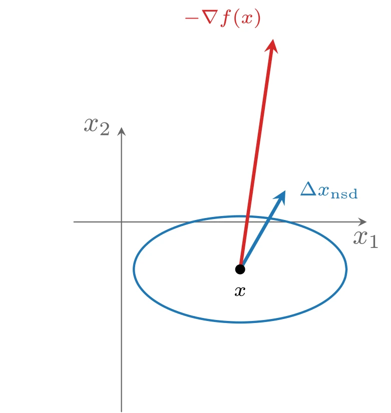
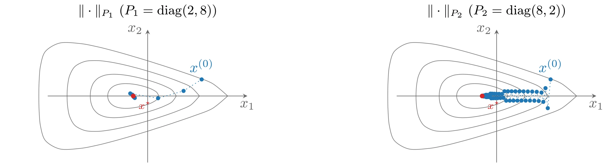
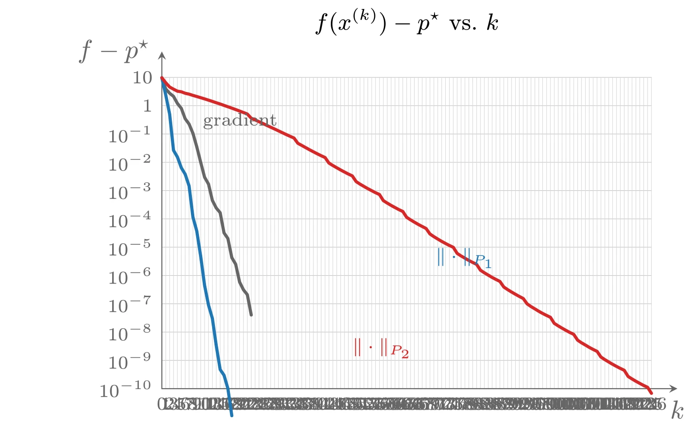
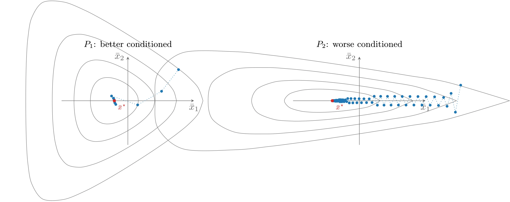

# 最速下降方法

设 $f(x + v)$ 在 $x$ 附近的一阶 Taylor 近似为

$$
f(x + v) \approx \hat{f}(x + v) = f(x) + \nabla f(x)^{\top}v
$$

右端第二项 $\nabla f(x)^{\top}v$ 是 $f$ 在 $x$ 处沿方向 $v$ 的**方向导数**&#8203;（directional derivative），给出了小步 $v$ 引起的 $f$ 的近似变化。若方向导数为负，则 $v$ 是下降方向。

我们希望选取 $v$ 使方向导数尽可能负。由于 $\nabla f(x)^{\top}v$ 关于 $v$ 是线性的，取很大的 $v$ 就可以使其任意负（只要 $v$ 是下降方向），因此必须限制 $v$ 的大小（或按其长度归一化）。设 $\|\cdot\|$ 是 $\mathbf{R}^n$ 上的任意范数，定义**归一化最速下降方向**&#8203;（normalized steepest descent direction）（关于范数 $\|\cdot\|$）：

$$
\Delta x_{\mathrm{nsd}} = \operatorname{argmin}\{\nabla f(x)^{\top}v \mid \|v\| = 1\}
$$

（之所以说“一个”最速下降方向，是因为极小点可能不唯一。）归一化最速下降方向是单位范数的步进中使 $f$ 的线性近似下降最大的方向。几何上，它等价地定义为

$$
\Delta x_{\mathrm{nsd}} = \operatorname{argmin}\{\nabla f(x)^{\top}v \mid \|v\| \leqslant 1\}
$$

即在 $\|\cdot\|$ 的单位球内沿 $-\nabla f(x)$ 方向延伸最远的方向。

把归一化最速下降方向按特定方式缩放，还可以得到**未归一化**的最速下降步：

$$
\Delta x_{\mathrm{sd}} = \|\nabla f(x)\|_{*}\,\Delta x_{\mathrm{nsd}}
$$

其中 $\|\cdot\|_{*}$ 为对偶范数。对最速下降步有 $\nabla f(x)^{\top}\Delta x_{\mathrm{sd}} = -\|\nabla f(x)\|_*^2$。&#8203;**最速下降方法**&#8203;（steepest descent method）以最速下降方向为搜索方向。

**算法 9.4（最速下降方法）** 给定初始点 $x \in \operatorname{dom} f$。

1. 计算最速下降方向 $\Delta x_{\mathrm{sd}}$。
2. **直线搜索**&#8203;：通过回溯或精确直线搜索选取 $t$。
3. 更新：$x := x + t\Delta x_{\mathrm{sd}}$。

重复上述步骤直至满足终止准则。

当采用精确直线搜索时，搜索方向中的尺度因子没有影响，因此使用归一化或未归一化的方向均可。

## 欧氏范数与二次范数的最速下降

### 欧氏范数

若取 $\|\cdot\|$ 为欧氏范数，则最速下降方向就是负梯度方向 $\Delta x_{\mathrm{sd}} = -\nabla f(x)$，即欧氏范数下的最速下降方法与梯度下降方法完全一致。

### 二次范数

考虑二次范数

$$
\|z\|_P = (z^{\top}Pz)^{1/2} = \|P^{1/2}z\|_2
$$

其中 $P \in \mathbf{S}^n_{++}$。归一化最速下降方向为

$$
\Delta x_{\mathrm{nsd}} = -\left(\nabla f(x)^{\top}P^{-1}\nabla f(x)\right)^{-1/2} P^{-1}\nabla f(x)
$$

对偶范数为 $\|z\|_{*} = \|P^{-1/2}z\|_2$，因此关于 $\|\cdot\|_P$ 的最速下降步为

$$
\Delta x_{\mathrm{sd}} = -P^{-1}\nabla f(x)
$$



上图由下面的 TikZ 代码编译而来：

```tex

  \definecolor{cblue}{RGB}{31,119,180}
  \definecolor{cred}{RGB}{214,39,40}
  \definecolor{cgreen}{RGB}{44,160,44}
  \definecolor{corange}{RGB}{255,127,14}
  \definecolor{cpurple}{RGB}{148,103,189}
  \definecolor{cbrown}{RGB}{140,86,75}
  \definecolor{cpink}{RGB}{227,119,194}
  \definecolor{cgray}{RGB}{127,127,127}
\begin{tikzpicture}[x=1cm,y=1cm,>=stealth,line cap=round,line join=round]
  \draw[->,color=black!60] (-0.6,0) -- (3.1,0) node[below] {$x_1$};
  \draw[->,color=black!60] (0,-2.4) -- (0,1.2) node[left] {$x_2$};
  \draw[cblue,thick] plot [smooth,tension=0.6] coordinates {(2.844,-0.600) (2.827,-0.495) (2.778,-0.392) (2.697,-0.295) (2.587,-0.205) (2.450,-0.125) (2.290,-0.057) (2.110,-0.001) (1.915,0.039) (1.710,0.063) (1.500,0.072) (1.290,0.063) (1.085,0.039) (0.890,-0.001) (0.710,-0.057) (0.550,-0.125) (0.413,-0.205) (0.303,-0.295) (0.222,-0.392) (0.173,-0.495) (0.156,-0.600) (0.173,-0.705) (0.222,-0.808) (0.303,-0.905) (0.413,-0.995) (0.550,-1.075) (0.710,-1.143) (0.890,-1.199) (1.085,-1.239) (1.290,-1.263) (1.500,-1.272) (1.710,-1.263) (1.915,-1.239) (2.110,-1.199) (2.290,-1.143) (2.450,-1.075) (2.587,-0.995) (2.697,-0.905) (2.778,-0.808) (2.827,-0.705) (2.844,-0.600)};
  \draw[->,cblue,very thick] (1.5000,-0.6000) -- (2.0721,0.4012) node[right=1pt,font=\scriptsize] {$\Delta x_{\mathrm{nsd}}$};
  \draw[->,cred,very thick] (1.5000,-0.6000) -- (1.9165,2.3154) node[above left=0pt,font=\scriptsize] {$-\nabla f(x)$};
  \fill (1.5,-0.6) circle (1.8pt) node[below=3pt,font=\scriptsize] {$x$};
\end{tikzpicture}
```

### 通过坐标变换来理解

最速下降方向 $\Delta x_{\mathrm{sd}} = -P^{-1}\nabla f(x)$ 有一个有趣解释：它是对原问题做坐标变换 $\bar{u} = P^{1/2}u$ 后，在新变量 $\bar{x}$ 上应用梯度方法得到的搜索方向。在此变换下 $\|u\|_P = \|\bar{u}\|_2$，原问题等价于极小化

$$
\bar{f}(\bar{u}) = f(P^{-1/2}\bar{u})
$$

对 $\bar{f}$ 应用梯度方法，搜索方向 $\Delta\bar{x} = -\nabla\bar{f}(\bar{x}) = -P^{-1/2}\nabla f(x)$ 对应于原变量 $x$ 下的方向 $-P^{-1}\nabla f(x)$。换言之，二次范数 $\|\cdot\|_P$ 下的最速下降方法可以看作变换 $\bar{x} = P^{1/2}x$ 之后的梯度方法。

## $\ell_1$ 范数的最速下降

对 $\ell_1$ 范数，归一化最速下降方向

$$
\Delta x_{\mathrm{nsd}} = \operatorname{argmin}\{\nabla f(x)^{\top}v \mid \|v\|_1 \leqslant 1\}
$$

有一个简单的刻画。设 $i$ 是使 $\|\nabla f(x)\|_{\infty} = |(\nabla f(x))_i|$ 成立的任一下标，则可取

$$
\Delta x_{\mathrm{nsd}} = -\operatorname{sign}\left(\frac{\partial f(x)}{\partial x_i}\right) e_i
$$

其中 $e_i$ 为第 $i$ 个标准基向量。相应的未归一化最速下降步为

$$
\Delta x_{\mathrm{sd}} = \Delta x_{\mathrm{nsd}}\,\|\nabla f(x)\|_{\infty} = -\frac{\partial f(x)}{\partial x_i}e_i
$$

因此 $\ell_1$ 范数下的归一化最速下降方向总可以选为某个标准基向量（或其负方向）：它是使 $f$ 的近似下降最大的坐标轴方向。

$\ell_1$ 范数的最速下降算法有一个非常自然的解释：每次迭代选取 $\nabla f(x)$ 中绝对值最大的一个分量，然后按其符号减小或增大 $x$ 的相应分量。由于每次只更新变量 $x$ 的一个分量，该算法有时称为**坐标下降**&#8203;（coordinate descent）算法。这可以极大地简化、甚至使直线搜索变得平凡。

### 例子：Frobenius 范数缩放

考虑无约束几何规划（凸形式）

$$
\mathrm{minimize} \quad f(x) = \log\left(\sum_{i,j=1}^n M_{ij}^2 e^{x_i - x_j}\right)
$$

（它来自矩阵的 Frobenius 范数缩放问题，变量 $x_i = 2\log d_i$。）这个问题很容易逐分量最小化：固定除 $x_k$ 以外的所有分量，可写 $f(x) = \log(\alpha_k + \beta_k e^{-x_k} + \gamma_k e^{x_k})$，其中

$$
\alpha_k = M_{kk}^2 + \sum_{i,j \neq k} M_{ij}^2 e^{x_i - x_j}, \quad \beta_k = \sum_{i \neq k} M_{ik}^2 e^{x_i}, \quad \gamma_k = \sum_{j \neq k} M_{kj}^2 e^{-x_j}
$$

$f$ 关于 $x_k$ 的最小值在 $x_k = \log(\beta_k/\gamma_k)/2$ 处取得，因此精确直线搜索可以用一个解析公式完成。$\ell_1$ 最速下降算法（带精确直线搜索）就是重复以下步骤：

1. 计算梯度 $(\nabla f(x))_i = (-\beta_i e^{-x_i} + \gamma_i e^{x_i})/(\alpha_i + \beta_i e^{-x_i} + \gamma_i e^{x_i})$，$i = 1, \cdots, n$。
2. 选取 $\nabla f(x)$ 中绝对值最大的分量 $k$：$|\nabla f(x)|_k = \|\nabla f(x)\|_{\infty}$。
3. 极小化 $f$ 关于标量 $x_k$：令 $x_k = \log(\beta_k/\gamma_k)/2$。

## 收敛性分析

可以把梯度方法在回溯直线搜索下的收敛分析推广到任意范数下的最速下降方法。任何范数都可以用欧氏范数来界定，即存在常数 $\gamma, \tilde{\gamma} \in (0, 1]$ 使

$$
\|x\| \geqslant \gamma\|x\|_2, \quad \|x\|_{*} \geqslant \tilde{\gamma}\|x\|_2
$$

仍假设 $f$ 在初始下水平集 $S$ 上强凸。Hessian 上界 $\nabla^2 f(x) \preceq MI$ 给出

$$
f(x + t\Delta x_{\mathrm{sd}}) \leqslant f(x) + t\nabla f(x)^{\top}\Delta x_{\mathrm{sd}} + \frac{M\|\Delta x_{\mathrm{sd}}\|_2^2}{2}t^2 \leqslant f(x) - t\|\nabla f(x)\|_*^2 + \frac{M}{2\gamma^2}t^2\|\nabla f(x)\|_*^2
$$

使该二次上界最小的步长 $\hat{t} = \gamma^2/M$ 满足回溯直线搜索的终止条件（因 $\alpha < 1/2$ 且 $\nabla f(x)^{\top}\Delta x_{\mathrm{sd}} = -\|\nabla f(x)\|_*^2$），因此直线搜索返回的步长满足 $t \geqslant \min\{1, \beta\gamma^2/M\}$，进而

$$
f(x^{+}) \leqslant f(x) - \alpha\tilde{\gamma}^2\min\{1, \beta\gamma^2/M\}\|\nabla f(x)\|_2^2
$$

两边减去 $p^{\star}$ 并利用强凸性下界，得

$$
f(x^{+}) - p^{\star} \leqslant c\,(f(x) - p^{\star}), \quad c = 1 - 2m\alpha\tilde{\gamma}^2\min\{1, \beta\gamma^2/M\} < 1
$$

因此

$$
f(x^{(k)}) - p^{\star} \leqslant c^k(f(x^{(0)}) - p^{\star})
$$

即与梯度方法完全一样的线性收敛。

## 讨论与例子

### 范数的选择

用于定义最速下降方向的范数对收敛速度有巨大影响。以二次 $P$-范数为例：二次范数下的最速下降方法等价于坐标变换 $\bar{x} = P^{1/2}x$ 之后的梯度方法，而梯度方法在（变换后的）下水平集条件数适中时表现良好、条件数很大时表现糟糕。因此选取 $P$ 的准则是：使 $f$ 的下水平集经 $P^{-1/2}$ 变换后条件数良好。例如，若已知最优点处 Hessian 的近似 $\hat{H}$，则非常好的选择是 $P = \hat{H}$，因为此时 $\bar{f}$ 在最优点的 Hessian 为 $\hat{H}^{-1/2}\nabla^2 f(x^{\star})\hat{H}^{-1/2} \approx I$，其条件数很小。

不用坐标变换也可以描述同一思想：说下水平集在变换 $\bar{x} = P^{1/2}x$ 后条件数低，等价于说椭圆体 $E = \{x \mid x^{\top}Px \leqslant 1\}$（在适当的缩放与平移后）很好地近似了下水平集的形状。

$P$ 对收敛率的影响可以从两个角度看待。乐观的观点是：对任何问题，总存在使最速下降方法表现得非常好的 $P$——当然，挑战在于找到这样的 $P$。悲观的观点是：对任何问题，也存在大量使最速下降表现很差的 $P$。总之，只有当我们能识别出使变换后问题条件数适中的矩阵 $P$ 时，最速下降方法才表现良好。

### 例子

仍考虑梯度下降一节中 $\mathbf{R}^2$ 的非二次问题，采用两个二次范数

$$
P_1 = \begin{bmatrix} 2 & 0 \\ 0 & 8 \end{bmatrix}, \quad P_2 = \begin{bmatrix} 8 & 0 \\ 0 & 2 \end{bmatrix}
$$

两者都用参数 $\alpha = 0.1$、$\beta = 0.7$ 的回溯直线搜索。实验表明范数的选择强烈影响收敛：对范数 $\|\cdot\|_{P_1}$，收敛略快于梯度方法；而对范数 $\|\cdot\|_{P_2}$，收敛则慢得多。原因可以从变换后的坐标下看出：与 $P_1$ 相关联的坐标变换使下水平集条件数适中，因此收敛快；与 $P_2$ 相关联的变换反而使下水平集条件数变差，收敛因而变慢。



上图由下面的 TikZ 代码编译而来：

```tex

  \definecolor{cblue}{RGB}{31,119,180}
  \definecolor{cred}{RGB}{214,39,40}
  \definecolor{cgreen}{RGB}{44,160,44}
  \definecolor{corange}{RGB}{255,127,14}
  \definecolor{cpurple}{RGB}{148,103,189}
  \definecolor{cbrown}{RGB}{140,86,75}
  \definecolor{cpink}{RGB}{227,119,194}
  \definecolor{cgray}{RGB}{127,127,127}
\begin{tikzpicture}[x=1cm,y=1cm,>=stealth,line cap=round,line join=round]
  \begin{scope}[xshift=0cm]
  \draw[cgray] plot [smooth,tension=0.55] coordinates {(0.269,0.000) (0.218,0.089) (0.121,0.152) (0.030,0.192) (-0.046,0.218) (-0.110,0.237) (-0.164,0.251) (-0.213,0.262) (-0.258,0.272) (-0.302,0.279) (-0.347,0.286) (-0.393,0.291) (-0.443,0.296) (-0.499,0.298) (-0.563,0.298) (-0.638,0.292) (-0.725,0.275) (-0.815,0.239) (-0.893,0.178) (-0.945,0.095) (-0.962,0.000) (-0.945,-0.095) (-0.893,-0.178) (-0.815,-0.239) (-0.725,-0.275) (-0.638,-0.292) (-0.563,-0.298) (-0.499,-0.298) (-0.443,-0.296) (-0.393,-0.291) (-0.347,-0.286) (-0.302,-0.279) (-0.258,-0.272) (-0.213,-0.262) (-0.164,-0.251) (-0.110,-0.237) (-0.046,-0.218) (0.030,-0.192) (0.121,-0.152) (0.218,-0.089) (0.269,0.000)};
  \draw[cgray] plot [smooth,tension=0.55] coordinates {(0.689,0.000) (0.581,0.147) (0.401,0.243) (0.249,0.304) (0.129,0.345) (0.029,0.376) (-0.056,0.400) (-0.132,0.421) (-0.204,0.439) (-0.274,0.455) (-0.347,0.470) (-0.423,0.485) (-0.509,0.499) (-0.608,0.512) (-0.726,0.522) (-0.870,0.523) (-1.035,0.500) (-1.193,0.431) (-1.306,0.312) (-1.365,0.161) (-1.382,0.000) (-1.365,-0.161) (-1.306,-0.312) (-1.193,-0.431) (-1.035,-0.500) (-0.870,-0.523) (-0.726,-0.522) (-0.608,-0.512) (-0.509,-0.499) (-0.423,-0.485) (-0.347,-0.470) (-0.274,-0.455) (-0.204,-0.439) (-0.132,-0.421) (-0.056,-0.400) (0.029,-0.376) (0.129,-0.345) (0.249,-0.304) (0.401,-0.243) (0.581,-0.147) (0.689,0.000)};
  \draw[cgray] plot [smooth,tension=0.55] coordinates {(1.247,0.000) (1.036,0.219) (0.740,0.353) (0.512,0.438) (0.337,0.497) (0.196,0.542) (0.075,0.580) (-0.035,0.612) (-0.138,0.642) (-0.240,0.670) (-0.347,0.698) (-0.462,0.728) (-0.593,0.759) (-0.750,0.792) (-0.948,0.827) (-1.201,0.854) (-1.499,0.837) (-1.748,0.714) (-1.877,0.497) (-1.927,0.250) (-1.940,0.000) (-1.927,-0.250) (-1.877,-0.497) (-1.748,-0.714) (-1.499,-0.837) (-1.201,-0.854) (-0.948,-0.827) (-0.750,-0.792) (-0.593,-0.759) (-0.462,-0.728) (-0.347,-0.698) (-0.240,-0.670) (-0.138,-0.642) (-0.035,-0.612) (0.075,-0.580) (0.196,-0.542) (0.337,-0.497) (0.512,-0.438) (0.740,-0.353) (1.036,-0.219) (1.247,0.000)};
  \draw[cgray] plot [smooth,tension=0.55] coordinates {(1.927,0.000) (1.558,0.302) (1.121,0.477) (0.806,0.587) (0.571,0.667) (0.382,0.729) (0.220,0.780) (0.075,0.827) (-0.064,0.870) (-0.202,0.912) (-0.347,0.955) (-0.505,1.002) (-0.689,1.054) (-0.915,1.115) (-1.209,1.188) (-1.611,1.264) (-2.108,1.280) (-2.461,1.077) (-2.580,0.726) (-2.613,0.359) (-2.620,0.000) (-2.613,-0.359) (-2.580,-0.726) (-2.461,-1.077) (-2.108,-1.280) (-1.611,-1.264) (-1.209,-1.188) (-0.915,-1.115) (-0.689,-1.054) (-0.505,-1.002) (-0.347,-0.955) (-0.202,-0.912) (-0.064,-0.870) (0.075,-0.827) (0.220,-0.780) (0.382,-0.729) (0.571,-0.667) (0.806,-0.587) (1.121,-0.477) (1.558,-0.302) (1.927,0.000)};
    \draw[->,color=black!60] (-2.4,0) -- (2.4,0) node[below] {$x_1$};
    \draw[->,color=black!60] (0,-1.6) -- (0,1.6) node[left] {$x_2$};
    \draw[cblue,dotted] plot coordinates {(1.300,0.400) (0.864,0.122) (0.250,-0.054) (-0.419,0.061) (-0.310,-0.048) (-0.370,0.032) (-0.336,-0.025) (-0.353,0.016) (-0.346,-0.004) (-0.347,0.003) (-0.347,-0.001) (-0.347,0.000) (-0.347,0.000) (-0.347,0.000) (-0.347,0.000) (-0.347,0.000) (-0.347,0.000) (-0.347,0.000) (-0.347,0.000)};
  \fill[cblue] (1.300,0.400) circle (1.4pt) node[above=1.5pt] {$x^{(0)}$};
  \fill[cblue] (0.864,0.122) circle (1.4pt);
  \fill[cblue] (0.250,-0.054) circle (1.4pt);
  \fill[cblue] (-0.419,0.061) circle (1.4pt);
  \fill[cblue] (-0.310,-0.048) circle (1.4pt);
  \fill[cblue] (-0.370,0.032) circle (1.4pt);
  \fill[cblue] (-0.336,-0.025) circle (1.4pt);
  \fill[cblue] (-0.353,0.016) circle (1.4pt);
  \fill[cblue] (-0.346,-0.004) circle (1.4pt);
  \fill[cblue] (-0.347,0.003) circle (1.4pt);
  \fill[cblue] (-0.347,-0.001) circle (1.4pt);
  \fill[cblue] (-0.347,0.000) circle (1.4pt);
  \fill[cblue] (-0.347,0.000) circle (1.4pt);
  \fill[cblue] (-0.347,0.000) circle (1.4pt);
  \fill[cblue] (-0.347,0.000) circle (1.4pt);
  \fill[cblue] (-0.347,0.000) circle (1.4pt);
  \fill[cblue] (-0.347,0.000) circle (1.4pt);
  \fill[cblue] (-0.347,0.000) circle (1.4pt);
  \fill[cblue] (-0.347,0.000) circle (1.4pt);
    \fill[cred] (-0.3466,0.0000) circle (1.6pt) node[below right=0pt,font=\scriptsize] {$x^{\star}$};
    \node[font=\small] at (0,2.05) {$\|\cdot\|_{P_1}$ ($P_1=\mathrm{diag}(2,8)$)};
  \end{scope}
  \begin{scope}[xshift=8.4cm]
  \draw[cgray] plot [smooth,tension=0.55] coordinates {(0.269,0.000) (0.218,0.089) (0.121,0.152) (0.030,0.192) (-0.046,0.218) (-0.110,0.237) (-0.164,0.251) (-0.213,0.262) (-0.258,0.272) (-0.302,0.279) (-0.347,0.286) (-0.393,0.291) (-0.443,0.296) (-0.499,0.298) (-0.563,0.298) (-0.638,0.292) (-0.725,0.275) (-0.815,0.239) (-0.893,0.178) (-0.945,0.095) (-0.962,0.000) (-0.945,-0.095) (-0.893,-0.178) (-0.815,-0.239) (-0.725,-0.275) (-0.638,-0.292) (-0.563,-0.298) (-0.499,-0.298) (-0.443,-0.296) (-0.393,-0.291) (-0.347,-0.286) (-0.302,-0.279) (-0.258,-0.272) (-0.213,-0.262) (-0.164,-0.251) (-0.110,-0.237) (-0.046,-0.218) (0.030,-0.192) (0.121,-0.152) (0.218,-0.089) (0.269,0.000)};
  \draw[cgray] plot [smooth,tension=0.55] coordinates {(0.689,0.000) (0.581,0.147) (0.401,0.243) (0.249,0.304) (0.129,0.345) (0.029,0.376) (-0.056,0.400) (-0.132,0.421) (-0.204,0.439) (-0.274,0.455) (-0.347,0.470) (-0.423,0.485) (-0.509,0.499) (-0.608,0.512) (-0.726,0.522) (-0.870,0.523) (-1.035,0.500) (-1.193,0.431) (-1.306,0.312) (-1.365,0.161) (-1.382,0.000) (-1.365,-0.161) (-1.306,-0.312) (-1.193,-0.431) (-1.035,-0.500) (-0.870,-0.523) (-0.726,-0.522) (-0.608,-0.512) (-0.509,-0.499) (-0.423,-0.485) (-0.347,-0.470) (-0.274,-0.455) (-0.204,-0.439) (-0.132,-0.421) (-0.056,-0.400) (0.029,-0.376) (0.129,-0.345) (0.249,-0.304) (0.401,-0.243) (0.581,-0.147) (0.689,0.000)};
  \draw[cgray] plot [smooth,tension=0.55] coordinates {(1.247,0.000) (1.036,0.219) (0.740,0.353) (0.512,0.438) (0.337,0.497) (0.196,0.542) (0.075,0.580) (-0.035,0.612) (-0.138,0.642) (-0.240,0.670) (-0.347,0.698) (-0.462,0.728) (-0.593,0.759) (-0.750,0.792) (-0.948,0.827) (-1.201,0.854) (-1.499,0.837) (-1.748,0.714) (-1.877,0.497) (-1.927,0.250) (-1.940,0.000) (-1.927,-0.250) (-1.877,-0.497) (-1.748,-0.714) (-1.499,-0.837) (-1.201,-0.854) (-0.948,-0.827) (-0.750,-0.792) (-0.593,-0.759) (-0.462,-0.728) (-0.347,-0.698) (-0.240,-0.670) (-0.138,-0.642) (-0.035,-0.612) (0.075,-0.580) (0.196,-0.542) (0.337,-0.497) (0.512,-0.438) (0.740,-0.353) (1.036,-0.219) (1.247,0.000)};
  \draw[cgray] plot [smooth,tension=0.55] coordinates {(1.927,0.000) (1.558,0.302) (1.121,0.477) (0.806,0.587) (0.571,0.667) (0.382,0.729) (0.220,0.780) (0.075,0.827) (-0.064,0.870) (-0.202,0.912) (-0.347,0.955) (-0.505,1.002) (-0.689,1.054) (-0.915,1.115) (-1.209,1.188) (-1.611,1.264) (-2.108,1.280) (-2.461,1.077) (-2.580,0.726) (-2.613,0.359) (-2.620,0.000) (-2.613,-0.359) (-2.580,-0.726) (-2.461,-1.077) (-2.108,-1.280) (-1.611,-1.264) (-1.209,-1.188) (-0.915,-1.115) (-0.689,-1.054) (-0.505,-1.002) (-0.347,-0.955) (-0.202,-0.912) (-0.064,-0.870) (0.075,-0.827) (0.220,-0.780) (0.382,-0.729) (0.571,-0.667) (0.806,-0.587) (1.121,-0.477) (1.558,-0.302) (1.927,0.000)};
    \draw[->,color=black!60] (-2.4,0) -- (2.4,0) node[below] {$x_1$};
    \draw[->,color=black!60] (0,-1.6) -- (0,1.6) node[left] {$x_2$};
    \draw[cblue,dotted] plot coordinates {(1.300,0.400) (1.232,-0.294) (1.177,0.189) (1.125,-0.142) (1.081,0.083) (1.015,-0.121) (0.966,0.100) (0.909,-0.114) (0.857,0.106) (0.803,-0.111) (0.752,0.108) (0.700,-0.111) (0.649,0.110) (0.599,-0.111) (0.550,0.111) (0.501,-0.112) (0.453,0.112) (0.407,-0.112) (0.361,0.112) (0.317,-0.113) (0.273,0.113) (0.231,-0.114) (0.191,0.114) (0.163,-0.046) (0.127,0.048) (0.092,-0.049) (0.059,0.050) (0.027,-0.051) (-0.003,0.052) (-0.032,-0.053) (-0.058,0.053) (-0.083,-0.054) (-0.107,0.055) (-0.129,-0.056) (-0.149,0.056) (-0.163,-0.023) (-0.180,0.024) (-0.196,-0.025) (-0.211,0.025) (-0.225,-0.026) (-0.237,0.027) (-0.248,-0.027) (-0.258,0.027) (-0.265,-0.011) (-0.273,0.012) (-0.281,-0.012) (-0.288,0.013) (-0.294,-0.013) (-0.300,0.013) (-0.305,-0.013) (-0.308,0.005) (-0.312,-0.006) (-0.316,0.006) (-0.319,-0.006) (-0.322,0.006) (-0.325,-0.007) (-0.327,0.007) (-0.329,-0.003) (-0.331,0.003) (-0.333,-0.003) (-0.334,0.003) (-0.336,-0.003) (-0.337,0.003) (-0.338,-0.001) (-0.339,0.001) (-0.339,-0.001) (-0.340,0.002) (-0.341,-0.002) (-0.342,0.002) (-0.342,-0.001) (-0.343,0.001) (-0.343,-0.001) (-0.343,0.001) (-0.344,-0.001) (-0.344,0.001) (-0.344,-0.001) (-0.345,0.000) (-0.345,0.000) (-0.345,0.000) (-0.345,0.000) (-0.345,0.000) (-0.345,0.000) (-0.346,0.000) (-0.346,0.000) (-0.346,0.000) (-0.346,0.000) (-0.346,0.000) (-0.346,0.000) (-0.346,0.000) (-0.346,0.000) (-0.346,0.000) (-0.346,0.000) (-0.346,0.000) (-0.346,0.000) (-0.346,0.000) (-0.346,0.000) (-0.346,0.000) (-0.346,0.000) (-0.346,0.000) (-0.346,0.000) (-0.346,0.000) (-0.346,0.000) (-0.346,0.000) (-0.346,0.000) (-0.346,0.000) (-0.346,0.000) (-0.347,0.000) (-0.347,0.000) (-0.347,0.000) (-0.347,0.000) (-0.347,0.000) (-0.347,0.000) (-0.347,0.000) (-0.347,0.000) (-0.347,0.000) (-0.347,0.000) (-0.347,0.000) (-0.347,0.000) (-0.347,0.000) (-0.347,0.000) (-0.347,0.000) (-0.347,0.000) (-0.347,0.000) (-0.347,0.000) (-0.347,0.000) (-0.347,0.000) (-0.347,0.000)};
  \fill[cblue] (1.300,0.400) circle (1.4pt) node[above=1.5pt] {$x^{(0)}$};
  \fill[cblue] (1.232,-0.294) circle (1.4pt);
  \fill[cblue] (1.177,0.189) circle (1.4pt);
  \fill[cblue] (1.125,-0.142) circle (1.4pt);
  \fill[cblue] (1.081,0.083) circle (1.4pt);
  \fill[cblue] (1.015,-0.121) circle (1.4pt);
  \fill[cblue] (0.966,0.100) circle (1.4pt);
  \fill[cblue] (0.909,-0.114) circle (1.4pt);
  \fill[cblue] (0.857,0.106) circle (1.4pt);
  \fill[cblue] (0.803,-0.111) circle (1.4pt);
  \fill[cblue] (0.752,0.108) circle (1.4pt);
  \fill[cblue] (0.700,-0.111) circle (1.4pt);
  \fill[cblue] (0.649,0.110) circle (1.4pt);
  \fill[cblue] (0.599,-0.111) circle (1.4pt);
  \fill[cblue] (0.550,0.111) circle (1.4pt);
  \fill[cblue] (0.501,-0.112) circle (1.4pt);
  \fill[cblue] (0.453,0.112) circle (1.4pt);
  \fill[cblue] (0.407,-0.112) circle (1.4pt);
  \fill[cblue] (0.361,0.112) circle (1.4pt);
  \fill[cblue] (0.317,-0.113) circle (1.4pt);
  \fill[cblue] (0.273,0.113) circle (1.4pt);
  \fill[cblue] (0.231,-0.114) circle (1.4pt);
  \fill[cblue] (0.191,0.114) circle (1.4pt);
  \fill[cblue] (0.163,-0.046) circle (1.4pt);
  \fill[cblue] (0.127,0.048) circle (1.4pt);
  \fill[cblue] (0.092,-0.049) circle (1.4pt);
  \fill[cblue] (0.059,0.050) circle (1.4pt);
  \fill[cblue] (0.027,-0.051) circle (1.4pt);
  \fill[cblue] (-0.003,0.052) circle (1.4pt);
  \fill[cblue] (-0.032,-0.053) circle (1.4pt);
  \fill[cblue] (-0.058,0.053) circle (1.4pt);
  \fill[cblue] (-0.083,-0.054) circle (1.4pt);
  \fill[cblue] (-0.107,0.055) circle (1.4pt);
  \fill[cblue] (-0.129,-0.056) circle (1.4pt);
  \fill[cblue] (-0.149,0.056) circle (1.4pt);
  \fill[cblue] (-0.163,-0.023) circle (1.4pt);
  \fill[cblue] (-0.180,0.024) circle (1.4pt);
  \fill[cblue] (-0.196,-0.025) circle (1.4pt);
  \fill[cblue] (-0.211,0.025) circle (1.4pt);
  \fill[cblue] (-0.225,-0.026) circle (1.4pt);
  \fill[cblue] (-0.237,0.027) circle (1.4pt);
  \fill[cblue] (-0.248,-0.027) circle (1.4pt);
  \fill[cblue] (-0.258,0.027) circle (1.4pt);
  \fill[cblue] (-0.265,-0.011) circle (1.4pt);
  \fill[cblue] (-0.273,0.012) circle (1.4pt);
  \fill[cblue] (-0.281,-0.012) circle (1.4pt);
  \fill[cblue] (-0.288,0.013) circle (1.4pt);
  \fill[cblue] (-0.294,-0.013) circle (1.4pt);
  \fill[cblue] (-0.300,0.013) circle (1.4pt);
  \fill[cblue] (-0.305,-0.013) circle (1.4pt);
  \fill[cblue] (-0.308,0.005) circle (1.4pt);
  \fill[cblue] (-0.312,-0.006) circle (1.4pt);
  \fill[cblue] (-0.316,0.006) circle (1.4pt);
  \fill[cblue] (-0.319,-0.006) circle (1.4pt);
  \fill[cblue] (-0.322,0.006) circle (1.4pt);
  \fill[cblue] (-0.325,-0.007) circle (1.4pt);
  \fill[cblue] (-0.327,0.007) circle (1.4pt);
  \fill[cblue] (-0.329,-0.003) circle (1.4pt);
  \fill[cblue] (-0.331,0.003) circle (1.4pt);
  \fill[cblue] (-0.333,-0.003) circle (1.4pt);
  \fill[cblue] (-0.334,0.003) circle (1.4pt);
  \fill[cblue] (-0.336,-0.003) circle (1.4pt);
  \fill[cblue] (-0.337,0.003) circle (1.4pt);
  \fill[cblue] (-0.338,-0.001) circle (1.4pt);
  \fill[cblue] (-0.339,0.001) circle (1.4pt);
  \fill[cblue] (-0.339,-0.001) circle (1.4pt);
  \fill[cblue] (-0.340,0.002) circle (1.4pt);
  \fill[cblue] (-0.341,-0.002) circle (1.4pt);
  \fill[cblue] (-0.342,0.002) circle (1.4pt);
  \fill[cblue] (-0.342,-0.001) circle (1.4pt);
  \fill[cblue] (-0.343,0.001) circle (1.4pt);
  \fill[cblue] (-0.343,-0.001) circle (1.4pt);
  \fill[cblue] (-0.343,0.001) circle (1.4pt);
  \fill[cblue] (-0.344,-0.001) circle (1.4pt);
  \fill[cblue] (-0.344,0.001) circle (1.4pt);
  \fill[cblue] (-0.344,-0.001) circle (1.4pt);
  \fill[cblue] (-0.345,0.000) circle (1.4pt);
  \fill[cblue] (-0.345,0.000) circle (1.4pt);
  \fill[cblue] (-0.345,0.000) circle (1.4pt);
  \fill[cblue] (-0.345,0.000) circle (1.4pt);
  \fill[cblue] (-0.345,0.000) circle (1.4pt);
  \fill[cblue] (-0.345,0.000) circle (1.4pt);
  \fill[cblue] (-0.346,0.000) circle (1.4pt);
  \fill[cblue] (-0.346,0.000) circle (1.4pt);
  \fill[cblue] (-0.346,0.000) circle (1.4pt);
  \fill[cblue] (-0.346,0.000) circle (1.4pt);
  \fill[cblue] (-0.346,0.000) circle (1.4pt);
  \fill[cblue] (-0.346,0.000) circle (1.4pt);
  \fill[cblue] (-0.346,0.000) circle (1.4pt);
  \fill[cblue] (-0.346,0.000) circle (1.4pt);
  \fill[cblue] (-0.346,0.000) circle (1.4pt);
  \fill[cblue] (-0.346,0.000) circle (1.4pt);
  \fill[cblue] (-0.346,0.000) circle (1.4pt);
  \fill[cblue] (-0.346,0.000) circle (1.4pt);
  \fill[cblue] (-0.346,0.000) circle (1.4pt);
  \fill[cblue] (-0.346,0.000) circle (1.4pt);
  \fill[cblue] (-0.346,0.000) circle (1.4pt);
  \fill[cblue] (-0.346,0.000) circle (1.4pt);
  \fill[cblue] (-0.346,0.000) circle (1.4pt);
  \fill[cblue] (-0.346,0.000) circle (1.4pt);
  \fill[cblue] (-0.346,0.000) circle (1.4pt);
  \fill[cblue] (-0.346,0.000) circle (1.4pt);
  \fill[cblue] (-0.346,0.000) circle (1.4pt);
  \fill[cblue] (-0.346,0.000) circle (1.4pt);
  \fill[cblue] (-0.346,0.000) circle (1.4pt);
  \fill[cblue] (-0.346,0.000) circle (1.4pt);
  \fill[cblue] (-0.347,0.000) circle (1.4pt);
  \fill[cblue] (-0.347,0.000) circle (1.4pt);
  \fill[cblue] (-0.347,0.000) circle (1.4pt);
  \fill[cblue] (-0.347,0.000) circle (1.4pt);
  \fill[cblue] (-0.347,0.000) circle (1.4pt);
  \fill[cblue] (-0.347,0.000) circle (1.4pt);
  \fill[cblue] (-0.347,0.000) circle (1.4pt);
  \fill[cblue] (-0.347,0.000) circle (1.4pt);
  \fill[cblue] (-0.347,0.000) circle (1.4pt);
  \fill[cblue] (-0.347,0.000) circle (1.4pt);
  \fill[cblue] (-0.347,0.000) circle (1.4pt);
  \fill[cblue] (-0.347,0.000) circle (1.4pt);
  \fill[cblue] (-0.347,0.000) circle (1.4pt);
  \fill[cblue] (-0.347,0.000) circle (1.4pt);
  \fill[cblue] (-0.347,0.000) circle (1.4pt);
  \fill[cblue] (-0.347,0.000) circle (1.4pt);
  \fill[cblue] (-0.347,0.000) circle (1.4pt);
  \fill[cblue] (-0.347,0.000) circle (1.4pt);
  \fill[cblue] (-0.347,0.000) circle (1.4pt);
  \fill[cblue] (-0.347,0.000) circle (1.4pt);
  \fill[cblue] (-0.347,0.000) circle (1.4pt);
    \fill[cred] (-0.3466,0.0000) circle (1.6pt) node[below right=0pt,font=\scriptsize] {$x^{\star}$};
    \node[font=\small] at (0,2.05) {$\|\cdot\|_{P_2}$ ($P_2=\mathrm{diag}(8,2)$)};
  \end{scope}
\end{tikzpicture}
```


上图由下面的 TikZ 代码编译而来：

```tex

  \definecolor{cblue}{RGB}{31,119,180}
  \definecolor{cred}{RGB}{214,39,40}
  \definecolor{cgreen}{RGB}{44,160,44}
  \definecolor{corange}{RGB}{255,127,14}
  \definecolor{cpurple}{RGB}{148,103,189}
  \definecolor{cbrown}{RGB}{140,86,75}
  \definecolor{cpink}{RGB}{227,119,194}
  \definecolor{cgray}{RGB}{127,127,127}
\begin{tikzpicture}[x=1cm,y=1cm,>=stealth,line cap=round,line join=round]
  \draw[color=black!25,very thin] (0.0000,0.0000) -- (6.6000,0.0000) (0.0000,0.3818) -- (6.6000,0.3818) (0.0000,0.7636) -- (6.6000,0.7636) (0.0000,1.1455) -- (6.6000,1.1455) (0.0000,1.5273) -- (6.6000,1.5273) (0.0000,1.9091) -- (6.6000,1.9091) (0.0000,2.2909) -- (6.6000,2.2909) (0.0000,2.6727) -- (6.6000,2.6727) (0.0000,3.0545) -- (6.6000,3.0545) (0.0000,3.4364) -- (6.6000,3.4364) (0.0000,3.8182) -- (6.6000,3.8182) (0.0000,4.2000) -- (6.6000,4.2000);
  \draw[color=black!15,very thin] (0.0000,0.0000) -- (0.0000,4.2000) (0.0524,0.0000) -- (0.0524,4.2000) (0.1048,0.0000) -- (0.1048,4.2000) (0.1571,0.0000) -- (0.1571,4.2000) (0.2095,0.0000) -- (0.2095,4.2000) (0.2619,0.0000) -- (0.2619,4.2000) (0.3143,0.0000) -- (0.3143,4.2000) (0.3667,0.0000) -- (0.3667,4.2000) (0.4190,0.0000) -- (0.4190,4.2000) (0.4714,0.0000) -- (0.4714,4.2000) (0.5238,0.0000) -- (0.5238,4.2000) (0.5762,0.0000) -- (0.5762,4.2000) (0.6286,0.0000) -- (0.6286,4.2000) (0.6810,0.0000) -- (0.6810,4.2000) (0.7333,0.0000) -- (0.7333,4.2000) (0.7857,0.0000) -- (0.7857,4.2000) (0.8381,0.0000) -- (0.8381,4.2000) (0.8905,0.0000) -- (0.8905,4.2000) (0.9429,0.0000) -- (0.9429,4.2000) (0.9952,0.0000) -- (0.9952,4.2000) (1.0476,0.0000) -- (1.0476,4.2000) (1.1000,0.0000) -- (1.1000,4.2000) (1.1524,0.0000) -- (1.1524,4.2000) (1.2048,0.0000) -- (1.2048,4.2000) (1.2571,0.0000) -- (1.2571,4.2000) (1.3095,0.0000) -- (1.3095,4.2000) (1.3619,0.0000) -- (1.3619,4.2000) (1.4143,0.0000) -- (1.4143,4.2000) (1.4667,0.0000) -- (1.4667,4.2000) (1.5190,0.0000) -- (1.5190,4.2000) (1.5714,0.0000) -- (1.5714,4.2000) (1.6238,0.0000) -- (1.6238,4.2000) (1.6762,0.0000) -- (1.6762,4.2000) (1.7286,0.0000) -- (1.7286,4.2000) (1.7810,0.0000) -- (1.7810,4.2000) (1.8333,0.0000) -- (1.8333,4.2000) (1.8857,0.0000) -- (1.8857,4.2000) (1.9381,0.0000) -- (1.9381,4.2000) (1.9905,0.0000) -- (1.9905,4.2000) (2.0429,0.0000) -- (2.0429,4.2000) (2.0952,0.0000) -- (2.0952,4.2000) (2.1476,0.0000) -- (2.1476,4.2000) (2.2000,0.0000) -- (2.2000,4.2000) (2.2524,0.0000) -- (2.2524,4.2000) (2.3048,0.0000) -- (2.3048,4.2000) (2.3571,0.0000) -- (2.3571,4.2000) (2.4095,0.0000) -- (2.4095,4.2000) (2.4619,0.0000) -- (2.4619,4.2000) (2.5143,0.0000) -- (2.5143,4.2000) (2.5667,0.0000) -- (2.5667,4.2000) (2.6190,0.0000) -- (2.6190,4.2000) (2.6714,0.0000) -- (2.6714,4.2000) (2.7238,0.0000) -- (2.7238,4.2000) (2.7762,0.0000) -- (2.7762,4.2000) (2.8286,0.0000) -- (2.8286,4.2000) (2.8810,0.0000) -- (2.8810,4.2000) (2.9333,0.0000) -- (2.9333,4.2000) (2.9857,0.0000) -- (2.9857,4.2000) (3.0381,0.0000) -- (3.0381,4.2000) (3.0905,0.0000) -- (3.0905,4.2000) (3.1429,0.0000) -- (3.1429,4.2000) (3.1952,0.0000) -- (3.1952,4.2000) (3.2476,0.0000) -- (3.2476,4.2000) (3.3000,0.0000) -- (3.3000,4.2000) (3.3524,0.0000) -- (3.3524,4.2000) (3.4048,0.0000) -- (3.4048,4.2000) (3.4571,0.0000) -- (3.4571,4.2000) (3.5095,0.0000) -- (3.5095,4.2000) (3.5619,0.0000) -- (3.5619,4.2000) (3.6143,0.0000) -- (3.6143,4.2000) (3.6667,0.0000) -- (3.6667,4.2000) (3.7190,0.0000) -- (3.7190,4.2000) (3.7714,0.0000) -- (3.7714,4.2000) (3.8238,0.0000) -- (3.8238,4.2000) (3.8762,0.0000) -- (3.8762,4.2000) (3.9286,0.0000) -- (3.9286,4.2000) (3.9810,0.0000) -- (3.9810,4.2000) (4.0333,0.0000) -- (4.0333,4.2000) (4.0857,0.0000) -- (4.0857,4.2000) (4.1381,0.0000) -- (4.1381,4.2000) (4.1905,0.0000) -- (4.1905,4.2000) (4.2429,0.0000) -- (4.2429,4.2000) (4.2952,0.0000) -- (4.2952,4.2000) (4.3476,0.0000) -- (4.3476,4.2000) (4.4000,0.0000) -- (4.4000,4.2000) (4.4524,0.0000) -- (4.4524,4.2000) (4.5048,0.0000) -- (4.5048,4.2000) (4.5571,0.0000) -- (4.5571,4.2000) (4.6095,0.0000) -- (4.6095,4.2000) (4.6619,0.0000) -- (4.6619,4.2000) (4.7143,0.0000) -- (4.7143,4.2000) (4.7667,0.0000) -- (4.7667,4.2000) (4.8190,0.0000) -- (4.8190,4.2000) (4.8714,0.0000) -- (4.8714,4.2000) (4.9238,0.0000) -- (4.9238,4.2000) (4.9762,0.0000) -- (4.9762,4.2000) (5.0286,0.0000) -- (5.0286,4.2000) (5.0810,0.0000) -- (5.0810,4.2000) (5.1333,0.0000) -- (5.1333,4.2000) (5.1857,0.0000) -- (5.1857,4.2000) (5.2381,0.0000) -- (5.2381,4.2000) (5.2905,0.0000) -- (5.2905,4.2000) (5.3429,0.0000) -- (5.3429,4.2000) (5.3952,0.0000) -- (5.3952,4.2000) (5.4476,0.0000) -- (5.4476,4.2000) (5.5000,0.0000) -- (5.5000,4.2000) (5.5524,0.0000) -- (5.5524,4.2000) (5.6048,0.0000) -- (5.6048,4.2000) (5.6571,0.0000) -- (5.6571,4.2000) (5.7095,0.0000) -- (5.7095,4.2000) (5.7619,0.0000) -- (5.7619,4.2000) (5.8143,0.0000) -- (5.8143,4.2000) (5.8667,0.0000) -- (5.8667,4.2000) (5.9190,0.0000) -- (5.9190,4.2000) (5.9714,0.0000) -- (5.9714,4.2000) (6.0238,0.0000) -- (6.0238,4.2000) (6.0762,0.0000) -- (6.0762,4.2000) (6.1286,0.0000) -- (6.1286,4.2000) (6.1810,0.0000) -- (6.1810,4.2000) (6.2333,0.0000) -- (6.2333,4.2000) (6.2857,0.0000) -- (6.2857,4.2000) (6.3381,0.0000) -- (6.3381,4.2000) (6.3905,0.0000) -- (6.3905,4.2000) (6.4429,0.0000) -- (6.4429,4.2000) (6.4952,0.0000) -- (6.4952,4.2000) (6.5476,0.0000) -- (6.5476,4.2000) (6.6000,0.0000) -- (6.6000,4.2000);
  \draw[->,color=black!60] (0.0000,0.0000) -- (6.9500,0.0000) node[below=1pt] {$k$};
  \draw[->,color=black!60] (0.0000,0.0000) -- (0.0000,4.5500) node[left=1pt] {$f-p^{\star}$};
  \node[left,font=\scriptsize,color=black!60] at (0.0000,0.0000) {$10^{-10}$};
  \node[left,font=\scriptsize,color=black!60] at (0.0000,0.3818) {$10^{-9}$};
  \node[left,font=\scriptsize,color=black!60] at (0.0000,0.7636) {$10^{-8}$};
  \node[left,font=\scriptsize,color=black!60] at (0.0000,1.1455) {$10^{-7}$};
  \node[left,font=\scriptsize,color=black!60] at (0.0000,1.5273) {$10^{-6}$};
  \node[left,font=\scriptsize,color=black!60] at (0.0000,1.9091) {$10^{-5}$};
  \node[left,font=\scriptsize,color=black!60] at (0.0000,2.2909) {$10^{-4}$};
  \node[left,font=\scriptsize,color=black!60] at (0.0000,2.6727) {$10^{-3}$};
  \node[left,font=\scriptsize,color=black!60] at (0.0000,3.0545) {$10^{-2}$};
  \node[left,font=\scriptsize,color=black!60] at (0.0000,3.4364) {$10^{-1}$};
  \node[left,font=\scriptsize,color=black!60] at (0.0000,3.8182) {1};
  \node[left,font=\scriptsize,color=black!60] at (0.0000,4.2000) {$10$};
  \node[below,font=\scriptsize,color=black!60] at (0.0000,0.0000) {0};
  \node[below,font=\scriptsize,color=black!60] at (0.0524,0.0000) {1};
  \node[below,font=\scriptsize,color=black!60] at (0.1048,0.0000) {2};
  \node[below,font=\scriptsize,color=black!60] at (0.1571,0.0000) {3};
  \node[below,font=\scriptsize,color=black!60] at (0.2095,0.0000) {4};
  \node[below,font=\scriptsize,color=black!60] at (0.2619,0.0000) {5};
  \node[below,font=\scriptsize,color=black!60] at (0.3143,0.0000) {6};
  \node[below,font=\scriptsize,color=black!60] at (0.3667,0.0000) {7};
  \node[below,font=\scriptsize,color=black!60] at (0.4190,0.0000) {8};
  \node[below,font=\scriptsize,color=black!60] at (0.4714,0.0000) {9};
  \node[below,font=\scriptsize,color=black!60] at (0.5238,0.0000) {10};
  \node[below,font=\scriptsize,color=black!60] at (0.5762,0.0000) {11};
  \node[below,font=\scriptsize,color=black!60] at (0.6286,0.0000) {12};
  \node[below,font=\scriptsize,color=black!60] at (0.6810,0.0000) {13};
  \node[below,font=\scriptsize,color=black!60] at (0.7333,0.0000) {14};
  \node[below,font=\scriptsize,color=black!60] at (0.7857,0.0000) {15};
  \node[below,font=\scriptsize,color=black!60] at (0.8381,0.0000) {16};
  \node[below,font=\scriptsize,color=black!60] at (0.8905,0.0000) {17};
  \node[below,font=\scriptsize,color=black!60] at (0.9429,0.0000) {18};
  \node[below,font=\scriptsize,color=black!60] at (0.9952,0.0000) {19};
  \node[below,font=\scriptsize,color=black!60] at (1.0476,0.0000) {20};
  \node[below,font=\scriptsize,color=black!60] at (1.1000,0.0000) {21};
  \node[below,font=\scriptsize,color=black!60] at (1.1524,0.0000) {22};
  \node[below,font=\scriptsize,color=black!60] at (1.2048,0.0000) {23};
  \node[below,font=\scriptsize,color=black!60] at (1.2571,0.0000) {24};
  \node[below,font=\scriptsize,color=black!60] at (1.3095,0.0000) {25};
  \node[below,font=\scriptsize,color=black!60] at (1.3619,0.0000) {26};
  \node[below,font=\scriptsize,color=black!60] at (1.4143,0.0000) {27};
  \node[below,font=\scriptsize,color=black!60] at (1.4667,0.0000) {28};
  \node[below,font=\scriptsize,color=black!60] at (1.5190,0.0000) {29};
  \node[below,font=\scriptsize,color=black!60] at (1.5714,0.0000) {30};
  \node[below,font=\scriptsize,color=black!60] at (1.6238,0.0000) {31};
  \node[below,font=\scriptsize,color=black!60] at (1.6762,0.0000) {32};
  \node[below,font=\scriptsize,color=black!60] at (1.7286,0.0000) {33};
  \node[below,font=\scriptsize,color=black!60] at (1.7810,0.0000) {34};
  \node[below,font=\scriptsize,color=black!60] at (1.8333,0.0000) {35};
  \node[below,font=\scriptsize,color=black!60] at (1.8857,0.0000) {36};
  \node[below,font=\scriptsize,color=black!60] at (1.9381,0.0000) {37};
  \node[below,font=\scriptsize,color=black!60] at (1.9905,0.0000) {38};
  \node[below,font=\scriptsize,color=black!60] at (2.0429,0.0000) {39};
  \node[below,font=\scriptsize,color=black!60] at (2.0952,0.0000) {40};
  \node[below,font=\scriptsize,color=black!60] at (2.1476,0.0000) {41};
  \node[below,font=\scriptsize,color=black!60] at (2.2000,0.0000) {42};
  \node[below,font=\scriptsize,color=black!60] at (2.2524,0.0000) {43};
  \node[below,font=\scriptsize,color=black!60] at (2.3048,0.0000) {44};
  \node[below,font=\scriptsize,color=black!60] at (2.3571,0.0000) {45};
  \node[below,font=\scriptsize,color=black!60] at (2.4095,0.0000) {46};
  \node[below,font=\scriptsize,color=black!60] at (2.4619,0.0000) {47};
  \node[below,font=\scriptsize,color=black!60] at (2.5143,0.0000) {48};
  \node[below,font=\scriptsize,color=black!60] at (2.5667,0.0000) {49};
  \node[below,font=\scriptsize,color=black!60] at (2.6190,0.0000) {50};
  \node[below,font=\scriptsize,color=black!60] at (2.6714,0.0000) {51};
  \node[below,font=\scriptsize,color=black!60] at (2.7238,0.0000) {52};
  \node[below,font=\scriptsize,color=black!60] at (2.7762,0.0000) {53};
  \node[below,font=\scriptsize,color=black!60] at (2.8286,0.0000) {54};
  \node[below,font=\scriptsize,color=black!60] at (2.8810,0.0000) {55};
  \node[below,font=\scriptsize,color=black!60] at (2.9333,0.0000) {56};
  \node[below,font=\scriptsize,color=black!60] at (2.9857,0.0000) {57};
  \node[below,font=\scriptsize,color=black!60] at (3.0381,0.0000) {58};
  \node[below,font=\scriptsize,color=black!60] at (3.0905,0.0000) {59};
  \node[below,font=\scriptsize,color=black!60] at (3.1429,0.0000) {60};
  \node[below,font=\scriptsize,color=black!60] at (3.1952,0.0000) {61};
  \node[below,font=\scriptsize,color=black!60] at (3.2476,0.0000) {62};
  \node[below,font=\scriptsize,color=black!60] at (3.3000,0.0000) {63};
  \node[below,font=\scriptsize,color=black!60] at (3.3524,0.0000) {64};
  \node[below,font=\scriptsize,color=black!60] at (3.4048,0.0000) {65};
  \node[below,font=\scriptsize,color=black!60] at (3.4571,0.0000) {66};
  \node[below,font=\scriptsize,color=black!60] at (3.5095,0.0000) {67};
  \node[below,font=\scriptsize,color=black!60] at (3.5619,0.0000) {68};
  \node[below,font=\scriptsize,color=black!60] at (3.6143,0.0000) {69};
  \node[below,font=\scriptsize,color=black!60] at (3.6667,0.0000) {70};
  \node[below,font=\scriptsize,color=black!60] at (3.7190,0.0000) {71};
  \node[below,font=\scriptsize,color=black!60] at (3.7714,0.0000) {72};
  \node[below,font=\scriptsize,color=black!60] at (3.8238,0.0000) {73};
  \node[below,font=\scriptsize,color=black!60] at (3.8762,0.0000) {74};
  \node[below,font=\scriptsize,color=black!60] at (3.9286,0.0000) {75};
  \node[below,font=\scriptsize,color=black!60] at (3.9810,0.0000) {76};
  \node[below,font=\scriptsize,color=black!60] at (4.0333,0.0000) {77};
  \node[below,font=\scriptsize,color=black!60] at (4.0857,0.0000) {78};
  \node[below,font=\scriptsize,color=black!60] at (4.1381,0.0000) {79};
  \node[below,font=\scriptsize,color=black!60] at (4.1905,0.0000) {80};
  \node[below,font=\scriptsize,color=black!60] at (4.2429,0.0000) {81};
  \node[below,font=\scriptsize,color=black!60] at (4.2952,0.0000) {82};
  \node[below,font=\scriptsize,color=black!60] at (4.3476,0.0000) {83};
  \node[below,font=\scriptsize,color=black!60] at (4.4000,0.0000) {84};
  \node[below,font=\scriptsize,color=black!60] at (4.4524,0.0000) {85};
  \node[below,font=\scriptsize,color=black!60] at (4.5048,0.0000) {86};
  \node[below,font=\scriptsize,color=black!60] at (4.5571,0.0000) {87};
  \node[below,font=\scriptsize,color=black!60] at (4.6095,0.0000) {88};
  \node[below,font=\scriptsize,color=black!60] at (4.6619,0.0000) {89};
  \node[below,font=\scriptsize,color=black!60] at (4.7143,0.0000) {90};
  \node[below,font=\scriptsize,color=black!60] at (4.7667,0.0000) {91};
  \node[below,font=\scriptsize,color=black!60] at (4.8190,0.0000) {92};
  \node[below,font=\scriptsize,color=black!60] at (4.8714,0.0000) {93};
  \node[below,font=\scriptsize,color=black!60] at (4.9238,0.0000) {94};
  \node[below,font=\scriptsize,color=black!60] at (4.9762,0.0000) {95};
  \node[below,font=\scriptsize,color=black!60] at (5.0286,0.0000) {96};
  \node[below,font=\scriptsize,color=black!60] at (5.0810,0.0000) {97};
  \node[below,font=\scriptsize,color=black!60] at (5.1333,0.0000) {98};
  \node[below,font=\scriptsize,color=black!60] at (5.1857,0.0000) {99};
  \node[below,font=\scriptsize,color=black!60] at (5.2381,0.0000) {100};
  \node[below,font=\scriptsize,color=black!60] at (5.2905,0.0000) {101};
  \node[below,font=\scriptsize,color=black!60] at (5.3429,0.0000) {102};
  \node[below,font=\scriptsize,color=black!60] at (5.3952,0.0000) {103};
  \node[below,font=\scriptsize,color=black!60] at (5.4476,0.0000) {104};
  \node[below,font=\scriptsize,color=black!60] at (5.5000,0.0000) {105};
  \node[below,font=\scriptsize,color=black!60] at (5.5524,0.0000) {106};
  \node[below,font=\scriptsize,color=black!60] at (5.6048,0.0000) {107};
  \node[below,font=\scriptsize,color=black!60] at (5.6571,0.0000) {108};
  \node[below,font=\scriptsize,color=black!60] at (5.7095,0.0000) {109};
  \node[below,font=\scriptsize,color=black!60] at (5.7619,0.0000) {110};
  \node[below,font=\scriptsize,color=black!60] at (5.8143,0.0000) {111};
  \node[below,font=\scriptsize,color=black!60] at (5.8667,0.0000) {112};
  \node[below,font=\scriptsize,color=black!60] at (5.9190,0.0000) {113};
  \node[below,font=\scriptsize,color=black!60] at (5.9714,0.0000) {114};
  \node[below,font=\scriptsize,color=black!60] at (6.0238,0.0000) {115};
  \node[below,font=\scriptsize,color=black!60] at (6.0762,0.0000) {116};
  \node[below,font=\scriptsize,color=black!60] at (6.1286,0.0000) {117};
  \node[below,font=\scriptsize,color=black!60] at (6.1810,0.0000) {118};
  \node[below,font=\scriptsize,color=black!60] at (6.2333,0.0000) {119};
  \node[below,font=\scriptsize,color=black!60] at (6.2857,0.0000) {120};
  \node[below,font=\scriptsize,color=black!60] at (6.3381,0.0000) {121};
  \node[below,font=\scriptsize,color=black!60] at (6.3905,0.0000) {122};
  \node[below,font=\scriptsize,color=black!60] at (6.4429,0.0000) {123};
  \node[below,font=\scriptsize,color=black!60] at (6.4952,0.0000) {124};
  \node[below,font=\scriptsize,color=black!60] at (6.5476,0.0000) {125};
  \node[below,font=\scriptsize,color=black!60] at (6.6000,0.0000) {126};
  \node[font=\small] at (3.3,4.95) {$f(x^{(k)})-p^{\star}$ vs.\ $k$};
  \draw[black!60,very thick] plot coordinates {(0.000,4.195) (0.052,4.045) (0.105,3.986) (0.157,3.944) (0.210,3.848) (0.262,3.783) (0.314,3.643) (0.367,3.570) (0.419,3.445) (0.471,3.262) (0.524,3.052) (0.576,2.853) (0.629,2.760) (0.681,2.540) (0.733,2.438) (0.786,2.374) (0.838,2.102) (0.890,2.026) (0.943,1.768) (0.995,1.679) (1.048,1.438) (1.100,1.334) (1.152,1.268) (1.205,0.994)};
  \draw[cblue,very thick] plot coordinates {(0.000,4.195) (0.052,3.964) (0.105,3.703) (0.157,3.216) (0.210,3.125) (0.262,2.981) (0.314,2.894) (0.367,2.735) (0.419,2.314) (0.471,2.125) (0.524,1.781) (0.576,1.393) (0.629,1.127) (0.681,0.948) (0.733,0.582) (0.786,0.258) (0.838,0.181) (0.890,0.002) (0.943,-0.365)};
  \draw[cred,very thick] plot coordinates {(0.000,4.195) (0.052,4.128) (0.105,4.070) (0.157,4.041) (0.210,4.014) (0.262,4.006) (0.314,3.986) (0.367,3.974) (0.419,3.957) (0.471,3.942) (0.524,3.926) (0.576,3.910) (0.629,3.893) (0.681,3.876) (0.733,3.858) (0.786,3.841) (0.838,3.822) (0.890,3.804) (0.943,3.785) (0.995,3.766) (1.048,3.746) (1.100,3.726) (1.152,3.706) (1.205,3.649) (1.257,3.626) (1.310,3.602) (1.362,3.578) (1.414,3.553) (1.467,3.528) (1.519,3.504) (1.571,3.479) (1.624,3.454) (1.676,3.429) (1.729,3.405) (1.781,3.382) (1.833,3.311) (1.886,3.282) (1.938,3.253) (1.990,3.224) (2.043,3.196) (2.095,3.169) (2.148,3.143) (2.200,3.119) (2.252,3.044) (2.305,3.011) (2.357,2.981) (2.410,2.951) (2.462,2.923) (2.514,2.896) (2.567,2.871) (2.619,2.794) (2.671,2.760) (2.724,2.729) (2.776,2.699) (2.829,2.671) (2.881,2.644) (2.933,2.620) (2.986,2.537) (3.038,2.504) (3.090,2.473) (3.143,2.444) (3.195,2.416) (3.248,2.391) (3.300,2.312) (3.352,2.278) (3.405,2.246) (3.457,2.216) (3.510,2.188) (3.562,2.161) (3.614,2.087) (3.667,2.051) (3.719,2.019) (3.771,1.988) (3.824,1.959) (3.876,1.932) (3.929,1.907) (3.981,1.825) (4.033,1.791) (4.086,1.760) (4.138,1.730) (4.190,1.703) (4.243,1.677) (4.295,1.598) (4.348,1.563) (4.400,1.532) (4.452,1.501) (4.505,1.473) (4.557,1.447) (4.610,1.371) (4.662,1.336) (4.714,1.304) (4.767,1.273) (4.819,1.244) (4.871,1.217) (4.924,1.144) (4.976,1.108) (5.029,1.076) (5.081,1.044) (5.133,1.015) (5.186,0.988) (5.238,0.963) (5.290,0.881) (5.343,0.847) (5.395,0.816) (5.448,0.786) (5.500,0.758) (5.552,0.733) (5.605,0.654) (5.657,0.619) (5.710,0.588) (5.762,0.557) (5.814,0.529) (5.867,0.503) (5.919,0.427) (5.971,0.392) (6.024,0.360) (6.076,0.329) (6.129,0.300) (6.181,0.273) (6.233,0.248) (6.286,0.164) (6.338,0.131) (6.390,0.100) (6.443,0.071) (6.495,0.043) (6.548,0.018) (6.600,-0.063)};
  \node[font=\scriptsize,color=black!60] at (1.056,3.612) {gradient};
  \node[font=\scriptsize,color=cblue] at (4.092,1.764) {$\|\cdot\|_{P_1}$};
  \node[font=\scriptsize,color=cred] at (2.9699999999999998,0.546) {$\|\cdot\|_{P_2}$};
\end{tikzpicture}
```



上图由下面的 TikZ 代码编译而来：

```tex

  \definecolor{cblue}{RGB}{31,119,180}
  \definecolor{cred}{RGB}{214,39,40}
  \definecolor{cgreen}{RGB}{44,160,44}
  \definecolor{corange}{RGB}{255,127,14}
  \definecolor{cpurple}{RGB}{148,103,189}
  \definecolor{cbrown}{RGB}{140,86,75}
  \definecolor{cpink}{RGB}{227,119,194}
  \definecolor{cgray}{RGB}{127,127,127}
\begin{tikzpicture}[x=1cm,y=1cm,>=stealth,line cap=round,line join=round]
  \begin{scope}[xshift=0cm]
  \draw[cgray] plot [smooth,tension=0.55] coordinates {(0.380,0.000) (0.360,0.135) (0.305,0.258) (0.228,0.366) (0.141,0.458) (0.048,0.538) (-0.049,0.607) (-0.150,0.668) (-0.256,0.722) (-0.368,0.769) (-0.490,0.808) (-0.623,0.836) (-0.764,0.844) (-0.910,0.824) (-1.046,0.765) (-1.158,0.668) (-1.242,0.546) (-1.299,0.412) (-1.335,0.274) (-1.354,0.137) (-1.360,0.000) (-1.354,-0.137) (-1.335,-0.274) (-1.299,-0.412) (-1.242,-0.546) (-1.158,-0.668) (-1.046,-0.765) (-0.910,-0.824) (-0.764,-0.844) (-0.623,-0.836) (-0.490,-0.808) (-0.368,-0.769) (-0.256,-0.722) (-0.150,-0.668) (-0.049,-0.607) (0.048,-0.538) (0.141,-0.458) (0.228,-0.366) (0.305,-0.258) (0.360,-0.135) (0.380,0.000)};
  \draw[cgray] plot [smooth,tension=0.55] coordinates {(0.975,0.000) (0.929,0.225) (0.815,0.424) (0.670,0.591) (0.516,0.731) (0.362,0.852) (0.207,0.960) (0.049,1.059) (-0.116,1.153) (-0.293,1.243) (-0.490,1.330) (-0.713,1.410) (-0.968,1.470) (-1.243,1.478) (-1.502,1.393) (-1.697,1.206) (-1.818,0.965) (-1.889,0.713) (-1.929,0.467) (-1.949,0.231) (-1.955,0.000) (-1.949,-0.231) (-1.929,-0.467) (-1.889,-0.713) (-1.818,-0.965) (-1.697,-1.206) (-1.502,-1.393) (-1.243,-1.478) (-0.968,-1.470) (-0.713,-1.410) (-0.490,-1.330) (-0.293,-1.243) (-0.116,-1.153) (0.049,-1.059) (0.207,-0.960) (0.362,-0.852) (0.516,-0.731) (0.670,-0.591) (0.815,-0.424) (0.929,-0.225) (0.975,0.000)};
  \draw[cgray] plot [smooth,tension=0.55] coordinates {(1.764,0.000) (1.669,0.342) (1.454,0.632) (1.208,0.865) (0.968,1.059) (0.738,1.228) (0.513,1.381) (0.288,1.527) (0.053,1.671) (-0.202,1.819) (-0.490,1.976) (-0.829,2.142) (-1.240,2.307) (-1.722,2.418) (-2.187,2.336) (-2.485,1.995) (-2.627,1.553) (-2.693,1.122) (-2.725,0.726) (-2.740,0.356) (-2.744,0.000) (-2.740,-0.356) (-2.725,-0.726) (-2.693,-1.122) (-2.627,-1.553) (-2.485,-1.995) (-2.187,-2.336) (-1.722,-2.418) (-1.240,-2.307) (-0.829,-2.142) (-0.490,-1.976) (-0.202,-1.819) (0.053,-1.671) (0.288,-1.527) (0.513,-1.381) (0.738,-1.228) (0.968,-1.059) (1.208,-0.865) (1.454,-0.632) (1.669,-0.342) (1.764,0.000)};
  \draw[cgray] plot [smooth,tension=0.55] coordinates {(2.725,0.000) (2.546,0.481) (2.186,0.870) (1.816,1.175) (1.475,1.428) (1.159,1.649) (0.856,1.853) (0.555,2.051) (0.242,2.252) (-0.100,2.466) (-0.490,2.702) (-0.961,2.975) (-1.558,3.288) (-2.318,3.588) (-3.088,3.576) (-3.494,3.004) (-3.628,2.280) (-3.676,1.623) (-3.695,1.041) (-3.703,0.509) (-3.705,0.000) (-3.703,-0.509) (-3.695,-1.041) (-3.676,-1.623) (-3.628,-2.280) (-3.494,-3.004) (-3.088,-3.576) (-2.318,-3.588) (-1.558,-3.288) (-0.961,-2.975) (-0.490,-2.702) (-0.100,-2.466) (0.242,-2.252) (0.555,-2.051) (0.856,-1.853) (1.159,-1.649) (1.475,-1.428) (1.816,-1.175) (2.186,-0.870) (2.546,-0.481) (2.725,0.000)};
    \draw[->,color=black!60] (-2.4,0) -- (2.4,0) node[below] {$\bar{x}_1$};
    \draw[->,color=black!60] (0,-1.6) -- (0,1.6) node[left] {$\bar{x}_2$};
    \draw[cblue,dotted] plot coordinates {(1.838,1.131) (1.222,0.344) (0.354,-0.152) (-0.592,0.172) (-0.438,-0.134) (-0.523,0.090) (-0.475,-0.071) (-0.500,0.044) (-0.490,-0.013) (-0.490,0.007) (-0.490,-0.003) (-0.490,0.001) (-0.490,0.000) (-0.490,0.000) (-0.490,0.000) (-0.490,0.000) (-0.490,0.000) (-0.490,0.000) (-0.490,0.000)};
  \fill[cblue] (1.838,1.131) circle (1.4pt);
  \fill[cblue] (1.222,0.344) circle (1.4pt);
  \fill[cblue] (0.354,-0.152) circle (1.4pt);
  \fill[cblue] (-0.592,0.172) circle (1.4pt);
  \fill[cblue] (-0.438,-0.134) circle (1.4pt);
  \fill[cblue] (-0.523,0.090) circle (1.4pt);
  \fill[cblue] (-0.475,-0.071) circle (1.4pt);
  \fill[cblue] (-0.500,0.044) circle (1.4pt);
  \fill[cblue] (-0.490,-0.013) circle (1.4pt);
  \fill[cblue] (-0.490,0.007) circle (1.4pt);
  \fill[cblue] (-0.490,-0.003) circle (1.4pt);
  \fill[cblue] (-0.490,0.001) circle (1.4pt);
  \fill[cblue] (-0.490,0.000) circle (1.4pt);
  \fill[cblue] (-0.490,0.000) circle (1.4pt);
  \fill[cblue] (-0.490,0.000) circle (1.4pt);
  \fill[cblue] (-0.490,0.000) circle (1.4pt);
  \fill[cblue] (-0.490,0.000) circle (1.4pt);
  \fill[cblue] (-0.490,0.000) circle (1.4pt);
  \fill[cblue] (-0.490,0.000) circle (1.4pt);
    \fill[cred] (-0.4901,0.0000) circle (1.6pt) node[below right=0pt,font=\scriptsize] {$\bar{x}^{\star}$};
    \node[font=\small] at (0,2.05) {$P_1$: better conditioned};
  \end{scope}
  \begin{scope}[xshift=8.4cm]
  \draw[cgray] plot [smooth,tension=0.55] coordinates {(0.760,0.000) (0.354,0.211) (-0.064,0.298) (-0.320,0.337) (-0.487,0.358) (-0.608,0.372) (-0.703,0.381) (-0.782,0.389) (-0.852,0.395) (-0.917,0.400) (-0.980,0.404) (-1.045,0.408) (-1.114,0.412) (-1.192,0.416) (-1.285,0.419) (-1.402,0.422) (-1.561,0.422) (-1.792,0.414) (-2.135,0.375) (-2.536,0.246) (-2.721,0.000) (-2.536,-0.246) (-2.135,-0.375) (-1.792,-0.414) (-1.561,-0.422) (-1.402,-0.422) (-1.285,-0.419) (-1.192,-0.416) (-1.114,-0.412) (-1.045,-0.408) (-0.980,-0.404) (-0.917,-0.400) (-0.852,-0.395) (-0.782,-0.389) (-0.703,-0.381) (-0.608,-0.372) (-0.487,-0.358) (-0.320,-0.337) (-0.064,-0.298) (0.354,-0.211) (0.760,0.000)};
  \draw[cgray] plot [smooth,tension=0.55] coordinates {(1.949,0.000) (1.157,0.339) (0.469,0.471) (0.068,0.534) (-0.194,0.571) (-0.384,0.596) (-0.533,0.615) (-0.659,0.630) (-0.771,0.643) (-0.877,0.654) (-0.980,0.665) (-1.087,0.676) (-1.203,0.687) (-1.336,0.698) (-1.496,0.710) (-1.704,0.724) (-1.995,0.737) (-2.433,0.740) (-3.083,0.683) (-3.704,0.431) (-3.910,0.000) (-3.704,-0.431) (-3.083,-0.683) (-2.433,-0.740) (-1.995,-0.737) (-1.704,-0.724) (-1.496,-0.710) (-1.336,-0.698) (-1.203,-0.687) (-1.087,-0.676) (-0.980,-0.665) (-0.877,-0.654) (-0.771,-0.643) (-0.659,-0.630) (-0.533,-0.615) (-0.384,-0.596) (-0.194,-0.571) (0.068,-0.534) (0.469,-0.471) (1.157,-0.339) (1.949,0.000)};
  \draw[cgray] plot [smooth,tension=0.55] coordinates {(3.528,0.000) (2.128,0.492) (1.105,0.678) (0.532,0.770) (0.159,0.828) (-0.112,0.868) (-0.327,0.899) (-0.509,0.924) (-0.673,0.947) (-0.827,0.968) (-0.980,0.988) (-1.140,1.008) (-1.315,1.030) (-1.518,1.055) (-1.767,1.083) (-2.098,1.118) (-2.580,1.162) (-3.348,1.207) (-4.507,1.146) (-5.320,0.687) (-5.488,0.000) (-5.320,-0.687) (-4.507,-1.146) (-3.348,-1.207) (-2.580,-1.162) (-2.098,-1.118) (-1.767,-1.083) (-1.518,-1.055) (-1.315,-1.030) (-1.140,-1.008) (-0.980,-0.988) (-0.827,-0.968) (-0.673,-0.947) (-0.509,-0.924) (-0.327,-0.899) (-0.112,-0.868) (0.159,-0.828) (0.532,-0.770) (1.105,-0.678) (2.128,-0.492) (3.528,0.000)};
  \draw[cgray] plot [smooth,tension=0.55] coordinates {(5.450,0.000) (3.220,0.665) (1.817,0.909) (1.051,1.035) (0.554,1.115) (0.192,1.172) (-0.096,1.217) (-0.341,1.255) (-0.562,1.288) (-0.771,1.320) (-0.980,1.351) (-1.199,1.384) (-1.441,1.419) (-1.724,1.459) (-2.076,1.509) (-2.553,1.573) (-3.267,1.662) (-4.478,1.782) (-6.381,1.755) (-7.306,1.002) (-7.410,0.000) (-7.306,-1.002) (-6.381,-1.755) (-4.478,-1.782) (-3.267,-1.662) (-2.553,-1.573) (-2.076,-1.509) (-1.724,-1.459) (-1.441,-1.419) (-1.199,-1.384) (-0.980,-1.351) (-0.771,-1.320) (-0.562,-1.288) (-0.341,-1.255) (-0.096,-1.217) (0.192,-1.172) (0.554,-1.115) (1.051,-1.035) (1.817,-0.909) (3.220,-0.665) (5.450,0.000)};
    \draw[->,color=black!60] (-2.4,0) -- (2.4,0) node[below] {$\bar{x}_1$};
    \draw[->,color=black!60] (0,-1.6) -- (0,1.6) node[left] {$\bar{x}_2$};
    \draw[cblue,dotted] plot coordinates {(3.677,0.566) (3.485,-0.416) (3.329,0.267) (3.183,-0.201) (3.057,0.118) (2.872,-0.171) (2.731,0.142) (2.570,-0.161) (2.425,0.150) (2.272,-0.158) (2.127,0.153) (1.980,-0.157) (1.837,0.155) (1.694,-0.157) (1.555,0.156) (1.417,-0.158) (1.282,0.158) (1.150,-0.159) (1.021,0.159) (0.895,-0.160) (0.773,0.160) (0.654,-0.161) (0.539,0.162) (0.461,-0.065) (0.358,0.067) (0.260,-0.069) (0.166,0.070) (0.076,-0.072) (-0.009,0.073) (-0.089,-0.074) (-0.165,0.076) (-0.236,-0.077) (-0.303,0.078) (-0.365,-0.079) (-0.422,0.079) (-0.460,-0.032) (-0.509,0.033) (-0.555,-0.035) (-0.597,0.036) (-0.635,-0.037) (-0.670,0.038) (-0.702,-0.038) (-0.730,0.039) (-0.749,-0.016) (-0.773,0.016) (-0.795,-0.017) (-0.815,0.018) (-0.832,-0.018) (-0.848,0.019) (-0.863,-0.019) (-0.871,0.008) (-0.883,-0.008) (-0.894,0.009) (-0.904,-0.009) (-0.912,0.009) (-0.920,-0.009) (-0.926,0.009) (-0.930,-0.004) (-0.936,0.004) (-0.941,-0.004) (-0.945,0.004) (-0.949,-0.004) (-0.953,0.005) (-0.955,-0.002) (-0.958,0.002) (-0.960,-0.002) (-0.962,0.002) (-0.964,-0.002) (-0.966,0.002) (-0.967,-0.001) (-0.969,0.001) (-0.970,-0.001) (-0.971,0.001) (-0.972,-0.001) (-0.973,0.001) (-0.974,-0.001) (-0.974,0.000) (-0.975,0.000) (-0.976,0.001) (-0.976,-0.001) (-0.977,0.001) (-0.977,-0.001) (-0.977,0.000) (-0.978,0.000) (-0.978,0.000) (-0.978,0.000) (-0.978,0.000) (-0.979,0.000) (-0.979,0.000) (-0.979,0.000) (-0.979,0.000) (-0.979,0.000) (-0.979,0.000) (-0.979,0.000) (-0.980,0.000) (-0.980,0.000) (-0.980,0.000) (-0.980,0.000) (-0.980,0.000) (-0.980,0.000) (-0.980,0.000) (-0.980,0.000) (-0.980,0.000) (-0.980,0.000) (-0.980,0.000) (-0.980,0.000) (-0.980,0.000) (-0.980,0.000) (-0.980,0.000) (-0.980,0.000) (-0.980,0.000) (-0.980,0.000) (-0.980,0.000) (-0.980,0.000) (-0.980,0.000) (-0.980,0.000) (-0.980,0.000) (-0.980,0.000) (-0.980,0.000) (-0.980,0.000) (-0.980,0.000) (-0.980,0.000) (-0.980,0.000) (-0.980,0.000) (-0.980,0.000) (-0.980,0.000) (-0.980,0.000)};
  \fill[cblue] (3.677,0.566) circle (1.4pt);
  \fill[cblue] (3.485,-0.416) circle (1.4pt);
  \fill[cblue] (3.329,0.267) circle (1.4pt);
  \fill[cblue] (3.183,-0.201) circle (1.4pt);
  \fill[cblue] (3.057,0.118) circle (1.4pt);
  \fill[cblue] (2.872,-0.171) circle (1.4pt);
  \fill[cblue] (2.731,0.142) circle (1.4pt);
  \fill[cblue] (2.570,-0.161) circle (1.4pt);
  \fill[cblue] (2.425,0.150) circle (1.4pt);
  \fill[cblue] (2.272,-0.158) circle (1.4pt);
  \fill[cblue] (2.127,0.153) circle (1.4pt);
  \fill[cblue] (1.980,-0.157) circle (1.4pt);
  \fill[cblue] (1.837,0.155) circle (1.4pt);
  \fill[cblue] (1.694,-0.157) circle (1.4pt);
  \fill[cblue] (1.555,0.156) circle (1.4pt);
  \fill[cblue] (1.417,-0.158) circle (1.4pt);
  \fill[cblue] (1.282,0.158) circle (1.4pt);
  \fill[cblue] (1.150,-0.159) circle (1.4pt);
  \fill[cblue] (1.021,0.159) circle (1.4pt);
  \fill[cblue] (0.895,-0.160) circle (1.4pt);
  \fill[cblue] (0.773,0.160) circle (1.4pt);
  \fill[cblue] (0.654,-0.161) circle (1.4pt);
  \fill[cblue] (0.539,0.162) circle (1.4pt);
  \fill[cblue] (0.461,-0.065) circle (1.4pt);
  \fill[cblue] (0.358,0.067) circle (1.4pt);
  \fill[cblue] (0.260,-0.069) circle (1.4pt);
  \fill[cblue] (0.166,0.070) circle (1.4pt);
  \fill[cblue] (0.076,-0.072) circle (1.4pt);
  \fill[cblue] (-0.009,0.073) circle (1.4pt);
  \fill[cblue] (-0.089,-0.074) circle (1.4pt);
  \fill[cblue] (-0.165,0.076) circle (1.4pt);
  \fill[cblue] (-0.236,-0.077) circle (1.4pt);
  \fill[cblue] (-0.303,0.078) circle (1.4pt);
  \fill[cblue] (-0.365,-0.079) circle (1.4pt);
  \fill[cblue] (-0.422,0.079) circle (1.4pt);
  \fill[cblue] (-0.460,-0.032) circle (1.4pt);
  \fill[cblue] (-0.509,0.033) circle (1.4pt);
  \fill[cblue] (-0.555,-0.035) circle (1.4pt);
  \fill[cblue] (-0.597,0.036) circle (1.4pt);
  \fill[cblue] (-0.635,-0.037) circle (1.4pt);
  \fill[cblue] (-0.670,0.038) circle (1.4pt);
  \fill[cblue] (-0.702,-0.038) circle (1.4pt);
  \fill[cblue] (-0.730,0.039) circle (1.4pt);
  \fill[cblue] (-0.749,-0.016) circle (1.4pt);
  \fill[cblue] (-0.773,0.016) circle (1.4pt);
  \fill[cblue] (-0.795,-0.017) circle (1.4pt);
  \fill[cblue] (-0.815,0.018) circle (1.4pt);
  \fill[cblue] (-0.832,-0.018) circle (1.4pt);
  \fill[cblue] (-0.848,0.019) circle (1.4pt);
  \fill[cblue] (-0.863,-0.019) circle (1.4pt);
  \fill[cblue] (-0.871,0.008) circle (1.4pt);
  \fill[cblue] (-0.883,-0.008) circle (1.4pt);
  \fill[cblue] (-0.894,0.009) circle (1.4pt);
  \fill[cblue] (-0.904,-0.009) circle (1.4pt);
  \fill[cblue] (-0.912,0.009) circle (1.4pt);
  \fill[cblue] (-0.920,-0.009) circle (1.4pt);
  \fill[cblue] (-0.926,0.009) circle (1.4pt);
  \fill[cblue] (-0.930,-0.004) circle (1.4pt);
  \fill[cblue] (-0.936,0.004) circle (1.4pt);
  \fill[cblue] (-0.941,-0.004) circle (1.4pt);
  \fill[cblue] (-0.945,0.004) circle (1.4pt);
  \fill[cblue] (-0.949,-0.004) circle (1.4pt);
  \fill[cblue] (-0.953,0.005) circle (1.4pt);
  \fill[cblue] (-0.955,-0.002) circle (1.4pt);
  \fill[cblue] (-0.958,0.002) circle (1.4pt);
  \fill[cblue] (-0.960,-0.002) circle (1.4pt);
  \fill[cblue] (-0.962,0.002) circle (1.4pt);
  \fill[cblue] (-0.964,-0.002) circle (1.4pt);
  \fill[cblue] (-0.966,0.002) circle (1.4pt);
  \fill[cblue] (-0.967,-0.001) circle (1.4pt);
  \fill[cblue] (-0.969,0.001) circle (1.4pt);
  \fill[cblue] (-0.970,-0.001) circle (1.4pt);
  \fill[cblue] (-0.971,0.001) circle (1.4pt);
  \fill[cblue] (-0.972,-0.001) circle (1.4pt);
  \fill[cblue] (-0.973,0.001) circle (1.4pt);
  \fill[cblue] (-0.974,-0.001) circle (1.4pt);
  \fill[cblue] (-0.974,0.000) circle (1.4pt);
  \fill[cblue] (-0.975,0.000) circle (1.4pt);
  \fill[cblue] (-0.976,0.001) circle (1.4pt);
  \fill[cblue] (-0.976,-0.001) circle (1.4pt);
  \fill[cblue] (-0.977,0.001) circle (1.4pt);
  \fill[cblue] (-0.977,-0.001) circle (1.4pt);
  \fill[cblue] (-0.977,0.000) circle (1.4pt);
  \fill[cblue] (-0.978,0.000) circle (1.4pt);
  \fill[cblue] (-0.978,0.000) circle (1.4pt);
  \fill[cblue] (-0.978,0.000) circle (1.4pt);
  \fill[cblue] (-0.978,0.000) circle (1.4pt);
  \fill[cblue] (-0.979,0.000) circle (1.4pt);
  \fill[cblue] (-0.979,0.000) circle (1.4pt);
  \fill[cblue] (-0.979,0.000) circle (1.4pt);
  \fill[cblue] (-0.979,0.000) circle (1.4pt);
  \fill[cblue] (-0.979,0.000) circle (1.4pt);
  \fill[cblue] (-0.979,0.000) circle (1.4pt);
  \fill[cblue] (-0.979,0.000) circle (1.4pt);
  \fill[cblue] (-0.980,0.000) circle (1.4pt);
  \fill[cblue] (-0.980,0.000) circle (1.4pt);
  \fill[cblue] (-0.980,0.000) circle (1.4pt);
  \fill[cblue] (-0.980,0.000) circle (1.4pt);
  \fill[cblue] (-0.980,0.000) circle (1.4pt);
  \fill[cblue] (-0.980,0.000) circle (1.4pt);
  \fill[cblue] (-0.980,0.000) circle (1.4pt);
  \fill[cblue] (-0.980,0.000) circle (1.4pt);
  \fill[cblue] (-0.980,0.000) circle (1.4pt);
  \fill[cblue] (-0.980,0.000) circle (1.4pt);
  \fill[cblue] (-0.980,0.000) circle (1.4pt);
  \fill[cblue] (-0.980,0.000) circle (1.4pt);
  \fill[cblue] (-0.980,0.000) circle (1.4pt);
  \fill[cblue] (-0.980,0.000) circle (1.4pt);
  \fill[cblue] (-0.980,0.000) circle (1.4pt);
  \fill[cblue] (-0.980,0.000) circle (1.4pt);
  \fill[cblue] (-0.980,0.000) circle (1.4pt);
  \fill[cblue] (-0.980,0.000) circle (1.4pt);
  \fill[cblue] (-0.980,0.000) circle (1.4pt);
  \fill[cblue] (-0.980,0.000) circle (1.4pt);
  \fill[cblue] (-0.980,0.000) circle (1.4pt);
  \fill[cblue] (-0.980,0.000) circle (1.4pt);
  \fill[cblue] (-0.980,0.000) circle (1.4pt);
  \fill[cblue] (-0.980,0.000) circle (1.4pt);
  \fill[cblue] (-0.980,0.000) circle (1.4pt);
  \fill[cblue] (-0.980,0.000) circle (1.4pt);
  \fill[cblue] (-0.980,0.000) circle (1.4pt);
  \fill[cblue] (-0.980,0.000) circle (1.4pt);
  \fill[cblue] (-0.980,0.000) circle (1.4pt);
  \fill[cblue] (-0.980,0.000) circle (1.4pt);
  \fill[cblue] (-0.980,0.000) circle (1.4pt);
  \fill[cblue] (-0.980,0.000) circle (1.4pt);
  \fill[cblue] (-0.980,0.000) circle (1.4pt);
    \fill[cred] (-0.9803,0.0000) circle (1.6pt) node[below right=0pt,font=\scriptsize] {$\bar{x}^{\star}$};
    \node[font=\small] at (0,2.05) {$P_2$: worse conditioned};
  \end{scope}
\end{tikzpicture}
```\n