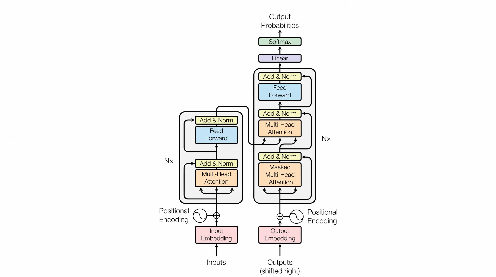

# CS336：从零开始的语言模型

> Stanford CS336 · Language Modeling from Scratch · Stanford / Spring 2026
> 讲师：Tatsunori Hashimoto（Tatsu Hashimoto）、Percy Liang

## 这门课讲什么？

语言模型（Language Model，简称 LM）是现代自然语言处理的基石。从 ChatGPT 到 Claude，从代码助手到智能体（Agent），背后都是同一个东西：&#8203;**用海量文本训练出来的自回归语言模型**&#8203;。

这门课的理念类似操作系统课上“从零写一个操作系统”:&#8203;**带你亲手把一个语言模型从无到有造出来**&#8203;。它不满足于“会调用 API、会微调一个模型”，而是要求你弄懂每一个零件：

- **数据**&#8203;：预训练数据从哪里来？原始网页怎么变成干净的训练语料？
- **分词**&#8203;：文本怎么变成模型能处理的 token（词元）?
- **架构**&#8203;：Transformer（变换器）为什么长这样？每个组件起什么作用？
- **训练**&#8203;：优化器怎么写？学习率怎么调度？怎么在多块 GPU 上把训练跑起来？
- **规模化**&#8203;：模型越大越好吗？给定算力预算，模型该多大、数据该多少？
- **评估**&#8203;：训练出来的模型到底好不好？怎么科学地衡量？
- **后训练**&#8203;：预训练完的“续写机器”怎么变成会听指令、会推理的助手？

学完这门课，你应该能回答一个别人常常答不上来的问题：&#8203;**“你知道你的模型每一部分为什么是这样吗？”**

## 先修要求

| 要求 | 说明 |
| ---- | ---- |
| Python 熟练 | 作业脚手架极少，代码量比一般课程大一个数量级，软件工程能力很重要 |
| 深度学习 + 系统优化经验 | 需要熟悉 PyTorch，了解内存层级等基本系统概念 |
| 微积分、线性代数 | 能看懂矩阵、向量记号和运算即可 |
| 概率与统计基础 | 概率、高斯分布、均值、标准差等 |
| 机器学习基础 | 学过一门 ML 或深度学习课程 |

::: warning 提示
这是一门 5 学分的课程，&#8203;**实现量非常大**&#8203;，需要预留足够时间。
:::

## 课程结构

本笔记按照课程 19 次讲座的主题组织为以下几组笔记：

**基础入门**

- [课程总览与分词](/knowledge-planet/cs336/lecture-01-overview-tokenization/) —— 语言模型是什么、BPE 分词
- [PyTorch 与资源估算](/knowledge-planet/cs336/lecture-02-pytorch-resource-accounting/) —— einops、FLOPs/显存估算、Roofline 模型

**模型架构**

- [架构与超参数](/knowledge-planet/cs336/lecture-03-architectures-hyperparameters/) —— RMSNorm、RoPE、GQA、SwiGLU 与训练配方
- [注意力替代方案与混合专家](/knowledge-planet/cs336/lecture-04-attention-alternatives-moe/) —— 滑窗/SSM/稀疏注意力与 MoE

**系统与训练效率**

- [语言模型与分词PU](/knowledge-planet/cs336/lecture-05-gpus-tpus/) —— 硬件组织、Roofline、通信带宽
- [内核与 Triton](/knowledge-planet/cs336/lecture-06-kernels-triton/) —— 算子融合与 FlashAttention
- [并行策略](/knowledge-planet/cs336/lecture-07-08-parallelism/) —— DP/ZeRO/TP/PP

**规模化**

- [缩放定律](/knowledge-planet/cs336/lecture-09-11-scaling-laws/) —— Kaplan 与 Chinchilla
- [推理](/knowledge-planet/cs336/lecture-10-inference/) —— KV 缓存、连续批处理、投机解码

**评估**

- [语言模型评估](/knowledge-planet/cs336/lecture-12-evaluation/) —— 基准、污染、人类偏好与安全评估

**数据**

- [数据来源与数据集](/knowledge-planet/cs336/lecture-13-data-sources/) —— Common Crawl 与代表性数据集
- [过滤、去重与合成数据](/knowledge-planet/cs336/lecture-14-data-filtering-dedup/) —— 清洗管线与配比

**后训练与对齐**

- [SFT 与 RLHF](/knowledge-planet/cs336/lecture-15-sft-rlhf/)
- [RLVR：可验证奖励的强化学习](/knowledge-planet/cs336/lecture-16-rlvr/)
- [对齐与多模态](/knowledge-planet/cs336/lecture-17-alignment-multimodality/)

## 2026 春季学期日程

| # | 日期 | 主题 | 讲师 |
| - | ---- | ---- | ---- |
| 1 | 3 月 30 日 | 课程总览、分词 | Percy |
| 2 | 4 月 1 日 | PyTorch（einops）、资源估算（FLOPs、显存、运算强度）| Percy |
| 3 | 4 月 6 日 | 架构、超参数 | Tatsu |
| 4 | 4 月 8 日 | 注意力替代方案与混合专家 | Tatsu |
| 5 | 4 月 13 日 | GPU、TPU | Tatsu |
| 6 | 4 月 15 日 | 内核、Triton | Percy |
| 7 | 4 月 20 日 | 并行 | Percy |
| 8 | 4 月 22 日 | 并行 | Tatsu |
| 9 | 4 月 27 日 | 缩放定律 | Tatsu |
| 10 | 4 月 29 日 | 推理 | Percy |
| 11 | 5 月 4 日 | 缩放定律 | Tatsu |
| 12 | 5 月 6 日 | 评估 | Percy |
| 13 | 5 月 11 日 | 数据（来源、数据集）| Percy |
| 14 | 5 月 13 日 | 数据（过滤、去重、混合、合成数据）| Percy |
| 15 | 5 月 18 日 | 训练中后期（SFT/RLHF）| Tatsu |
| 16 | 5 月 20 日 | 后训练——RLVR | Tatsu |
| 17 | 5 月 27 日 | 对齐——多模态 | Percy |
| 18 | 6 月 1 日 | 客座讲座：Daniel Selsam | — |
| 19 | 6 月 3 日 | 客座讲座：Dan Fu | — |

## 参考资料

- [课程官网（Stanford CS336）](https://cs336.stanford.edu/)
- [课程讲座视频（YouTube 播放列表）](https://www.youtube.com/playlist?list=PLoROMvodv4rOY23Y0TuT1gMvI41A2MBIy)
- [官方代码仓库（stanford-cs336）](https://github.com/stanford-cs336)
- [2025 春季学期存档](https://stanford-cs336.github.io/spring2025/)
