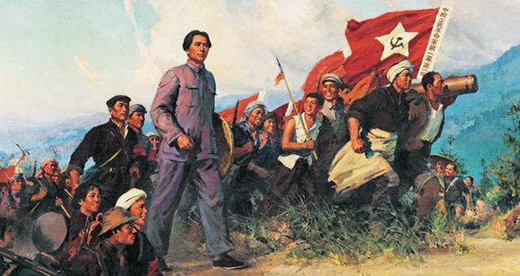

# 毛泽东思想

毛泽东同志是伟大的马克思主义者，伟大的无产阶级革命家、战略家、理论家，是马克思主义中国化的伟大开拓者、中国社会主义现代化建设事业的伟大奠基者，是近代以来中国伟大的爱国者和民族英雄，是党的第一代中央领导集体的核心，是领导中国人民彻底改变自己命运和国家面貌的一代伟人，是为世界被压迫民族的解放和人类进步事业作出重大贡献的伟大国际主义者。[^1]

毛泽东同志高度重视、始终坚持用马克思主义基本原理解决中国的实际问题，在同各种错误倾向作斗争并深刻总结中国革命经验的过程中创立了毛泽东思想，在探索适合中国国情的社会主义建设道路的实践中丰富和发展了毛泽东思想。

## Contents

- [毛泽东著作导读](/knowledge-planet/maoism/毛泽东著作导读/intro)
- [毛主席语录](/knowledge-planet/maoism/毛主席语录)

## References

- [中文马克思主义文库](https://www.marxists.org/chinese/index.html)

[^1]: 习近平：在纪念毛泽东同志诞辰130周年座谈会上的讲话，2023年12月26日，上午。
