# CloudMatrix384：当 384 颗 NPU 变成一台计算机

Pengfei Zuo 等（华为 & SiliconFlow） · arXiv 2025-06-15 提交，本解读依据 v3（2025-06-19）

[Paper](https://arxiv.org/abs/2506.12708)

大模型推理的瓶颈正在从算力转向互连。以 DeepSeek-R1 为例：671B 参数的 MoE 模型，每个 token 只激活 37B，但要在 256 个路由专家里挑 8 个——这意味着每个解码步都得把 token 派发到散布在各处的专家手里，再把结果收回来。传统 AI 集群的层级式网络处理不了这种通信强度：节点内 NVLink 快，跨节点 RDMA 慢一个数量级，于是专家并行（EP）被迫圈死在一个机柜里，KV 缓存的调度也被数据局部性捆住手脚。

华为的 CloudMatrix384 换了一条路：用自研统一总线（UB，Unified Bus）把 384 颗 Ascend 910 NPU 和 192 颗 Kunpeng CPU 织成一台全对等互连的“超节点”，跨节点带宽衰减不到 3%、延迟增加不到 1 µs。在这台“机柜大小的计算机”上，配套的 CloudMatrix-Infer 推理系统把 prefill、decode、缓存拆成三个独立伸缩的资源池，将专家并行推到 EP320——每个 NPU die 恰好承载一个专家。论文报告，在 DeepSeek-R1（INT8）上，其 decode 计算效率达到 1.29 tokens/s/TFLOPS，高于已发表的 SGLang on H100（1.10）与 DeepSeek on H800（1.17）结果；prefill 效率 4.45 tokens/s/TFLOPS 同样领先。下文按论文原文的章节顺序展开：背景与挑战、超节点架构、推理系统设计、实验评估。

## 1 背景与挑战

论文第一章与第二章交代了两层背景。

**LLM 的三大趋势重塑了基础设施需求**：参数规模迈向千亿到万亿级；MoE 架构成为主流，以结构化稀疏换取规模效率，但引入了专家路由与同步的系统级挑战；上下文窗口从数万扩展到百万级 token，KV 缓存容量随并发用户线性增长，其分布、放置与访问方式成为系统设计的核心约束。

**由此归纳出四大基础设施挑战**：

1. **通信密集并行的扩展**：TP 与 EP 需要频繁、细粒度、低延迟的通信，而传统集群的 RDMA 网络只为 DP/PP 这类低流量模式优化，迫使 TP/EP 组被 confinement 在单节点内。
2. **异构负载下的高利用率**：训练偏计算密集、decode 偏访存密集、自动驾驶等任务偏 CPU 预处理，固定配比的节点必然造成过度配置或闲置。
3. **AI 与数据密集负载的融合执行**：数据摄取、检索、分析与 AI 工作流交错，传统面向通用负载的基础设施难以满足其通信与编排需求。
4. **内存级存储性能**：PB 级数据集、多 TB 检查点与大 KV 缓存要求存储具备内存级的带宽、延迟与 IOPS，否则 NPU 会因数据饥饿而空转。

CloudMatrix 的架构愿景正是对这四条挑战的正面回答。

## 2 CloudMatrix384 超节点架构

### 2.1 设计愿景：一切资源皆可对等池化

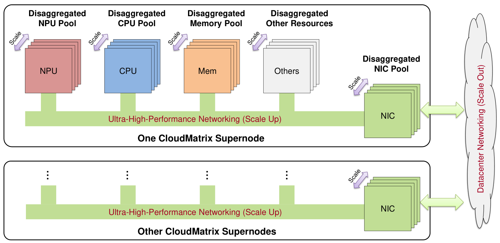

> 来源：原论文 Figure 1。读图重点：各异构资源脱离 CPU 层级中介，直接挂在统一的高性能网络上，按任务特性自由组合。

CloudMatrix 的核心原则是**全对等高带宽互连 + 细粒度资源解耦**：NPU、CPU、DRAM、SSD、网卡等组件不经 CPU 中介直接通信，可被动态池化、统一访问、独立伸缩。CloudMatrix384 是这一愿景的首个生产级实现。

### 2.2 整体架构与三个网络平面

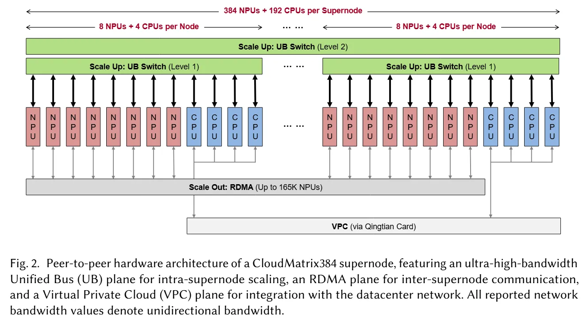

> 来源：原论文 Figure 2。读图重点：UB 平面是超节点内的 scale-up 主干，支撑跨节点的 TP/EP 与统一内存访问；RDMA 与 VPC 平面分别承担跨超节点通信和运维管理，三个平面各司其职。

超节点由 384 颗 Ascend 910 NPU 与 192 颗 Kunpeng CPU 组成，经 UB 协议全对等互联。关键设计点：

- **UB 平面**：超节点内的 scale-up 主干，384 颗 NPU 与 192 颗 CPU 经 UB 交换机非阻塞全互联。跨节点通信带宽衰减低于 3%、延迟增加不足 1 µs——“节点边界”在体验上消失了。论文给出的设计理念是“一切资源皆可池化、平等对待、自由组合”。
- **RDMA 平面**：跨超节点的 scale-out 通道（当前采用 RoCE），仅 NPU 参与，承担推理时 prefill 到 decode 的 KV 缓存传输，与 UB 平面物理隔离。
- **VPC 平面**：经 Qingtian DPU 卡接入数据中心网络，负责部署、监控、调度等管理面与持久存储访问。

### 2.3 硬件组件

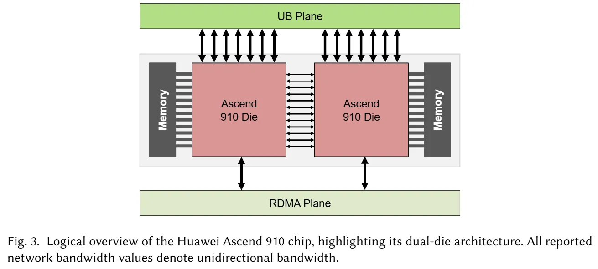

> 来源：原论文 Figure 3。读图重点：每 die 含 24 个 AIC 矩阵核心与 48 个 AIV 向量核心，支持 FP16/BF16 与 INT8（无原生 FP8）；每 die 有 7 个收发器接入 UB 平面、1 个接口接入 RDMA 平面。

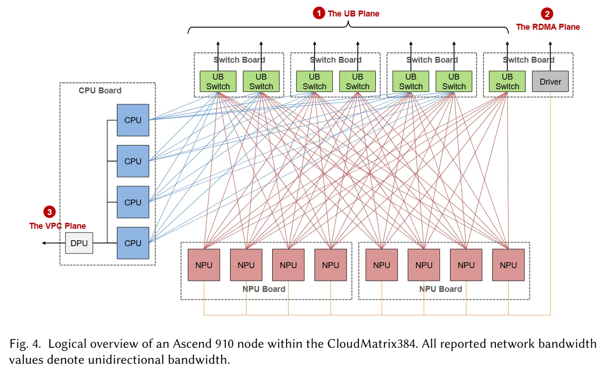

> 来源：原论文 Figure 4。读图重点：节点内 12 个处理器经 UB 链路接入板载 L1 交换芯片，构成单层 UB 平面；L1 芯片再逐一连向超节点交换层的对应子平面。

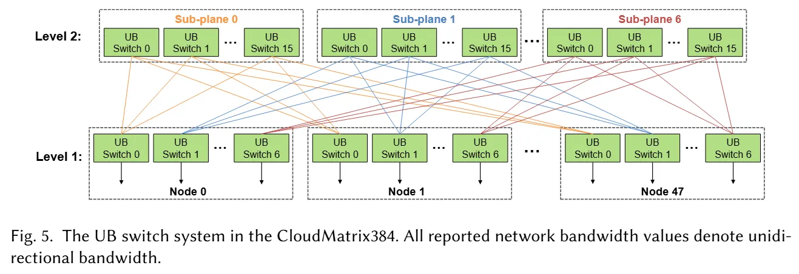

> 来源：原论文 Figure 5。读图重点：L2 交换层分为 7 个独立子平面，每个节点的上行带宽与其内部 UB 容量精确匹配，L2 层无超订——这保证了“跨节点 = 节点内”的体验。

超节点横跨 16 个机柜：12 个计算柜容纳 48 个节点（每节点 8 NPU + 4 CPU + 7 颗板载 UB 交换芯片），4 个通信柜安放第二层 UB 交换机。软件栈方面，Ascend 侧由 CANN（对标 CUDA 的算子层、运行时与驱动栈）承接框架到硬件的编译执行，云侧由 Huawei Cloud 的基础设施软件完成部署与调度。

### 2.4 为什么超节点与 DeepSeek 模型高度契合

论文用 DeepSeek-R1 作代表性负载，归纳了四项架构协同：

- **MoE 通信**：token 派发与专家输出合并的通信域横跨数百颗 NPU，UB 全互联拓扑提供低开销保障。
- **内存容量**：671B 参数的权重与 KV 缓存可借 TP/PP/EP 分布于超节点内存中。
- **缓存复用**：DeepSeek 报告的上下文缓存命中率超过 56%，而 UB 允许 NPU 以内存级带宽直接访问分离式 DRAM 池中的历史 KV，减少重复 prefill、降低 TTFT。
- **量化支持**：Ascend 910 无原生 FP8 但支持 INT8，为量化推理提供了硬件基础。

## 3 CloudMatrix-Infer：DeepSeek-R1 推理系统设计

### 3.1 PDC 对等分离架构

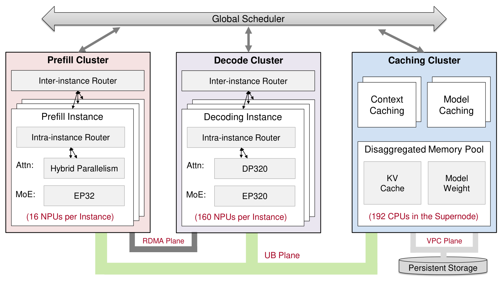

> 来源：原论文 Figure 9。读图重点：缓存集群建立在所有节点的 CPU DRAM 之上，prefill 与 decode 的 NPU 都能经由 UB 直接访问，不存在“谁的缓存归谁用”的局部性约束。

主流的 KV cache-centric 架构（如 NVIDIA Dynamo、Mooncake）把请求调度与 KV 缓存的物理位置紧耦合：请求优先发往已持有缓存的节点，以规避节点间拉取缓存的高延迟。CloudMatrix-Infer 则把推理系统拆成 **prefill、decode、caching 三个对等子系统**：缓存放进由全网 CPU DRAM 构成的分离式内存池，任何 NPU 都能通过 UB 以接近本地访问的延迟读写它。内存层级被“拍扁”之后，请求可以发往任意空闲实例——调度变成无状态的轻量操作，负载均衡不再被数据局部性绑架，decode 节点闲置的 DRAM 也汇入了共享缓存池。

三者之间形成生产者-消费者流水线：prefill 生成首 token 与初始 KV 缓存，decode 消费并增量更新 KV 缓存直至序列结束，caching 层同时提供上下文缓存（复用历史 KV，降低 TTFT）与模型缓存（加速模型加载、降低冷启动延迟）。

### 3.2 Decode：LEP 大规模专家并行

decode 阶段的目标是把 TPOT 压到 50 ms 以内。论文的做法是把 EP 度推到 320：160 颗 NPU（320 个 die），每个 die 恰好承载一个专家——32 个共享专家副本、256 个路由专家、外加 32 个冗余专家做负载均衡（EPLB）。专家粒度细到这个程度，单步延迟自然低，但代价是通信域扩大到 320 个 rank，传统 MoE 的三次 all-to-all 通信会被无限放大。

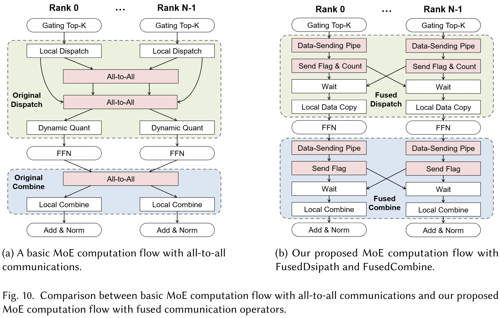

> 来源：原论文 Figure 10。读图重点：融合算子把路由元数据交换、token 派发、专家输出回收全部并入计算流程，all-to-all 被 UB 上的点对点直写取代。

**通算融合算子**。CloudMatrix-Infer 的应对是 FusedDispatch / FusedCombine 两个融合算子，配套四项优化：

1. **AIV-Direct 直写**&#8203;：用 AIV 向量核心经 UB 直接写远程 NPU 内存，绕开启动开销大的 SDMA 引擎，为 decode 这类延迟敏感场景铺出轻量通路。
2. **提前量化**&#8203;：派发前就把 BF16 token 量化成 INT8（每 token 消息从约 14 KB 降到 7.5 KB），直接削减最耗带宽阶段的通信量。
3. **静态预分配**&#8203;：为每个 rank 预分配收发缓冲区（每 die 约 645 MB，dispatch 与 combine 双缓冲避免竞态），消灭动态内存分配带来的 CPU-NPU 同步，整个图静态执行。
4. **数据发送流水线**&#8203;：拷贝进 UBuffer、计算目标偏移、发起 AIV-Direct 直写三个阶段按 token 微批流水执行，计算与通信彼此掩盖。

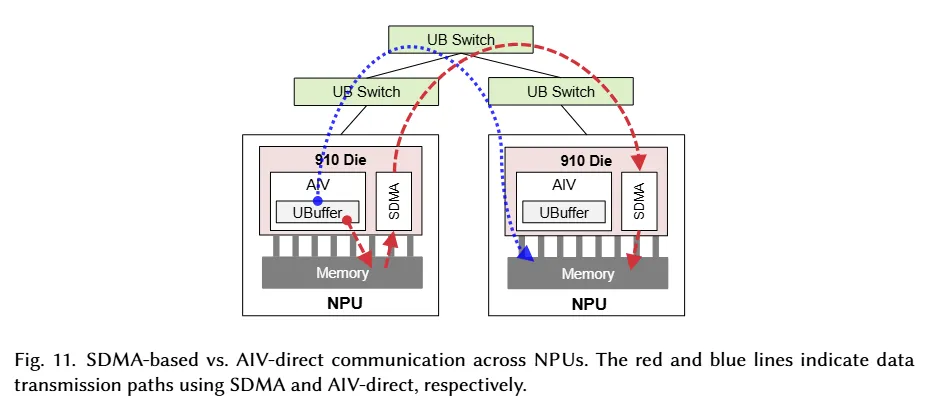

> 来源：原论文 Figure 11。读图重点：AIV-Direct 免去 SDMA 的启动开销，为小消息、高频率的 decode 通信提供快速通路。

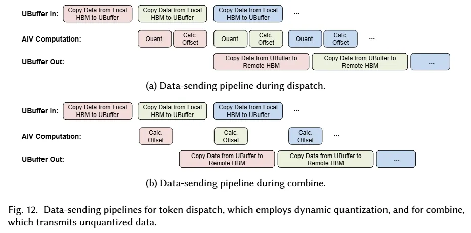

> 来源：原论文 Figure 12。读图重点：三个阶段按 token 微批流水执行，传输与计算不再互相等待。

**MLA 优化**。直接把 DeepSeek 的 MLA 算子迁移到 Ascend 910 有三个障碍：细粒度算子的启动开销累积、KV 缓存格式转换开销、序列长度变化对基于 MTP 的负载均衡的扰动。对策是算子融合与布局调整：将 RMSNorm、Q/K/V 投影、RoPE 融合为 MLAProlog，将 FlashAttention 与前后切片合并为 Fused Attention，并采用 N-Zigzag KV 缓存格式与 BNSD 布局适配硬件。

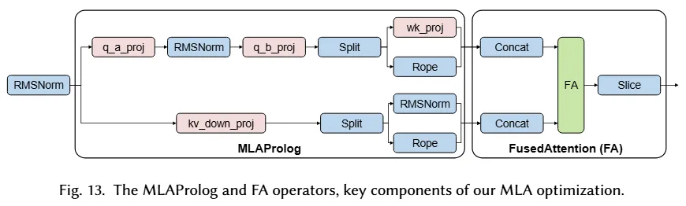

> 来源：原论文 Figure 13。读图重点：融合减少了细粒度算子的启动次数与 KV 格式转换，缩短 MLA 执行路径。

**微批次流水线与 MTP**。decode 流水线把注意力路径与 MoE 路径划入两条 stream，按 block 交错执行以掩盖 Dispatch 通信——由于 UB 上通信开销本就低于 RDMA 集群，通算掩盖的收益上限也相应收窄（消融见第 4 章）。MTP 支持上，为避免 CPU 频繁介入打断 NPU 执行，系统在解码开始时一次性备好全部元数据，并把采样完全移到 NPU 内部执行。

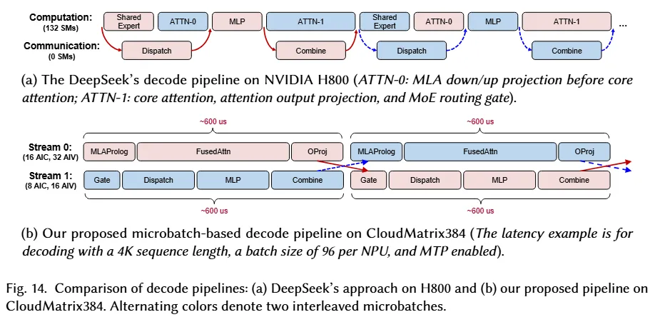

> 来源：原论文 Figure 14。读图重点：两个微批次的 attention 与 MoE 交错执行，整体每层延迟下降约 10%。

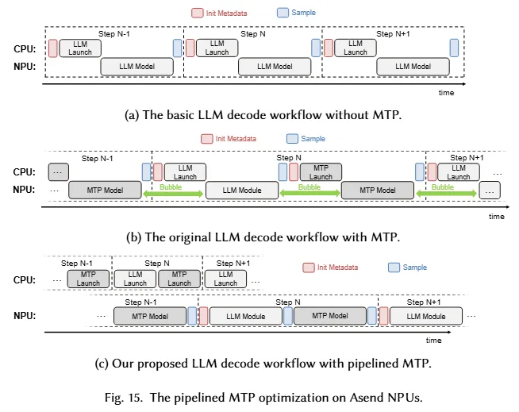

> 来源：原论文 Figure 15。读图重点：元数据预准备与 NPU 内采样消除了 CPU 介入造成的流水线中断。

### 3.3 Prefill：混合并行与异构流水线

prefill 是计算密集型，核心诉求是把 NPU 喂饱。这里有两个错配：一是请求长短不一，纯 DP 下短序列早早做完干等长序列；二是在途请求不足 DP 度时，部分分片直接空转。与 decode 对照着看，两个阶段的设计哲学恰好相反：

| 特性 | Decode | Prefill |
| :---: | :---: | :---: |
| 核心目标 | 低延迟 | 高吞吐量 |
| 工作负载 | 处理短序列，逐个生成 token | 处理长序列和大微批次 |
| 主要挑战 | 减少单个 token 的生成时间 | 避免计算单元空闲，管理资源争用 |
| 设计哲学 | 紧密耦合：通信与计算交错，快速响应 | 分离与重叠：通信与计算分离，并尽可能并行执行 |

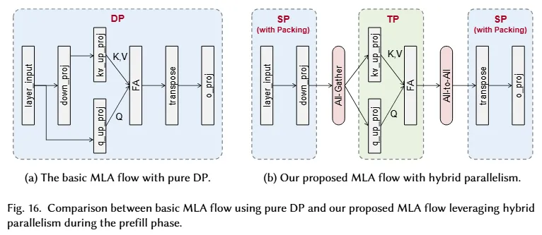

> 来源：原论文 Figure 16。读图重点：MLA 被拆成三段，第一、三段用 SP + 序列打包消除长短序列不均，第二段注意力计算按 head 切分做 TP。

**SP-TP-SP 混合并行**。解法是把 MLA 拆成三段：与 token 位置无关的 down_proj、o_proj 用序列打包的 SP，长短请求的 token 均匀铺到各 die 上；中间的 FlashAttention 按 head 做 TP。代价是引入一次 All-Gather 和一次 All-to-All，但 UB 带宽充足，单位通信量反而因 TP 分片而更小。

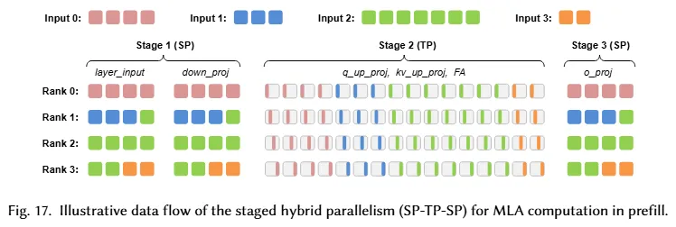

> 来源：原论文 Figure 17。读图重点：两次额外集合通信的交换量都经过降维或分片收缩，开销可控。

**微批次流水线**。H800 上靠预留部分 SM 做通信的双微批次方案移植过来并不划算，Ascend 干脆按角色分工——AIC 专注矩阵计算，AIV 承担 Dispatch/Combine 前后的轻量辅助运算，SDMA 引擎专管 MoE 大块数据搬运。

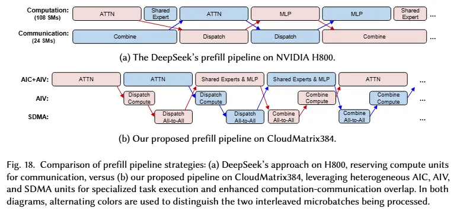

> 来源：原论文 Figure 18。读图重点：辅助运算卸载到 AIV、大块传输走 SDMA 专用通道，AIC 保持计算饱和。

**P/D 低干扰传输**。prefill 产出的 KV 缓存经 RDMA 平面传输——与 UB 平面物理隔离，不干扰延迟敏感的 decode 流量；调度侧把 prefill 调度与 KV 传输卸载到 decode 调度器的后台线程异步执行。

由于 prefill 与 decode 采用不同的并行度，一对 P/D 实例之间的传输组织需要按模型拓扑做连接分组，以均衡两阶段间的通信流量。论文为此定义了两个量：

$$
r = \dfrac{d_{tp}^{pre}}{d_{tp}^{dec}}, \qquad g = \dfrac{d_{dp}^{dec}}{r}
$$

其中 $d_{tp}^{pre}$、$d_{tp}^{dec}$ 分别是 prefill 与 decode 的 TP 度，$d_{dp}^{dec}$ 是 decode 的 DP 度。代入实验配置——prefill 每实例 SP-TP-SP=32（每实例 16 NPU 即 32 个 die），decode 单实例 DP=320——可得 $r = 1/10$，$g = 320 / (1/10) = 3200$。也就是说，一对 P/D 实例内维护 3200 个传输组：组内下标 $i_g = \lfloor i_{dp}^{dec} / g \rfloor$，prefill 侧的 TP 组内下标 $i_{tp}^{pre} = i_g \cdot d_{tp}^{dec} + i_{tp}^{dec}$，每个传输组负责管理一对 P/D 实例之间的一部分 hidden states 与 KV 缓存传输。

### 3.4 UB 驱动的分布式缓存

支撑 PDC 架构的缓存层是 Huawei Cloud 的弹性内存服务（EMS），其底座是把超节点内所有节点的 CPU DRAM 聚合成的**分离式内存池**：UB 提供高速点对点访问与 DMA 零拷贝传输，软件侧由 SDK、中心控制器与节点级 Server 三组件管理，经一致性哈希定位数据、多粒度分配对抗碎片，并以 EVS SSD 做持久化分层。

池上提供两类服务：**上下文缓存**复用历史请求的 KV 前缀，命中时 prefill 直接从池中装载而非重算，显著降低 TTFT（多轮对话与长上下文场景收益最大）；**模型缓存**把模型权重块缓存在池中，加速模型部署与切换、降低冷启动延迟。

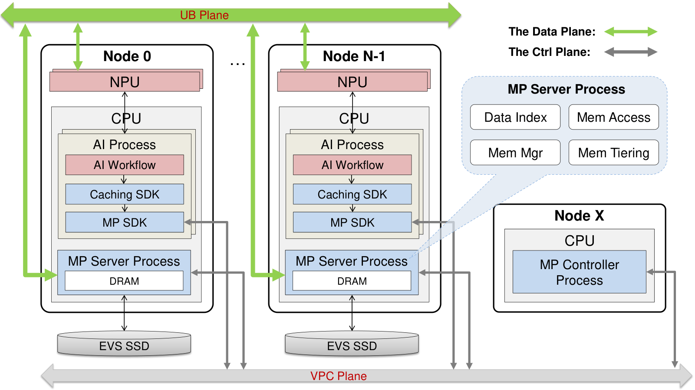

> 来源：原论文 Figure 19。读图重点：内存池由软件三组件与 UB 硬件能力共同支撑，任何 NPU 都能直接寻址池内数据。

### 3.5 INT8 量化

INT8 量化不是简单的精度裁剪，而是一套训练-free 的组合拳：混合精度策略（计算大户的 FFN 与 attention 大矩阵乘用 INT8，精度敏感的 norm 与 gating 保留 BF16/FP32）、离线自适应 scale 搜索、outlier 抑制的结构变换、按 token/按通道的混合粒度矩阵乘与块级截断误差补偿。它同时回答了一个硬件现实——Ascend 910 没有原生 FP8，INT8 是逼近 FP8 计算效率的路径。

## 4 实验评估

### 4.1 实验设置

评测用单个 CloudMatrix384 超节点中的 256 颗 Ascend 910，模型是 INT8 量化的 DeepSeek-R1（671B）；decode 单实例 160 NPU（EP320），prefill 6 实例共 96 NPU；MTP 采用单个投机 token、70% 有效接受率。对比基线是已公开的 DeepSeek on H800 与 SGLang on H100 数据，均为每加速器口径。注意这些对比并非同环境复测，且各系统 batch size 不完全一致（CloudMatrix-Infer decode 为 96，部分基线为 128）。

### 4.2 总体性能

**Prefill**（输入 4K，batch 共 16K tokens，据原论文 Table 2 重绘）：

| 配置 | 吞吐（tokens/s/NPU） | 效率（tokens/s/TFLOPS） |
| :--- | ---: | ---: |
| DeepSeek on H800（Blog） | 4,026 | 2.03 |
| SGLang on H100（默认） | 6,288 | 3.18 |
| CloudMatrix-Infer（默认） | 5,655 | 3.76 |
| DeepSeek on H800（Profile） | 7,839 | 3.96 |
| CloudMatrix-Infer（Perfect EPLB） | **6,688** | **4.45** |

默认配置下 CloudMatrix-Infer 的原始吞吐低于 SGLang 默认值，但计算效率已反超；在理想负载均衡（Perfect EPLB）假设下，6,688 tokens/s 的吞吐和 4.45 tokens/s/TFLOPS 的效率同时领先两个基线。默认与理想配置之间的差距，论文坦承来自 EPLB 负载均衡算法仍有改进空间——这也是文章里少见的自我保留。

**Decode**（KV 长度 4K，TPOT ≤ 50 ms，据原论文 Table 3 重绘）：

| 配置 | TPOT | 吞吐（tokens/s/NPU） | 效率（tokens/s/TFLOPS） |
| :--- | ---: | ---: | ---: |
| DeepSeek（Blog）on H800 | ~50 ms | 1,850 | 0.93 |
| DeepSeek（Profile）on H800 | ~50.2 ms | 2,325 | 1.17 |
| SGLang（Simu. MTP）on H100 | ~55.6 ms | 2,172 | 1.10 |
| CloudMatrix-Infer | 49.4 ms | 1,943 | **1.29** |

绝对吞吐上 CloudMatrix-Infer 不是最高——DeepSeek Profile 和 SGLang 都用了更大的 batch（128 vs 96）——但在单位算力产出这个口径上，1.29 tokens/s/TFLOPS 是四个配置中最高的。延迟-吞吐的权衡也有交代：SLO 收紧到 15 ms 时，系统把 batch 从 96 缩到 8，仍维持 538 tokens/s/NPU 的吞吐。

### 4.3 精度

INT8 量化后的 DeepSeek-R1 在 16 个基准（MMLU、MMLU-Pro、GPQA Diamond、AIME 2024、LiveCodeBench、C-Eval 等）上与官方 DeepSeek-R1 API 逐项对照，差异普遍在小数点后一到两位以内，部分基准（如 C-Eval 82.05 vs 79.92）反而略高。

### 4.4 消融实验

- **微批次流水线**：decode 吞吐在 batch 64/96/128 下分别提升 5.8%/9.4%/6.9%——明显低于 SGLang 在 H100 集群上报告的约 35%，论文将其归因于 UB 本已压低了 MoE 通信开销，通算掩盖的收益上限随之收窄；prefill 侧提升 23%–31%，每层延迟降约 24%。
- **MTP**：单投机 token 下 decode 吞吐提升 6%–49%，batch 越小收益越大；代价是每层执行延迟增加约 44%（874 µs → 1,260 µs），但 70% 接受率下平均每步产出 1.7 个 token，净收益为正。
- **上下文缓存**：缓存访问走 UB 与走 VPC 网络对比，复用率 50% 时 prefill 吞吐提升 1.42×，90% 时提升 2.28×——印证了 UB 对分离式内存池的决定性作用。

### 4.5 算子性能

微观基准把 CloudMatrix-Infer 的效率拆到了算子层。MoE 通信算子对比 DeepEP on H800：Dispatch 延迟全程更低（EP8 时 116 µs vs 163 µs，EP256 时 152 µs vs 194 µs），Combine 优势更显著（EP8 时 118 µs vs 318 µs，单 rank 带宽 131 GB/s，接近三倍）；但 Dispatch 的单 rank 有效带宽随 EP 度增大而衰减（EP256 降至 54 GB/s），论文将其列为待优化的扩展性瓶颈。MLA 算子与 FlashMLA on H800 利用率相当（计算密集 65.4% vs 66.7%，访存密集 84.1% vs 89.6%）。INT8 GEMM 在多种矩阵形状下保持 77.4%–82.7% 的算力利用率，且呈现计算受限特征，说明片内数据复用充分。

### 4.6 证据边界

所有结果来自单一模型（DeepSeek-R1）、单一硬件（Ascend 910）、单一服务配置；对比基线取自已发表数据而非同集群复测，跨硬件的每 TFLOPS 归一化抹不掉微架构与精度格式（FP8 vs INT8）的差异；prefill 的领先依赖 Perfect EPLB 这一理想化假设。更像是“架构可行性的强证据”，而非普适的性能通证。

## 5 结论与展望

**CloudMatrix384 证明了：当互连带宽不再随节点边界断崖式衰减，MoE 推理系统的设计空间会被重新打开**&#8203;——EP320 的每-die-一专家部署、无状态的请求调度、全网 DRAM 池化的缓存，都是在这台“超节点计算机”上才成立的组合，而它们的效率证据（1.29 与 4.45 tokens/s/TFLOPS）在已发表对比中占优。

**这项工作更深远的影响在于视角**&#8203;：通信带宽与算力、显存一样，是推理系统的第一性资源。过去的系统设计把跨节点通信当作需要掩盖的成本，CloudMatrix384 则先把它变成可以自由花销的预算，再让 PDC 分离、LEP、通算融合这些机制围绕新的预算重新分工。

展望部分，论文给出了两条演进线索：硬件上，合并 VPC 与 RDMA 平面、构建更大规模超节点、把 CPU 物理解耦池化；系统上，向组件级分离（attention、MoE 乃至单个算子的独立部署池）与混合自适应部署演进。至于这条路线能否在更多模型、更多负载上复制同样的效率优势，还需要时间与其他硬件平台的回应。

## Resources

- [Paper: Serving Large Language Models on Huawei CloudMatrix384 (arXiv:2506.12708)](https://arxiv.org/abs/2506.12708)

## Citation

```bibtex
@article{zuo2025cloudmatrix384,
  title   = {Serving Large Language Models on Huawei CloudMatrix384},
  author  = {Zuo, Pengfei and Lin, Huimin and Deng, Junbo and Zou, Nan and Yang, Xingkun and Diao, Yingyu and Gao, Weifeng and Xu, Ke and Chen, Zhangyu and Lu, Shirui and others},
  journal = {arXiv preprint arXiv:2506.12708},
  year    = {2025}
}
```
