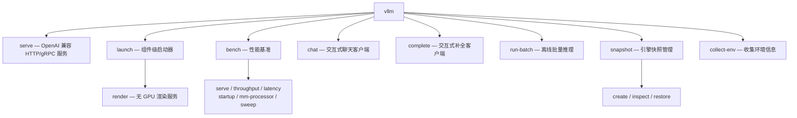

# 附录 D：命令行参数总览

本附录完整收录 vLLM CLI 的子命令与参数，是[第 4 章](/repos/vllm/entrypoints)入口层的伴读速查表。与全书一致，内容锚定快照 commit `bbc4ddeca9ece9851aad26f03afc4bab37c6e8df`：参数清单逐条比对自该快照的 `vllm/entrypoints/cli/`、`vllm/entrypoints/launchers/cli_args.py`、`vllm/engine/arg_utils.py`、`vllm/config/` 与 `vllm/benchmarks/`，默认值取自各 config dataclass 字段的字面默认。

两个使用提醒：

- vLLM 处于活跃开发期，CLI 是最易变动的表面之一；本附录给出的是**结构、默认值与语义**，具体 flag 列表请以 `vllm serve --help=all` 实测为准。
- 这一版 CLI 的显著变化是**参数按 config 类分组**：`vllm serve` 的帮助页以 `ModelConfig`、`CacheConfig`、`Frontend` 等组呈现，可用 `vllm serve --help=ModelConfig`（组名不分大小写）或 `vllm serve --help=max-model-len`（单个 flag）检索。本附录的小节划分与帮助页分组一一对应。

## 命令总览

入口 `vllm`（console script 指向 `vllm.entrypoints.cli.main:main`）注册 8 个顶级子命令，全部经 `FlexibleArgumentParser` 解析：



| 命令 | 用途 | 参数定义位置 |
|---|---|---|
| `vllm serve` | 拉起 OpenAI 兼容 API 服务（可 `--grpc` 切 gRPC） | `entrypoints/cli/serve.py` + `launchers/cli_args.py` |
| `vllm launch render` | 无 GPU 的渲染服务（预处理/后处理），复用 serve 参数 | `entrypoints/cli/launch.py` |
| `vllm bench <type>` | 基准测试，6 个子命令 | `entrypoints/cli/benchmark/` → `benchmarks/` |
| `vllm chat` / `vllm complete` | 连接已运行服务的交互式客户端 | `entrypoints/cli/openai.py` |
| `vllm run-batch` | 离线批量：读 JSONL、写结果文件 | `entrypoints/launchers/run_batch.py` |
| `vllm snapshot` | 创建/检查/恢复初始化后的引擎快照 | `entrypoints/cli/snapshot.py` |
| `vllm collect-env` | 打印软件/硬件环境报告（提 issue 附带） | `entrypoints/cli/collect_env.py` |
| `vllm -v` / `--version` | 打印版本号后退出 | `entrypoints/cli/main.py` |

## 解析器约定

所有子命令共用 `FlexibleArgumentParser`（`vllm/utils/argparse_utils.py:119`），它对标准 argparse 做了几处对使用体验影响很大的扩展：

- **连字符与下划线等价**：`--max-model-len` 与 `--max_model_len` 都能解析；帮助页检索同理。
- **JSON 参数可拆写**。下面两行等价，长嵌套配置（如 `--kv-transfer-config`）不必手写整段 JSON：

  ```bash
  --json-arg '{"key1": "value1", "key2": {"key3": "value2"}}'
  --json-arg.key1 value1 --json-arg.key2.key3 value2
  ```

  列表元素还可用 `+` 逐个追加：`--json-arg.key4+ value3 --json-arg.key4+='value4,value5'`。
- **布尔参数自带反义开关**。绝大多数布尔参数经 `BooleanOptionalAction` 注册，`--enable-prefix-caching` 与 `--no-enable-prefix-caching` 等价于开/关；少数日志型开关（如 `--disable-log-stats`）是单向 `store_true`。
- **人类可读整数**。`--max-model-len` 支持 `-1`/`auto`；`--max-num-batched-tokens`、`--max-num-scheduled-tokens`、`--max-num-queued-tokens`、`--kv-cache-memory-bytes`、`--safetensors-prefetch-block-size` 支持 `1k`/`2M`/`1G` 后缀（小写按 10 进制、大写按 2 进制换算）。
- **配置文件**。`vllm serve --config serve.yaml` 可从 YAML 读入参数，命令行中跟在其后的 flag 仍可覆盖文件值。
- **`--task` 已移除**：改用 `--runner pooling`（配合 `--convert embed|classify|reward`）；传错时解析器会给出提示。

## vllm serve

最常用的命令。解析器构成（`launchers/cli_args.py:397` 的 `make_arg_parser`）：

1. 位置参数 `model_tag`（可省，落到 `--model` 默认值 `Qwen/Qwen3-0.6B`；命令行同时给出时 `model_tag` 胜出）；
2. serve 专属参数 4 个；
3. Frontend 组（`FrontendArgs`，HTTP 服务与协议层）；
4. 引擎参数（`AsyncEngineArgs.add_cli_args`，按 config 组注册）。

### serve 专属参数

| 参数 | 类型 | 默认值 | 说明 |
|---|---|---|---|
| `model_tag` | str（位置，可省） | — | 要服务的模型名或路径，可省略（省略时用 `--model` 默认值） |
| `--headless` | flag | 关 | 无头模式：本进程只跑 EngineCore，不启动 API server，用于多节点 DP 拓扑 |
| `--api-server-count`, `-asc` | int | None | API server 进程数；缺省取 `--data-parallel-size` |
| `--config` | str | None | YAML 配置文件路径，文件内参数可被后续命令行 flag 覆盖 |
| `--grpc` | flag | 关 | 改为启动 gRPC 服务（需 `pip install vllm[grpc]`） |

### Frontend 组（OpenAI 协议与 HTTP 服务）

对应 `BaseFrontendArgs` / `FrontendArgs`（`vllm/entrypoints/launchers/cli_args.py`）。这一组决定请求如何被协议层消费，与引擎内部无关。

| 参数 | 类型 | 默认值 | 说明 |
|---|---|---|---|
| `--lora-modules` | list | None | 挂载的 LoRA 适配器，`name=path` 旧格式或 JSON（可含 `base_model_name`） |
| `--chat-template` | str | None | chat 模板：文件路径或单行模板字符串 |
| `--chat-template-content-format` | str | `auto` | 模板中 content 的渲染形式：`string`（纯文本）或 `openai`（分块字典列表） |
| `--trust-request-chat-template` | bool | 关 | 是否信任请求自带的 chat 模板；默认强制用服务端模板 |
| `--default-chat-template-kwargs` | dict | None | 传给模板渲染器的默认 kwargs，请求级可覆盖；如 `{"enable_thinking": false}` |
| `--response-role` | str | `assistant` | `add_generation_prompt=true` 时返回的角色名 |
| `--return-tokens-as-token-ids` | bool | 关 | 将 token 表示为 `token_id:{id}` 字符串，便于识别不可 JSON 编码的 token |
| `--enable-auto-tool-choice` | bool | 关 | 启用自动工具选择，需配合 `--tool-call-parser` |
| `--exclude-tools-when-tool-choice-none` | bool | 关 | `tool_choice='none'` 时不在提示中注入工具定义 |
| `--tool-call-parser` | str | None | 工具调用解析器名（内置或 `--tool-parser-plugin` 注册的） |
| `--tool-parser-plugin` | str | `''` | 动态注册工具调用解析器的插件代码 |
| `--tool-strict-level` | str | `auto` | 结构化标签工具调用的服务端严格度下限：`auto`/`function`/`parameter` |
| `--tool-server` | str | None | 外部工具服务器 `host:port` 列表，逗号分隔；`demo` 用内置演示工具 |
| `--log-config-file` | str | env | vLLM 与 uvicorn 共用的日志配置 JSON 路径（默认取 `VLLM_LOGGING_CONFIG_PATH`） |
| `--max-log-len` | int | None | 日志中打印的 prompt 字符数/ID 数上限，None 不限 |
| `--enable-prompt-tokens-details` | bool | 关 | 在 usage 中返回 `prompt_tokens_details` |
| `--enable-per-request-metrics` | bool | 关 | 响应中附带每请求计时指标（与 `--disable-log-stats` 互斥） |
| `--enable-server-load-tracking` | bool | 关 | 在应用状态中跟踪 `server_load_metrics` |
| `--enable-force-include-usage` | bool | 关 | 流式响应每个 chunk 都带 usage |
| `--sse-keep-alive-interval` | int | 0 | 流式空闲时每隔 N 秒发 SSE 注释行防代理断连；0 关闭 |
| `--enable-tokenizer-info-endpoint` | bool | 关 | 开放 `/tokenizer_info` 端点（会暴露 chat 模板等配置） |
| `--enable-log-outputs` | bool | 关 | 记录模型输出（需 `--enable-log-requests`） |
| `--enable-log-deltas` | bool | 开 | 是否记录增量输出（仅在 `--enable-log-outputs` 下有意义） |
| `--cohere-is-reasoning-model` | bool | 开 | 仅 Cohere 端点：以 `thinking` 块而非 `tool_plan` 呈现思维链 |
| `--cohere-format` | str | `cmd4` | 仅 `--tokenizer-mode cohere`：Cohere 提示格式 `cmd4`/`cmd3`，选错会导致输出异常 |
| `--log-error-stack` | bool | dev 模式开 | 错误响应记录堆栈（默认随 `VLLM_SERVER_DEV_MODE`） |
| `--tokens-only` | bool | 关 | 只启用 Tokens In<>Out 端点，用于全分离部署 |
| `--enable-scale-out` | bool | 关 | 注册横向扩展端点（`/render`、`/derender`、`/inference/v1/generate`） |
| `--fingerprint-mode` | str | `full` | 响应 `system_fingerprint` 策略：`full`（版本+并行度+配置哈希）/`hash`/`custom`/`none` |
| `--fingerprint-value` | str | None | `--fingerprint-mode=custom` 时的字面指纹串 |
| `--host` | str | None | 监听地址 |
| `--port` | int | 8000 | 监听端口 |
| `--data-parallel-supervisor-port` | int | 9256 | 多端口外部 LB 模式下聚合健康检查的 HTTP 端口 |
| `--dp-supervisor-probe-interval-s` | float | 5.0 | 聚合健康探测间隔秒数 |
| `--dp-supervisor-probe-timeout-s` | float | 5.0 | 子健康探测失败重试等待秒数 |
| `--dp-supervisor-probe-failure-threshold` | int | 3 | 连续失败多少次判定子实例不健康 |
| `--uds` | str | None | Unix domain socket 路径；设置后忽略 host/port |
| `--uvicorn-log-level` | str | `info` | uvicorn 日志级别（`critical`…`trace`） |
| `--disable-uvicorn-access-log` | bool | 关 | 关闭 uvicorn 访问日志 |
| `--disable-access-log-for-endpoints` | str | None | 排除访问日志的端点列表，如 `"/health,/metrics"` |
| `--allow-credentials` | bool | 关 | CORS 允许携带凭据 |
| `--allowed-origins` | list | `["*"]` | CORS 允许的来源 |
| `--allowed-methods` | list | `["*"]` | CORS 允许的方法 |
| `--allowed-headers` | list | `["*"]` | CORS 允许的头 |
| `--api-key` | list | None | 要求请求头携带其一密钥；**只保护 `/v1`、`/v2`、`/inference` 前缀**，不能作为唯一安全手段 |
| `--ssl-keyfile` / `--ssl-certfile` | str | None | TLS 私钥/证书文件路径 |
| `--ssl-ca-certs` | str | None | CA 证书文件 |
| `--enable-ssl-refresh` | bool | 关 | 证书文件变化时刷新 SSL 上下文 |
| `--ssl-cert-reqs` | int | 0（不校验） | 是否要求客户端证书（stdlib `ssl` 语义） |
| `--ssl-ciphers` | str | None | TLS 1.2 及以下的加密套件 |
| `--root-path` | str | None | 应用在路径代理之后时的 FastAPI `root_path` |
| `--middleware` | list | `[]` | 额外 ASGI 中间件（可多次传入；import 路径，函数或类） |
| `--enable-request-id-headers` | bool | 关 | 响应附带 `X-Request-Id` 头 |
| `--disable-fastapi-docs` | bool | 关 | 关闭 OpenAPI schema、Swagger UI 与 ReDoc 端点 |
| `--h11-max-incomplete-event-size` | int | 4 MiB | h11 解析器允许的不完整 HTTP 事件最大字节数（防 header 滥用） |
| `--h11-max-header-count` | int | 256 | 单请求允许的 HTTP 头数量上限 |
| `--enable-offline-docs` | bool | 关 | 为隔离环境启用内置静态资源的离线文档 |
| `--enable-flash-late-interaction` | bool | 开 | 在 API 进程内用 GPU 做 pooling 的 MaxSim 打分 |

### 引擎参数

`AsyncEngineArgs.add_cli_args`（`vllm/engine/arg_utils.py`）按 config 组注册。**除注明 `store_true` 外，布尔参数均支持 `--no-*` 反义**；"默认由引擎推导"指 CLI 缺省为 None、最终值在 `create_engine_config` 中按模型/硬件/并行度决定。

#### ModelConfig 组（模型与词元化）

对应 `ModelConfig`（`vllm/config/model.py`）。

| 参数 | 类型 | 默认值 | 说明 |
|---|---|---|---|
| `--model` | str | `Qwen/Qwen3-0.6B` | 模型名或路径；也是未设 `--served-model-name` 时指标的 `model_name` 标签 |
| `--runner` | str | `auto` | 运行形态：`generate`（生成）/`pooling`（嵌入、rerank、reward 等） |
| `--convert` | str | `auto` | 用适配器转换模型用途，最常见是把生成模型适配为 pooling 任务（`embed`/`classify`/`reward`） |
| `--tokenizer` | str | None | 词元化器名或路径，缺省用 `--model` |
| `--tokenizer-mode` | str | `auto` | `auto`/`hf`/`slow`/`mistral`/`deepseek_v32`/`deepseek_v4`/`deepseek_v41`/`kimi_k3`/`cohere` 等，可由插件扩展 |
| `--trust-remote-code` | bool | 关 | 下载模型/词元化器时信任远端自定义代码 |
| `--dtype` | str | `auto` | 权重与激活精度：`auto`/`half`/`bfloat16`/`float`（FP32）；AWQ 建议 `half` |
| `--seed` | int | 0 | 随机种子；必须全局一致，否则 TP 各 rank 采样不一致 |
| `--hf-config-path` | str | None | HF config 的名称或路径，缺省用 `--model` |
| `--allowed-local-media-path` | str | `''` | 允许 API 读取的本地媒体目录（有安全风险，仅限受信环境） |
| `--allowed-media-domains` | list | None | 限制多模态输入的媒体 URL 域名 |
| `--revision` | str | None | 模型版本：分支、tag 或 commit |
| `--code-revision` | str | None | 模型代码在 HF Hub 上的版本 |
| `--tokenizer-revision` | str | None | 词元化器在 HF Hub 上的版本 |
| `--max-model-len` | int | 由模型 config 推导 | 上下文总长（prompt+输出）；支持 `1k` 等后缀与 `-1`/`auto`（自动取显存能容纳的最大值） |
| `--quantization`, `-q` | str | None | 量化方法；缺省时先看模型 config 的 `quantization_config`，再视为未量化 |
| `--quantization-config` | dict | None | 用户级量化配置：按层类型（linear/moe）给规格与忽略模式 |
| `--allow-deprecated-quantization` | bool | 关 | 允许已弃用的量化方法 |
| `--enforce-eager` | bool | 关 | 强制 eager 执行；等价于 `-cc.mode=none -cc.cudagraph_mode=none` |
| `--enable-return-routed-experts` | bool | 关 | 捕获并返回 MoE 路由专家的辅助输出 |
| `--return-sampling-mask` | bool | 关 | 返回每个采样的后处理 token 支撑集 |
| `--max-logprobs` | int | 20 | `logprobs` 请求允许返回的最大条数；-1 不设上限（可能 OOM） |
| `--logprobs-mode` | str | `raw_logprobs` | 返回内容：`raw_logprobs`/`processed_logprobs`/`raw_logits`/`processed_logits`（处理前/后） |
| `--use-fp64-gumbel` | bool | 关 | Gumbel 采样用 FP64 噪声，保住小概率事件但显著降吞吐 |
| `--enable-trace-replay` | bool | 关 | 允许请求强制按预定 token 序列解码（调试/RL 用，默认关闭以省缓冲） |
| `--disable-sliding-window` | bool | 关 | 禁用滑动窗口，按全量上下文截断 |
| `--disable-cascade-attn` | bool | 开（默认禁用级联注意力） | 级联注意力不改数学正确性，但可能引发数值问题；需显式 `--no-disable-cascade-attn` 才会启用 |
| `--skip-tokenizer-init` | bool | 关 | 跳过词元化/反词元化，输入输出均为 token id |
| `--enable-prompt-embeds` | bool | 关 | 允许经 `prompt_embeds` 直接传文本嵌入（形状错误会崩溃，仅限受信用户） |
| `--served-model-name` | list | None | 对外模型名（可多个）；响应与指标的 `model_name` 取第一个 |
| `--config-format` | str | `auto` | 模型 config 格式：`auto`/`hf`/`mistral` |
| `--hf-token` | bool\|str | None | 访问 HF 的 bearer token；裸 flag 表示用 `hf auth login` 存的 token |
| `--hf-overrides` | dict | `{}` | 覆盖/传给 HF config 的键值对 |
| `--model-class-overrides` | dict | `{}` | 按架构名把模型类映射到 `"module:class"`（开发调试用） |
| `--pooler-config` | JSON | None | pooling 模型的输出池化配置（`--pooler-config.'{"..."}'`） |
| `--generation-config` | str | `auto` | 生成配置来源：`auto`（模型目录）/`vllm`（不用）/目录路径；其中 `max_new_tokens` 会成为全服务输出上限 |
| `--override-generation-config` | dict | `{}` | 覆盖生成配置，如 `{"temperature": 0.5}` |
| `--enable-sleep-mode` | bool | 关 | 引擎休眠（仅 CUDA/HIP），配合 levels 1/2 释放权重或 KV |
| `--sleep-preserve-parameter-names` | list | `[]` | level-2 休眠时保留的参数名 glob |
| `--enable-cumem-allocator` | bool | 关 | 启用 cumem 自定义分配器（休眠模式会自动开启） |
| `--enable-nccl-comm-suspend` | bool | 关 | 休眠时用 `ncclCommSuspend/Resume` 释放通信器内存（实验） |
| `--model-impl` | str | `auto` | 模型实现：`auto`/`vllm`/`transformers`/`terratorch` |
| `--logits-processors` | list | None | 额外 logits 处理器（全限定类名或类定义） |
| `--io-processor-plugin` | str | None | 启动时加载的 IOProcessor 插件名 |
| `--renderer-num-workers` | int | 1 | 渲染线程池大小（词元化、chat 模板、多模态预处理）；离线 `LLM` 不走此路径 |

#### LoadConfig 组（权重加载）

对应 `LoadConfig`（`vllm/config/load.py`）。

| 参数 | 类型 | 默认值 | 说明 |
|---|---|---|---|
| `--load-format` | str | `auto` | 权重格式：`auto`/`pt`/`safetensors`/`instanttensor`/`ipc_cache`/`npcache`/`dummy`/`tensorizer`/`runai_streamer`/`runai_streamer_sharded`/`sharded_state`/`mistral`/`modelexpress`，可插件扩展 |
| `--download-dir` | str | None | 权重下载目录，缺省用 HF 缓存目录 |
| `--safetensors-load-strategy` | str | None | safetensors 加载策略：缺省 mmap（NFS 下自动预取）；`lazy`/`eager`/`prefetch`/`torchao` |
| `--safetensors-prefetch-num-threads` | int | 内置默认 | 预取工作线程数 |
| `--safetensors-prefetch-block-size` | int | 内置默认 | 每次预取的读块字节数（支持 `1k` 后缀） |
| `--model-loader-extra-config` | dict | `{}` | 传给所选 loader 的额外配置 |
| `--ignore-patterns` | list | `["original/**/*"]` | 加载时忽略的文件 glob（默认跳过 llama 原始权重目录） |
| `--use-tqdm-on-load` | bool | 开 | 权重加载显示进度条 |
| `--pt-load-map-location` | str\|dict | `cpu` | `torch.load` 的 `map_location`，如 `{"cuda:1": "cuda:0"}` |

#### AttentionConfig / MambaConfig / 结构化输出组

| 参数 | 组 | 类型 | 默认值 | 说明 |
|---|---|---|---|---|
| `--attention-backend` | AttentionConfig | str | None | 指定注意力后端；`auto`/不设则自动选择（见[第 9 章](/repos/vllm/attention)） |
| `--mamba-backend` | MambaConfig | str | `TRITON` | Mamba SSU 内核后端 |
| `--mamba-ssu-algorithm` | MambaConfig | str | None | FlashInfer 后端的选择性状态更新算法，缺省用其 `auto` |
| `--enable-mamba-cache-stochastic-rounding` | MambaConfig | bool | 关 | 写 fp16 SSM 状态时用随机舍入，长序列数值更稳 |
| `--mamba-cache-philox-rounds` | MambaConfig | int | 0 | 随机舍入的 Philox 轮数，越大随机性越好 |
| `--reasoning-parser` | StructuredOutputsConfig | str | `''` | 思维链解析器，把推理内容解析成 OpenAI 格式 |
| `--reasoning-parser-plugin` | StructuredOutputsConfig | str | `''` | 动态加载思维链解析器的插件 |

#### ParallelConfig 组（并行与通信）

对应 `ParallelConfig`（`vllm/config/parallel.py`），语义详见[第 12 章](/repos/vllm/parallelism)。

| 参数 | 别名 | 类型 | 默认值 | 说明 |
|---|---|---|---|---|
| `--distributed-executor-backend` | | str | None | worker 执行器：`mp`（单机多进程，需设 `--nnodes`）/`ray` |
| `--pipeline-parallel-size` | `-pp` | int | 1 | 流水线并行组数 |
| `--master-addr` / `--master-port` | | str/int | `127.0.0.1` / 29501 | `mp` 后端多节点的主地址/端口 |
| `--nnodes` | `-n` | int | 1 | `mp` 后端多节点的节点数 |
| `--node-rank` | `-r` | int | 0 | `mp` 后端多节点的本节点序号 |
| `--distributed-timeout-seconds` | | int | None | `init_process_group` 超时；多节点慢下载场景应调大（NCCL 默认 600s） |
| `--cpu-distributed-timeout-seconds` | | int | None | CPU（gloo）通信组超时，默认 1800s |
| `--numa-bind` | | bool | 关 | GPU worker 绑定其 NUMA 节点的 CPU 与内存 |
| `--numa-bind-nodes` | | list | None | 每 GPU 绑定的 NUMA 节点号，如 `[0,0,1,1]`；缺省自动探测 |
| `--numa-bind-cpus` | | list | None | 每 GPU 绑定的 CPU 列表（`numactl --physcpubind` 语法），优先于节点绑定 |
| `--device-ids` | | list | None | 逗号分隔的物理 GPU 序号或 UUID，如 `"2,3,5,7"`；不设 `CUDA_VISIBLE_DEVICES`，Ray 后端无效 |
| `--tensor-parallel-size` | `-tp` | int | 1 | 张量并行组数 |
| `--decode-context-parallel-size` | `-dcp` | int | 1 | 分片 decode KV 的 rank 数；不扩进程数，无 PCP 时复用 TP |
| `--dcp-comm-backend` | | str | None | DCP 通信：`ag_rs`（默认）/`a2a`（MLA 模型每层少一次 NCCL 调用） |
| `--dcp-q-replicate` | | bool | None | 组内复制 MLA query 投影，省去每步 query all-gather |
| `--dcp-kv-cache-interleave-size` | | int | 1 | DCP KV 存储交错大小；将被 `--cp-kv-cache-interleave-size` 取代 |
| `--cp-kv-cache-interleave-size` | | int | None | 同上语义的新参数；缺省按 NIXL 传输需求自动解析 |
| `--prefill-context-parallel-size` | `-pcp` | int | 1 | 切分 prefill 序列计算的 rank 数；扩进程数但不增 KV 分片数 |
| `--data-parallel-size` | `-dp` | int | 1 | 数据并行组数；MoE 专家按 TP×PCP×DP 总量切分 |
| `--data-parallel-rank` | `-dpn` | int | None | 本实例 DP rank；设置即进入外部 LB 模式（仅 MoE） |
| `--data-parallel-start-rank` | `-dpr` | int | None | 次级节点的起始 DP rank |
| `--data-parallel-size-local` | `-dpl` | int | None | 本节点跑的 DP 副本数 |
| `--data-parallel-address` | `-dpa` | str | None | DP 集群主节点地址 |
| `--data-parallel-rpc-port` | `-dpp` | int | None | DP RPC 固定端口，各节点一致 |
| `--data-parallel-backend` | `-dpb` | str | `mp` | DP 后端：`mp` 或 `ray` |
| `--data-parallel-hybrid-lb` | `-dph` | bool | 关 | 节点内 vLLM 自负载均衡 + 节点间外部 LB；配合 `-dpr` 使用 |
| `--data-parallel-external-lb` | `-dpe` | bool | 关 | 全外部 LB（如 one-pod-per-rank 的 wide-EP）；显式给 `-dpn` 时自动开启 |
| `--data-parallel-multi-port-external-lb` | `-dpm` | bool（`store_true`） | 关 | 节点级 supervisor：每 DP rank 一个外部 LB API server，聚合健康检查 |
| `--enable-expert-parallel` | `-ep` | bool | 关 | MoE 用专家并行代替张量并行 |
| `--enable-batch-sharded-sampling` | | bool | None | TP 各 rank 只采样批切片；需 TP>1 且模型实现 `compute_logits_local` |
| `--enable-ep-weight-filter` | | bool | 关 | 加载时跳过非本 rank 专家权重，大幅省 MoE checkpoint 读取 I/O |
| `--all2all-backend` | | str | `allgather_reducescatter` | EP 通信后端：`deepep_high_throughput`/`deepep_low_latency`/`mori_*`/`moonep`/`nixl_ep`/`flashinfer_nvlink_*` 等 |
| `--enable-dbo` | | bool | 关 | 启用双批重叠（dual-batch overlap） |
| `--ubatch-size` | | int | 0 | 微批次（ubatch）大小 |
| `--enable-elastic-ep` | | bool | 关 | 弹性 EP，用无状态 NCCL 组 |
| `--elastic-ep-max-dp-size` | | int | None | 弹性 EP 支持的最大 DP 规模 |
| `--dbo-decode-token-threshold` | | int | 32 | 纯 decode 批超过该 token 数即走微批重叠 |
| `--dp-sync-interval` | | int | 16 | DP 完成同步 all-reduce 的间隔步数，各 rank 必须一致 |
| `--dbo-prefill-token-threshold` | | int | 512 | 含 prefill 批的微批重叠阈值 |
| `--disable-nccl-for-dp-synchronization` | | bool | None | 强制 DP 同步用 Gloo；异步调度开启时默认 True |
| `--enable-eplb` | | bool | 关 | 启用专家并行负载均衡（EPLB） |
| `--eplb-config` | | JSON | `{}` | EPLB 子配置 |
| `--expert-placement-strategy` | | str | `linear` | 专家摆放：`linear`（连续段）或 `round_robin`（轮转） |
| `--max-parallel-loading-workers` | | int | None | 分批并行加载权重时的最大 worker 数（防大模型 RAM OOM） |
| `--ray-workers-use-nsight` | | bool | 关 | Ray worker 用 nsight 采-profile |
| `--disable-custom-all-reduce` | | bool | 关 | 禁用自定义 all-reduce，退回 NCCL |
| `--worker-cls` | | str | `auto` | worker 类全名，`auto` 按平台选择 |
| `--worker-extension-cls` | | str | `''` | 动态混入 worker 的扩展类，供 `collective_rpc` 注入方法 |
| `--enable-fault-tolerance` | | bool | 关 | 启用故障容忍（如故障 DP 引擎核的缩容恢复） |
| `--fault-tolerance-config` | | JSON | `{}` | 故障容忍子配置 |

#### CacheConfig 组（KV Cache 与前缀缓存）

对应 `CacheConfig`（`vllm/config/cache.py`），机制见[第 7 章](/repos/vllm/kv-cache)。

| 参数 | 类型 | 默认值 | 说明 |
|---|---|---|---|
| `--block-size` | int | 由平台/模型决定 | KV 块大小（token 数）；不设为 None，构造后必为 int |
| `--gpu-memory-utilization`（别名 `--device-memory-utilization`） | float | 0.92 | 本实例可用的 GPU 内存比例（0–1）；多实例同卡时按各自比例分配 |
| `--kv-cache-memory-bytes` | int | None | 直接指定每 GPU KV 字节数（支持 `1k` 后缀）；设置后忽略 `gpu-memory-utilization` |
| `--kv-cache-dtype` | str | `auto` | KV 存储精度：`auto`/`fp8 (e4m3)`/`fp8_e5m2`/`nvfp4_4over6` 等，随平台而定 |
| `--num-gpu-blocks-override` | int | None | 覆盖 profile 出的 GPU 块数（测试抢占用） |
| `--enable-prefix-caching` | bool | 默认开 | 前缀缓存开关（CLI 缺省 None 交给引擎决策） |
| `--prefix-caching-hash-algo` | str | `sha256` | 块哈希：`sha256`/`sha256_cbor`/`xxhash`/`xxhash_cbor`（非加密哈希有碰撞风险） |
| `--prefix-cache-retention-interval` | int | 0 | 滑窗/Mamba 前缀缓存检查点保留间隔；0 只留语义检查点，None 密集保留 |
| `--kv-cache-dtype-skip-layers` | list | `[]` | 跳过 KV 量化的层（层号或 `sliding_window` 等类型名） |
| `--kv-sharing-fast-prefill` | bool | 关 | KV 共享模型（如 YOCO）允许部分层跳过 prefill token |
| `--swa-bounded-replay` | bool | 开 | 滑窗 KV 不进前缀缓存，命中后重算最后一窗重建（需 model runner V2） |
| `--mamba-cache-dtype` | str | `auto` | Mamba conv+SSM 状态精度 |
| `--mamba-ssm-cache-dtype` | str | `auto` | 仅 SSM 状态精度（conv 随 `--mamba-cache-dtype`） |
| `--mamba-block-size` | int | None | Mamba 缓存块大小，需为 8 的倍数且开启前缀缓存 |
| `--prefix-match-unit` | int | None | 前缀命中的最细 token 边界（可小于物理块，需整除各块大小） |
| `--mamba-cache-mode` | str | `none` | Mamba 缓存策略：`none`/`all`/`align`（开前缀缓存时默认 align） |
| `--enable-mamba-shared-prefix-checkpoint` | bool | 关 | 在共享前缀交界处也登记 Mamba "align" 检查点（EAGLE/MTP 恢复用） |
| `--replayssm-buffer-len` | int | 16 | ReplaySSM 逻辑历史长度 B（Mamba2） |
| `--use-replayssm` | bool | 关 | 用 ReplaySSM decode 内核：缓存近期 SSM 输入、flush 时才回写检查点 |
| `--kv-offloading-size` | float | None | KV 卸载缓冲大小（GiB，TP 时为各 rank 总和）；设置即启用 CPU 卸载 |
| `--kv-offloading-backend` | str | `native` | KV 卸载后端：`native`/`lmcache` |

#### OffloadConfig 组（CPU 卸载）

对应 `OffloadConfig`（`vllm/config/offload.py`）。

| 参数 | 类型 | 默认值 | 说明 |
|---|---|---|---|
| `--offload-backend` | str | `auto` | 权重卸载后端：`auto`（按子配置推断）`uva`（零拷贝）`prefetch`（异步预取） |
| `--cpu-offload-gb` | float | 0 | 每卡卸载到 CPU 的 GiB 数（UVA 零拷贝，等效扩显存，需快互联） |
| `--cpu-offload-params` | set | `[]` | 按参数名段筛选卸载对象（如 `experts`），空则非选择卸载 |
| `--offload-group-size` | int | 0 | 每 N 层一组、卸载组内末 `offload-num-in-group` 层（异步预取式） |
| `--offload-num-in-group` | int | 1 | 每组卸载的层数 |
| `--offload-prefetch-step` | int | 1 | 预取提前层数，越大越藏延迟但占显存 |
| `--offload-params` | set | `[]` | 预取卸载的参数名段筛选 |

#### MultiModalConfig 组（多模态）

对应 `MultiModalConfig`（`vllm/config/multimodal.py`）。

| 参数 | 类型 | 默认值 | 说明 |
|---|---|---|---|
| `--language-model-only` | bool | 关 | 全部模态限额归零，等价于对所有模态 `--limit-mm-per-prompt 0` |
| `--limit-mm-per-prompt` | JSON | 各模态 999 | 每请求各模态条目上限，支持计数式 `{"image": 16}` 或带选项式 `{"video": {"count": 1, "num_frames": 32}}` |
| `--enable-mm-embeds` | bool | 关 | 允许直接传多模态嵌入（形状错误会崩溃） |
| `--media-io-kwargs` | dict | `{}` | 按模态传给媒体处理的额外参数，如 `'{"video": {"num_frames": 40}}'` |
| `--mm-processor-kwargs` | dict | None | 透传给模型 processor 的覆盖项，如 `{"num_crops": 4}` |
| `--mm-processor-cache-gb` | float | 4 | 多模态处理器缓存 GiB；按 `(api_server_count + data_parallel_size)` 份复制 |
| `--mm-processor-cache-type` | str | `lru` | 处理器缓存类型：`lru`（镜像 LRU）或 `shm`（共享内存 FIFO） |
| `--mm-hasher-algorithm` | str | `blake3` | 多模态输入缓存哈希；FIPS 场景用 `sha256`/`sha512` |
| `--mm-shm-cache-max-object-size-mb` | int | 128 | shm 缓存单对象大小上限（MiB） |
| `--mm-encoder-only` | bool | 关 | 只跑编码器组件（分离部署的 Encoder 进程） |
| `--mm-encoder-tp-mode` | str | `weights` | 编码器 TP 用法：`weights`（切权重）或 `data`（批数据分发、各持全权重） |
| `--mm-encoder-attn-backend` | str | None | ViT 编码器注意力后端覆盖 |
| `--mm-encoder-attn-dtype` | str | None | ViT 注意力精度覆盖；`fp8` 走 FlashInfer cuDNN |
| `--mm-encoder-fp8-scale-path` | str | None | ViT FP8 逐层 Q/K/V scale JSON，提供则静态缩放 |
| `--mm-encoder-fp8-scale-save-path` | str | None | 动态缩放校准完成后保存 scale 的路径 |
| `--mm-encoder-fp8-scale-save-margin` | float | 1.5 | 自动保存 scale 时的安全裕量 |
| `--interleave-mm-strings` | bool | 关 | 配合 `--chat-template-content-format string` 的完全交错多模态支持 |
| `--skip-mm-profiling` | bool | 关 | 初始化时不做多模态显存 profiling，加快启动但需自估峰值 |
| `--video-pruning-rate` | float | None | 视频 token 剪枝比例 [0,1)，>0 启用 |
| `--video-pruning-method` | str | `evs` | 剪枝算法：`evs` 或 `vidcom2` |
| `--mm-tensor-ipc` | str | `direct_rpc` | 多模态张量跨进程方式：`direct_rpc`（msgspec 序列化）或 `torch_shm`（零拷贝） |
| `--mm-processor-device` | str | `auto` | HF processor 的图像/视频变换设备（仅 torchvision 快速 processor 生效） |
| `--mm-ipc-gpu-memory-gb` | float | 0 | 为前端进程 GPU 多模态工作（如硬解视频）预留的显存预算 |
| `--mm-device-do-normalize` | bool | 默认 None 交引擎 | 把 `do_normalize` 挪到 ViT 前的设备上执行，省 CPU |

#### LoRAConfig 组

对应 `LoRAConfig`（`vllm/config/lora.py`）。

| 参数 | 类型 | 默认值 | 说明 |
|---|---|---|---|
| `--enable-lora` | bool | None | 启用 LoRA（CLI 缺省 None，设 `--lora-modules` 即生效路径） |
| `--max-loras` | int | 1 | 单批次最多同时处理的 LoRA 数 |
| `--max-lora-rank` | int | 16 | 最大 LoRA 秩 |
| `--lora-dtype` | str | `auto` | LoRA 精度，auto 随基座 |
| `--enable-tower-connector-lora` | bool | 关 | 视觉塔与 connector 的 LoRA（实验，仅部分多模态模型） |
| `--max-cpu-loras` | int | None | CPU 内存中最多驻留的 LoRA 数，须 ≥ `max-loras` |
| `--fully-sharded-loras` | bool | 关 | LoRA 计算全分片；长序列/大 rank/大 TP 时更快 |
| `--lora-target-modules` | list | None | 限定可挂 LoRA 的模块后缀，如 `["o_proj", "qkv_proj"]` |
| `--default-mm-loras` | dict | None | 按模态默认挂载的 LoRA 路径（多模态专用） |
| `--specialize-active-lora` | bool | 关 | 按活跃 LoRA 数分别捕获 CUDA graph，启动更慢但变长使用更快 |
| `--enable-mixed-moe-lora-format` | bool | 关 | 强制用通用 2D MoE LoRA 包装，兼容 2D/3D 格式适配器混布 |
| `--enable-moe-shared-loras` | bool | 关 | MoE 专家适配器按 shared-outer 布局加载（lora_A/lora_B 专家间共享） |

#### ObservabilityConfig 组（可观测）

对应 `ObservabilityConfig`（`vllm/config/observability.py`），见[第 14 章](/repos/vllm/deployment)。

| 参数 | 类型 | 默认值 | 说明 |
|---|---|---|---|
| `--show-hidden-metrics-for-version` | str | None | 临时启用自指定版本起隐藏的弃用指标，如 `0.7` |
| `--otlp-traces-endpoint` | str | None | OpenTelemetry trace 上报 URL |
| `--collect-detailed-traces` | list | None | 指定模块收集细粒度 trace（有性能代价，需先设 OTLP 端点） |
| `--per-request-spec-decode-metrics` | str | `none` | 响应体携带投机解码接受度指标：`summary`/`detailed`（实验，仅 `n==1`） |
| `--kv-cache-metrics` | bool | 关 | KV 驻留指标（生命周期、空闲、复用间隔），需统计日志开启 |
| `--kv-cache-metrics-sample` | float | 0.01 | KV 指标采样率 (0,1] |
| `--cudagraph-metrics` | bool | 关 | CUDA graph 指标（填充/非填充 token 数、dispatch 模式频率） |
| `--enable-layerwise-nvtx-tracing` | bool | 关 | 逐层 NVTX 打点（与 CUDA graph 不兼容） |
| `--enable-mfu-metrics` | bool | 关 | 启用 MFU（Model FLOPs Utilization）指标 |
| `--enable-logging-iteration-details` | bool | 关 | EngineCore 记录每迭代请求数/token 数/CPU 耗时 |
| `--jit-monitor-mode` | str | `warn` | 预热后 JIT 编译事件的处理：`warn`/`error` |
| `--jit-monitor-verbose` | bool | 关 | 逐条记录 JIT 编译详情（仅调试） |

#### SchedulerConfig 组（调度）

对应 `SchedulerConfig`（`vllm/config/scheduler.py`），见[第 6 章](/repos/vllm/scheduler)。

| 参数 | 类型 | 默认值 | 说明 |
|---|---|---|---|
| `--max-num-batched-tokens` | int | 由引擎推导 | 单步最多处理的 token 数（token budget）；支持 `1k` 后缀 |
| `--max-num-scheduled-tokens` | int | = max-num-batched-tokens | 单步最多调度的 token 数；投机解码等场景可更小 |
| `--max-num-seqs` | int | 由引擎推导 | 单步最多处理的序列数；也是 runner 缓冲与 CUDA graph 捕获的规模基准 |
| `--max-num-active-seqs` | int | None | 只压 RUNNING 准入数（≤ max-num-seqs），decode 批更小而不缩 runner 能力 |
| `--max-num-queued-reqs` | int | None | API 进程级在途请求上限，超限返回 503；粗粒度容量阀 |
| `--max-num-queued-tokens` | int | None | API 进程级 prefill 阶段 prompt token 总量上限；TTFT QoS 阀 |
| `--long-prefill-token-threshold` | int | 0 | 超过该长度的 prompt 视为长 prefill 并受预算约束；0 关闭 |
| `--long-prefill-token-threshold-adaptive` | bool | 关 | 把长 prefill 阈值下限抬高到预算的公平份额 |
| `--scheduling-policy` | str | `fcfs` | 调度策略：`fcfs` 或 `priority`（值小先走，同级按到达序） |
| `--enable-chunked-prefill` | bool | 默认开 | 分块预填充开关（CLI 缺省 None 交引擎决策） |
| `--disable-chunked-mm-input` | bool | 关 | 多模态条目不允许被分块跨步调度 |
| `--scheduler-cls` | str | None | 调度器类路径，默认 vLLM 内置 Scheduler |
| `--scheduler-reserve-full-isl` | bool | 开 | 准入前检查整条输入序列能否放进 KV，防过度准入抖动 |
| `--watermark` | float | 0.0 | 准入时保留的空闲 KV 块比例 [0,1)，避免频繁抢占 |
| `--prefill-schedule-interval` | int | 1 | DP 部署中每 N 步才对齐准入一次新 prefill |
| `--disable-hybrid-kv-cache-manager` | bool | None | 强制各注意力层等量分配 KV；None 交环境与配置推导 |
| `--async-scheduling` | bool | None | 异步调度开关：True 用 AsyncScheduler 消除 GPU 空档，False 强制关闭，缺省由引擎决策 |
| `--stream-interval` | int | 1 | 流式发送的 token 缓冲粒度；越大省 host 开销、越小越平滑 |

#### CompilationConfig / KernelConfig 组（编译与内核）

| 参数 | 组 | 类型 | 默认值 | 说明 |
|---|---|---|---|---|
| `--cudagraph-capture-sizes` | CompilationConfig | list | None | 指定 CUDA graph 捕获的批大小列表 |
| `--max-cudagraph-capture-size` | CompilationConfig | int | None | 最大捕获尺寸；未指定时按 `[1,2,4]+8 步进…` 生成，上限默认 512（Blackwell 1024） |
| `--ir-op-priority` | KernelConfig | JSON | `{}` | 前向 IR 算子派发/下沉优先级 |
| `--enable-flashinfer-autotune` | KernelConfig | bool | None | 预热期跑 FlashInfer autotuning |
| `--moe-backend` | KernelConfig | str | `auto` | MoE 内核后端：`triton`/`deep_gemm`/`cutlass`/`flashinfer_trtllm`/`flashinfer_cutlass`/`marlin`/`aiter`（ROCm）等十余种 |
| `--linear-backend` | KernelConfig | str | `auto` | 线性层 GEMM 后端：`cutlass`/`flashinfer_*`/`marlin`/`deep_gemm`/`torch`/`machete`/`fbgemm` 等 |
| `--sparse-indexer-topk-backend` | KernelConfig | str | `auto` | DSA 稀疏索引 decode top-k 内核：`deep_select`/`cooperative`/`persistent`/`per_row`/`flashinfer`/`torch` |

#### VllmConfig 组（引擎级复合配置）

这一组多为"容器型"子配置或引擎级开关，对应 `VllmConfig` 的各个子对象；JSON 传参可用上文"JSON 参数可拆写"的简写。

| 参数 | 别名 | 类型 | 默认值 | 说明 |
|---|---|---|---|---|
| `--speculative-config` | `-sc` | JSON | None | 投机解码配置（也可用下面拆出的 spec 系 flag） |
| `--spec-method` | | str | None | 投机方法：`ngram`/`eagle`/`mtp` 等（见[第 13 章](/repos/vllm/spec-decode)） |
| `--spec-model` | | str | None | 草稿模型 / eagle head 名称 |
| `--spec-tokens` | | int | None | 每步提议的投机 token 数 |
| `--watermark-config` | | JSON | None | 文本水印配置 |
| `--diffusion-config` | `-dc` | JSON | None | 扩散 LLM（dLLM）配置 |
| `--kv-transfer-config` | | JSON | None | 分布式 KV 传输（P/D 分离、LMCache）配置 |
| `--kv-events-config` | | JSON | None | KV 块事件发布配置（供外部网关感知缓存） |
| `--ec-transfer-config` | | JSON | None | 分布式 encoder cache 传输配置 |
| `--ec-manager-config` | | JSON | `{}` | 自定义 encoder cache 管理器配置 |
| `--compilation-config` | `-cc` | JSON | `{}` | torch.compile 与 cudagraph 配置；支持 `-cc.mode=3` 式逐键简写 |
| `--attention-config` | `-ac` | JSON | `{}` | 注意力配置容器（单 flag `--attention-backend` 是其便捷入口） |
| `--engram-config` | | JSON | None | n-gram 嵌入存储与分片配置 |
| `--reasoning-config` | | JSON | None | 推理模型配置 |
| `--kernel-config` | | JSON | `{}` | 内核配置容器（`--moe-backend` 等是它的展开） |
| `--additional-config` | | dict | `{}` | 平台专属附加配置，随平台而定 |
| `--structured-outputs-config` | | JSON | `{}` | 结构化输出配置 |
| `--aux-output-config` | | JSON | `{}` | 执行辅助输出配置 |
| `--profiler-config` | | JSON | `{}` | profiling 配置（`vllm bench --profile` 依赖它） |
| `--optimization-level` | | str | `O2` | 优化档位：`O0`（最快启动）→ `O3`（最高性能） |
| `--performance-mode` | | str | `balanced` | 运行时取向：`interactivity`（小批量低延迟）/`throughput`（高并发聚合吞吐） |
| `--weight-transfer-config` | | JSON | None | RL 训练时权重传输配置 |
| `--disable-log-stats` | | flag（`store_true`） | 关 | 关闭统计日志 |
| `--aggregate-engine-logging` | | flag（`store_true`） | 关 | DP 时记录聚合而非逐引擎统计 |
| `--fail-on-environ-validation` | | bool | 关 | 环境校验失败时直接报错 |
| `--shutdown-timeout` | | int | 0 | 关停超时秒数：0 直接中止，>0 等待 |
| `--gdn-prefill-backend` | | str | None | GDN prefill 后端：`flashinfer`/`triton`/`cutedsl` |
| `--kda-prefill-backend` | | str | None | KDA prefill 后端：`auto`/`triton`/`flashkda`/`flashinfer`/`fused` |
| `--kda-decode-backend` | | str | None | KDA decode 后端：`auto`/`native`/`flashinfer`/`triton` |

#### AsyncEngineArgs（请求日志）

| 参数 | 类型 | 默认值 | 说明 |
|---|---|---|---|
| `--enable-log-requests` / `--no-enable-log-requests` | bool | 关 | 记录请求信息：INFO 记 ID/参数/LoRA，DEBUG 记输入内容 |

## vllm bench

`vllm bench` 嵌套 6 个子命令（`entrypoints/cli/benchmark/main.py`）；设 `VLLM_USE_RUST_BENCH=1` 时 `bench serve` 会被整体移交给外部 Rust 基准二进制。

| 子命令 | 用途 | 参数定义 |
|---|---|---|
| `bench serve` | 在线服务压测 | `vllm/benchmarks/serve.py` + 数据集参数组 |
| `bench throughput` | 离线批量吞吐 | `vllm/benchmarks/throughput.py` |
| `bench latency` | 单批请求延迟 | `vllm/benchmarks/latency.py` |
| `bench startup` | 冷/热启动时间 | `vllm/benchmarks/startup.py` |
| `bench mm-processor` | 多模态处理器延迟 | `vllm/benchmarks/mm_processor.py` |
| `bench sweep` | 参数扫描（5 个子子命令） | `vllm/benchmarks/sweep/cli.py` |

### bench serve

以 `--request-rate` 控制 Poisson/γ 到达过程，向 `/v1/completions` 等端点施压并汇总 TTFT/TPOT/ITL/E2EL 分位数。主要参数：

| 参数 | 类型 | 默认值 | 说明 |
|---|---|---|---|
| `--label` | str | = backend | 结果文件的前缀标签 |
| `--backend` | str | `openai` | 压测后端/端点类型（`vllm`、`openai`、`tgi` 等，随注册表而定） |
| `--base-url` | str | None | 不走 host/port 时直接给 base URL |
| `--host` / `--port` | str/int | `127.0.0.1` / 8000 | 目标服务地址 |
| `--endpoint` | str | `/v1/completions` | 压测的 API 端点路径 |
| `--header` | 键值对 | — | 每请求附带头，如 `--header x-info=0.3.3` |
| `--max-concurrency` | int | None | 最大并发执行数（与 `--request-rate` 组合成实际压力） |
| `--model` | str | 服务端第一个模型 | 被压测的模型名 |
| `--input-len` / `--output-len` | int | 数据集默认 | 通用输入/输出长度，映射到各数据集的具体参数 |
| `--tokenizer` / `--tokenizer-mode` | str | `auto` | 客户端侧词元化器 |
| `--logprobs` | int | None | 每请求返回的 logprob 数（beam search 时为 1） |
| `--request-rate` | float | inf | 每秒发起的请求数；inf 表示 0 时刻全部发出 |
| `--burstiness` | float | 1.0 | γ 分布突发系数：<1 更突发，>1 更均匀 |
| `--probe-request-rate` | float | 0 | 正值时按该速率发送单 token 探针请求并单独报告其延迟 |
| `--disable-tqdm` | flag | — | 关闭进度条 |
| `--num-warmups` | int | 0 | 预热请求数 |
| `--profile` | flag | — | 触发服务端 vLLM profiling（服务端需配 `--profiler-config`） |
| `--save-result` / `--save-detailed` / `--append-result` | flag | — | 保存 JSON 结果；附带/追加每请求明细 |
| `--metadata` | 键值对 | — | 结果 JSON 中的元数据，如 `version=0.3.3 tp=1` |
| `--result-dir` / `--result-filename` | str | 当前目录/自动命名 | 结果保存位置 |
| `--ignore-eos` | flag | — | 请求带 `ignore_eos`（部分后端不支持） |
| `--self-timed` | bool | trace 数据集默认开 | 按轨迹时间戳重放请求节奏 |
| `--percentile-metrics` | str | `ttft,tpot,itl` | 需要分位数的指标（可选 `e2el`、`client_queue_time` 等） |
| `--metric-percentiles` | str | `99` | 分位数列表，如 `"25,50,75"` |
| `--goodput` | 键值对 | — | SLO 定义 `ttft:200 tpot:50`（毫秒），统计满足 SLO 的 goodput |
| `--request-id-prefix` | str | `bench-<uuid>-` | 请求 ID 前缀 |
| `--top-p` / `--top-k` / `--min-p` / `--temperature` / `--frequency-penalty` / `--presence-penalty` / `--repetition-penalty` | | None | 采样参数（仅 openai 兼容后端生效） |
| `--served-model-name` | str | None | API 中的模型名 |
| `--lora-modules` | list | None | 参与压测的 LoRA 名单 |
| `--lora-assignment` | str | `random` | LoRA 分配策略：`random` 或 `round-robin` |
| `--ramp-up-strategy` | str | None | 请求率爬坡：`linear`/`exponential` |
| `--ramp-up-start-rps` / `--ramp-up-end-rps` | int | None | 爬坡起止 RPS（爬坡时必填） |
| `--ready-check-timeout-sec` | int | 0 | 等待端点就绪的秒数；默认跳过就绪检查 |
| `--chat-template-kwargs` | JSON | None | 客户端渲染模板时的 kwargs，如 `'{"thinking": true}'` |
| `--extra-body` | JSON | None | 注入每个请求体的额外字段 |

数据集参数（`benchmarks/datasets/datasets.py` 的 `add_dataset_parser`）：

| 参数 | 类型 | 默认值 | 说明 |
|---|---|---|---|
| `--dataset-name` | str | `random` | 数据集：`sharegpt`/`burstgpt`/`sonnet`/`random`/`random-mm`/`random-rerank`/`hf`/`custom`/`custom_audio`/`custom_image`/`prefix_repetition`/`spec_bench`/`speed_bench`/`timed_trace` |
| `--dataset-path` | str | None | 数据文件路径或 HF 数据集 ID |
| `--num-prompts` | int | 内置默认 | 压测请求数 |
| `--seed` | int | 0 | 随机种子 |
| `--trust-remote-code` | flag | — | 信任 HF 远端代码 |
| `--no-stream` / `--no-oversample` / `--disable-shuffle` | flag | — | 关闭流式读取 / 样本不足时不过采样 / 不打乱顺序 |
| `--skip-chat-template` | flag | — | 跳过 chat 模板渲染 |
| `--enable-multimodal-chat` | flag | — | 启用多模态 chat 变换 |
| `--custom-output-len` / `--custom-ensure-client-side-data` | | 256 / 关 | custom 数据集专属：输出长度；媒体以客户端数据发送 |
| `--spec-bench-output-len` / `--spec-bench-category` | | 256 / 全部 | spec_bench 数据集专属 |
| `--sonnet-input-len` / `--sonnet-output-len` / `--sonnet-prefix-len` | | 550 / 150 / 200 | sonnet 数据集专属 |
| `--sharegpt-output-len` | int | None | sharegpt 输出长度覆盖 |
| `--timed-trace-*` | | — | timed_trace 数据集专属参数（`--help` 查看） |

### bench throughput / latency / startup / mm-processor

| 参数 | 命令 | 类型 | 默认值 | 说明 |
|---|---|---|---|---|
| `--backend` | throughput | str | `vllm` | 离线后端：`vllm`/`hf`/`mii`/`vllm-chat` |
| `--dataset-name` | throughput | str | `sharegpt` | `sharegpt`/`random`/`sonnet`/`burstgpt`/`hf`/`prefix_repetition` 等 |
| `--dataset-path` / `--dataset` | throughput | str | None | 数据路径（`--dataset` 已弃用） |
| `--input-len` / `--output-len` | throughput | int | 随数据集 | random 等数据集的长度 |
| `--num-prompts` | throughput | int | 内置默认 | 请求数 |
| `--request-rate` | throughput | float | inf | 到达速率 |
| `--save-result` / `--result-dir` / `--label` | throughput | | — | 结果保存（同 bench serve） |
| `--input-len` / `--output-len` / `--batch-size` / `--n` | latency | int | 32 / 128 / 8 / 1 | 单批延迟测量的输入/输出长度、批大小与每 prompt 生成数 |
| `--use-beam-search` | latency/throughput | flag | — | 用 beam search 采样 |
| `--num-iters-cold` / `--num-iters-warmup` / `--num-iters-warm` / `--output-json` | startup | int/str | 3 / 1 / 3 / None | 冷启动、预热、热启动迭代次数与结果输出路径 |
| `--dataset-name` / `--num-prompts` / `--num-warmups` / `--dataset-path` / `--processor-*` | mm-processor | | `random-mm` / 10 / 1 / None | 多模态处理器基准：数据集、请求数、预热数等 |

### bench sweep

参数扫描，嵌套 5 个子子命令：`serve`（多组设置下跑服务基准）、`serve_workload`、`startup`、`plot`（绘制性能曲线）、`plot_pareto`（画 Pareto 前沿）。各子命令参数互不相同，扫描轴（如 `--sweep-tp 1 2 4` 类参数）以 `vllm bench sweep <type> --help` 为准。

## vllm chat / vllm complete

连接已运行的 vLLM 服务（或任何 OpenAI 兼容服务）做交互式对话/补全，属客户端工具，不加载模型：

| 参数 | 命令 | 类型 | 默认值 | 说明 |
|---|---|---|---|---|
| `--url` | chat/complete | str | `http://localhost:8000/v1` | 服务地址 |
| `--model-name` | chat/complete | str | 第一个可用模型 | 指定对话模型 |
| `--api-key` | chat/complete | str | env | API 密钥，覆盖环境变量 |
| `--system-prompt` | chat | str | None | 预置 system 提示 |
| `-q`, `--quick` | chat | str | — | 单轮模式：发送 MESSAGE 打印回复即退出 |
| `--stats` | chat/complete | flag | — | 每轮后打印 TTFT 与 TPS |
| `--max-tokens` | complete | int | None | 单次生成的最大 token 数 |
| `-q`, `--quick` | complete | str | — | 单轮模式：补全 PROMPT 后退出 |

## vllm run-batch

离线批量：输入文件为 JSONL（每行一个 OpenAI 格式请求），输出写 JSONL。参数 = `BatchFrontendArgs`（继承 serve 的全部 BaseFrontendArgs 参数）+ 全部引擎参数（`AsyncEngineArgs`）。专属参数：

| 参数 | 别名 | 类型 | 默认值 | 说明 |
|---|---|---|---|---|
| `--input-file` | `-i` | str（必填） | — | 输入文件：本地路径或 HTTP(S) URL |
| `--output-file` | `-o` | str（必填） | — | 输出文件：本地路径或 HTTP PUT URL |
| `--output-tmp-dir` | | str | None | 上传到输出 URL 前的临时目录 |
| `--enable-metrics` | | flag | 关 | 启动 Prometheus 指标服务器 |
| `--host` / `--port` | | str/int | None / 8000 | 指标服务器监听地址（仅 `--enable-metrics` 时需要） |
| `--url` | | str | `0.0.0.0` | 已弃用，等价旧版 `--host` |

典型用法：`vllm run-batch -i requests.jsonl -o results.jsonl --model meta-llama/Llama-3.1-8B-Instruct --enable-metrics`。

## vllm snapshot

对"已初始化的 TP1 引擎"做快照管理，三个动作：

| 命令 | 参数 | 说明 |
|---|---|---|
| `snapshot create` | `model_tag`（位置，可省）+ 完整 serve 参数 + `--snapshot-dir`（必填） | 从初始化后的引擎创建快照；要求模型不可变且 `--revision` 为 40 位 commit hash |
| `snapshot inspect` | `snapshot_dir` | 不恢复、只检查快照内容 |
| `snapshot restore` | `snapshot_dir` + `--host`（默认 None）+ `--port`（默认 8000） | 同机恢复 TP1 快照并起服务 |

## vllm launch render

`vllm launch render <model> [serve 参数...]`：启动**无 GPU** 的渲染服务，只做多模态预处理与后处理（词元化、chat 模板、媒体处理）。参数解析与 `vllm serve` 完全一致（复用 `make_arg_parser`），如 `vllm launch render meta-llama/Llama-3.2-1B-Instruct --port 8100`。

## vllm collect-env

无参数。打印操作系统、Python、CUDA/ROCm、GPU 拓扑、vLLM 与依赖版本等完整环境信息，用于 issue 报告与部署诊断。

## 小结

- vLLM CLI 的全部行为都收敛到 **8 个顶级子命令**；`serve` 独占约 300 个参数，其余子命令均为薄封装。
- `serve` 参数三层构成：**serve 专属 → Frontend（协议层）→ 引擎组（config 类）**；小节即帮助页分组，`vllm serve --help=<Group>` 可随时核对。
- 引擎参数全部最终汇入 `EngineArgs`/`AsyncEngineArgs` → `VllmConfig`，与[第 4 章](/repos/vllm/entrypoints)的 `LLM.__init__`、`build_async_engine_client` 共用同一套解析路径——离线与在线入口的参数语义因此完全一致。
- CLI 的高频变动区在 Kernel/VllmConfig 组（后端选择类 flag）；并行、缓存、调度三组的核心 flag（`-tp`、`--max-num-batched-tokens`、`--gpu-memory-utilization` 等）相对稳定，是记忆投入回报最高的部分。
