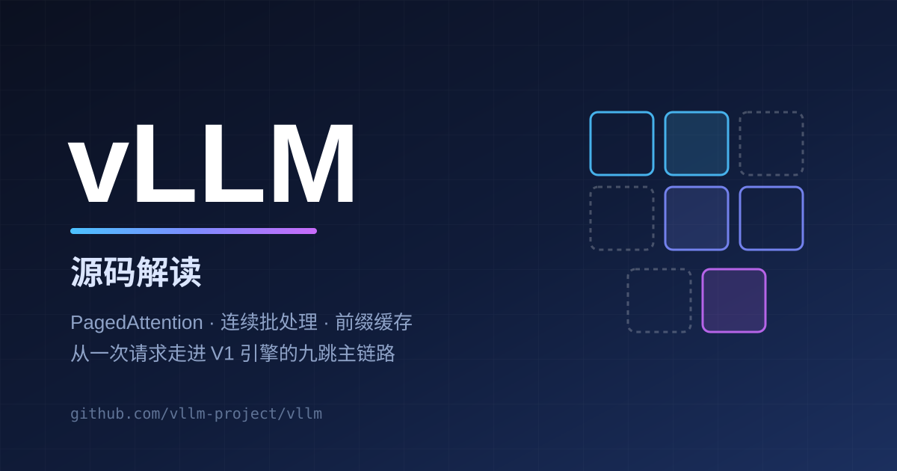

# vLLM 源码解读

> 快照：`main` 分支，commit `bbc4ddeca9ece9851aad26f03afc4bab37c6e8df`，核对日期 2026-09-24。正文中的路径、行号与行为描述均以该快照为准（[GitHub 永久链接](https://github.com/vllm-project/vllm/tree/bbc4ddeca9ece9851aad26f03afc4bab37c6e8df)）。快照处于版本号 `dev` 的开发态（`vllm/version.py:11`），功能以 commit 为锚点而非版本号。

vLLM 是目前最广泛使用的 LLM 推理服务引擎，它的辨识度来自三个机制：**PagedAttention** 把 KV Cache 按小块分页管理、让显存利用率接近上限；**连续批处理**（continuous batching）让请求随到随进、随完随走；**前缀缓存**让共享前缀的请求复用已算过的 KV。V1 引擎把这些机制组织成一个多进程流水线：API 进程只做协议与流式输出，EngineCore 进程负责调度，Worker 进程负责 GPU 执行。

本系列沿一条端到端主线读源码：**一次 `/v1/chat/completions` 请求**如何从 HTTP 路由进入 AsyncLLM，跨进程到达 EngineCore，被 Scheduler 以 token budget 切进批次，在 GPUModelRunner 里拼出 attention metadata 并执行前向，最后经采样、反词元化、流式通道回到调用方。

## 目录

- [定位与总体架构](/repos/vllm/overview)——V1 引擎的进程模型，一次请求的生命周期总览
- [仓库地图与模块边界](/repos/vllm/repo-map)——约 170 万行 Python 的仓库如何分而治之
- [三类入口：LLM、OpenAI Server 与 CLI](/repos/vllm/entrypoints)——离线批量与在线服务的入口层
- [AsyncLLM 与 EngineCore：进程边界上的引擎](/repos/vllm/engine-core)——ZMQ 消息通道与 step 忙循环
- [调度器：token budget、连续批处理与抢占](/repos/vllm/scheduler)——每一步调度哪些请求、各调度多少 token
- [PagedAttention 与 KV Cache 管理](/repos/vllm/kv-cache)——块池、哈希前缀缓存与淘汰
- [GPUModelRunner：把调度结果变成一次前向](/repos/vllm/model-runner)——持久批次、attention metadata 与 CUDA Graph
- [Attention 后端体系](/repos/vllm/attention)——注册表、能力声明与后端选择
- [采样与流式输出](/repos/vllm/sampling-output)——Sampler、增量反词元化与每请求流队列
- [模型加载与量化](/repos/vllm/model-loading)——权重加载器与量化方法的接入点
- [并行策略与执行器后端](/repos/vllm/parallelism)——TP / PP / DP / EP 与 uni / mp / ray 执行器
- [投机解码](/repos/vllm/spec-decode)——propose–verify 框架与 n-gram、Eagle、MTP 提案器
- [扩展点全景](/repos/vllm/extensions)——Platform、Plugin、KV Connector 与结构化输出
- [部署形态与可观测性](/repos/vllm/deployment)——多进程拓扑、指标与故障边界
- [附录 A：推荐阅读路径](/repos/vllm/appendix-reading)
- [附录 B：核心符号速查](/repos/vllm/appendix-symbols)
- [附录 C：术语表](/repos/vllm/appendix-glossary)

## References

- [vLLM 仓库](https://github.com/vllm-project/vllm)
- [PagedAttention 论文《Efficient Memory Management for Large Language Model Serving with PagedAttention》(SOSP'23)](https://dl.acm.org/doi/10.1145/3600006.3613165)
- [vLLM 官方文档站](https://docs.vllm.ai/)
