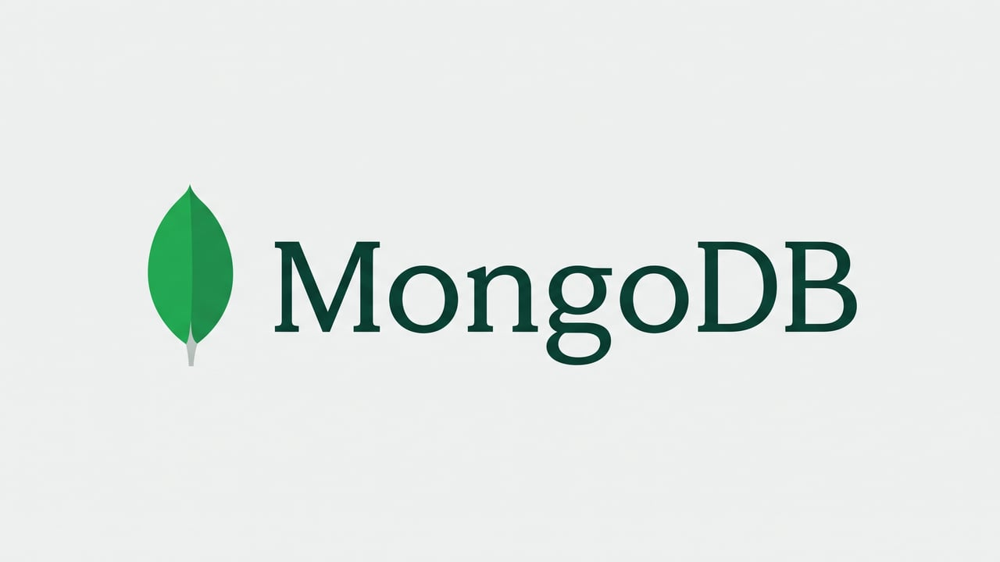

# MongoDB

本教程面向第一次接触 MongoDB 的开发者。你将使用 MongoDB 8.0、Docker、`mongosh` 和 PyMongo，完成一个可以查询、更新和统计任务的简单数据层。

内容基线：MongoDB 8.0（Docker 镜像 `mongo:8.0`）、`mongosh` 2.x、PyMongo 4.x，最后核对时间为 2026 年 9 月。

## 学习目标

完成本章节后，你将能够：

- 解释数据库、集合、文档和 BSON 之间的关系。
- 使用 `mongosh` 创建集合并完成增删改查。
- 使用聚合管道生成任务统计结果。
- 在 Python 程序中通过 PyMongo 访问同一组数据。

## 环境要求

- 已安装 Docker Desktop 或 Docker Engine。
- Docker 可以在本地映射 `27017` 端口。
- 已安装 Python 3.10 或更高版本（仅在学习 Python API 时需要）。
- 能够在终端中运行基本命令。

## 推荐顺序

1. [基本概念](/tech-stack/mongo/concept)：启动 MongoDB，并理解本教程的数据模型。&#8203;**必学**&#8203;，后续页面都依赖这里的容器和数据约定。
2. [集合操作](/tech-stack/mongo/collection)：创建 `users` 和 `tasks` 集合并准备示例数据。&#8203;**必学**&#8203;，后面的查询都以这组数据为准。
3. [增删改查](/tech-stack/mongo/document)：查询和修改任务文档。&#8203;**必学**&#8203;，这是日常使用最多的部分。
4. [聚合操作](/tech-stack/mongo/aggregation)：按状态、负责人和标签汇总任务。只需要简单查询时可暂时跳过。
5. [Python API](/tech-stack/mongo/pymongo)：使用 PyMongo 将命令写进 Python 程序。不使用 Python 的读者可以跳过。

每章末尾附有小结和练习。练习只需要已启动的 `mongosh` 或本地 Python 环境，不需要额外工具。

## 参考资料

- [MongoDB 手册](https://www.mongodb.com/docs/manual/)：概念、操作符和版本行为的权威来源。
- [mongosh 文档](https://www.mongodb.com/docs/mongodb-shell/)：Shell 的安装方式和命令参考。
- [PyMongo 官方文档](https://www.mongodb.com/docs/languages/python/pymongo-driver/current/)：Python 驱动的入门教程与 API 说明。
- [Docker Hub 的 mongo 镜像](https://hub.docker.com/_/mongo)：镜像标签、环境变量和数据持久化配置。
- [MongoDB 中文社区](https://www.mongodb.org.cn/)：中文资料和社区讨论。
