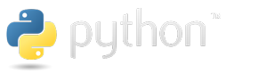

# Python

## Contents

- [Python 列表](/tech-stack/python/list)
- [Python 元组](/tech-stack/python/tuple)
- [Python 字典](/tech-stack/python/dict)
- [Python 集合](/tech-stack/python/set)
- [Python 字符串](/tech-stack/python/str)
- [Python 函数](/tech-stack/python/function)
- [Python 异常处理](/tech-stack/python/exception)
- [Python 魔法函数](/tech-stack/python/magic)
- [Python 面向对象](/tech-stack/python/o-o)
- [Python 多线程编程](/tech-stack/python/thread)
- [Python 正则表达式](/tech-stack/python/regex)
- [Python 处理 json 数据](/tech-stack/python/json)
- [iPython: Python 交互式 Shell](/tech-stack/python/ipython)
- [Python 操作系统调用](/tech-stack/python/os)
- [Python 装饰器](/tech-stack/python/decorator)
- [Python 包管理器](/tech-stack/python/pkg-manager)
- [Python 系统环境交互](/tech-stack/python/sys)

## References

- [Python.org](https://www.python.org)
- [菜鸟教程](https://www.runoob.com/)
